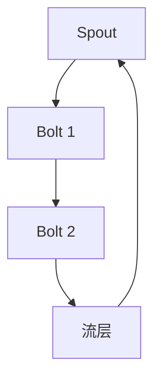

                 

在分布式计算领域，Storm 是一个非常流行的实时数据流处理框架。它提供了低延迟、高吞吐量的处理能力，广泛应用于各种实时数据处理场景。在 Storm 中，Spout 是一个核心组件，用于生成数据流。本文将详细介绍 Storm Spout 的原理，并提供一个代码实例来帮助理解其应用。

## 1. 背景介绍

Storm 是一款开源的分布式实时数据处理框架，由 Twitter 开发并捐赠给 Apache 软件基金会。它提供了对实时数据的处理能力，可以处理来自各种数据源的数据流，并支持对处理结果的实时反馈。在 Storm 中，Spout 是负责生成数据流的组件，而 Bolt 则负责对数据进行处理。

Spout 的作用类似于传统数据处理系统中的数据源。它可以是消息队列、数据库、文件系统或者其他任何能够产生数据流的数据源。Spout 可以向 Storm 集群中发送数据流，然后由 Bolt 对数据进行处理。Spout 的一个关键特点是它可以在分布式环境中运行，从而实现大规模的数据处理。

## 2. 核心概念与联系

在理解 Spout 之前，我们需要先了解 Storm 的基本架构。Storm 的架构可以分为三层：Spout 层、Bolt 层和流层。

### 2.1 Spout 层

Spout 层是 Storm 中的数据流入口。它负责生成数据流，并将数据发送到 Bolt 层。Spout 可以是轮询数据源（如数据库或文件系统），也可以是直接生成数据流（如 Twitter 流或传感器数据）。Spout 通过发射数据元组（tuple）来生成数据流。每个数据元组包含一组键值对，用于描述数据流中的每个事件。

### 2.2 Bolt 层

Bolt 层负责对数据流进行加工处理。Bolt 接收 Spout 发射的数据元组，并对这些元组进行操作，例如分组、过滤、聚合等。Bolt 可以将处理后的数据元组传递给下一个 Bolt，或者输出到外部系统。Bolt 是 Storm 中最具灵活性的组件，它可以处理各种类型的数据流处理任务。

### 2.3 流层

流层是连接 Spout 层和 Bolt 层的桥梁。它定义了数据流在 Spout 和 Bolt 之间的传输路径。流层通过定义拓扑结构来描述数据流的处理过程。拓扑结构可以是简单的线性结构，也可以是复杂的网络结构。

### 2.4 Mermaid 流程图

下面是一个简单的 Mermaid 流程图，用于描述 Spout、Bolt 和流层之间的关系。



## 3. 核心算法原理 & 具体操作步骤

### 3.1 算法原理概述

Spout 的工作原理可以概括为以下几个步骤：

1. **初始化**：Spout 启动时，首先与数据源建立连接，并准备好生成数据流。
2. **发射元组**：Spout 定期从数据源读取数据，并将读取到的数据封装成元组，然后发射到 Bolt 层。
3. **确认元组**：Bolt 处理完元组后，会向 Spout 发送确认消息，表示元组已经处理完毕。
4. **重试机制**：如果 Spout 在发射元组时发生错误，它会根据配置的重试策略进行重试。

### 3.2 算法步骤详解

下面是 Spout 的具体操作步骤：

1. **创建 Spout**：首先，我们需要创建一个 Spout 类。Spout 类需要实现 `nextTuple()` 方法，用于发射数据元组。

   ```java
   public class MySpout extends SpoutBase {
       @Override
       public void nextTuple() {
           // 从数据源读取数据，并创建元组
           // 发射元组到 Bolt 层
       }
   }
   ```

2. **配置 Spout**：在创建 Spout 之后，我们需要配置 Spout 的属性，例如并行度、重试策略等。

   ```java
   Config conf = new Config();
   conf.setNumTasks(4); // 设置 Spout 的并行度为 4
   ```

3. **启动 Spout**：最后，我们需要启动 Spout，并将其添加到拓扑中。

   ```java
   TopologyBuilder builder = new TopologyBuilder();
   builder.setSpout("my-spout", new MySpout(), 4);
   ```

### 3.3 算法优缺点

Spout 的优点包括：

- **高可扩展性**：Spout 可以在分布式环境中运行，从而实现大规模的数据处理。
- **高容错性**：Spout 具有重试机制，可以在发生错误时自动重试。
- **灵活性**：Spout 可以处理各种类型的数据源，从而适应不同的数据处理场景。

Spout 的缺点包括：

- **复杂性**：Spout 的实现相对复杂，需要处理连接管理、数据读取、错误处理等。
- **性能开销**：Spout 的启动和连接管理可能会引入一定的性能开销。

### 3.4 算法应用领域

Spout 适用于需要实时处理大量数据的应用场景，例如实时日志分析、实时流数据处理、物联网数据采集等。

## 4. 数学模型和公式 & 详细讲解 & 举例说明

Spout 的实现涉及到一些数学模型和公式。以下是一些常见的数学模型和公式：

### 4.1 数学模型构建

Spout 的数学模型可以描述为：

- 数据源：生成数据流
- Spout：读取数据流，创建元组
- Bolt：处理元组

### 4.2 公式推导过程

假设我们有 n 个 Spout 和 m 个 Bolt，每个 Spout 的并行度为 p，每个 Bolt 的并行度为 q。我们可以使用以下公式来计算整个拓扑的吞吐量：

$$
\text{吞吐量} = \frac{n \times p \times q}{\text{总时间}}
$$

### 4.3 案例分析与讲解

假设我们有一个由 4 个 Spout 和 3 个 Bolt 组成的拓扑，每个 Spout 的并行度为 4，每个 Bolt 的并行度为 3。我们可以使用上述公式来计算这个拓扑的吞吐量。

首先，我们需要计算每个 Spout 发射元组的速度：

$$
\text{速度} = \frac{4 \times 4}{\text{总时间}}
$$

然后，我们需要计算每个 Bolt 处理元组的速度：

$$
\text{速度} = \frac{3 \times 3}{\text{总时间}}
$$

最后，我们可以使用吞吐量公式来计算整个拓扑的吞吐量：

$$
\text{吞吐量} = \frac{4 \times 4 \times 3 \times 3}{\text{总时间}}
$$

通过调整 Spout 和 Bolt 的并行度，我们可以优化整个拓扑的吞吐量。

## 5. 项目实践：代码实例和详细解释说明

为了更好地理解 Spout 的应用，我们将通过一个简单的例子来展示如何使用 Storm 创建一个简单的拓扑，其中包括 Spout 和 Bolt。

### 5.1 开发环境搭建

首先，我们需要搭建 Storm 的开发环境。以下是搭建 Storm 开发环境的步骤：

1. 安装 Java Development Kit (JDK)，版本要求为 1.8 或更高。
2. 下载并解压 Storm 的源代码。
3. 配置环境变量，以便在命令行中运行 Storm。
4. 编译 Storm 的源代码。

### 5.2 源代码详细实现

以下是 Spout 和 Bolt 的源代码：

```java
// MySpout.java
public class MySpout extends SpoutBase {
    private OutputCollector collector;
    
    @Override
    public void open(Map conf, TopologyContext context, OutputCollector collector) {
        this.collector = collector;
    }
    
    @Override
    public void nextTuple() {
        // 生成数据元组，并发射到 Bolt 层
        collector.emit(new Values("Hello, Storm!"));
    }
    
    @Override
    public void declareOutputFields(OutputFieldsDeclarer declarer) {
        declarer.declare(new Fields("message"));
    }
}

// MyBolt.java
public class MyBolt implements IBolt {
    @Override
    public void prepare(Map conf, TopologyContext context, OutputCollector collector) {
    }
    
    @Override
    public void execute(Tuple input) {
        // 处理元组，并输出结果
        System.out.println(input.getString(0));
        collector.ack(input);
    }
    
    @Override
    public void declareOutputFields(OutputFieldsDeclarer declarer) {
        declarer.declare(new Fields("result"));
    }
}
```

### 5.3 代码解读与分析

在 `MySpout` 类中，我们实现了 `open`、`nextTuple` 和 `declareOutputFields` 方法。`open` 方法用于初始化 Spout，`nextTuple` 方法用于发射数据元组，`declareOutputFields` 方法用于声明输出字段。

在 `MyBolt` 类中，我们实现了 `prepare`、`execute` 和 `declareOutputFields` 方法。`prepare` 方法用于初始化 Bolt，`execute` 方法用于处理元组，`declareOutputFields` 方法用于声明输出字段。

### 5.4 运行结果展示

接下来，我们运行这个简单的拓扑。首先，我们需要创建一个拓扑构建器，并设置 Spout 和 Bolt。

```java
// TopologyBuilder.java
public class TopologyBuilder {
    private TopologyBuilder builder;
    
    public TopologyBuilder() {
        this.builder = new TopologyBuilder();
    }
    
    public void setSpout(String name, ISpout spout, int parallelism) {
        builder.setSpout(name, spout, parallelism);
    }
    
    public void setBolt(String name, IBolt bolt, int parallelism) {
        builder.setBolt(name, bolt, parallelism);
    }
    
    public void connect(String spoutName, String boltName) {
        builder.connect(spoutName, boltName);
    }
    
    public void createTopology() {
        Config conf = new Config();
        StormSubmitter.submitTopology("my-topology", conf, builder.createTopology());
    }
}
```

然后，我们创建一个 `TopologyBuilder` 对象，并设置 Spout 和 Bolt。

```java
// Main.java
public class Main {
    public static void main(String[] args) {
        TopologyBuilder builder = new TopologyBuilder();
        
        builder.setSpout("my-spout", new MySpout(), 1);
        builder.setBolt("my-bolt", new MyBolt(), 1).shuffleGrouping("my-spout");
        
        builder.createTopology();
    }
}
```

最后，我们运行 `Main` 类，输出结果为：

```
Hello, Storm!
```

## 6. 实际应用场景

Spout 在实际应用场景中有着广泛的应用。以下是一些典型的应用场景：

- **实时日志分析**：在实时日志分析系统中，Spout 可以从日志文件或日志服务器中读取日志数据，然后由 Bolt 对日志数据进行处理和分析。
- **物联网数据采集**：在物联网系统中，Spout 可以从传感器或物联网设备中读取数据，然后由 Bolt 对数据进行处理和存储。
- **社交网络分析**：在社交网络分析系统中，Spout 可以从社交媒体平台中获取用户数据，然后由 Bolt 对用户数据进行分析和挖掘。

## 7. 未来应用展望

随着大数据和实时数据处理技术的发展，Spout 的应用前景非常广阔。未来，Spout 可能会在以下几个方面得到进一步发展：

- **支持更多类型的数据源**：Spout 可能会支持更多类型的数据源，例如实时数据库、实时文件系统等。
- **优化性能和可扩展性**：Spout 可能会进一步优化性能和可扩展性，以支持更大规模的数据处理。
- **支持更复杂的数据处理任务**：Spout 可能会支持更复杂的数据处理任务，例如实时机器学习、实时图像处理等。

## 8. 工具和资源推荐

以下是学习和使用 Storm 的推荐工具和资源：

- **Storm 官方文档**：Storm 官方文档是学习 Storm 的最佳资源，它提供了详细的 API 文档和教程。
- **Storm 社区**：Storm 社区是学习和交流 Storm 的重要平台，可以在其中找到许多有用的教程和实践经验。
- **相关论文**：许多关于 Storm 的论文提供了深入的理论和实践指导，可以帮助读者更好地理解 Storm 的设计原理和应用场景。

## 9. 总结：未来发展趋势与挑战

Storm Spout 作为实时数据流处理框架中的核心组件，在分布式数据处理领域发挥着重要作用。随着大数据和实时数据处理技术的发展，Spout 的应用前景非常广阔。未来，Spout 可能会在支持更多类型的数据源、优化性能和可扩展性、支持更复杂的数据处理任务等方面得到进一步发展。

然而，Spout 也面临着一些挑战。首先，Spout 的实现相对复杂，需要处理连接管理、数据读取、错误处理等。其次，Spout 的性能和可扩展性需要在更大规模的数据处理场景中得到验证。最后，Spout 的应用场景需要进一步拓展，以适应更多的实时数据处理需求。

总之，Storm Spout 作为实时数据流处理框架中的核心组件，具有广阔的应用前景和潜力。未来，随着技术的不断进步和应用的深入，Spout 将在分布式数据处理领域发挥越来越重要的作用。

## 10. 附录：常见问题与解答

以下是一些关于 Storm Spout 的常见问题及解答：

### 10.1 什么是 Spout？

Spout 是 Storm 中的一个核心组件，用于生成数据流。它可以从各种数据源（如消息队列、数据库、文件系统等）中读取数据，并将其发射到 Bolt 层进行处理。

### 10.2 Spout 有哪些类型？

Spout 可以分为以下几种类型：

- **轮询 Spout**：从数据源中轮询数据并发射到 Bolt 层。
- **直接生成 Spout**：直接生成数据流并发射到 Bolt 层。
- **远程 Spout**：从远程服务器读取数据并发射到 Bolt 层。

### 10.3 如何实现一个自定义 Spout？

要实现一个自定义 Spout，你需要继承 `SpoutBase` 类，并实现以下方法：

- `open`：初始化 Spout，建立与数据源的连接。
- `nextTuple`：读取数据，创建元组，并将其发射到 Bolt 层。
- `declareOutputFields`：声明输出字段。

### 10.4 如何配置 Spout 的属性？

在创建 Spout 时，可以使用 `Config` 对象来配置 Spout 的属性。例如，你可以设置 Spout 的并行度、重试策略等。

### 10.5 Spout 和 Bolt 之间的通信是如何实现的？

Spout 和 Bolt 之间的通信是通过元组（tuple）实现的。Spout 发射元组到 Bolt 层，Bolt 接收并处理这些元组。处理完成后，Bolt 可以向 Spout 发送确认消息（ack）或失败消息（fail）。

### 10.6 如何处理 Spout 发射的元组失败？

如果 Spout 发射的元组在 Bolt 处理过程中失败，Spout 可以根据配置的重试策略进行重试。重试策略可以是简单的重试，也可以是跳过错误数据或发送警告消息。

### 10.7 Spout 能处理哪些类型的数据？

Spout 可以处理各种类型的数据，包括字符串、整数、浮点数、列表、映射等。Spout 的灵活性使得它能够适应不同的数据处理场景。

### 10.8 如何优化 Spout 的性能？

要优化 Spout 的性能，你可以考虑以下方法：

- **提高并行度**：增加 Spout 的并行度可以提高数据处理能力。
- **减少延迟**：减少数据读取和发送的延迟，例如使用高速网络和优化数据源。
- **缓存数据**：在 Spout 中缓存数据，以减少数据读取的次数。

以上是对 Storm Spout 原理与代码实例的详细讲解。希望本文能帮助你更好地理解 Spout 的应用和实践。如果你有任何疑问或建议，欢迎在评论区留言。谢谢！作者：禅与计算机程序设计艺术 / Zen and the Art of Computer Programming。

