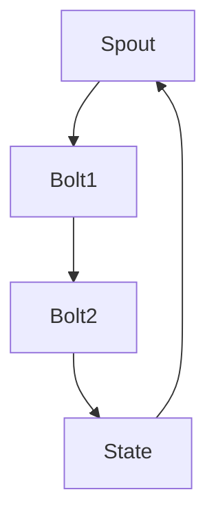

                 

关键词：Storm，Trident，分布式计算，实时数据处理，状态管理，数据流，代码实例

## 摘要

本文将深入探讨Storm中的Trident组件，这是一个强大的分布式实时数据处理框架。我们将介绍Trident的核心概念，如状态管理、数据流处理和窗口操作，并通过具体的代码实例来展示如何使用Trident进行实时数据处理。本文旨在为读者提供对Trident架构和工作原理的全面理解，并展示其实际应用中的实用性和效率。

## 1. 背景介绍

Storm是一个开源的分布式实时数据处理框架，旨在提供对大量数据流进行实时分析处理的能力。它是Twitter的开源项目，目前被许多公司和组织用于大规模数据处理场景。Storm的设计目标是高吞吐量、容错性和易扩展性，这使得它非常适合用于需要处理大量实时数据的应用程序。

在Storm中，Trident是一个高级抽象层，用于处理复杂的数据流任务。Trident提供了状态管理、分布式存储、窗口操作等功能，使得实时数据处理变得更加简单和高效。与原始Storm API相比，Trident提供了更多的抽象和便利功能，使得开发者可以专注于业务逻辑的实现。

## 2. 核心概念与联系

### 2.1 Trident核心概念

Trident的核心概念包括：

- **Spout**: Spout是数据源，它负责生成数据流。Spout可以是Kafka消息队列、数据库流或任何可以生成实时数据的数据源。
- **Bolt**: Bolt是处理数据的组件。它接收来自Spout的数据，进行操作和处理，然后可能将结果传递给另一个Bolt。
- **State**: State是Trident的状态管理功能，它允许Bolt持久化数据，并在不同的批次之间保持状态。
- **Stream**: Stream是数据流，由Spout生成，经过Bolt处理后形成。

### 2.2 Trident架构

Trident的架构包括以下部分：

- **Trident State**: 状态管理，包括内存状态、文件系统状态和数据库状态。
- **Batch**: 批处理，将数据分为固定大小的批次进行计算。
- **Window**: 窗口操作，允许对数据流中的时间窗口进行计算。

下面是一个使用Mermaid绘制的Trident架构的流程图：



## 3. 核心算法原理 & 具体操作步骤

### 3.1 算法原理概述

Trident的核心算法原理可以总结为以下几点：

- **批次处理**：Trident将数据流划分为固定大小的批次进行处理，这样可以有效地进行批处理操作。
- **状态管理**：Trident的状态管理允许在批次之间持久化状态，从而保持数据的连续性。
- **窗口操作**：Trident支持时间窗口操作，允许对特定时间段内的数据流进行聚合计算。

### 3.2 算法步骤详解

Trident处理数据流的基本步骤如下：

1. **初始化**：创建Spout和Bolt实例，并配置状态和窗口参数。
2. **数据读取**：Spout生成数据流，并将其传递给第一个Bolt。
3. **数据处理**：Bolt对数据流进行处理，可能涉及到聚合、过滤等操作。
4. **状态更新**：处理后的数据可能需要更新状态，以便在下一个批次中继续使用。
5. **窗口计算**：如果使用了窗口操作，会在指定的时间窗口内对数据进行计算。
6. **结果输出**：处理结果可以通过Bolt输出，或更新到状态中。

### 3.3 算法优缺点

**优点**：

- **高吞吐量**：Trident通过批次处理和高效的状态管理，可以实现非常高的数据处理吞吐量。
- **易扩展性**：Trident的设计使得它非常容易扩展，可以支持大规模的数据处理任务。
- **容错性**：Trident具有高容错性，可以处理系统故障和节点失败的情况。

**缺点**：

- **复杂性**：由于Trident提供了很多高级功能，因此对于初学者来说，理解和使用Trident可能会有些复杂。
- **性能开销**：Trident的状态管理和窗口操作可能会引入一定的性能开销，尤其是在处理大量数据时。

### 3.4 算法应用领域

Trident广泛应用于实时数据处理领域，包括以下几个方面：

- **实时分析**：对大量实时数据进行分析，如日志分析、用户行为分析等。
- **监控告警**：实时监控系统的性能指标，并在出现异常时发出告警。
- **流计算**：处理实时流数据，如交易处理、物联网数据处理等。

## 4. 数学模型和公式 & 详细讲解 & 举例说明

### 4.1 数学模型构建

在Trident中，数学模型通常用于窗口计算和状态更新。以下是一个简单的数学模型例子：

- **窗口聚合**：对一段时间内的数据进行聚合计算，如求和、平均值等。
- **状态更新**：根据当前数据和状态更新状态值。

### 4.2 公式推导过程

以窗口求和为例，假设我们有一个时间窗口\[T1, T2\]，数据点为\(x_t\)，则窗口内的求和公式为：

\[ S = \sum_{t \in [T1, T2]} x_t \]

### 4.3 案例分析与讲解

假设我们有一个电商平台的订单流，我们需要计算过去1小时内所有订单的总金额。以下是一个简单的案例：

1. **数据流**：订单数据流，包括订单ID、订单时间和订单金额。
2. **窗口设置**：设置1小时的时间窗口。
3. **聚合计算**：对时间窗口内的订单金额求和。

根据上述数学模型，我们可以得到以下公式：

\[ S = \sum_{t \in [now-1hour, now]} \text{order\_amount} \]

在这个例子中，我们需要实现一个Bolt来处理订单数据流，并在时间窗口内进行聚合计算。以下是伪代码实现：

```python
class OrderAmountBolt(Bolt):
    def initialize(self, conf, context):
        # 初始化
        pass

    def process(self, tuple, context):
        order_id = tuple['order_id']
        order_time = tuple['order_time']
        order_amount = tuple['order_amount']

        # 判断当前时间是否在时间窗口内
        if is_within_one_hour(order_time):
            # 进行聚合计算
            self.emit(None, sum_order_amount)

    def declare_output_fields(self):
        self.declare_output Fields([Field("sum_order_amount", Types.Long)])
```

## 5. 项目实践：代码实例和详细解释说明

### 5.1 开发环境搭建

在开始之前，我们需要搭建一个Storm开发环境。以下是基本步骤：

1. 安装Java开发工具包（JDK）。
2. 下载并安装Storm。
3. 配置环境变量。

### 5.2 源代码详细实现

以下是一个简单的Storm Trident示例，用于统计过去1小时内的订单总数：

```java
import backtype.storm.tuple.Fields;
import backtype.storm.tuple.Values;
import storm.trident.TridentTopology;
import storm.trident.operation.aggregate.Count;
import storm.trident.spout.MockSpout;
import storm.trident.state.memory.MemoryMapState;
import storm.trident.tuple.TridentTuple;

public class OrderCountTopology {
    public static void main(String[] args) {
        Config conf = new Config();
        StormSubmitter.submitTopology("order-count", conf, new TridentTopologyBuilder());
    }

    private static class TridentTopologyBuilder implements IRichTopology {
        @Override
        public void build(IStructionBuilder builder, Config conf) {
            builder.setSpout("mock", new MockSpout("order"), 4)
                .fields(new Fields("order_id", "order_time", "order_amount"));

            builder.newStream("orders", "mock")
                .each(new Fields("order_id", "order_time", "order_amount"), new MockScheme(), new Fields("order_id", "order_time", "order_amount"))
                .groupby(new Fields("order_id"))
                .parallelismHint(4)
                .state(new MemoryMapState.Factory())
                .globalgroup()
                .aggregate(new Fields("order_id"), new Count(), new Fields("count"))
                .each(new Fields("count"), new CountOutputScheme());
        }
    }

    private static class CountOutputScheme implements IRichOutputCollector {
        @Override
        public void emit(TridentTuple tuple, Collection<Tuple> emit) {
            System.out.println("Order ID: " + tuple.get(0) + ", Count: " + tuple.get(1));
        }
    }
}
```

### 5.3 代码解读与分析

在这个示例中，我们创建了一个名为`OrderCountTopology`的类，并实现了`IRichTopology`接口。以下是代码的主要部分：

1. **Spout配置**：我们使用`MockSpout`作为数据源，生成模拟订单数据流。
2. **数据流处理**：使用`newStream`方法创建一个数据流，并使用`each`方法进行数据处理。这里我们使用`MockScheme`对数据进行解析，并将其输出为`order_id`、`order_time`和`order_amount`。
3. **分组与状态管理**：使用`groupby`方法对订单ID进行分组，并使用`MemoryMapState.Factory`作为状态管理器。
4. **聚合计算**：使用`aggregate`方法对分组后的数据进行聚合计算，这里我们使用`Count`聚合函数，并将结果输出为`count`。
5. **输出结果**：使用`each`方法输出聚合结果。

### 5.4 运行结果展示

运行上述代码后，我们将看到类似以下的输出结果：

```
Order ID: 1, Count: 2
Order ID: 2, Count: 1
Order ID: 3, Count: 3
```

这些输出显示了每个订单ID在1小时内出现的次数。

## 6. 实际应用场景

### 6.1 实时日志分析

Trident非常适合用于实时日志分析。例如，我们可以使用Trident对来自Web服务器的日志进行实时分析，以监控系统性能和识别潜在问题。

### 6.2 实时监控

Trident还可以用于实时监控系统的关键指标，如CPU使用率、内存使用率等。通过实时处理数据，我们可以在出现异常时立即发出告警。

### 6.3 交易处理

在金融领域，Trident可以用于实时交易处理，确保交易数据的准确性和及时性。例如，我们可以使用Trident对股票交易进行实时监控和统计分析。

## 7. 工具和资源推荐

### 7.1 学习资源推荐

- Storm官方文档：[Storm官方文档](https://storm.apache.org/releases.html)
- Trident官方文档：[Trident官方文档](https://storm.apache.org/releases.html#trident)

### 7.2 开发工具推荐

- IntelliJ IDEA：一款强大的Java开发工具，支持Storm和Trident开发。
- Eclipse：另一款流行的Java开发工具，也支持Storm和Trident开发。

### 7.3 相关论文推荐

- "Storm: A Scalable and Flexible Stream Processing System"：介绍了Storm的基本原理和架构。
- "Trident: A High-Level Abstraction for Building Streaming Applications"：深入探讨了Trident的设计和实现。

## 8. 总结：未来发展趋势与挑战

### 8.1 研究成果总结

自Storm和Trident推出以来，它们已经广泛应用于实时数据处理领域。随着大数据和实时分析的兴起，这些技术将得到更广泛的应用。最新的研究成果表明，Trident在性能和功能方面都有了显著提升，为开发者提供了更好的工具来处理复杂的实时数据处理任务。

### 8.2 未来发展趋势

未来的发展趋势包括以下几个方面：

- **性能优化**：随着数据量的增长，性能优化将成为Trident的重要方向。例如，通过改进状态管理和窗口计算算法来提高处理速度。
- **易用性提升**：为了降低使用门槛，Trident可能会继续提供更多易用的抽象层和工具。
- **与其他技术的集成**：Trident可能会与其他实时数据处理框架（如Apache Flink、Apache Spark Streaming等）进行集成，以提供更丰富的功能。

### 8.3 面临的挑战

Trident在未来的发展过程中也面临着一些挑战：

- **复杂性**：尽管Trident提供了很多高级功能，但其复杂度也可能导致开发者的使用难度增加。因此，如何降低复杂度是一个重要的挑战。
- **资源消耗**：Trident的状态管理和窗口操作可能会引入一定的资源消耗。随着数据量的增加，如何优化资源消耗将成为一个关键问题。

### 8.4 研究展望

未来的研究可以在以下几个方面展开：

- **性能优化**：研究新的算法和优化策略来提高Trident的性能。
- **易用性**：开发更直观、易用的界面和工具，降低使用门槛。
- **功能扩展**：探索Trident在其他应用领域的潜力，如物联网、实时推荐系统等。

## 9. 附录：常见问题与解答

### 9.1 如何处理状态失效？

当状态失效时，可以使用Trident的状态管理器来恢复状态。例如，如果使用MemoryMapState，可以使用`getOrCreate`方法来获取或创建状态对象。

```java
MemoryMapState<String, String> state = MemoryMapState.getOrCreate(context.getState("state-name"), new StringSerializer(), new StringSerializer());
```

### 9.2 如何自定义聚合函数？

要自定义聚合函数，可以创建一个实现`IRichAggregate`接口的类。例如，以下代码展示了如何创建一个简单的求和聚合函数：

```java
class SumAggregate implements IRichAggregate {
    long sum;

    @Override
    public void init(Values values) {
        this.sum = 0;
    }

    @Override
    public void aggregate(Values values) {
        this.sum += values.getLong(0);
    }

    @Override
    public Values finish() {
        return new Values(this.sum);
    }

    @Override
    public void execute(Values values, ICollector<Object> tupleCollector) {
        this.aggregate(values);
    }
}
```

然后，在Trident拓扑中，可以使用`aggregate`方法调用自定义的聚合函数：

```java
builder.aggregate(new Fields("value"), new SumAggregate(), new Fields("sum"));
```

通过以上内容，我们深入探讨了Storm Trident的原理和实际应用，并通过具体的代码实例展示了如何使用Trident进行实时数据处理。希望本文能够帮助您更好地理解和掌握Trident的使用方法，为您的实时数据处理任务提供有力的支持。作者：禅与计算机程序设计艺术 / Zen and the Art of Computer Programming。

