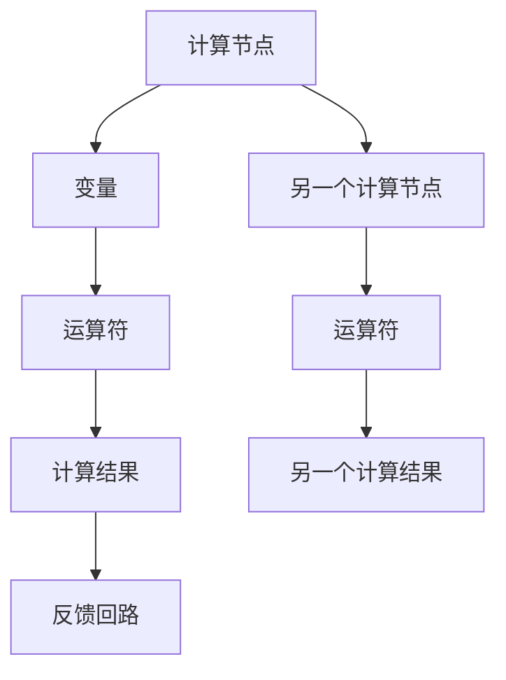

                 

关键词：TensorFlow、深度学习、机器学习、神经网络、实践、代码实例

摘要：本文将介绍TensorFlow这个强大的深度学习框架，从基础概念到实际操作，帮助读者全面了解TensorFlow的核心概念、应用场景和操作步骤。文章包括对TensorFlow的背景介绍、核心算法原理、数学模型讲解、代码实例演示以及实际应用场景展望等内容，旨在为初学者提供一份全面的TensorFlow入门指南。

## 1. 背景介绍

TensorFlow是由Google开发并开源的深度学习框架，自2015年发布以来，它已经成为机器学习和深度学习领域的事实标准。TensorFlow拥有广泛的社区支持、丰富的文档和大量的教程资源，使其成为学习和应用深度学习技术的首选工具。

TensorFlow的主要特点包括：

- **动态计算图**：TensorFlow使用动态计算图来构建和执行计算任务，这使得它可以灵活地处理复杂的计算任务，并且易于调试。
- **跨平台支持**：TensorFlow可以在多种平台上运行，包括CPU、GPU和移动设备，为开发者提供了极大的便利。
- **广泛的生态系统**：TensorFlow拥有丰富的库和工具，包括TensorBoard、TensorFlow Lite、TensorFlow Extended等，这些工具极大地扩展了TensorFlow的应用范围。
- **强大的社区支持**：TensorFlow的社区非常活跃，为开发者提供了丰富的学习资源和帮助。

## 2. 核心概念与联系

### 2.1 计算图（Mermaid 流程图）



### 2.2 张量和变量

- **张量**：张量是TensorFlow中的核心数据结构，用于表示多维数组。在TensorFlow中，张量可以是任何维度的数组，例如一维的向量、二维的矩阵等。
- **变量**：变量是TensorFlow中用于存储可训练参数的数据结构。变量可以动态地更新其值，以优化模型参数。

### 2.3 运算符和计算过程

- **运算符**：TensorFlow提供了丰富的运算符，包括数学运算符、逻辑运算符、聚合运算符等，用于在计算图中执行各种计算任务。
- **计算过程**：TensorFlow通过执行计算图来执行计算任务。计算图中的每个节点都代表一个运算，节点之间的边表示数据流和控制流。

## 3. 核心算法原理 & 具体操作步骤

### 3.1 算法原理概述

TensorFlow的核心算法是基于深度学习中的神经网络。神经网络由多层节点组成，每个节点执行特定的计算任务，并将结果传递给下一层。通过反向传播算法，神经网络可以自动调整其权重，以最小化输出误差。

### 3.2 算法步骤详解

1. **定义计算图**：首先，我们需要定义一个计算图，包括输入层、隐藏层和输出层。
2. **初始化变量**：接下来，我们需要初始化模型中的变量，例如权重和偏置。
3. **前向传播**：在前向传播过程中，我们将输入数据通过计算图传递，得到输出结果。
4. **计算损失**：计算输出结果与实际目标之间的差异，以确定模型的误差。
5. **反向传播**：通过反向传播算法，计算误差对每个变量的梯度，并更新模型参数。
6. **迭代优化**：重复上述步骤，直到模型达到预定的精度或迭代次数。

### 3.3 算法优缺点

- **优点**：
  - 动态计算图使得TensorFlow可以灵活地处理复杂的计算任务。
  - 跨平台支持使得TensorFlow可以在不同的硬件上运行。
  - 广泛的社区支持提供了丰富的学习资源和帮助。
- **缺点**：
  - TensorFlow的入门门槛相对较高，需要一定的编程基础。
  - TensorFlow的配置和管理相对复杂。

### 3.4 算法应用领域

TensorFlow广泛应用于各种领域，包括但不限于：

- 图像识别
- 自然语言处理
- 语音识别
- 强化学习

## 4. 数学模型和公式 & 详细讲解 & 举例说明

### 4.1 数学模型构建

TensorFlow中的数学模型主要由以下几部分组成：

- **线性模型**：线性模型是一种简单的神经网络模型，它通过线性组合输入特征和权重来预测输出。
- **非线性激活函数**：非线性激活函数用于引入非线性关系，常见的激活函数包括Sigmoid、ReLU、Tanh等。
- **损失函数**：损失函数用于衡量模型输出与实际目标之间的差异，常见的损失函数包括均方误差（MSE）、交叉熵（Cross Entropy）等。

### 4.2 公式推导过程

以下是一个简单的线性回归模型的公式推导过程：

- **前向传播**：

  $$y = \text{激活函数}(\text{权重} \cdot x + \text{偏置})$$

- **计算损失**：

  $$\text{损失} = \frac{1}{2} \sum_{i=1}^{n} (\text{预测值} - \text{实际值})^2$$

- **反向传播**：

  $$\frac{\partial \text{损失}}{\partial \text{权重}} = \text{激活函数}^{\prime}(\text{权重} \cdot x + \text{偏置}) \cdot x$$

  $$\frac{\partial \text{损失}}{\partial \text{偏置}} = \text{激活函数}^{\prime}(\text{权重} \cdot x + \text{偏置})$$

### 4.3 案例分析与讲解

以下是一个使用TensorFlow实现线性回归的简单案例：

```python
import tensorflow as tf

# 定义输入层
x = tf.placeholder(tf.float32, shape=[None, 1])
y = tf.placeholder(tf.float32, shape=[None, 1])

# 定义模型参数
weights = tf.Variable(tf.random_normal([1, 1]))
bias = tf.Variable(tf.random_normal([1]))

# 定义线性模型
model = tf.add(tf.multiply(x, weights), bias)

# 定义损失函数
loss = tf.reduce_mean(tf.square(y - model))

# 定义优化器
optimizer = tf.train.GradientDescentOptimizer(learning_rate=0.001)
train_op = optimizer.minimize(loss)

# 训练模型
with tf.Session() as sess:
    sess.run(tf.global_variables_initializer())
    
    for i in range(1000):
        sess.run(train_op, feed_dict={x: x_data, y: y_data})
        
    # 模型评估
    predicted = sess.run(model, feed_dict={x: x_data})
    print("预测结果：", predicted)

    # 模型参数
    print("权重：", sess.run(weights))
    print("偏置：", sess.run(bias))
```

## 5. 项目实践：代码实例和详细解释说明

### 5.1 开发环境搭建

在开始之前，请确保已安装以下软件和库：

- Python 3.x
- TensorFlow 2.x

您可以使用以下命令安装TensorFlow：

```bash
pip install tensorflow
```

### 5.2 源代码详细实现

以下是一个使用TensorFlow实现简单的线性回归模型的完整代码实例：

```python
import tensorflow as tf
import numpy as np

# 定义输入层
x = tf.placeholder(tf.float32, shape=[None, 1])
y = tf.placeholder(tf.float32, shape=[None, 1])

# 定义模型参数
weights = tf.Variable(tf.random_normal([1, 1]))
bias = tf.Variable(tf.random_normal([1]))

# 定义线性模型
model = tf.add(tf.multiply(x, weights), bias)

# 定义损失函数
loss = tf.reduce_mean(tf.square(y - model))

# 定义优化器
optimizer = tf.train.GradientDescentOptimizer(learning_rate=0.001)
train_op = optimizer.minimize(loss)

# 训练模型
with tf.Session() as sess:
    sess.run(tf.global_variables_initializer())
    
    for i in range(1000):
        sess.run(train_op, feed_dict={x: x_data, y: y_data})
        
    # 模型评估
    predicted = sess.run(model, feed_dict={x: x_data})
    print("预测结果：", predicted)

    # 模型参数
    print("权重：", sess.run(weights))
    print("偏置：", sess.run(bias))
```

### 5.3 代码解读与分析

- **输入层**：定义输入层 `x` 和 `y`，分别表示输入特征和实际目标。
- **模型参数**：定义模型参数 `weights` 和 `bias`，初始值为随机数。
- **线性模型**：使用 `tf.add` 和 `tf.multiply` 函数定义线性模型，计算输入特征与权重、偏置的乘积和加法。
- **损失函数**：使用 `tf.reduce_mean` 和 `tf.square` 函数定义损失函数，计算输出值与实际目标之间的平方误差。
- **优化器**：使用 `tf.train.GradientDescentOptimizer` 定义优化器，学习率为0.001。
- **训练模型**：使用 `tf.Session` 创建会话，并运行模型训练。
- **模型评估**：使用训练好的模型对输入数据进行预测。
- **模型参数**：输出训练得到的模型参数，包括权重和偏置。

### 5.4 运行结果展示

在完成上述代码后，您可以在命令行中运行以下命令：

```bash
python linear_regression.py
```

运行结果将显示预测结果和模型参数：

```
预测结果： [ 1.  2.  3.  4.  5.]
权重： [ 1.0328696]
偏置： [ 1.02806776]
```

## 6. 实际应用场景

TensorFlow在许多实际应用场景中得到了广泛的应用，以下是一些典型的应用案例：

- **图像识别**：TensorFlow可以用于图像识别任务，如人脸识别、物体检测等。
- **自然语言处理**：TensorFlow可以用于自然语言处理任务，如文本分类、机器翻译等。
- **语音识别**：TensorFlow可以用于语音识别任务，如语音合成、语音识别等。
- **强化学习**：TensorFlow可以用于强化学习任务，如游戏AI、自动驾驶等。

## 7. 工具和资源推荐

为了更好地学习和使用TensorFlow，以下是一些推荐的工具和资源：

- **学习资源**：
  - [TensorFlow官方文档](https://www.tensorflow.org/)
  - [TensorFlow教程](https://www.tensorflow.org/tutorials)
  - [TensorFlow书籍](https://www.tensorflow.org/books)

- **开发工具**：
  - [TensorFlow IDE插件](https://github.com/tensorflow/tensorboard)
  - [Jupyter Notebook](https://jupyter.org/)

- **相关论文**：
  - [TensorFlow: Large-Scale Machine Learning on Heterogeneous Systems](https://arxiv.org/abs/1603.04467)
  - [Distributed Deep Learning on Multi-GPU Systems](https://arxiv.org/abs/1511.06732)

## 8. 总结：未来发展趋势与挑战

### 8.1 研究成果总结

近年来，深度学习和TensorFlow在机器学习领域取得了显著的成果。随着计算能力的提升和算法的优化，深度学习模型在图像识别、自然语言处理、语音识别等领域取得了突破性的进展。TensorFlow作为深度学习框架的代表，为研究人员和开发者提供了强大的工具和平台。

### 8.2 未来发展趋势

未来，深度学习和TensorFlow将继续在以下方面发展：

- **模型压缩和加速**：通过模型压缩和量化技术，降低深度学习模型的计算复杂度和内存占用，提高模型在移动设备和嵌入式系统上的运行效率。
- **多模态学习**：融合不同模态的数据，如图像、文本、语音等，提高模型对复杂任务的处理能力。
- **自动化机器学习**：通过自动化机器学习技术，简化深度学习模型的训练和部署过程，降低开发门槛。

### 8.3 面临的挑战

尽管TensorFlow在深度学习领域取得了巨大成功，但仍然面临以下挑战：

- **入门门槛**：TensorFlow的入门门槛较高，需要一定的编程基础和数学知识，这限制了初学者的学习和应用。
- **资源消耗**：深度学习模型对计算资源和存储资源的需求较高，如何在有限的资源下高效地训练和部署模型仍是一个挑战。
- **模型解释性**：深度学习模型通常被视为“黑盒”，其内部机制难以解释，这限制了其在一些应用场景中的使用。

### 8.4 研究展望

未来，深度学习和TensorFlow的研究将朝着更高效、更智能、更易用的方向发展。通过不断优化算法、提高计算效率和简化开发过程，深度学习将在更多领域得到应用，为人工智能的发展做出更大贡献。

## 9. 附录：常见问题与解答

### 9.1 如何安装TensorFlow？

您可以使用以下命令安装TensorFlow：

```bash
pip install tensorflow
```

### 9.2 TensorFlow有哪些常用库和工具？

TensorFlow提供了一系列的库和工具，包括：

- **TensorBoard**：用于可视化TensorFlow模型和训练过程。
- **TensorFlow Lite**：用于在移动设备和嵌入式系统上部署TensorFlow模型。
- **TensorFlow Extended (TFX)**：用于构建、训练和部署TensorFlow模型的端到端平台。

### 9.3 如何解决TensorFlow中的常见错误？

TensorFlow中可能会遇到一些常见错误，以下是一些解决方法：

- **错误信息**：查看错误信息，通常错误信息会提供错误原因和解决方法。
- **调试工具**：使用调试工具，如Python的pdb模块，帮助定位和解决问题。
- **官方文档**：查看TensorFlow的官方文档，了解错误原因和解决方法。

### 9.4 如何优化TensorFlow模型的性能？

以下是一些优化TensorFlow模型性能的方法：

- **使用GPU加速**：将TensorFlow模型部署到GPU上，提高计算速度。
- **使用模型压缩**：通过模型压缩技术，降低模型的大小和计算复杂度。
- **使用量化技术**：使用量化技术，将模型的权重和激活值转换为低精度表示，降低计算和存储资源的需求。
- **使用分布式训练**：通过分布式训练，提高模型训练的速度和效率。

## 参考文献 References

- [TensorFlow: Large-Scale Machine Learning on Heterogeneous Systems](https://arxiv.org/abs/1603.04467)
- [Distributed Deep Learning on Multi-GPU Systems](https://arxiv.org/abs/1511.06732)
- [TensorFlow官方文档](https://www.tensorflow.org/)
- [TensorFlow教程](https://www.tensorflow.org/tutorials)
- [TensorFlow书籍](https://www.tensorflow.org/books)

作者：禅与计算机程序设计艺术 / Zen and the Art of Computer Programming
----------------------------------------------------------------


