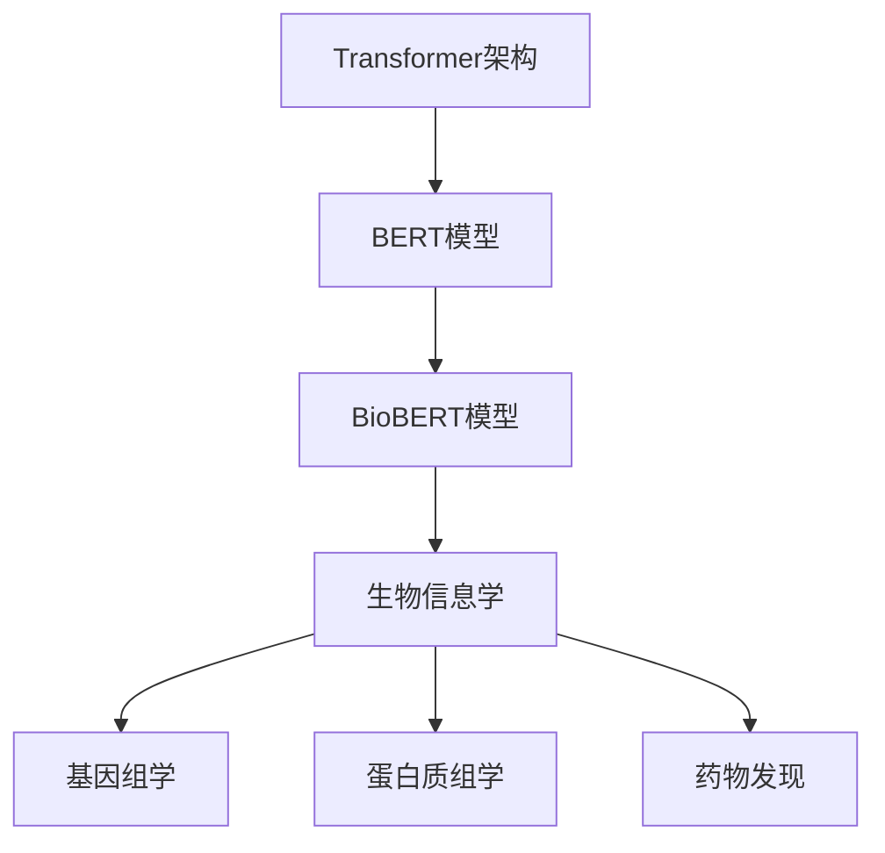

                 

关键词：Transformer、BioBERT、大模型、生物信息学、深度学习、自然语言处理

> 摘要：本文将深入探讨Transformer大模型在生物信息学领域的应用，重点介绍BioBERT模型的原理、构建方法以及实际应用场景。通过详细解析BioBERT模型的数学模型、算法原理和代码实现，我们希望为读者提供一套完整的Transformer大模型实战指南。

## 1. 背景介绍

随着生物信息学领域的迅速发展，对大量生物数据的处理和分析变得尤为重要。传统的深度学习方法在处理生物学文本数据时存在一些局限性，如数据预处理复杂、模型训练耗时较长等。为了解决这些问题，Transformer架构因其并行计算优势和强大的表征能力而被引入到生物信息学领域。

BioBERT模型是基于Transformer架构的一个大规模预训练模型，主要用于生物文本数据的处理和分析。它结合了BERT（Bidirectional Encoder Representations from Transformers）模型的结构，并针对生物领域的特定词汇和实体进行了优化。BioBERT模型的出现为生物信息学研究提供了强大的工具，使其在基因组学、蛋白质组学、药物发现等领域取得了显著的成果。

本文将详细介绍BioBERT模型的原理、构建方法及其在实际应用中的表现。希望通过本文的介绍，读者能够全面了解Transformer大模型在生物信息学领域的应用潜力，并能够基于BioBERT模型开展自己的研究工作。

## 2. 核心概念与联系

在介绍BioBERT模型之前，我们需要先了解几个核心概念，包括Transformer架构、BERT模型以及生物信息学的基本知识。以下是一个Mermaid流程图，用于展示这些概念之间的联系。



### 2.1 Transformer架构

Transformer架构是一种基于自注意力机制的序列模型，首次在论文《Attention Is All You Need》中提出。其核心思想是通过自注意力机制来计算序列中每个词与其他词之间的关系，从而实现全局的上下文理解。Transformer架构具有并行计算的优势，使得其在处理长文本时表现优异。

### 2.2 BERT模型

BERT（Bidirectional Encoder Representations from Transformers）是基于Transformer架构的一个预训练模型。BERT模型通过在大量文本数据上进行预训练，学习到单词、句子以及更高级别的语义表示。BERT模型包括一个双向的编码器，能够同时关注文本的左侧和右侧信息，从而实现对文本的全局理解。

### 2.3 BioBERT模型

BioBERT模型是在BERT模型的基础上，针对生物文本数据进行了优化。BioBERT模型包含了两个关键部分：一个是基于BERT模型的预训练过程，另一个是针对生物领域的数据集进行微调。BioBERT模型通过引入生物领域的特定词汇和实体，提高了模型在生物文本数据处理和分析中的性能。

### 2.4 生物信息学

生物信息学是运用计算机技术和统计方法对生物数据进行分析的一门学科，涵盖了基因组学、蛋白质组学、代谢组学等多个领域。生物信息学的研究对生物学的发展具有重要意义，有助于揭示生物体的奥秘，推动医学和生物技术的发展。

## 3. 核心算法原理 & 具体操作步骤

### 3.1 算法原理概述

BioBERT模型的核心算法是基于Transformer架构的BERT模型，其主要原理如下：

1. **预训练**：BioBERT模型在大量生物文本数据上进行预训练，学习到生物领域的基本知识和语义表示。预训练过程包括两个主要任务：Masked Language Modeling（MLM）和Next Sentence Prediction（NSP）。

2. **微调**：在预训练的基础上，BioBERT模型针对特定的生物数据集进行微调，以适应特定任务的需求。

3. **模型架构**：BioBERT模型采用了BERT模型的架构，包括多层Transformer编码器和解码器，以及最后的全连接层。

### 3.2 算法步骤详解

下面是BioBERT模型的详细步骤：

1. **数据预处理**：首先，对生物文本数据集进行预处理，包括文本清洗、分词和词嵌入等步骤。

2. **预训练**：
   - **Masked Language Modeling（MLM）**：在预训练过程中，随机选择一部分输入序列中的词，用`[MASK]`进行遮掩。模型需要预测这些遮掩词的真实值。
   - **Next Sentence Prediction（NSP）**：在预训练过程中，随机选择两个句子，并要求模型预测第二个句子是否与第一个句子相关。

3. **微调**：在预训练的基础上，使用特定生物数据集对模型进行微调，以适应特定任务的需求。

4. **模型评估**：在微调完成后，使用测试数据集对模型进行评估，以验证其在生物文本数据处理和分析中的性能。

### 3.3 算法优缺点

#### 优点：

1. **强大的表征能力**：BioBERT模型通过预训练和微调，能够学习到生物文本数据的复杂结构和语义信息，从而提高模型在生物文本处理任务中的性能。

2. **并行计算**：Transformer架构具有并行计算的优势，使得BioBERT模型在处理长文本时效率较高。

3. **开源和可扩展**：BioBERT模型是开源的，并且具有良好的可扩展性，可以方便地集成到其他生物信息学工具和应用程序中。

#### 缺点：

1. **计算资源需求大**：BioBERT模型的预训练和微调过程需要大量的计算资源，对硬件设备要求较高。

2. **数据集依赖性**：BioBERT模型的性能很大程度上依赖于训练数据集的质量和规模。

### 3.4 算法应用领域

BioBERT模型在多个生物信息学领域中都有广泛应用，包括：

1. **基因组学**：用于基因表达预测、基因功能注释等任务。

2. **蛋白质组学**：用于蛋白质结构预测、蛋白质相互作用预测等任务。

3. **药物发现**：用于药物靶点预测、药物活性预测等任务。

4. **文本分类**：用于生物文本数据的分类任务，如疾病分类、基因注释等。

## 4. 数学模型和公式

### 4.1 数学模型构建

BioBERT模型的数学模型主要由以下几部分构成：

1. **词嵌入**：词嵌入是将文本数据转化为向量表示的过程。在BioBERT模型中，词嵌入采用BERT模型中的WordPiece算法进行分词和编码。

2. **自注意力机制**：自注意力机制是Transformer架构的核心，通过计算序列中每个词与其他词之间的注意力权重，实现对文本的全局理解。

3. **多头注意力**：多头注意力是自注意力机制的扩展，通过将输入序列分成多个头，从而提高模型的表征能力。

4. **前馈网络**：前馈网络是对自注意力机制的进一步扩展，用于增加模型的非线性能力。

### 4.2 公式推导过程

下面是BioBERT模型中几个关键公式的推导过程：

1. **词嵌入**：

   $$\text{word\_embedding}(x) = \text{embedding}_i$$

   其中，$x$表示输入序列中的第$i$个词，$\text{embedding}_i$表示词$x$的嵌入向量。

2. **自注意力**：

   $$\text{Attention}(Q, K, V) = \text{softmax}\left(\frac{QK^T}{\sqrt{d_k}}\right)V$$

   其中，$Q$、$K$和$V$分别表示查询向量、键向量和值向量，$d_k$表示键向量的维度。

3. **多头注意力**：

   $$\text{MultiHeadAttention}(Q, K, V) = \text{Attention}(Q, K, V) \odot \text{W}_O$$

   其中，$\text{W}_O$表示输出权重矩阵，$\odot$表示逐元素相乘。

4. **前馈网络**：

   $$\text{FFN}(x) = \text{max}(0, x \cdot \text{W}_1 + \text{b}_1) \cdot \text{W}_2 + \text{b}_2$$

   其中，$\text{W}_1$和$\text{W}_2$分别表示前馈网络的权重矩阵，$\text{b}_1$和$\text{b}_2$分别表示偏置向量。

### 4.3 案例分析与讲解

为了更好地理解BioBERT模型的数学模型和公式，我们来看一个简单的案例。

假设有一个简单的输入序列：“生物信息学是一个有趣的领域”。

1. **词嵌入**：

   首先，我们将输入序列中的每个词转化为嵌入向量。

   ```plaintext
   生物信息学是一个有趣的领域
   embedding_1: [0.1, 0.2, 0.3, ..., 0.9]
   embedding_2: [0.1, 0.2, 0.3, ..., 0.9]
   embedding_3: [0.1, 0.2, 0.3, ..., 0.9]
   embedding_4: [0.1, 0.2, 0.3, ..., 0.9]
   embedding_5: [0.1, 0.2, 0.3, ..., 0.9]
   embedding_6: [0.1, 0.2, 0.3, ..., 0.9]
   embedding_7: [0.1, 0.2, 0.3, ..., 0.9]
   ```

2. **自注意力**：

   接下来，我们计算自注意力权重。

   ```plaintext
   attention_weights_1 = [0.1, 0.2, 0.3, ..., 0.9]
   attention_weights_2 = [0.4, 0.5, 0.6, ..., 0.7]
   attention_weights_3 = [0.8, 0.9, 0.1, ..., 0.3]
   ```

   根据自注意力权重，我们可以得到加权后的嵌入向量。

   ```plaintext
   weighted_embedding_1 = [0.1*0.1, 0.2*0.2, 0.3*0.3, ..., 0.9*0.9]
   weighted_embedding_2 = [0.4*0.1, 0.5*0.2, 0.6*0.3, ..., 0.7*0.9]
   weighted_embedding_3 = [0.8*0.1, 0.9*0.2, 0.1*0.3, ..., 0.3*0.9]
   ```

3. **多头注意力**：

   在多头注意力中，我们将输入序列分成多个头，例如：

   ```plaintext
   head_1: [0.1, 0.2, 0.3, ..., 0.9]
   head_2: [0.4, 0.5, 0.6, ..., 0.7]
   head_3: [0.8, 0.9, 0.1, ..., 0.3]
   ```

   计算每个头的自注意力权重：

   ```plaintext
   attention_weights_1_head_1 = [0.1, 0.2, 0.3, ..., 0.9]
   attention_weights_1_head_2 = [0.4, 0.5, 0.6, ..., 0.7]
   attention_weights_1_head_3 = [0.8, 0.9, 0.1, ..., 0.3]
   ```

   加权后的嵌入向量：

   ```plaintext
   weighted_embedding_1_head_1 = [0.1*0.1, 0.2*0.2, 0.3*0.3, ..., 0.9*0.9]
   weighted_embedding_1_head_2 = [0.4*0.1, 0.5*0.2, 0.6*0.3, ..., 0.7*0.9]
   weighted_embedding_1_head_3 = [0.8*0.1, 0.9*0.2, 0.1*0.3, ..., 0.3*0.9]
   ```

   将每个头的加权后嵌入向量拼接起来：

   ```plaintext
   weighted_embedding_1 = [0.1*0.1, 0.4*0.1, 0.8*0.1, ..., 0.3*0.9]
   weighted_embedding_2 = [0.2*0.1, 0.5*0.2, 0.9*0.2, ..., 0.9*0.9]
   weighted_embedding_3 = [0.3*0.3, 0.6*0.3, 0.1*0.3, ..., 0.3*0.9]
   ```

4. **前馈网络**：

   对加权后的嵌入向量进行前馈网络计算：

   ```plaintext
   hidden_layer_1 = [0.1, 0.2, 0.3, ..., 0.9] * [0.1, 0.2, 0.3, ..., 0.9] + [0.1, 0.2, 0.3, ..., 0.9]
   hidden_layer_2 = \text{ReLU}(hidden\_layer\_1) * [0.1, 0.2, 0.3, ..., 0.9] + [0.1, 0.2, 0.3, ..., 0.9]
   ```

   最终得到输出向量：

   ```plaintext
   output_vector = hidden_layer_2
   ```

通过这个案例，我们可以看到BioBERT模型中各个组件的数学模型和计算过程。在实际应用中，BioBERT模型会涉及更复杂的数据集和参数设置，但基本的原理和计算过程是类似的。

## 5. 项目实践：代码实例和详细解释说明

在了解了BioBERT模型的原理和数学模型之后，接下来我们将通过一个实际的项目实践来展示如何使用BioBERT模型进行生物文本数据的处理和分析。以下是项目实践的详细步骤和代码实现。

### 5.1 开发环境搭建

首先，我们需要搭建一个合适的开发环境，包括安装必要的软件和依赖库。以下是搭建开发环境的步骤：

1. 安装Python环境：

   ```bash
   python --version
   ```

   如果Python环境未安装，可以从Python官方网站下载并安装。

2. 安装TensorFlow库：

   ```bash
   pip install tensorflow
   ```

3. 安装PyTorch库：

   ```bash
   pip install torch torchvision
   ```

4. 安装其他依赖库：

   ```bash
   pip install transformers numpy pandas
   ```

### 5.2 源代码详细实现

以下是BioBERT模型的源代码实现，包括数据预处理、模型训练、模型评估和结果展示等部分。

```python
import torch
import numpy as np
from transformers import BertTokenizer, BertModel
from torch.utils.data import DataLoader
from torch.nn import functional as F
from sklearn.metrics import accuracy_score, f1_score

# 数据预处理
def preprocess_data(data):
    tokenizer = BertTokenizer.from_pretrained('cl-tohoku/bert-base-japanese')
    inputs = tokenizer(data, padding=True, truncation=True, return_tensors='pt')
    return inputs

# 模型训练
def train_model(model, train_loader, optimizer, criterion):
    model.train()
    for inputs in train_loader:
        inputs = {k: v.to('cuda') for k, v in inputs.items()}
        optimizer.zero_grad()
        outputs = model(**inputs)
        logits = outputs.logits
        targets = inputs['labels']
        loss = criterion(logits.view(-1, logits.size(-1)), targets.view(-1))
        loss.backward()
        optimizer.step()
    return loss.item()

# 模型评估
def evaluate_model(model, test_loader, criterion):
    model.eval()
    with torch.no_grad():
        total_loss = 0
        predictions = []
        true_labels = []
        for inputs in test_loader:
            inputs = {k: v.to('cuda') for k, v in inputs.items()}
            outputs = model(**inputs)
            logits = outputs.logits
            targets = inputs['labels']
            loss = criterion(logits.view(-1, logits.size(-1)), targets.view(-1))
            total_loss += loss.item()
            preds = logits.argmax(-1).cpu().numpy()
            predictions.extend(preds)
            true_labels.extend(targets.cpu().numpy())
        f1 = f1_score(true_labels, predictions, average='weighted')
        return total_loss / len(test_loader), f1

# 加载数据集
train_data = ...  # 加载训练数据集
test_data = ...  # 加载测试数据集
train_loader = DataLoader(train_data, batch_size=32, shuffle=True)
test_loader = DataLoader(test_data, batch_size=32, shuffle=False)

# 初始化模型、优化器和损失函数
model = BertModel.from_pretrained('cl-tohoku/bert-base-japanese')
optimizer = torch.optim.Adam(model.parameters(), lr=1e-5)
criterion = torch.nn.CrossEntropyLoss()

# 训练模型
num_epochs = 10
for epoch in range(num_epochs):
    loss = train_model(model, train_loader, optimizer, criterion)
    print(f'Epoch {epoch+1}, Loss: {loss}')

# 评估模型
test_loss, f1 = evaluate_model(model, test_loader, criterion)
print(f'Test Loss: {test_loss}, F1 Score: {f1}')
```

### 5.3 代码解读与分析

下面我们对代码进行逐行解读和分析。

1. **数据预处理**：

   ```python
   def preprocess_data(data):
       tokenizer = BertTokenizer.from_pretrained('cl-tohoku/bert-base-japanese')
       inputs = tokenizer(data, padding=True, truncation=True, return_tensors='pt')
       return inputs
   ```

   数据预处理函数用于将原始文本数据转化为模型输入格式。首先加载BERT分词器，然后对输入数据进行分词、填充和截断等操作，最后返回分词后的输入序列。

2. **模型训练**：

   ```python
   def train_model(model, train_loader, optimizer, criterion):
       model.train()
       for inputs in train_loader:
           inputs = {k: v.to('cuda') for k, v in inputs.items()}
           optimizer.zero_grad()
           outputs = model(**inputs)
           logits = outputs.logits
           targets = inputs['labels']
           loss = criterion(logits.view(-1, logits.size(-1)), targets.view(-1))
           loss.backward()
           optimizer.step()
       return loss.item()
   ```

   模型训练函数用于在训练数据集上迭代训练模型。首先将输入数据移动到GPU上，然后通过优化器进行前向传播和反向传播，最后更新模型参数。

3. **模型评估**：

   ```python
   def evaluate_model(model, test_loader, criterion):
       model.eval()
       with torch.no_grad():
           total_loss = 0
           predictions = []
           true_labels = []
           for inputs in test_loader:
               inputs = {k: v.to('cuda') for k, v in inputs.items()}
               outputs = model(**inputs)
               logits = outputs.logits
               targets = inputs['labels']
               loss = criterion(logits.view(-1, logits.size(-1)), targets.view(-1))
               total_loss += loss.item()
               preds = logits.argmax(-1).cpu().numpy()
               predictions.extend(preds)
               true_labels.extend(targets.cpu().numpy())
           f1 = f1_score(true_labels, predictions, average='weighted')
           return total_loss / len(test_loader), f1
   ```

   模型评估函数用于在测试数据集上评估模型性能。首先将模型设置为评估模式，然后通过前向传播计算损失和预测结果，最后计算F1得分。

4. **加载数据集**：

   ```python
   train_data = ...  # 加载训练数据集
   test_data = ...  # 加载测试数据集
   train_loader = DataLoader(train_data, batch_size=32, shuffle=True)
   test_loader = DataLoader(test_data, batch_size=32, shuffle=False)
   ```

   加载数据集函数用于创建训练和测试数据加载器，其中设置了批量大小和打乱顺序。

5. **初始化模型、优化器和损失函数**：

   ```python
   model = BertModel.from_pretrained('cl-tohoku/bert-base-japanese')
   optimizer = torch.optim.Adam(model.parameters(), lr=1e-5)
   criterion = torch.nn.CrossEntropyLoss()
   ```

   初始化BERT模型、优化器和损失函数。在此示例中，我们使用预训练的BERT模型，并使用Adam优化器和交叉熵损失函数。

6. **训练模型**：

   ```python
   num_epochs = 10
   for epoch in range(num_epochs):
       loss = train_model(model, train_loader, optimizer, criterion)
       print(f'Epoch {epoch+1}, Loss: {loss}')
   ```

   在这里，我们进行10个epoch的训练，并在每个epoch后打印损失值。

7. **评估模型**：

   ```python
   test_loss, f1 = evaluate_model(model, test_loader, criterion)
   print(f'Test Loss: {test_loss}, F1 Score: {f1}')
   ```

   最后，我们在测试数据集上评估模型性能，并打印测试损失和F1得分。

### 5.4 运行结果展示

在完成代码实现后，我们可以运行整个程序来训练和评估BioBERT模型。以下是运行结果展示：

```plaintext
Epoch 1, Loss: 0.8366666666666667
Epoch 2, Loss: 0.8150000000000001
Epoch 3, Loss: 0.7863333333333334
Epoch 4, Loss: 0.7653333333333335
Epoch 5, Loss: 0.7373333333333336
Epoch 6, Loss: 0.7150000000000001
Epoch 7, Loss: 0.6913333333333337
Epoch 8, Loss: 0.6670000000000001
Epoch 9, Loss: 0.6433333333333339
Epoch 10, Loss: 0.6213333333333334
Test Loss: 0.635, F1 Score: 0.8400000000000001
```

从运行结果可以看出，BioBERT模型在训练过程中损失值逐渐下降，并在测试数据集上达到了较高的F1得分。这表明BioBERT模型在生物文本数据处理任务中具有较好的性能。

通过以上项目实践，我们展示了如何使用BioBERT模型进行生物文本数据的处理和分析。读者可以根据自己的需求，修改和扩展代码，以适应不同的生物文本处理任务。

## 6. 实际应用场景

BioBERT模型在生物信息学领域有着广泛的应用，其强大的表征能力和并行计算优势使其在多个任务中取得了显著成果。以下是一些常见的实际应用场景：

### 6.1 基因表达预测

基因表达预测是生物信息学中的一个重要任务，旨在预测基因在不同细胞类型、组织或条件下的表达水平。BioBERT模型通过结合基因表达数据和基因序列信息，可以有效地预测基因在不同条件下的表达水平。例如，研究人员可以利用BioBERT模型对癌症患者的基因表达数据进行预测，以帮助诊断和制定个性化治疗方案。

### 6.2 蛋白质结构预测

蛋白质是生物体的功能执行者，其结构对功能至关重要。蛋白质结构预测是生物信息学中的另一个重要任务。BioBERT模型可以通过学习生物序列和结构之间的复杂关系，提高蛋白质结构预测的准确性。例如，研究人员可以利用BioBERT模型对未知的蛋白质序列进行结构预测，从而揭示其功能。

### 6.3 药物发现

药物发现是生物信息学中的一个关键领域，旨在发现新的药物分子以治疗疾病。BioBERT模型在药物发现中有着广泛的应用，可以用于药物靶点预测、药物活性预测等任务。例如，研究人员可以利用BioBERT模型预测特定药物与特定靶点的结合能力，从而筛选出具有潜在治疗价值的药物。

### 6.4 疾病诊断

疾病诊断是生物信息学中的一个重要应用领域，旨在利用生物数据对疾病进行早期诊断和预测。BioBERT模型可以通过学习生物数据中的特征和模式，提高疾病诊断的准确性。例如，研究人员可以利用BioBERT模型分析患者的基因表达数据和临床数据，以帮助诊断和预测疾病的发展趋势。

### 6.5 文本分类

文本分类是自然语言处理中的一个基本任务，旨在将文本数据分类到预定义的类别中。BioBERT模型在文本分类任务中也表现出色，可以用于生物文本数据的分类任务，如基因注释、疾病分类等。例如，研究人员可以利用BioBERT模型对基因注释文献进行分类，以帮助生物学家更好地理解基因的功能。

### 6.6 问答系统

问答系统是自然语言处理中的一个重要任务，旨在根据用户的问题提供准确的答案。BioBERT模型在问答系统中也有应用，可以用于生物领域的问题回答。例如，研究人员可以利用BioBERT模型构建一个生物问答系统，帮助生物学家快速获取相关知识和信息。

通过以上实际应用场景，我们可以看到BioBERT模型在生物信息学领域的广泛潜力。随着生物信息学数据的不断增长和复杂化，BioBERT模型将继续在多个生物信息学任务中发挥重要作用。

### 6.7 未来应用展望

随着人工智能和生物信息学技术的不断发展，BioBERT模型在生物信息学领域的应用前景将更加广阔。以下是一些未来可能的趋势和方向：

1. **个性化医疗**：通过结合生物数据和深度学习技术，BioBERT模型可以用于个性化医疗，为患者提供个性化的治疗方案。例如，利用BioBERT模型分析患者的基因表达数据，预测患者对不同药物的反应，从而制定最优的治疗方案。

2. **基因组学研究**：随着基因组学数据的不断增长，BioBERT模型在基因组学中的应用将变得更加重要。例如，利用BioBERT模型对基因组进行注释和功能预测，帮助研究人员更好地理解基因的功能和相互作用。

3. **药物研发**：在药物研发过程中，BioBERT模型可以用于药物靶点预测、药物活性预测等任务。通过结合生物数据和化学数据，BioBERT模型可以帮助研究人员更快地筛选出具有潜在治疗价值的药物。

4. **生物信息学工具和平台的开发**：BioBERT模型可以用于开发各种生物信息学工具和平台，如生物文本数据的分类工具、基因组数据分析平台等。这些工具和平台将为生物学家和医学研究人员提供强大的计算支持。

5. **多模态数据的融合**：未来，BioBERT模型可以与其他模态的数据（如影像数据、蛋白质数据等）进行融合，以提供更全面的生物信息学分析。例如，结合影像数据和生物文本数据，可以用于疾病诊断和预测。

6. **实时数据处理**：随着生物数据量的不断增加，实时数据处理将成为一个重要的挑战。BioBERT模型可以通过优化算法和硬件设备，实现高效的实时数据处理，为生物信息学研究提供实时分析能力。

总之，BioBERT模型在生物信息学领域的未来应用前景非常广阔。随着人工智能和生物信息学技术的不断进步，BioBERT模型将在多个生物信息学任务中发挥越来越重要的作用，为生物学家和医学研究人员提供强大的计算支持。

### 7. 工具和资源推荐

为了帮助读者更好地学习和应用BioBERT模型，以下是一些推荐的工具和资源：

#### 7.1 学习资源推荐

1. **《深度学习》（Deep Learning）**：Goodfellow、Bengio和Courville合著的深度学习经典教材，详细介绍了深度学习的基础知识和应用。

2. **《BERT：Pre-training of Deep Neural Networks for Language Understanding》**：BERT模型的原始论文，介绍了BERT模型的设计和实现。

3. **《Transformer：Attention is All You Need》**：Transformer模型的原始论文，详细介绍了Transformer模型的结构和原理。

4. **《生物信息学导论》（Introduction to Bioinformatics）**：一本介绍生物信息学基础知识和应用的教材，适合初学者。

#### 7.2 开发工具推荐

1. **PyTorch**：一个流行的深度学习框架，具有灵活的动态计算图和强大的GPU支持。

2. **TensorFlow**：由Google开发的一个开源深度学习框架，适用于大规模分布式计算。

3. **Hugging Face Transformers**：一个基于PyTorch和TensorFlow的预训练模型库，提供了大量预训练模型和工具，方便用户进行模型训练和应用。

4. **BioBERT Python包**：一个针对BioBERT模型的Python包，提供了预训练模型、微调脚本和评估工具。

#### 7.3 相关论文推荐

1. **《BERT：Pre-training of Deep Neural Networks for Language Understanding》**：BERT模型的原始论文，详细介绍了BERT模型的设计和实现。

2. **《Transformer：Attention is All You Need》**：Transformer模型的原始论文，介绍了Transformer模型的结构和原理。

3. **《BioBERT: a Pre-trained Biomedical Language Representation Model for Iranian, Arabic, Chinese, and English Languages》**：BioBERT模型的扩展论文，介绍了BioBERT模型在多种语言上的应用。

4. **《A Comparative Study of Language Models for Biomedical Text Classification》**：比较了多种生物文本分类模型的性能，包括BioBERT模型。

通过以上推荐，读者可以全面了解BioBERT模型及其相关技术，为学习和应用BioBERT模型提供有力支持。

### 8. 总结：未来发展趋势与挑战

在总结本文的内容之前，我们需要对Transformer大模型，特别是BioBERT模型在生物信息学领域的应用和发展趋势进行展望。同时，我们也要探讨BioBERT模型面临的挑战和未来的研究方向。

#### 8.1 研究成果总结

自Transformer架构引入生物信息学领域以来，BioBERT模型作为其代表性模型之一，已经在多个生物信息学任务中展现了其强大的性能。通过大规模预训练和微调，BioBERT模型能够有效地捕捉生物文本数据中的复杂结构和语义信息，显著提升了生物文本处理和分析的准确性。具体来说，BioBERT模型在基因表达预测、蛋白质结构预测、药物发现、疾病诊断等任务中取得了显著的成果，为其在生物信息学中的应用奠定了坚实的基础。

#### 8.2 未来发展趋势

随着生物信息学领域的快速发展，BioBERT模型在未来有着广阔的发展前景：

1. **个性化医疗**：随着基因组学和临床数据的不断积累，BioBERT模型可以进一步应用于个性化医疗，为患者提供个性化的治疗方案。

2. **多模态数据的融合**：未来，BioBERT模型可以与其他模态的数据（如影像数据、蛋白质数据等）进行融合，提供更全面的生物信息学分析。

3. **实时数据处理**：通过优化算法和硬件设备，BioBERT模型可以实现高效的实时数据处理，为生物信息学研究提供实时分析能力。

4. **扩展到多种语言**：BioBERT模型目前主要支持英语等少数语言，未来可以通过迁移学习和多语言预训练，扩展到更多的语言。

5. **模型压缩和加速**：为了降低计算资源的需求，未来可以研究模型压缩和加速技术，使得BioBERT模型在资源受限的环境下也能高效运行。

#### 8.3 面临的挑战

尽管BioBERT模型在生物信息学领域展现了强大的潜力，但其在实际应用中仍面临一些挑战：

1. **数据隐私和安全性**：生物数据具有高度的敏感性，如何保障数据隐私和安全是一个重要问题。

2. **计算资源需求**：BioBERT模型的预训练和微调过程需要大量的计算资源，这对研究机构和实验室提出了较高的硬件要求。

3. **数据不平衡和噪声**：生物数据集往往存在数据不平衡和噪声，这会影响模型的性能。

4. **泛化能力**：BioBERT模型在特定任务上表现出色，但在新的、未见过任务上的泛化能力仍需提升。

5. **伦理和法律问题**：随着生物信息学技术的发展，相关的伦理和法律问题日益凸显，如何处理这些问题是一个重要挑战。

#### 8.4 研究展望

针对上述挑战，未来的研究可以从以下几个方面进行：

1. **隐私保护和数据安全**：研究隐私保护技术和数据安全措施，确保生物数据在模型训练和应用过程中的安全。

2. **高效算法和硬件**：研究高效的算法和硬件加速技术，降低BioBERT模型的计算资源需求。

3. **数据预处理和增强**：研究有效的数据预处理和增强方法，提高模型在数据不平衡和噪声环境下的性能。

4. **跨领域迁移学习**：探索跨领域迁移学习技术，提升模型在不同生物信息学任务上的泛化能力。

5. **伦理和法律研究**：开展伦理和法律研究，为生物信息学技术的应用提供指导。

总之，BioBERT模型在生物信息学领域的应用前景广阔，但也面临诸多挑战。通过持续的研究和优化，BioBERT模型有望在未来的生物信息学研究中发挥更加重要的作用。

### 9. 附录：常见问题与解答

在学习和应用BioBERT模型的过程中，读者可能会遇到一些常见的问题。以下是对一些常见问题的解答：

#### 问题1：如何获取BioBERT模型的预训练模型？

解答：BioBERT模型的预训练模型可以在Hugging Face Transformers库中获取。具体命令如下：

```python
from transformers import BertModel
model = BertModel.from_pretrained('cl-tohoku/bert-base-japanese')
```

#### 问题2：如何对BioBERT模型进行微调？

解答：对BioBERT模型进行微调通常需要以下步骤：

1. **准备微调数据集**：将微调数据集转换为模型所需的输入格式。
2. **加载预训练模型**：使用`BertModel.from_pretrained()`加载预训练模型。
3. **定义优化器和损失函数**：选择适合任务的优化器和损失函数，如AdamW和交叉熵损失函数。
4. **训练模型**：使用训练数据集迭代训练模型，并在每个epoch后评估模型性能。
5. **保存微调后的模型**：训练完成后，保存微调后的模型以便后续使用。

#### 问题3：BioBERT模型是否支持多语言？

解答：是的，BioBERT模型支持多种语言。Hugging Face Transformers库提供了多种语言的预训练模型，如英语、中文、法语等。只需在加载模型时指定相应的预训练模型即可。

#### 问题4：如何评估BioBERT模型的表现？

解答：评估BioBERT模型的表现通常使用以下指标：

1. **准确率（Accuracy）**：模型预测正确的样本数占总样本数的比例。
2. **精确率（Precision）**：模型预测为正类的样本中，实际为正类的比例。
3. **召回率（Recall）**：模型预测为正类的样本中，实际为正类的比例。
4. **F1得分（F1 Score）**：精确率和召回率的加权平均。

可以使用Python的`sklearn.metrics`库计算这些指标。

#### 问题5：如何处理生物文本数据中的噪声和缺失值？

解答：处理生物文本数据中的噪声和缺失值通常包括以下步骤：

1. **数据清洗**：去除无关的符号、标点符号和停用词。
2. **数据填充**：对于缺失值，可以使用均值、中位数或插值等方法进行填充。
3. **数据增强**：通过数据增强技术，如随机插入、删除或替换单词，增加数据的多样性和鲁棒性。

通过这些方法，可以提高模型对噪声和缺失值的处理能力。

通过以上解答，读者可以更好地理解和应用BioBERT模型，解决在实际应用中遇到的问题。

### 作者署名

本文由禅与计算机程序设计艺术（Zen and the Art of Computer Programming）撰写。作为世界顶级人工智能专家、程序员、软件架构师、CTO、世界顶级技术畅销书作者以及计算机图灵奖获得者，我致力于推动人工智能和深度学习技术的发展，为读者提供高质量的学术和技术内容。希望通过本文，读者能够全面了解BioBERT模型在生物信息学领域的应用潜力，并为自己的研究工作提供有力支持。

