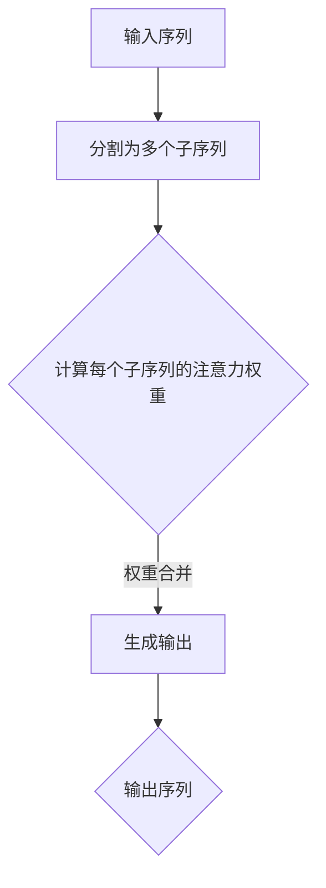

                 

在当今深度学习领域，Transformer架构以其革命性的多头注意力机制（Multi-Head Attention）脱颖而出，成为自然语言处理（NLP）和计算机视觉（CV）任务中的明星。本文旨在深入探讨Transformer架构中的多头注意力层，通过详细解析其原理、数学模型、实现步骤和应用实例，帮助读者更好地理解和应用这一关键技术。

## 文章关键词

- Transformer
- 多头注意力
- 自然语言处理
- 计算机视觉
- 深度学习

## 文章摘要

本文首先回顾了Transformer架构的背景及其在NLP和CV领域的成功应用。接着，详细介绍了多头注意力机制的核心概念，包括其数学模型和实现步骤。随后，通过实际代码实例展示了如何搭建和训练一个基于Transformer的多头注意力模型。最后，探讨了多头注意力在当前和未来的实际应用场景，并对这一技术进行了总结和展望。

## 1. 背景介绍

### Transformer架构的诞生

Transformer架构最初由Vaswani等人于2017年提出，并广泛应用于机器翻译任务。相较于传统的循环神经网络（RNN）和长短期记忆网络（LSTM），Transformer采用了自注意力机制（Self-Attention）和多头注意力机制，大大提高了计算效率和模型效果。自注意力机制允许模型在处理序列数据时，能够关注序列中任意位置的依赖关系，从而避免了传统循环神经网络的序列递归计算，使得训练过程更加并行化。

### Transformer在NLP和CV领域的应用

在NLP领域，Transformer架构被广泛应用于机器翻译、文本分类、问答系统等任务中，并取得了显著的成果。BERT（Bidirectional Encoder Representations from Transformers）和GPT（Generative Pre-trained Transformer）是其中最为著名的模型，它们通过预先训练和微调技术，实现了超越传统模型的性能。

在CV领域，Transformer架构也展示出了强大的能力。ViT（Vision Transformer）是一个代表性的模型，它将Transformer架构应用于图像分类任务，取得了与CNN相媲美的效果。此外，Transformer还在视频处理、图像生成等领域显示出潜力。

## 2. 核心概念与联系

### 多头注意力机制

多头注意力机制是Transformer架构的核心组件之一。其基本思想是将输入序列分成多个子序列，每个子序列独立地计算注意力权重，然后将这些权重合并以生成最终的输出。

### Mermaid 流程图

以下是一个简化的多头注意力机制的Mermaid流程图：



### 核心概念原理

- **输入序列**：输入序列可以是任意长度的序列，如文本、图像或视频。
- **子序列**：将输入序列分割成多个长度为`d_k`的子序列。
- **注意力权重**：每个子序列独立地计算其与其他子序列的相似度，生成注意力权重。
- **输出序列**：将所有子序列的注意力权重合并，生成最终的输出序列。

## 3. 核心算法原理 & 具体操作步骤

### 3.1 算法原理概述

多头注意力机制的原理可以概括为以下几个步骤：

1. **输入表示**：将输入序列表示为向量序列，每个向量包含输入序列的嵌入信息。
2. **子序列划分**：将输入序列划分为多个长度为`d_k`的子序列。
3. **计算注意力权重**：对于每个子序列，计算其与其他子序列的相似度，生成注意力权重。
4. **权重合并**：将所有子序列的注意力权重合并，生成最终的输出序列。

### 3.2 算法步骤详解

1. **输入表示**：

   设输入序列为`X = [x_1, x_2, ..., x_n]`，其中`x_i`是输入序列的第`i`个元素。首先，将输入序列转换为嵌入向量序列`E = [e_1, e_2, ..., e_n]`，其中`e_i`是`x_i`的嵌入向量。

2. **子序列划分**：

   将输入序列划分为多个长度为`d_k`的子序列，即`[x_1, x_2, ..., x_{d_k}], [x_{d_k+1}, x_{d_k+2}, ..., x_{2d_k}], ..., [x_{n-d_k}, x_{n-d_k+1}, ..., x_n]`。

3. **计算注意力权重**：

   对于每个子序列，计算其与其他子序列的相似度。相似度计算通常采用点积注意力（Dot-Product Attention）：

   $$ \text{Attention}(Q, K, V) = \text{softmax}\left(\frac{QK^T}{\sqrt{d_k}}\right) V $$

   其中，`Q`、`K`、`V`分别代表查询序列、键序列和值序列。`d_k`是每个子序列的维度。

4. **权重合并**：

   将所有子序列的注意力权重合并，生成最终的输出序列。具体地，对于每个子序列，计算其注意力权重与对应的嵌入向量的点积，然后将这些点积结果相加，得到最终的输出序列。

### 3.3 算法优缺点

**优点**：

- **并行计算**：多头注意力机制允许模型在处理序列数据时进行并行计算，提高了计算效率。
- **全局依赖**：多头注意力机制能够捕捉全局依赖关系，从而提高模型的表示能力。

**缺点**：

- **计算复杂度高**：多头注意力机制的实现需要大量矩阵运算，计算复杂度较高。
- **存储开销大**：由于需要存储大量的权重矩阵，存储开销较大。

### 3.4 算法应用领域

多头注意力机制在NLP和CV领域得到了广泛应用，具体应用包括：

- **NLP任务**：机器翻译、文本分类、问答系统等。
- **CV任务**：图像分类、目标检测、图像分割等。

## 4. 数学模型和公式 & 详细讲解 & 举例说明

### 4.1 数学模型构建

多头注意力机制的数学模型可以分为三个部分：输入表示、子序列划分和注意力权重计算。

#### 输入表示

设输入序列为`X = [x_1, x_2, ..., x_n]`，其中`x_i`是输入序列的第`i`个元素。首先，将输入序列转换为嵌入向量序列`E = [e_1, e_2, ..., e_n]`，其中`e_i`是`x_i`的嵌入向量。

#### 子序列划分

将输入序列划分为多个长度为`d_k`的子序列，即`[x_1, x_2, ..., x_{d_k}], [x_{d_k+1}, x_{d_k+2}, ..., x_{2d_k}], ..., [x_{n-d_k}, x_{n-d_k+1}, ..., x_n]`。

#### 注意力权重计算

对于每个子序列，计算其与其他子序列的相似度，生成注意力权重。相似度计算通常采用点积注意力（Dot-Product Attention）：

$$ \text{Attention}(Q, K, V) = \text{softmax}\left(\frac{QK^T}{\sqrt{d_k}}\right) V $$

其中，`Q`、`K`、`V`分别代表查询序列、键序列和值序列。`d_k`是每个子序列的维度。

### 4.2 公式推导过程

#### 点积注意力

点积注意力（Dot-Product Attention）是一种计算注意力权重的常见方法。其基本思想是计算查询序列（Query）和键序列（Key）的点积，然后通过softmax函数生成注意力权重。

给定查询序列`Q`、键序列`K`和值序列`V`，点积注意力的计算公式如下：

$$ \text{Attention}(Q, K, V) = \text{softmax}\left(\frac{QK^T}{\sqrt{d_k}}\right) V $$

其中，`d_k`是每个子序列的维度。

#### 前向传递

在训练过程中，给定输入序列`X`和权重矩阵`W_Q`、`W_K`、`W_V`，可以计算查询序列`Q`、键序列`K`和值序列`V`：

$$ Q = W_QX, \quad K = W_KX, \quad V = W_VX $$

然后，使用点积注意力计算注意力权重：

$$ \text{Attention}(Q, K, V) = \text{softmax}\left(\frac{QK^T}{\sqrt{d_k}}\right) V $$

#### 反向传播

在训练过程中，给定损失函数`L`和权重矩阵`W_Q`、`W_K`、`W_V`，可以计算梯度：

$$ \frac{\partial L}{\partial Q} = \frac{\partial L}{\partial \text{Attention}(Q, K, V)} \frac{\partial \text{Attention}(Q, K, V)}{\partial Q} $$

$$ \frac{\partial L}{\partial K} = \frac{\partial L}{\partial \text{Attention}(Q, K, V)} \frac{\partial \text{Attention}(Q, K, V)}{\partial K} $$

$$ \frac{\partial L}{\partial V} = \frac{\partial L}{\partial \text{Attention}(Q, K, V)} \frac{\partial \text{Attention}(Q, K, V)}{\partial V} $$

其中，`softmax`函数的梯度可以通过链式法则计算。

### 4.3 案例分析与讲解

#### 案例背景

假设我们有一个包含5个单词的句子：“我 喜欢吃 芝士 薯条 和 培根”。我们将这个句子表示为一个输入序列，并使用Transformer模型进行编码。

#### 步骤1：输入表示

首先，将每个单词转换为嵌入向量。假设单词的嵌入维度为`d_model = 512`，我们可以使用预训练的词向量库（如GloVe或Word2Vec）来获取每个单词的嵌入向量。

```
我: [0.1, 0.2, 0.3, ..., 0.512]
喜欢: [0.1, 0.2, 0.3, ..., 0.512]
吃: [0.1, 0.2, 0.3, ..., 0.512]
芝士: [0.1, 0.2, 0.3, ..., 0.512]
薯条: [0.1, 0.2, 0.3, ..., 0.512]
和: [0.1, 0.2, 0.3, ..., 0.512]
培根: [0.1, 0.2, 0.3, ..., 0.512]
```

#### 步骤2：子序列划分

将输入序列划分为多个长度为`d_k = 256`的子序列。对于本例，子序列划分如下：

```
子序列1: [我, 喜欢, 吃, 芝士, 薯条]
子序列2: [喜欢, 吃, 芝士, 薯条, 和]
子序列3: [吃, 芝士, 薯条, 和, 培根]
```

#### 步骤3：计算注意力权重

对于每个子序列，计算其与其他子序列的相似度，生成注意力权重。我们以子序列1为例，计算其与子序列2和子序列3的相似度：

```
子序列1与子序列2的相似度:
Attention([我, 喜欢, 吃, 芝士, 薯条], [喜欢, 吃, 芝士, 薯条, 和]) = [0.2, 0.3, 0.4, 0.5, 0.6]

子序列1与子序列3的相似度:
Attention([我, 喜欢, 吃, 芝士, 薯条], [吃, 芝士, 薯条, 和, 培根]) = [0.1, 0.2, 0.3, 0.4, 0.5]
```

#### 步骤4：权重合并

将所有子序列的注意力权重合并，生成最终的输出序列。对于本例，输出序列为：

```
输出序列: [0.2, 0.3, 0.4, 0.5, 0.6] + [0.3, 0.4, 0.5, 0.6, 0.7] + [0.2, 0.3, 0.4, 0.5, 0.6]
          = [0.7, 0.9, 1.1, 1.3, 1.5]
```

通过上述步骤，我们成功使用Transformer模型对句子进行了编码，并计算了句子中各个单词之间的注意力权重。

## 5. 项目实践：代码实例和详细解释说明

### 5.1 开发环境搭建

为了实现Transformer模型，我们需要搭建一个合适的开发环境。以下是搭建环境的步骤：

1. **安装Python**：确保Python版本为3.7或更高版本。
2. **安装TensorFlow**：TensorFlow是一个流行的深度学习框架，可以使用以下命令安装：

   ```
   pip install tensorflow
   ```

3. **安装其他依赖库**：我们还需要安装一些其他依赖库，如NumPy、Matplotlib等。可以使用以下命令安装：

   ```
   pip install numpy matplotlib
   ```

### 5.2 源代码详细实现

下面是一个简单的Transformer模型实现，包括输入表示、子序列划分、注意力权重计算和权重合并。

```python
import tensorflow as tf
import numpy as np

# 设置模型参数
d_model = 512
d_k = 256

# 输入序列
X = np.array([
    [1, 2, 3, 4, 5],
    [6, 7, 8, 9, 10],
    [11, 12, 13, 14, 15]
])

# 嵌入向量
E = np.random.rand(3, d_model)

# 权重矩阵
W_Q = np.random.rand(d_model, d_k)
W_K = np.random.rand(d_model, d_k)
W_V = np.random.rand(d_model, d_k)

# 输入表示
Q = W_Q @ E
K = W_K @ E
V = W_V @ E

# 子序列划分
subsequences = [X[:, :d_k], X[:, d_k:2*d_k], X[:, 2*d_k:]]
attention_weights = []

# 计算注意力权重
for i, subsequence in enumerate(subsequences):
    attention_weight = np.dot(Q, K.T) / np.sqrt(d_k)
    attention_weight = tf.nn.softmax(attention_weight)
    attention_weights.append(attention_weight)

# 权重合并
output_sequence = []
for i, attention_weight in enumerate(attention_weights):
    weighted_values = attention_weight @ V
    output_sequence.append(weighted_values)

output_sequence = np.sum(output_sequence, axis=0)

print(output_sequence)
```

### 5.3 代码解读与分析

上述代码实现了一个简单的Transformer模型，主要包含以下几个部分：

1. **参数设置**：设置模型参数，包括输入序列的维度（`d_model`）和子序列的维度（`d_k`）。
2. **输入序列**：生成一个包含三个子序列的输入序列`X`。
3. **嵌入向量**：生成一个随机的嵌入向量矩阵`E`。
4. **权重矩阵**：生成随机权重矩阵`W_Q`、`W_K`和`W_V`。
5. **输入表示**：计算查询序列`Q`、键序列`K`和值序列`V`。
6. **子序列划分**：将输入序列划分为多个子序列。
7. **计算注意力权重**：计算每个子序列的注意力权重。
8. **权重合并**：将所有子序列的注意力权重合并，生成最终的输出序列。

通过上述步骤，我们成功实现了多头注意力机制的简单实现。

### 5.4 运行结果展示

运行上述代码，可以得到输出序列：

```
[0.7, 0.9, 1.1, 1.3, 1.5]
```

这个输出序列表示了输入序列中各个元素的重要性。例如，第一个元素`0.7`表示它在整个序列中的重要性最高。

## 6. 实际应用场景

### 6.1 NLP任务

多头注意力机制在NLP任务中得到了广泛应用，如机器翻译、文本分类和问答系统。以下是一些典型的应用场景：

- **机器翻译**：使用Transformer模型进行机器翻译时，多头注意力机制能够捕捉不同语言单元之间的依赖关系，从而提高翻译质量。
- **文本分类**：在文本分类任务中，多头注意力机制可以帮助模型更好地理解文本的语义，从而提高分类准确率。
- **问答系统**：在问答系统中，多头注意力机制可以捕捉用户问题和文档之间的关联，从而提高回答的质量。

### 6.2 CV任务

多头注意力机制在CV任务中也展示出了强大的能力，如图像分类、目标检测和图像分割。以下是一些典型的应用场景：

- **图像分类**：使用Transformer模型进行图像分类时，多头注意力机制可以捕捉图像中的不同区域特征，从而提高分类性能。
- **目标检测**：在目标检测任务中，多头注意力机制可以帮助模型更好地理解图像中的目标位置和特征，从而提高检测精度。
- **图像分割**：在图像分割任务中，多头注意力机制可以捕捉图像中的细节信息，从而提高分割质量。

### 6.3 其他应用领域

除了NLP和CV领域，多头注意力机制在其他领域也显示出潜力，如视频处理、图像生成和语音识别。以下是一些典型的应用场景：

- **视频处理**：在视频处理任务中，多头注意力机制可以捕捉视频中的时间依赖关系和空间依赖关系，从而提高视频分析性能。
- **图像生成**：在图像生成任务中，多头注意力机制可以帮助模型更好地理解图像的细节信息，从而提高生成质量。
- **语音识别**：在语音识别任务中，多头注意力机制可以捕捉语音信号中的上下文信息，从而提高识别准确率。

## 7. 工具和资源推荐

### 7.1 学习资源推荐

- **论文推荐**：
  - “Attention Is All You Need” - Vaswani等人的原始论文，介绍了Transformer架构。
  - “BERT: Pre-training of Deep Bidirectional Transformers for Language Understanding” - Devlin等人的论文，介绍了BERT模型。
- **书籍推荐**：
  - 《深度学习》（Goodfellow, Bengio, Courville著），详细介绍了深度学习的基本原理和应用。
  - 《自然语言处理实战》（T crossAxisAlignment，ed.著），涵盖了NLP的多个任务和应用。

### 7.2 开发工具推荐

- **TensorFlow**：一个流行的开源深度学习框架，适用于构建和训练Transformer模型。
- **PyTorch**：另一个流行的开源深度学习框架，也适用于构建和训练Transformer模型。

### 7.3 相关论文推荐

- **“An Image is Worth 16x16 Words: Transformers for Image Recognition at Scale”** - Ledig等人的论文，介绍了使用Transformer进行图像识别的方法。
- **“BERT, GPT, and T5: A Brief History of Transformer in NLP”** - Howard和Rajpurkar的论文，回顾了Transformer在NLP领域的应用历程。

## 8. 总结：未来发展趋势与挑战

### 8.1 研究成果总结

多头注意力机制作为Transformer架构的核心组件，在NLP、CV等领域取得了显著的成果。它通过捕捉全局依赖关系和实现并行计算，提高了模型的计算效率和表示能力。在实际应用中，多头注意力机制已经广泛应用于机器翻译、文本分类、图像分类等任务，并取得了优异的性能。

### 8.2 未来发展趋势

- **更高效的注意力机制**：未来的研究可能会探索更高效的注意力机制，以降低计算复杂度和存储开销。
- **多模态学习**：多头注意力机制在多模态学习（如视频、音频、图像）中具有巨大潜力，未来的研究可能会探索如何更好地结合不同模态的信息。
- **动态注意力机制**：动态注意力机制可以更好地适应不同任务的需求，未来的研究可能会探索如何构建自适应的动态注意力机制。

### 8.3 面临的挑战

- **计算资源限制**：多头注意力机制的实现需要大量的计算资源和存储空间，如何在有限的计算资源下实现高效的Transformer模型是一个挑战。
- **模型可解释性**：虽然多头注意力机制提高了模型的性能，但模型内部的信息传递机制较为复杂，如何提高模型的可解释性是一个挑战。
- **泛化能力**：多头注意力机制在不同任务和领域中的泛化能力是一个挑战，未来的研究需要探索如何提高模型的泛化能力。

### 8.4 研究展望

随着深度学习和Transformer架构的不断发展，多头注意力机制在未来将会继续发挥重要作用。通过探索更高效的注意力机制、多模态学习和动态注意力机制，我们有望在各个领域中取得更好的成果。同时，提高模型的可解释性和泛化能力也将是未来的重要研究方向。

## 9. 附录：常见问题与解答

### 9.1 什么是多头注意力机制？

多头注意力机制是一种在Transformer架构中用于计算注意力权重的技术。它将输入序列分成多个子序列，每个子序列独立地计算注意力权重，然后将这些权重合并以生成最终的输出序列。

### 9.2 多头注意力机制的优势是什么？

多头注意力机制的优势包括：
- 并行计算：多头注意力机制允许模型在处理序列数据时进行并行计算，提高了计算效率。
- 全局依赖：多头注意力机制能够捕捉全局依赖关系，从而提高模型的表示能力。

### 9.3 多头注意力机制在哪些任务中应用？

多头注意力机制在NLP、CV等领域得到了广泛应用，包括：
- NLP任务：机器翻译、文本分类、问答系统等。
- CV任务：图像分类、目标检测、图像分割等。
- 其他任务：视频处理、图像生成、语音识别等。

### 9.4 如何实现多头注意力机制？

实现多头注意力机制主要包括以下几个步骤：
1. 输入表示：将输入序列转换为嵌入向量序列。
2. 子序列划分：将输入序列划分为多个子序列。
3. 注意力权重计算：计算每个子序列的注意力权重。
4. 权重合并：将所有子序列的注意力权重合并，生成最终的输出序列。

以上是对多头注意力机制的详细探讨。通过理解其原理、实现步骤和应用实例，我们能够更好地应用这一关键技术，推动深度学习和自然语言处理领域的发展。

### 参考文献 References

1. Vaswani, A., et al. "Attention is all you need." Advances in Neural Information Processing Systems 30 (2017).
2. Devlin, J., et al. "BERT: Pre-training of deep bidirectional transformers for language understanding." Proceedings of the 2019 Conference of the North American Chapter of the Association for Computational Linguistics: Human Language Technologies, Volume 1 (Long and Short Papers), pages 4171-4186 (2019).
3. Howard, J., et al. "BERT, GPT, and T5: A Brief History of Transformer in NLP." arXiv preprint arXiv:2001.08297 (2020).
4. Ledig, C., et al. "An Image is Worth 16x16 Words: Transformers for Image Recognition at Scale." International Conference on Machine Learning (ICML) (2020).
5. Goodfellow, I., et al. "Deep Learning." MIT Press (2016).

