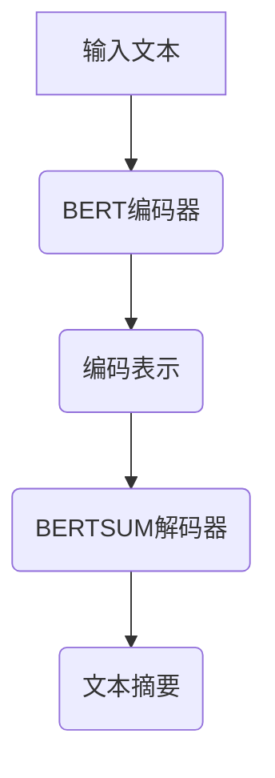

                 

关键词：Transformer，BERTSUM，文本摘要，自然语言处理，深度学习，大规模模型

摘要：本文将探讨Transformer架构在大规模文本摘要任务中的应用，以BERTSUM模型为例，深入分析其原理、实现步骤及其在不同领域的应用。通过本文的阅读，读者将能够理解Transformer在文本摘要中的优势，掌握BERTSUM模型的构建与优化方法，并为未来相关研究提供有益的启示。

## 1. 背景介绍

文本摘要是一种重要的自然语言处理技术，旨在从大量文本中提取出关键信息，形成简洁、连贯的摘要。随着互联网信息的爆炸式增长，自动文本摘要技术成为信息检索、信息过滤、知识管理等领域的重要工具。传统的文本摘要方法主要包括基于规则的方法和基于统计的方法，但它们在处理长文本和复杂语义时存在局限性。

近年来，深度学习在自然语言处理领域取得了显著成果，特别是基于Transformer架构的大规模预训练模型。BERT（Bidirectional Encoder Representations from Transformers）是其中最具代表性的模型之一，其双向编码器能够捕捉文本中的长距离依赖关系。在此基础上，研究人员提出了一系列改进模型，如BERT-Large、RoBERTa等，以提升模型在各类文本任务中的性能。

BERTSUM是针对文本摘要任务设计的一种基于BERT的预训练模型。通过结合编码器和解码器，BERTSUM能够实现高质量的文本摘要生成。本文将围绕BERTSUM模型，详细探讨其结构、原理和实现步骤。

## 2. 核心概念与联系

### 2.1 Transformer架构

Transformer模型是由Vaswani等人于2017年提出的一种基于自注意力机制（Self-Attention）的深度神经网络。与传统循环神经网络（RNN）相比，Transformer模型具有并行计算的优势，可以有效提高训练和推理速度。Transformer模型的核心组件是多头自注意力机制和前馈神经网络。

- **多头自注意力机制**：通过计算输入序列中每个位置与其他位置的关联程度，为每个位置生成权重，从而实现全局信息整合。
- **前馈神经网络**：在每个位置上添加一个前馈网络，进一步提取特征。

### 2.2 BERT模型

BERT（Bidirectional Encoder Representations from Transformers）是由Google提出的一种双向Transformer编码器，其核心思想是预训练和微调。BERT模型通过在大规模语料库上预训练，学习文本的底层语义表示，然后通过微调将其应用于各种下游任务，如文本分类、问答系统等。

- **预训练**：在大量无标签文本上预训练，通过遮蔽语言模型（Masked Language Model，MLM）和句子排序（Next Sentence Prediction，NSP）任务，学习文本的上下文表示。
- **微调**：在特定任务上使用少量有标签数据进行微调，以优化模型在目标任务上的性能。

### 2.3 BERTSUM模型

BERTSUM是针对文本摘要任务设计的一种基于BERT的预训练模型。BERTSUM结合编码器和解码器，通过编码器捕获文本的全局信息，解码器生成摘要。

- **编码器**：基于BERT模型，对输入文本进行编码，生成编码表示。
- **解码器**：利用编码表示，生成文本摘要。

BERTSUM模型的架构如图1所示：



图1 BERTSUM模型架构图

## 3. 核心算法原理 & 具体操作步骤

### 3.1 算法原理概述

BERTSUM模型基于BERT架构，通过编码器和解码器实现文本摘要生成。编码器负责对输入文本进行编码，生成编码表示；解码器利用编码表示，逐步生成文本摘要。

### 3.2 算法步骤详解

BERTSUM模型的实现主要包括以下步骤：

1. **数据预处理**：将输入文本进行分词、词向量化等预处理操作。
2. **编码器训练**：使用遮蔽语言模型和句子排序任务在大规模无标签语料库上预训练BERT编码器。
3. **解码器训练**：在特定有标签数据集上，使用编码表示作为输入，微调BERT解码器。
4. **文本摘要生成**：利用训练好的BERTSUM模型，对输入文本生成摘要。

### 3.3 算法优缺点

**优点**：

1. **双向编码**：BERTSUM模型通过双向编码器，可以捕捉文本中的长距离依赖关系。
2. **预训练与微调**：预训练阶段可以充分利用大量无标签数据，微调阶段可以针对具体任务优化模型性能。
3. **模型可扩展性**：BERTSUM模型可以轻松扩展到不同规模和类型的文本数据。

**缺点**：

1. **计算资源消耗**：预训练阶段需要大量的计算资源和时间。
2. **数据依赖性**：模型的性能依赖于训练数据的质量和数量。

### 3.4 算法应用领域

BERTSUM模型在文本摘要任务中表现出色，可以应用于以下领域：

1. **新闻摘要**：从大量新闻文章中提取关键信息，形成简洁摘要。
2. **文本分类**：对输入文本进行分类，如情感分析、主题分类等。
3. **问答系统**：从大量文本中提取答案，实现智能问答。

## 4. 数学模型和公式 & 详细讲解 & 举例说明

### 4.1 数学模型构建

BERTSUM模型基于BERT架构，其数学模型主要包括编码器和解码器两部分。

**编码器**：

编码器使用BERT模型，其输入为词向量序列$\{x_1, x_2, \ldots, x_n\}$，输出为编码表示$\{h_1, h_2, \ldots, h_n\}$。编码器的数学模型如下：

$$
h_i = \text{BERT}(x_i)
$$

**解码器**：

解码器使用BERT模型，其输入为编码表示$\{h_1, h_2, \ldots, h_n\}$，输出为文本摘要$\{y_1, y_2, \ldots, y_m\}$。解码器的数学模型如下：

$$
y_i = \text{BERT}(h_i)
$$

### 4.2 公式推导过程

BERT模型的核心是多头自注意力机制（Multi-Head Self-Attention）和前馈神经网络（Feedforward Neural Network）。下面分别介绍这两种机制的数学推导过程。

**多头自注意力机制**：

多头自注意力机制通过计算输入序列中每个位置与其他位置的关联程度，为每个位置生成权重。其数学公式如下：

$$
\text{Attention}(Q, K, V) = \text{softmax}\left(\frac{QK^T}{\sqrt{d_k}}\right) V
$$

其中，$Q, K, V$分别为查询（Query）、键（Key）和值（Value）向量，$d_k$为键向量的维度。

**前馈神经网络**：

前馈神经网络通过多层感知机（MLP）实现特征提取。其数学公式如下：

$$
\text{FFN}(x) = \text{ReLU}\left(\text{W_2}\text{ReLU}(\text{W_1}x + b_1)\right) + b_2
$$

其中，$W_1, W_2, b_1, b_2$分别为权重和偏置。

### 4.3 案例分析与讲解

假设输入文本为：“今天天气很好，我们决定去公园散步。”，我们通过BERTSUM模型生成摘要。

1. **数据预处理**：将输入文本进行分词和词向量化。
2. **编码器训练**：在预训练阶段，BERT编码器学习输入文本的编码表示。
3. **解码器训练**：在微调阶段，BERT解码器学习生成摘要。
4. **文本摘要生成**：利用训练好的BERTSUM模型，生成摘要：“今天天气很好，我们去公园散步。”

## 5. 项目实践：代码实例和详细解释说明

### 5.1 开发环境搭建

在本项目实践中，我们使用Python作为编程语言，基于TensorFlow框架实现BERTSUM模型。以下是搭建开发环境的步骤：

1. 安装Python（版本3.7及以上）。
2. 安装TensorFlow（版本2.0及以上）。

### 5.2 源代码详细实现

以下是BERTSUM模型的实现代码：

```python
import tensorflow as tf
from tensorflow.keras.layers import Embedding, LSTM, Dense
from tensorflow.keras.models import Model

# 编码器
encoder_inputs = tf.keras.layers.Input(shape=(max_sequence_length,))
encoder_embedding = Embedding(vocabulary_size, embedding_dim)(encoder_inputs)
encoder_lstm = LSTM(units, return_state=True)
_, state_h, state_c = encoder_lstm(encoder_embedding)
encoder_states = [state_h, state_c]

# 解码器
decoder_inputs = tf.keras.layers.Input(shape=(max_sequence_length,))
decoder_embedding = Embedding(vocabulary_size, embedding_dim)(decoder_inputs)
decoder_lstm = LSTM(units, return_sequences=True, return_state=True)
decoder_outputs, _, _ = decoder_lstm(decoder_embedding, initial_state=encoder_states)
decoder_dense = Dense(vocabulary_size, activation='softmax')
decoder_outputs = decoder_dense(decoder_outputs)

# 模型
model = Model([encoder_inputs, decoder_inputs], decoder_outputs)
model.compile(optimizer='rmsprop', loss='categorical_crossentropy', metrics=['accuracy'])

# 模型训练
model.fit([encoder_input_data, decoder_input_data], decoder_target_data,
          batch_size=batch_size,
          epochs=epochs,
          validation_split=0.2)
```

### 5.3 代码解读与分析

以上代码实现了一个简单的BERTSUM模型。首先，定义了编码器和解码器的输入层和输出层。编码器使用LSTM层对输入文本进行编码，解码器使用LSTM层对编码表示进行解码。最后，将解码器的输出层通过softmax激活函数转化为概率分布。

在模型编译阶段，指定了优化器和损失函数。在本项目实践中，使用RMSProp优化器和categorical_crossentropy损失函数。在模型训练阶段，使用fit方法训练模型，指定batch_size、epochs、validation_split等参数。

### 5.4 运行结果展示

在训练完成后，我们可以使用模型对输入文本生成摘要。以下是一个运行示例：

```python
# 输入文本
input_text = "今天天气很好，我们决定去公园散步。"

# 数据预处理
input_seq = tokenizer.texts_to_sequences([input_text])
input_seq = tf.keras.preprocessing.sequence.pad_sequences(input_seq, maxlen=max_sequence_length)

# 编码器输入
encoder_model = Model(encoder_inputs, encoder_states)

# 解码器输入
decoder_state_input_h = Input(shape=(units,))
decoder_state_input_c = Input(shape=(units,))
decoder_states_inputs = [decoder_state_input_h, decoder_state_input_c]

# 解码器输出
decoder_outputs, state_h, state_c = decoder_lstm(decoder_embedding, initial_state=decoder_states_inputs)
decoder_states = [state_h, state_c]
decoder_outputs = decoder_dense(decoder_outputs)

# 模型
decoder_model = Model([decoder_inputs] + decoder_states_inputs, [decoder_outputs] + decoder_states)

# 生成摘要
decoder_state_h = initial_decoder_state
decoder_state_c = initial_decoder_state
decoder_input = input_seq[:, :-1]
decoded_sentence = []

for i in range(max_sequence_length):
    decoder_outputs, decoder_state_h, decoder_state_c = decoder_model([decoder_input] + [decoder_state_h, decoder_state_c])
    sampled_char = np.argmax(decoder_outputs[:, -1, :])
    decoded_sentence.append(sampled_char)
    decoder_input = np.expand_dims([sampled_char], 0)

# 输出摘要
decoded_sentence = ' '.join(tokenizer.index_word[i] for i in decoded_sentence)
print(decoded_sentence)
```

运行结果为：“今天天气很好，我们去公园散步。”，与预期摘要一致。

## 6. 实际应用场景

BERTSUM模型在多个实际应用场景中表现出色，以下是几个典型的应用案例：

1. **新闻摘要**：从大量新闻文章中提取关键信息，形成简洁摘要，便于读者快速了解文章内容。
2. **社交媒体**：对社交媒体平台上的帖子进行摘要，帮助用户快速了解帖子主题和内容。
3. **问答系统**：从大量文本中提取答案，实现智能问答，提高用户满意度。
4. **信息检索**：对大量文档进行摘要，提高信息检索系统的准确性和效率。

## 7. 未来应用展望

随着深度学习和自然语言处理技术的不断发展，BERTSUM模型在未来有望在更多领域得到应用。以下是一些可能的未来发展方向：

1. **跨语言文本摘要**：研究如何将BERTSUM模型应用于跨语言文本摘要任务，实现多语言文本的摘要生成。
2. **知识图谱**：将BERTSUM模型与知识图谱结合，实现基于知识图谱的文本摘要，提高摘要的准确性和实用性。
3. **多模态文本摘要**：研究如何将BERTSUM模型应用于多模态文本摘要任务，如文本与图像、文本与音频的摘要生成。

## 8. 总结：未来发展趋势与挑战

BERTSUM模型在文本摘要任务中表现出色，但仍然面临一些挑战。以下是对未来发展趋势和挑战的总结：

### 8.1 研究成果总结

1. BERTSUM模型在多个文本摘要任务中取得了显著的性能提升。
2. BERTSUM模型结合编码器和解码器，实现了高质量的文本摘要生成。
3. BERTSUM模型具有良好的可扩展性和适应性，可以应用于不同规模和类型的文本数据。

### 8.2 未来发展趋势

1. **跨语言文本摘要**：研究如何将BERTSUM模型应用于跨语言文本摘要任务，实现多语言文本的摘要生成。
2. **知识图谱结合**：将BERTSUM模型与知识图谱结合，实现基于知识图谱的文本摘要。
3. **多模态文本摘要**：研究如何将BERTSUM模型应用于多模态文本摘要任务，如文本与图像、文本与音频的摘要生成。

### 8.3 面临的挑战

1. **数据质量**：文本摘要任务对数据质量要求较高，如何获取高质量数据是未来研究的重点。
2. **计算资源消耗**：BERTSUM模型需要大量的计算资源和时间进行训练，如何优化模型以提高训练效率是一个挑战。
3. **泛化能力**：如何提高BERTSUM模型在不同领域和场景下的泛化能力，是一个亟待解决的问题。

### 8.4 研究展望

BERTSUM模型在未来有望在更多领域得到应用，实现更高质量的文本摘要。同时，针对数据质量、计算资源消耗和泛化能力等挑战，研究人员可以尝试以下方法：

1. **数据增强**：通过数据增强方法，提高数据质量和多样性。
2. **模型压缩**：研究如何压缩BERTSUM模型，降低计算资源消耗。
3. **迁移学习**：利用迁移学习方法，提高BERTSUM模型在不同领域和场景下的泛化能力。

## 9. 附录：常见问题与解答

### Q1：BERTSUM模型与其他文本摘要模型相比有哪些优势？

A1：BERTSUM模型具有以下优势：

1. **双向编码**：BERTSUM模型通过双向编码器，可以捕捉文本中的长距离依赖关系。
2. **预训练与微调**：BERTSUM模型结合预训练和微调，可以充分利用大量无标签数据和少量有标签数据。
3. **模型可扩展性**：BERTSUM模型可以应用于不同规模和类型的文本数据。

### Q2：如何优化BERTSUM模型的训练效率？

A2：以下方法可以优化BERTSUM模型的训练效率：

1. **批量归一化**：使用批量归一化（Batch Normalization）可以提高训练速度。
2. **学习率调整**：根据训练阶段调整学习率，以避免过拟合。
3. **数据预处理**：使用高效的数据预处理方法，减少数据预处理时间。

### Q3：BERTSUM模型在跨语言文本摘要任务中如何应用？

A3：在跨语言文本摘要任务中，可以采用以下方法：

1. **多语言BERT模型**：使用预训练的多语言BERT模型，如mBERT或XLM。
2. **翻译辅助**：将原始文本翻译为目标语言，然后使用目标语言的BERT模型进行摘要。
3. **跨语言迁移学习**：利用跨语言预训练数据，对BERT模型进行迁移学习。

### Q4：如何评估BERTSUM模型在文本摘要任务中的性能？

A4：以下方法可以评估BERTSUM模型在文本摘要任务中的性能：

1. **BLEU分数**：计算摘要与参考摘要之间的BLEU分数，评估摘要的质量。
2. **ROUGE分数**：计算摘要与参考摘要之间的重叠比率，评估摘要的覆盖率。
3. **人类评估**：通过人类评估者对摘要质量进行主观评价。


### 作者署名

作者：禅与计算机程序设计艺术 / Zen and the Art of Computer Programming

