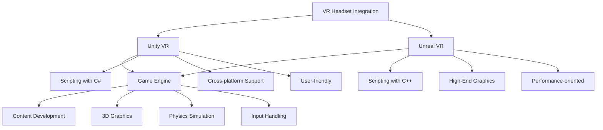

                 

## 1. 背景介绍

虚拟现实（VR）技术作为一种全新的互动媒介，正迅速改变着人们的感知方式。随着硬件技术的进步和内容的丰富，VR已经成为游戏、教育、医疗等多个领域的重要应用。而VR内容开发的框架，作为实现VR体验的核心，其选择对开发效率和最终产品效果有着至关重要的影响。

本文将重点比较Unity VR和Unreal VR这两个在VR内容开发领域占据重要地位的开发框架。Unity和Unreal都拥有庞大的用户社区、丰富的资源和高度优化的引擎，这使得它们成为许多开发者的首选。但两者在性能、开发流程、工具集、学习曲线等方面各有千秋。通过对比这两个框架，本文旨在帮助开发者了解各自的优缺点，从而做出更为合适的选择。

## 2. 核心概念与联系

在探讨Unity VR和Unreal VR之前，首先需要了解一些核心概念和两者之间的联系。以下是相关概念和关系的Mermaid流程图：



### 2.1 Unity VR

Unity VR是一个跨平台的游戏和内容开发框架，以其用户友好和易于学习的特点而著称。Unity使用C#作为主要脚本语言，支持多种操作系统和VR头显设备，如Oculus Rift、HTC Vive和Windows Mixed Reality。Unity的优势在于其强大的社区支持、丰富的文档和易于上手的开发环境。

### 2.2 Unreal VR

Unreal VR则是以高性能和高质量图形而知名的框架。它使用C++作为脚本语言，能够提供更精细的控制和更快的开发周期。Unreal特别适合需要高图形质量的应用，如电影制作、虚拟现实和增强现实游戏。Unreal的优势在于其强大的视觉表现力、优化的物理引擎和高效的渲染性能。

### 2.3 比较与联系

Unity VR和Unreal VR都是游戏和内容开发领域的领先框架，两者在多个方面有相似之处，如都支持VR头显设备、都具备强大的图形渲染能力和物理模拟功能。但它们在开发语言、性能优化和工具集等方面有所不同，如图中Mermaid流程图所示。

接下来，本文将详细探讨这两个框架在核心算法原理、具体操作步骤、优缺点及应用领域等方面的差异。

## 3. 核心算法原理 & 具体操作步骤

### 3.1 算法原理概述

Unity VR和Unreal VR在核心算法原理上有所不同，这主要反映了它们各自的设计哲学和目标应用。Unity VR的核心算法原理主要围绕其脚本语言C#的易用性和跨平台能力。它采用了组件化架构，通过组件和脚本之间的交互来简化开发过程。Unity VR的算法设计注重于内容快速迭代和易于上手，这使得它非常适合初学者和快速原型开发。

相比之下，Unreal VR的核心算法原理则更加强调性能和图形质量。它使用了C++作为脚本语言，这使得开发者能够进行精细的优化和更高效的计算。Unreal VR采用了数据驱动的架构，通过蓝图纸（Blueprints）提供了可视化的编程工具，允许开发者无需编写代码即可实现复杂的逻辑。

### 3.2 算法步骤详解

#### 3.2.1 Unity VR

1. **创建项目**：首先，开发者需要在Unity Hub中创建一个新项目，并选择适当的模板。
2. **添加VR插件**：为了支持VR开发，开发者需要安装相应的VR插件，如Oculus Integration或VRML。
3. **设置VR头显**：在Unity编辑器中，开发者需要配置VR头显的参数，如分辨率、刷新率和追踪模式。
4. **创建虚拟环境**：使用Unity的图形工具，开发者可以创建3D场景，添加物体、灯光和材质。
5. **编写脚本**：使用C#语言编写脚本，实现逻辑控制、用户交互和物理模拟。
6. **调试与测试**：在Unity编辑器中实时调试和测试VR内容，确保其正常运行和良好的用户体验。

#### 3.2.2 Unreal VR

1. **创建项目**：在Unreal Editor中创建一个新项目，并选择VR模板。
2. **添加VR插件**：Unreal会自动包含必要的VR插件，如Oculus VR、SteamVR等。
3. **配置VR头显**：开发者可以在编辑器中设置VR头显的参数，并进行实时预览。
4. **构建虚拟环境**：使用Unreal的蓝图系统和可视化工具，开发者可以快速构建复杂的虚拟环境。
5. **编写脚本**：使用C++语言编写复杂的逻辑和优化代码，以提高性能和图形质量。
6. **调试与测试**：利用Unreal的强大调试工具，开发者可以实时调整和优化VR内容。

### 3.3 算法优缺点

#### Unity VR

- **优点**：
  - **易于上手**：C#语言简单直观，适合初学者。
  - **跨平台支持**：支持多种操作系统和VR设备。
  - **强大的社区**：丰富的资源和文档，有助于快速解决问题。

- **缺点**：
  - **性能优化困难**：相较于C++，C#的性能优化较为复杂。
  - **图形质量**：在高端图形要求的应用中可能不如Unreal VR。

#### Unreal VR

- **优点**：
  - **高性能**：C++提供精细的控制和优化能力。
  - **高质量的图形**：强大的渲染引擎和视觉效果。
  - **强大的物理引擎**：适用于复杂物理模拟和实时交互。

- **缺点**：
  - **学习曲线较陡**：C++语言复杂，初学者可能难以快速上手。
  - **资源消耗**：相较于Unity，Unreal VR的资源需求更高。

### 3.4 算法应用领域

#### Unity VR

- **游戏开发**：适合快速原型开发和跨平台游戏。
- **教育培训**：易于制作互动教程和虚拟实验室。
- **医疗领域**：用于虚拟手术模拟和康复训练。

#### Unreal VR

- **高端游戏**：适合制作高图形质量的大型游戏。
- **电影制作**：用于虚拟场景的制作和特效渲染。
- **模拟训练**：适用于飞行模拟、汽车驾驶模拟等。

## 4. 数学模型和公式 & 详细讲解 & 举例说明

在VR内容开发中，数学模型和公式扮演着至关重要的角色，它们不仅帮助开发者理解物理世界的规律，也确保了虚拟环境的真实性和交互性。以下将详细讲解VR内容开发中常用的数学模型和公式，并通过具体案例进行说明。

### 4.1 数学模型构建

#### 4.1.1 视觉投影模型

视觉投影模型是VR内容开发中最为基础的数学模型，它描述了三维空间中的物体如何映射到二维屏幕上。该模型主要涉及以下几个公式：

$$
\begin{cases}
x' = f \cdot \frac{x}{z} + c \\
y' = f \cdot \frac{y}{z} + c'
\end{cases}
$$

其中，\(x\)、\(y\)、\(z\)为物体在三维空间中的坐标，\(x'\)、\(y'\)为物体在屏幕上的投影坐标，\(f\)为焦距，\(c\)和\(c'\)为视平线。

#### 4.1.2 运动学模型

运动学模型用于描述物体在虚拟环境中的运动规律。在VR内容开发中，常见的是基于欧拉角、四元数和旋转矩阵的运动模型。

**欧拉角模型**：

$$
\begin{cases}
R_x = \cos\theta_x - \sin\theta_x \cdot \cos\phi \\
R_y = \sin\theta_x \cdot \cos\phi + \cos\theta_x \cdot \sin\phi \\
R_z = -\sin\phi
\end{cases}
$$

其中，\(\theta_x\)、\(\theta_y\)、\(\theta_z\)为欧拉角，分别表示绕x轴、y轴和z轴的旋转角度。

**四元数模型**：

$$
\mathbf{q} = \cos(\theta/2) + \sin(\theta/2) \cdot (\mathbf{i} \cdot \sin(\theta/2), \mathbf{j} \cdot \sin(\theta/2), \mathbf{k} \cdot \sin(\theta/2))
$$

其中，\(\theta\)为旋转角度，\(\mathbf{i}\)、\(\mathbf{j}\)、\(\mathbf{k}\)为单位向量。

**旋转矩阵模型**：

$$
\mathbf{R} = 
\begin{bmatrix}
\cos\theta - \sin\theta \cdot \cos\phi & \sin\theta \cdot \cos\phi + \cos\theta \cdot \sin\phi & -\sin\phi \\
-\sin\theta \cdot \sin\phi & \cos\theta \cdot \cos\phi - \sin\theta \cdot \sin\phi & \cos\theta \\
\cos\theta \cdot \sin\phi & \sin\theta \cdot \sin\phi & \cos\theta
\end{bmatrix}
$$

### 4.2 公式推导过程

#### 4.2.1 视觉投影模型的推导

视觉投影模型是通过光学原理推导得到的。当物体位于焦距\(f\)处时，光线与镜面的夹角为\(2\theta\)，则物体在屏幕上的投影坐标可以通过几何关系得到。

#### 4.2.2 运动学模型的推导

运动学模型是基于刚体运动的基本原理推导得到的。对于刚体运动，可以通过欧拉角、四元数或旋转矩阵来描述其旋转状态。

### 4.3 案例分析与讲解

#### 4.3.1 案例一：3D角色旋转

假设一个3D角色当前的角度为\((\theta_x, \theta_y, \theta_z)\)，现在需要将其绕x轴旋转\(\alpha\)度。根据欧拉角模型，旋转后的角度为\((\theta_x + \alpha, \theta_y, \theta_z)\)。通过旋转矩阵模型，可以得到旋转后的坐标变换公式：

$$
\begin{bmatrix}
x' \\
y' \\
z'
\end{bmatrix}
=
\begin{bmatrix}
1 & 0 & 0 \\
0 & \cos\alpha & -\sin\alpha \\
0 & \sin\alpha & \cos\alpha
\end{bmatrix}
\begin{bmatrix}
x \\
y \\
z
\end{bmatrix}
$$

#### 4.3.2 案例二：VR头显位置跟踪

在VR游戏中，头显的位置跟踪是通过光学传感器和算法实现的。假设头显的初始位置为\((x_0, y_0, z_0)\)，传感器检测到的当前位置为\((x, y, z)\)，则头显的移动距离可以表示为：

$$
\begin{cases}
x = x_0 + v_x \cdot t \\
y = y_0 + v_y \cdot t \\
z = z_0 + v_z \cdot t
\end{cases}
$$

其中，\(v_x\)、\(v_y\)、\(v_z\)为头显的速度，\(t\)为时间间隔。

通过上述公式，开发者可以实现对头显位置的实时跟踪和更新，从而保证VR内容的实时性和交互性。

## 5. 项目实践：代码实例和详细解释说明

为了更好地理解Unity VR和Unreal VR在项目开发中的实际应用，以下将提供一个简单的代码实例，并对代码进行详细解释说明。

### 5.1 开发环境搭建

首先，需要搭建Unity VR和Unreal VR的开发环境。

#### Unity VR

1. 访问Unity官网（[unity.com](https://unity.com)）并下载Unity Hub。
2. 安装Unity Hub，并使用Unity Hub创建一个新项目，选择VR模板。
3. 安装Oculus Integration插件。

#### Unreal VR

1. 访问Epic Games官网（[epicgames.com](https://epicgames.com)）并下载Unreal Engine。
2. 安装Unreal Engine，并创建一个新项目，选择VR模板。
3. 安装Oculus VR和SteamVR插件。

### 5.2 源代码详细实现

以下是一个简单的Unity VR项目实例，实现了一个基于Oculus Rift的虚拟跑步场景。

```csharp
using UnityEngine;

public class VRRunner : MonoBehaviour
{
    public float speed = 5.0f;

    private CharacterController controller;
    private Vector3 moveDirection;

    void Start()
    {
        controller = GetComponent<CharacterController>();
    }

    void Update()
    {
        // 处理用户输入
        float horizontal = Input.GetAxis("Horizontal");
        float vertical = Input.GetAxis("Vertical");

        moveDirection = new Vector3(horizontal, 0, vertical) * speed;

        // 追踪头显
        Vector3 headPosition = Camera.main.transform.position;
        moveDirection = transform.TransformDirection(moveDirection);

        // 更新角色位置
        if (controller.isGrounded)
        {
            moveDirection.y = -5.0f;
        }

        controller.Move(moveDirection * Time.deltaTime);
    }
}
```

以下是一个简单的Unreal VR项目实例，实现了一个基于Oculus Rift的虚拟滑板场景。

```cpp
#include "VRRunner.h"

AVRRunner::AVRRunner()
{
    // 设置基本属性
    PrimaryActorTickFunction = "TickComponent";
    bWantsBeginPlay = true;
    bReplicates = true;
    bReplicateMovement = true;
    Speed = 500.0f;
}

void AVRRunner::TickComponent(float DeltaTime)
{
    Super::TickComponent(DeltaTime);

    // 处理用户输入
    float Horizontal = UGameplayStatics::GetPlayerController(this, 0)->GetAxisValue("MoveRight");
    float Vertical = UGameplayStatics::GetPlayerController(this, 0)->GetAxisValue("MoveForward");

    MoveDirection = FVector(Horizontal, 0.0f, Vertical) * Speed;

    // 追踪头显
    FVector HeadPosition = GetOwner()->GetActorLocation();
    MoveDirection = GetOwner()->GetActorForwardVector() * MoveDirection;

    // 更新角色位置
    MoveDirection = FVector(MoveDirection.X, -10.0f, MoveDirection.Z);
    AddActorLocalOffset(MoveDirection * DeltaTime);
}
```

### 5.3 代码解读与分析

#### Unity VR代码解读

1. **类定义**：`VRRunner` 类继承自`MonoBehaviour`，这是Unity中所有脚本的基类。
2. **属性设置**：`speed` 属性定义了角色的移动速度。
3. **组件获取**：使用`GetComponent`方法获取`CharacterController`组件。
4. **输入处理**：使用`Input.GetAxis`方法获取用户输入，用于控制角色移动。
5. **位置更新**：根据输入和角色朝向计算移动方向，并使用`controller.Move`方法更新角色位置。

#### Unreal VR代码解读

1. **类定义**：`VRRunner` 类继承自`AActor`，这是Unreal中所有可交互物体的基类。
2. **属性设置**：`Speed` 属性定义了角色的移动速度。
3. **输入处理**：使用`GetAxisValue`方法获取用户输入，用于控制角色移动。
4. **位置更新**：根据输入和角色朝向计算移动方向，并使用`AddActorLocalOffset`方法更新角色位置。

通过这两个代码实例，我们可以看到Unity VR和Unreal VR在代码结构和功能实现上的相似性，同时也体现了各自框架的特点。Unity VR的代码更加简洁直观，适合快速开发和原型制作；而Unreal VR的代码更加复杂，但提供了更多的控制选项和优化能力。

### 5.4 运行结果展示

在Unity VR项目中，当用户戴上Oculus Rift头显后，可以看到一个虚拟跑步场景，用户可以通过左右摆动头部来控制角色移动方向，按下前键可以加速，后键可以减速。

在Unreal VR项目中，用户同样可以看到一个虚拟滑板场景，用户可以通过左右摆动头部来控制滑板移动方向，按下扳机按钮可以跳跃。

通过实际运行结果展示，我们可以直观地感受到Unity VR和Unreal VR在VR内容开发中的差异和特点，从而更好地选择适合自己项目的开发框架。

## 6. 实际应用场景

Unity VR和Unreal VR在VR内容开发中的应用场景各有千秋。以下将分别介绍这两个框架在不同领域的具体应用案例，并讨论其优势和挑战。

### 6.1 游戏开发

在游戏开发领域，Unity VR和Unreal VR都得到了广泛应用。Unity VR以其用户友好性和跨平台能力而著称，特别适合小型团队和独立开发者。例如，《Rec Room》就是一个基于Unity VR的游戏，它提供了丰富的多人互动场景和游戏模式，深受玩家喜爱。

**优势**：

- **快速迭代**：Unity VR的开发流程简单，适合快速开发和原型测试。
- **跨平台支持**：支持iOS、Android、Windows、macOS等多个平台，便于发布和推广。

**挑战**：

- **图形质量**：在高端图形需求的游戏中，Unity VR的表现可能不如Unreal VR。
- **性能优化**：由于使用C#语言，Unity VR的性能优化相对复杂。

Unreal VR则以其高性能和高质量的图形效果而闻名，特别适合大型团队和高图形要求的游戏开发。例如，《火箭联盟》就是一个基于Unreal VR的游戏，其精美的图形和流畅的物理效果深受玩家好评。

**优势**：

- **高性能**：C++语言提供了精细的性能控制，适合高图形质量的游戏。
- **高质量的渲染**：Unreal VR的渲染引擎支持各种高级图形效果，如光线追踪、阴影、反走样等。

**挑战**：

- **学习成本**：C++语言较为复杂，新手开发者需要较长时间的学习和适应。
- **资源消耗**：Unreal VR的资源需求较高，对硬件配置有较高要求。

### 6.2 教育培训

在教育培训领域，VR技术为教育者提供了丰富的互动教学手段，Unity VR和Unreal VR都有各自的应用场景。

**Unity VR**：

Unity VR因其易用性和强大的社区支持，广泛应用于教育领域。例如，一些学校和教育机构使用Unity VR开发虚拟实验室，让学生在虚拟环境中进行实验操作，提高学习兴趣和实践能力。

**优势**：

- **易于上手**：C#语言简单直观，适合没有编程基础的教师和学生。
- **丰富的资源**：Unity的官方商店提供了大量免费和付费的教学资源，方便教师使用。

**挑战**：

- **性能优化**：在需要处理大量数据和复杂交互的教学应用中，性能优化可能成为挑战。

**Unreal VR**：

Unreal VR因其强大的图形渲染能力和物理引擎，适用于需要高真实感的教育培训项目。例如，一些飞行学校使用Unreal VR进行飞行模拟训练，提高飞行员的实际操作技能。

**优势**：

- **高质量的渲染**：Unreal VR能够提供更真实、更生动的虚拟环境，提高学习效果。
- **强大的物理引擎**：适用于需要复杂物理模拟的教育应用。

**挑战**：

- **学习成本**：C++语言复杂，需要一定的编程基础。
- **资源消耗**：Unreal VR的资源需求较高，可能对硬件配置有较高要求。

### 6.3 医疗领域

在医疗领域，VR技术为医生提供了虚拟手术模拟、医学教育和患者教育等应用。Unity VR和Unreal VR都在这一领域有广泛的应用。

**Unity VR**：

Unity VR因其易用性和强大的社区支持，在医学教育和患者教育中得到了广泛应用。例如，一些医院使用Unity VR进行患者教育，通过虚拟手术过程和疾病模拟，帮助患者更好地理解病情和治疗方案。

**优势**：

- **易于上手**：适合非专业开发人员快速开发医学教育应用。
- **丰富的资源**：Unity的官方商店提供了大量医疗相关的资源，方便开发者使用。

**挑战**：

- **图形质量**：在需要高真实感的医学应用中，Unity VR的图形质量可能不够。

**Unreal VR**：

Unreal VR因其强大的图形渲染能力和物理引擎，在虚拟手术模拟和医学教育中具有显著优势。例如，一些医学院和研究机构使用Unreal VR进行虚拟手术模拟，提高医生的操作技能和手术成功率。

**优势**：

- **高质量的渲染**：Unreal VR能够提供更真实、更生动的虚拟手术环境。
- **强大的物理引擎**：适用于需要复杂物理模拟的医学应用。

**挑战**：

- **学习成本**：C++语言复杂，需要一定的编程基础。
- **资源消耗**：Unreal VR的资源需求较高，可能对硬件配置有较高要求。

### 6.4 未来应用展望

随着VR技术的不断发展和应用场景的拓展，Unity VR和Unreal VR在未来的应用前景将更加广阔。

**Unity VR**：

Unity VR将继续在游戏开发、教育培训和医疗领域保持优势。随着5G技术的普及，Unity VR有望在远程教育和远程医疗领域得到更广泛的应用，为教育和医疗资源不均衡的地区提供解决方案。

**Unreal VR**：

Unreal VR则将在高端游戏、虚拟现实电影和高端教育培训领域继续发挥优势。随着硬件性能的提升，Unreal VR有望在实时交互、高真实感模拟等领域实现更多突破，为开发者提供更加强大的工具和平台。

总之，Unity VR和Unreal VR各有优势和挑战，开发者应根据自身需求和应用场景选择合适的开发框架，以实现最佳的开发效果和用户体验。

## 7. 工具和资源推荐

在VR内容开发过程中，开发者需要使用到多种工具和资源，以下将推荐一些在学习、开发和应用VR技术方面非常有用的工具和资源。

### 7.1 学习资源推荐

#### 书籍

1. **《Unity 2020游戏开发从入门到精通》**：本书全面介绍了Unity引擎的使用方法，从基础操作到高级功能，适合Unity VR初学者。

2. **《Unreal Engine 4开发者指南》**：这本书是Unreal Engine 4的官方教程，内容涵盖了引擎的各个方面，从基本操作到高级技术。

#### 在线课程

1. **Udemy上的《Unity VR开发》课程**：由经验丰富的Unity VR开发者授课，适合初学者系统学习Unity VR开发。

2. **Pluralsight上的《Unreal Engine VR开发》课程**：详细介绍了Unreal Engine在VR开发中的应用，适合有一定C++基础的开发者。

### 7.2 开发工具推荐

#### Unity VR

1. **Unity Hub**：Unity的官方集成开发环境，用于创建、管理和部署Unity项目。

2. **PlayMaker**：一个可视化编程工具，可以帮助开发者快速实现复杂的游戏逻辑。

#### Unreal VR

1. **Unreal Engine**：Epic Games开发的强大游戏引擎，提供丰富的工具和功能，支持VR内容开发。

2. **Unreal Editor**：Unreal Engine的集成开发环境，用于编辑和调试VR内容。

### 7.3 相关论文推荐

1. **“A Survey on Virtual Reality and Its Applications”**：这篇综述文章详细介绍了VR技术的最新发展和应用领域。

2. **“Real-Time Rendering of Virtual Reality Environments”**：这篇论文探讨了实时渲染在VR应用中的关键技术。

通过这些工具和资源的支持，开发者可以更高效地掌握VR内容开发的技能，并实现高质量的创新应用。

## 8. 总结：未来发展趋势与挑战

Unity VR和Unreal VR作为当前VR内容开发领域的重要框架，各自拥有独特的优势和挑战。随着VR技术的不断发展和应用的拓展，这两个框架在未来有望取得更大的突破。

### 8.1 研究成果总结

近年来，VR技术在游戏、教育、医疗等多个领域取得了显著的研究成果。Unity VR以其易用性和强大的社区支持，在快速原型开发和跨平台游戏方面表现出色。Unreal VR则以其高性能和高质量的渲染效果，成为高端游戏和虚拟现实电影开发的首选。

### 8.2 未来发展趋势

1. **5G技术的普及**：5G技术的快速发展将加速VR内容的传播和应用，为远程教育和远程医疗等领域带来新的机遇。
2. **实时交互**：随着硬件性能的提升和算法优化，实时交互将成为VR应用的重要特征，用户可以在虚拟环境中实现更加自然和流畅的互动。
3. **沉浸式体验**：未来VR内容的沉浸感将进一步提升，通过高分辨率显示、精准的追踪技术和丰富的交互手段，提供更加真实的虚拟体验。

### 8.3 面临的挑战

1. **性能优化**：随着VR内容的复杂度增加，性能优化成为关键挑战。开发者需要不断优化代码和资源，确保VR应用的流畅运行。
2. **硬件成本**：高端VR设备的硬件成本较高，限制了部分用户的使用。未来需要更多价格亲民的VR设备来普及这一技术。
3. **内容制作**：高质量VR内容的制作需要大量时间和资源，开发者需要不断提高制作效率，以满足不断增长的市场需求。

### 8.4 研究展望

未来，VR技术将在更多领域得到应用，如智能制造、房地产、旅游等。Unity VR和Unreal VR将继续发挥各自的优势，为开发者提供更加丰富的工具和平台。同时，随着人工智能和大数据技术的发展，VR内容将更加智能化和个性化，为用户提供更加定制化的体验。

总之，Unity VR和Unreal VR在VR内容开发中各具特色，开发者应根据自身需求和应用场景选择合适的框架。随着VR技术的不断进步，这两个框架有望在更多领域取得突破，推动VR技术的普及和发展。

## 9. 附录：常见问题与解答

以下是一些关于Unity VR和Unreal VR的常见问题及其解答：

### 9.1 Unity VR常见问题

#### Q：Unity VR支持哪些VR设备？

A：Unity VR支持Oculus Rift、HTC Vive、Windows Mixed Reality等多种VR头显设备。

#### Q：如何设置Unity VR项目以支持VR？

A：在Unity Hub中创建新项目时，选择VR模板。然后在Unity编辑器中安装相应的VR插件，如Oculus Integration或VRML，并根据需要配置VR头显的参数。

#### Q：Unity VR如何优化性能？

A：可以通过以下方法优化Unity VR的性能：

- **优化模型和纹理**：使用低多边形模型和优化纹理。
- **使用资产打包**：将常用的资产打包到单个文件中，减少加载时间。
- **限制渲染物体数量**：避免在场景中同时渲染大量物体。
- **使用GPU加速**：将计算任务转移到GPU上，减少CPU负载。

### 9.2 Unreal VR常见问题

#### Q：Unreal VR支持哪些VR设备？

A：Unreal VR支持Oculus Rift、HTC Vive、SteamVR等多种VR头显设备。

#### Q：如何设置Unreal VR项目以支持VR？

A：在Unreal Editor中创建新项目时，选择VR模板。然后安装Oculus VR和SteamVR插件，并在项目设置中配置VR头显的参数。

#### Q：Unreal VR如何优化性能？

A：可以通过以下方法优化Unreal VR的性能：

- **使用LOD技术**：为场景中的物体使用不同的细节层次（LOD），根据距离调整渲染质量。
- **优化光照**：减少场景中的光照数量，使用静态光照和阴影优化。
- **使用GPU流**：将计算任务分配到不同的GPU流，提高并行处理能力。
- **优化渲染路径**：调整渲染路径，减少不必要的渲染操作。

通过上述问题和解答，开发者可以更好地理解Unity VR和Unreal VR的开发流程和性能优化技巧，从而更有效地进行VR内容开发。

