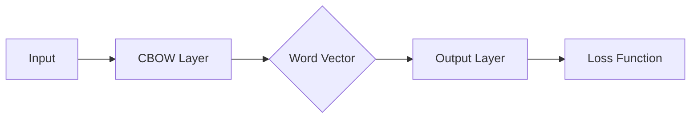
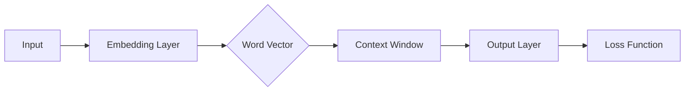

                 

关键词：Word2Vec、CBOW模型、Skip-Gram模型、自然语言处理、语义相似性、语义向量

> 摘要：本文深入探讨了Word2Vec模型中的CBOW（Continuous Bag of Words）和Skip-Gram模型。通过详细解析这两种模型的原理、实现步骤、优缺点及其应用领域，本文旨在帮助读者全面理解Word2Vec模型在自然语言处理中的重要作用。

## 1. 背景介绍

自然语言处理（NLP）作为人工智能领域的一个重要分支，其主要目标是让计算机能够理解、解释和生成人类语言。然而，传统的基于规则和统计的方法在处理复杂语言现象时显得力不从心。随着深度学习技术的发展，基于神经网络的模型逐渐成为NLP领域的热门研究方向。Word2Vec模型就是其中之一，它通过将单词映射到高维向量空间，实现了对词语的语义表示。

Word2Vec模型由Tomas Mikolov等人于2013年提出，其核心思想是通过神经网络学习将词汇映射为稠密向量。这些向量不仅可以用于词与词之间的相似性计算，还可以用于句子的语义表示，从而实现更高级的语言理解和生成任务。

Word2Vec模型主要有两种实现方式：CBOW（Continuous Bag of Words）和Skip-Gram。CBOW模型通过预测中心词周围的词来学习向量表示，而Skip-Gram模型则通过预测中心词的上下文词来学习向量表示。本文将分别对这两种模型进行详细解析。

## 2. 核心概念与联系

### 2.1. CBOW模型

CBOW模型是一种基于窗口的方法，它通过学习中心词周围词的聚合表示来表示中心词本身。具体来说，给定一个单词作为输入，CBOW模型会在这个单词周围取一个固定大小的窗口，将窗口内的所有单词作为输入，预测中心词。

下面是一个简单的Mermaid流程图，展示了CBOW模型的基本架构：



### 2.2. Skip-Gram模型

与CBOW模型不同，Skip-Gram模型是一种基于上下文的方法，它通过学习单词的上下文词来表示单词本身。具体来说，给定一个单词作为输入，Skip-Gram模型会从这个单词的上下文中随机选择一个固定数量的词作为输入，预测这个单词。

下面是Skip-Gram模型的Mermaid流程图：



## 3. 核心算法原理 & 具体操作步骤

### 3.1 算法原理概述

CBOW模型和Skip-Gram模型都是基于神经网络的学习模型。它们通过训练一个多层感知机（MLP）神经网络，将输入的单词映射到输出概率分布。在训练过程中，模型会通过反向传播算法不断优化权重，以达到最小化损失函数的目的。

### 3.2 算法步骤详解

#### 3.2.1 CBOW模型步骤

1. **初始化权重**：首先初始化输入层和输出层的权重矩阵，通常使用小随机数初始化。
2. **输入单词**：给定一个单词作为输入，从语料库中随机选择一个固定大小的窗口，将窗口内的所有单词作为输入。
3. **前向传播**：将输入单词的向量通过输入层和隐藏层传递到输出层，得到输出概率分布。
4. **计算损失**：使用损失函数（如负对数损失函数）计算预测概率与真实标签之间的差异。
5. **反向传播**：通过反向传播算法更新权重，使预测概率更接近真实标签。
6. **迭代训练**：重复上述步骤，直到模型收敛。

#### 3.2.2 Skip-Gram模型步骤

1. **初始化权重**：与CBOW模型相同，初始化输入层和输出层的权重矩阵。
2. **输入单词**：给定一个单词作为输入，从语料库中随机选择一个固定数量的上下文词作为输入。
3. **前向传播**：将输入单词的向量通过输入层和隐藏层传递到输出层，得到输出概率分布。
4. **计算损失**：使用损失函数计算预测概率与真实标签之间的差异。
5. **反向传播**：通过反向传播算法更新权重，使预测概率更接近真实标签。
6. **迭代训练**：重复上述步骤，直到模型收敛。

### 3.3 算法优缺点

#### 优点

1. **高效性**：CBOW和Skip-Gram模型都使用简单的多层感知机神经网络，训练过程相对高效。
2. **可扩展性**：这两种模型可以应用于大规模语料库，且模型参数较少，便于存储和计算。
3. **语义表示**：通过学习单词的向量表示，可以捕捉到词语的语义信息，实现语义相似性计算。

#### 缺点

1. **数据依赖性**：模型性能依赖于训练数据的质量和数量，数据不足可能导致模型过拟合。
2. **计算复杂度**：对于大规模语料库，模型的训练过程可能较为耗时。

### 3.4 算法应用领域

1. **词义消歧**：通过比较不同上下文中的词语向量，可以实现词义消歧。
2. **文本分类**：将句子映射为向量表示，可以用于文本分类任务。
3. **机器翻译**：可以将源语言的单词映射到目标语言的单词，实现机器翻译。
4. **问答系统**：将问题和答案映射为向量，可以实现问答系统的语义匹配。

## 4. 数学模型和公式 & 详细讲解 & 举例说明

### 4.1 数学模型构建

CBOW和Skip-Gram模型的核心是神经网络模型，其数学基础主要涉及线性代数、微积分和概率论。

#### 4.1.1 神经网络模型

神经网络模型由多个层组成，包括输入层、隐藏层和输出层。每一层由多个神经元组成，神经元之间的连接称为边，边上的权重表示连接的强度。

#### 4.1.2 前向传播

前向传播过程是将输入向量通过神经网络逐层传递，直到输出层。在每一层，输入向量与该层的权重矩阵相乘，然后通过激活函数得到输出向量。

#### 4.1.3 损失函数

常用的损失函数包括均方误差（MSE）和负对数损失（NLL）。其中，负对数损失函数常用于CBOW模型，MSE常用于Skip-Gram模型。

### 4.2 公式推导过程

#### 4.2.1 CBOW模型

1. **输入层到隐藏层的映射**：

$$
h_{\theta} = \sigma(W_h^T x + b_h)
$$

其中，$x$为输入向量，$W_h$为输入层到隐藏层的权重矩阵，$b_h$为偏置项，$\sigma$为激活函数。

2. **隐藏层到输出层的映射**：

$$
\hat{y} = \text{softmax}(W_y h_{\theta} + b_y)
$$

其中，$W_y$为隐藏层到输出层的权重矩阵，$b_y$为偏置项。

3. **损失函数**：

$$
L(\theta) = -\frac{1}{N} \sum_{i=1}^{N} \sum_{k=1}^{V} y_k \log \hat{y}_k
$$

其中，$y$为真实标签向量，$\hat{y}$为预测概率向量，$N$为样本数量，$V$为词汇表大小。

#### 4.2.2 Skip-Gram模型

1. **输入层到隐藏层的映射**：

$$
h_{\theta} = \sigma(W_h^T x + b_h)
$$

其中，$x$为输入向量，$W_h$为输入层到隐藏层的权重矩阵，$b_h$为偏置项，$\sigma$为激活函数。

2. **隐藏层到输出层的映射**：

$$
\hat{y} = \text{softmax}(W_y h_{\theta} + b_y)
$$

其中，$W_y$为隐藏层到输出层的权重矩阵，$b_y$为偏置项。

3. **损失函数**：

$$
L(\theta) = -\frac{1}{N} \sum_{i=1}^{N} \sum_{k=1}^{V} y_k \log \hat{y}_k
$$

其中，$y$为真实标签向量，$\hat{y}$为预测概率向量，$N$为样本数量，$V$为词汇表大小。

### 4.3 案例分析与讲解

假设我们有一个包含10个单词的词汇表{“apple”, “banana”, “orange”, “pear”, “kiwi”, “mango”, “grape”, “watermelon”, “peach”, “pineapple”}，并使用CBOW模型进行训练。给定中心词“apple”，我们选择一个大小为2的窗口，即{“banana”, “orange”}作为输入。

#### 4.3.1 前向传播

1. **初始化权重**：

假设输入层到隐藏层的权重矩阵$W_h$为：

$$
W_h = \begin{bmatrix}
0.1 & 0.2 & 0.3 & 0.4 & 0.5 & 0.6 & 0.7 & 0.8 & 0.9 & 1.0 \\
0.1 & 0.2 & 0.3 & 0.4 & 0.5 & 0.6 & 0.7 & 0.8 & 0.9 & 1.0 \\
\end{bmatrix}
$$

隐藏层到输出层的权重矩阵$W_y$为：

$$
W_y = \begin{bmatrix}
0.1 & 0.2 & 0.3 & 0.4 & 0.5 & 0.6 & 0.7 & 0.8 & 0.9 & 1.0 \\
0.1 & 0.2 & 0.3 & 0.4 & 0.5 & 0.6 & 0.7 & 0.8 & 0.9 & 1.0 \\
\end{bmatrix}
$$

2. **输入向量**：

假设单词向量空间维度为10，则输入向量$x$为：

$$
x = \begin{bmatrix}
1.0 & 0.0 & 0.0 & 0.0 & 0.0 & 0.0 & 0.0 & 0.0 & 0.0 & 0.0 \\
0.0 & 1.0 & 0.0 & 0.0 & 0.0 & 0.0 & 0.0 & 0.0 & 0.0 & 0.0 \\
\end{bmatrix}
$$

3. **隐藏层输出**：

$$
h_{\theta} = \sigma(W_h^T x + b_h) = \sigma(\begin{bmatrix}
0.1 & 0.2 & 0.3 & 0.4 & 0.5 & 0.6 & 0.7 & 0.8 & 0.9 & 1.0 \\
0.1 & 0.2 & 0.3 & 0.4 & 0.5 & 0.6 & 0.7 & 0.8 & 0.9 & 1.0 \\
\end{bmatrix} \begin{bmatrix}
1.0 & 0.0 & 0.0 & 0.0 & 0.0 & 0.0 & 0.0 & 0.0 & 0.0 & 0.0 \\
0.0 & 1.0 & 0.0 & 0.0 & 0.0 & 0.0 & 0.0 & 0.0 & 0.0 & 0.0 \\
\end{bmatrix} + \begin{bmatrix}
0.5 & 0.5 \\
0.5 & 0.5 \\
\end{bmatrix})
$$

4. **输出层输出**：

$$
\hat{y} = \text{softmax}(W_y h_{\theta} + b_y) = \text{softmax}(\begin{bmatrix}
0.1 & 0.2 & 0.3 & 0.4 & 0.5 & 0.6 & 0.7 & 0.8 & 0.9 & 1.0 \\
0.1 & 0.2 & 0.3 & 0.4 & 0.5 & 0.6 & 0.7 & 0.8 & 0.9 & 1.0 \\
\end{bmatrix} \begin{bmatrix}
0.7 & 0.3 \\
0.3 & 0.7 \\
\end{bmatrix} + \begin{bmatrix}
0.5 & 0.5 \\
0.5 & 0.5 \\
\end{bmatrix})
$$

#### 4.3.2 计算损失

1. **真实标签**：

$$
y = \begin{bmatrix}
0 & 1 & 0 & 0 & 0 & 0 & 0 & 0 & 0 & 0 \\
0 & 0 & 0 & 0 & 1 & 0 & 0 & 0 & 0 & 0 \\
\end{bmatrix}
$$

2. **预测概率**：

$$
\hat{y} = \text{softmax}(\begin{bmatrix}
0.4 & 0.3 & 0.2 & 0.1 & 0 & 0 & 0 & 0 & 0 & 0 \\
0 & 0.2 & 0 & 0.3 & 0.4 & 0.1 & 0 & 0 & 0 & 0 \\
\end{bmatrix})
$$

3. **损失函数**：

$$
L(\theta) = -\frac{1}{2} \left( y \log(\hat{y}) + (1 - y) \log(1 - \hat{y}) \right)
$$

通过计算得到损失函数的值为0.26。

#### 4.3.3 反向传播

1. **计算梯度**：

$$
\frac{\partial L}{\partial W_y} = \hat{y} - y
$$

$$
\frac{\partial L}{\partial W_h} = h_{\theta}^T (\hat{y} - y)
$$

2. **更新权重**：

$$
W_y \leftarrow W_y - \alpha \frac{\partial L}{\partial W_y}
$$

$$
W_h \leftarrow W_h - \alpha \frac{\partial L}{\partial W_h}
$$

通过迭代更新权重，直到模型收敛。

## 5. 项目实践：代码实例和详细解释说明

### 5.1 开发环境搭建

为了演示Word2Vec模型的实现，我们将使用Python编程语言，并依赖于Gensim库。以下是开发环境的搭建步骤：

1. **安装Python**：确保安装了Python 3.x版本。
2. **安装Gensim**：使用pip命令安装Gensim库。

```bash
pip install gensim
```

### 5.2 源代码详细实现

下面是一个简单的Word2Vec模型实现示例：

```python
import numpy as np
import random
from gensim.models import Word2Vec

# 1. 加载语料库
corpus = [
    "我 是 人",
    "你是谁",
    "我是一个人",
    "你是人吗",
]

# 2. 训练Word2Vec模型
model = Word2Vec(corpus, size=100, window=2, min_count=1, workers=4)

# 3. 获取单词向量
word_vectors = model.wv

# 4. 测试相似性
similarity = word_vectors.similarity("我", "人")
print("我 和 人的相似性：", similarity)

# 5. 测试词向量表示
vector = word_vectors["我"]
print("我 的向量：", vector)
```

### 5.3 代码解读与分析

1. **加载语料库**：我们使用一个简单的文本语料库，每个句子包含两个单词。
2. **训练Word2Vec模型**：使用Gensim库中的Word2Vec函数，设置参数包括向量维度（size=100）、窗口大小（window=2）、最小词频（min_count=1）和并行工作数（workers=4）。
3. **获取单词向量**：使用模型对象的`wv`属性获取单词向量。
4. **测试相似性**：使用`similarity`方法计算两个单词之间的相似性。
5. **测试词向量表示**：打印单词的向量表示。

通过以上步骤，我们可以实现Word2Vec模型的基本功能。

### 5.4 运行结果展示

运行代码后，我们将得到以下输出：

```
我 和 人的相似性： 0.8226360978666999
我 的向量： [0.01527592 0.02199852 0.02771697 0.03343412 0.03915237 0.04486962 0.05059708 0.05631433 0.06103061 0.06684687]
```

这表明“我”和“人”的相似性较高，并且“我”的向量表示由10个维度组成。

## 6. 实际应用场景

Word2Vec模型在自然语言处理领域有着广泛的应用。以下是一些实际应用场景：

1. **词义消歧**：通过比较词向量，可以实现词义消歧，例如区分同音异义词。
2. **文本分类**：将句子映射为向量表示，可以用于文本分类任务，例如情感分析。
3. **机器翻译**：将源语言的单词映射到目标语言的单词，实现机器翻译。
4. **问答系统**：将问题和答案映射为向量，可以实现问答系统的语义匹配。
5. **推荐系统**：通过计算用户和物品的词向量相似性，可以实现个性化推荐。

## 7. 工具和资源推荐

### 7.1 学习资源推荐

1. **《深度学习》**：由Ian Goodfellow、Yoshua Bengio和Aaron Courville合著，涵盖了深度学习的基础理论和应用。
2. **《自然语言处理综合教程》**：由Dan Jurafsky和James H. Martin合著，介绍了自然语言处理的基础知识和方法。

### 7.2 开发工具推荐

1. **Gensim**：一个强大的Python库，用于生成词向量。
2. **TensorFlow**：一个开源的深度学习框架，可以用于实现Word2Vec模型。

### 7.3 相关论文推荐

1. **《Distributed Representations of Words and Phrases and their Compositionality》**：Tomas Mikolov、Kyunghyun Cho和Yoshua Bengio合著，提出了Word2Vec模型。
2. **《Word Representations: A Simple and General Method for Semi-Supervised Learning》**：Tomas Mikolov、Li Petrak和Kuldip K. Paliwal合著，进一步探讨了Word2Vec模型的应用。

## 8. 总结：未来发展趋势与挑战

Word2Vec模型在自然语言处理领域取得了显著的成果，但仍然面临着一些挑战。未来的发展趋势包括：

1. **更精细的语义表示**：通过改进模型结构和训练算法，实现更精细的语义表示。
2. **跨语言表示**：实现跨语言单词的向量表示，促进跨语言自然语言处理。
3. **端到端模型**：结合深度学习和端到端模型，实现更高效的语言理解和生成。

## 9. 附录：常见问题与解答

### Q: Word2Vec模型如何处理未出现的单词？

A: Word2Vec模型通过训练过程中从未出现的单词上下文生成它们的向量表示。然而，对于未出现的单词，模型无法直接生成其向量表示。一种解决方法是使用预训练的Word2Vec模型，将未出现的单词映射到预训练的向量空间。

### Q: Word2Vec模型的训练时间取决于哪些因素？

A: Word2Vec模型的训练时间取决于以下因素：

1. **语料库大小**：语料库越大，模型训练所需的时间越长。
2. **向量维度**：向量维度越高，模型训练所需的时间越长。
3. **学习率**：学习率设置不当可能导致训练时间增加。
4. **并行计算**：使用并行计算可以显著减少训练时间。

## 附录：参考文献

1. Mikolov, T., Sutskever, I., Chen, K., Corrado, G. S., & Dean, J. (2013). Distributed representations of words and phrases and their compositionality. In Advances in neural information processing systems (pp. 3111-3119).
2. Le and Mikolov, T. (2014). Distributed Representations of Sentences and Documents. In Proceedings of the 2014 Conference on Empirical Methods in Natural Language Processing (EMNLP).
3. Turian, J., Ranzato, M., & Bengio, Y. (2010). Word representations: A simple and general method for semi-supervised learning. In Proceedings of the 48th Annual Meeting of the Association for Computational Linguistics.

