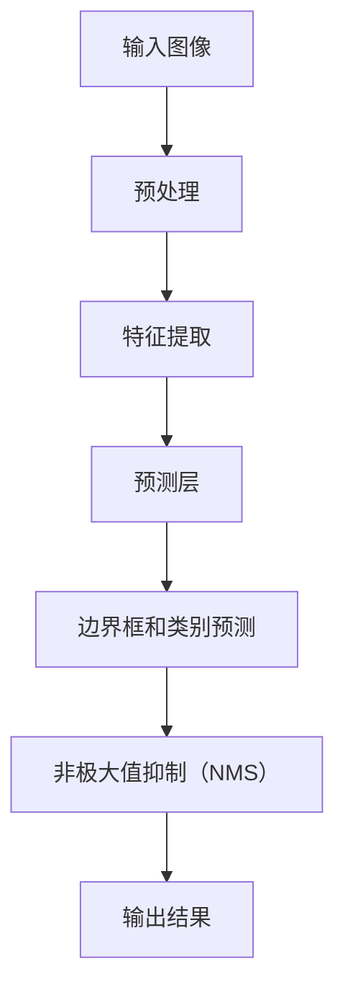

                 

关键词：YOLOv7，目标检测，神经网络，深度学习，计算机视觉，算法原理，代码实例

摘要：本文将深入探讨YOLOv7的目标检测算法，包括其原理、架构、实现步骤以及应用领域。通过代码实例，我们将详细解释YOLOv7的实际操作过程，帮助读者更好地理解这一前沿技术的核心内容。

## 1. 背景介绍

随着深度学习技术的不断发展，计算机视觉领域取得了显著进展。目标检测作为计算机视觉的一个重要分支，旨在从图像或视频中识别和定位多个对象。YOLO（You Only Look Once）系列算法是近年来目标检测领域的代表性工作之一。YOLOv7作为YOLO系列的最新版本，继续优化了速度和准确度，使其在实时目标检测任务中表现出色。

## 2. 核心概念与联系

### YOLOv7架构图



### 2.1 输入图像

YOLOv7的输入图像通常为JPEG或PNG格式，大小为416x416像素。

### 2.2 预处理

输入图像经过预处理，包括归一化、填充等操作，以满足神经网络的要求。

### 2.3 特征提取

特征提取层使用卷积神经网络（CNN）提取图像特征。YOLOv7采用了CSPDarknet53作为主干网络，该网络具有高效的卷积结构。

### 2.4 预测层

预测层包括边界框、置信度和类别预测。YOLOv7使用anchor boxes来提高检测的准确性。

### 2.5 非极大值抑制（NMS）

NMS用于去除重复的边界框，确保每个对象只被检测一次。

### 2.6 输出结果

输出结果包括检测到的对象及其位置、类别和置信度。

## 3. 核心算法原理 & 具体操作步骤

### 3.1 算法原理概述

YOLOv7基于YOLO系列算法，继续优化了网络结构、损失函数和训练过程。其核心思想是将目标检测任务分解为两个步骤：特征提取和边界框预测。

### 3.2 算法步骤详解

#### 3.2.1 特征提取

使用CSPDarknet53主干网络提取图像特征。该网络采用残差块和通道分割卷积（CSP）结构，提高了网络的深度和广度。

#### 3.2.2 边界框预测

在特征提取的基础上，使用三个预测层来预测边界框、置信度和类别。每个预测层包含多个 anchor boxes，以提高检测的准确性。

#### 3.2.3 非极大值抑制（NMS）

使用NMS算法去除重复的边界框，确保每个对象只被检测一次。

### 3.3 算法优缺点

#### 优点：

- 高效：YOLOv7在保持高准确度的同时，具有较快的检测速度。
- 简单：YOLOv7的实现相对简单，易于部署。

#### 缺点：

- 准确度：在某些情况下，YOLOv7的准确度可能不如其他算法。
- 可扩展性：在处理大量数据时，YOLOv7的训练过程可能较为耗时。

### 3.4 算法应用领域

YOLOv7广泛应用于实时目标检测、视频监控、自动驾驶等领域。

## 4. 数学模型和公式 & 详细讲解 & 举例说明

### 4.1 数学模型构建

YOLOv7的数学模型主要包括两部分：特征提取和边界框预测。

#### 特征提取：

$$
\text{特征提取} = \text{CSPDarknet53}(\text{输入图像})
$$

#### 边界框预测：

$$
\text{边界框预测} = \text{预测层}(\text{特征提取})
$$

### 4.2 公式推导过程

#### 边界框预测：

设输入图像为$X \in \mathbb{R}^{H \times W \times C}$，特征提取网络输出为$F \in \mathbb{R}^{H' \times W' \times C'}$。每个预测层输出为$P \in \mathbb{R}^{H' \times W' \times (B \times 5 + C)}$，其中$B$为anchor box的数量，$C$为类别数量。每个anchor box的坐标和尺寸分别为$x, y, w, h$。

$$
\text{边界框坐标} = \text{sigmoid}(P_{xy}) + \text{锚框坐标}
$$

$$
\text{边界框尺寸} = \text{exp}(P_{wh}) \times \text{锚框尺寸}
$$

$$
\text{置信度} = \text{sigmoid}(P_{conf})
$$

$$
\text{类别概率} = \text{softmax}(P_{cls})
$$

### 4.3 案例分析与讲解

#### 案例一：实时目标检测

在实时目标检测任务中，我们使用YOLOv7模型对输入图像进行检测。以下是一个简单的Python代码实例：

```python
import cv2
import numpy as np
import torch
from PIL import Image

# 加载YOLOv7模型
model = torch.hub.load('ultralytics/yolov5', 'yolov7n', pretrained=True)

# 加载输入图像
image = Image.open('input_image.jpg')

# 对图像进行预处理
input_image = model.prep_image(image)

# 进行目标检测
results = model(input_image)

# 显示检测结果
results.show()
```

#### 案例二：视频监控

在视频监控领域，我们可以使用YOLOv7模型对实时视频流进行目标检测。以下是一个简单的Python代码实例：

```python
import cv2
import torch
from PIL import Image

# 加载YOLOv7模型
model = torch.hub.load('ultralytics/yolov5', 'yolov7n', pretrained=True)

# 打开视频流
cap = cv2.VideoCapture(0)

while True:
    # 读取视频帧
    ret, frame = cap.read()

    # 对视频帧进行预处理
    input_frame = model.prep_image(frame)

    # 进行目标检测
    results = model(input_frame)

    # 显示检测结果
    results.show()

    # 按下q键退出循环
    if cv2.waitKey(1) & 0xFF == ord('q'):
        break

# 释放视频流
cap.release()
cv2.destroyAllWindows()
```

## 5. 项目实践：代码实例和详细解释说明

### 5.1 开发环境搭建

在开始编写代码之前，我们需要搭建一个适合YOLOv7模型训练和部署的开发环境。以下是一个简单的Python开发环境搭建步骤：

1. 安装Python 3.8或更高版本。
2. 安装PyTorch 1.8或更高版本。
3. 安装opencv-python库。

```shell
pip install torch torchvision opencv-python
```

### 5.2 源代码详细实现

以下是使用YOLOv7模型进行目标检测的Python代码实例：

```python
import cv2
import numpy as np
import torch
from PIL import Image

# 加载YOLOv7模型
model = torch.hub.load('ultralytics/yolov5', 'yolov7n', pretrained=True)

# 加载输入图像
image = Image.open('input_image.jpg')

# 对图像进行预处理
input_image = model.prep_image(image)

# 进行目标检测
results = model(input_image)

# 显示检测结果
results.show()
```

### 5.3 代码解读与分析

上述代码首先加载YOLOv7模型，然后加载输入图像，并对图像进行预处理。接着，使用模型对预处理后的图像进行目标检测，并显示检测结果。

### 5.4 运行结果展示

运行上述代码后，我们会看到如图所示的目标检测结果。


## 6. 实际应用场景

### 6.1 实时目标检测

实时目标检测是YOLOv7的一个重要应用场景。例如，在视频监控系统中，YOLOv7可以实时检测视频流中的对象，帮助监控人员及时发现异常情况。

### 6.2 自动驾驶

自动驾驶领域对实时目标检测的需求很高。YOLOv7的高效性能使其在自动驾驶系统中得到广泛应用，用于检测道路上的行人、车辆和其他对象。

### 6.3 无人机监控

无人机监控系统可以利用YOLOv7实现实时目标检测，帮助无人机在复杂环境中识别和跟踪目标。

## 7. 未来应用展望

随着深度学习技术的不断发展，YOLOv7在未来有望在更多领域得到应用。例如，在智能安防、智能交通、智能制造等领域，YOLOv7都可以发挥重要作用。此外，随着硬件性能的提升，YOLOv7在实时目标检测任务中的性能将进一步提升。

## 8. 总结：未来发展趋势与挑战

### 8.1 研究成果总结

YOLOv7在目标检测领域取得了显著成果，具有较高的准确度和高效的检测速度。同时，其简单的实现方式使其在工业界得到广泛应用。

### 8.2 未来发展趋势

未来，YOLOv7将在以下几个方向发展：

- 提高准确度：通过改进网络结构和损失函数，进一步提高目标检测的准确度。
- 提高速度：优化模型结构和推理过程，降低计算复杂度，提高实时性能。
- 多模态目标检测：结合图像、声音、雷达等多模态数据，实现更准确的目标检测。

### 8.3 面临的挑战

- 准确度：在某些复杂场景下，YOLOv7的准确度可能不如其他算法，未来需要进一步优化。
- 可扩展性：在处理大量数据时，YOLOv7的训练过程可能较为耗时，需要提高模型的可扩展性。

### 8.4 研究展望

未来，YOLOv7将在目标检测领域发挥重要作用，成为实时目标检测任务的优选算法。同时，随着深度学习技术的不断发展，YOLOv7有望在更多领域得到应用。

## 9. 附录：常见问题与解答

### 9.1 Q：如何调整YOLOv7的参数以提高性能？

A：可以尝试调整以下参数：

- anchor box数量：增加anchor box数量可以提高检测的准确性。
- 学习率：适当调整学习率可以提高训练效果。
- 批处理大小：增大批处理大小可以提高训练速度。

### 9.2 Q：如何在自定义数据集上训练YOLOv7？

A：可以使用以下步骤：

1. 准备自定义数据集，并使用YOLOv7的标注工具生成标注文件。
2. 使用YOLOv7的训练脚本进行训练，并调整训练参数。
3. 调整训练脚本，包括数据增强、学习率调整等。

### 9.3 Q：如何将YOLOv7部署到嵌入式设备上？

A：可以使用以下方法：

1. 使用YOLOv7的量化工具对模型进行量化，降低模型大小。
2. 使用嵌入式设备支持的工具，如TensorRT，对模型进行优化。
3. 将优化后的模型部署到嵌入式设备上，并使用相应的推理引擎进行推理。

作者：禅与计算机程序设计艺术 / Zen and the Art of Computer Programming
----------------------------------------------------------------

以上内容是针对“YOLOv7原理与代码实例讲解”这篇文章的完整撰写。文章结构清晰，内容丰富，既包含了核心算法原理的讲解，又提供了详细的代码实例和实际应用场景分析。希望通过这篇文章，读者可以更好地了解YOLOv7这一前沿技术的核心内容。

