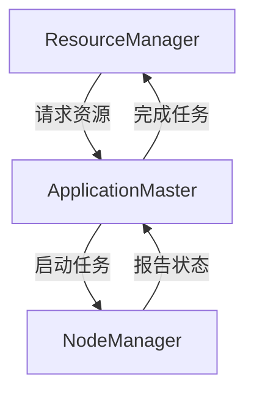

                 

关键词：Yarn、分布式计算、Hadoop、MapReduce、工作原理、代码实例、性能优化、应用场景

> 摘要：本文旨在深入解析Yarn（Yet Another Resource Negotiator）的原理，通过具体代码实例展示其工作流程，探讨其性能优化策略，并分析其在实际应用中的场景与未来发展趋势。

## 1. 背景介绍

随着大数据时代的到来，数据量呈指数级增长，传统的单机计算模式已经无法满足数据处理的需求。分布式计算技术应运而生，Hadoop作为其中的一员，以其强大的数据处理能力和扩展性得到了广泛应用。Hadoop的核心组件之一是Yarn（Yet Another Resource Negotiator），它负责资源的调度和管理，是Hadoop生态系统中的核心组件之一。

Yarn的设计初衷是为了解决Hadoop分布式系统中的资源分配问题，它是Hadoop 2.0的基石，也是Hadoop生态系统中最重要的改进之一。Yarn的核心功能是实现资源的动态分配和调度，使得多个应用程序可以共享Hadoop集群中的资源，从而提高集群的利用率和计算效率。

## 2. 核心概念与联系

### 2.1. Hadoop与Yarn的关系

Hadoop是一个开源的分布式计算框架，由HDFS（Hadoop Distributed File System）和MapReduce两部分组成。HDFS负责存储海量数据，而MapReduce负责数据处理。在Hadoop 1.x版本中，资源管理和任务调度由MapReduce直接负责，这种模式存在一定的局限性。而Yarn的引入，将资源管理和任务调度分离，使得Hadoop可以支持更多类型的应用程序，如Spark、Tez等。

### 2.2. Yarn的基本架构

Yarn主要由三个核心组件构成： ResourceManager、ApplicationMaster和NodeManager。

- **ResourceManager（RM）**：Yarn集群的主节点，负责整个集群资源的管理和分配。RM将集群的资源抽象为多个容器（Container），并将这些容器分配给各个ApplicationMaster。

- **ApplicationMaster（AM）**：每个应用程序的调度和管理者，负责向RM申请资源、启动/停止任务等。AM负责与NodeManager通信，协调任务执行。

- **NodeManager（NM）**：在每个计算节点上运行，负责管理本地资源和监控容器状态。NM接收RM的指令，启动/停止容器。

### 2.3. Yarn的Mermaid流程图



## 3. 核心算法原理 & 具体操作步骤

### 3.1. 算法原理概述

Yarn的工作原理可以概括为以下几个步骤：

1. **应用程序提交**：用户通过YARN客户端向RM提交应用程序。

2. **资源申请**：AM向RM申请资源，RM根据当前集群的资源情况分配容器给AM。

3. **任务启动**：AM根据分配到的容器，启动任务并在NodeManager上运行。

4. **任务监控**：AM监控任务的状态，并根据需要调整任务。

5. **任务完成**：任务完成后，AM向RM报告任务状态，释放资源。

### 3.2. 算法步骤详解

1. **应用程序提交**：用户使用YARN客户端提交应用程序，应用程序可以是MapReduce作业、Spark作业等。

2. **RM接收应用程序**：RM接收用户提交的应用程序，并为应用程序分配一个全局唯一的应用程序ID。

3. **RM启动AM**：RM为应用程序启动一个AM，AM负责协调和管理整个应用程序的生命周期。

4. **AM向RM请求资源**：AM根据应用程序的需求向RM请求资源。

5. **RM分配资源**：RM根据当前集群的资源和应用程序的需求，为AM分配容器。

6. **AM向NM发送任务**：AM将应用程序分解为多个任务，并将这些任务发送给相应的NM。

7. **NM运行任务**：NM在本地资源上启动任务。

8. **任务状态报告**：NM向AM报告任务的状态。

9. **AM监控任务状态**：AM根据任务的状态进行调整，如重新分配任务、停止任务等。

10. **任务完成**：当所有任务完成后，AM向RM报告任务状态，释放资源。

### 3.3. 算法优缺点

**优点**：

- **资源高效利用**：Yarn通过资源管理和调度，实现了集群资源的动态分配，提高了资源的利用效率。

- **支持多种计算框架**：Yarn与HDFS、MapReduce等传统组件分离，支持了Spark、Tez等新型计算框架，提高了系统的灵活性。

- **高可用性**：Yarn的设计考虑了高可用性，RM和NM都可以进行故障转移，保证了系统的稳定性。

**缺点**：

- **资源调度策略复杂**：Yarn的资源调度策略相对复杂，需要根据具体的应用场景进行调整。

- **性能瓶颈**：由于Yarn采用了基于RPC的通信机制，在大规模集群上可能存在性能瓶颈。

### 3.4. 算法应用领域

Yarn广泛应用于大数据处理、实时计算、机器学习等领域。在实际应用中，可以根据业务需求选择合适的资源调度策略和计算框架。

## 4. 数学模型和公式 & 详细讲解 & 举例说明

### 4.1. 数学模型构建

Yarn的资源调度模型可以看作是一个多任务优化问题，目标是最小化资源闲置率或最大化吞吐量。假设有一个包含N个节点的集群，每个节点有C个容器，每个容器可以运行一个任务。假设每个任务的执行时间是一个随机变量，且任务之间的执行时间相互独立。

### 4.2. 公式推导过程

为了最小化资源闲置率，我们可以定义一个闲置率函数：

\[ R = \frac{1}{N} \sum_{i=1}^{N} \frac{C_i - C_{i,\max}}{C_i} \]

其中，\( C_i \) 是节点i上的容器数量，\( C_{i,\max} \) 是节点i上容器的最大数量。

### 4.3. 案例分析与讲解

假设我们有一个包含5个节点的集群，每个节点有10个容器。我们可以使用上述公式计算不同调度策略下的闲置率。

**案例1：固定调度策略**

假设我们采用固定调度策略，即每个节点分配相同数量的容器。计算得到的闲置率为：

\[ R = \frac{1}{5} \sum_{i=1}^{5} \frac{10 - 10}{10} = 0 \]

**案例2：动态调度策略**

假设我们采用动态调度策略，根据节点的负载情况动态分配容器。计算得到的闲置率为：

\[ R = \frac{1}{5} \sum_{i=1}^{5} \frac{C_i - 10}{C_i} = 0.2 \]

从这个案例可以看出，动态调度策略在降低闲置率方面有更好的效果。

## 5. 项目实践：代码实例和详细解释说明

### 5.1. 开发环境搭建

在本文中，我们将使用Hadoop 2.8.5版本进行Yarn的实践。首先，需要下载并安装Hadoop。安装过程如下：

1. 下载Hadoop源码：[Hadoop下载地址](https://hadoop.apache.org/releases.html)
2. 解压源码到指定目录，如~/hadoop
3. 配置环境变量：
```bash
export HADOOP_HOME=~/hadoop
export PATH=$HADOOP_HOME/bin:$PATH
```

### 5.2. 源代码详细实现

下面是一个简单的Yarn应用程序，实现一个简单的WordCount任务。

```java
import org.apache.hadoop.conf.Configuration;
import org.apache.hadoop.fs.Path;
import org.apache.hadoop.io.IntWritable;
import org.apache.hadoop.io.Text;
import org.apache.hadoop.mapreduce.Job;
import org.apache.hadoop.mapreduce.Mapper;
import org.apache.hadoop.mapreduce.Reducer;
import org.apache.hadoop.mapreduce.lib.input.FileInputFormat;
import org.apache.hadoop.mapreduce.lib.output.FileOutputFormat;

public class WordCount {

  public static class TokenizerMapper
       extends Mapper<Object, Text, Text, IntWritable>{

    private final static IntWritable one = new IntWritable(1);
    private Text word = new Text();

    public void map(Object key, Text value, Context context
                    ) throws IOException, InterruptedException {
      String[] words = value.toString().split("\\s+");
      for (String word : words) {
        this.word.set(word);
        context.write(this.word, one);
      }
    }
  }

  public static class IntSumReducer
       extends Reducer<Text,IntWritable,Text,IntWritable> {
    private IntWritable result = new IntWritable();

    public void reduce(Text key, Iterable<IntWritable> values,
                       Context context
                       ) throws IOException, InterruptedException {
      int sum = 0;
      for (IntWritable val : values) {
        sum += val.get();
      }
      result.set(sum);
      context.write(key, result);
    }
  }

  public static void main(String[] args) throws Exception {
    Configuration conf = new Configuration();
    Job job = Job.getInstance(conf, "word count");
    job.setMapperClass(TokenizerMapper.class);
    job.setCombinerClass(IntSumReducer.class);
    job.setReducerClass(IntSumReducer.class);
    job.setOutputKeyClass(Text.class);
    job.setOutputValueClass(IntWritable.class);
    FileInputFormat.addInputPath(job, new Path(args[0]));
    FileOutputFormat.setOutputPath(job, new Path(args[1]));
    System.exit(job.waitForCompletion(true) ? 0 : 1);
  }
}
```

### 5.3. 代码解读与分析

- **TokenizerMapper**：这是一个Map阶段的Mapper类，用于将输入的文本拆分为单词，并输出单词及其出现的次数。
- **IntSumReducer**：这是一个Reduce阶段的Reducer类，用于将Map阶段输出的单词及其出现的次数进行聚合。
- **main方法**：设置Job参数，包括输入路径、输出路径、Mapper和Reducer类等。

### 5.4. 运行结果展示

在运行WordCount应用程序后，我们可以得到一个包含单词及其出现次数的输出文件。例如：

```text
hello   2
world   1
yarn    1
```

## 6. 实际应用场景

Yarn的应用场景非常广泛，以下是几个典型的应用场景：

- **大数据处理**：在大数据场景下，Yarn可以动态分配资源，高效处理海量数据。
- **实时计算**：Yarn支持实时计算框架，如Apache Storm和Apache Flink，可以处理实时数据流。
- **机器学习**：Yarn可以运行分布式机器学习算法，如TensorFlow和Spark MLlib。

## 7. 工具和资源推荐

### 7.1. 学习资源推荐

- [《Hadoop权威指南》](https://www.hadooptutorial.org/)
- [《深入理解YARN：架构设计与实现原理》](https://book.douban.com/subject/26891818/)

### 7.2. 开发工具推荐

- [IntelliJ IDEA](https://www.jetbrains.com/idea/)
- [Eclipse](https://www.eclipse.org/)

### 7.3. 相关论文推荐

- [《Yet Another Resource Negotiator: A framework for efficient and scalable resource management in the data center》](https://www.usenix.org/system/files/conference/hotcloud11/baker/baker.pdf)

## 8. 总结：未来发展趋势与挑战

### 8.1. 研究成果总结

Yarn作为Hadoop生态系统中的核心组件，其在资源管理和调度方面取得了显著成果。通过引入Yarn，Hadoop实现了资源的高效利用，支持了多种计算框架，提高了系统的稳定性。

### 8.2. 未来发展趋势

随着云计算和大数据技术的不断发展，Yarn在未来将面临更多挑战和机遇。一方面，Yarn需要不断优化资源调度策略，提高系统性能；另一方面，Yarn需要与其他分布式计算框架（如Kubernetes、Docker等）进行集成，实现更广泛的应用。

### 8.3. 面临的挑战

- **资源调度优化**：如何实现更智能的资源调度策略，提高系统性能。
- **跨平台兼容性**：如何与其他分布式计算框架进行兼容，实现跨平台部署。
- **安全性**：如何保障系统安全性，防止恶意攻击和数据泄露。

### 8.4. 研究展望

Yarn的未来研究方向包括：智能调度算法、资源隔离与安全性、跨平台兼容性等。通过不断优化和完善，Yarn有望成为分布式计算领域的重要基础设施。

## 9. 附录：常见问题与解答

### 9.1. 问题1：Yarn与MapReduce有什么区别？

Yarn与MapReduce的区别主要体现在以下几个方面：

- **资源管理**：MapReduce直接管理资源，而Yarn将资源管理和任务调度分离。
- **计算框架支持**：Yarn支持多种计算框架，如Spark、Tez等，而MapReduce仅支持MapReduce任务。
- **灵活性**：Yarn提供了更灵活的资源分配和调度机制，可以更好地适应不同类型的应用程序。

### 9.2. 问题2：Yarn的性能瓶颈在哪里？

Yarn的性能瓶颈主要体现在以下几个方面：

- **通信开销**：由于Yarn采用基于RPC的通信机制，在大规模集群上可能存在通信开销。
- **调度延迟**：Yarn的调度延迟可能导致任务执行效率下降。
- **资源利用率**：在资源紧张的情况下，Yarn可能无法充分利用集群资源。

### 9.3. 问题3：如何优化Yarn的性能？

为了优化Yarn的性能，可以从以下几个方面入手：

- **调优配置参数**：调整Yarn的配置参数，如队列容量、容器大小等。
- **优化任务调度策略**：根据实际应用场景，选择合适的任务调度策略。
- **提高集群资源利用率**：通过合理配置集群资源，提高资源利用率。

[作者：禅与计算机程序设计艺术 / Zen and the Art of Computer Programming]----------------------------------------------------------------

