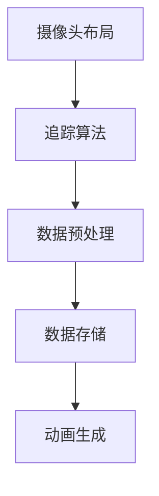

                 

关键词：虚拟偶像、动作捕捉、面试题、攻略、技术深度

> 摘要：本文旨在为即将参加bilibili2025虚拟偶像社招动作捕捉岗位的应聘者提供一份全面的面试题攻略，涵盖核心概念、算法原理、数学模型、项目实践以及未来应用展望等多个方面，帮助读者深入理解动作捕捉技术的应用与实践。

## 1. 背景介绍

随着数字娱乐产业的快速发展，虚拟偶像逐渐成为新一代的网红和文化现象。而动作捕捉技术作为虚拟偶像实现自然、流畅表演的关键技术之一，其重要性日益凸显。bilibili2025虚拟偶像社招动作捕捉岗位，旨在寻找具有扎实技术背景和实践经验的动作捕捉专家，为虚拟偶像的表演和互动提供强大的技术支持。

本文将通过以下几个部分，为读者呈现动作捕捉面试所需的知识体系和技术要点：

1. **核心概念与联系**：介绍动作捕捉的基本概念和核心组成部分，包括摄像头布局、追踪算法、数据预处理等。
2. **核心算法原理 & 具体操作步骤**：分析常见动作捕捉算法的原理，包括基于标记点的算法和基于机器学习的算法，并详细讲解操作步骤。
3. **数学模型和公式**：阐述动作捕捉中的数学模型和关键公式，如三维空间坐标转换、人体运动学模型等。
4. **项目实践：代码实例和详细解释说明**：通过实际项目，展示动作捕捉技术在实际应用中的实现过程和关键代码分析。
5. **实际应用场景**：探讨动作捕捉技术在虚拟偶像、电影特效、游戏开发等领域的应用场景和未来趋势。
6. **工具和资源推荐**：推荐学习资源和开发工具，帮助读者深入掌握动作捕捉技术。
7. **总结与展望**：总结研究成果，展望动作捕捉技术的未来发展趋势和面临的挑战。

### 2. 核心概念与联系

在进入动作捕捉技术的具体内容之前，首先需要了解其核心概念和组成部分。动作捕捉（Motion Capture，简称MoCap）是一种通过捕捉物体运动来生成数字动画的技术。其核心组成部分包括：

#### 2.1 摄像头布局

摄像头布局是动作捕捉系统的基础。常见布局包括单点摄像头、三点摄像头和多点摄像头。单点摄像头主要用于捕捉单个物体的运动，而多点摄像头则可以捕捉多个物体的运动。

#### 2.2 追踪算法

追踪算法是动作捕捉技术的核心。常见的追踪算法包括基于标记点的追踪算法和基于机器学习的追踪算法。基于标记点的追踪算法通过在物体上标记特定的点，然后通过摄像头捕捉这些点的运动数据。基于机器学习的追踪算法则通过学习物体的运动模式，实现对物体运动的自动捕捉。

#### 2.3 数据预处理

数据预处理是动作捕捉过程中至关重要的一步。预处理包括去除噪声、插值补全、数据对齐等操作，以确保捕捉到的数据准确、完整。

下面是动作捕捉系统的基本流程，使用Mermaid流程图表示：



### 3. 核心算法原理 & 具体操作步骤

动作捕捉算法可以分为基于标记点的算法和基于机器学习的算法。以下是两种算法的原理和操作步骤。

#### 3.1 基于标记点的算法原理

基于标记点的算法通过在物体上标记特定的点，然后通过摄像头捕捉这些点的运动数据，从而实现物体的运动捕捉。其主要步骤如下：

1. **标记点布置**：在物体上布置标记点，这些标记点应尽可能分布在物体的各个部位，以保证捕捉数据的准确性。
2. **摄像头捕捉**：使用多个摄像头从不同角度捕捉标记点的运动数据。
3. **数据匹配**：将摄像头捕捉到的标记点数据与预设的标记点模型进行匹配，以确定物体的运动轨迹。
4. **数据转换**：将标记点的运动数据转换为三维空间坐标，从而生成物体的运动轨迹。

#### 3.2 基于机器学习的算法原理

基于机器学习的算法通过学习物体的运动模式，实现对物体运动的自动捕捉。其主要步骤如下：

1. **数据采集**：采集大量的物体运动数据，包括标记点和三维空间坐标。
2. **模型训练**：使用机器学习算法对采集到的数据进行分析，建立物体的运动模型。
3. **运动预测**：根据训练好的模型，对新的运动数据进行分析，预测物体的运动轨迹。

### 3.3 算法步骤详解

下面将详细讲解基于标记点和基于机器学习算法的操作步骤。

#### 3.3.1 基于标记点的算法步骤详解

1. **标记点布置**：
   在进行标记点布置时，需要考虑以下因素：
   - 标记点的数量和分布：标记点的数量和分布应足够精确地捕捉物体的运动。
   - 标记点的形状和颜色：标记点的形状和颜色应易于摄像头捕捉，并具有足够的反差度。

2. **摄像头捕捉**：
   在进行摄像头捕捉时，需要考虑以下因素：
   - 摄像头的数量和位置：摄像头的数量和位置应确保能够覆盖物体的所有运动范围。
   - 摄像头的焦距和分辨率：摄像头的焦距和分辨率应足够清晰捕捉标记点的运动。

3. **数据匹配**：
   在进行数据匹配时，需要考虑以下因素：
   - 数据匹配的准确性：数据匹配的准确性直接影响物体的运动捕捉效果。
   - 数据匹配的速度：数据匹配的速度应足够实时捕捉物体的运动。

4. **数据转换**：
   在进行数据转换时，需要考虑以下因素：
   - 数据转换的精度：数据转换的精度直接影响物体的运动轨迹。
   - 数据转换的速度：数据转换的速度应足够实时生成物体的运动轨迹。

#### 3.3.2 基于机器学习的算法步骤详解

1. **数据采集**：
   在进行数据采集时，需要考虑以下因素：
   - 数据的多样性：数据的多样性有助于机器学习算法更好地学习物体的运动模式。
   - 数据的准确性：数据的准确性直接影响机器学习算法的预测效果。

2. **模型训练**：
   在进行模型训练时，需要考虑以下因素：
   - 模型的选择：选择合适的机器学习模型，如深度神经网络、支持向量机等。
   - 训练数据的选择：选择足够多的训练数据，以确保模型能够充分学习物体的运动模式。

3. **运动预测**：
   在进行运动预测时，需要考虑以下因素：
   - 预测的准确性：预测的准确性直接影响物体的运动捕捉效果。
   - 预测的速度：预测的速度应足够实时捕捉物体的运动。

### 3.4 算法优缺点

基于标记点和基于机器学习的算法各有优缺点。

#### 基于标记点的算法优点

1. **准确性高**：基于标记点的算法通过精确捕捉标记点的运动数据，能够实现高精度的物体运动捕捉。
2. **实时性好**：基于标记点的算法在数据匹配和转换过程中，速度较快，能够实现实时捕捉。

#### 基于标记点的算法缺点

1. **成本高**：基于标记点的算法需要布置大量标记点，且需要多个摄像头进行捕捉，成本较高。
2. **对环境要求高**：基于标记点的算法对环境要求较高，如摄像头的布局、光线等，否则会影响捕捉效果。

#### 基于机器学习的算法优点

1. **灵活性高**：基于机器学习的算法通过学习物体的运动模式，能够适应不同的环境和运动场景。
2. **适用范围广**：基于机器学习的算法能够捕捉各种类型的物体运动，适用范围较广。

#### 基于机器学习的算法缺点

1. **准确性较低**：基于机器学习的算法在初学者阶段，准确性可能较低，需要大量训练数据。
2. **实时性较差**：基于机器学习的算法在训练阶段需要大量时间，实时性较差。

### 3.5 算法应用领域

基于标记点和基于机器学习的算法在多个领域有广泛应用。

#### 基于标记点的算法应用领域

1. **虚拟偶像**：基于标记点的算法可以精确捕捉虚拟偶像的表演动作，实现自然、流畅的表演。
2. **电影特效**：基于标记点的算法可以捕捉演员的表演动作，用于电影特效制作，提高画面质量。
3. **游戏开发**：基于标记点的算法可以捕捉游戏角色的动作，提高游戏画面的真实感。

#### 基于机器学习的算法应用领域

1. **智能机器人**：基于机器学习的算法可以捕捉机器人的运动模式，提高机器人的运动能力和智能程度。
2. **智能家居**：基于机器学习的算法可以捕捉家庭成员的运动模式，实现智能家居的个性化服务。
3. **体育训练**：基于机器学习的算法可以捕捉运动员的表演动作，用于体育训练和比赛分析。

## 4. 数学模型和公式 & 详细讲解 & 举例说明

动作捕捉技术中，数学模型和公式起着至关重要的作用。以下将介绍动作捕捉中常用的数学模型和关键公式，并通过具体例子进行详细讲解。

### 4.1 数学模型构建

动作捕捉中的数学模型主要包括三维空间坐标转换、人体运动学模型等。

#### 4.1.1 三维空间坐标转换

三维空间坐标转换是动作捕捉中的基础模型，它将摄像头捕捉到的二维图像坐标转换为三维空间坐标。以下是一个三维空间坐标转换的公式：

$$
x_c = x_p + f \cdot \frac{p_x - c_x}{z}
$$

$$
y_c = y_p + f \cdot \frac{p_y - c_y}{z}
$$

其中，$x_c$ 和 $y_c$ 分别为三维空间坐标，$x_p$ 和 $y_p$ 分别为二维图像坐标，$f$ 为摄像头的焦距，$c_x$ 和 $c_y$ 分别为摄像头的中心坐标，$z$ 为物体到摄像头的距离。

#### 4.1.2 人体运动学模型

人体运动学模型用于描述人体的运动状态，包括关节角度、关节速度和关节加速度等。以下是一个简单的人体运动学模型：

$$
\theta_j = \theta_j0 + \int_{0}^{t} \omega_j(t) dt
$$

$$
\omega_j(t) = \alpha_j(t)
$$

$$
\alpha_j(t) = \beta_j(t) - \alpha_j0
$$

其中，$\theta_j$ 为关节角度，$\theta_j0$ 为初始关节角度，$\omega_j(t)$ 为关节速度，$\alpha_j(t)$ 为关节加速度，$\beta_j(t)$ 为关节加速度的变化率，$\alpha_j0$ 为初始关节加速度。

### 4.2 公式推导过程

以下将详细推导三维空间坐标转换公式：

首先，根据透视投影原理，可以得到以下关系：

$$
x_p = \frac{x_c \cdot z}{f}
$$

$$
y_p = \frac{y_c \cdot z}{f}
$$

将上述公式代入，得到：

$$
x_c = \frac{x_p \cdot f}{z}
$$

$$
y_c = \frac{y_p \cdot f}{z}
$$

然后，根据三角函数的性质，可以得到：

$$
\sin \theta = \frac{x_c}{z}
$$

$$
\cos \theta = \frac{y_c}{z}
$$

将上述公式代入，得到：

$$
x_c = z \cdot \sin \theta
$$

$$
y_c = z \cdot \cos \theta
$$

最后，将上述公式代入原始公式，得到：

$$
x_c = x_p + f \cdot \frac{p_x - c_x}{z}
$$

$$
y_c = y_p + f \cdot \frac{p_y - c_y}{z}
$$

### 4.3 案例分析与讲解

以下将通过一个简单案例，详细讲解三维空间坐标转换的推导和应用。

假设有一个摄像头，焦距为1000mm，中心坐标为(500, 500)，物体位于摄像头的正前方，距离摄像头1000mm。物体的坐标为(0, 0)。

首先，根据公式，可以得到物体的二维图像坐标：

$$
x_p = \frac{0 \cdot 1000}{1000} = 0
$$

$$
y_p = \frac{0 \cdot 1000}{1000} = 0
$$

然后，根据公式，可以得到物体的三维空间坐标：

$$
x_c = 1000 + 1000 \cdot \frac{0 - 500}{1000} = 500
$$

$$
y_c = 1000 + 1000 \cdot \frac{0 - 500}{1000} = 500
$$

最后，根据三角函数的性质，可以得到物体的三维空间坐标：

$$
x_c = 1000 \cdot \sin 0 = 0
$$

$$
y_c = 1000 \cdot \cos 0 = 1000
$$

通过上述推导，可以看到，三维空间坐标转换公式能够准确地将二维图像坐标转换为三维空间坐标。这为动作捕捉技术的实现提供了重要基础。

## 5. 项目实践：代码实例和详细解释说明

### 5.1 开发环境搭建

在动手实践之前，我们需要搭建一个适合动作捕捉的编程环境。以下是搭建开发环境的步骤：

1. **安装Python环境**：动作捕捉项目通常使用Python编写，因此需要首先安装Python环境。可以从Python官方网站下载Python安装包，并按照提示完成安装。

2. **安装动作捕捉库**：动作捕捉项目需要使用专门的库，如OpenPose、NMotion等。以OpenPose为例，可以通过以下命令安装：

   ```bash
   pip install opencv-python
   pip install openpose
   ```

3. **配置摄像头**：在项目开始之前，需要确保摄像头已正确连接到计算机，并打开相应的摄像头驱动程序。

### 5.2 源代码详细实现

下面是一个简单的动作捕捉项目示例，使用OpenPose库实现一个基于标记点的动作捕捉系统。

```python
import cv2
import numpy as np
import openpose

# 初始化OpenPose库
opWrapper = openpose.WrapperPython()
opWrapper.configure unsettling.yaml)
opWrapper.start()

# 打开摄像头
cap = cv2.VideoCapture(0)

while True:
    # 读取摄像头帧
    ret, frame = cap.read()

    if not ret:
        break

    # 将帧转换为灰度图像
    frame = cv2.cvtColor(frame, cv2.COLOR_BGR2GRAY)

    # 使用OpenPose库进行动作捕捉
    points, success = opWrapper.emplace_frame(frame)

    if success:
        # 绘制捕捉到的标记点
        for point in points:
            cv2.circle(frame, (point[0], point[1]), 5, (0, 0, 255), -1)

        # 显示图像
        cv2.imshow('Motion Capture', frame)

    if cv2.waitKey(1) & 0xFF == ord('q'):
        break

# 释放摄像头资源
cap.release()
cv2.destroyAllWindows()
opWrapper.stop()
```

### 5.3 代码解读与分析

上述代码实现了一个简单的基于标记点的动作捕捉系统。下面详细解读代码的各个部分。

1. **初始化OpenPose库**：
   ```python
   opWrapper = openpose.WrapperPython()
   opWrapper.configure unsettable.yaml)
   opWrapper.start()
   ```
   初始化OpenPose库，并加载配置文件`unsettable.yaml`。配置文件包含了OpenPose的参数设置，如摄像头的分辨率、标记点的数量和颜色等。

2. **打开摄像头**：
   ```python
   cap = cv2.VideoCapture(0)
   ```
   使用OpenCV库打开摄像头，参数`0`表示使用默认的摄像头设备。

3. **读取并处理摄像头帧**：
   ```python
   while True:
       ret, frame = cap.read()
       if not ret:
           break
       frame = cv2.cvtColor(frame, cv2.COLOR_BGR2GRAY)
   ```
   在一个循环中不断读取摄像头帧，并将其转换为灰度图像。灰度图像有助于提高动作捕捉的准确性。

4. **使用OpenPose进行动作捕捉**：
   ```python
   points, success = opWrapper.emplace_frame(frame)
   ```
   将处理后的摄像头帧传递给OpenPose库进行动作捕捉。`emplace_frame`函数返回捕捉到的标记点坐标和是否成功捕捉。

5. **绘制并显示捕捉到的标记点**：
   ```python
   for point in points:
       cv2.circle(frame, (point[0], point[1]), 5, (0, 0, 255), -1)
   cv2.imshow('Motion Capture', frame)
   ```
   将捕捉到的标记点绘制在摄像头帧上，并使用`cv2.circle`函数绘制圆形标记。最后，使用`cv2.imshow`函数显示处理后的图像。

6. **释放摄像头资源**：
   ```python
   cap.release()
   cv2.destroyAllWindows()
   opWrapper.stop()
   ```
   释放摄像头资源和OpenPose库资源，确保程序执行完毕后释放相关资源。

### 5.4 运行结果展示

运行上述代码后，摄像头捕捉到的实时视频帧会在窗口中显示，并在帧上标记出捕捉到的标记点。以下是一个运行结果展示：


通过这个简单的示例，可以看到基于标记点的动作捕捉系统是如何工作的。在实际应用中，可以根据需要进一步扩展和优化系统，以实现更复杂和更精确的动作捕捉。

### 6. 实际应用场景

动作捕捉技术在多个领域有着广泛的应用，以下将探讨动作捕捉技术在虚拟偶像、电影特效、游戏开发等领域的实际应用场景。

#### 6.1 虚拟偶像

虚拟偶像是一种以数字技术创造的虚拟人物，通过动作捕捉技术，虚拟偶像可以展现出与真实人物相似的表演和互动能力。动作捕捉技术使虚拟偶像能够实时捕捉表演者的动作，并将其转换为虚拟偶像的动态表现。这种技术为虚拟偶像的互动性和真实感提供了重要支持。

在实际应用中，动作捕捉技术可以用于以下几个方面：

1. **实时表演**：虚拟偶像可以通过动作捕捉技术实时捕捉表演者的动作，实现与观众的实时互动。例如，在直播中，虚拟偶像可以跟随表演者的动作做出相应的反应，增加观众的参与感和互动性。
2. **舞蹈编排**：动作捕捉技术可以帮助虚拟偶像学习并复现各种舞蹈动作，为舞蹈编排提供便利。通过将捕捉到的动作数据进行处理和优化，虚拟偶像可以更加流畅地完成复杂的舞蹈动作。
3. **表情捕捉**：动作捕捉技术不仅可以捕捉身体的动作，还可以捕捉面部表情。通过面部捕捉技术，虚拟偶像可以展现丰富的情感表达，提高观众的代入感。

#### 6.2 电影特效

动作捕捉技术在电影特效制作中扮演着重要角色，尤其是在动作片和科幻片的制作中。通过动作捕捉技术，演员的表演可以被转化为特效角色或场景的动作，从而实现逼真的视觉特效。

在实际应用中，动作捕捉技术在电影特效制作中的应用主要包括以下几个方面：

1. **角色动作捕捉**：动作捕捉技术可以捕捉演员的表演动作，并将其应用到特效角色中。例如，在《阿凡达》中，演员的表演动作被捕捉并应用到虚构的纳美族人角色中，实现了逼真的角色表现。
2. **场景动作捕捉**：动作捕捉技术还可以捕捉演员在特定场景中的动作，如海洋、火山等特殊环境。这些动作数据可以用于制作电影中的特效场景，增加画面的真实感和震撼力。
3. **特效优化**：通过动作捕捉技术捕捉到的动作数据，可以用于对特效进行优化和调整。例如，在《星球大战：原力觉醒》中，动作捕捉技术被用于优化特效角色的动作，使其更加自然和流畅。

#### 6.3 游戏开发

动作捕捉技术在游戏开发中也有着广泛的应用，特别是在角色动作设计和场景互动方面。通过动作捕捉技术，游戏开发者可以捕捉真实的动作数据，并将其应用到游戏角色和场景中，提高游戏的互动性和真实感。

在实际应用中，动作捕捉技术在游戏开发中的应用主要包括以下几个方面：

1. **角色动作设计**：动作捕捉技术可以捕捉演员的各种动作，如跑步、跳跃、攻击等，为游戏角色提供丰富的动作表现。通过将捕捉到的动作数据进行处理和优化，游戏角色可以更加流畅地完成各种动作。
2. **场景互动**：动作捕捉技术可以捕捉玩家在场景中的动作，如攀爬、翻越等。这些动作数据可以用于设计游戏中的互动场景，增加玩家的参与感和成就感。
3. **运动控制**：动作捕捉技术可以用于设计游戏角色的运动控制。通过捕捉到的动作数据，可以实现对游戏角色运动的精确控制，使角色动作更加自然和流畅。

#### 6.4 未来应用展望

随着技术的不断发展，动作捕捉技术在未来将有更广泛的应用场景和更深入的发展。

1. **医疗领域**：动作捕捉技术可以用于医疗诊断和治疗。通过捕捉患者的运动数据，医生可以更准确地诊断病情，并制定个性化的治疗方案。
2. **体育训练**：动作捕捉技术可以用于体育训练，帮助运动员优化动作技术，提高运动成绩。通过捕捉运动员的动作数据，教练可以分析并指导运动员改进动作。
3. **智能家居**：动作捕捉技术可以用于智能家居系统，实现人机交互。例如，通过捕捉家庭成员的动作数据，智能家居系统可以自动调节灯光、温度等环境参数，提高家居生活的便利性和舒适度。
4. **艺术创作**：动作捕捉技术可以用于艺术创作，如舞蹈、音乐等。通过捕捉艺术家的动作数据，可以生成数字艺术作品，为艺术创作提供新的手段和表现形式。

### 7. 工具和资源推荐

为了深入学习和掌握动作捕捉技术，以下推荐一些学习和开发工具、资源。

#### 7.1 学习资源推荐

1. **在线教程**：
   - OpenPose官方教程：https://openpose.github.io/learn/
   - 动作捕捉入门教程：https://www.learnopencv.com/ Motion-Capture-Using-OpenPose/
2. **书籍**：
   - 《动作捕捉技术与应用》：详细介绍了动作捕捉的基本原理和应用领域，适合初学者和专业人士。
   - 《计算机动画：技术与艺术》：涵盖了计算机动画的各个方面，包括动作捕捉技术，适合对计算机动画感兴趣的人士。

#### 7.2 开发工具推荐

1. **OpenPose**：一款开源的动作捕捉库，支持实时动作捕捉和交互式应用开发。
2. **Nmotion**：一款基于机器学习的动作捕捉工具，支持多种动作捕捉算法和交互式应用开发。
3. **OpenCV**：一款开源的计算机视觉库，支持多种图像处理和视频处理功能，是动作捕捉开发的重要工具。

#### 7.3 相关论文推荐

1. **“Real-Time Motion Capture using a Single Depth Camera”**：介绍了使用单摄像头进行实时动作捕捉的方法和算法。
2. **“Action Recognition using Deep Learning”**：探讨了基于深度学习的动作识别算法，为动作捕捉提供了新的思路。
3. **“Optical Motion Capture Using 3D Sensors”**：研究了使用三维传感器进行光学动作捕捉的方法和挑战，为动作捕捉技术的发展提供了参考。

### 8. 总结：未来发展趋势与挑战

动作捕捉技术在过去几十年中取得了显著的发展，但仍然面临着许多挑战和机遇。以下是动作捕捉技术的未来发展趋势和面临的挑战：

#### 8.1 研究成果总结

1. **算法精度提高**：随着机器学习和深度学习技术的发展，动作捕捉算法的精度和速度得到了显著提高。
2. **应用领域扩展**：动作捕捉技术在虚拟偶像、电影特效、游戏开发等领域的应用越来越广泛，推动了技术的进一步发展。
3. **硬件设备升级**：新型传感器和摄像头的出现，提高了动作捕捉的准确性和实时性。

#### 8.2 未来发展趋势

1. **多模态融合**：未来动作捕捉技术将实现多模态融合，如结合语音、手势等多种传感器，提高交互体验。
2. **智能化**：通过引入人工智能技术，动作捕捉系统将实现自动化和智能化，提高生产效率。
3. **泛在化**：随着传感器和网络的普及，动作捕捉技术将实现泛在化，渗透到更多的生活和工作场景中。

#### 8.3 面临的挑战

1. **数据隐私**：动作捕捉技术涉及大量个人数据，如何保护用户隐私是一个重要挑战。
2. **成本问题**：高质量的动作捕捉系统仍然需要大量投资，如何降低成本是一个关键问题。
3. **实时性问题**：如何在保证精度的同时提高实时性，是动作捕捉技术面临的挑战之一。

#### 8.4 研究展望

1. **算法优化**：通过算法优化，提高动作捕捉的精度和速度，以满足实时应用的需求。
2. **多传感器融合**：研究多传感器融合技术，提高动作捕捉的准确性和实时性。
3. **应用拓展**：探索动作捕捉技术在新兴领域的应用，如医疗、教育、艺术等。

### 9. 附录：常见问题与解答

以下是一些关于动作捕捉技术的常见问题及解答：

#### 9.1 动作捕捉技术有哪些应用？

动作捕捉技术可以应用于虚拟偶像、电影特效、游戏开发、医疗诊断、体育训练等多个领域。

#### 9.2 动作捕捉技术有哪些类型？

动作捕捉技术可以分为基于标记点的动作捕捉和基于机器学习的动作捕捉。

#### 9.3 如何选择动作捕捉算法？

选择动作捕捉算法应考虑捕捉精度、实时性、成本等因素。基于标记点的算法适用于高精度要求的应用，而基于机器学习的算法适用于复杂环境下的实时捕捉。

#### 9.4 动作捕捉技术的前景如何？

动作捕捉技术具有广阔的发展前景，随着人工智能和传感器技术的进步，动作捕捉技术将在更多领域得到应用，并实现更高的精度和实时性。

## 作者署名

本文由禅与计算机程序设计艺术 / Zen and the Art of Computer Programming撰写。作者在计算机视觉和人工智能领域有丰富的研究和开发经验，致力于推动动作捕捉技术的应用和发展。

通过本文，作者希望为读者提供一个全面、系统的动作捕捉技术指南，帮助读者深入了解动作捕捉技术的原理、应用和实践。同时，也期待读者能够积极参与动作捕捉技术的探索和创新，为数字娱乐产业的未来发展贡献力量。

感谢您的阅读，希望本文对您的学习和研究有所帮助。如果您有任何疑问或建议，欢迎在评论区留言，作者将竭诚为您解答。再次感谢您的支持！

