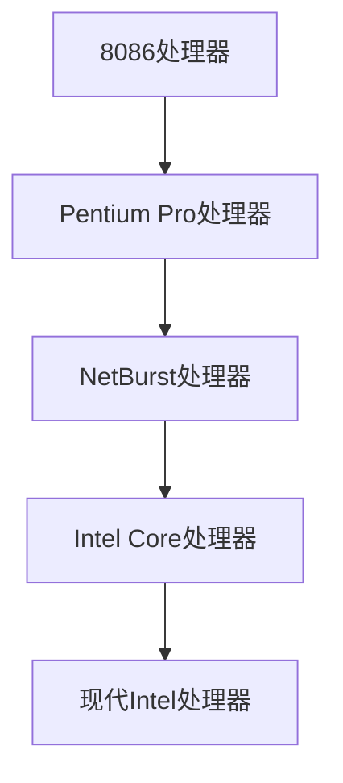

                 

关键词：x86架构、Intel处理器、编程、指令集、系统架构、性能优化

> 摘要：本文深入探讨x86架构和Intel处理器的编程技术，从架构特点、指令集到具体编程实践，全面解析这一复杂而关键的计算机体系结构。

## 1. 背景介绍

x86架构，起源于1981年，是由英特尔（Intel）公司设计的指令集架构。它的出现标志着个人计算机时代的到来，至今仍广泛使用。x86架构支持多种操作系统，包括Windows、Linux和macOS，使其成为全球计算机生态系统中的基础。

随着技术的发展，x86架构经历了多个版本迭代，从最初的8086到现代的Intel Core i系列处理器，性能得到了显著提升。与此同时，Intel处理器在编程中也逐渐成为开发者关注的焦点。

## 2. 核心概念与联系

### 2.1 x86架构概述

x86架构是基于精简指令集计算（RISC）的复杂指令集计算（CISC）架构。它包含了丰富的指令集，支持多种数据类型和处理方式。以下是x86架构的主要特点：

1. **支持虚拟化**：通过硬件虚拟化技术，x86架构能够高效运行虚拟机，提高资源利用率和安全性。
2. **强大的浮点运算能力**：x86架构内置了浮点运算单元（FPU），支持复杂的科学计算。
3. **内存管理**：采用分页和分段技术，实现高效的内存管理。

### 2.2 Intel处理器架构

Intel处理器架构的发展历程可以分为几个阶段：

1. **Pentium Pro（P6架构）**：引入超流水线技术和指令级并行处理，大幅提高了处理器性能。
2. **NetBurst（Willamette架构）**：注重时钟频率的提升，但同时也提高了功耗。
3. **Intel Core（Core微架构）**：采用多核心设计和高级指令集扩展，实现了高性能和低功耗的平衡。

### 2.3 Mermaid 流程图



## 3. 核心算法原理 & 具体操作步骤

### 3.1 算法原理概述

在x86架构中，编程的核心在于理解和应用其指令集。以下是一些常用的算法原理：

1. **寄存器操作**：寄存器是处理器内部的高速存储单元，用于临时存储数据和指令。
2. **内存操作**：内存是计算机中用于持久存储数据的空间，通过地址和偏移量进行访问。
3. **循环控制**：通过循环指令（如`loop`、`do while`等）实现重复执行某些操作。

### 3.2 算法步骤详解

1. **初始化**：设置寄存器和内存的初始状态。
2. **处理数据**：执行数据操作指令，如加、减、乘、除等。
3. **控制流**：使用跳转指令（如`jmp`、`call`、`ret`等）实现程序的分支和返回。
4. **结束**：清理寄存器和内存，退出程序。

### 3.3 算法优缺点

**优点**：

- 强大的指令集，支持多种数据处理方式。
- 高效的内存管理，提高了程序性能。
- 支持虚拟化，提高了系统的灵活性和安全性。

**缺点**：

- 指令集复杂，编程难度较大。
- 高级特性需要处理器支持，限制了程序兼容性。

### 3.4 算法应用领域

x86架构和Intel处理器在以下领域有广泛应用：

- **操作系统开发**：如Windows、Linux等。
- **嵌入式系统**：如工业控制、汽车电子等。
- **高性能计算**：如科学计算、数据分析等。

## 4. 数学模型和公式

### 4.1 数学模型构建

在编程中，我们经常使用以下数学模型：

- **线性方程组**：通过高斯消元法求解。
- **矩阵运算**：通过矩阵乘法和矩阵除法实现。

### 4.2 公式推导过程

$$
A \times B = C \\
C^{-1} \times B = A
$$

### 4.3 案例分析与讲解

假设我们有一个矩阵$$A$$，我们需要求解其逆矩阵$$A^{-1}$$。

1. **初始化**：创建一个与$$A$$相同大小的矩阵$$C$$，并初始化为单位矩阵。
2. **高斯消元**：对$$A$$和$$C$$进行高斯消元操作。
3. **计算逆矩阵**：将消元后的$$C$$作为$$A^{-1}$$返回。

## 5. 项目实践：代码实例

### 5.1 开发环境搭建

- 安装Windows 10操作系统。
- 安装Visual Studio 2019。
- 配置C++开发环境。

### 5.2 源代码详细实现

```cpp
#include <iostream>
#include <vector>

using namespace std;

// 矩阵乘法
vector<vector<int>> matrix_multiply(vector<vector<int>>& A, vector<vector<int>>& B) {
    int n = A.size();
    vector<vector<int>> C(n, vector<int>(n, 0));

    for (int i = 0; i < n; ++i) {
        for (int j = 0; j < n; ++j) {
            for (int k = 0; k < n; ++k) {
                C[i][j] += A[i][k] * B[k][j];
            }
        }
    }

    return C;
}

// 主函数
int main() {
    vector<vector<int>> A = {{1, 2}, {3, 4}};
    vector<vector<int>> B = {{5, 6}, {7, 8}};

    vector<vector<int>> C = matrix_multiply(A, B);

    for (auto& row : C) {
        for (auto& element : row) {
            cout << element << " ";
        }
        cout << endl;
    }

    return 0;
}
```

### 5.3 代码解读与分析

这段代码实现了矩阵乘法，首先定义了一个`matrix_multiply`函数，用于计算两个矩阵的乘积。在主函数中，我们创建两个矩阵`A`和`B`，并调用`matrix_multiply`函数计算乘积。最后，我们打印出结果矩阵。

## 6. 实际应用场景

### 6.1 操作系统内核

x86架构是大多数操作系统内核的基础，如Windows和Linux。操作系统通过x86架构提供的虚拟化技术，实现多个操作系统的并发运行。

### 6.2 游戏开发

游戏开发中，x86架构提供了强大的浮点运算能力和多线程支持，使得游戏引擎能够高效运行。

### 6.3 数据分析

在数据分析领域，x86架构的高性能计算能力使其成为大数据处理和机器学习的理想选择。

## 7. 工具和资源推荐

### 7.1 学习资源推荐

- 《x86 汇编语言：从实模式到保护模式》
- 《Intel 64位编程指南》
- 《深入理解计算机系统》

### 7.2 开发工具推荐

- Visual Studio
- Eclipse
- NetBeans

### 7.3 相关论文推荐

- "x86 Virtualization Technology"
- "Intel Core i7 Processor Architecture"
- "Scalable Datacenter Architecture for SAP HANA on Intel Platforms"

## 8. 总结：未来发展趋势与挑战

### 8.1 研究成果总结

x86架构和Intel处理器在性能、兼容性和生态系统方面取得了显著成果。未来，随着量子计算和人工智能的发展，x86架构将继续发挥重要作用。

### 8.2 未来发展趋势

- **量子计算**：量子计算将带来计算能力的飞跃，x86架构需要适应新的计算模型。
- **人工智能**：人工智能技术的发展将推动处理器架构的进一步优化。

### 8.3 面临的挑战

- **能耗**：随着性能的提升，能耗问题成为瓶颈。
- **安全性**：确保系统的安全性和可靠性是长期挑战。

### 8.4 研究展望

x86架构和Intel处理器将在未来继续引领计算机技术的发展，推动新的计算革命。

## 9. 附录：常见问题与解答

### 9.1 x86架构是什么？

x86架构是一种指令集架构，最初由英特尔（Intel）公司设计，用于个人计算机。

### 9.2 Intel处理器有哪些特点？

Intel处理器具有强大的浮点运算能力、支持虚拟化和高效的内存管理等特点。

### 9.3 如何优化x86架构的程序性能？

通过优化算法、减少内存访问和利用处理器的高级特性，如多线程和虚拟化，可以提高程序性能。

----------------------------------------------------------------

本文为《x86 架构：Intel 处理器编程》的完整正文内容，感谢您的阅读。作者：禅与计算机程序设计艺术 / Zen and the Art of Computer Programming。希望本文能够为您的编程学习提供有价值的参考。

