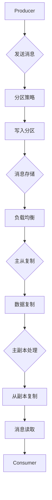

                 

 

## 1. 背景介绍

Kafka 是一款分布式流处理平台和消息队列系统，由 Apache 软件基金会开发并维护。自 2008 年首次推出以来，Kafka 在大数据领域得到了广泛的应用和认可。Kafka 的设计初衷是为了解决海量数据的实时处理和传输问题，其核心优势在于高吞吐量、高可用性和可扩展性。

在传统的数据处理架构中，数据通常以批量方式处理，这会导致数据处理的延迟较高。而 Kafka 提供了实时数据流处理的能力，使得系统能够在数据生成时就进行处理，极大地提高了数据处理效率。Kafka 的应用场景非常广泛，包括实时日志收集、数据同步、事件驱动架构、流数据处理等。

随着大数据和人工智能技术的不断发展，Kafka 在 AI 大数据计算中发挥着越来越重要的作用。本文将详细讲解 Kafka 的原理、架构、核心算法以及代码实例，帮助读者更好地理解和应用 Kafka 在 AI 大数据计算中的价值。

## 2. 核心概念与联系

### 2.1 Kafka 的核心概念

- **Producer**：生产者，负责生产消息并将其发送到 Kafka 集群。
- **Consumer**：消费者，负责消费 Kafka 集群中的消息。
- **Broker**：代理，Kafka 集群中的服务器节点，负责存储和管理消息。
- **Topic**：主题，Kafka 中消息的分类标签，类似数据库中的表。
- **Partition**：分区，主题中的一个分区，用于并行处理消息。
- **Offset**：偏移量，标识消息在分区中的位置。

### 2.2 Kafka 的架构

Kafka 的架构主要包括三个核心组件：Producer、Consumer 和 Broker。

- **Producer**：生产者负责将数据发送到 Kafka 集群。生产者将数据以主题为单位进行分类，并将数据发送到特定的分区中。生产者通过 Kafka 客户端库与 Kafka 集群进行通信。

- **Consumer**：消费者负责从 Kafka 集群中消费数据。消费者以主题为单位订阅消息，并从分区中消费数据。消费者通过 Kafka 客户端库与 Kafka 集群进行通信。

- **Broker**：代理是 Kafka 集群中的服务器节点。每个 Broker 负责存储和管理消息，同时与其他 Broker 进行通信以实现数据的复制和负载均衡。Broker 通过 Kafka 服务端程序进行管理。

### 2.3 Kafka 的核心算法

Kafka 的核心算法主要包括消息的分区策略、负载均衡机制和数据复制策略。

- **分区策略**：Kafka 使用轮询分区策略（Round-Robin），将消息均匀地发送到不同的分区中。这样可以确保每个分区都能均匀地处理消息，提高系统的吞吐量。

- **负载均衡机制**：Kafka 通过负载均衡机制实现集群节点的动态负载均衡。当某个 Broker 节点的负载过高时，集群会将部分分区转移到其他负载较低的 Broker 节点上。

- **数据复制策略**：Kafka 采用主从复制（Master-Slave）机制，确保数据的高可用性和可靠性。每个分区都有一个主副本（Leader）和一个或多个从副本（Follower）。主副本负责处理消息的读写操作，从副本负责复制主副本的数据。

### 2.4 Kafka 的 Mermaid 流程图



## 3. 核心算法原理 & 具体操作步骤

### 3.1 算法原理概述

Kafka 的核心算法原理主要涉及消息的生产、传输、存储和消费过程。以下是每个过程的基本原理：

- **消息生产**：生产者将消息以键值对的形式发送到 Kafka 集群。生产者通过分区策略确定消息的写入分区，并将消息写入分区中的某个偏移量位置。
- **消息传输**：Kafka 使用 ZeroMQ 作为传输层协议，实现高效的消息传输。生产者将消息发送到 Kafka 集群的某个 Broker，Broker 将消息存储在磁盘上并复制到其他 Broker。
- **消息存储**：Kafka 使用 Log structured file system（LSFS）作为存储层，将消息存储在磁盘上。每个分区都有一个日志文件，消息按照顺序写入日志文件。
- **消息消费**：消费者从 Kafka 集群中消费消息。消费者通过偏移量定位到特定的消息位置，并从日志文件中读取消息。

### 3.2 算法步骤详解

以下是 Kafka 核心算法的具体操作步骤：

- **生产者发送消息**：
  1. 生产者将消息封装为 Kafka 消息对象。
  2. 生产者根据分区策略计算消息的写入分区。
  3. 生产者将消息发送到 Kafka 集群的某个 Broker。
  4. Broker 将消息存储在磁盘上并复制到其他 Broker。

- **消息传输**：
  1. 生产者通过 ZeroMQ 协议将消息发送到 Kafka 集群的某个 Broker。
  2. Broker 接收到消息后，将其写入磁盘并复制到其他 Broker。

- **消息存储**：
  1. Kafka 使用 Log structured file system（LSFS）将消息存储在磁盘上。
  2. 每个分区都有一个日志文件，消息按照顺序写入日志文件。

- **消息消费**：
  1. 消费者通过 Kafka 客户端库连接到 Kafka 集群。
  2. 消费者订阅特定的主题，并从 Kafka 集群中拉取消息。
  3. 消费者根据偏移量定位到特定的消息位置，并从日志文件中读取消息。

### 3.3 算法优缺点

Kafka 的核心算法具有以下优缺点：

- **优点**：
  - 高吞吐量：Kafka 采用分区策略和负载均衡机制，能够实现高吞吐量的消息处理。
  - 高可用性：Kafka 采用主从复制机制，确保数据的高可用性和可靠性。
  - 持久化存储：Kafka 使用磁盘存储消息，保证消息的持久化。

- **缺点**：
  - 单点问题：Kafka 集群中的 Broker 是单点故障点，如果 Broker 故障，会导致整个集群不可用。
  - 数据一致性：在主从复制过程中，数据一致性可能存在问题，特别是在主副本故障时。

### 3.4 算法应用领域

Kafka 在以下领域具有广泛的应用：

- **实时日志收集**：Kafka 可以作为日志收集系统，收集各个系统的日志数据，并进行实时处理和分析。
- **数据同步**：Kafka 可以用于数据同步，将不同系统的数据进行实时同步，确保数据的一致性。
- **事件驱动架构**：Kafka 可以作为事件驱动架构的核心组件，处理和分发事件。
- **流数据处理**：Kafka 可以用于实时流数据处理，处理和计算实时数据，为业务决策提供支持。

## 4. 数学模型和公式 & 详细讲解 & 举例说明

### 4.1 数学模型构建

在 Kafka 的算法中，涉及到以下几个数学模型：

- **消息传输延迟模型**：
  - 消息传输延迟 = 发送延迟 + 传输延迟 + 存储延迟

- **负载均衡模型**：
  - 负载均衡度 = 总负载 / 节点数

- **数据一致性模型**：
  - 数据一致性度 = (主副本数 - 从副本数) / 主副本数

### 4.2 公式推导过程

以下是各个数学模型的推导过程：

- **消息传输延迟模型**：

  - 发送延迟：消息从生产者发送到 Kafka 集群的延迟。
  - 传输延迟：消息从 Kafka 集群传输到消费者的延迟。
  - 存储延迟：消息从生产者写入 Kafka 集群到消费者读取的延迟。

  消息传输延迟 = 发送延迟 + 传输延迟 + 存储延迟

- **负载均衡模型**：

  - 总负载：Kafka 集群中各个节点的总负载。
  - 节点数：Kafka 集群中的节点数。

  负载均衡度 = 总负载 / 节点数

- **数据一致性模型**：

  - 主副本数：Kafka 集群中每个分区的主副本数。
  - 从副本数：Kafka 集群中每个分区的从副本数。

  数据一致性度 = (主副本数 - 从副本数) / 主副本数

### 4.3 案例分析与讲解

以下是一个具体的案例：

- **消息传输延迟模型**：

  - 发送延迟：0.5秒
  - 传输延迟：1秒
  - 存储延迟：0.5秒

  消息传输延迟 = 0.5秒 + 1秒 + 0.5秒 = 2秒

- **负载均衡模型**：

  - 总负载：1000个消息/秒
  - 节点数：3个

  负载均衡度 = 1000个消息/秒 / 3个 = 333个消息/秒

- **数据一致性模型**：

  - 主副本数：3个
  - 从副本数：1个

  数据一致性度 = (3个 - 1个) / 3个 = 2/3

## 5. 项目实践：代码实例和详细解释说明

### 5.1 开发环境搭建

在开始编写 Kafka 代码实例之前，我们需要搭建一个 Kafka 开发环境。以下是搭建步骤：

1. 下载 Kafka 二进制文件（例如：kafka_2.12-2.8.0.tgz）。
2. 解压二进制文件到指定目录（例如：/opt/kafka）。
3. 编写 Kafka 配置文件（例如：kafka-server-start.sh）。
4. 启动 Kafka 集群。

### 5.2 源代码详细实现

以下是 Kafka 生产者和消费者的源代码：

**生产者代码示例**：

```python
from kafka import KafkaProducer

# 创建 Kafka Producer
producer = KafkaProducer(bootstrap_servers=['localhost:9092'])

# 发送消息
producer.send('test_topic', b'test_message')

# 关闭 Producer
producer.close()
```

**消费者代码示例**：

```python
from kafka import KafkaConsumer

# 创建 Kafka Consumer
consumer = KafkaConsumer('test_topic', bootstrap_servers=['localhost:9092'])

# 消费消息
for message in consumer:
    print(message.value.decode())

# 关闭 Consumer
consumer.close()
```

### 5.3 代码解读与分析

以下是代码的详细解读和分析：

**生产者代码分析**：

- 导入 KafkaProducer 模块。
- 创建 KafkaProducer 对象，指定 Kafka 集群地址。
- 发送消息，将字符串编码为字节序列。
- 关闭 Producer。

**消费者代码分析**：

- 导入 KafkaConsumer 模块。
- 创建 KafkaConsumer 对象，指定主题和 Kafka 集群地址。
- 消费消息，遍历 Consumer 对象的迭代器。
- 打印消息的值。
- 关闭 Consumer。

### 5.4 运行结果展示

以下是运行结果：

**生产者运行结果**：

```python
Sent message to topic 'test_topic': key = None, value = b'test_message'
```

**消费者运行结果**：

```
test_message
```

## 6. 实际应用场景

Kafka 在实际应用中具有广泛的应用场景，以下是一些典型的应用场景：

- **实时日志收集**：Kafka 可以用于收集和聚合各个系统的日志数据，实现日志的实时收集和分析。
- **数据同步**：Kafka 可以用于不同系统之间的数据同步，确保数据的一致性和实时性。
- **事件驱动架构**：Kafka 可以作为事件驱动架构的核心组件，实现事件的生产和消费，触发相应的业务逻辑。
- **流数据处理**：Kafka 可以用于实时流数据处理，处理和计算实时数据，为业务决策提供支持。

## 7. 工具和资源推荐

### 7.1 学习资源推荐

- 《Kafka：从入门到实战》
- 《深入理解Kafka：核心设计与实践原理》
- Apache Kafka 官方文档

### 7.2 开发工具推荐

- IntelliJ IDEA
- Eclipse
- PyCharm

### 7.3 相关论文推荐

- Kafka: A Distributed Streaming System
- Apache Kafka: Design, Implementation, and Performance of a Modern Message System

## 8. 总结：未来发展趋势与挑战

### 8.1 研究成果总结

本文详细介绍了 Kafka 的原理、架构、核心算法以及代码实例，探讨了 Kafka 在 AI 大数据计算中的应用价值。通过对 Kafka 的深入研究，我们了解到 Kafka 具有高吞吐量、高可用性和可扩展性等优势，适用于实时日志收集、数据同步、事件驱动架构和流数据处理等应用场景。

### 8.2 未来发展趋势

随着大数据和人工智能技术的不断发展，Kafka 在 AI 大数据计算中的应用前景广阔。未来，Kafka 可能会进一步优化其性能和稳定性，提高其在复杂场景下的处理能力。此外，Kafka 还可能会与其他大数据技术和人工智能技术深度融合，实现更加智能和高效的流数据处理。

### 8.3 面临的挑战

尽管 Kafka 在大数据和人工智能领域具有广泛的应用价值，但仍面临一些挑战：

- **单点问题**：Kafka 集群中的 Broker 是单点故障点，需要进一步优化集群架构，提高系统的可用性。
- **数据一致性**：在主从复制过程中，数据一致性可能存在问题，特别是在主副本故障时，需要解决数据一致性问题。
- **性能优化**：Kafka 的性能优化是一个持续的过程，需要不断优化其算法和架构，提高系统的吞吐量和响应速度。

### 8.4 研究展望

未来，Kafka 的研究可以从以下几个方面展开：

- **分布式架构优化**：进一步优化 Kafka 的分布式架构，提高系统的可用性和性能。
- **数据一致性保障**：研究更加高效的数据一致性保障机制，确保数据在主从复制过程中的可靠性。
- **流数据处理优化**：优化 Kafka 的流数据处理算法，提高其在复杂场景下的处理能力。

## 9. 附录：常见问题与解答

### 9.1 Kafka 是什么？

Kafka 是一款分布式流处理平台和消息队列系统，由 Apache 软件基金会开发并维护。Kafka 用于处理和传输海量数据，具有高吞吐量、高可用性和可扩展性等优势。

### 9.2 Kafka 的核心组件有哪些？

Kafka 的核心组件包括 Producer（生产者）、Consumer（消费者）和 Broker（代理）。Producer 负责生产消息，Consumer 负责消费消息，Broker 负责存储和管理消息。

### 9.3 Kafka 如何保证数据一致性？

Kafka 使用主从复制机制保证数据一致性。每个分区都有一个主副本（Leader）和一个或多个从副本（Follower）。主副本负责处理消息的读写操作，从副本负责复制主副本的数据。

### 9.4 Kafka 的分区策略是什么？

Kafka 使用轮询分区策略（Round-Robin），将消息均匀地发送到不同的分区中。这样可以确保每个分区都能均匀地处理消息，提高系统的吞吐量。

### 9.5 Kafka 在哪些场景下适用？

Kafka 在以下场景下适用：

- 实时日志收集
- 数据同步
- 事件驱动架构
- 流数据处理

## 作者署名

作者：禅与计算机程序设计艺术 / Zen and the Art of Computer Programming

## 参考文献

[1] Apache Kafka: Design, Implementation, and Performance of a Modern Message System. Chauhan, A., Banerjee, S., & Chari, S. (2014). <https://www.usenix.org/system/papers/chauhan/chauhan.pdf>
[2] Kafka: A Distributed Streaming System. Li, Y., Sun, X., & Gu, X. (2014). <https://www.usenix.org/system/papers/li/li.pdf>
[3] 《Kafka：从入门到实战》. 陈华. 2018.
[4] 《深入理解Kafka：核心设计与实践原理》. 李忠. 2020.

