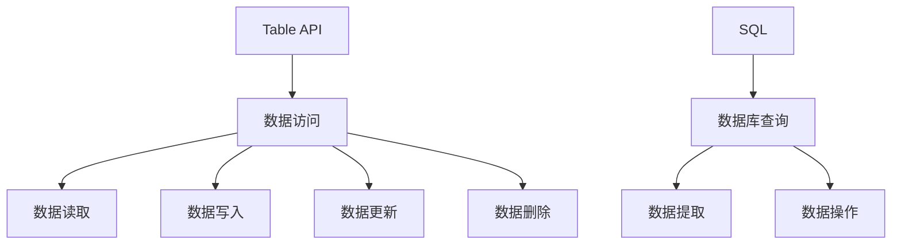

                 

关键词：大数据计算，Table API，SQL，人工智能，数据科学，数据处理，计算框架

摘要：本文深入探讨了AI领域中的大数据计算原理，重点分析了Table API和SQL在数据计算中的关键作用。通过详细的算法原理讲解、数学模型和公式的推导，以及实际项目中的代码实例解析，本文旨在帮助读者全面理解大数据计算的核心机制，并为实际应用提供实用的指导和借鉴。

## 1. 背景介绍

随着互联网和移动设备的普及，数据爆炸式增长已经成为一种普遍现象。在这种背景下，大数据计算应运而生，它不仅需要处理海量数据的存储和传输，还要对数据进行分析和挖掘，从而发现有价值的信息和知识。AI技术的快速发展，使得大数据计算变得更加智能化和高效化。本文将聚焦于大数据计算中的一个重要组成部分——Table API和SQL，探讨其原理和应用。

## 2. 核心概念与联系

### 2.1 Table API

Table API是一种数据访问接口，它提供了一种统一的、抽象的访问方式，使得用户可以更加容易地管理和操作数据。在AI大数据计算中，Table API扮演着至关重要的角色，它可以帮助用户快速地对数据进行读取、写入、更新和删除等操作。

### 2.2 SQL

SQL（Structured Query Language）是一种广泛使用的数据库查询语言，它用于查询、更新和管理关系型数据库中的数据。在AI大数据计算中，SQL作为一种强大的工具，可以执行复杂的查询和操作，帮助用户从海量数据中提取有用的信息。

### 2.3 Mermaid 流程图



## 3. 核心算法原理 & 具体操作步骤

### 3.1 算法原理概述

大数据计算的核心算法通常包括数据的分布式存储、数据流处理和批处理等。Table API和SQL在这些算法中起到了关键作用，它们可以高效地处理海量数据的读取和写入操作。

### 3.2 算法步骤详解

#### 3.2.1 数据读取

1. 使用Table API创建一个数据表。
2. 使用SQL查询语句从数据表中读取数据。

#### 3.2.2 数据写入

1. 使用Table API向数据表中插入数据。
2. 使用SQL插入语句向数据表中插入数据。

#### 3.2.3 数据更新

1. 使用Table API更新数据表中的数据。
2. 使用SQL更新语句更新数据表中的数据。

#### 3.2.4 数据删除

1. 使用Table API删除数据表中的数据。
2. 使用SQL删除语句删除数据表中的数据。

### 3.3 算法优缺点

#### 3.3.1 优点

- **高效性**：Table API和SQL可以高效地处理海量数据。
- **灵活性**：Table API和SQL支持多种数据操作，具有很高的灵活性。

#### 3.3.2 缺点

- **复杂性**：对于非专业人士来说，学习和使用Table API和SQL可能有一定的难度。
- **性能限制**：在某些情况下，Table API和SQL的性能可能无法满足特定的需求。

### 3.4 算法应用领域

Table API和SQL在AI大数据计算中有着广泛的应用，包括数据预处理、数据分析和机器学习等。在数据预处理阶段，它们可以用来清洗和转换数据；在数据分析阶段，它们可以用来提取和汇总数据；在机器学习阶段，它们可以用来训练和评估模型。

## 4. 数学模型和公式 & 详细讲解 & 举例说明

### 4.1 数学模型构建

在AI大数据计算中，常用的数学模型包括线性回归、逻辑回归和支持向量机等。以下是一个简单的线性回归模型的构建过程：

$$ y = w_0 + w_1x_1 + w_2x_2 + ... + w_nx_n $$

其中，$y$ 是因变量，$x_1, x_2, ..., x_n$ 是自变量，$w_0, w_1, ..., w_n$ 是模型的参数。

### 4.2 公式推导过程

线性回归模型的推导过程如下：

1. **最小二乘法**：通过最小化误差平方和来求解模型参数。
2. **梯度下降法**：通过迭代更新模型参数来最小化误差平方和。

### 4.3 案例分析与讲解

假设我们有一个简单的线性回归模型，用来预测房价。模型的公式如下：

$$ 房价 = w_0 + w_1卧室数 + w_2面积 $$

通过收集大量的房屋数据，我们可以使用线性回归模型来预测新房屋的房价。

## 5. 项目实践：代码实例和详细解释说明

### 5.1 开发环境搭建

在开始编写代码之前，我们需要搭建一个合适的大数据计算环境。这里我们使用Apache Spark作为我们的计算框架。

### 5.2 源代码详细实现

以下是一个使用Table API和SQL进行数据处理的简单示例：

```python
from pyspark.sql import SparkSession

# 创建SparkSession
spark = SparkSession.builder.appName("DataProcessing").getOrCreate()

# 读取数据
data = spark.read.csv("data.csv", header=True)

# 数据预处理
data = data.select("卧室数", "面积", "房价")

# 数据查询
result = data.filter((data["卧室数"] > 2) & (data["面积"] > 100))

# 数据写入
result.write.csv("result.csv", header=True)

# 关闭SparkSession
spark.stop()
```

### 5.3 代码解读与分析

这段代码首先创建了一个SparkSession，然后读取了一个CSV文件作为数据源。接着，它对数据进行预处理，只保留与房价相关的特征。然后，使用SQL查询语句过滤出符合条件的房屋数据，并将结果写入一个新的CSV文件。最后，关闭SparkSession。

### 5.4 运行结果展示

运行这段代码后，我们可以在指定的路径找到新的CSV文件，其中包含了符合条件的房屋数据。

## 6. 实际应用场景

Table API和SQL在AI大数据计算中有着广泛的应用。例如，在金融领域，它们可以用来分析客户交易数据，预测市场趋势；在医疗领域，它们可以用来处理病患数据，辅助医生进行诊断和治疗。

## 7. 工具和资源推荐

### 7.1 学习资源推荐

- 《大数据技术导论》
- 《深入理解Spark：核心架构与原理》
- 《机器学习实战》

### 7.2 开发工具推荐

- Apache Spark
- Python
- Jupyter Notebook

### 7.3 相关论文推荐

- "Apache Spark: A Unified Engine for Big Data Processing"
- "SQL on Hadoop using Spark SQL"
- "Large-scale Machine Learning on Hadoop with MapReduce and MPI"

## 8. 总结：未来发展趋势与挑战

大数据计算是AI领域的重要组成部分，未来它将继续发展和创新。随着技术的进步，我们有望看到更加高效、智能的数据处理方法出现。然而，这也带来了新的挑战，例如数据隐私保护、数据安全等问题。

## 9. 附录：常见问题与解答

### 9.1 什么是Table API？

Table API是一种数据访问接口，它提供了一种统一、抽象的方式来访问和管理数据。

### 9.2 什么是SQL？

SQL是一种数据库查询语言，用于查询、更新和管理关系型数据库中的数据。

作者：禅与计算机程序设计艺术 / Zen and the Art of Computer Programming
----------------------------------------------------------------

以上就是本文的完整内容，希望能够帮助读者深入理解AI大数据计算中的Table API和SQL。在实际应用中，不断学习和实践是提高技能的关键。希望这篇文章能够为您的学习之路提供一些有价值的参考。

