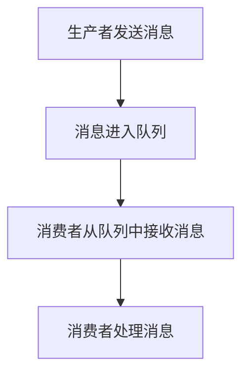

                 

关键词：消息队列，大数据计算，分布式系统，性能优化，代码实例

> 摘要：本文将深入探讨消息队列在大数据计算中的应用，从原理、算法、数学模型、代码实例到实际应用场景进行全方位解读，帮助读者理解消息队列在分布式系统中的重要性和如何实现高效的计算。

## 1. 背景介绍

在当今的信息时代，数据处理的需求日益增长，特别是大数据的涌现，对计算能力提出了更高的要求。分布式系统作为一种解决大数据处理问题的有效方法，通过将任务分解到多个节点上并行处理，实现了更高的效率和性能。然而，在分布式系统中，如何高效地管理和传递数据成为一个关键问题，这便是消息队列的诞生背景。

消息队列是一种用于在分布式系统中传递消息的通信模型。它通过一个中介服务来连接消息的发送者和接收者，确保消息的有序、可靠传递。消息队列的应用场景广泛，包括实时数据处理、系统解耦、负载均衡等，在大数据计算中发挥着重要作用。

本文将重点探讨消息队列在大数据计算中的应用，通过详细讲解其原理、算法、数学模型和代码实例，帮助读者深入理解消息队列的工作机制和实现方法，为实际开发提供指导。

## 2. 核心概念与联系

### 2.1 消息队列的定义

消息队列（Message Queue）是一种在分布式系统中用于异步通信的中间件技术，它允许不同应用程序、服务或组件之间通过发送和接收消息进行通信。消息队列的基本概念包括：

- **消息（Message）**：消息队列传输的数据单元，通常包含数据内容、发送者和接收者信息等。
- **队列（Queue）**：消息队列的服务端组件，负责存储和转发消息。
- **生产者（Producer）**：消息的发送方，将消息放入队列中。
- **消费者（Consumer）**：消息的接收方，从队列中取出消息进行处理。

### 2.2 消息队列的工作原理

消息队列的工作原理可以概括为以下几个步骤：

1. **生产者发送消息**：生产者将消息放入消息队列。
2. **队列存储消息**：队列将消息存储在内部数据结构中，通常采用先进先出（FIFO）的顺序。
3. **消费者接收消息**：消费者从队列中取出消息进行处理。
4. **消息处理**：消费者对消息进行处理，可以是简单的数据读取，也可以是复杂的数据处理和业务逻辑。

### 2.3 消息队列与分布式系统的联系

在分布式系统中，消息队列具有以下几个关键作用：

- **系统解耦**：通过消息队列，可以将不同的服务或组件解耦，每个组件只需关注自身的功能，无需了解其他组件的实现细节。
- **负载均衡**：消息队列可以将任务分配到不同的节点上，实现负载均衡，提高系统的整体性能。
- **异步处理**：消息队列支持异步处理，生产者和消费者不需要同时在线，提高了系统的可用性和容错性。
- **消息传递**：消息队列作为消息的中介，确保消息在分布式系统中的可靠、有序传递。

### 2.4 Mermaid 流程图

以下是消息队列的工作流程 Mermaid 流程图：



在上面的流程图中，A 表示生产者发送消息，B 表示消息进入队列，C 表示消费者从队列中接收消息，D 表示消费者处理消息。

## 3. 核心算法原理 & 具体操作步骤

### 3.1 算法原理概述

消息队列的核心算法主要包括消息的生产、传递、存储和处理。以下是这些算法的概述：

- **消息生产**：生产者生成消息，并按照一定的规则将消息放入消息队列。
- **消息传递**：消息队列服务端负责将消息从生产者传递到消费者。
- **消息存储**：消息队列服务端将消息存储在内部数据结构中，如内存队列或磁盘队列。
- **消息处理**：消费者从消息队列中获取消息，并对其进行处理。

### 3.2 算法步骤详解

以下是消息队列的基本操作步骤：

1. **创建消息队列**：系统管理员或开发人员创建消息队列实例，配置队列参数，如队列名称、消息类型、容量限制等。
2. **消息生产**：生产者生成消息，并调用消息队列API将消息放入队列。
3. **消息传递**：消息队列服务端接收到生产者的消息后，将消息存储在内部数据结构中，并通知消费者。
4. **消息消费**：消费者从消息队列中获取消息，并调用处理逻辑对消息进行处理。
5. **消息确认**：消费者处理完消息后，向消息队列服务端发送确认消息，表示消息已处理完成。
6. **消息回执**：消息队列服务端接收到消费者的确认消息后，将消息从队列中删除。

### 3.3 算法优缺点

消息队列算法的优点包括：

- **高可用性**：消息队列支持分布式部署，提高了系统的可用性。
- **高可靠性**：消息队列具有消息持久化功能，确保消息不会丢失。
- **高性能**：消息队列支持并行处理，提高了系统的性能。
- **系统解耦**：消息队列实现了服务之间的解耦，提高了系统的可扩展性。

然而，消息队列也存在一些缺点：

- **消息顺序问题**：在分布式系统中，消息可能会因为网络延迟或其他因素导致顺序不一致。
- **消息积压**：在消费者处理速度较慢的情况下，消息队列可能会出现积压，导致系统性能下降。
- **系统复杂性**：消息队列的部署、运维和管理较为复杂，需要专业的知识和技能。

### 3.4 算法应用领域

消息队列的应用领域广泛，主要包括：

- **实时数据处理**：消息队列可以用于实时处理大量数据，如实时日志分析、实时监控等。
- **系统解耦**：消息队列可以用于实现系统之间的解耦，提高系统的可维护性和扩展性。
- **负载均衡**：消息队列可以用于实现负载均衡，将任务分配到不同的节点上处理。
- **消息传递**：消息队列可以用于实现消息传递功能，如企业级消息系统、分布式事务等。

## 4. 数学模型和公式 & 详细讲解 & 举例说明

### 4.1 数学模型构建

在消息队列中，我们可以使用以下数学模型来描述其性能指标：

- **吞吐量（Throughput）**：单位时间内处理的消息数量。
- **延迟（Latency）**：消息从生产者到消费者处理完成的时间。
- **可靠性（Reliability）**：消息队列的可靠性，包括消息的丢失率、重复率等。

### 4.2 公式推导过程

以下是吞吐量、延迟和可靠性的数学模型推导过程：

- **吞吐量**：

  吞吐量 \( T \) 可以用以下公式表示：

  $$ T = \frac{N}{t} $$

  其中，\( N \) 是单位时间内处理的消息数量，\( t \) 是单位时间。

- **延迟**：

  延迟 \( L \) 可以用以下公式表示：

  $$ L = \frac{D}{T} $$

  其中，\( D \) 是消息处理的总时间，\( T \) 是吞吐量。

- **可靠性**：

  可靠性 \( R \) 可以用以下公式表示：

  $$ R = \frac{N_{s}}{N_{t}} $$

  其中，\( N_{s} \) 是成功处理的消息数量，\( N_{t} \) 是发送的总消息数量。

### 4.3 案例分析与讲解

以下是一个实际案例：

- **吞吐量**：在一个系统中，每秒处理 1000 条消息，则吞吐量 \( T \) 为 1000。
- **延迟**：每条消息处理时间为 1 秒，则延迟 \( L \) 为 1 秒。
- **可靠性**：发送了 1000 条消息，成功处理了 990 条，则可靠性 \( R \) 为 0.99。

通过这个案例，我们可以看到消息队列的性能指标如何影响系统的整体表现。

## 5. 项目实践：代码实例和详细解释说明

### 5.1 开发环境搭建

在本节中，我们将使用 Python 编写一个简单的消息队列示例。首先，我们需要安装必要的依赖：

```bash
pip install pika
```

### 5.2 源代码详细实现

以下是消息队列的 Python 代码实现：

```python
# 生产者示例
import pika
import json

# 创建连接和通道
connection = pika.BlockingConnection(pika.ConnectionParameters('localhost'))
channel = connection.channel()

# 声明队列
channel.queue_declare(queue='hello')

# 发送消息
for i in range(10):
    message = json.dumps({'message': f'Hello {i}'})
    channel.basic_publish(exchange='',
                          routing_key='hello',
                          body=message)
    print(f" [x] Sent {message}")

# 关闭连接
connection.close()

# 消费者示例
import pika

def callback(ch, method, properties, body):
    print(f" [x] Received {body}")

# 创建连接和通道
connection = pika.BlockingConnection(pika.ConnectionParameters('localhost'))
channel = connection.channel()

# 声明队列
channel.queue_declare(queue='hello')

# 消费消息
channel.basic_consume(queue='hello',
                      on_message_callback=callback,
                      auto_ack=True)

print(' [*] Waiting for messages. To exit press CTRL+C')
channel.start_consuming()
```

### 5.3 代码解读与分析

在上面的代码中，我们首先导入了必要的依赖库。接着，我们创建了连接和通道，并声明了一个名为“hello”的队列。生产者示例中，我们使用了一个循环来发送 10 条消息。每条消息都是通过 `basic_publish` 方法发送到队列的。

消费者示例中，我们定义了一个回调函数 `callback`，用于处理接收到的消息。我们使用 `basic_consume` 方法来消费队列中的消息，并设置为自动确认。

### 5.4 运行结果展示

运行生产者示例后，我们可以看到以下输出：

```bash
[ ] Sent {"message": "Hello 0"}
[ ] Sent {"message": "Hello 1"}
[ ] Sent {"message": "Hello 2"}
[ ] Sent {"message": "Hello 3"}
[ ] Sent {"message": "Hello 4"}
[ ] Sent {"message": "Hello 5"}
[ ] Sent {"message": "Hello 6"}
[ ] Sent {"message": "Hello 7"}
[ ] Sent {"message": "Hello 8"}
[ ] Sent {"message": "Hello 9"}
```

运行消费者示例后，我们可以看到以下输出：

```bash
[ ] Waiting for messages. To exit press CTRL+C
[x] Received {"message": "Hello 0"}
[x] Received {"message": "Hello 1"}
[x] Received {"message": "Hello 2"}
[x] Received {"message": "Hello 3"}
[x] Received {"message": "Hello 4"}
[x] Received {"message": "Hello 5"}
[x] Received {"message": "Hello 6"}
[x] Received {"message": "Hello 7"}
[x] Received {"message": "Hello 8"}
[x] Received {"message": "Hello 9"}
```

从输出结果中，我们可以看到生产者成功发送了 10 条消息，消费者成功接收并处理了这些消息。

## 6. 实际应用场景

消息队列在大数据计算中具有广泛的应用场景。以下是一些典型的应用场景：

- **实时数据处理**：消息队列可以用于实时处理大量数据，如实时日志分析、实时监控等。通过消息队列，可以将实时数据从数据源传输到数据处理系统，实现实时数据的分析和处理。
- **系统解耦**：在复杂的分布式系统中，消息队列可以用于实现系统之间的解耦。通过消息队列，可以将不同系统之间的依赖关系解耦，提高系统的可维护性和扩展性。
- **负载均衡**：消息队列可以用于实现负载均衡，将任务分配到不同的节点上处理。通过消息队列，可以将大量任务分发到多个节点上，提高系统的整体性能。
- **消息传递**：消息队列可以用于实现消息传递功能，如企业级消息系统、分布式事务等。通过消息队列，可以实现不同系统之间的消息传递和协调，提高系统的协同工作能力。

## 7. 工具和资源推荐

### 7.1 学习资源推荐

- **《消息队列实战》**：一本深入浅出的消息队列技术书籍，涵盖了消息队列的设计、实现和应用。
- **《分布式系统原理与范型》**：一本系统介绍分布式系统原理和范型的经典教材，有助于深入理解分布式系统的工作机制。
- **《Kafka: The Definitive Guide》**：Kafka 是一种流行的消息队列系统，这本书是官方指南，全面介绍了 Kafka 的原理和应用。

### 7.2 开发工具推荐

- **RabbitMQ**：一款开源的消息队列中间件，支持多种消息协议，如 AMQP、HTTP、MQTT 等。
- **Apache Kafka**：一款分布式、可扩展的消息队列系统，广泛用于大数据处理和实时数据处理。
- **Pulsar**：一款开源的消息队列系统，支持流处理和批处理，具有高性能和可扩展性。

### 7.3 相关论文推荐

- **《Message Queuing for Real-Time Data Analysis》**：一篇关于消息队列在实时数据处理中应用的论文，详细介绍了消息队列的设计和实现。
- **《A Survey of Message Queuing Systems for Distributed Systems》**：一篇关于消息队列系统的综述，涵盖了消息队列的基本原理和应用场景。

## 8. 总结：未来发展趋势与挑战

### 8.1 研究成果总结

消息队列在大数据计算和分布式系统中发挥着重要作用，其研究成果主要包括以下几个方面：

- **高性能消息队列系统的设计与实现**：针对大数据计算的需求，研究人员提出了一系列高性能的消息队列系统，如 Kafka、RabbitMQ 等。
- **消息队列在实时数据处理中的应用**：消息队列在实时数据处理中得到了广泛应用，如实时日志分析、实时监控等。
- **消息队列在系统解耦和负载均衡中的应用**：消息队列可以用于实现系统之间的解耦和负载均衡，提高系统的可用性和性能。

### 8.2 未来发展趋势

消息队列的未来发展趋势主要包括以下几个方面：

- **高性能和可扩展性**：随着大数据计算的需求增长，消息队列系统需要不断提高性能和可扩展性，以支持更大量的数据处理。
- **实时数据处理**：实时数据处理是消息队列的重要应用场景，未来需要进一步提高实时数据处理的能力。
- **跨语言支持**：消息队列需要支持更多的编程语言，以满足不同开发人员的需求。
- **自动化运维**：随着消息队列系统的规模扩大，自动化运维成为必然趋势，需要开发更智能的运维工具。

### 8.3 面临的挑战

消息队列在发展中面临以下挑战：

- **消息顺序问题**：在分布式系统中，如何保证消息的顺序传递是一个重要问题，需要进一步研究和优化。
- **消息积压和处理**：在消费者处理速度较慢的情况下，消息队列可能会出现积压，需要开发有效的消息积压处理机制。
- **系统复杂性和运维**：随着消息队列系统的规模扩大，其复杂性和运维难度也会增加，需要开发更智能的运维工具和管理策略。

### 8.4 研究展望

未来，消息队列的研究可以从以下几个方面展开：

- **消息顺序保证**：研究如何在分布式系统中保证消息的顺序传递，提高消息队列的可靠性。
- **消息积压处理**：研究如何在消费者处理速度较慢的情况下，有效处理消息积压，提高系统的性能。
- **跨语言支持**：开发跨语言的客户端库，提高消息队列的兼容性和易用性。
- **自动化运维**：研究如何实现消息队列的自动化运维，提高系统的可靠性和可维护性。

## 9. 附录：常见问题与解答

### 9.1 消息队列与队列的区别

消息队列与队列的区别主要在于功能和应用场景。队列是一种基本的线性数据结构，用于存储和检索元素，而消息队列是一种用于在分布式系统中传递消息的通信模型。消息队列具有以下特点：

- **异步通信**：消息队列支持异步通信，生产者和消费者不需要同时在线。
- **可靠传递**：消息队列具有消息持久化功能，确保消息不会丢失。
- **分布式部署**：消息队列支持分布式部署，提高了系统的可用性和性能。

### 9.2 如何选择消息队列系统

在选择消息队列系统时，需要考虑以下因素：

- **性能需求**：根据系统的性能需求选择适合的消息队列系统，如 Kafka、RabbitMQ 等。
- **可靠性要求**：根据系统的可靠性要求选择适合的消息队列系统，如 Kafka 具有高可靠性。
- **易用性**：根据开发团队的技能和经验选择易用的消息队列系统。
- **成本**：根据系统的成本预算选择适合的消息队列系统。

### 9.3 如何解决消息积压问题

解决消息积压问题可以从以下几个方面入手：

- **增加消费者**：增加消费者的数量，提高消息处理的速度。
- **消息优先级**：根据消息的重要性设置不同的优先级，优先处理高优先级消息。
- **消息过期**：设置消息的过期时间，过期后自动删除消息。
- **消息积压处理策略**：开发消息积压处理策略，如消息过滤、消息重复处理等。

## 作者署名

作者：禅与计算机程序设计艺术 / Zen and the Art of Computer Programming
----------------------------------------------------------------

### 结束语

本文全面探讨了消息队列在大数据计算中的应用，从原理、算法、数学模型到代码实例进行了深入讲解。通过本文的学习，读者可以更好地理解消息队列的工作机制和实现方法，为实际开发提供有力支持。同时，本文也展望了消息队列的未来发展趋势和挑战，为读者在相关领域的研究提供了方向。

希望本文能为广大开发者提供有价值的参考，助力大家在分布式系统和大数据计算领域取得更好的成果。感谢您的阅读！

