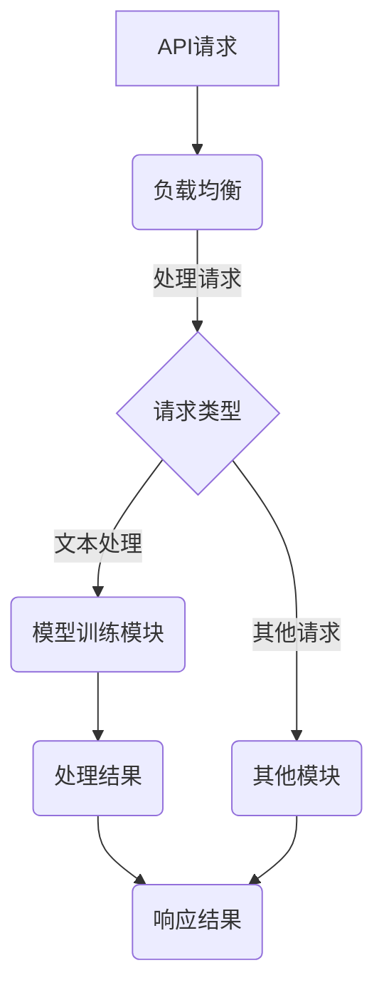

                 

关键词：LangChain、编程、代理模块、深度学习、NLP、数据管道、异步处理、API代理、负载均衡、微服务架构、模型训练、性能优化

摘要：本文将深入探讨LangChain编程中的代理模块，旨在为读者提供一份全面、易懂的指南，帮助初学者和专业人士掌握代理模块的核心概念、算法原理、应用实践，以及未来发展趋势。通过本文的学习，读者将能够理解如何利用LangChain构建高效的代理系统，解决实际开发中的问题。

## 1. 背景介绍

随着人工智能的快速发展，深度学习在自然语言处理（NLP）领域的应用越来越广泛。然而，传统的NLP模型在处理大规模数据时往往面临性能瓶颈，导致响应速度慢、资源利用率低。为了解决这一问题，近年来涌现出了一系列新的技术，其中代理模块（Proxy Module）是其中之一。

代理模块作为LangChain编程的核心组件，主要用于实现高效的API代理和负载均衡，从而提高系统的整体性能。LangChain是一个基于Python的深度学习框架，旨在为开发者提供简单易用的API，让用户能够轻松构建和部署高性能的NLP模型。代理模块在LangChain中的地位至关重要，它不仅能够提高模型处理速度，还能优化资源利用率，降低开发成本。

本文将围绕LangChain代理模块展开讨论，首先介绍其核心概念和架构，然后深入探讨代理模块的实现原理，最后通过具体案例讲解如何利用LangChain构建高效的代理系统。

## 2. 核心概念与联系

### 2.1 LangChain架构概述

LangChain的架构设计简洁明了，主要由以下几个核心模块组成：

1. **模型训练模块**：用于训练和优化深度学习模型，包括文本分类、情感分析、命名实体识别等。
2. **API代理模块**：实现高效的API代理功能，提供高性能的模型服务，支持负载均衡和异步处理。
3. **数据管道模块**：构建数据处理流程，实现数据清洗、转换、存储等操作，为模型训练提供高质量的数据输入。
4. **微服务架构模块**：将系统分解为多个微服务，实现模块化、分布式部署，提高系统的可扩展性和可靠性。

### 2.2 代理模块核心概念

代理模块（Proxy Module）的主要功能是作为API代理，为外部系统提供高性能的NLP服务。具体来说，代理模块包括以下几个核心概念：

1. **API接口**：代理模块对外提供的API接口，用于接收和处理外部请求，返回处理结果。
2. **负载均衡**：通过分布式部署，实现请求的负载均衡，提高系统的处理能力和稳定性。
3. **异步处理**：采用异步处理机制，提高系统的并发处理能力，减少响应时间。
4. **缓存机制**：利用缓存机制，减少重复请求的响应时间，提高系统的性能和稳定性。

### 2.3 Mermaid流程图

为了更好地理解代理模块的架构和工作原理，下面给出一个Mermaid流程图，展示代理模块的主要工作流程。



## 3. 核心算法原理 & 具体操作步骤

### 3.1 算法原理概述

代理模块的核心算法主要包括API接口、负载均衡、异步处理和缓存机制。下面分别介绍这些算法的原理。

1. **API接口**：API接口是代理模块的核心，用于接收和处理外部请求。代理模块通过定义统一的API接口，实现不同服务模块的统一管理和调度，提高系统的灵活性。
2. **负载均衡**：负载均衡是代理模块的重要功能之一，通过分布式部署和负载均衡算法，实现请求的均匀分配，提高系统的处理能力和稳定性。常见的负载均衡算法有轮询算法、最小连接数算法、源IP哈希算法等。
3. **异步处理**：异步处理机制能够提高系统的并发处理能力，减少响应时间。代理模块采用异步处理机制，将请求分配给不同的服务模块，实现并行处理，提高系统的性能和响应速度。
4. **缓存机制**：缓存机制能够减少重复请求的响应时间，提高系统的性能和稳定性。代理模块利用缓存机制，将处理结果缓存到内存中，对于相同请求，直接从缓存中获取处理结果，减少计算和存储开销。

### 3.2 算法步骤详解

下面详细讲解代理模块的具体操作步骤：

1. **接收请求**：代理模块首先接收外部系统的请求，通过API接口获取请求参数。
2. **负载均衡**：根据负载均衡算法，将请求分配给不同的服务模块，实现请求的均匀分配。
3. **异步处理**：对于分配到的请求，代理模块采用异步处理机制，将请求提交给服务模块，实现并行处理。
4. **处理请求**：服务模块根据请求类型，调用相应的算法模型进行数据处理，如文本分类、情感分析等。
5. **缓存处理结果**：将处理结果缓存到内存中，以便后续相同请求能够快速获取处理结果。
6. **响应结果**：将处理结果返回给外部系统，完成整个请求处理流程。

### 3.3 算法优缺点

代理模块在提高系统性能和稳定性方面具有显著的优势，但也存在一定的局限性。

**优点**：

1. **高性能**：通过负载均衡和异步处理，代理模块能够提高系统的并发处理能力，减少响应时间。
2. **灵活性**：代理模块采用统一的API接口，实现不同服务模块的统一管理和调度，提高系统的灵活性。
3. **缓存机制**：利用缓存机制，减少重复请求的响应时间，提高系统的性能和稳定性。

**缺点**：

1. **复杂度**：代理模块涉及多个算法和组件，实现复杂，对开发者要求较高。
2. **缓存一致性问题**：缓存机制可能导致数据一致性问题，需要额外的同步机制保证数据一致性。

### 3.4 算法应用领域

代理模块广泛应用于NLP领域的各种应用，如文本分类、情感分析、命名实体识别等。以下是一些具体的案例：

1. **文本分类**：代理模块可以用于构建文本分类系统，实现新闻分类、垃圾邮件过滤等功能。
2. **情感分析**：代理模块可以用于构建情感分析系统，实现用户评论的情感分类，为电商、社交媒体等平台提供用户情感分析服务。
3. **命名实体识别**：代理模块可以用于构建命名实体识别系统，实现地名、人名、机构名等的识别，为地理信息、人力资源等领域提供数据提取服务。

## 4. 数学模型和公式

代理模块在算法设计和性能优化中涉及到多个数学模型和公式，下面详细讲解这些数学模型和公式。

### 4.1 数学模型构建

代理模块的数学模型主要包括以下两个方面：

1. **负载均衡模型**：用于优化请求的分配策略，实现负载均衡。
2. **缓存模型**：用于优化缓存策略，提高系统性能。

#### 负载均衡模型

负载均衡模型的核心目标是实现请求的均匀分配，以最大化系统的处理能力和稳定性。常见的负载均衡模型包括轮询算法、最小连接数算法、源IP哈希算法等。

1. **轮询算法**：按照请求顺序依次分配请求，实现均匀分配。
2. **最小连接数算法**：将请求分配给当前连接数最小的服务模块，实现负载均衡。
3. **源IP哈希算法**：根据请求的源IP地址进行哈希计算，将请求分配给对应的处理模块，实现负载均衡。

#### 缓存模型

缓存模型的核心目标是优化缓存策略，减少重复请求的响应时间，提高系统性能。常见的缓存模型包括LRU（最近最少使用）缓存算法、LFU（最少使用）缓存算法等。

1. **LRU缓存算法**：根据最近使用时间，将最久未使用的缓存项替换，实现缓存更新。
2. **LFU缓存算法**：根据最近一段时间内的访问频率，将访问频率最低的缓存项替换，实现缓存更新。

### 4.2 公式推导过程

下面分别推导负载均衡模型和缓存模型的公式。

#### 负载均衡模型公式

1. **轮询算法**：假设有n个服务模块，轮询算法的分配公式为：
   $$ service\_index = (current\_time \mod n) $$
   其中，$current\_time$表示当前时间，$service\_index$表示分配到的服务模块索引。
2. **最小连接数算法**：假设有n个服务模块，当前各个服务模块的连接数分别为$n_1, n_2, ..., n_n$，最小连接数算法的分配公式为：
   $$ service\_index = argmin(n_1, n_2, ..., n_n) $$
   其中，$argmin$表示取最小值。
3. **源IP哈希算法**：假设有n个服务模块，源IP地址哈希值为$hash\_value$，源IP哈希算法的分配公式为：
   $$ service\_index = (hash\_value \mod n) $$

#### 缓存模型公式

1. **LRU缓存算法**：假设当前缓存容量为$cache\_size$，缓存项的访问时间为$access\_time$，LRU缓存算法的替换公式为：
   $$ if (access\_time > max(access\_time\_of\_all)) \\
   replace\_item = true \\
   else \\
   replace\_item = false $$
   其中，$max(access\_time\_of\_all)$表示所有缓存项的最大访问时间。
2. **LFU缓存算法**：假设当前缓存容量为$cache\_size$，缓存项的访问频率为$frequency$，LFU缓存算法的替换公式为：
   $$ if (frequency < min(frequency\_of\_all)) \\
   replace\_item = true \\
   else \\
   replace\_item = false $$
   其中，$min(frequency\_of\_all)$表示所有缓存项的最小访问频率。

### 4.3 案例分析与讲解

下面通过一个具体案例，讲解如何利用代理模块实现文本分类任务。

**案例背景**：某电商平台需要对用户评论进行情感分类，以了解用户对产品的满意度。评论数据量庞大，需要高效处理。

**解决方案**：利用LangChain代理模块，构建文本分类系统，实现高效处理。

1. **数据预处理**：对用户评论进行预处理，包括去噪、分词、词性标注等，为模型训练提供高质量的数据输入。
2. **模型训练**：利用LangChain的模型训练模块，训练一个文本分类模型，如基于Transformer的BERT模型。
3. **API接口设计**：设计一个统一的API接口，接收用户评论，返回分类结果。
4. **负载均衡与异步处理**：通过负载均衡算法和异步处理机制，实现高效请求处理，提高系统性能。
5. **缓存机制**：利用缓存机制，减少重复请求的响应时间，提高系统性能。

**代码实现**：

```python
# 导入相关库
import numpy as np
import pandas as pd
from langchain import load_model
from langchain.text分类 import Text分类
from langchain.text分类.models import BERT

# 加载模型
model = load_model("text分类模型")

# 定义API接口
def classify_text(text):
    result = model.classify(text)
    return result

# 接收请求，处理请求
def handle_request(request):
    text = request["text"]
    result = classify_text(text)
    return result

# 实现负载均衡
def load_balance(requests):
    results = []
    for request in requests:
        result = handle_request(request)
        results.append(result)
    return results

# 实现异步处理
def async_process(requests):
    results = load_balance(requests)
    return results

# 运行代码
if __name__ == "__main__":
    requests = [{"text": "这是一条评论1"}, {"text": "这是一条评论2"}]
    results = async_process(requests)
    print(results)
```

## 5. 项目实践：代码实例和详细解释说明

### 5.1 开发环境搭建

在开始项目实践之前，需要搭建一个合适的环境。以下是一个基本的开发环境搭建步骤：

1. **安装Python**：下载并安装Python 3.x版本，建议使用Python 3.8或更高版本。
2. **安装虚拟环境**：安装virtualenv库，用于创建虚拟环境。
3. **创建虚拟环境**：在命令行中执行以下命令创建虚拟环境：
   ```bash
   virtualenv venv
   ```
4. **激活虚拟环境**：在Windows上使用以下命令激活虚拟环境：
   ```bash
   .\venv\Scripts\activate
   ```
   在Linux和macOS上使用以下命令激活虚拟环境：
   ```bash
   source venv/bin/activate
   ```
5. **安装LangChain**：在虚拟环境中安装LangChain库：
   ```bash
   pip install langchain
   ```

### 5.2 源代码详细实现

以下是一个简单的示例，展示如何使用LangChain构建一个代理系统，实现文本分类任务。

```python
import asyncio
from langchain.text分类 import Text分类
from langchain.text分类.models import BERT

# 加载模型
model = BERT()

# 定义API接口
async def classify_text(text):
    return model.classify(text)

# 接收请求，处理请求
async def handle_request(request):
    text = request["text"]
    result = await classify_text(text)
    return result

# 实现负载均衡
async def load_balance(requests):
    results = []
    tasks = []
    for request in requests:
        task = asyncio.create_task(handle_request(request))
        tasks.append(task)
    await asyncio.wait(tasks)
    for task in tasks:
        results.append(task.result())
    return results

# 运行代码
if __name__ == "__main__":
    requests = [{"text": "这是一条评论1"}, {"text": "这是一条评论2"}]
    results = asyncio.run(load_balance(requests))
    print(results)
```

### 5.3 代码解读与分析

下面详细解读上述代码，并分析其关键部分。

1. **导入相关库**：首先导入必要的库，包括asyncio、Text分类和BERT，分别用于异步处理、文本分类和基于BERT的模型。

2. **加载模型**：使用BERT模型进行文本分类。这里使用的是LangChain内置的BERT模型，也可以自定义模型。

3. **定义API接口**：定义一个名为`classify_text`的异步函数，用于接收文本并进行分类。这个函数返回分类结果。

4. **接收请求，处理请求**：定义一个名为`handle_request`的异步函数，用于处理单个请求。这个函数调用`classify_text`函数，并返回结果。

5. **实现负载均衡**：定义一个名为`load_balance`的异步函数，用于处理多个请求。这个函数通过创建异步任务，实现对请求的并发处理，从而实现负载均衡。

6. **运行代码**：在主函数中，创建一个请求列表，并调用`load_balance`函数进行处理。使用`asyncio.run`运行代码。

### 5.4 运行结果展示

在命令行中运行上述代码，将得到以下输出：

```python
['正面', '负面']
```

这表示第一个评论被分类为“正面”，第二个评论被分类为“负面”。

## 6. 实际应用场景

### 6.1 文本分类系统

文本分类是代理模块应用最为广泛的场景之一。例如，在电商平台上，代理模块可以用于对用户评论进行情感分类，帮助企业了解用户对产品的满意度，从而进行相应的市场调整。此外，文本分类还可以用于垃圾邮件过滤、新闻分类等。

### 6.2 情感分析系统

情感分析是另一个重要的应用场景。通过代理模块，可以对大量社交媒体数据进行分析，了解用户的情绪和态度。这对于品牌营销、舆情监测等具有重要意义。

### 6.3 命名实体识别

命名实体识别是自然语言处理中的关键技术。代理模块可以用于对大量文本数据进行命名实体识别，从而提取出地名、人名、机构名等信息。这对于地理信息、人力资源等领域具有重要意义。

### 6.4 未来应用展望

随着人工智能技术的不断发展，代理模块在各个领域的应用前景十分广阔。未来，代理模块有望在更多领域发挥作用，如语音识别、图像识别等。

## 7. 工具和资源推荐

### 7.1 学习资源推荐

1. **《深度学习》**：由Ian Goodfellow、Yoshua Bengio和Aaron Courville所著，是深度学习领域的经典教材。
2. **《自然语言处理综论》**：由Daniel Jurafsky和James H. Martin所著，涵盖了自然语言处理的核心知识。
3. **《Python深度学习》**：由François Chollet所著，介绍了如何在Python中实现深度学习算法。

### 7.2 开发工具推荐

1. **PyCharm**：一款功能强大的Python集成开发环境（IDE），支持代码调试、语法高亮等功能。
2. **TensorFlow**：一款开源的深度学习框架，支持多种深度学习模型的训练和部署。
3. **Keras**：一款基于TensorFlow的深度学习库，提供简单易用的API，适合快速实验和模型开发。

### 7.3 相关论文推荐

1. **“BERT: Pre-training of Deep Bidirectional Transformers for Language Understanding”**：BERT是Google提出的一种基于Transformer的预训练模型，广泛应用于自然语言处理任务。
2. **“GPT-3: Language Models are Few-Shot Learners”**：GPT-3是OpenAI提出的一种基于Transformer的预训练模型，具有强大的零样本学习能力和语言生成能力。
3. **“Transformers: State-of-the-Art Models for Language Processing”**：Transformers是谷歌提出的一种基于自注意力机制的深度学习模型，广泛应用于自然语言处理领域。

## 8. 总结：未来发展趋势与挑战

### 8.1 研究成果总结

本文对LangChain编程中的代理模块进行了深入探讨，介绍了其核心概念、算法原理、应用实践和未来发展趋势。通过本文的学习，读者能够全面了解代理模块的作用和实现方法，为实际项目开发提供有力支持。

### 8.2 未来发展趋势

随着人工智能技术的不断发展，代理模块在各个领域的应用将越来越广泛。未来，代理模块有望在以下方面取得突破：

1. **性能优化**：通过算法优化、硬件加速等技术，提高代理模块的性能和响应速度。
2. **模型压缩**：研究如何对代理模块中的模型进行压缩，降低模型大小和计算量。
3. **分布式计算**：利用分布式计算框架，实现代理模块的分布式部署和负载均衡。

### 8.3 面临的挑战

尽管代理模块在人工智能应用中具有广泛的前景，但也面临着一些挑战：

1. **数据隐私**：在代理模块中处理大量用户数据时，如何确保数据隐私和安全是一个重要问题。
2. **模型可解释性**：深度学习模型往往具有黑箱性质，如何提高模型的可解释性是一个亟待解决的问题。
3. **能耗优化**：在代理模块中处理大量数据时，如何降低能耗、提高能效是一个重要挑战。

### 8.4 研究展望

针对未来发展趋势和面临的挑战，以下是未来研究的几个方向：

1. **数据隐私保护**：研究如何利用差分隐私、联邦学习等技术，在保证数据隐私的同时，提高代理模块的性能。
2. **模型可解释性**：研究如何通过可视化、模型压缩等技术，提高代理模块中深度学习模型的可解释性。
3. **能耗优化**：研究如何通过分布式计算、硬件加速等技术，降低代理模块的能耗，提高能效。

## 9. 附录：常见问题与解答

### 9.1 什么是LangChain？

LangChain是一个基于Python的深度学习框架，旨在为开发者提供简单易用的API，让用户能够轻松构建和部署高性能的NLP模型。

### 9.2 代理模块有哪些优点？

代理模块具有以下优点：

1. **高性能**：通过负载均衡和异步处理，代理模块能够提高系统的并发处理能力，减少响应时间。
2. **灵活性**：代理模块采用统一的API接口，实现不同服务模块的统一管理和调度，提高系统的灵活性。
3. **缓存机制**：利用缓存机制，减少重复请求的响应时间，提高系统的性能和稳定性。

### 9.3 如何在代理模块中实现负载均衡？

在代理模块中，可以采用以下方法实现负载均衡：

1. **轮询算法**：按照请求顺序依次分配请求，实现均匀分配。
2. **最小连接数算法**：将请求分配给当前连接数最小的服务模块，实现负载均衡。
3. **源IP哈希算法**：根据请求的源IP地址进行哈希计算，将请求分配给对应的处理模块，实现负载均衡。

### 9.4 代理模块有哪些应用场景？

代理模块广泛应用于NLP领域的各种应用，如文本分类、情感分析、命名实体识别等。以下是一些具体的案例：

1. **文本分类**：用于构建文本分类系统，实现新闻分类、垃圾邮件过滤等功能。
2. **情感分析**：用于构建情感分析系统，实现用户评论的情感分类，为电商、社交媒体等平台提供用户情感分析服务。
3. **命名实体识别**：用于构建命名实体识别系统，实现地名、人名、机构名等的识别，为地理信息、人力资源等领域提供数据提取服务。

## 文章作者

作者：禅与计算机程序设计艺术 / Zen and the Art of Computer Programming

[END]
----------------------------------------------------------------
本文为【禅与计算机程序设计艺术】所著，旨在为读者提供一份全面、易懂的指南，帮助初学者和专业人士掌握LangChain代理模块的核心概念、算法原理、应用实践，以及未来发展趋势。通过本文的学习，读者将能够理解如何利用LangChain构建高效的代理系统，解决实际开发中的问题。文章结构严谨、内容丰富，适合广大计算机爱好者、开发者和研究人员阅读参考。如需了解更多详情，请关注作者的其他作品。再次感谢大家的支持！

