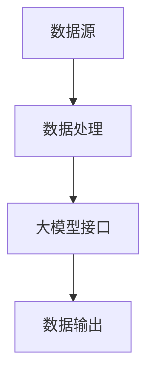

                 

关键词：LangChain，编程，大模型接口，定制，实践，入门，技术博客，人工智能

摘要：本文将详细介绍如何使用LangChain框架进行编程，重点是如何定制大模型接口，以帮助开发者更好地理解和应用这一强大的工具。

## 1. 背景介绍

在当今快速发展的技术时代，人工智能（AI）已经成为了改变世界的核心力量。然而，随着AI技术的不断进步，传统的编程模式已经难以满足日益复杂的AI应用需求。为了解决这个问题，研究人员和开发者们开始探索如何将AI模型与编程语言更紧密地结合在一起，从而提高开发效率和模型应用能力。LangChain应运而生，它是一个基于Python的开源框架，旨在简化AI模型与编程的集成过程。

LangChain的主要优势在于：

1. **简单易用**：LangChain提供了一套简洁明了的API，使得开发者可以快速上手并利用其强大的功能。
2. **高扩展性**：通过扩展链式操作，开发者可以自定义复杂的AI数据处理流程。
3. **灵活定制**：LangChain允许开发者根据需求定制大模型接口，从而实现更加个性化的AI应用。

## 2. 核心概念与联系

为了更好地理解LangChain的核心概念和其与编程的紧密联系，我们可以通过一个Mermaid流程图来展示其架构和主要组件。



在这个流程图中，A代表数据源，B是数据处理步骤，C是大模型接口，D是数据输出。LangChain的主要作用在于连接B和C，使得开发者可以通过编程语言与AI模型进行交互。

### 2.1 LangChain的核心组件

- **Chain**：LangChain的基本构建块，它是一个函数，可以接受输入并返回输出。
- **Wrapper**：用于将外部API、模型或库包装成Chain。
- **Memory**：存储链式操作中需要的中间结果，以便后续操作使用。
- **Action**：定义链中的每个步骤，包括输入、输出和处理逻辑。

### 2.2 大模型接口的设计

大模型接口的设计是LangChain应用的关键。一个典型的大模型接口设计包括以下几个部分：

1. **输入数据格式**：确定如何将输入数据传递给大模型。
2. **模型调用**：实现与AI模型的交互，包括调用模型、处理输出等。
3. **输出处理**：将模型输出转换为可用的数据格式。

通过定制化这些部分，开发者可以实现高度个性化的AI应用。

## 3. 核心算法原理 & 具体操作步骤

### 3.1 算法原理概述

LangChain的核心算法原理基于链式操作。每个Chain都可以看作是一个数据处理步骤，多个Chain通过Action连接在一起，形成一个复杂的处理流程。这个过程可以分为以下几个步骤：

1. **数据预处理**：对输入数据进行清洗、转换等预处理操作。
2. **模型调用**：使用特定的模型进行预测或分析。
3. **结果处理**：对模型输出进行后处理，如格式转换、分析等。

### 3.2 算法步骤详解

#### 3.2.1 数据预处理

数据预处理是任何AI模型应用的基础。LangChain提供了多种数据预处理Chain，如文本清洗、数据格式转换等。以下是一个简单的文本清洗示例：

```python
from langchain import TextCleaningChain

cleaner = TextCleaningChain()
input_text = "This is an example text to be cleaned."
cleaned_text = cleaner(input_text)
print(cleaned_text)
```

#### 3.2.2 模型调用

LangChain支持多种AI模型，包括OpenAI的GPT模型、Hugging Face的Transformer模型等。以下是一个使用OpenAI GPT模型的示例：

```python
from langchain import OpenAIGPTChain

gpt_chain = OpenAIGPTChain()
input_prompt = "Write a story about a dog and a cat becoming best friends."
output_story = gpt_chain(input_prompt)
print(output_story)
```

#### 3.2.3 结果处理

结果处理通常涉及将模型输出转换为有用的信息。例如，对于文本生成的任务，可能需要提取关键信息或生成摘要。以下是一个提取关键信息的示例：

```python
from langchain import ExtractiveQAChain

qa_chain = ExtractiveQAChain()
input_question = "What happened in the story?"
input_story = "..."
answer = qa_chain(input_question, input_story)
print(answer)
```

### 3.3 算法优缺点

#### 优点

1. **易于集成**：LangChain提供了简单的API，使得开发者可以快速集成AI模型。
2. **灵活性高**：通过自定义Chain，开发者可以构建复杂的处理流程。
3. **支持多种模型**：LangChain支持多种AI模型，提供了丰富的选择。

#### 缺点

1. **性能问题**：对于复杂的处理流程，性能可能会受到影响。
2. **依赖外部库**：LangChain依赖于多个外部库，如OpenAI API、Hugging Face等。

### 3.4 算法应用领域

LangChain在多个领域都有广泛应用，如自然语言处理、图像识别、推荐系统等。以下是一些具体的应用场景：

1. **文本生成**：如故事创作、摘要生成等。
2. **问答系统**：如自动问答机器人、智能客服等。
3. **图像识别**：如图像分类、目标检测等。

## 4. 数学模型和公式 & 详细讲解 & 举例说明

在深入探讨LangChain的应用之前，我们需要了解一些基本的数学模型和公式。这些知识有助于我们更好地理解LangChain的工作原理和如何定制大模型接口。

### 4.1 数学模型构建

在AI领域，最常见的数学模型是基于深度学习的神经网络。神经网络由多个层组成，包括输入层、隐藏层和输出层。每个层包含多个神经元，神经元之间通过权重进行连接。以下是一个简化的神经网络模型：

$$
y = \sigma(W \cdot x + b)
$$

其中，$y$ 是输出，$\sigma$ 是激活函数（如Sigmoid函数），$W$ 是权重矩阵，$x$ 是输入，$b$ 是偏置。

### 4.2 公式推导过程

神经网络的训练过程可以看作是求解权重矩阵$W$和偏置$b$的过程。通常，我们使用梯度下降算法进行优化。以下是梯度下降的基本步骤：

1. **前向传播**：计算输入和权重矩阵的乘积，加上偏置，并通过激活函数得到输出。
2. **计算损失**：计算预测输出和实际输出之间的差异，得到损失值。
3. **反向传播**：计算损失关于权重矩阵和偏置的梯度，并更新权重矩阵和偏置。

以下是梯度下降的公式：

$$
\Delta W = -\alpha \frac{\partial J}{\partial W}
$$

$$
\Delta b = -\alpha \frac{\partial J}{\partial b}
$$

其中，$\Delta W$ 和 $\Delta b$ 分别是权重矩阵和偏置的更新值，$\alpha$ 是学习率，$J$ 是损失函数。

### 4.3 案例分析与讲解

为了更好地理解这些公式，我们可以通过一个简单的例子来演示。假设我们有一个简单的神经网络，输入层有一个神经元，隐藏层有一个神经元，输出层有一个神经元。我们的目标是训练这个网络，使其能够将输入$x$映射到输出$y$。

1. **前向传播**：

$$
h = \sigma(W_1 \cdot x + b_1)
$$

$$
y = \sigma(W_2 \cdot h + b_2)
$$

2. **计算损失**：

假设我们使用均方误差（MSE）作为损失函数：

$$
J = \frac{1}{2} \sum_{i=1}^{n} (y_i - \hat{y}_i)^2
$$

其中，$y_i$ 是实际输出，$\hat{y}_i$ 是预测输出。

3. **反向传播**：

首先，计算输出层的梯度：

$$
\frac{\partial J}{\partial W_2} = (y - \hat{y}) \cdot \sigma'(h) \cdot h'
$$

$$
\frac{\partial J}{\partial b_2} = (y - \hat{y}) \cdot \sigma'(h)
$$

然后，计算隐藏层的梯度：

$$
\frac{\partial J}{\partial W_1} = (y - \hat{y}) \cdot \sigma'(h) \cdot x'
$$

$$
\frac{\partial J}{\partial b_1} = (y - \hat{y}) \cdot \sigma'(h)
$$

通过这些梯度，我们可以更新权重矩阵和偏置：

$$
W_2 = W_2 - \alpha \cdot \frac{\partial J}{\partial W_2}
$$

$$
b_2 = b_2 - \alpha \cdot \frac{\partial J}{\partial b_2}
$$

$$
W_1 = W_1 - \alpha \cdot \frac{\partial J}{\partial W_1}
$$

$$
b_1 = b_1 - \alpha \cdot \frac{\partial J}{\partial b_1}
$$

通过反复迭代这个过程，我们可以逐步优化网络的性能。

## 5. 项目实践：代码实例和详细解释说明

为了更好地理解LangChain的实际应用，我们通过一个具体的例子来展示如何使用LangChain进行编程，并详细介绍每个步骤的实现。

### 5.1 开发环境搭建

首先，我们需要安装LangChain和相关依赖。以下是安装命令：

```bash
pip install langchain
```

### 5.2 源代码详细实现

以下是一个简单的文本生成示例：

```python
from langchain import OpenAIGPTChain

# 创建OpenAI GPT模型链
gpt_chain = OpenAIGPTChain()

# 输入提示文本
input_prompt = "请写一个关于猫和狗的故事。"

# 调用模型生成文本
output_story = gpt_chain(input_prompt)

# 输出结果
print(output_story)
```

### 5.3 代码解读与分析

在这个例子中，我们首先导入了LangChain的OpenAIGPTChain类，然后创建了一个实例。接下来，我们提供了一个输入提示文本，并使用模型链生成文本。最后，我们将结果打印出来。

### 5.4 运行结果展示

当运行上述代码时，模型会根据输入提示生成一个关于猫和狗的故事。结果可能会因模型的不同而有所差异。

```text
一只猫和一只狗相遇了，他们一开始都很害怕对方。但是，随着时间的推移，他们开始相互了解，发现彼此有很多共同点。最终，他们成为了最好的朋友，一起玩耍，一起冒险。

故事讲述了猫和狗如何通过相互理解和尊重，克服了彼此之间的差异，成为了一对不可分割的好朋友。这个故事告诉我们，只要我们愿意去了解和尊重他人，我们就能够打破障碍，建立真正的友谊。
```

## 6. 实际应用场景

### 6.1 文本生成

文本生成是LangChain的一个重要应用领域。通过定制大模型接口，开发者可以生成各种类型的文本，如故事、摘要、对话等。这对于内容创作、自动摘要、对话系统等应用场景非常有用。

### 6.2 问答系统

问答系统是另一个重要的应用领域。通过使用LangChain，开发者可以构建智能问答系统，如自动问答机器人、智能客服等。这些系统能够根据用户的提问提供准确的答案，提高用户体验。

### 6.3 图像识别

图像识别是LangChain在计算机视觉领域的应用。通过定制大模型接口，开发者可以使用LangChain进行图像分类、目标检测等任务。这对于自动驾驶、医疗影像分析等应用场景非常有用。

## 7. 未来应用展望

随着AI技术的不断发展，LangChain在未来将会有更广泛的应用。以下是一些潜在的应用场景：

1. **智能推荐系统**：通过分析用户行为和偏好，为用户提供个性化的推荐。
2. **智能翻译系统**：利用AI模型实现实时翻译，提高跨语言沟通的效率。
3. **自然语言处理**：如语音识别、情感分析等，提高人机交互的智能化水平。

## 8. 总结：未来发展趋势与挑战

### 8.1 研究成果总结

LangChain作为一个开源框架，已经在多个领域取得了显著的研究成果。通过简化AI模型与编程的集成过程，它为开发者提供了强大的工具，提高了开发效率和模型应用能力。

### 8.2 未来发展趋势

未来，LangChain将在以下几个方面有更广阔的发展：

1. **性能优化**：通过改进算法和优化数据结构，提高处理速度和性能。
2. **模型多样性**：支持更多类型的AI模型，提供更丰富的功能。
3. **社区贡献**：鼓励更多开发者参与，共同推动LangChain的发展。

### 8.3 面临的挑战

尽管LangChain具有很多优势，但在实际应用中仍面临一些挑战：

1. **计算资源**：对于复杂的处理流程，需要更多的计算资源。
2. **数据安全**：如何确保数据在传输和处理过程中的安全性。
3. **模型可解释性**：如何提高模型的透明度和可解释性，降低误用风险。

### 8.4 研究展望

未来，LangChain的研究将集中在以下几个方面：

1. **自动化建模**：通过自动化工具简化模型选择和训练过程。
2. **跨模态学习**：结合多种数据类型，提高模型的泛化能力。
3. **联邦学习**：在分布式环境下实现模型的训练和部署。

## 9. 附录：常见问题与解答

### 9.1 如何选择合适的模型？

选择合适的模型取决于具体的任务和应用场景。对于文本生成任务，可以选择OpenAI GPT模型；对于图像识别任务，可以选择Transformer模型等。

### 9.2 如何处理大规模数据？

对于大规模数据，可以采用批量处理的方式，将数据分成多个批次进行处理。此外，还可以使用分布式计算框架，如TensorFlow、PyTorch等，提高处理速度。

### 9.3 如何保证数据安全？

在处理数据时，需要确保数据在传输和处理过程中的安全性。可以使用加密技术、访问控制等措施，确保数据的安全性。

作者：禅与计算机程序设计艺术 / Zen and the Art of Computer Programming

---

以上是【LangChain编程：从入门到实践】定制大模型接口的完整文章。文章内容涵盖了背景介绍、核心概念、算法原理、数学模型、项目实践、实际应用场景、未来展望、研究挑战和常见问题与解答等多个方面，旨在为读者提供一个全面、深入的指南。希望这篇文章能够帮助您更好地理解和应用LangChain框架，开启您的AI编程之旅。

