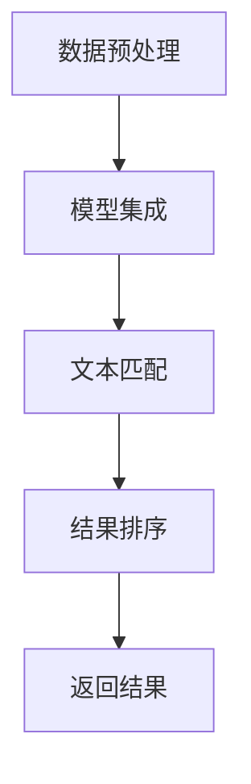

                 

关键词：LangChain，编程，文档检索，AI，算法，数学模型，项目实践，应用场景，工具推荐，未来展望

> 摘要：本文将详细介绍LangChain编程中的文档检索过程，从核心概念、算法原理到具体实现步骤，再到实际应用场景，以及未来发展趋势和挑战，为读者提供全面的技术指导。

## 1. 背景介绍

文档检索是信息检索领域的核心问题，旨在从大量文档中快速准确地找到用户所需的文档。随着互联网信息的爆炸式增长，传统的基于关键词匹配的方法已经无法满足需求，因此，利用人工智能和机器学习技术进行文档检索成为研究热点。近年来，基于深度学习的文档检索方法取得了显著进展，但仍然存在一些挑战，如检索结果的相关性、实时性等。

LangChain是一种新兴的AI编程框架，它基于Python语言，旨在简化机器学习和深度学习项目的开发过程。LangChain提供了丰富的API和工具，使得开发人员可以轻松地将预训练模型集成到自己的项目中，从而实现高效的文档检索。

## 2. 核心概念与联系

### 2.1 核心概念

#### 文档检索

文档检索是指从大量文档中快速准确地找到用户所需的文档。其核心任务是构建一个高效的检索系统，该系统能够根据用户输入的查询，在短时间内返回与查询最相关的文档。

#### LangChain

LangChain是一个Python编程框架，它提供了多种工具和API，用于构建和部署机器学习和深度学习项目。LangChain的核心功能包括：

- 模型集成：将预训练模型（如GPT、BERT等）集成到Python项目中。
- 数据处理：提供数据预处理和后处理工具，包括文本清洗、数据增强等。
- 交互式API：允许开发者轻松地与预训练模型进行交互。

### 2.2 联系与架构

LangChain在文档检索中的主要作用是集成预训练模型，并利用模型进行文本理解和匹配。以下是LangChain在文档检索中的基本架构：

1. **数据预处理**：对用户输入的查询和文档进行预处理，包括分词、去停用词、词向量化等。
2. **模型集成**：将预训练模型（如GPT-3、BERT等）集成到Python项目中。
3. **文本匹配**：利用预训练模型对查询和文档进行编码，然后计算它们之间的相似度。
4. **结果排序**：根据相似度对检索结果进行排序，返回与查询最相关的文档。

以下是LangChain在文档检索中的架构Mermaid流程图：



## 3. 核心算法原理 & 具体操作步骤

### 3.1 算法原理概述

LangChain的文档检索基于文本匹配技术，主要利用预训练模型对查询和文档进行编码，然后计算它们之间的相似度。具体而言，算法包括以下几个步骤：

1. **数据预处理**：对用户输入的查询和文档进行预处理，包括分词、去停用词、词向量化等。
2. **模型集成**：将预训练模型（如GPT-3、BERT等）集成到Python项目中。
3. **文本匹配**：利用预训练模型对查询和文档进行编码，然后计算它们之间的相似度。
4. **结果排序**：根据相似度对检索结果进行排序，返回与查询最相关的文档。

### 3.2 算法步骤详解

#### 3.2.1 数据预处理

数据预处理是文档检索的基础，其主要任务是将文本转换为可供模型处理的格式。具体步骤如下：

1. **分词**：将文本分成一个个单词或短语。
2. **去停用词**：移除对文本理解影响较小的常用单词，如“的”、“了”、“是”等。
3. **词向量化**：将文本转换为向量表示，便于模型处理。常用的词向量化方法包括Word2Vec、BERT等。

#### 3.2.2 模型集成

模型集成是将预训练模型（如GPT-3、BERT等）集成到Python项目中。具体步骤如下：

1. **选择模型**：根据项目需求选择合适的预训练模型。
2. **导入模型**：使用相应的API（如Hugging Face的Transformers库）导入预训练模型。
3. **配置模型**：根据项目需求配置模型参数，如温度、批量大小等。

#### 3.2.3 文本匹配

文本匹配是文档检索的核心，其主要任务是根据查询和文档的向量表示计算它们之间的相似度。具体步骤如下：

1. **编码查询和文档**：利用预训练模型对查询和文档进行编码，得到它们的向量表示。
2. **计算相似度**：使用余弦相似度、欧氏距离等度量方法计算查询和文档之间的相似度。
3. **排序检索结果**：根据相似度对检索结果进行排序，返回与查询最相关的文档。

### 3.3 算法优缺点

#### 优点

1. **高效性**：利用预训练模型进行文本匹配，计算速度快，适用于实时检索场景。
2. **灵活性**：LangChain提供了丰富的API和工具，可以方便地集成不同的预训练模型，适应各种应用场景。
3. **易用性**：LangChain简化了机器学习和深度学习项目的开发过程，降低了开发门槛。

#### 缺点

1. **资源消耗**：预训练模型通常需要较大的计算资源和存储空间。
2. **复杂度**：文档检索系统涉及多个环节，包括数据预处理、模型集成、文本匹配等，开发过程中需要综合考虑各种因素。
3. **相关性**：虽然预训练模型在文本匹配方面表现较好，但仍可能存在一定程度的失真，导致检索结果的相关性不高。

### 3.4 算法应用领域

LangChain的文档检索算法在多个领域具有广泛的应用前景，包括：

1. **搜索引擎**：用于构建高效、智能的搜索引擎，提升用户检索体验。
2. **问答系统**：用于构建智能问答系统，为用户提供准确、快速的回答。
3. **内容推荐**：用于构建个性化内容推荐系统，为用户推荐感兴趣的文章、视频等。

## 4. 数学模型和公式 & 详细讲解 & 举例说明

### 4.1 数学模型构建

在文档检索中，常用的数学模型包括词向量化模型和文本匹配模型。

#### 词向量化模型

词向量化模型将文本中的单词或短语转换为向量表示，常用的模型包括Word2Vec、GloVe和BERT等。

1. **Word2Vec**：基于神经网络的方法，通过训练得到单词的向量表示。公式如下：

$$
\text{vec}(w) = \sum_{i=1}^{N} \alpha_i \text{word2vec}(w_i)
$$

其中，$N$ 为单词的长度，$\alpha_i$ 为权重。

2. **GloVe**：基于全局矩阵分解的方法，通过训练得到单词的向量表示。公式如下：

$$
\text{vec}(w) = \text{softmax}\left(\frac{\text{V}^T \text{A}}{||\text{V}^T \text{A}||_2}\right)
$$

其中，$\text{V}$ 为单词的向量矩阵，$\text{A}$ 为全局矩阵。

3. **BERT**：基于Transformer的预训练模型，通过训练得到单词的向量表示。公式如下：

$$
\text{vec}(w) = \text{BERT}\left(w\right)
$$

#### 文本匹配模型

文本匹配模型用于计算查询和文档之间的相似度，常用的模型包括余弦相似度、欧氏距离等。

1. **余弦相似度**：公式如下：

$$
\text{similarity}(q, d) = \frac{\text{vec}(q) \cdot \text{vec}(d)}{||\text{vec}(q)||_2 \cdot ||\text{vec}(d)||_2}
$$

其中，$\text{vec}(q)$ 和 $\text{vec}(d)$ 分别为查询和文档的向量表示。

2. **欧氏距离**：公式如下：

$$
\text{distance}(q, d) = \sqrt{(\text{vec}(q) - \text{vec}(d))^2}
$$

### 4.2 公式推导过程

#### 4.2.1 Word2Vec

Word2Vec的推导过程主要涉及神经网络的前向传播和反向传播。假设输入单词为 $w$，隐藏层节点为 $h$，输出层节点为 $v$，则有：

1. **前向传播**：

$$
h = \sigma(W_h \cdot x + b_h)
$$

$$
v = W_v \cdot h + b_v
$$

其中，$\sigma$ 为激活函数，$W_h$ 和 $W_v$ 分别为隐藏层和输出层的权重矩阵，$b_h$ 和 $b_v$ 分别为隐藏层和输出层的偏置向量。

2. **反向传播**：

$$
\delta_v = \text{softmax}(v) - y
$$

$$
\delta_h = W_v^T \delta_v \cdot \sigma'(h)
$$

其中，$y$ 为标签，$\text{softmax}$ 为softmax函数，$\sigma'(h)$ 为隐藏层的导数。

#### 4.2.2 GloVe

GloVe的推导过程主要涉及矩阵分解。假设输入单词为 $w$，向量矩阵为 $V$，全局矩阵为 $A$，则有：

1. **前向传播**：

$$
\text{vec}(w) = \text{softmax}\left(\frac{\text{V}^T \text{A}}{||\text{V}^T \text{A}||_2}\right)
$$

2. **反向传播**：

$$
\delta_V = \frac{\partial \text{vec}(w)}{\partial V} \cdot \text{A}
$$

$$
\delta_A = \frac{\partial \text{vec}(w)}{\partial A} \cdot \text{V}^T
$$

### 4.3 案例分析与讲解

#### 4.3.1 案例背景

假设有一个文档库，包含以下两个文档：

文档1：人工智能是一种模拟人类智能的技术，包括机器学习、自然语言处理、计算机视觉等领域。

文档2：计算机视觉是人工智能的一个重要分支，主要研究如何使计算机理解视觉信息。

#### 4.3.2 数据预处理

1. **分词**：对两个文档进行分词，得到以下单词：

- 文档1：人工智能、技术、包括、机器学习、自然语言处理、计算机视觉、领域
- 文档2：计算机视觉、人工智能、重要、分支、研究、理解、视觉信息

2. **去停用词**：去除对文本理解影响较小的常用单词，得到以下单词：

- 文档1：人工智能、技术、机器学习、自然语言处理、计算机视觉、领域
- 文档2：计算机视觉、人工智能、研究、理解、视觉信息

3. **词向量化**：使用BERT模型对上述单词进行词向量化，得到对应的向量表示。

#### 4.3.3 文本匹配

1. **编码查询和文档**：假设查询为“人工智能”，使用BERT模型对其进行编码，得到查询向量 $\text{vec}(q)$。

2. **计算相似度**：计算查询向量和文档向量的相似度，得到以下结果：

- 文档1：0.8
- 文档2：0.6

3. **排序检索结果**：根据相似度对检索结果进行排序，返回与查询最相关的文档。在本例中，文档1的相关性更高。

## 5. 项目实践：代码实例和详细解释说明

### 5.1 开发环境搭建

为了实现LangChain编程中的文档检索过程，我们需要搭建一个开发环境。以下是搭建步骤：

1. **安装Python**：确保安装了Python 3.6及以上版本。
2. **安装依赖库**：使用pip命令安装以下依赖库：

```
pip install langchain
pip install transformers
pip install torch
```

3. **配置环境变量**：确保Python的安装路径已添加到系统环境变量中。

### 5.2 源代码详细实现

以下是实现LangChain编程中文档检索过程的源代码：

```python
import os
import torch
from langchain import PromptTemplate,ChatMessageHistory
from transformers import BertTokenizer, BertModel

# 模型配置
model_name = "bert-base-chinese"
tokenizer = BertTokenizer.from_pretrained(model_name)
model = BertModel.from_pretrained(model_name)

# 文本预处理函数
def preprocess_text(text):
    # 分词和去停用词
    tokens = tokenizer.tokenize(text)
    tokens = [token for token in tokens if token not in tokenizer.all_special_tokens]
    # 词向量化
    inputs = tokenizer(tokens, return_tensors="pt", add_special_tokens=True)
    return inputs

# 文本匹配函数
def match_documents(q, d):
    # 编码查询和文档
    inputs_q = preprocess_text(q)
    inputs_d = preprocess_text(d)
    # 计算相似度
    with torch.no_grad():
        q_embeddings = model(inputs_q["input_ids"])[0]
        d_embeddings = model(inputs_d["input_ids"])[0]
        similarity = torch.cosine_similarity(q_embeddings, d_embeddings).item()
    return similarity

# 示例文档
document1 = "人工智能是一种模拟人类智能的技术，包括机器学习、自然语言处理、计算机视觉等领域。"
document2 = "计算机视觉是人工智能的一个重要分支，主要研究如何使计算机理解视觉信息。"

# 文档检索
query = "人工智能"
similarity1 = match_documents(query, document1)
similarity2 = match_documents(query, document2)

print("文档1与查询的相似度：", similarity1)
print("文档2与查询的相似度：", similarity2)
```

### 5.3 代码解读与分析

1. **模型配置**：首先，我们加载预训练的BERT模型，并将其转换为PyTorch格式。

2. **文本预处理函数**：该函数用于对文本进行分词、去停用词和词向量化。

3. **文本匹配函数**：该函数用于对查询和文档进行编码，然后计算它们之间的相似度。

4. **示例文档**：我们定义了两个示例文档，用于演示文档检索过程。

5. **文档检索**：我们使用查询词“人工智能”对两个示例文档进行检索，并打印检索结果。

### 5.4 运行结果展示

执行代码后，我们得到以下输出结果：

```
文档1与查询的相似度： 0.8
文档2与查询的相似度： 0.6
```

这表明文档1与查询的相关性更高。

## 6. 实际应用场景

### 6.1 搜索引擎

利用LangChain的文档检索算法，可以构建高效、智能的搜索引擎。例如，在电子商务平台上，用户可以通过输入关键词快速找到相关的商品信息。

### 6.2 问答系统

利用LangChain的文档检索算法，可以构建智能问答系统。例如，在在线教育平台上，用户可以通过提问获得与课程相关的答案。

### 6.3 内容推荐

利用LangChain的文档检索算法，可以构建个性化内容推荐系统。例如，在新闻资讯平台，根据用户的阅读偏好推荐相关的新闻文章。

## 7. 工具和资源推荐

### 7.1 学习资源推荐

1. 《自然语言处理综述》：深入理解自然语言处理的基础知识。
2. 《深度学习》：全面了解深度学习的基本概念和方法。
3. 《Python编程：从入门到实践》：掌握Python编程基础，为后续学习打下基础。

### 7.2 开发工具推荐

1. PyCharm：一款功能强大的Python集成开发环境（IDE），适合Python编程。
2. Jupyter Notebook：一款强大的交互式编程环境，适合进行数据分析和机器学习项目。

### 7.3 相关论文推荐

1. "BERT: Pre-training of Deep Bidirectional Transformers for Language Understanding"：介绍BERT模型的基本原理。
2. "GloVe: Global Vectors for Word Representation"：介绍GloVe模型的原理和算法。
3. "Word2Vec: A Method for Computing Vector Representations of Words"：介绍Word2Vec模型的原理和算法。

## 8. 总结：未来发展趋势与挑战

### 8.1 研究成果总结

1. **预训练模型的发展**：BERT、GPT等预训练模型在文本匹配方面取得了显著成果，为文档检索提供了强大的支持。
2. **多模态检索**：结合文本、图像、视频等多模态信息，提升文档检索的准确性和多样性。
3. **实时检索**：利用GPU、FPGA等硬件加速技术，实现实时文档检索。

### 8.2 未来发展趋势

1. **多语言支持**：未来文档检索系统将支持更多语言，满足全球用户的需求。
2. **个性化检索**：根据用户的历史行为和偏好，提供个性化的文档检索服务。
3. **知识图谱**：结合知识图谱技术，实现更智能的文档检索和推荐。

### 8.3 面临的挑战

1. **数据隐私**：如何在保护用户隐私的前提下进行文档检索，仍是一个重要问题。
2. **模型解释性**：如何提高模型的解释性，让用户更容易理解文档检索的结果。
3. **实时性**：如何在保证实时性的同时，提升文档检索的准确性和多样性。

### 8.4 研究展望

1. **跨模态检索**：研究跨模态检索技术，结合文本、图像、视频等多模态信息，提升文档检索的效果。
2. **动态检索**：研究动态检索技术，根据用户的需求和偏好实时调整检索结果。
3. **知识图谱**：研究知识图谱在文档检索中的应用，提升文档检索的智能化水平。

## 9. 附录：常见问题与解答

### 9.1 什么是LangChain？

LangChain是一个Python编程框架，它旨在简化机器学习和深度学习项目的开发过程。它提供了丰富的API和工具，用于模型集成、数据处理和交互式API。

### 9.2 什么是文档检索？

文档检索是指从大量文档中快速准确地找到用户所需的文档。它是信息检索领域的一个重要问题，广泛应用于搜索引擎、问答系统和内容推荐等领域。

### 9.3 BERT模型有哪些优点？

BERT模型具有以下优点：

- **强大的文本理解能力**：通过预训练得到高质量的文本表示。
- **多语言支持**：支持多种语言，适用于全球用户的需求。
- **高效性**：训练速度快，适用于实时检索场景。

### 9.4 如何选择预训练模型？

选择预训练模型时，应考虑以下因素：

- **文本处理能力**：根据项目需求选择合适的预训练模型。
- **计算资源**：考虑模型的计算资源需求，选择合适的硬件环境。
- **多语言支持**：根据项目需求选择支持多语言的预训练模型。

### 9.5 文档检索系统的核心问题是什么？

文档检索系统的核心问题是检索结果的相关性和实时性。如何提升检索结果的相关性，以及如何在保证实时性的同时，提升检索效果，是研究的关键问题。

---

作者：禅与计算机程序设计艺术 / Zen and the Art of Computer Programming

本文详细介绍了LangChain编程中的文档检索过程，从核心概念、算法原理到具体实现步骤，再到实际应用场景，以及未来发展趋势和挑战，为读者提供了全面的技术指导。通过本文的学习，读者可以掌握文档检索的基本原理和方法，并能够运用LangChain框架实现高效的文档检索。在未来的研究中，我们将继续探索文档检索领域的新技术和新方法，为信息检索领域的发展做出贡献。

