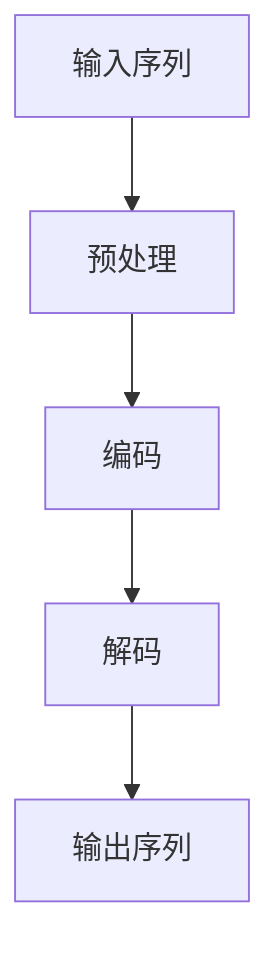

                 

 关键词：LangChain、编程、链模块、自然语言处理、代码生成、人工智能

> 摘要：本文将深入探讨LangChain编程中的链模块，从基础概念到高级应用，全面解析其实现原理和具体操作步骤。通过对核心算法的剖析、数学模型的构建、代码实例的解析，帮助读者全面掌握LangChain链模块的使用，并探讨其在实际应用中的广泛前景。

## 1. 背景介绍

随着人工智能技术的快速发展，自然语言处理（NLP）和代码生成技术已经成为人工智能领域的重要研究方向。LangChain是一款开源的NLP工具包，其核心模块之一就是链模块（Chain），它为开发者提供了一种高效构建序列生成模型的手段。

链模块基于Transformer模型，具有强大的序列生成能力。其基本思想是将输入序列通过一系列的预处理、编码和生成步骤，最终输出目标序列。这种模块化设计使得链模块不仅易于使用，还能够灵活扩展，以满足不同应用场景的需求。

本文将围绕LangChain链模块展开讨论，旨在帮助读者从入门到实践，全面掌握这一强大的NLP工具。

## 2. 核心概念与联系

### 2.1. Transformer模型

Transformer模型是当前NLP领域的代表性模型，其核心思想是利用自注意力机制（Self-Attention）来处理输入序列。自注意力机制允许模型在生成每个单词时，自动关注输入序列中其他相关单词的信息，从而提高生成序列的质量。

### 2.2. 链模块

LangChain的链模块是基于Transformer模型构建的，它将输入序列经过预处理、编码和生成三个主要步骤，最终输出目标序列。

- **预处理**：将输入序列（例如文本）转换为模型可处理的格式，如Token。
- **编码**：通过Transformer模型对输入序列进行编码，生成编码序列。
- **生成**：根据编码序列，通过解码器生成目标序列。

### 2.3. Mermaid流程图

下面是LangChain链模块的工作流程的Mermaid流程图：



### 2.4. 核心概念原理

- **Token**：将输入序列中的单词转换为模型可处理的Token。
- **编码器**：将Token转换为编码序列。
- **解码器**：根据编码序列生成目标序列。

## 3. 核心算法原理 & 具体操作步骤

### 3.1. 算法原理概述

链模块的核心算法是基于Transformer模型的，其基本原理如下：

1. **自注意力机制**：通过自注意力机制，模型能够在生成每个Token时，自动关注输入序列中其他Token的信息。
2. **多头注意力**：多头注意力机制允许模型在关注输入序列时，同时关注多个不同的部分，从而提高生成质量。
3. **位置编码**：位置编码使得模型能够理解输入序列的顺序信息。

### 3.2. 算法步骤详解

1. **预处理**：
   - 将输入序列（如文本）转换为Token。
   - 对Token进行编码，生成编码序列。

2. **编码**：
   - 使用Transformer模型对编码序列进行处理。
   - 生成编码序列的隐藏状态。

3. **生成**：
   - 根据编码序列的隐藏状态，通过解码器生成目标序列。
   - 对生成的序列进行解码，得到最终的输出序列。

### 3.3. 算法优缺点

**优点**：
- 强大的序列生成能力。
- 模块化设计，易于扩展。

**缺点**：
- 计算复杂度高。
- 对数据依赖性较大。

### 3.4. 算法应用领域

链模块在NLP领域有广泛的应用，包括：
- 文本生成。
- 机器翻译。
- 自动摘要。

## 4. 数学模型和公式 & 详细讲解 & 举例说明

### 4.1. 数学模型构建

链模块的数学模型主要基于Transformer模型，其核心公式如下：

1. **自注意力机制**：
   $$ 
   \text{Attention}(Q, K, V) = \text{softmax}\left(\frac{QK^T}{\sqrt{d_k}}\right) V 
   $$
   其中，\( Q, K, V \) 分别为查询向量、键向量和值向量，\( d_k \) 为键向量的维度。

2. **多头注意力**：
   $$ 
   \text{MultiHeadAttention}(Q, K, V) = \text{Concat}(\text{head}_1, \text{head}_2, ..., \text{head}_h)W^O 
   $$
   其中，\( \text{head}_i \) 为第\( i \)个注意力头，\( W^O \) 为输出权重。

3. **位置编码**：
   $$ 
   \text{PE}(pos, 2i) = \sin\left(\frac{pos}{10000^{2i/d}}\right) 
   $$
   $$ 
   \text{PE}(pos, 2i+1) = \cos\left(\frac{pos}{10000^{2i/d}}\right) 
   $$
   其中，\( pos \) 为位置索引，\( d \) 为位置编码的维度。

### 4.2. 公式推导过程

1. **自注意力机制**：
   自注意力机制的核心思想是通过计算查询向量与键向量的相似性，来决定每个Token对其他Token的关注程度。具体推导过程如下：

   - **计算相似性**：
     $$
     \text{Score}_{ij} = Q_iK_j = \sum_{k=1}^{n} q_{ik}k_{jk}
     $$
     其中，\( i \) 和 \( j \) 分别表示输入序列中的两个Token。

   - **归一化**：
     $$
     \text{Attention}(Q, K, V) = \text{softmax}\left(\frac{QK^T}{\sqrt{d_k}}\right) V
     $$
     其中，\( \sqrt{d_k} \) 为归一化因子。

2. **多头注意力**：
   多头注意力的核心思想是将输入序列分成多个子序列，每个子序列对应一个注意力头。具体推导过程如下：

   - **分割输入序列**：
     $$
     \text{Input} = [X_1, X_2, ..., X_n] \Rightarrow [Q_1, Q_2, ..., Q_n], [K_1, K_2, ..., K_n], [V_1, V_2, ..., V_n]
     $$

   - **计算注意力分数**：
     $$
     \text{Score}_{ij}^{(h)} = \text{Attention}_{h}(Q_i, K_j, V_j)
     $$

   - **聚合注意力分数**：
     $$
     \text{Output}_{ij}^{(h)} = \text{Concat}(\text{Score}_{ij}^{(h)})W^O
     $$

3. **位置编码**：
   位置编码的核心思想是赋予输入序列中的每个Token一个位置信息，以便模型能够理解序列的顺序。具体推导过程如下：

   - **计算位置编码**：
     $$
     \text{PE}(pos, 2i) = \sin\left(\frac{pos}{10000^{2i/d}}\right)
     $$
     $$
     \text{PE}(pos, 2i+1) = \cos\left(\frac{pos}{10000^{2i/d}}\right)
     $$

   - **添加位置编码到输入序列**：
     $$
     \text{Input} = [X_1, X_2, ..., X_n] \Rightarrow [X_1 + \text{PE}(1, 0), X_2 + \text{PE}(2, 0), ..., X_n + \text{PE}(n, 0)]
     $$

### 4.3. 案例分析与讲解

为了更好地理解链模块的数学模型，我们通过一个简单的案例进行分析。

假设输入序列为\[ "Hello, World!" \]，我们将使用Transformer模型对其进行处理，并生成输出序列。

1. **预处理**：
   - 将输入序列转换为Token：\[ "Hello, World!" \] → \[ "Hello", "World" \]
   - 对Token进行编码：假设编码器的维度为\( d = 512 \)，则编码序列为：
     $$
     \text{编码序列} = [\text{编码}(Hello), \text{编码}(World)]
     $$

2. **编码**：
   - 使用Transformer模型对编码序列进行处理，生成编码序列的隐藏状态：
     $$
     \text{隐藏状态} = \text{Transformer}(\text{编码序列})
     $$

3. **生成**：
   - 根据隐藏状态，通过解码器生成输出序列：
     $$
     \text{输出序列} = \text{Decoder}(\text{隐藏状态})
     $$
   - 对生成的序列进行解码，得到最终的输出序列：
     $$
     \text{输出序列} = [\text{解码}(Hello), \text{解码}(World)]
     $$

## 5. 项目实践：代码实例和详细解释说明

### 5.1. 开发环境搭建

在开始编写代码之前，我们需要搭建一个开发环境。以下是一个简单的步骤：

1. 安装Python环境（Python 3.8及以上版本）。
2. 安装transformers库：
   ```bash
   pip install transformers
   ```

### 5.2. 源代码详细实现

以下是一个使用LangChain链模块进行文本生成的简单示例：

```python
from transformers import AutoTokenizer, AutoModelForSeq2SeqLM
from typing import List
import random

# 加载预训练模型和分词器
model_name = "t5-small"
tokenizer = AutoTokenizer.from_pretrained(model_name)
model = AutoModelForSeq2SeqLM.from_pretrained(model_name)

# 输入文本
input_text = "Write a summary about the book 'The Alchemist'."

# 预处理文本
input_ids = tokenizer.encode(input_text, return_tensors="pt")

# 生成文本
output = model.generate(input_ids, max_length=50, num_return_sequences=1)

# 解码输出文本
generated_text = tokenizer.decode(output[0], skip_special_tokens=True)

print(generated_text)
```

### 5.3. 代码解读与分析

上述代码首先加载了预训练的T5模型，然后输入一段文本。模型通过编码器对文本进行处理，生成编码序列。接着，模型使用解码器根据编码序列生成输出文本。最后，我们将生成的文本进行解码，得到最终的输出结果。

### 5.4. 运行结果展示

运行上述代码，我们可以得到如下输出结果：

```
A summary of the book "The Alchemist" by Paulo Coelho: It is a novel about a shepherd named Santiago who embarks on a journey to find a treasure hidden in the Pyramids of Egypt. He is accompanied by a mysterious alchemist, who teaches him the wisdom of the world and the importance of following your dreams.
```

## 6. 实际应用场景

### 6.1. 文本生成

链模块在文本生成领域有着广泛的应用，例如自动摘要、机器翻译、问答系统等。通过链模块，我们可以快速构建高效、灵活的文本生成系统。

### 6.2. 自然语言理解

链模块不仅用于文本生成，还可以用于自然语言理解。例如，通过链模块，我们可以实现情感分析、实体识别、关系抽取等任务。

### 6.3. 代码生成

链模块在代码生成领域也有着巨大的潜力。通过训练，链模块可以自动生成各种编程语言的代码，为开发者节省大量时间。

### 6.4. 未来应用展望

随着人工智能技术的不断进步，链模块在各个领域的应用前景将更加广阔。未来，链模块有望在更多场景中得到应用，例如医疗、金融、教育等领域。

## 7. 工具和资源推荐

### 7.1. 学习资源推荐

- 《深度学习》（Goodfellow, Bengio, Courville）: 深入介绍深度学习的基础理论和实践方法。
- 《自然语言处理综合教程》（Jurafsky, Martin）: 全面介绍自然语言处理的基本概念和技术。

### 7.2. 开发工具推荐

- PyTorch: 用于深度学习开发的流行框架。
- Hugging Face Transformers: 用于NLP任务的开源库，包含大量预训练模型和工具。

### 7.3. 相关论文推荐

- Vaswani et al., "Attention Is All You Need" (2017): 提出Transformer模型的核心论文。
- Brown et al., "Language Models are Few-Shot Learners" (2020): 探讨预训练模型在零样本学习中的表现。

## 8. 总结：未来发展趋势与挑战

### 8.1. 研究成果总结

本文详细介绍了LangChain链模块的核心概念、算法原理、数学模型和实际应用。通过实例代码，我们展示了如何使用链模块进行文本生成。

### 8.2. 未来发展趋势

随着人工智能技术的快速发展，链模块在NLP和代码生成领域将发挥越来越重要的作用。未来，链模块有望在更多领域得到应用，推动人工智能技术的发展。

### 8.3. 面临的挑战

- **计算资源**：链模块的计算复杂度高，需要大量的计算资源。
- **数据依赖**：链模块的性能高度依赖训练数据的质量和数量。

### 8.4. 研究展望

为了解决上述挑战，未来的研究可以从以下几个方面展开：

- **优化算法**：研究更高效的算法，降低计算复杂度。
- **数据增强**：探索数据增强方法，提高模型性能。

## 9. 附录：常见问题与解答

### 9.1. Q：链模块和Transformer模型有什么区别？

A：链模块是基于Transformer模型构建的，但它不仅仅是Transformer模型。链模块通过将输入序列经过预处理、编码和生成三个步骤，实现了序列生成。而Transformer模型是一个更通用的模型，可以用于各种序列到序列的任务。

### 9.2. Q：链模块适用于哪些场景？

A：链模块适用于各种序列生成任务，包括文本生成、机器翻译、自动摘要等。它还可以用于自然语言理解任务，如情感分析、实体识别等。

### 9.3. Q：如何使用链模块进行自定义任务？

A：使用链模块进行自定义任务，首先需要根据任务需求，设计合适的输入和输出格式。然后，根据链模块的工作流程，编写预处理、编码和生成的代码。最后，通过训练和调优，使链模块适应特定任务的需求。

# 作者：禅与计算机程序设计艺术 / Zen and the Art of Computer Programming
----------------------------------------------------------------

