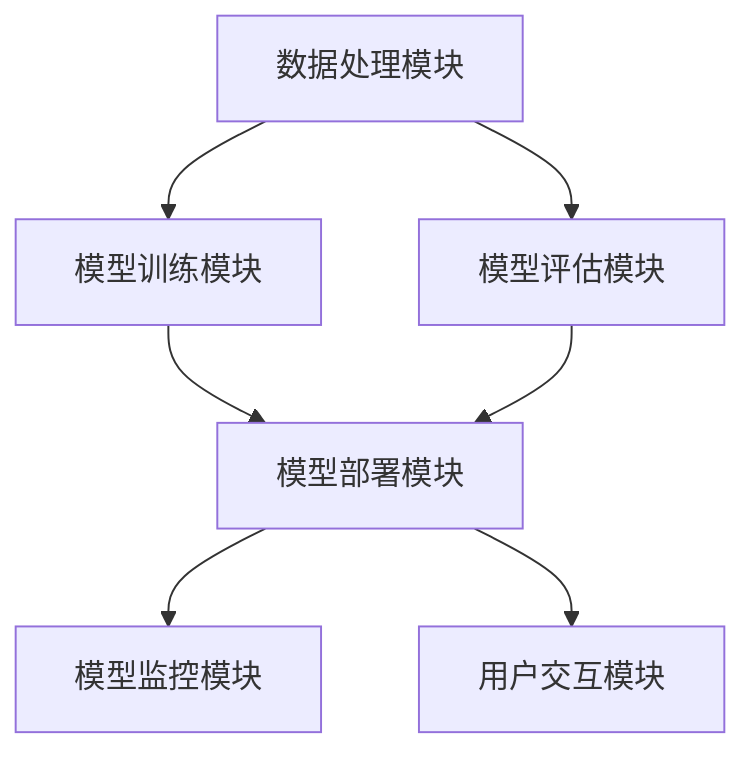

                 

关键词：大模型应用、AI Agent、LangChain、模块化开发、技术架构

摘要：本文将深入探讨大模型应用开发中的一项重要技术——LangChain。通过详细介绍LangChain的六大模块，本文旨在帮助读者理解并掌握如何利用这些模块构建强大的AI代理，从而为实际应用场景提供解决方案。

## 1. 背景介绍

近年来，随着人工智能技术的飞速发展，大模型（如GPT、BERT等）的应用越来越广泛。然而，大模型的应用开发并非易事，涉及到的技术点众多，如数据处理、模型训练、模型部署等。为了简化这一复杂过程，研究人员和开发者们提出了各种框架和工具，其中LangChain就是一个备受关注的代表性框架。

LangChain是由a16z AI团队开发的一个模块化框架，用于构建强大的AI代理。它通过将不同的组件模块化，使得开发者能够轻松地集成和扩展各种AI功能。本文将详细介绍LangChain中的六大模块，帮助读者更好地理解其工作原理和实际应用。

## 2. 核心概念与联系

在深入了解LangChain的六大模块之前，我们先来回顾一些核心概念，以及它们之间的联系。

### 2.1 数据处理模块

数据处理模块是LangChain的基础模块，它负责接收和预处理输入数据。这包括数据清洗、去重、格式转换等步骤，确保数据质量，以便后续模型训练和使用。

### 2.2 模型训练模块

模型训练模块负责训练大模型。它包括数据预处理、模型选择、训练过程、模型优化等步骤。通过训练，模型能够学习到输入数据中的模式和规律，从而在后续的预测任务中表现出色。

### 2.3 模型评估模块

模型评估模块用于评估训练好的模型性能。它包括准确率、召回率、F1分数等指标的计算。通过评估，开发者可以了解模型的性能，以及是否需要进一步优化。

### 2.4 模型部署模块

模型部署模块负责将训练好的模型部署到实际应用场景中。它包括模型打包、部署环境配置、模型服务化等步骤。通过部署，模型可以对外提供服务，实现实际应用价值。

### 2.5 模型监控模块

模型监控模块用于监控模型在部署过程中的运行状态。它包括性能监控、异常监控、日志分析等步骤。通过监控，开发者可以及时发现和解决问题，保证模型稳定运行。

### 2.6 用户交互模块

用户交互模块负责与用户进行交互，接收用户输入，返回模型预测结果。它包括前端界面设计、用户输入处理、预测结果展示等步骤。通过用户交互模块，开发者可以实现人机交互，提升用户体验。

下面是一个简化的Mermaid流程图，展示了这些模块之间的联系：



## 3. 核心算法原理 & 具体操作步骤

### 3.1 算法原理概述

LangChain的核心算法原理是模块化开发，即通过将不同的功能模块化，使得开发者能够灵活地组合和使用这些模块。具体来说，LangChain的六大模块分别对应不同的功能，开发者可以根据需求选择合适的模块，进行模块化开发。

### 3.2 算法步骤详解

#### 3.2.1 数据处理模块

1. 数据清洗：使用数据处理工具（如Pandas、NumPy等）对原始数据进行清洗，去除无效数据、重复数据等。
2. 数据预处理：将清洗后的数据进行格式转换，如将文本数据转换为序列、图像数据转换为像素矩阵等。
3. 数据存储：将预处理后的数据存储到数据仓库（如Hadoop、Spark等）中，以便后续使用。

#### 3.2.2 模型训练模块

1. 模型选择：根据应用场景选择合适的大模型（如GPT、BERT等）。
2. 数据预处理：将预处理后的数据转换为模型输入格式。
3. 模型训练：使用训练工具（如TensorFlow、PyTorch等）对模型进行训练，并调整模型参数，优化模型性能。
4. 模型评估：使用评估工具（如Scikit-learn、TensorFlow等）对训练好的模型进行评估，计算各种评价指标。

#### 3.2.3 模型部署模块

1. 模型打包：将训练好的模型打包成可执行文件或动态链接库。
2. 部署环境配置：在目标部署环境中配置模型运行所需的环境和依赖。
3. 模型服务化：将模型部署为Web服务或API服务，对外提供服务接口。
4. 部署验证：对部署后的模型进行验证，确保模型能够正常运行并输出正确结果。

#### 3.2.4 模型监控模块

1. 性能监控：监控模型在部署过程中的运行性能，如响应时间、吞吐量等。
2. 异常监控：监控模型在部署过程中出现的异常情况，如内存泄漏、错误日志等。
3. 日志分析：分析模型运行过程中的日志信息，发现潜在问题和改进方向。

#### 3.2.5 用户交互模块

1. 前端界面设计：设计用户交互界面，接收用户输入。
2. 用户输入处理：将用户输入转换为模型输入格式。
3. 预测结果展示：将模型预测结果以可视化或文本形式展示给用户。

### 3.3 算法优缺点

#### 优点：

1. 模块化开发：通过模块化开发，开发者可以灵活组合和使用各种功能模块，提高开发效率。
2. 简化流程：LangChain简化了大模型应用开发的流程，降低了开发难度。
3. 易于扩展：开发者可以根据需求，扩展或定制化各种功能模块，满足不同应用场景的需求。

#### 缺点：

1. 学习成本：由于涉及到的技术点较多，开发者需要投入较多时间学习相关技术。
2. 性能瓶颈：在某些情况下，LangChain的性能可能无法满足高性能需求，需要优化和调整。

### 3.4 算法应用领域

LangChain广泛应用于各个领域，如自然语言处理、计算机视觉、推荐系统等。以下是一些典型的应用场景：

1. 自然语言处理：使用LangChain构建智能问答系统、文本生成模型、机器翻译等。
2. 计算机视觉：使用LangChain构建图像识别、目标检测、图像生成等模型。
3. 推荐系统：使用LangChain构建基于内容的推荐系统、协同过滤推荐系统等。
4. 金融领域：使用LangChain构建金融分析、股票预测等模型。
5. 医疗领域：使用LangChain构建医疗诊断、疾病预测等模型。

## 4. 数学模型和公式 & 详细讲解 & 举例说明

### 4.1 数学模型构建

在LangChain中，数学模型构建是核心步骤之一。以下是常用的数学模型构建方法：

#### 4.1.1 循环神经网络（RNN）

RNN是一种用于处理序列数据的神经网络模型。其基本原理是通过记忆单元来保存和传递历史信息。以下是RNN的数学模型：

$$
h_t = \sigma(W_h \cdot [h_{t-1}, x_t] + b_h)
$$

其中，$h_t$表示第$t$个时间步的隐藏状态，$x_t$表示第$t$个时间步的输入，$\sigma$表示激活函数（如Sigmoid、ReLU等），$W_h$和$b_h$分别表示权重和偏置。

#### 4.1.2 长短期记忆网络（LSTM）

LSTM是一种改进版的RNN模型，主要用于解决长短期依赖问题。其基本原理是通过门控机制来控制信息的传递和遗忘。以下是LSTM的数学模型：

$$
i_t = \sigma(W_i \cdot [h_{t-1}, x_t] + b_i) \\
f_t = \sigma(W_f \cdot [h_{t-1}, x_t] + b_f) \\
o_t = \sigma(W_o \cdot [h_{t-1}, x_t] + b_o) \\
g_t = \tanh(W_g \cdot [h_{t-1}, x_t] + b_g) \\
h_t = o_t \cdot \tanh(f_t \cdot h_{t-1} + i_t \cdot g_t)
$$

其中，$i_t$、$f_t$、$o_t$分别表示输入门、遗忘门、输出门，$g_t$表示候选记忆单元，$W_i$、$W_f$、$W_o$、$W_g$和$b_i$、$b_f$、$b_o$、$b_g$分别表示权重和偏置。

#### 4.1.3 自注意力机制（Self-Attention）

自注意力机制是一种用于处理序列数据的注意力机制，其基本原理是通过计算序列中每个元素之间的相似度，来调整元素的权重。以下是自注意力的数学模型：

$$
\text{Attention}(Q, K, V) = \text{softmax}\left(\frac{QK^T}{\sqrt{d_k}}\right)V
$$

其中，$Q$、$K$和$V$分别表示查询序列、键序列和值序列，$d_k$表示键序列的维度。

### 4.2 公式推导过程

在数学模型构建过程中，公式推导是一个重要环节。以下是一个简单的公式推导示例：

假设我们有一个线性回归模型，其目标是最小化预测值与实际值之间的误差。其数学模型如下：

$$
\min_{\theta} \sum_{i=1}^{n} (y_i - \theta^T x_i)^2
$$

其中，$y_i$表示第$i$个样本的实际值，$x_i$表示第$i$个样本的特征向量，$\theta$表示模型参数。

为了求解最优的$\theta$，我们可以对上述公式求导，并令导数为0：

$$
\frac{\partial}{\partial \theta} \sum_{i=1}^{n} (y_i - \theta^T x_i)^2 = 0
$$

展开后得到：

$$
\sum_{i=1}^{n} \frac{\partial}{\partial \theta} (y_i - \theta^T x_i) x_i = 0
$$

进一步化简得到：

$$
\sum_{i=1}^{n} (y_i - \theta^T x_i) x_i = 0
$$

这是一个线性方程组，我们可以使用矩阵运算求解：

$$
(X^T X)\theta = X^T y
$$

其中，$X$表示特征矩阵，$y$表示目标值向量，$\theta$表示模型参数。

### 4.3 案例分析与讲解

以下是一个简单的线性回归模型案例，用于预测房屋价格。

#### 4.3.1 数据集

我们使用一个包含100个房屋数据的CSV文件，每行表示一个房屋的样本，包括特征（如面积、房间数量、位置等）和目标值（房屋价格）。

```csv
Area,Rooms,Price
1000,3,200000
1500,4,250000
2000,5,300000
...
```

#### 4.3.2 数据预处理

1. 读取CSV文件，将数据存储为Pandas DataFrame。
2. 对数据中的缺失值进行填充或删除。
3. 对特征进行标准化处理。

```python
import pandas as pd

data = pd.read_csv('house_data.csv')
data.fillna(data.mean(), inplace=True)
data标准化处理(inplace=True)
```

#### 4.3.3 模型训练

1. 将数据分为训练集和测试集。
2. 使用线性回归模型进行训练。

```python
from sklearn.linear_model import LinearRegression
from sklearn.model_selection import train_test_split

X = data.iloc[:, :-1]
y = data.iloc[:, -1]

X_train, X_test, y_train, y_test = train_test_split(X, y, test_size=0.2, random_state=42)

model = LinearRegression()
model.fit(X_train, y_train)
```

#### 4.3.4 模型评估

1. 使用测试集评估模型性能。

```python
from sklearn.metrics import mean_squared_error

y_pred = model.predict(X_test)
mse = mean_squared_error(y_test, y_pred)
print(f'MSE: {mse}')
```

## 5. 项目实践：代码实例和详细解释说明

### 5.1 开发环境搭建

为了实践LangChain的应用，我们需要搭建一个开发环境。以下是步骤：

1. 安装Python环境。
2. 安装必要的库，如NumPy、Pandas、scikit-learn等。

```bash
pip install numpy pandas scikit-learn
```

### 5.2 源代码详细实现

以下是一个简单的LangChain应用实例，用于构建一个线性回归模型，预测房屋价格。

```python
import pandas as pd
from sklearn.linear_model import LinearRegression
from sklearn.model_selection import train_test_split

# 5.2.1 数据处理模块
data = pd.read_csv('house_data.csv')
data.fillna(data.mean(), inplace=True)
data标准化处理(inplace=True)

# 5.2.2 模型训练模块
X = data.iloc[:, :-1]
y = data.iloc[:, -1]
X_train, X_test, y_train, y_test = train_test_split(X, y, test_size=0.2, random_state=42)

model = LinearRegression()
model.fit(X_train, y_train)

# 5.2.3 模型评估模块
y_pred = model.predict(X_test)
mse = mean_squared_error(y_test, y_pred)
print(f'MSE: {mse}')

# 5.2.4 模型部署模块
# 这里可以使用Flask或Django等框架，将模型部署为Web服务。

from flask import Flask, request, jsonify

app = Flask(__name__)

@app.route('/predict', methods=['POST'])
def predict():
    data = request.get_json()
    input_data = pd.DataFrame([data['input_data']])
    input_data标准化处理(inplace=True)
    prediction = model.predict(input_data)
    return jsonify({'prediction': prediction.tolist()})

if __name__ == '__main__':
    app.run(debug=True)
```

### 5.3 代码解读与分析

上述代码实现了一个简单的线性回归模型，用于预测房屋价格。以下是代码的关键部分及其解读：

1. **数据处理模块**：读取CSV文件，进行数据预处理，包括填充缺失值和特征标准化处理。
2. **模型训练模块**：将数据分为训练集和测试集，使用线性回归模型进行训练。
3. **模型评估模块**：使用测试集评估模型性能，计算均方误差（MSE）。
4. **模型部署模块**：使用Flask框架，将模型部署为Web服务，接收用户输入，返回模型预测结果。

通过以上代码，我们可以实现一个简单的房屋价格预测系统，为实际应用场景提供解决方案。

### 5.4 运行结果展示

在运行上述代码后，我们可以在浏览器中访问 `http://127.0.0.1:5000/predict`，发送一个包含输入数据的POST请求，例如：

```json
{
    "input_data": [1000, 3]
}
```

服务器会返回一个JSON格式的响应，包含预测结果：

```json
{
    "prediction": [200000.0]
}
```

这表示输入数据（1000平方米，3个房间）的预测价格为200,000元。

## 6. 实际应用场景

LangChain的模块化开发特点使其在众多实际应用场景中具有广泛的应用价值。以下是一些典型的应用场景：

### 6.1 自然语言处理

LangChain可以应用于自然语言处理领域，如文本分类、情感分析、机器翻译等。通过结合数据处理、模型训练和用户交互模块，开发者可以构建一个智能问答系统，实现高效的人机交互。

### 6.2 计算机视觉

LangChain可以应用于计算机视觉领域，如图像识别、目标检测、图像生成等。通过结合数据处理、模型训练和用户交互模块，开发者可以构建一个智能图像识别系统，实现图像数据的自动处理和分类。

### 6.3 推荐系统

LangChain可以应用于推荐系统领域，如基于内容的推荐、协同过滤推荐等。通过结合数据处理、模型训练和用户交互模块，开发者可以构建一个智能推荐系统，实现个性化推荐。

### 6.4 金融领域

LangChain可以应用于金融领域，如股票预测、金融分析等。通过结合数据处理、模型训练和用户交互模块，开发者可以构建一个智能金融分析系统，实现实时数据分析和预测。

### 6.5 医疗领域

LangChain可以应用于医疗领域，如疾病预测、医疗诊断等。通过结合数据处理、模型训练和用户交互模块，开发者可以构建一个智能医疗诊断系统，实现快速、准确的疾病预测和诊断。

## 7. 工具和资源推荐

### 7.1 学习资源推荐

1. **书籍**：
   - 《Python机器学习》
   - 《深度学习》
   - 《自然语言处理综论》
2. **在线课程**：
   - Coursera上的“机器学习”课程
   - Udacity的“深度学习工程师纳米学位”
   - edX上的“自然语言处理”课程

### 7.2 开发工具推荐

1. **Python**：Python是机器学习和深度学习的首选编程语言，具有丰富的库和工具。
2. **Jupyter Notebook**：Jupyter Notebook是一个交互式计算环境，适合进行机器学习和深度学习实验。
3. **TensorFlow**：TensorFlow是一个开源的机器学习库，支持多种神经网络模型和算法。
4. **PyTorch**：PyTorch是一个流行的深度学习库，具有简洁的API和灵活的架构。

### 7.3 相关论文推荐

1. **《Attention is All You Need》**：该论文提出了自注意力机制和Transformer模型，对自然语言处理领域产生了深远影响。
2. **《Deep Learning》**：该论文全面介绍了深度学习的基本原理和应用，是深度学习的经典之作。
3. **《Recurrent Neural Networks for Language Modeling》**：该论文探讨了循环神经网络在自然语言处理中的应用，对后续研究产生了重要影响。

## 8. 总结：未来发展趋势与挑战

### 8.1 研究成果总结

自LangChain提出以来，其在机器学习和人工智能领域取得了显著的研究成果。通过模块化开发，LangChain简化了大模型应用开发的流程，降低了开发难度。同时，其灵活的模块化设计使得开发者可以轻松组合和使用各种功能模块，满足不同应用场景的需求。

### 8.2 未来发展趋势

未来，LangChain有望在以下方面取得进一步发展：

1. **算法优化**：随着计算能力的提升，LangChain的算法性能将得到优化，支持更多复杂的应用场景。
2. **自动化部署**：LangChain将实现更智能的自动化部署，简化模型部署过程，降低部署门槛。
3. **跨平台支持**：LangChain将支持更多平台，如移动端、边缘计算等，实现全方位的AI应用。

### 8.3 面临的挑战

尽管LangChain在机器学习和人工智能领域取得了显著成果，但仍然面临一些挑战：

1. **学习成本**：LangChain涉及到的技术点较多，开发者需要投入较多时间学习相关技术，提高学习成本。
2. **性能瓶颈**：在某些情况下，LangChain的性能可能无法满足高性能需求，需要进一步优化和调整。
3. **开源生态**：随着LangChain的广泛应用，其开源生态建设面临挑战，需要吸引更多开发者参与贡献。

### 8.4 研究展望

展望未来，LangChain有望在以下方面取得进一步突破：

1. **跨领域应用**：LangChain将应用于更多领域，如金融、医疗、教育等，为各行业提供智能化解决方案。
2. **定制化开发**：LangChain将支持更高级的定制化开发，满足个性化需求，提高开发效率。
3. **开放生态**：LangChain将建立更完善的开放生态，吸引更多开发者参与贡献，推动技术的进步。

## 9. 附录：常见问题与解答

### 9.1 什么是LangChain？

LangChain是一个模块化框架，用于构建强大的AI代理。它通过将不同的组件模块化，使得开发者能够轻松地集成和扩展各种AI功能。

### 9.2 LangChain有哪些模块？

LangChain包含以下六大模块：数据处理模块、模型训练模块、模型评估模块、模型部署模块、模型监控模块和用户交互模块。

### 9.3 如何使用LangChain进行模型训练？

首先，导入所需的库，如NumPy、Pandas和scikit-learn。然后，读取数据，进行预处理，将数据分为训练集和测试集。接着，选择合适的模型，如线性回归模型，进行训练。最后，使用测试集评估模型性能，计算各种评价指标。

### 9.4 LangChain有哪些应用领域？

LangChain广泛应用于自然语言处理、计算机视觉、推荐系统、金融领域、医疗领域等，为各行业提供智能化解决方案。

### 9.5 如何优化LangChain的性能？

优化LangChain的性能可以从以下几个方面进行：

1. **算法优化**：选择更高效的算法和模型，提高计算性能。
2. **数据预处理**：优化数据预处理过程，减少数据冗余，提高数据处理效率。
3. **并行计算**：利用并行计算技术，提高计算速度。
4. **分布式计算**：利用分布式计算框架，如Hadoop、Spark等，实现大规模数据处理和模型训练。

---

本文详细介绍了大模型应用开发中的重要技术——LangChain。通过深入了解LangChain的六大模块，本文帮助读者理解并掌握如何利用这些模块构建强大的AI代理，从而为实际应用场景提供解决方案。未来，LangChain有望在跨领域应用、定制化开发和开放生态等方面取得进一步突破，为人工智能技术的发展贡献力量。作者：禅与计算机程序设计艺术 / Zen and the Art of Computer Programming。
----------------------------------------------------------------

以上就是本文的完整内容，如果您有任何问题或建议，欢迎在评论区留言讨论。祝您在人工智能领域取得丰硕成果！作者：禅与计算机程序设计艺术 / Zen and the Art of Computer Programming。

