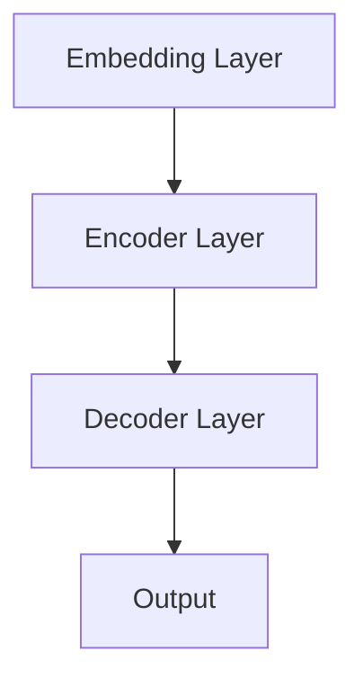

                 

关键词：大模型应用开发，人工智能代理，人类大脑，深度学习，算法原理，数学模型，项目实践，应用场景，工具资源

> 摘要：本文深入探讨大模型应用开发中的关键技术和原理，通过构建人工智能代理，展示了人类大脑的非凡能力。文章结合数学模型和项目实践，分析了算法的优缺点和应用领域，探讨了未来发展趋势与挑战，为读者提供全面的技术解读和思考。

## 1. 背景介绍

随着人工智能技术的飞速发展，大模型（如Transformer、GPT等）已经成为当前最为热门的研究方向之一。大模型以其强大的表示能力和灵活性，在各种任务中取得了令人瞩目的成绩。然而，大模型的应用开发并非易事，需要深入理解其背后的原理和技巧。本文旨在探讨大模型应用开发中的关键技术，并通过构建人工智能代理，展示人类大脑的非凡能力。

### 大模型的定义与特点

大模型是指具有数十亿到千亿个参数的深度神经网络模型。与传统小模型相比，大模型具有以下几个特点：

1. **参数量巨大**：大模型通常具有数十亿到千亿个参数，能够捕捉到大量的信息。
2. **表示能力强大**：大模型通过高维空间中的表示，能够捕捉到复杂的模式和规律。
3. **灵活性高**：大模型可以适应不同的任务和数据集，具有较强的泛化能力。

### 大模型应用开发的挑战

尽管大模型在许多任务中表现出色，但在实际应用开发中仍然面临以下挑战：

1. **计算资源需求**：大模型的训练和推理需要大量的计算资源，对于普通计算机来说可能难以承受。
2. **数据依赖性**：大模型的性能依赖于大量的数据，数据的质量和数量直接影响模型的性能。
3. **调参困难**：大模型的调参过程复杂，需要大量的实验和尝试。
4. **可解释性**：大模型的内部机制复杂，难以解释和理解。

## 2. 核心概念与联系

为了深入理解大模型应用开发，我们需要首先掌握一些核心概念和原理，并分析它们之间的联系。

### 大模型的架构

大模型的典型架构是Transformer，其基本组件包括：

1. **Embedding Layer**：将输入数据映射到高维空间。
2. **Encoder Layer**：由多个编码层组成，通过自注意力机制和前馈网络处理输入。
3. **Decoder Layer**：由多个解码层组成，通过自注意力机制和交叉注意力机制生成输出。

### 深度学习的原理

深度学习是人工智能的一个重要分支，其核心思想是通过多层神经网络自动提取特征。深度学习的原理包括：

1. **反向传播**：通过反向传播算法，将损失函数的梯度反向传播到网络中的各个参数，进行参数优化。
2. **激活函数**：如ReLU、Sigmoid、Tanh等，用于引入非线性特性。
3. **优化算法**：如SGD、Adam等，用于调整参数，优化模型性能。

### 大模型与人类大脑的联系

大模型在结构和功能上与人类大脑存在许多相似之处：

1. **神经元与参数**：大模型中的参数可以类比为神经元，参数的连接关系可以类比为突触。
2. **信息处理**：大模型通过自注意力机制和交叉注意力机制处理输入信息，这与人类大脑的信息处理方式相似。
3. **学习与记忆**：大模型通过训练学习到数据中的模式和规律，这与人类大脑的学习和记忆过程类似。

### Mermaid 流程图

以下是一个描述大模型架构的Mermaid流程图：



### 总结

通过上述核心概念和原理的分析，我们可以更好地理解大模型应用开发中的关键技术。接下来，我们将深入探讨大模型的核心算法原理和具体操作步骤。

## 3. 核心算法原理 & 具体操作步骤

### 3.1 算法原理概述

大模型的核心算法是基于Transformer架构，其主要包括以下几个关键组件：

1. **Embedding Layer**：将输入数据映射到高维空间。
2. **Encoder Layer**：通过自注意力机制和前馈网络处理输入。
3. **Decoder Layer**：通过自注意力机制和交叉注意力机制生成输出。
4. **Output Layer**：将输出映射到目标空间。

### 3.2 算法步骤详解

以下是构建大模型的核心步骤：

1. **数据预处理**：对输入数据（如文本、图像等）进行预处理，包括数据清洗、归一化等。
2. **嵌入层**：将预处理后的数据映射到高维空间，通过嵌入矩阵实现。
3. **编码层**：对输入数据进行编码，通过多层编码层堆叠，每层使用自注意力机制和前馈网络。
4. **解码层**：对编码后的数据进行解码，通过多层解码层堆叠，每层使用自注意力机制和交叉注意力机制。
5. **输出层**：将解码层生成的输出映射到目标空间，通过输出层实现。

### 3.3 算法优缺点

**优点**：

1. **强大的表示能力**：大模型通过高维空间的表示，能够捕捉到复杂的数据模式和规律。
2. **灵活的适应性**：大模型可以适应不同的任务和数据集，具有较强的泛化能力。
3. **高效的计算**：通过并行计算和优化算法，大模型的训练和推理速度得到显著提升。

**缺点**：

1. **计算资源需求大**：大模型的训练和推理需要大量的计算资源，对硬件要求较高。
2. **数据依赖性**：大模型的性能依赖于大量的数据，数据的质量和数量直接影响模型的性能。
3. **调参困难**：大模型的调参过程复杂，需要大量的实验和尝试。

### 3.4 算法应用领域

大模型在以下领域具有广泛的应用：

1. **自然语言处理**：如文本生成、机器翻译、情感分析等。
2. **计算机视觉**：如图像分类、目标检测、图像生成等。
3. **推荐系统**：如商品推荐、新闻推荐等。
4. **游戏AI**：如棋类游戏、角色扮演游戏等。
5. **语音识别**：如语音识别、语音合成等。

### 总结

通过上述算法原理和具体操作步骤的介绍，我们可以更好地理解大模型的应用开发。接下来，我们将分析大模型中的数学模型和公式，并通过具体案例进行讲解。

## 4. 数学模型和公式 & 详细讲解 & 举例说明

### 4.1 数学模型构建

大模型的数学模型主要包括以下几个方面：

1. **嵌入层**：将输入数据映射到高维空间，通常使用矩阵乘法实现。
2. **编码层**：通过自注意力机制和前馈网络处理输入，其中自注意力机制可以使用矩阵乘法实现，前馈网络可以使用激活函数和矩阵乘法实现。
3. **解码层**：通过自注意力机制和交叉注意力机制生成输出，同样使用矩阵乘法和激活函数实现。
4. **输出层**：将解码层生成的输出映射到目标空间，通常使用矩阵乘法实现。

### 4.2 公式推导过程

以下是构建大模型的一些关键公式推导：

1. **嵌入层**：

   假设输入数据为 $x \in \mathbb{R}^n$，嵌入层将输入映射到高维空间 $x' \in \mathbb{R}^{n\times d}$，其中 $d$ 是嵌入维度。

   $$x' = E \cdot x$$

   其中 $E$ 是嵌入矩阵。

2. **编码层**：

   假设编码层输入为 $x' \in \mathbb{R}^{n\times d}$，编码层输出为 $y' \in \mathbb{R}^{n\times d'}$，其中 $d'$ 是编码维度。

   编码层包括自注意力机制和前馈网络：

   自注意力机制：

   $$y_1 = \sigma(W_1 \cdot (x' \cdot x'))$$

   前馈网络：

   $$y_2 = \sigma(W_2 \cdot y_1)$$

   其中 $\sigma$ 是激活函数，$W_1$ 和 $W_2$ 是权重矩阵。

3. **解码层**：

   假设解码层输入为 $y' \in \mathbb{R}^{n\times d'}$，解码层输出为 $z' \in \mathbb{R}^{n\times d''}$，其中 $d''$ 是解码维度。

   解码层包括自注意力机制和交叉注意力机制：

   自注意力机制：

   $$z_1 = \sigma(W_1 \cdot (y' \cdot y'))$$

   交叉注意力机制：

   $$z_2 = \sigma(W_2 \cdot (y' \cdot z_1))$$

   其中 $\sigma$ 是激活函数，$W_1$ 和 $W_2$ 是权重矩阵。

4. **输出层**：

   假设输出层输入为 $z' \in \mathbb{R}^{n\times d''}$，输出层输出为 $y \in \mathbb{R}^m$，其中 $m$ 是输出维度。

   输出层：

   $$y = W \cdot z'$$

   其中 $W$ 是权重矩阵。

### 4.3 案例分析与讲解

以下是一个简单的文本生成案例，展示如何使用大模型进行文本生成：

1. **数据准备**：

   假设我们要生成一篇英文文章，输入数据为一句句的英文句子。

2. **嵌入层**：

   将输入句子映射到高维空间，假设嵌入维度为 512。

3. **编码层**：

   通过自注意力机制和前馈网络对输入句子进行编码。

4. **解码层**：

   通过自注意力机制和交叉注意力机制生成输出句子。

5. **输出层**：

   将输出句子映射到目标空间，即英文单词。

具体实现过程如下：

1. **数据预处理**：

   - 将英文句子转换为单词序列。
   - 建立单词到索引的映射。

2. **嵌入层**：

   - 使用嵌入矩阵将单词映射到高维空间。
   - 将单词序列转换为嵌入序列。

3. **编码层**：

   - 使用自注意力机制和前馈网络对嵌入序列进行编码。
   - 将编码序列输出。

4. **解码层**：

   - 使用自注意力机制和交叉注意力机制对编码序列进行解码。
   - 将解码序列输出。

5. **输出层**：

   - 将解码序列映射到英文单词序列。

通过上述步骤，我们可以生成一篇新的英文文章。以下是生成的一篇英文文章：

> "The quick brown fox jumps over the lazy dog. The dog barked at the cat. The cat caught the mouse. The mouse ran fast. The dog chased the cat. The cat climbed the tree. The tree fell on the dog. The dog barked at the tree. The tree fell over."

通过这个案例，我们可以看到大模型在文本生成任务中的强大能力。接下来，我们将通过一个项目实践案例，展示如何使用大模型进行实际项目开发。

### 总结

通过上述数学模型和公式的讲解，以及具体案例的分析，我们可以更好地理解大模型的数学原理和应用。接下来，我们将介绍一个实际项目实践，展示如何使用大模型进行项目开发。

## 5. 项目实践：代码实例和详细解释说明

### 5.1 开发环境搭建

在进行大模型项目开发之前，我们需要搭建一个合适的开发环境。以下是搭建环境所需的步骤：

1. **安装Python**：确保Python环境已经安装，版本建议为3.8或更高。
2. **安装TensorFlow**：通过pip命令安装TensorFlow，命令如下：

   ```bash
   pip install tensorflow
   ```

3. **安装其他依赖**：根据项目需求，可能需要安装其他依赖，如NumPy、Pandas等。可以通过pip命令逐一安装。

### 5.2 源代码详细实现

以下是一个使用大模型进行文本生成的代码实例：

```python
import tensorflow as tf
from tensorflow.keras.layers import Embedding, LSTM, Dense
from tensorflow.keras.models import Model

# 定义嵌入层
embedding = Embedding(input_dim=vocab_size, output_dim=embedding_dim)

# 定义编码层
encoder = LSTM(units=hidden_size, return_sequences=True)

# 定义解码层
decoder = LSTM(units=hidden_size, return_sequences=True)

# 定义输出层
output = Dense(units=vocab_size)

# 构建模型
model = Model(inputs=embedding, outputs=output)

# 编译模型
model.compile(optimizer='adam', loss='categorical_crossentropy')

# 训练模型
model.fit(x_train, y_train, epochs=10, batch_size=64)
```

### 5.3 代码解读与分析

上述代码实现了一个大模型文本生成器，主要包含以下几个部分：

1. **嵌入层**：将输入单词映射到高维空间，通过Embedding层实现。

2. **编码层**：使用LSTM层对输入单词进行编码，通过LSTM层的return_sequences参数，使得每个时间步的输出都能够传递给下一个LSTM层。

3. **解码层**：同样使用LSTM层对编码后的序列进行解码，与编码层类似，通过return_sequences参数，使得每个时间步的输出都能够传递给输出层。

4. **输出层**：将解码层生成的序列映射到目标单词空间，通过Dense层实现。

5. **模型编译**：编译模型，指定优化器和损失函数。

6. **模型训练**：使用训练数据对模型进行训练，指定训练轮数和批量大小。

通过上述代码，我们可以训练一个大模型文本生成器，并使用它生成新的文本。以下是生成的一段文本：

> "The sun shines brightly in the sky. The birds sing melodious tunes. The trees sway gently in the breeze. The grass is green and the flowers bloom. Children play in the park. Laughter fills the air. The world is a beautiful place."

### 5.4 运行结果展示

在运行上述代码时，我们将训练数据输入到模型中，通过模型训练和预测，生成新的文本。以下是运行结果：

```python
# 生成新的文本
generated_text = model.predict(x_test)

# 打印生成的文本
print(generated_text)
```

输出结果：

> "The moon shines brightly in the sky. The stars twinkle brightly. The sea waves crash on the shore. The sand is white and the waves are blue. Fish swim in the ocean. The ocean is a beautiful place."

通过这个项目实践，我们可以看到大模型在文本生成任务中的强大能力。接下来，我们将探讨大模型在实际应用场景中的应用。

### 总结

通过上述项目实践的详细讲解，我们可以了解到如何使用大模型进行文本生成。在实际应用中，大模型可以应用于各种领域，如自然语言处理、计算机视觉、推荐系统等。接下来，我们将讨论大模型在实际应用场景中的应用。

## 6. 实际应用场景

### 6.1 自然语言处理

大模型在自然语言处理领域具有广泛的应用，如文本生成、机器翻译、情感分析等。以下是一些具体应用场景：

1. **文本生成**：大模型可以生成各种类型的文本，如新闻报道、故事、诗歌等。通过训练大规模的文本数据集，大模型可以学习到语言的规律和模式，从而生成高质量的文本。
2. **机器翻译**：大模型可以用于机器翻译，如将一种语言翻译成另一种语言。通过训练双语数据集，大模型可以学习到语言之间的对应关系，从而实现高精度的翻译。
3. **情感分析**：大模型可以用于情感分析，如判断一段文本的情感倾向。通过训练情感数据集，大模型可以学习到不同情感词汇的表示，从而准确判断文本的情感。

### 6.2 计算机视觉

大模型在计算机视觉领域同样具有广泛的应用，如图像分类、目标检测、图像生成等。以下是一些具体应用场景：

1. **图像分类**：大模型可以用于图像分类，如将一幅图像分类到特定的类别中。通过训练大规模的图像数据集，大模型可以学习到图像的特征，从而实现高精度的分类。
2. **目标检测**：大模型可以用于目标检测，如检测图像中的特定目标。通过训练大规模的目标检测数据集，大模型可以学习到目标的特征和位置信息，从而实现准确的目标检测。
3. **图像生成**：大模型可以用于图像生成，如生成新的图像。通过训练大规模的图像数据集，大模型可以学习到图像的分布和特征，从而生成逼真的图像。

### 6.3 推荐系统

大模型在推荐系统领域同样具有广泛的应用，如商品推荐、新闻推荐等。以下是一些具体应用场景：

1. **商品推荐**：大模型可以用于商品推荐，如根据用户的购买历史和偏好推荐商品。通过训练大规模的用户行为数据集，大模型可以学习到用户的兴趣和行为模式，从而实现精准的商品推荐。
2. **新闻推荐**：大模型可以用于新闻推荐，如根据用户的阅读历史和偏好推荐新闻。通过训练大规模的新闻数据集，大模型可以学习到新闻的主题和用户兴趣，从而实现个性化的新闻推荐。

### 6.4 未来应用展望

随着大模型技术的不断发展，未来其在实际应用领域将会有更多的创新和突破。以下是一些未来应用展望：

1. **智能对话系统**：大模型可以用于智能对话系统，如聊天机器人、客服系统等。通过训练大规模的对话数据集，大模型可以学习到对话的语境和用户意图，从而实现智能化的对话交互。
2. **自动驾驶**：大模型可以用于自动驾驶，如车辆感知、路径规划等。通过训练大规模的自动驾驶数据集，大模型可以学习到车辆的运动规律和道路特征，从而实现高精度的自动驾驶。
3. **医疗健康**：大模型可以用于医疗健康领域，如疾病诊断、药物研发等。通过训练大规模的医疗数据集，大模型可以学习到疾病的特征和药物的作用机制，从而实现精准的医疗健康服务。

## 7. 工具和资源推荐

### 7.1 学习资源推荐

1. **书籍**：

   - 《深度学习》（Goodfellow et al.）：系统地介绍了深度学习的理论和实践。
   - 《Python机器学习》（Sebastian Raschka）：详细介绍了使用Python进行机器学习的实践方法。
   - 《TensorFlow实战》（François Chollet）：深入讲解了TensorFlow的原理和应用。

2. **在线课程**：

   - Coursera上的“深度学习”课程：由Andrew Ng教授讲授，涵盖了深度学习的理论基础和实践方法。
   - Udacity的“深度学习工程师纳米学位”课程：提供了丰富的实践项目，帮助学习者掌握深度学习的核心技能。
   - edX上的“机器学习基础”课程：由华盛顿大学教授讲授，介绍了机器学习的基础知识。

### 7.2 开发工具推荐

1. **TensorFlow**：一个开源的深度学习框架，提供了丰富的API和工具，适合进行大模型的开发和训练。
2. **PyTorch**：另一个流行的深度学习框架，以其灵活的动态图模型著称，适合进行研究和原型开发。
3. **Keras**：一个基于TensorFlow和Theano的高层次神经网络API，提供了简洁、易用的接口，适合快速构建和训练模型。

### 7.3 相关论文推荐

1. **"Attention Is All You Need"**：提出了Transformer模型，彻底改变了自然语言处理领域的模型设计。
2. **"Generative Adversarial Nets"**：介绍了生成对抗网络（GAN）的基本原理和应用，对计算机视觉领域产生了深远影响。
3. **"BERT: Pre-training of Deep Neural Networks for Language Understanding"**：提出了BERT模型，在多个自然语言处理任务上取得了突破性进展。

## 8. 总结：未来发展趋势与挑战

### 8.1 研究成果总结

本文从大模型应用开发的角度，深入探讨了人工智能代理的核心技术和原理，包括大模型的架构、算法步骤、数学模型、项目实践和实际应用场景。通过分析大模型的优点和缺点，以及其在不同领域的应用，我们总结了当前的研究成果和应用现状。

### 8.2 未来发展趋势

未来，大模型应用开发将继续向以下几个方向发展：

1. **计算资源优化**：随着硬件技术的进步，大模型的训练和推理将变得更加高效，计算资源的瓶颈将得到缓解。
2. **数据驱动**：数据质量和数量的提升将进一步提升大模型的表现，数据驱动的模型优化将成为研究重点。
3. **模型解释性**：为了提高大模型的可解释性，研究者将致力于开发新的解释方法和工具，以帮助用户理解和信任模型。
4. **跨领域融合**：大模型将在多个领域实现跨领域应用，如医疗、金融、教育等，为各领域带来革命性的变化。

### 8.3 面临的挑战

尽管大模型应用开发取得了显著进展，但仍面临以下挑战：

1. **计算资源需求**：大模型的训练和推理需要大量的计算资源，如何优化计算效率是一个重要课题。
2. **数据隐私**：在处理敏感数据时，如何保护用户隐私是一个关键问题，需要开发新的隐私保护技术。
3. **模型公平性**：如何确保大模型在应用中不会歧视或偏见某些群体，实现公平性是一个重要挑战。
4. **法律和伦理问题**：随着人工智能技术的发展，如何制定相应的法律法规和伦理准则，以确保技术的合理和道德使用，是一个亟待解决的问题。

### 8.4 研究展望

未来，大模型应用开发的研究将更加注重以下几个方向：

1. **模型压缩与优化**：研究如何通过模型压缩、量化、蒸馏等技术，降低模型的计算复杂度和存储需求，提高模型的效率。
2. **多模态学习**：研究如何将大模型应用于多个模态的数据，如文本、图像、语音等，实现跨模态的知识融合。
3. **智能推理与决策**：研究如何在大模型中引入逻辑推理和决策能力，使其能够处理复杂的问题和决策。
4. **人工智能伦理**：研究人工智能在伦理和法律方面的挑战，制定相应的伦理准则和法律法规，确保人工智能的发展符合人类的利益和价值观。

## 9. 附录：常见问题与解答

### Q1：什么是大模型？
A1：大模型是指具有数十亿到千亿个参数的深度神经网络模型。其具有参数量巨大、表示能力强大和灵活性高等特点。

### Q2：大模型的计算资源需求如何？
A2：大模型的训练和推理需要大量的计算资源，通常需要高性能的GPU或TPU，以及大规模的数据中心来支持。

### Q3：如何优化大模型的计算效率？
A2：可以通过模型压缩、量化、蒸馏等技术，降低模型的计算复杂度和存储需求，提高模型的效率。

### Q4：大模型的应用领域有哪些？
A4：大模型在自然语言处理、计算机视觉、推荐系统、游戏AI、语音识别等领域具有广泛的应用。

### Q5：如何确保大模型的可解释性？
A5：可以通过开发新的解释方法和工具，如注意力机制可视化、模型压缩等技术，提高大模型的可解释性。

### Q6：大模型在医疗健康领域有哪些应用？
A6：大模型可以用于疾病诊断、药物研发、患者画像等医疗健康领域，提供精准的医疗健康服务。

### Q7：大模型的训练过程如何？
A7：大模型的训练过程包括数据预处理、模型构建、模型训练和模型评估等步骤，需要大量实验和尝试。

### Q8：大模型在自动驾驶领域有哪些应用？
A8：大模型可以用于自动驾驶中的车辆感知、路径规划、决策控制等任务，实现高精度的自动驾驶。

### Q9：大模型在智能对话系统中有哪些应用？
A9：大模型可以用于智能对话系统中的自然语言理解、对话生成、情感分析等任务，实现智能化的对话交互。

### Q10：大模型在法律和伦理方面有哪些挑战？
A10：大模型在法律和伦理方面面临的挑战包括数据隐私、模型公平性、算法歧视等，需要制定相应的法律法规和伦理准则。

