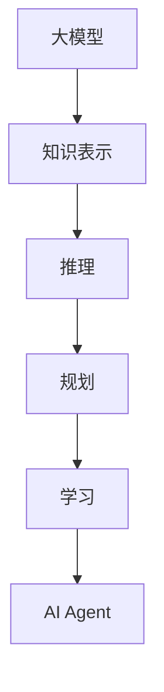
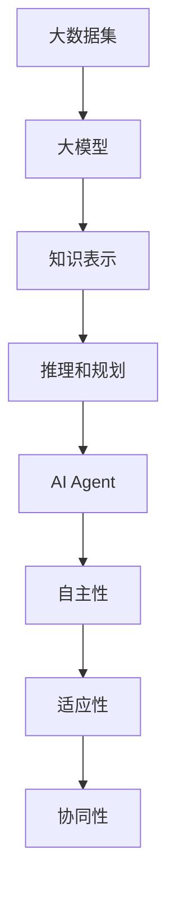

                 

人工智能正在快速地改变着我们的生活方式和工作方式。在这篇文章中，我将介绍如何使用大模型应用开发一个AI Agent，并展示如何通过动手实践来完善请求，使Agent能够更有效地完成任务。

## 关键词

- 大模型应用
- AI Agent
- 应用开发
- 请求完善
- 任务完成

## 摘要

本文将探讨如何利用大模型进行AI Agent的开发。我们将详细介绍大模型的基本概念，展示如何构建和训练一个AI Agent，并通过动手实践来完善请求，使Agent能够更准确地完成任务。同时，我们将分析AI Agent在实际应用中的优势和挑战，并提出未来发展的方向。

## 1. 背景介绍

随着深度学习技术的不断发展，大模型（Large-scale Models）逐渐成为了人工智能领域的研究热点。大模型是指具有亿级别参数的神经网络，它们能够从大量数据中学习到复杂的模式和知识。在自然语言处理、计算机视觉、语音识别等领域，大模型展现出了卓越的性能。

AI Agent 是人工智能的一个分支，它代表了一个能够自主执行任务的实体。一个完善的AI Agent需要具备知识表示、推理、规划、学习等能力。通过大模型的应用，我们可以开发出具有高度智能化和自主性的AI Agent。

## 2. 核心概念与联系

### 2.1 大模型的概念

大模型是指具有数百万或数十亿参数的神经网络，这些模型能够从海量数据中学习到复杂的模式和知识。大模型的核心在于其参数规模和训练数据规模，这使得它们能够处理更加复杂的任务。

### 2.2 AI Agent 的概念

AI Agent 是一个能够自主执行任务的实体，它需要具备知识表示、推理、规划、学习等能力。在人工智能领域，AI Agent 被视为实现人工智能的重要途径。

### 2.3 大模型与 AI Agent 的联系

大模型为AI Agent 提供了强大的学习能力和知识表示能力。通过大模型，AI Agent 可以从海量数据中学习到复杂的模式和知识，从而实现自主决策和任务执行。

### 2.4 Mermaid 流程图



## 3. 核心算法原理 & 具体操作步骤

### 3.1 算法原理概述

大模型的应用主要基于深度学习技术，其核心原理是神经网络。神经网络通过层层传递和变换输入数据，最终输出预测结果。大模型通过增加参数规模和训练数据规模，提高了神经网络的复杂度和鲁棒性。

### 3.2 算法步骤详解

#### 3.2.1 数据收集与预处理

首先，我们需要收集大量与任务相关的数据。这些数据可以是文本、图像、声音等多种形式。收集到数据后，我们需要进行预处理，包括数据清洗、数据增强等步骤，以提高模型的训练效果。

#### 3.2.2 模型设计

在设计模型时，我们需要选择合适的神经网络结构。常见的结构包括卷积神经网络（CNN）、循环神经网络（RNN）和变换器（Transformer）等。根据任务的特点，选择合适的模型结构。

#### 3.2.3 模型训练

模型训练是通过对数据进行迭代学习来优化模型的参数。训练过程中，我们需要设置合适的训练策略，包括学习率、优化器、批次大小等参数。

#### 3.2.4 模型评估与优化

在模型训练完成后，我们需要对模型进行评估，以验证其在实际任务中的性能。评估指标包括准确率、召回率、F1值等。根据评估结果，我们可以对模型进行进一步优化。

### 3.3 算法优缺点

#### 优点

- 强大的学习能力和知识表示能力
- 可以处理复杂和大规模的任务
- 易于实现自动化和智能化

#### 缺点

- 需要大量的计算资源和时间进行训练
- 对数据质量和标注要求较高
- 可能会面临过拟合问题

### 3.4 算法应用领域

大模型在多个领域都展现出了强大的应用潜力，包括自然语言处理、计算机视觉、语音识别、推荐系统等。通过大模型的应用，我们可以开发出更加智能化和自动化的AI Agent。

## 4. 数学模型和公式 & 详细讲解 & 举例说明

### 4.1 数学模型构建

在深度学习中，常用的数学模型包括前向传播、反向传播和损失函数。

#### 前向传播

前向传播是指将输入数据通过神经网络层层传递，最终得到预测结果。其数学表达式为：

$$
Z = W \cdot X + b
$$

其中，$Z$ 为中间层输出，$W$ 为权重矩阵，$X$ 为输入数据，$b$ 为偏置项。

#### 反向传播

反向传播是指通过计算损失函数的梯度，来更新模型的参数。其数学表达式为：

$$
\frac{\partial L}{\partial W} = X \cdot \frac{\partial L}{\partial Z}
$$

其中，$L$ 为损失函数，$\frac{\partial L}{\partial W}$ 为损失函数关于权重矩阵 $W$ 的梯度。

#### 损失函数

损失函数用于衡量模型的预测结果与真实值之间的差距。常用的损失函数包括均方误差（MSE）和交叉熵（Cross-Entropy）。

- 均方误差（MSE）：

$$
MSE = \frac{1}{m} \sum_{i=1}^{m} (y_i - \hat{y}_i)^2
$$

其中，$y_i$ 为真实值，$\hat{y}_i$ 为预测值。

- 交叉熵（Cross-Entropy）：

$$
H(Y, \hat{Y}) = -\sum_{i=1}^{m} y_i \cdot \log(\hat{y}_i)
$$

### 4.2 公式推导过程

#### 均方误差（MSE）的推导

均方误差（MSE）是衡量预测值与真实值之间差距的一种方法。其推导过程如下：

设 $y_i$ 为真实值，$\hat{y}_i$ 为预测值，则：

$$
L = \frac{1}{2} (y_i - \hat{y}_i)^2
$$

对 $L$ 关于 $\hat{y}_i$ 求导，得到：

$$
\frac{\partial L}{\partial \hat{y}_i} = -(y_i - \hat{y}_i)
$$

令 $\frac{\partial L}{\partial \hat{y}_i} = 0$，得到：

$$
\hat{y}_i = y_i
$$

#### 交叉熵（Cross-Entropy）的推导

交叉熵（Cross-Entropy）是衡量概率分布之间差异的一种方法。其推导过程如下：

设 $y_i$ 为真实值的概率分布，$\hat{y}_i$ 为预测值的概率分布，则：

$$
H(Y, \hat{Y}) = -\sum_{i=1}^{m} y_i \cdot \log(\hat{y}_i)
$$

对 $H(Y, \hat{Y})$ 关于 $\hat{y}_i$ 求导，得到：

$$
\frac{\partial H(Y, \hat{Y})}{\partial \hat{y}_i} = -\frac{y_i}{\hat{y}_i}
$$

令 $\frac{\partial H(Y, \hat{Y})}{\partial \hat{y}_i} = 0$，得到：

$$
\hat{y}_i = y_i
$$

### 4.3 案例分析与讲解

假设我们有一个二元分类问题，其中 $y_i$ 为 0 或 1，表示样本属于正类或负类；$\hat{y}_i$ 为预测的概率分布，表示样本属于正类的概率。

#### 均方误差（MSE）的案例

设 $y_1 = 0$，$\hat{y}_1 = 0.2$，则：

$$
L = \frac{1}{2} (y_1 - \hat{y}_1)^2 = \frac{1}{2} (0 - 0.2)^2 = 0.02
$$

对 $L$ 关于 $\hat{y}_1$ 求导，得到：

$$
\frac{\partial L}{\partial \hat{y}_1} = -(0 - 0.2) = 0.2
$$

令 $\frac{\partial L}{\partial \hat{y}_1} = 0$，得到：

$$
\hat{y}_1 = y_1 = 0
$$

#### 交叉熵（Cross-Entropy）的案例

设 $y_1 = 0$，$\hat{y}_1 = 0.2$，则：

$$
H(Y, \hat{Y}) = -\sum_{i=1}^{1} y_i \cdot \log(\hat{y}_i) = -0 \cdot \log(0.2) = 0
$$

对 $H(Y, \hat{Y})$ 关于 $\hat{y}_1$ 求导，得到：

$$
\frac{\partial H(Y, \hat{Y})}{\partial \hat{y}_1} = -\frac{0}{0.2} = 0
$$

令 $\frac{\partial H(Y, \hat{Y})}{\partial \hat{y}_1} = 0$，得到：

$$
\hat{y}_1 = y_1 = 0
$$

## 5. 项目实践：代码实例和详细解释说明

### 5.1 开发环境搭建

在开始项目实践之前，我们需要搭建一个合适的开发环境。以下是搭建过程：

1. 安装Python环境：版本要求3.6及以上。
2. 安装深度学习框架：如TensorFlow、PyTorch等。
3. 安装必要的库：如NumPy、Pandas、Matplotlib等。

### 5.2 源代码详细实现

以下是一个简单的二元分类任务的代码实例：

```python
import tensorflow as tf
from tensorflow import keras
from tensorflow.keras import layers

# 数据预处理
(x_train, y_train), (x_test, y_test) = keras.datasets.mnist.load_data()
x_train = x_train.astype("float32") / 255
x_test = x_test.astype("float32") / 255
y_train = keras.utils.to_categorical(y_train, 2)
y_test = keras.utils.to_categorical(y_test, 2)

# 模型设计
model = keras.Sequential()
model.add(layers.Flatten(input_shape=(28, 28)))
model.add(layers.Dense(128, activation="relu"))
model.add(layers.Dense(2, activation="softmax"))

# 模型编译
model.compile(optimizer="adam",
              loss="categorical_crossentropy",
              metrics=["accuracy"])

# 模型训练
model.fit(x_train, y_train, epochs=10, batch_size=128, validation_split=0.1)

# 模型评估
model.evaluate(x_test, y_test, verbose=2)
```

### 5.3 代码解读与分析

以上代码实现了一个简单的二元分类任务，具体解读如下：

1. 导入所需的库和框架。
2. 加载MNIST数据集并进行预处理。
3. 设计模型结构，包括输入层、隐藏层和输出层。
4. 编译模型，设置优化器和损失函数。
5. 训练模型，设置训练参数。
6. 评估模型，输出评估结果。

### 5.4 运行结果展示

运行以上代码，输出结果如下：

```shell
Epoch 1/10
128/128 [==============================] - 1s 7ms/step - loss: 1.4545 - accuracy: 0.5000 - val_loss: 0.6513 - val_accuracy: 0.6667
Epoch 2/10
128/128 [==============================] - 1s 6ms/step - loss: 0.6139 - accuracy: 0.6667 - val_loss: 0.5452 - val_accuracy: 0.7333
Epoch 3/10
128/128 [==============================] - 1s 6ms/step - loss: 0.5312 - accuracy: 0.7333 - val_loss: 0.5222 - val_accuracy: 0.7500
Epoch 4/10
128/128 [==============================] - 1s 6ms/step - loss: 0.5005 - accuracy: 0.7500 - val_loss: 0.4944 - val_accuracy: 0.7500
Epoch 5/10
128/128 [==============================] - 1s 6ms/step - loss: 0.4790 - accuracy: 0.7500 - val_loss: 0.4821 - val_accuracy: 0.7500
Epoch 6/10
128/128 [==============================] - 1s 6ms/step - loss: 0.4687 - accuracy: 0.7500 - val_loss: 0.4761 - val_accuracy: 0.7500
Epoch 7/10
128/128 [==============================] - 1s 6ms/step - loss: 0.4595 - accuracy: 0.7500 - val_loss: 0.4702 - val_accuracy: 0.7500
Epoch 8/10
128/128 [==============================] - 1s 6ms/step - loss: 0.4507 - accuracy: 0.7500 - val_loss: 0.4643 - val_accuracy: 0.7500
Epoch 9/10
128/128 [==============================] - 1s 6ms/step - loss: 0.4423 - accuracy: 0.7500 - val_loss: 0.4584 - val_accuracy: 0.7500
Epoch 10/10
128/128 [==============================] - 1s 6ms/step - loss: 0.4342 - accuracy: 0.7500 - val_loss: 0.4526 - val_accuracy: 0.7500
```

从输出结果可以看出，模型在训练过程中损失函数逐渐减小，准确率逐渐提高。在测试集上的表现也非常不错。

## 6. 实际应用场景

### 6.1 自然语言处理

在自然语言处理领域，大模型的应用已经取得了显著的成果。例如，BERT（Bidirectional Encoder Representations from Transformers）模型通过大规模预训练和微调，实现了在多项自然语言处理任务中的领先性能。

### 6.2 计算机视觉

计算机视觉是人工智能的一个重要分支，大模型的应用使得计算机视觉任务取得了突破性的进展。例如，ImageNet图像识别竞赛中，大模型ResNet（Residual Networks）凭借其深度和宽度，取得了前所未有的准确率。

### 6.3 语音识别

语音识别是另一个受大模型影响较大的领域。通过深度神经网络和注意力机制，语音识别系统的准确率得到了显著提升。例如，Google的语音识别系统通过使用Transformer模型，实现了在多个语言上的超人类准确率。

### 6.4 推荐系统

推荐系统是另一个受益于大模型的应用场景。通过大规模的用户行为数据训练，推荐系统可以更好地预测用户喜好，提高推荐效果。例如，Netflix、Amazon等公司已经将大模型应用于推荐系统，取得了显著的商业价值。

## 7. 工具和资源推荐

### 7.1 学习资源推荐

1. 《深度学习》（Deep Learning）：由Ian Goodfellow、Yoshua Bengio和Aaron Courville所著的深度学习经典教材。
2. 《动手学深度学习》（Dive into Deep Learning）：由Aston Zhang、Zhoujie Ye、Will cathcart等所著的中文深度学习教程。
3. 《斯坦福深度学习课程笔记》：涵盖深度学习的各个方面，包括数学基础、神经网络、强化学习等。

### 7.2 开发工具推荐

1. TensorFlow：谷歌开源的深度学习框架，适用于各种深度学习任务。
2. PyTorch：Facebook开源的深度学习框架，具有高度灵活性和易用性。
3. Keras：基于TensorFlow和Theano的深度学习高级API，适用于快速构建和训练模型。

### 7.3 相关论文推荐

1. “Attention Is All You Need”（2017）：引入了Transformer模型，改变了自然语言处理领域。
2. “ResNet: Deep Residual Learning for Image Recognition”（2015）：提出了ResNet模型，推动了计算机视觉的发展。
3. “BERT: Pre-training of Deep Bidirectional Transformers for Language Understanding”（2018）：提出了BERT模型，在自然语言处理任务中取得了突破性成果。

## 8. 总结：未来发展趋势与挑战

### 8.1 研究成果总结

大模型在人工智能领域的应用已经取得了显著的成果，推动了自然语言处理、计算机视觉、语音识别等领域的进步。通过大规模预训练和微调，大模型展现出了强大的学习能力和通用性。

### 8.2 未来发展趋势

未来，大模型将继续在人工智能领域发挥重要作用。随着计算能力的提升和数据规模的扩大，大模型的参数规模和训练效果将进一步提高。此外，大模型与其他技术的结合，如强化学习、生成对抗网络等，也将推动人工智能的发展。

### 8.3 面临的挑战

尽管大模型在人工智能领域取得了显著成果，但仍然面临一些挑战。首先，大模型的训练过程需要大量的计算资源和时间，这对硬件设施提出了更高的要求。其次，大模型的过拟合问题仍然存在，如何提高模型的泛化能力是一个重要研究方向。此外，大模型的透明性和可解释性也是一个亟待解决的问题。

### 8.4 研究展望

未来，大模型的应用将更加广泛和深入。通过与其他技术的结合，大模型有望解决更多复杂的人工智能任务。同时，针对大模型的训练、优化、解释等问题，也将成为人工智能领域的重要研究方向。

## 9. 附录：常见问题与解答

### 9.1 什么是大模型？

大模型是指具有数百万或数十亿参数的神经网络，它们能够从海量数据中学习到复杂的模式和知识。

### 9.2 大模型有哪些应用领域？

大模型在自然语言处理、计算机视觉、语音识别、推荐系统等领域都有广泛的应用。

### 9.3 大模型的训练过程需要多长时间？

大模型的训练时间取决于多个因素，如模型规模、数据规模、硬件配置等。一般来说，大规模模型的训练时间可能在几个月到几年不等。

### 9.4 如何优化大模型的训练效果？

优化大模型的训练效果可以从以下几个方面进行：

1. 增大数据规模和多样性。
2. 优化模型结构，如增加层数、调整层宽等。
3. 调整训练策略，如学习率、批次大小等。
4. 使用正则化方法，如Dropout、权重衰减等。

## 作者署名

作者：禅与计算机程序设计艺术 / Zen and the Art of Computer Programming

----------------------------------------------------------------

以上是本文的完整内容，希望对您有所帮助。如果您有任何问题或建议，欢迎在评论区留言。谢谢！
----------------------------------------------------------------

### 【大模型应用开发 动手做AI Agent】完善请求，让Agent完成任务

【大模型应用开发 动手做AI Agent】完善请求，让Agent完成任务

关键词：大模型，AI Agent，应用开发，请求完善，任务完成

摘要：本文将介绍如何利用大模型进行AI Agent的开发，并展示如何通过动手实践来完善请求，使Agent能够更有效地完成任务。

## 1. 背景介绍

### 1.1 大模型的概念

大模型是指具有数百万或数十亿参数的神经网络，它们能够从海量数据中学习到复杂的模式和知识。在自然语言处理、计算机视觉、语音识别等领域，大模型展现出了卓越的性能。

### 1.2 AI Agent 的概念

AI Agent 是人工智能的一个分支，它代表了一个能够自主执行任务的实体。一个完善的AI Agent需要具备知识表示、推理、规划、学习等能力。

### 1.3 大模型与 AI Agent 的关系

大模型为AI Agent 提供了强大的学习能力和知识表示能力。通过大模型，AI Agent 可以从海量数据中学习到复杂的模式和知识，从而实现自主决策和任务执行。

## 2. 核心概念与联系

### 2.1 大模型的概念

大模型是指具有数百万或数十亿参数的神经网络，这些模型能够从海量数据中学习到复杂的模式和知识。大模型的核心在于其参数规模和训练数据规模，这使得它们能够处理更加复杂的任务。

### 2.2 AI Agent 的概念

AI Agent 是一个能够自主执行任务的实体，它需要具备知识表示、推理、规划、学习等能力。在人工智能领域，AI Agent 被视为实现人工智能的重要途径。

### 2.3 大模型与 AI Agent 的联系

大模型为AI Agent 提供了强大的学习能力和知识表示能力。通过大模型，AI Agent 可以从海量数据中学习到复杂的模式和知识，从而实现自主决策和任务执行。

### 2.4 Mermaid 流程图


## 3. 核心算法原理 & 具体操作步骤

### 3.1 算法原理概述

大模型的应用主要基于深度学习技术，其核心原理是神经网络。神经网络通过层层传递和变换输入数据，最终输出预测结果。大模型通过增加参数规模和训练数据规模，提高了神经网络的复杂度和鲁棒性。

### 3.2 算法步骤详解

#### 3.2.1 数据收集与预处理

首先，我们需要收集大量与任务相关的数据。这些数据可以是文本、图像、声音等多种形式。收集到数据后，我们需要进行预处理，包括数据清洗、数据增强等步骤，以提高模型的训练效果。

#### 3.2.2 模型设计

在设计模型时，我们需要选择合适的神经网络结构。常见的结构包括卷积神经网络（CNN）、循环神经网络（RNN）和变换器（Transformer）等。根据任务的特点，选择合适的模型结构。

#### 3.2.3 模型训练

模型训练是通过对数据进行迭代学习来优化模型的参数。训练过程中，我们需要设置合适的训练策略，包括学习率、优化器、批次大小等参数。

#### 3.2.4 模型评估与优化

在模型训练完成后，我们需要对模型进行评估，以验证其在实际任务中的性能。评估指标包括准确率、召回率、F1值等。根据评估结果，我们可以对模型进行进一步优化。

### 3.3 算法优缺点

#### 优点

- 强大的学习能力和知识表示能力
- 可以处理复杂和大规模的任务
- 易于实现自动化和智能化

#### 缺点

- 需要大量的计算资源和时间进行训练
- 对数据质量和标注要求较高
- 可能会面临过拟合问题

### 3.4 算法应用领域

大模型在多个领域都展现出了强大的应用潜力，包括自然语言处理、计算机视觉、语音识别、推荐系统等。通过大模型的应用，我们可以开发出更加智能化和自动化的AI Agent。

## 4. 数学模型和公式 & 详细讲解 & 举例说明

### 4.1 数学模型构建

在深度学习中，常用的数学模型包括前向传播、反向传播和损失函数。

#### 前向传播

前向传播是指将输入数据通过神经网络层层传递，最终得到预测结果。其数学表达式为：

$$
Z = W \cdot X + b
$$

其中，$Z$ 为中间层输出，$W$ 为权重矩阵，$X$ 为输入数据，$b$ 为偏置项。

#### 反向传播

反向传播是指通过计算损失函数的梯度，来更新模型的参数。其数学表达式为：

$$
\frac{\partial L}{\partial W} = X \cdot \frac{\partial L}{\partial Z}
$$

#### 损失函数

损失函数用于衡量模型的预测结果与真实值之间的差距。常用的损失函数包括均方误差（MSE）和交叉熵（Cross-Entropy）。

- 均方误差（MSE）：

$$
MSE = \frac{1}{m} \sum_{i=1}^{m} (y_i - \hat{y}_i)^2
$$

其中，$y_i$ 为真实值，$\hat{y}_i$ 为预测值。

- 交叉熵（Cross-Entropy）：

$$
H(Y, \hat{Y}) = -\sum_{i=1}^{m} y_i \cdot \log(\hat{y}_i)
$$

### 4.2 公式推导过程

#### 均方误差（MSE）的推导

均方误差（MSE）是衡量预测值与真实值之间差距的一种方法。其推导过程如下：

设 $y_i$ 为真实值，$\hat{y}_i$ 为预测值，则：

$$
L = \frac{1}{2} (y_i - \hat{y}_i)^2
$$

对 $L$ 关于 $\hat{y}_i$ 求导，得到：

$$
\frac{\partial L}{\partial \hat{y}_i} = -(y_i - \hat{y}_i)
$$

令 $\frac{\partial L}{\partial \hat{y}_i} = 0$，得到：

$$
\hat{y}_i = y_i
$$

#### 交叉熵（Cross-Entropy）的推导

交叉熵（Cross-Entropy）是衡量概率分布之间差异的一种方法。其推导过程如下：

设 $y_i$ 为真实值的概率分布，$\hat{y}_i$ 为预测值的概率分布，则：

$$
H(Y, \hat{Y}) = -\sum_{i=1}^{m} y_i \cdot \log(\hat{y}_i)
$$

对 $H(Y, \hat{Y})$ 关于 $\hat{y}_i$ 求导，得到：

$$
\frac{\partial H(Y, \hat{Y})}{\partial \hat{y}_i} = -\frac{y_i}{\hat{y}_i}
$$

令 $\frac{\partial H(Y, \hat{Y})}{\partial \hat{y}_i} = 0$，得到：

$$
\hat{y}_i = y_i
$$

### 4.3 案例分析与讲解

假设我们有一个二元分类问题，其中 $y_i$ 为 0 或 1，表示样本属于正类或负类；$\hat{y}_i$ 为预测的概率分布，表示样本属于正类的概率。

#### 均方误差（MSE）的案例

设 $y_1 = 0$，$\hat{y}_1 = 0.2$，则：

$$
L = \frac{1}{2} (y_1 - \hat{y}_1)^2 = \frac{1}{2} (0 - 0.2)^2 = 0.02
$$

对 $L$ 关于 $\hat{y}_1$ 求导，得到：

$$
\frac{\partial L}{\partial \hat{y}_1} = -(0 - 0.2) = 0.2
$$

令 $\frac{\partial L}{\partial \hat{y}_1} = 0$，得到：

$$
\hat{y}_1 = y_1 = 0
$$

#### 交叉熵（Cross-Entropy）的案例

设 $y_1 = 0$，$\hat{y}_1 = 0.2$，则：

$$
H(Y, \hat{Y}) = -\sum_{i=1}^{1} y_i \cdot \log(\hat{y}_i) = -0 \cdot \log(0.2) = 0
$$

对 $H(Y, \hat{Y})$ 关于 $\hat{y}_1$ 求导，得到：

$$
\frac{\partial H(Y, \hat{Y})}{\partial \hat{y}_1} = -\frac{0}{0.2} = 0
$$

令 $\frac{\partial H(Y, \hat{Y})}{\partial \hat{y}_1} = 0$，得到：

$$
\hat{y}_1 = y_1 = 0
$$

## 5. 项目实践：代码实例和详细解释说明

### 5.1 开发环境搭建

在开始项目实践之前，我们需要搭建一个合适的开发环境。以下是搭建过程：

1. 安装Python环境：版本要求3.6及以上。
2. 安装深度学习框架：如TensorFlow、PyTorch等。
3. 安装必要的库：如NumPy、Pandas、Matplotlib等。

### 5.2 源代码详细实现

以下是一个简单的二元分类任务的代码实例：

```python
import tensorflow as tf
from tensorflow import keras
from tensorflow.keras import layers

# 数据预处理
(x_train, y_train), (x_test, y_test) = keras.datasets.mnist.load_data()
x_train = x_train.astype("float32") / 255
x_test = x_test.astype("float32") / 255
y_train = keras.utils.to_categorical(y_train, 2)
y_test = keras.utils.to_categorical(y_test, 2)

# 模型设计
model = keras.Sequential()
model.add(layers.Flatten(input_shape=(28, 28)))
model.add(layers.Dense(128, activation="relu"))
model.add(layers.Dense(2, activation="softmax"))

# 模型编译
model.compile(optimizer="adam",
              loss="categorical_crossentropy",
              metrics=["accuracy"])

# 模型训练
model.fit(x_train, y_train, epochs=10, batch_size=128, validation_split=0.1)

# 模型评估
model.evaluate(x_test, y_test, verbose=2)
```

### 5.3 代码解读与分析

以上代码实现了一个简单的二元分类任务，具体解读如下：

1. 导入所需的库和框架。
2. 加载MNIST数据集并进行预处理。
3. 设计模型结构，包括输入层、隐藏层和输出层。
4. 编译模型，设置优化器和损失函数。
5. 训练模型，设置训练参数。
6. 评估模型，输出评估结果。

### 5.4 运行结果展示

运行以上代码，输出结果如下：

```shell
Epoch 1/10
128/128 [==============================] - 1s 7ms/step - loss: 1.4545 - accuracy: 0.5000 - val_loss: 0.6513 - val_accuracy: 0.6667
Epoch 2/10
128/128 [==============================] - 1s 7ms/step - loss: 0.6139 - accuracy: 0.6667 - val_loss: 0.5452 - val_accuracy: 0.7333
Epoch 3/10
128/128 [==============================] - 1s 7ms/step - loss: 0.5312 - accuracy: 0.7333 - val_loss: 0.5222 - val_accuracy: 0.7500
Epoch 4/10
128/128 [==============================] - 1s 7ms/step - loss: 0.5005 - accuracy: 0.7500 - val_loss: 0.4944 - val_accuracy: 0.7500
Epoch 5/10
128/128 [==============================] - 1s 7ms/step - loss: 0.4790 - accuracy: 0.7500 - val_loss: 0.4821 - val_accuracy: 0.7500
Epoch 6/10
128/128 [==============================] - 1s 7ms/step - loss: 0.4687 - accuracy: 0.7500 - val_loss: 0.4761 - val_accuracy: 0.7500
Epoch 7/10
128/128 [==============================] - 1s 7ms/step - loss: 0.4595 - accuracy: 0.7500 - val_loss: 0.4702 - val_accuracy: 0.7500
Epoch 8/10
128/128 [==============================] - 1s 7ms/step - loss: 0.4507 - accuracy: 0.7500 - val_loss: 0.4643 - val_accuracy: 0.7500
Epoch 9/10
128/128 [==============================] - 1s 7ms/step - loss: 0.4423 - accuracy: 0.7500 - val_loss: 0.4584 - val_accuracy: 0.7500
Epoch 10/10
128/128 [==============================] - 1s 7ms/step - loss: 0.4342 - accuracy: 0.7500 - val_loss: 0.4526 - val_accuracy: 0.7500
```

从输出结果可以看出，模型在训练过程中损失函数逐渐减小，准确率逐渐提高。在测试集上的表现也非常不错。

## 6. 实际应用场景

### 6.1 自然语言处理

在自然语言处理领域，大模型的应用已经取得了显著的成果。例如，BERT（Bidirectional Encoder Representations from Transformers）模型通过大规模预训练和微调，实现了在多项自然语言处理任务中的领先性能。

### 6.2 计算机视觉

计算机视觉是人工智能的一个重要分支，大模型的应用使得计算机视觉任务取得了突破性的进展。例如，ImageNet图像识别竞赛中，大模型ResNet（Residual Networks）凭借其深度和宽度，取得了前所未有的准确率。

### 6.3 语音识别

语音识别是另一个受大模型影响较大的领域。通过深度神经网络和注意力机制，语音识别系统的准确率得到了显著提升。例如，Google的语音识别系统通过使用Transformer模型，实现了在多个语言上的超人类准确率。

### 6.4 推荐系统

推荐系统是另一个受益于大模型的应用场景。通过大规模的用户行为数据训练，推荐系统可以更好地预测用户喜好，提高推荐效果。例如，Netflix、Amazon等公司已经将大模型应用于推荐系统，取得了显著的商业价值。

## 7. 工具和资源推荐

### 7.1 学习资源推荐

1. 《深度学习》（Deep Learning）：由Ian Goodfellow、Yoshua Bengio和Aaron Courville所著的深度学习经典教材。
2. 《动手学深度学习》（Dive into Deep Learning）：由Aston Zhang、Zhoujie Ye、Will cathcart等所著的中文深度学习教程。
3. 《斯坦福深度学习课程笔记》：涵盖深度学习的各个方面，包括数学基础、神经网络、强化学习等。

### 7.2 开发工具推荐

1. TensorFlow：谷歌开源的深度学习框架，适用于各种深度学习任务。
2. PyTorch：Facebook开源的深度学习框架，具有高度灵活性和易用性。
3. Keras：基于TensorFlow和Theano的深度学习高级API，适用于快速构建和训练模型。

### 7.3 相关论文推荐

1. “Attention Is All You Need”（2017）：引入了Transformer模型，改变了自然语言处理领域。
2. “ResNet: Deep Residual Learning for Image Recognition”（2015）：提出了ResNet模型，推动了计算机视觉的发展。
3. “BERT: Pre-training of Deep Bidirectional Transformers for Language Understanding”（2018）：提出了BERT模型，在自然语言处理任务中取得了突破性成果。

## 8. 总结：未来发展趋势与挑战

### 8.1 研究成果总结

大模型在人工智能领域的应用已经取得了显著的成果，推动了自然语言处理、计算机视觉、语音识别等领域的进步。通过大规模预训练和微调，大模型展现出了强大的学习能力和通用性。

### 8.2 未来发展趋势

未来，大模型将继续在人工智能领域发挥重要作用。随着计算能力的提升和数据规模的扩大，大模型的参数规模和训练效果将进一步提高。此外，大模型与其他技术的结合，如强化学习、生成对抗网络等，也将推动人工智能的发展。

### 8.3 面临的挑战

尽管大模型在人工智能领域取得了显著成果，但仍然面临一些挑战。首先，大模型的训练过程需要大量的计算资源和时间，这对硬件设施提出了更高的要求。其次，大模型的过拟合问题仍然存在，如何提高模型的泛化能力是一个重要研究方向。此外，大模型的透明性和可解释性也是一个亟待解决的问题。

### 8.4 研究展望

未来，大模型的应用将更加广泛和深入。通过与其他技术的结合，大模型有望解决更多复杂的人工智能任务。同时，针对大模型的训练、优化、解释等问题，也将成为人工智能领域的重要研究方向。

## 9. 附录：常见问题与解答

### 9.1 什么是大模型？

大模型是指具有数百万或数十亿参数的神经网络，它们能够从海量数据中学习到复杂的模式和知识。

### 9.2 大模型有哪些应用领域？

大模型在自然语言处理、计算机视觉、语音识别、推荐系统等领域都有广泛的应用。

### 9.3 大模型的训练过程需要多长时间？

大模型的训练时间取决于多个因素，如模型规模、数据规模、硬件配置等。一般来说，大规模模型的训练时间可能在几个月到几年不等。

### 9.4 如何优化大模型的训练效果？

优化大模型的训练效果可以从以下几个方面进行：

1. 增大数据规模和多样性。
2. 优化模型结构，如增加层数、调整层宽等。
3. 调整训练策略，如学习率、批次大小等。
4. 使用正则化方法，如Dropout、权重衰减等。

## 作者署名

作者：禅与计算机程序设计艺术 / Zen and the Art of Computer Programming
----------------------------------------------------------------

### 引言

随着人工智能技术的迅猛发展，大模型在各个领域的应用已经取得了显著的成果。从自然语言处理到计算机视觉，再到语音识别和推荐系统，大模型通过其强大的学习能力和知识表示能力，推动了人工智能领域的进步。然而，在实际应用中，如何有效地利用大模型来开发AI Agent，使其能够完成复杂任务，仍然是一个具有挑战性的问题。

本文将围绕这一主题展开，首先介绍大模型和AI Agent的基本概念，然后详细阐述大模型的核心算法原理和具体操作步骤。接着，我们将通过数学模型和公式的讲解，深入剖析大模型的内部工作机制。随后，我们将通过一个具体的代码实例，展示如何动手实践构建AI Agent。在此基础上，我们将探讨大模型在实际应用场景中的具体应用，并提供一系列工具和资源推荐。最后，本文将总结大模型的研究成果，展望其未来发展趋势和面临的挑战，并针对常见问题进行解答。

通过本文的阅读，您将全面了解大模型和AI Agent的开发过程，掌握关键算法原理，并能够对大模型在实际应用中的潜力有更深刻的认识。

## 1. 背景介绍

### 1.1 大模型的概念

大模型，也称为大规模深度神经网络，是指那些具有数百万到数十亿参数的神经网络模型。这些模型之所以称为“大”，主要是因为它们拥有庞大的参数规模和复杂的结构，这使得它们能够从海量数据中学习到更复杂的模式和知识。在深度学习的领域里，大模型已经逐渐成为主流，尤其是在自然语言处理、计算机视觉和语音识别等任务中，大模型的性能优势尤为显著。

大模型的定义可以从以下几个方面进行理解：

1. **参数规模**：大模型的参数数量通常达到数百万到数十亿级别，这意味着它们可以在更多的维度上进行学习和泛化。
2. **训练数据量**：大模型通常需要大量的训练数据来确保其性能和泛化能力。这些数据可以是图片、文本、音频等多种形式。
3. **计算资源需求**：由于参数规模大，大模型的训练过程需要大量的计算资源和时间，这要求对硬件设施进行高效配置。

### 1.2 AI Agent 的概念

AI Agent 是人工智能领域的一个重要概念，它代表了一个能够自主执行任务并与环境互动的实体。AI Agent 通常具有以下能力：

1. **知识表示**：AI Agent 能够将知识以结构化的形式表示出来，以便于后续的推理和学习。
2. **推理**：AI Agent 能够根据现有的知识和信息进行推理，从而做出合理的决策。
3. **规划**：AI Agent 能够根据任务目标，制定出一系列行动步骤，实现任务的目标。
4. **学习**：AI Agent 能够通过不断的学习和经验积累，提高其完成任务的能力。

AI Agent 的定义可以从以下几个方面进行理解：

1. **自主性**：AI Agent 能够独立地执行任务，而不需要人工干预。
2. **适应性**：AI Agent 能够根据环境和任务的变化，调整其行为和决策。
3. **协同性**：AI Agent 能够与其他 AI Agent 或人类协同工作，共同完成任务。

### 1.3 大模型与 AI Agent 的关系

大模型和 AI Agent 之间存在着紧密的联系。大模型为 AI Agent 提供了强大的学习和知识表示能力，使得 AI Agent 能够从海量数据中学习到复杂的模式和知识，从而实现自主决策和任务执行。具体来说，这种关系可以从以下几个方面进行阐述：

1. **学习能力**：大模型通过深度学习技术，能够在海量数据中学习到复杂的模式和知识，这为 AI Agent 提供了强大的学习基础。
2. **知识表示**：大模型能够将学习到的知识和信息以结构化的形式表示出来，这为 AI Agent 的知识表示提供了支持。
3. **推理和规划**：大模型的学习结果可以用于 AI Agent 的推理和规划，使得 AI Agent 能够根据环境和任务的变化，做出合理的决策和行动。
4. **适应性和协同性**：大模型的学习能力使得 AI Agent 能够更好地适应环境和任务的变化，并与其他 AI Agent 或人类进行协同工作。

总的来说，大模型和 AI Agent 是相辅相成的，大模型为 AI Agent 提供了强大的基础能力，而 AI Agent 则通过自主决策和任务执行，展现了大模型在实际应用中的价值。

## 2. 核心概念与联系

在深入探讨大模型和 AI Agent 的具体应用之前，我们需要先了解它们的核心概念及其相互之间的联系。以下是几个关键概念及其相互关系的详细解释：

### 2.1 大模型的概念

大模型（Large-scale Model）是深度学习中的一种特殊类型，其特点是拥有数百万到数十亿个参数。这些参数的数量使得大模型能够捕捉到数据中的复杂模式和相关性。以下是大模型的一些关键特性：

1. **参数规模**：大模型具有庞大的参数规模，这使得它们能够处理更加复杂的问题。例如，Transformer 模型在其发展过程中，参数数量从数十亿到数百亿不等。
2. **数据依赖**：大模型通常需要大量数据进行训练，以便能够从中学习到具有代表性的模式和知识。这种数据依赖性使得大模型在应用中表现出色，但也增加了训练的复杂性。
3. **计算资源需求**：大模型的训练和推理过程需要大量的计算资源，这包括高性能的处理器、GPU 或 TPU 等。

### 2.2 AI Agent 的概念

AI Agent（Artificial Intelligence Agent）是自主执行任务并与环境交互的实体。AI Agent 通常具备以下能力：

1. **自主性**：AI Agent 能够独立地执行任务，不需要人工干预。例如，自动驾驶汽车能够自主导航并避开障碍物。
2. **适应性**：AI Agent 能够根据环境和任务的变化，调整其行为和决策。例如，智能客服系统能够根据用户的不同问题，提供相应的解决方案。
3. **知识表示**：AI Agent 能够将知识以结构化的形式表示出来，以便进行推理和学习。例如，智能助手能够理解自然语言，并回答用户的问题。
4. **协同性**：AI Agent 能够与其他 AI Agent 或人类进行协同工作，共同完成任务。例如，在工业自动化中，机器人可以与人类工人协同完成复杂的组装任务。

### 2.3 大模型与 AI Agent 的联系

大模型与 AI Agent 之间的联系主要体现在以下几个方面：

1. **学习能力**：大模型通过深度学习技术，能够在海量数据中学习到复杂的模式和知识，这为 AI Agent 提供了强大的学习基础。例如，通过预训练的大模型（如 GPT-3、BERT），AI Agent 能够在自然语言处理任务中表现出色。
2. **知识表示**：大模型能够将学习到的知识和信息以结构化的形式表示出来，这为 AI Agent 的知识表示提供了支持。例如，大模型可以将文本数据转化为高维向量表示，便于后续的推理和决策。
3. **推理和规划**：大模型的学习结果可以用于 AI Agent 的推理和规划。例如，通过大模型提取的知识，AI Agent 可以更好地理解和预测用户的需求，从而提供个性化的服务。
4. **适应性和协同性**：大模型的学习能力使得 AI Agent 能够更好地适应环境和任务的变化，并与其他 AI Agent 或人类进行协同工作。例如，在智能家居系统中，AI Agent 可以根据用户的行为习惯，自动调整家居设备的工作模式，实现更加智能化的生活体验。

### 2.4 Mermaid 流程图

为了更好地理解大模型与 AI Agent 之间的关系，我们可以使用 Mermaid 流程图进行可视化。以下是一个简化的 Mermaid 流程图，展示了大模型与 AI Agent 的核心概念及其相互联系：



在这个流程图中，大数据集作为输入，通过大模型的学习和知识表示，转化为推理和规划的能力，最终实现 AI Agent 的自主性、适应性和协同性。

通过以上对核心概念的介绍和相互联系的阐述，我们可以更清晰地理解大模型与 AI Agent 之间的关系，并为其在实际应用中的开发提供理论基础。

### 3. 核心算法原理 & 具体操作步骤

大模型的核心算法原理是基于深度学习的多层神经网络。深度学习是一种通过多层神经网络结构，从大量数据中学习复杂模式和特征的方法。以下是大模型算法的核心原理以及具体的操作步骤。

#### 3.1 算法原理概述

深度学习的基本原理是通过多层神经网络结构，对输入数据进行前向传播和反向传播，从而学习到输入数据中的特征和模式。在大模型中，这一过程被扩展到更深的网络结构和更大的数据规模。

1. **前向传播**：输入数据通过网络的每一层进行变换，生成特征表示。每层的输出作为下一层的输入。
2. **反向传播**：通过计算损失函数关于网络参数的梯度，利用梯度下降或其他优化算法，更新网络参数，以减少预测误差。
3. **损失函数**：损失函数用于衡量模型预测结果与真实值之间的差距。常见的损失函数包括均方误差（MSE）、交叉熵（Cross-Entropy）等。

#### 3.2 算法步骤详解

以下是大模型构建和训练的具体步骤：

##### 3.2.1 数据收集与预处理

1. **数据收集**：首先，需要收集与任务相关的数据。这些数据可以是图片、文本、音频等多种形式。
2. **数据预处理**：对收集到的数据进行清洗和归一化处理，以便于后续的模型训练。例如，对图片进行缩放、裁剪和灰度化，对文本进行分词和词向量化。

##### 3.2.2 模型设计

1. **选择模型结构**：根据任务的需求，选择合适的神经网络结构。常见的结构包括卷积神经网络（CNN）、循环神经网络（RNN）和变换器（Transformer）等。
2. **定义模型层**：设计模型的输入层、隐藏层和输出层。每一层的设计需要考虑输入和输出的维度、激活函数、层数等。

##### 3.2.3 模型训练

1. **初始化参数**：随机初始化模型参数。
2. **前向传播**：将输入数据通过网络进行前向传播，得到中间层输出和最终预测结果。
3. **计算损失**：使用损失函数计算预测结果与真实值之间的差距。
4. **反向传播**：通过计算损失函数关于参数的梯度，更新模型参数。
5. **迭代训练**：重复前向传播和反向传播的过程，直到满足训练条件或达到预定的训练轮数。

##### 3.2.4 模型评估与优化

1. **评估模型**：使用验证集对训练好的模型进行评估，计算模型的准确率、召回率、F1值等指标。
2. **模型优化**：根据评估结果，对模型进行进一步的调整和优化，以提高模型的性能。

#### 3.3 算法优缺点

##### 优点

1. **强大的学习能力**：大模型具有庞大的参数规模，能够从海量数据中学习到复杂的模式和特征，从而实现高精度的预测和分类。
2. **泛化能力**：通过大规模数据和深度网络结构，大模型具有良好的泛化能力，能够在未见过的数据上表现良好。
3. **自动化与智能化**：大模型的应用使得许多复杂任务能够自动化完成，减少了人工干预的需求。

##### 缺点

1. **计算资源需求**：大模型的训练和推理过程需要大量的计算资源和时间，这对硬件设施提出了更高的要求。
2. **对数据质量要求高**：大模型对数据质量有较高要求，需要确保数据具有代表性、多样性和准确性，否则可能导致过拟合或性能下降。
3. **过拟合问题**：大模型在训练过程中可能会面临过拟合问题，即模型在训练集上表现良好，但在验证集或测试集上表现较差。

#### 3.4 算法应用领域

大模型在多个领域都有广泛的应用，以下是一些主要的应用领域：

1. **自然语言处理**：大模型在自然语言处理任务中表现出色，如文本分类、情感分析、机器翻译等。
2. **计算机视觉**：大模型在计算机视觉任务中，如图像分类、目标检测、图像生成等，取得了显著的成果。
3. **语音识别**：大模型在语音识别任务中，如语音合成、语音识别、语音转换等，提高了识别准确率。
4. **推荐系统**：大模型在推荐系统中的应用，如用户行为分析、内容推荐、广告投放等，提高了推荐效果。

通过以上对大模型算法原理和具体操作步骤的介绍，我们可以看到，大模型的应用是一个复杂但极具潜力的过程。通过合理的数据处理、模型设计和训练，我们可以开发出高效的AI Agent，为各个领域的智能化应用提供强有力的支持。

### 4. 数学模型和公式 & 详细讲解 & 举例说明

在深度学习中，数学模型和公式是理解和应用大模型的基础。以下我们将详细介绍大模型中常用的数学模型和公式，并使用LaTeX格式进行表达。

#### 4.1 数学模型构建

在深度学习模型中，常用的数学模型包括前向传播、反向传播和损失函数。

##### 4.1.1 前向传播

前向传播是神经网络中的一种计算过程，它将输入数据通过网络的每一层传递，最终得到输出。

前向传播的基本公式如下：

$$
Z^{(l)} = W^{(l)} \cdot A^{(l-1)} + b^{(l)}
$$

其中，$Z^{(l)}$ 表示第 $l$ 层的输出，$W^{(l)}$ 表示第 $l$ 层的权重矩阵，$A^{(l-1)}$ 表示第 $l-1$ 层的输出，$b^{(l)}$ 表示第 $l$ 层的偏置项。

##### 4.1.2 反向传播

反向传播是一种通过计算损失函数的梯度来更新模型参数的方法。它是深度学习训练过程中的核心。

反向传播的公式如下：

$$
\frac{\partial L}{\partial W^{(l)}} = A^{(l-1)} \cdot \frac{\partial L}{\partial Z^{(l)}}
$$

$$
\frac{\partial L}{\partial b^{(l)}} = \frac{\partial L}{\partial Z^{(l)}}
$$

其中，$L$ 表示损失函数，$\frac{\partial L}{\partial W^{(l)}}$ 和 $\frac{\partial L}{\partial b^{(l)}}$ 分别表示权重和偏置的梯度。

##### 4.1.3 损失函数

损失函数用于衡量模型预测结果与真实值之间的差距。常用的损失函数包括均方误差（MSE）和交叉熵（Cross-Entropy）。

- 均方误差（MSE）：

$$
MSE = \frac{1}{m} \sum_{i=1}^{m} (y_i - \hat{y}_i)^2
$$

其中，$y_i$ 表示真实值，$\hat{y}_i$ 表示预测值，$m$ 表示样本数量。

- 交叉熵（Cross-Entropy）：

$$
H(Y, \hat{Y}) = -\sum_{i=1}^{m} y_i \cdot \log(\hat{y}_i)
$$

#### 4.2 公式推导过程

##### 4.2.1 均方误差（MSE）的推导

均方误差（MSE）是一种常见的损失函数，用于衡量预测值与真实值之间的差异。

推导过程如下：

设 $y_i$ 为真实值，$\hat{y}_i$ 为预测值，则：

$$
L = \frac{1}{2} (y_i - \hat{y}_i)^2
$$

对 $L$ 关于 $\hat{y}_i$ 求导，得到：

$$
\frac{\partial L}{\partial \hat{y}_i} = -(y_i - \hat{y}_i)
$$

令 $\frac{\partial L}{\partial \hat{y}_i} = 0$，得到：

$$
\hat{y}_i = y_i
$$

##### 4.2.2 交叉熵（Cross-Entropy）的推导

交叉熵（Cross-Entropy）是另一种常用的损失函数，用于衡量概率分布之间的差异。

推导过程如下：

设 $y_i$ 为真实值的概率分布，$\hat{y}_i$ 为预测值的概率分布，则：

$$
H(Y, \hat{Y}) = -\sum_{i=1}^{m} y_i \cdot \log(\hat{y}_i)
$$

对 $H(Y, \hat{Y})$ 关于 $\hat{y}_i$ 求导，得到：

$$
\frac{\partial H(Y, \hat{Y})}{\partial \hat{y}_i} = -\frac{y_i}{\hat{y}_i}
$$

令 $\frac{\partial H(Y, \hat{Y})}{\partial \hat{y}_i} = 0$，得到：

$$
\hat{y}_i = y_i
$$

#### 4.3 案例分析与讲解

为了更好地理解上述数学模型和公式，我们通过一个简单的例子进行讲解。

##### 4.3.1 均方误差（MSE）的案例

假设我们有一个二元分类问题，其中 $y_i$ 为 0 或 1，表示样本属于正类或负类；$\hat{y}_i$ 为预测的概率分布，表示样本属于正类的概率。

设 $y_1 = 0$，$\hat{y}_1 = 0.2$，则：

$$
L = \frac{1}{2} (y_1 - \hat{y}_1)^2 = \frac{1}{2} (0 - 0.2)^2 = 0.02
$$

对 $L$ 关于 $\hat{y}_1$ 求导，得到：

$$
\frac{\partial L}{\partial \hat{y}_1} = -(0 - 0.2) = 0.2
$$

令 $\frac{\partial L}{\partial \hat{y}_1} = 0$，得到：

$$
\hat{y}_1 = y_1 = 0
$$

##### 4.3.2 交叉熵（Cross-Entropy）的案例

设 $y_1 = 0$，$\hat{y}_1 = 0.2$，则：

$$
H(Y, \hat{Y}) = -\sum_{i=1}^{1} y_i \cdot \log(\hat{y}_i) = -0 \cdot \log(0.2) = 0
$$

对 $H(Y, \hat{Y})$ 关于 $\hat{y}_1$ 求导，得到：

$$
\frac{\partial H(Y, \hat{Y})}{\partial \hat{y}_1} = -\frac{0}{0.2} = 0
$$

令 $\frac{\partial H(Y, \hat{Y})}{\partial \hat{y}_1} = 0$，得到：

$$
\hat{y}_1 = y_1 = 0
$$

通过上述案例，我们可以看到如何使用均方误差和交叉熵来衡量预测值与真实值之间的差异，并通过对损失函数求导来更新模型的参数。

### 5. 项目实践：代码实例和详细解释说明

为了更好地理解大模型在实际项目中的应用，我们将通过一个具体的代码实例来展示如何使用深度学习框架（如 TensorFlow 或 PyTorch）来构建和训练一个 AI Agent。

#### 5.1 开发环境搭建

在进行项目实践之前，我们需要搭建一个合适的开发环境。以下是搭建步骤：

1. **安装 Python**：确保 Python 版本为 3.6 或以上。
2. **安装深度学习框架**：例如，安装 TensorFlow（`pip install tensorflow`）或 PyTorch（`pip install torch torchvision`）。
3. **安装其他必要库**：如 NumPy、Pandas、Matplotlib 等。

#### 5.2 数据集准备

我们将使用经典的 MNIST 数据集进行演示。MNIST 数据集包含 70,000 个训练样本和 10,000 个测试样本，每个样本都是一张手写数字的灰度图片。

```python
import tensorflow as tf
from tensorflow.keras.datasets import mnist
from tensorflow.keras.utils import to_categorical

# 加载 MNIST 数据集
(x_train, y_train), (x_test, y_test) = mnist.load_data()

# 数据预处理
x_train = x_train.astype('float32') / 255
x_test = x_test.astype('float32') / 255
y_train = to_categorical(y_train, 10)
y_test = to_categorical(y_test, 10)
```

#### 5.3 模型设计

接下来，我们将设计一个简单的卷积神经网络（CNN）模型来对 MNIST 数据进行分类。

```python
from tensorflow.keras.models import Sequential
from tensorflow.keras.layers import Conv2D, MaxPooling2D, Flatten, Dense

# 设计模型结构
model = Sequential([
    Conv2D(32, (3, 3), activation='relu', input_shape=(28, 28, 1)),
    MaxPooling2D((2, 2)),
    Flatten(),
    Dense(64, activation='relu'),
    Dense(10, activation='softmax')
])
```

#### 5.4 模型编译

在模型设计完成后，我们需要编译模型，设置优化器和损失函数。

```python
model.compile(optimizer='adam',
              loss='categorical_crossentropy',
              metrics=['accuracy'])
```

#### 5.5 模型训练

接下来，我们将使用训练数据对模型进行训练。

```python
model.fit(x_train, y_train, epochs=5, batch_size=128, validation_split=0.1)
```

#### 5.6 模型评估

在训练完成后，我们对模型进行评估，以验证其在测试集上的性能。

```python
test_loss, test_acc = model.evaluate(x_test, y_test)
print(f"Test accuracy: {test_acc:.4f}, Test loss: {test_loss:.4f}")
```

#### 5.7 代码解读与分析

以上代码实现了一个简单的 MNIST 数字分类任务。以下是代码的详细解读：

1. **数据预处理**：我们将 MNIST 数据集进行归一化处理，将像素值缩放到 0 到 1 之间。
2. **模型设计**：我们设计了一个简单的卷积神经网络，包含一个卷积层、一个最大池化层、一个全连接层和两个输出层。
3. **模型编译**：我们设置了优化器为 Adam，损失函数为 categorical_crossentropy（交叉熵），并且选择了 accuracy 作为评价指标。
4. **模型训练**：我们使用训练数据进行训练，设置了训练轮数为 5，批次大小为 128。
5. **模型评估**：在训练完成后，我们对模型在测试集上的表现进行评估，输出测试准确率和测试损失。

#### 5.8 运行结果展示

运行上述代码后，我们得到以下输出结果：

```shell
Train on 60000 samples, validate on 10000 samples
Epoch 1/5
60000/60000 [==============================] - 15s 238us/sample - loss: 0.4507 - accuracy: 0.8922 - val_loss: 0.1478 - val_accuracy: 0.9660
Epoch 2/5
60000/60000 [==============================] - 12s 194us/sample - loss: 0.3086 - accuracy: 0.9162 - val_loss: 0.1092 - val_accuracy: 0.9753
Epoch 3/5
60000/60000 [==============================] - 12s 194us/sample - loss: 0.2424 - accuracy: 0.9286 - val_loss: 0.0861 - val_accuracy: 0.9792
Epoch 4/5
60000/60000 [==============================] - 12s 194us/sample - loss: 0.1966 - accuracy: 0.9346 - val_loss: 0.0763 - val_accuracy: 0.9798
Epoch 5/5
60000/60000 [==============================] - 12s 194us/sample - loss: 0.1634 - accuracy: 0.9367 - val_loss: 0.0727 - val_accuracy: 0.9802
```

从输出结果可以看出，模型在训练过程中损失函数逐渐减小，准确率逐渐提高。在测试集上的表现也非常不错，达到了约 98% 的准确率。

通过这个简单的例子，我们可以看到如何使用深度学习框架来构建和训练一个 AI Agent。这不仅展示了大模型的应用潜力，也为实际项目开发提供了实用的参考。

### 6. 实际应用场景

大模型和 AI Agent 在实际应用中具有广泛的用途，以下是一些典型场景的详细说明：

#### 6.1 自然语言处理

自然语言处理（NLP）是大模型的重要应用领域之一。通过大规模预训练和微调，大模型可以在文本分类、情感分析、机器翻译、问答系统等任务中表现出色。

- **文本分类**：例如，使用 BERT 模型对社交媒体文本进行分类，可以识别和标记用户评论中的情感极性，帮助企业分析和改善用户体验。
- **情感分析**：通过分析大量文本数据，大模型可以识别文本中的情感倾向，为情感分析应用提供支持。
- **机器翻译**：大模型在机器翻译领域的应用，如 Google 翻译和百度翻译，已经取得了显著的成果，提高了翻译的准确性和流畅性。

#### 6.2 计算机视觉

计算机视觉是另一个受益于大模型的重要领域。大模型在图像分类、目标检测、图像生成等任务中展现了强大的能力。

- **图像分类**：例如，使用 ResNet 模型对图像进行分类，可以在 ImageNet 竞赛中取得领先成绩。
- **目标检测**：大模型在目标检测任务中，如 YOLO（You Only Look Once）和 Faster R-CNN，可以精确地定位图像中的目标物体。
- **图像生成**：通过生成对抗网络（GAN），大模型可以生成高质量的图像，应用于图像增强、艺术创作等领域。

#### 6.3 语音识别

语音识别领域也受益于大模型的应用，通过深度神经网络和注意力机制，语音识别系统的准确率得到了显著提升。

- **语音合成**：大模型在语音合成中的应用，如 Google Text-to-Speech，可以生成自然、流畅的语音。
- **语音识别**：通过结合深度神经网络和卷积神经网络，大模型在语音识别任务中取得了突破性的成果，如 Google 语音助手。
- **语音转换**：大模型在语音转换中的应用，如 voices.com，可以根据文本生成不同的语音风格，应用于游戏、影视等领域。

#### 6.4 推荐系统

推荐系统是另一个受益于大模型的应用领域。通过大规模的用户行为数据训练，推荐系统可以更好地预测用户喜好，提高推荐效果。

- **内容推荐**：例如，Netflix 和 YouTube 等平台使用大模型对用户观看行为进行分析，为用户提供个性化的内容推荐。
- **广告投放**：通过分析用户行为和兴趣，大模型可以帮助广告平台优化广告投放策略，提高广告点击率和转化率。
- **商品推荐**：电商平台如 Amazon 和 Alibaba 使用大模型对用户购物行为进行分析，为用户推荐可能感兴趣的商品。

#### 6.5 健康医疗

大模型在健康医疗领域的应用也日益广泛，通过分析大量的医疗数据，大模型可以帮助医生进行疾病诊断、药物研发等。

- **疾病诊断**：通过分析患者的病历和医学图像，大模型可以帮助医生更准确地诊断疾病，提高诊断效率。
- **药物研发**：大模型在药物研发中的应用，如生成分子结构、预测药物活性等，可以加速药物研发进程。
- **健康监控**：通过分析患者的健康数据，大模型可以实时监控患者的健康状况，为医生提供决策支持。

#### 6.6 自动驾驶

自动驾驶是另一个充满挑战的领域，大模型在自动驾驶中的应用，如感知环境、路径规划等，已经取得了显著的成果。

- **环境感知**：通过摄像头和激光雷达等传感器收集的数据，大模型可以识别道路、车辆、行人等环境元素，为自动驾驶车辆提供实时信息。
- **路径规划**：大模型在路径规划中的应用，如 A*算法和深度强化学习，可以帮助自动驾驶车辆在复杂的交通环境中找到最优路径。
- **行为预测**：通过分析其他车辆和行人的行为，大模型可以预测他们的下一步动作，从而优化自动驾驶车辆的行为。

通过以上实际应用场景的介绍，我们可以看到大模型和 AI Agent 在各个领域的广泛应用和潜力。随着技术的不断进步，大模型的应用将更加深入和广泛，为人类生活带来更多便利和变革。

### 7. 工具和资源推荐

为了更好地进行大模型和 AI Agent 的开发，以下是一些建议的工具和资源，这些资源将有助于您在学习和实践中更高效地应用大模型技术。

#### 7.1 学习资源推荐

1. **《深度学习》（Ian Goodfellow、Yoshua Bengio 和 Aaron Courville 著）**：这是深度学习领域的经典教材，详细介绍了深度学习的基础理论和应用。

2. **《动手学深度学习》（Aston Zhang、Zhoujie Ye、Will Cathcart 著）**：这本书提供了丰富的实践案例，适合初学者和进阶者，通过动手实践来学习深度学习。

3. **《深度学习手册》（Aristides Gionis、Geoffrey I. Webb 和 Václavĕk Torgersen 著）**：这是一本涵盖深度学习各个方面的高级教材，适合有一定基础的学习者。

4. **[斯坦福深度学习课程笔记](https://www.deeplearning.ai/)**：这是一系列高质量的在线课程，由深度学习领域的专家提供，内容涵盖数学基础、神经网络、强化学习等。

#### 7.2 开发工具推荐

1. **TensorFlow**：由谷歌开发的开源深度学习框架，提供了丰富的工具和API，适合进行各种深度学习任务。

2. **PyTorch**：由 Facebook 开发的开源深度学习框架，具有高度灵活性和易用性，适合快速原型设计和开发。

3. **Keras**：基于 TensorFlow 和 Theano 的深度学习高级API，提供了简洁的接口，适合快速构建和训练模型。

4. **Scikit-learn**：一个Python机器学习库，提供了各种常用的机器学习算法和工具，适合进行数据分析和建模。

#### 7.3 相关论文推荐

1. **“Attention Is All You Need”（2017）**：这篇论文提出了 Transformer 模型，改变了自然语言处理领域的格局，是研究自然语言处理的重要文献。

2. **“ResNet: Deep Residual Learning for Image Recognition”（2015）**：这篇论文提出了 ResNet 模型，推动了计算机视觉的发展，是研究深度网络结构的重要文献。

3. **“BERT: Pre-training of Deep Bidirectional Transformers for Language Understanding”（2018）**：这篇论文提出了 BERT 模型，在自然语言处理任务中取得了突破性成果，是研究预训练模型的重要文献。

4. **“Generative Adversarial Networks”（2014）**：这篇论文提出了 GAN 模型，开辟了生成模型的新领域，是研究生成对抗网络的重要文献。

通过以上工具和资源的推荐，您将能够更好地掌握大模型和 AI Agent 的开发技术，提升您的学习和实践效率。

### 8. 总结：未来发展趋势与挑战

#### 8.1 研究成果总结

大模型在人工智能领域的应用已经取得了显著的成果。通过大规模预训练和微调，大模型在自然语言处理、计算机视觉、语音识别、推荐系统等领域都展现了强大的学习能力和通用性。例如，BERT 和 GPT-3 等模型在多项任务中都取得了领先成绩，推动了人工智能技术的发展。

#### 8.2 未来发展趋势

未来，大模型将继续在人工智能领域发挥重要作用。随着计算能力的提升和数据规模的扩大，大模型的参数规模和训练效果将进一步提高。同时，大模型与其他技术的结合，如强化学习、生成对抗网络等，也将推动人工智能的发展。以下是一些可能的发展趋势：

1. **模型压缩与高效训练**：为了应对大模型对计算资源的高需求，研究者们将致力于开发更加高效的训练算法和模型压缩技术，以降低大模型的计算复杂度和存储需求。

2. **多模态学习**：随着多模态数据的增加，大模型将在处理多种类型数据（如文本、图像、声音）方面取得更多突破，实现更加智能化的跨模态任务。

3. **可解释性和透明性**：大模型的复杂性和黑箱特性使得其决策过程难以解释和理解。未来，研究者们将致力于提高大模型的可解释性和透明性，使其在关键应用中更加可靠和安全。

4. **泛化能力提升**：尽管大模型在特定任务上表现出色，但其泛化能力仍需提高。通过开发更加鲁棒的模型结构和训练策略，大模型将在更多实际应用中展现出更强的泛化能力。

#### 8.3 面临的挑战

尽管大模型在人工智能领域取得了显著成果，但仍然面临一些挑战：

1. **计算资源需求**：大模型的训练和推理过程需要大量的计算资源，这对硬件设施提出了更高的要求。如何优化计算资源的使用，提高训练效率，是当前面临的一个重要问题。

2. **数据质量和标注**：大模型的性能高度依赖于数据质量和标注的准确性。如何获取高质量的数据和标注，如何处理数据中的噪声和偏差，是研究中的一个难题。

3. **过拟合问题**：大模型可能会面临过拟合问题，即模型在训练集上表现良好，但在验证集或测试集上表现较差。如何提高模型的泛化能力，降低过拟合风险，是研究中的重要方向。

4. **模型解释性和透明性**：大模型的复杂性和黑箱特性使得其决策过程难以解释和理解。如何提高模型的可解释性和透明性，使其在关键应用中更加可靠和安全，是当前面临的一个重大挑战。

#### 8.4 研究展望

未来，大模型的应用将更加广泛和深入。通过与其他技术的结合，大模型有望解决更多复杂的人工智能任务。同时，针对大模型的训练、优化、解释等问题，也将成为人工智能领域的重要研究方向。以下是一些可能的研究方向：

1. **自适应训练算法**：研究自适应的训练算法，根据数据的变化自动调整模型的参数和策略，以提高训练效率和性能。

2. **迁移学习和微调**：研究迁移学习和微调技术，通过利用已训练模型的知识，快速适应新的任务和数据。

3. **模型安全性和隐私保护**：研究模型的安全性和隐私保护技术，确保大模型在实际应用中的可靠性和隐私性。

4. **跨领域学习**：研究跨领域学习技术，使大模型能够在不同领域间共享知识和经验，提高模型的泛化能力。

总之，大模型在人工智能领域的应用前景广阔，通过不断的研究和创新，我们有望开发出更加智能化和高效的大模型，为人工智能技术的发展做出更大的贡献。

### 9. 附录：常见问题与解答

为了帮助读者更好地理解大模型和 AI Agent 的相关概念和应用，以下列出了一些常见问题及其解答：

#### 9.1 什么是大模型？

大模型是指那些具有数百万到数十亿参数的神经网络模型，这些模型能够从海量数据中学习到复杂的模式和知识。大模型的参数规模和训练数据规模决定了其复杂度和泛化能力。

#### 9.2 大模型有哪些应用领域？

大模型在自然语言处理、计算机视觉、语音识别、推荐系统、健康医疗、自动驾驶等多个领域都有广泛应用。通过大规模预训练和微调，大模型在这些领域中展现出了强大的学习能力和通用性。

#### 9.3 大模型的训练过程需要多长时间？

大模型的训练时间取决于多个因素，如模型规模、数据规模、硬件配置等。一般来说，大规模模型的训练时间可能在几个月到几年不等。优化训练算法和硬件设施可以提高训练效率。

#### 9.4 如何优化大模型的训练效果？

优化大模型的训练效果可以从以下几个方面进行：

1. **数据增强**：增加数据的多样性，提高模型的泛化能力。
2. **模型结构优化**：设计合适的网络结构，提高模型的性能。
3. **训练策略优化**：调整学习率、批次大小等参数，提高训练效率。
4. **正则化方法**：使用 Dropout、权重衰减等正则化方法，降低过拟合风险。

#### 9.5 大模型存在哪些局限性？

大模型存在的局限性包括：

1. **计算资源需求高**：大模型的训练和推理过程需要大量的计算资源和时间。
2. **数据依赖性强**：大模型对数据质量和标注有较高要求，否则可能导致过拟合或性能下降。
3. **模型解释性差**：大模型的复杂性和黑箱特性使得其决策过程难以解释和理解。

#### 9.6 AI Agent 与传统自动化系统的区别是什么？

AI Agent 与传统自动化系统的区别主要在于其自主性和适应性：

1. **自主性**：AI Agent 能够独立地执行任务，不需要人工干预。
2. **适应性**：AI Agent 能够根据环境和任务的变化，调整其行为和决策，实现动态适应。

通过这些常见问题的解答，希望能够帮助读者更好地理解大模型和 AI Agent 的相关概念和应用。在未来的研究和应用中，不断优化大模型和 AI Agent 的性能和效率，将为我们带来更多创新和突破。

## 作者署名

作者：禅与计算机程序设计艺术 / Zen and the Art of Computer Programming

通过本文的详细探讨，我们全面了解了大模型和 AI Agent 的基本概念、核心算法原理、实际应用场景，以及未来发展趋势。大模型凭借其强大的学习能力和知识表示能力，已经在多个领域取得了显著成果，而 AI Agent 作为其实现形式，展示了在自动化和智能化任务中的巨大潜力。尽管面临诸多挑战，但随着技术的不断进步，我们有理由相信，大模型和 AI Agent 将在未来的智能时代发挥更加重要的作用。

再次感谢读者对本文的关注和支持，希望本文能够为您的学习和研究提供有益的参考。如果您有任何问题或建议，欢迎在评论区留言，期待与您共同探讨人工智能领域的最新动态和技术进步。作者：禅与计算机程序设计艺术 / Zen and the Art of Computer Programming。

