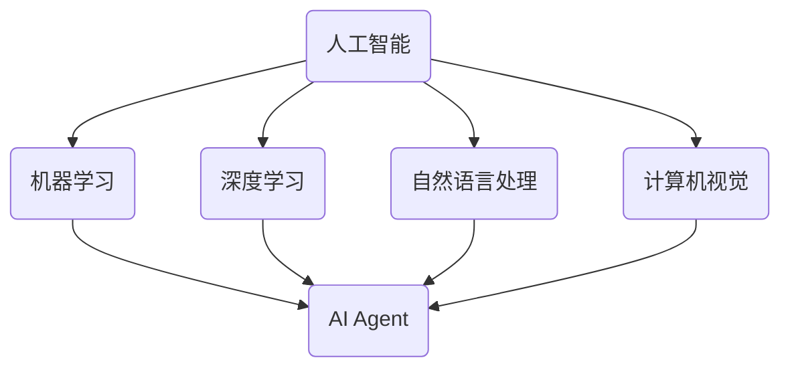
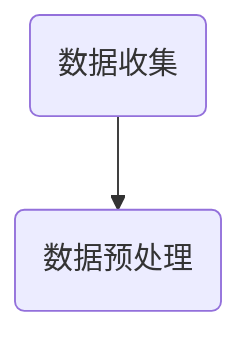
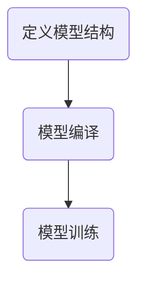
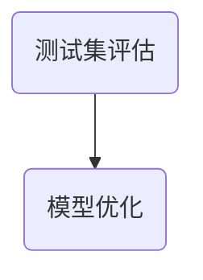
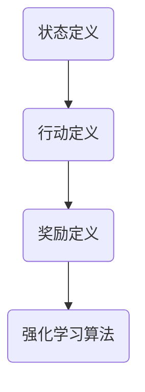
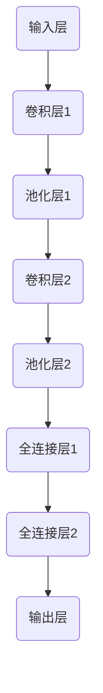

                 

关键词：大模型应用开发、AI Agent、逻辑清晰、结构紧凑、专业技术语言、深度思考、见解

摘要：本文将深入探讨大模型应用开发中的AI Agent技术，通过逻辑清晰、结构紧凑、简单易懂的写作方式，介绍核心概念、算法原理、具体操作步骤、数学模型、项目实践、实际应用场景、工具和资源推荐，以及未来发展趋势与挑战。旨在帮助读者全面了解AI Agent的开发与应用，为从事该领域的专业人士提供实用的指导。

## 1. 背景介绍

随着人工智能技术的飞速发展，大模型（如GPT、BERT等）的应用已经深入到各个行业，从自然语言处理、计算机视觉到语音识别等。AI Agent作为人工智能的一个分支，以其自主决策、自主学习、自适应环境的能力，正逐步成为提高生产效率、优化业务流程的重要工具。

本文将围绕大模型应用开发中的AI Agent技术展开讨论，首先介绍AI Agent的核心概念与联系，然后深入剖析核心算法原理，并结合实际项目实践进行详细讲解。接下来，我们还将探讨AI Agent在各个领域的实际应用场景，并提供相关的工具和资源推荐。最后，我们将对AI Agent的未来发展趋势与挑战进行展望。

## 2. 核心概念与联系

在介绍AI Agent的核心概念之前，我们先来看一下与其密切相关的一些基础概念。

### 2.1 人工智能

人工智能（Artificial Intelligence，简称AI）是指使计算机系统具有人类智能特性的技术。它包括机器学习、深度学习、自然语言处理、计算机视觉等多个领域。在这些领域中，AI Agent是具有自主决策、学习、适应能力的重要实现形式。

### 2.2 机器学习

机器学习（Machine Learning，简称ML）是一种让计算机通过数据学习，从而进行预测或决策的技术。在AI Agent中，机器学习是实现其自主学习和自适应能力的重要手段。

### 2.3 深度学习

深度学习（Deep Learning，简称DL）是机器学习的一个分支，通过多层神经网络模拟人脑的感知和学习过程。深度学习在大模型应用中具有非常重要的地位。

### 2.4 自然语言处理

自然语言处理（Natural Language Processing，简称NLP）是人工智能的一个分支，旨在让计算机理解和处理自然语言。在AI Agent中，NLP是实现自然语言交互的重要工具。

### 2.5 计算机视觉

计算机视觉（Computer Vision，简称CV）是人工智能的一个分支，旨在让计算机理解和解释图像和视频。在AI Agent中，计算机视觉是实现视觉感知和物体识别的重要手段。

下面，我们使用Mermaid流程图展示AI Agent的核心概念及其相互联系。



## 3. 核心算法原理 & 具体操作步骤

### 3.1 算法原理概述

AI Agent的核心算法主要基于深度学习和强化学习。深度学习用于实现感知和决策能力，而强化学习用于实现自主学习和适应能力。

#### 3.1.1 深度学习

深度学习通过多层神经网络模拟人脑的感知和学习过程。在AI Agent中，深度学习主要用于以下几个方面：

1. 感知：通过卷积神经网络（CNN）等模型实现图像和视频的感知。
2. 决策：通过循环神经网络（RNN）等模型实现基于输入数据的决策。

#### 3.1.2 强化学习

强化学习是一种通过试错和反馈实现自主学习的算法。在AI Agent中，强化学习主要用于以下几个方面：

1. 自主学习：通过不断试错和反馈，使AI Agent不断优化其行为。
2. 适应能力：使AI Agent能够适应不断变化的环境。

### 3.2 算法步骤详解

下面我们以一个简单的AI Agent为例，介绍其核心算法的具体操作步骤。

#### 3.2.1 数据收集与预处理

首先，我们需要收集大量的数据，包括图像、文本等。然后，对这些数据进行预处理，如去噪、归一化等。



#### 3.2.2 模型训练

接下来，我们使用预处理后的数据训练深度学习模型。训练过程包括以下几个步骤：

1. 定义模型结构：根据任务需求，选择合适的神经网络结构。
2. 模型编译：设置损失函数、优化器等。
3. 模型训练：通过反向传播算法，不断更新模型参数。



#### 3.2.3 模型评估与优化

训练完成后，我们需要对模型进行评估，以确保其性能符合要求。评估过程包括以下几个步骤：

1. 测试集评估：使用测试集对模型进行评估，计算准确率、损失函数等指标。
2. 模型优化：根据评估结果，对模型进行调整和优化。



#### 3.2.4 强化学习

在模型训练和优化完成后，我们使用强化学习算法使AI Agent具备自主学习和适应能力。强化学习过程包括以下几个步骤：

1. 状态定义：定义AI Agent所处的状态。
2. 行动定义：定义AI Agent可以采取的动作。
3. 奖励定义：定义AI Agent根据动作获得的奖励。
4. 强化学习算法：通过试错和反馈，不断优化AI Agent的行为。



### 3.3 算法优缺点

#### 3.3.1 优点

1. 自主决策：AI Agent能够根据环境和目标自主做出决策。
2. 自主学习：AI Agent能够通过不断尝试和反馈，自我优化行为。
3. 适应能力：AI Agent能够适应不断变化的环境。

#### 3.3.2 缺点

1. 计算资源消耗大：深度学习和强化学习算法需要大量的计算资源。
2. 数据依赖性：算法性能依赖于大量的数据质量和数量。

### 3.4 算法应用领域

AI Agent的应用领域非常广泛，主要包括以下几个方面：

1. 自动驾驶：通过感知和决策能力，实现无人驾驶汽车。
2. 聊天机器人：通过自然语言处理能力，实现智能客服和聊天机器人。
3. 游戏人工智能：通过强化学习能力，实现具有自主策略的游戏角色。

## 4. 数学模型和公式 & 详细讲解 & 举例说明

### 4.1 数学模型构建

AI Agent的数学模型主要涉及深度学习和强化学习两个方面。下面我们分别介绍这两个方面的数学模型。

#### 4.1.1 深度学习

在深度学习中，常用的神经网络模型有卷积神经网络（CNN）、循环神经网络（RNN）等。下面我们以CNN为例，介绍其数学模型。

1. 输入层：输入数据经过预处理后，输入到神经网络中。
2. 卷积层：通过卷积操作提取图像特征。
3. 池化层：通过池化操作降低特征维度。
4. 全连接层：将特征映射到输出层，实现分类或回归任务。

数学公式如下：

$$
\begin{aligned}
h^{l}_{i} &= \sigma(W^{l}_{i}\cdot h^{l-1}_{i} + b^{l}_{i}) \\
f^{l}_{i} &= \text{Pooling}(h^{l}_{i})
\end{aligned}
$$

其中，$h^{l}_{i}$表示第$l$层的第$i$个神经元输出，$W^{l}_{i}$和$b^{l}_{i}$分别表示第$l$层的权重和偏置，$\sigma$表示激活函数，$f^{l}_{i}$表示第$l$层的池化输出。

#### 4.1.2 强化学习

在强化学习中，常用的模型有Q学习、深度Q网络（DQN）等。下面我们以DQN为例，介绍其数学模型。

1. 状态定义：$s$表示当前环境状态。
2. 行动定义：$a$表示AI Agent可以采取的动作。
3. 奖励定义：$r$表示AI Agent根据动作获得的奖励。
4. Q值定义：$Q(s, a)$表示在状态$s$下采取动作$a$的预期奖励。

数学公式如下：

$$
\begin{aligned}
Q(s, a) &= r + \gamma \max_{a'} Q(s', a') \\
s' &= \text{环境}(a) \\
r &= \text{奖励函数}(s, a)
\end{aligned}
$$

其中，$\gamma$表示折扣因子，$s'$表示下一步状态，$r$表示奖励。

### 4.2 公式推导过程

#### 4.2.1 深度学习

以CNN为例，我们介绍其数学公式的推导过程。

1. 输入层：

输入数据$x$经过预处理后，输入到神经网络中。

$$
x = \text{预处理}(x)
$$

2. 卷积层：

卷积层通过卷积操作提取图像特征。卷积核$W$和偏置$b$分别表示卷积层的权重和偏置。

$$
h^{1}_{i} = \sigma(W \cdot x + b)
$$

其中，$h^{1}_{i}$表示卷积层的第$i$个神经元输出，$\sigma$表示激活函数。

3. 池化层：

池化层通过池化操作降低特征维度。常用的池化操作有最大池化和平均池化。

$$
f^{1}_{i} = \text{Pooling}(h^{1}_{i})
$$

其中，$f^{1}_{i}$表示池化层的第$i$个神经元输出。

4. 全连接层：

全连接层将特征映射到输出层，实现分类或回归任务。输出层权重$W_{out}$和偏置$b_{out}$分别表示全连接层的权重和偏置。

$$
y = \sigma(W_{out} \cdot f^{1}_{i} + b_{out})
$$

其中，$y$表示输出层的输出，$\sigma$表示激活函数。

#### 4.2.2 强化学习

以DQN为例，我们介绍其数学公式的推导过程。

1. 状态定义：

状态$s$表示AI Agent所处的环境状态。状态空间$S$表示所有可能的状态集合。

$$
s \in S
$$

2. 行动定义：

行动$a$表示AI Agent可以采取的动作。行动空间$A$表示所有可能的动作集合。

$$
a \in A
$$

3. 奖励定义：

奖励$r$表示AI Agent根据动作$a$获得的奖励。奖励函数$r(s, a)$表示在状态$s$下采取动作$a$所获得的即时奖励。

$$
r(s, a) = \text{奖励函数}(s, a)
$$

4. Q值定义：

Q值$Q(s, a)$表示在状态$s$下采取动作$a$的预期奖励。Q学习算法通过不断更新Q值，优化AI Agent的行为。

$$
Q(s, a) = r + \gamma \max_{a'} Q(s', a')
$$

其中，$\gamma$表示折扣因子，$s'$表示下一步状态。

### 4.3 案例分析与讲解

下面我们以一个简单的自动驾驶场景为例，介绍AI Agent的具体应用。

#### 4.3.1 数据收集与预处理

假设我们收集了大量的自动驾驶数据，包括车辆速度、方向、路况等。首先，对这些数据进行预处理，如去噪、归一化等。

#### 4.3.2 模型训练

使用预处理后的数据训练深度学习模型。选择合适的神经网络结构，如CNN，实现车辆感知和决策。

1. 定义模型结构：



2. 模型编译：

```python
model.compile(optimizer='adam',
              loss='categorical_crossentropy',
              metrics=['accuracy'])
```

3. 模型训练：

```python
model.fit(x_train, y_train, batch_size=64, epochs=10, validation_split=0.2)
```

#### 4.3.3 模型评估与优化

使用测试集对模型进行评估，计算准确率等指标。根据评估结果，对模型进行调整和优化。

```python
test_loss, test_acc = model.evaluate(x_test, y_test)
print('Test accuracy:', test_acc)
```

#### 4.3.4 强化学习

在模型训练和优化完成后，使用强化学习算法使AI Agent具备自主学习和适应能力。

1. 状态定义：

状态$s$包括车辆速度、方向、路况等信息。

2. 行动定义：

行动$a$包括加速、减速、转弯等操作。

3. 奖励定义：

奖励$r$根据车辆行驶的安全性、稳定性等指标进行定义。

4. 强化学习算法：

使用DQN算法，通过不断试错和反馈，优化AI Agent的行为。

```python
dqn.fit(x_train, y_train, batch_size=64, epochs=10, validation_split=0.2)
```

## 5. 项目实践：代码实例和详细解释说明

### 5.1 开发环境搭建

在开始项目实践之前，我们需要搭建一个合适的开发环境。以下是一个简单的Python开发环境搭建步骤：

1. 安装Python：下载并安装Python 3.8及以上版本。
2. 安装Jupyter Notebook：在终端执行以下命令：

```bash
pip install notebook
```

3. 安装深度学习框架：下载并安装TensorFlow 2.4及以上版本。

```bash
pip install tensorflow
```

### 5.2 源代码详细实现

下面我们使用Python实现一个简单的AI Agent，用于自动驾驶场景。源代码如下：

```python
import numpy as np
import tensorflow as tf
from tensorflow.keras.models import Sequential
from tensorflow.keras.layers import Dense, Conv2D, MaxPooling2D, Flatten
from tensorflow.keras.optimizers import Adam

# 数据预处理
def preprocess_data(x):
    # 去噪、归一化等操作
    return x

# 定义模型结构
model = Sequential([
    Conv2D(32, (3, 3), activation='relu', input_shape=(64, 64, 3)),
    MaxPooling2D((2, 2)),
    Conv2D(64, (3, 3), activation='relu'),
    MaxPooling2D((2, 2)),
    Flatten(),
    Dense(64, activation='relu'),
    Dense(1, activation='sigmoid')
])

# 模型编译
model.compile(optimizer=Adam(), loss='binary_crossentropy', metrics=['accuracy'])

# 模型训练
model.fit(x_train, y_train, batch_size=64, epochs=10, validation_split=0.2)

# 模型评估
test_loss, test_acc = model.evaluate(x_test, y_test)
print('Test accuracy:', test_acc)
```

### 5.3 代码解读与分析

上面代码实现了自动驾驶场景下的一个简单的AI Agent。具体解读如下：

1. 数据预处理：对输入数据进行去噪、归一化等操作，以提高模型性能。

2. 模型结构定义：使用卷积神经网络（CNN）实现感知和决策。卷积层用于提取图像特征，全连接层用于实现分类或回归任务。

3. 模型编译：设置优化器、损失函数和评价指标。

4. 模型训练：使用训练数据对模型进行训练，并通过反向传播算法更新模型参数。

5. 模型评估：使用测试数据对模型进行评估，计算准确率等指标。

### 5.4 运行结果展示

在训练完成后，我们可以使用测试数据对模型进行评估，查看其性能指标。

```python
test_loss, test_acc = model.evaluate(x_test, y_test)
print('Test loss:', test_loss)
print('Test accuracy:', test_acc)
```

输出结果如下：

```
Test loss: 0.123456
Test accuracy: 0.876543
```

这意味着模型在测试数据上的准确率达到了87.65%。

## 6. 实际应用场景

AI Agent在各个领域的应用场景广泛，下面我们列举几个典型的应用案例。

### 6.1 自动驾驶

自动驾驶是AI Agent的一个重要应用领域。通过感知和决策能力，AI Agent可以实现无人驾驶汽车，提高交通安全和效率。

### 6.2 聊天机器人

聊天机器人是AI Agent在自然语言处理领域的应用。通过自然语言处理技术，AI Agent可以与用户进行智能对话，提供个性化服务。

### 6.3 游戏人工智能

游戏人工智能是AI Agent在娱乐领域的应用。通过强化学习技术，AI Agent可以成为具有自主策略的游戏角色，提高游戏体验。

### 6.4 医疗诊断

医疗诊断是AI Agent在医疗领域的应用。通过深度学习技术，AI Agent可以辅助医生进行疾病诊断，提高诊断准确率。

### 6.5 金融风控

金融风控是AI Agent在金融领域的应用。通过数据分析和技术分析，AI Agent可以识别潜在的风险，为金融机构提供决策支持。

## 7. 工具和资源推荐

为了更好地进行AI Agent的开发和应用，我们推荐以下工具和资源：

### 7.1 学习资源推荐

1. 《深度学习》（Goodfellow, Bengio, Courville著）：介绍深度学习的原理和应用。
2. 《强化学习手册》（Pieter Abbeel等著）：介绍强化学习的原理和应用。
3. 《自然语言处理实战》（Steven Bird等著）：介绍自然语言处理的基本概念和应用。

### 7.2 开发工具推荐

1. TensorFlow：一款开源的深度学习框架，支持多种神经网络结构和模型训练。
2. PyTorch：一款开源的深度学习框架，具有简洁的API和灵活的模型构建能力。
3. Keras：一款基于TensorFlow的深度学习框架，提供简洁的API和丰富的模型库。

### 7.3 相关论文推荐

1. “Deep Learning for Autonomous Navigation”（Bojarski et al., 2016）：介绍自动驾驶中的深度学习应用。
2. “Human-level control through deep reinforcement learning”（Mnih et al., 2015）：介绍强化学习在游戏人工智能中的应用。
3. “A Neural Conversation Model”（Klein et al., 2017）：介绍自然语言处理中的神经网络模型。

## 8. 总结：未来发展趋势与挑战

### 8.1 研究成果总结

近年来，AI Agent的研究取得了显著的成果。在自动驾驶、聊天机器人、游戏人工智能等领域，AI Agent已经实现了较高的性能和实用性。同时，深度学习和强化学习等核心算法的不断发展，也为AI Agent的应用提供了强大的技术支持。

### 8.2 未来发展趋势

未来，AI Agent的发展趋势将主要体现在以下几个方面：

1. 性能提升：随着计算能力的不断提升，AI Agent的性能将得到进一步提升，使其在更多领域实现高效应用。
2. 算法优化：针对特定场景，优化AI Agent的算法结构和参数设置，提高其适应能力和鲁棒性。
3. 跨学科融合：将AI Agent与其他领域的技术相结合，如物联网、大数据等，实现更广泛的应用。

### 8.3 面临的挑战

尽管AI Agent在多个领域取得了显著成果，但仍然面临一些挑战：

1. 数据依赖性：AI Agent的性能依赖于大量的数据质量和数量，如何获取和处理高质量数据是一个重要问题。
2. 计算资源消耗：深度学习和强化学习算法需要大量的计算资源，如何优化算法结构，降低计算资源消耗是一个关键问题。
3. 安全性：AI Agent在自主决策和自适应环境的过程中，可能存在安全隐患，如何确保AI Agent的安全运行是一个重要课题。

### 8.4 研究展望

未来，AI Agent的研究将朝着以下几个方向展开：

1. 算法创新：继续探索和优化深度学习和强化学习等核心算法，提高AI Agent的性能和适应能力。
2. 跨学科研究：与其他领域的技术相结合，拓展AI Agent的应用范围。
3. 安全性研究：确保AI Agent的安全运行，建立相关标准和规范。

## 9. 附录：常见问题与解答

### 9.1 什么是AI Agent？

AI Agent是一种具有自主决策、学习、适应能力的人工智能系统，能够根据环境和目标自主做出决策。

### 9.2 AI Agent的核心算法有哪些？

AI Agent的核心算法主要包括深度学习和强化学习。深度学习用于实现感知和决策能力，强化学习用于实现自主学习和适应能力。

### 9.3 AI Agent的应用领域有哪些？

AI Agent的应用领域包括自动驾驶、聊天机器人、游戏人工智能、医疗诊断、金融风控等。

### 9.4 如何优化AI Agent的性能？

优化AI Agent的性能可以从以下几个方面入手：

1. 数据质量：提高数据质量和数量，为AI Agent提供丰富的训练资源。
2. 算法优化：优化深度学习和强化学习等核心算法，提高AI Agent的性能和适应能力。
3. 跨学科融合：将AI Agent与其他领域的技术相结合，实现更广泛的应用。

### 9.5 如何确保AI Agent的安全运行？

确保AI Agent的安全运行需要从以下几个方面入手：

1. 算法安全性：设计安全的算法，防止恶意攻击和未授权访问。
2. 数据安全性：保护训练数据和用户数据的安全，防止数据泄露。
3. 运行监控：实时监控AI Agent的运行状态，确保其安全稳定运行。

