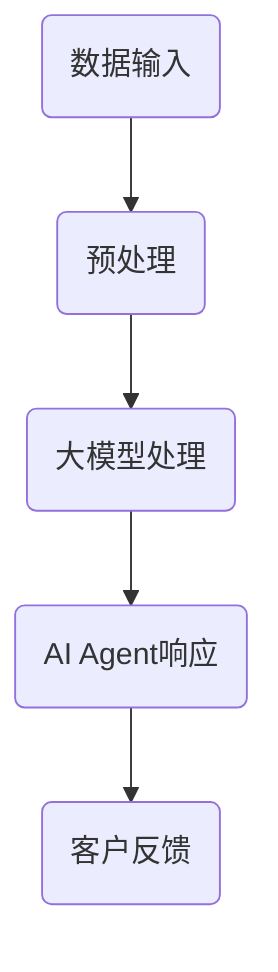

                 

关键词：大模型应用、AI Agent、客户服务、应用开发、技术实现

> 摘要：随着人工智能技术的不断发展，大模型在客户服务领域中的应用日益广泛。本文将探讨大模型应用开发中的关键技术，并介绍如何通过动手实践构建一个AI Agent，以实现客户服务的革命性变革。

## 1. 背景介绍

客户服务是企业与客户之间的重要桥梁，直接关系到企业的品牌形象和客户满意度。然而，传统的客户服务方式往往依赖于人工处理，效率低下且成本高昂。随着人工智能技术的发展，特别是大模型的突破，我们可以利用这些先进的技术手段来提升客户服务的质量和效率。

大模型（Large Models），如GPT-3、BERT等，具有极强的学习和推理能力，能够处理复杂的自然语言任务。通过将大模型应用于客户服务，可以实现智能对话、情感识别、问题诊断等功能，从而提升客户体验和满意度。

## 2. 核心概念与联系

### 2.1 大模型的原理

大模型是基于深度学习的自然语言处理技术，其核心思想是通过大量的文本数据训练模型，使其能够理解和生成人类语言。大模型通常由数亿甚至数千亿个参数组成，这些参数通过反向传播算法在大量数据上进行优化，从而使得模型能够准确地预测和生成自然语言。

### 2.2 大模型与AI Agent的联系

AI Agent是一种具有自主决策能力的人工智能系统，能够模拟人类的思维和行为。大模型可以作为AI Agent的核心组成部分，为其提供强大的语言理解和生成能力。通过大模型的训练和优化，AI Agent可以更加智能地处理客户服务中的各种任务。

### 2.3 Mermaid流程图

以下是一个简化的Mermaid流程图，描述了从数据输入到AI Agent生成响应的流程。



## 3. 核心算法原理 & 具体操作步骤

### 3.1 算法原理概述

大模型的算法原理主要包括两个部分：前向传播和反向传播。

- **前向传播**：输入数据经过模型层层处理，最后输出预测结果。
- **反向传播**：通过计算输出误差，反向调整模型参数，以降低误差。

### 3.2 算法步骤详解

1. **数据收集与预处理**：收集大量相关的客户服务对话数据，并进行预处理，如分词、去停用词等。
2. **模型训练**：使用预处理后的数据训练大模型，通过反向传播算法优化模型参数。
3. **模型评估**：使用验证集评估模型性能，调整模型参数。
4. **模型部署**：将训练好的模型部署到服务器，以实现实时客户服务。

### 3.3 算法优缺点

- **优点**：大模型具有强大的语言理解和生成能力，能够处理复杂的客户服务任务。
- **缺点**：训练过程需要大量的计算资源和时间，且对数据质量要求较高。

### 3.4 算法应用领域

大模型在客户服务中的应用非常广泛，包括但不限于以下领域：

- 智能客服机器人
- 情感分析
- 问题诊断
- 个性化推荐

## 4. 数学模型和公式 & 详细讲解 & 举例说明

### 4.1 数学模型构建

大模型的数学基础主要包括神经网络和优化算法。

- **神经网络**：由多层神经元组成，通过前向传播和反向传播进行训练。
- **优化算法**：常用的有梯度下降、Adam等，用于调整模型参数。

### 4.2 公式推导过程

以下是一个简化的神经网络前向传播的公式推导过程：

$$
Z = W \cdot X + b
$$

$$
A = \sigma(Z)
$$

其中，$Z$为加权求和，$W$为权重矩阵，$X$为输入向量，$b$为偏置项，$\sigma$为激活函数。

### 4.3 案例分析与讲解

以一个简单的情感分析任务为例，我们使用BERT模型进行训练和部署。

1. **数据准备**：收集大量带有情感标签的客户服务对话数据。
2. **模型训练**：使用训练数据训练BERT模型。
3. **模型评估**：使用验证数据评估模型性能。
4. **模型部署**：将训练好的模型部署到服务器，以实现实时情感分析。

## 5. 项目实践：代码实例和详细解释说明

### 5.1 开发环境搭建

1. 安装Python环境
2. 安装transformers库
3. 准备数据集

### 5.2 源代码详细实现

以下是一个简单的BERT情感分析模型的实现：

```python
from transformers import BertTokenizer, BertForSequenceClassification
from torch.utils.data import DataLoader
from sklearn.model_selection import train_test_split

# 数据准备
tokenizer = BertTokenizer.from_pretrained('bert-base-chinese')
X = ["这是一个非常棒的客户服务体验！"]
y = [1]

# 数据预处理
X = ["[CLS] " + x + " [SEP]"] for x in X]
input_ids = tokenizer.encode(X, add_special_tokens=True)
labels = [1]

# 模型训练
model = BertForSequenceClassification.from_pretrained('bert-base-chinese', num_labels=2)
model.train()
optimizer = torch.optim.Adam(model.parameters(), lr=1e-5)
for epoch in range(3):
    for batch in DataLoader(input_ids, labels, batch_size=1):
        optimizer.zero_grad()
        outputs = model(input_ids=batch['input_ids'])
        loss = outputs.loss
        loss.backward()
        optimizer.step()

# 模型评估
model.eval()
with torch.no_grad():
    for batch in DataLoader(input_ids, labels, batch_size=1):
        outputs = model(input_ids=batch['input_ids'])
        logits = outputs.logits
        pred = logits.argmax(-1)
        print(pred)

# 模型部署
model.save_pretrained('my_bert_model')
```

### 5.3 代码解读与分析

以上代码首先进行了数据准备和预处理，然后使用BERT模型进行训练和评估，最后将训练好的模型保存到本地。通过这个简单的例子，我们可以看到如何使用大模型实现客户服务的情感分析功能。

## 6. 实际应用场景

大模型在客户服务中的应用场景非常广泛，以下是一些实际的应用案例：

- **智能客服机器人**：通过大模型实现自然语言理解，可以处理大量的客户咨询，提高响应速度和服务质量。
- **情感分析**：通过大模型进行情感分析，可以更好地理解客户的情绪和需求，提供更加个性化的服务。
- **问题诊断**：通过大模型进行问题诊断，可以快速识别客户问题的根本原因，提供有效的解决方案。

## 7. 工具和资源推荐

### 7.1 学习资源推荐

- 《深度学习》（Goodfellow, Bengio, Courville）- 提供深度学习的全面介绍。
- 《自然语言处理综论》（Jurafsky, Martin）- 涵盖自然语言处理的基本原理和应用。

### 7.2 开发工具推荐

- PyTorch- 用于深度学习开发的流行框架。
- Hugging Face Transformers - 用于预训练模型的开源库。

### 7.3 相关论文推荐

- "Attention Is All You Need" - 提出Transformer架构。
- "BERT: Pre-training of Deep Neural Networks for Language Understanding" - 提出BERT模型。

## 8. 总结：未来发展趋势与挑战

### 8.1 研究成果总结

大模型在客户服务领域的应用取得了显著成果，通过智能对话、情感分析和问题诊断等功能，提升了客户服务的质量和效率。

### 8.2 未来发展趋势

- **模型效率提升**：通过优化算法和模型结构，提高大模型的计算效率，降低部署成本。
- **多模态融合**：结合文本、语音、图像等多模态数据，提供更加丰富的客户服务体验。

### 8.3 面临的挑战

- **数据隐私**：在处理大量客户数据时，如何保护客户隐私是一个重要挑战。
- **模型解释性**：大模型的决策过程往往不够透明，提高模型的解释性是一个重要的研究方向。

### 8.4 研究展望

随着人工智能技术的不断发展，大模型在客户服务领域的应用将更加广泛，我们将看到更加智能、个性化的客户服务体验。

## 9. 附录：常见问题与解答

### 9.1 大模型如何训练？

大模型通常使用大量数据进行训练。在训练过程中，通过反向传播算法不断调整模型参数，以降低预测误差。

### 9.2 BERT模型如何使用？

BERT模型是一个预训练模型，可以直接用于各种自然语言处理任务。使用时，只需加载模型并输入文本即可得到模型的预测结果。

### 9.3 客户服务中的AI Agent如何部署？

客户服务中的AI Agent可以通过将训练好的模型部署到服务器来实现。常用的部署方式包括使用容器（如Docker）和云服务（如AWS、Azure等）。

---

**作者：禅与计算机程序设计艺术 / Zen and the Art of Computer Programming**。希望本文能够帮助您更好地理解大模型在客户服务领域的应用，并激发您在AI领域的探索和创造。

