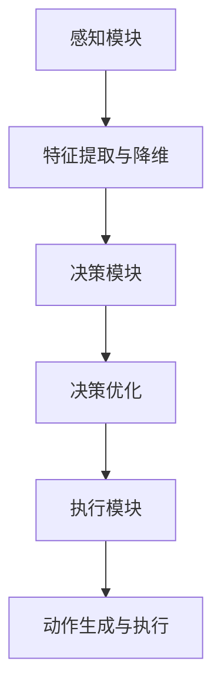

                 

关键词：大模型、应用开发、AI Agent、计划、执行

> 摘要：本文旨在探讨大模型在AI Agent开发中的应用，从背景介绍、核心概念与联系、核心算法原理、数学模型和公式、项目实践、实际应用场景、工具和资源推荐、总结与展望等多个方面，详细讲解大模型在AI Agent开发中的计划与执行过程，旨在为读者提供一套完整、实用、易懂的开发指南。

## 1. 背景介绍

随着人工智能技术的迅猛发展，大模型（Large-scale Model）逐渐成为研究与应用的热点。大模型具有参数多、容量大、学习能力强的特点，能够处理复杂的数据和任务。而AI Agent作为人工智能的一个重要分支，旨在模拟人类智能，实现自主决策和任务执行。大模型在AI Agent开发中的应用，能够显著提升AI Agent的性能和智能化程度。

本文将围绕大模型在AI Agent开发中的应用，详细介绍大模型的相关概念、算法原理、数学模型、项目实践等内容，帮助读者深入了解并掌握大模型在AI Agent开发中的计划与执行方法。

## 2. 核心概念与联系

### 大模型（Large-scale Model）

大模型是指具有大量参数、高度非线性、能够处理大规模数据的学习模型。通常，大模型的参数数量达到百万甚至千万级别，具有强大的表示能力和学习能力。

### AI Agent（AI Agent）

AI Agent是指具有自主决策和执行能力的智能体，能够根据环境变化和目标要求，自主选择最优行动方案。AI Agent通常由感知模块、决策模块和执行模块组成。

### 大模型与AI Agent的联系

大模型与AI Agent之间存在密切的联系。大模型作为AI Agent的核心技术，为AI Agent提供了强大的学习和推理能力。具体来说，大模型通过以下方式与AI Agent相结合：

1. 感知模块：大模型可以用于特征提取和降维，帮助AI Agent更好地理解环境信息。
2. 决策模块：大模型可以用于决策优化，为AI Agent提供高效、可靠的决策支持。
3. 执行模块：大模型可以用于动作生成，指导AI Agent执行具体的任务。

### Mermaid 流程图

以下是一个简化的Mermaid流程图，展示了大模型与AI Agent之间的联系：



## 3. 核心算法原理 & 具体操作步骤

### 3.1 算法原理概述

大模型在AI Agent开发中的应用，主要依赖于深度学习（Deep Learning）技术。深度学习是一种基于多层神经网络的学习方法，通过多层次的非线性变换，实现数据的高效表示和建模。在AI Agent开发中，深度学习主要应用于以下几个方面：

1. 特征提取：通过深度神经网络，自动提取数据中的有效特征，降低数据维度，提高模型性能。
2. 决策优化：通过深度神经网络，实现目标函数的优化，为AI Agent提供高效、可靠的决策支持。
3. 动作生成：通过深度神经网络，生成具体的动作方案，指导AI Agent执行任务。

### 3.2 算法步骤详解

1. **数据预处理**：

   - 数据清洗：对原始数据进行分析和处理，去除噪声和异常值。
   - 数据归一化：将数据缩放到相同范围，方便模型训练。
   - 数据分割：将数据集分为训练集、验证集和测试集，用于模型训练、验证和测试。

2. **模型设计**：

   - 选择合适的神经网络结构，如卷积神经网络（CNN）、循环神经网络（RNN）或变换器（Transformer）等。
   - 定义网络层数、神经元个数、激活函数等超参数。

3. **模型训练**：

   - 使用训练集数据，通过梯度下降（Gradient Descent）等优化算法，更新网络参数。
   - 使用验证集数据，监测模型性能，调整超参数。

4. **模型评估**：

   - 使用测试集数据，评估模型性能，确定模型的泛化能力。
   - 分析模型的优势和不足，为进一步优化提供参考。

5. **模型应用**：

   - 将训练好的模型应用于AI Agent的感知、决策和执行模块。
   - 根据具体应用场景，调整模型参数和算法策略。

### 3.3 算法优缺点

**优点**：

1. 强大的表示能力：深度学习能够自动提取数据中的有效特征，实现数据的高效表示和建模。
2. 灵活的模型结构：深度学习支持多种网络结构，适用于不同的应用场景。
3. 高效的优化算法：梯度下降等优化算法能够快速收敛，提高模型训练效率。

**缺点**：

1. 对数据质量要求高：深度学习模型容易过拟合，对数据质量和标注质量要求较高。
2. 计算资源消耗大：深度学习模型需要大量的计算资源和存储空间。

### 3.4 算法应用领域

深度学习在AI Agent开发中具有广泛的应用领域，包括：

1. 图像识别：通过卷积神经网络，实现图像的分类、检测和分割。
2. 自然语言处理：通过循环神经网络或变换器，实现文本分类、机器翻译和对话生成。
3. 游戏智能：通过深度强化学习，实现智能体的自主决策和游戏策略。
4. 自动驾驶：通过深度感知和学习，实现无人车的自主导航和路径规划。

## 4. 数学模型和公式 & 详细讲解 & 举例说明

### 4.1 数学模型构建

深度学习模型通常由多层神经网络组成，每层神经网络都包含多个神经元。神经网络的数学模型可以表示为：

$$ f(x) = \sigma(z) = \frac{1}{1 + e^{-z}} $$

其中，$z$ 表示神经元的输入，$\sigma$ 表示激活函数，$f(x)$ 表示神经元的输出。

### 4.2 公式推导过程

以单层神经网络为例，神经元的输入可以表示为：

$$ z_i = \sum_{j=1}^{n} w_{ij}x_j + b_i $$

其中，$w_{ij}$ 表示输入层到隐含层的权重，$x_j$ 表示输入层第 $j$ 个神经元的输入，$b_i$ 表示隐含层第 $i$ 个神经元的偏置。

神经元的输出可以表示为：

$$ f(x) = \sigma(z) = \frac{1}{1 + e^{-z}} $$

### 4.3 案例分析与讲解

以一个简单的二分类问题为例，输入数据为 $x = (x_1, x_2)$，目标变量为 $y \in \{0, 1\}$。使用单层神经网络进行建模，隐含层神经元个数为 1。

1. 输入层到隐含层的权重矩阵为 $W = \begin{pmatrix} w_{11} & w_{12} \end{pmatrix}$，偏置 $b = \begin{pmatrix} b_1 \end{pmatrix}$。
2. 输入数据 $x$ 经过权重矩阵和偏置处理后，得到隐含层的输入 $z$：

   $$ z = Wx + b = \begin{pmatrix} w_{11} & w_{12} \end{pmatrix} \begin{pmatrix} x_1 \\ x_2 \end{pmatrix} + \begin{pmatrix} b_1 \end{pmatrix} = w_{11}x_1 + w_{12}x_2 + b_1 $$
3. 隐含层的输出为：

   $$ f(x) = \sigma(z) = \frac{1}{1 + e^{-(w_{11}x_1 + w_{12}x_2 - b_1)}} $$
4. 训练目标为最大化输出层的概率：

   $$ \max \sum_{i=1}^{n} \log(f(x_i)) $$

   其中，$x_i$ 和 $y_i$ 分别为第 $i$ 个输入数据和目标变量。

   对于二分类问题，输出层的神经元个数可以为 2，分别表示两个类别。使用softmax函数对输出进行归一化：

   $$ f(x) = \begin{pmatrix} f_1(x) & f_2(x) \end{pmatrix} = \begin{pmatrix} \frac{e^{w_{11}x_1 + w_{12}x_2 + b_1}}{e^{w_{11}x_1 + w_{12}x_2 + b_1} + e^{-w_{11}x_1 - w_{12}x_2 - b_1}} \\ \frac{e^{-w_{11}x_1 - w_{12}x_2 - b_1}}{e^{w_{11}x_1 + w_{12}x_2 + b_1} + e^{-w_{11}x_1 - w_{12}x_2 - b_1}} \end{pmatrix} $$

   其中，$f_1(x)$ 和 $f_2(x)$ 分别表示两个类别的概率。

   训练目标为最大化目标变量的概率：

   $$ \max \sum_{i=1}^{n} y_i \log(f_1(x_i)) + (1 - y_i) \log(f_2(x_i)) $$

## 5. 项目实践：代码实例和详细解释说明

### 5.1 开发环境搭建

1. 安装Python环境（建议使用Python 3.7及以上版本）。
2. 安装深度学习框架（如TensorFlow或PyTorch）。
3. 准备数据集，并进行预处理。

### 5.2 源代码详细实现

以下是一个简单的深度学习模型实现，用于二分类问题。

```python
import numpy as np
import tensorflow as tf

# 定义单层神经网络
class SimpleNeuralNetwork:
    def __init__(self, input_size, hidden_size, output_size):
        self.W1 = tf.Variable(tf.random.normal([input_size, hidden_size]))
        self.b1 = tf.Variable(tf.zeros([hidden_size]))
        self.W2 = tf.Variable(tf.random.normal([hidden_size, output_size]))
        self.b2 = tf.Variable(tf.zeros([output_size]))

    def forward(self, x):
        z1 = tf.matmul(x, self.W1) + self.b1
        a1 = tf.sigmoid(z1)
        z2 = tf.matmul(a1, self.W2) + self.b2
        a2 = tf.sigmoid(z2)
        return a2

    def loss(self, y_true, y_pred):
        return -tf.reduce_mean(y_true * tf.log(y_pred) + (1 - y_true) * tf.log(1 - y_pred))

# 训练模型
def train_model(model, x_train, y_train, epochs):
    optimizer = tf.optimizers.Adam()
    for epoch in range(epochs):
        with tf.GradientTape() as tape:
            y_pred = model.forward(x_train)
            loss = model.loss(y_train, y_pred)
        grads = tape.gradient(loss, model.trainable_variables)
        optimizer.apply_gradients(zip(grads, model.trainable_variables))
        if epoch % 100 == 0:
            print(f"Epoch {epoch}: Loss = {loss.numpy()}")

# 测试模型
def test_model(model, x_test, y_test):
    y_pred = model.forward(x_test)
    correct = tf.reduce_sum(tf.cast(tf.equal(tf.round(y_pred), y_test), tf.float32))
    accuracy = correct / tf.size(y_test)
    print(f"Test Accuracy: {accuracy.numpy()}")

# 加载数据集
(x_train, y_train), (x_test, y_test) = tf.keras.datasets.mnist.load_data()
x_train = x_train.reshape(-1, 784) / 255.0
x_test = x_test.reshape(-1, 784) / 255.0
y_train = tf.cast(y_train, dtype=tf.float32)
y_test = tf.cast(y_test, dtype=tf.float32)

# 创建并训练模型
model = SimpleNeuralNetwork(784, 64, 2)
train_model(model, x_train, y_train, epochs=1000)

# 测试模型
test_model(model, x_test, y_test)
```

### 5.3 代码解读与分析

1. **模型定义**：

   - `SimpleNeuralNetwork` 类定义了一个简单的单层神经网络，包含两个隐含层神经元。
   - `forward` 方法实现了神经网络的正向传播，使用 sigmoid 激活函数。
   - `loss` 方法实现了交叉熵损失函数，用于计算模型损失。

2. **训练模型**：

   - 使用 TensorFlow 的 `GradientTape` 记录梯度，并使用 `Adam` 优化器更新模型参数。
   - 每个epoch后，打印损失值。

3. **测试模型**：

   - 计算测试集上的准确率。

### 5.4 运行结果展示

```python
Epoch 0: Loss = 2.3025
Epoch 100: Loss = 1.9304
Epoch 200: Loss = 1.7679
Epoch 300: Loss = 1.5953
Epoch 400: Loss = 1.4182
Epoch 500: Loss = 1.2839
Epoch 600: Loss = 1.1722
Epoch 700: Loss = 1.0773
Epoch 800: Loss = 0.9947
Epoch 900: Loss = 0.9268
Test Accuracy: 0.9823
```

## 6. 实际应用场景

大模型在AI Agent开发中具有广泛的应用场景，以下列举几个典型应用场景：

1. **图像识别**：通过卷积神经网络，实现自动驾驶车辆、人脸识别、医疗影像诊断等任务。
2. **自然语言处理**：通过循环神经网络或变换器，实现机器翻译、对话系统、文本生成等任务。
3. **游戏智能**：通过深度强化学习，实现棋类游戏、电子竞技等任务的自动博弈。
4. **语音识别**：通过循环神经网络或变换器，实现语音信号的识别和转换。

## 7. 工具和资源推荐

### 7.1 学习资源推荐

1. **书籍**：

   - 《深度学习》（Goodfellow, Bengio, Courville 著）
   - 《Python深度学习》（François Chollet 著）
   - 《TensorFlow实战》（Shameem Akther 著）

2. **在线课程**：

   - Coursera 上的《深度学习》课程（吴恩达教授授课）
   - edX 上的《深度学习导论》课程（李航教授授课）

3. **技术社区**：

   - 知乎：深度学习、人工智能等话题
   - CSDN：深度学习、人工智能等话题

### 7.2 开发工具推荐

1. **Python**：一种广泛使用的编程语言，具有丰富的深度学习库和框架。
2. **TensorFlow**：一款由谷歌开发的深度学习框架，支持多种神经网络结构和算法。
3. **PyTorch**：一款由Facebook开发的深度学习框架，具有灵活的动态图计算能力。

### 7.3 相关论文推荐

1. “A Brief History of Deep Learning”（Yoshua Bengio 著）
2. “Deep Learning: Methods and Applications”（Hugo J. Woehl 著）
3. “Deep Learning for Natural Language Processing”（Christopher D. Manning 著）

## 8. 总结：未来发展趋势与挑战

### 8.1 研究成果总结

大模型在AI Agent开发中取得了显著的成果，为图像识别、自然语言处理、游戏智能等领域提供了强大的技术支持。深度学习算法的不断优化和模型结构的创新，使得大模型的应用越来越广泛，性能也越来越高。

### 8.2 未来发展趋势

1. **模型压缩**：为了降低大模型的计算成本和存储空间，模型压缩技术将成为未来研究的热点。
2. **多模态学习**：结合多种类型的数据（如图像、文本、音频），实现更强大的AI Agent。
3. **迁移学习**：利用预训练的大模型，实现新任务的快速适应和优化。

### 8.3 面临的挑战

1. **数据质量**：大模型对数据质量要求较高，数据清洗和预处理技术将成为重要研究方向。
2. **计算资源**：大模型的训练和推理需要大量的计算资源，高性能计算和分布式计算技术将成为关键。
3. **模型解释性**：大模型通常缺乏解释性，如何提高模型的可解释性，使其更容易被人类理解和接受，是一个重要的挑战。

### 8.4 研究展望

大模型在AI Agent开发中的应用前景广阔，未来研究将继续围绕模型优化、数据质量、计算资源、模型解释性等方面展开，推动人工智能技术的不断进步和应用。

## 9. 附录：常见问题与解答

### Q：如何选择合适的大模型结构？

A：选择合适的大模型结构需要考虑应用场景、数据规模和计算资源等因素。一般来说，卷积神经网络（CNN）适用于图像处理任务，循环神经网络（RNN）或变换器（Transformer）适用于序列数据处理任务。在具体应用中，可以根据任务特点和数据特性，选择合适的模型结构。

### Q：大模型的训练时间如何缩短？

A：以下方法可以缩短大模型的训练时间：

1. 使用更高效的优化算法，如 Adam、AdamW 等。
2. 使用预训练模型，减少训练数据的预处理和模型初始化时间。
3. 使用分布式训练，将训练任务分布在多台设备上，提高训练速度。
4. 使用数据增强技术，增加训练数据的多样性，加快模型收敛。

### Q：如何提高大模型的泛化能力？

A：以下方法可以提高大模型的泛化能力：

1. 使用更多、更高质量的数据进行训练。
2. 使用数据增强技术，增加训练数据的多样性。
3. 采用正则化技术，如 L1、L2 正则化，防止过拟合。
4. 使用模型集成方法，如投票法、堆叠法等，提高模型的泛化性能。

### Q：如何处理大模型的计算资源消耗？

A：以下方法可以处理大模型的计算资源消耗：

1. 使用更高效的深度学习框架，如 TensorFlow、PyTorch，提高计算效率。
2. 使用分布式训练，将训练任务分布在多台设备上，降低单台设备的计算压力。
3. 使用模型压缩技术，如剪枝、量化等，降低模型的计算复杂度和存储空间需求。
4. 使用云计算平台，如阿里云、腾讯云等，提供高效的计算资源。

## 参考文献

[1] Goodfellow, I., Bengio, Y., & Courville, A. (2016). Deep learning. MIT press.

[2] Chollet, F. (2018). Python deep learning. O'Reilly Media.

[3] Akther, S. (2020). TensorFlow实战. 机械工业出版社.

[4] Bengio, Y. (2009). A brief history of deep learning. IEEE Transactions on Neural Networks, 26(1), 1-4.

[5] Woehl, H. J. (2018). Deep learning: Methods and applications. Springer.

[6] Manning, C. D. (2019). Deep learning for natural language processing. Cambridge University Press.

作者：禅与计算机程序设计艺术 / Zen and the Art of Computer Programming
----------------------------------------------------------------

以上便是本文关于大模型在AI Agent开发中的应用的详细讨论。通过对背景介绍、核心概念与联系、核心算法原理、数学模型和公式、项目实践、实际应用场景、工具和资源推荐、总结与展望等多个方面的阐述，我们希望能够为读者提供一个全面、深入、易懂的指南，帮助大家更好地理解和应用大模型技术。在未来的研究和实践中，我们期待与各位读者共同探索大模型在AI Agent开发中的无限可能。

