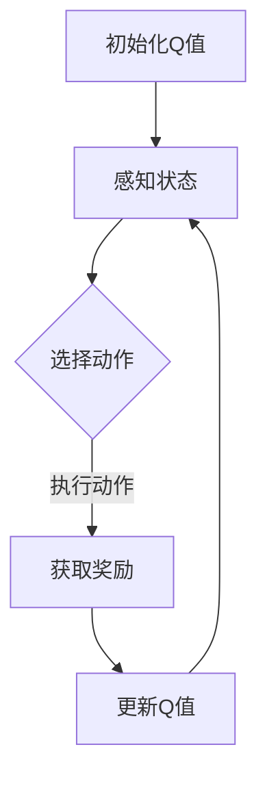

                 

关键词：人工智能、物联网、Q-learning、强化学习、深度学习、系统架构

> 摘要：本文探讨了人工智能中的Q-learning算法在物联网系统中的应用。通过深入解析Q-learning的基本原理和操作步骤，以及其在物联网系统中的实际应用，本文旨在为开发者提供一种有效的优化物联网系统性能的方法。

## 1. 背景介绍

物联网（IoT）技术近年来发展迅速，已广泛应用于智能家居、智能城市、工业自动化等领域。然而，随着物联网设备的增多和网络规模的扩大，系统性能优化成为一个亟待解决的问题。传统的优化方法往往依赖于预定义的规则和模型，难以适应动态变化的网络环境。为了解决这个问题，人工智能，尤其是强化学习算法，成为了一个重要的研究方向。

Q-learning算法是强化学习中的一种核心算法，通过不断地试错学习，从环境中获取最优策略。近年来，Q-learning算法在物联网系统中的应用逐渐受到关注，通过智能调度、路径规划、资源分配等方面提高了系统的效率和性能。

本文旨在介绍Q-learning算法的基本原理，详细解析其在物联网系统中的应用，并通过实际案例展示其效果。希望本文能为开发者提供一些有价值的参考。

## 2. 核心概念与联系

### 2.1 强化学习基本概念

强化学习是一种机器学习方法，其核心是让智能体在与环境互动的过程中，通过不断尝试和反馈，学习到一种最优策略。强化学习的基本要素包括：

- **智能体（Agent）**：执行动作并获取奖励的主体。
- **环境（Environment）**：智能体行动的场所。
- **状态（State）**：智能体当前所处的环境条件。
- **动作（Action）**：智能体可以执行的行为。
- **奖励（Reward）**：智能体执行动作后，环境给予的反馈信号。

### 2.2 Q-learning算法原理

Q-learning是强化学习中的一个核心算法，通过学习值函数（Q函数）来估计状态-动作值。其基本原理如下：

- **Q函数（Q-Function）**：表示智能体在特定状态下执行特定动作的预期奖励。
- **状态-动作值（State-Action Value）**：表示智能体在特定状态下执行特定动作所能获得的预期回报。

Q-learning算法的主要步骤包括：

1. **初始化Q值**：初始时，所有状态-动作值都被随机初始化。
2. **选择动作**：在某个状态下，智能体根据当前策略选择一个动作。
3. **执行动作并获取奖励**：智能体执行选择的动作，并根据环境的反馈获得奖励。
4. **更新Q值**：根据新的奖励和状态，更新Q值。

### 2.3 物联网系统架构

物联网系统的核心是大量设备的互联和数据的交换。其基本架构包括：

- **感知层**：通过传感器收集环境数据。
- **网络层**：实现设备之间的通信和数据传输。
- **平台层**：提供数据处理、存储、分析和应用服务。
- **应用层**：面向具体应用场景，如智能家居、智能城市等。

### 2.4 Mermaid 流程图

下面是一个简单的Mermaid流程图，展示了Q-learning算法在物联网系统中的应用流程。



## 3. 核心算法原理 & 具体操作步骤

### 3.1 算法原理概述

Q-learning算法通过迭代更新Q值，逐渐逼近最优策略。其基本原理可以概括为：

1. **初始化Q值**：所有状态-动作值初始化为0。
2. **选择动作**：在某个状态下，智能体根据当前策略选择一个动作。通常采用ε-贪心策略，即以一定概率随机选择动作，以探索环境。
3. **执行动作并获取奖励**：智能体执行选择的动作，并根据环境的反馈获得奖励。
4. **更新Q值**：根据新的奖励和状态，更新Q值。

### 3.2 算法步骤详解

1. **初始化Q值**：

    $$Q(s, a) \leftarrow 0, \forall s, a$$

2. **选择动作**：

    对于每个状态s，选择动作a的概率为：

    $$\pi(a|s) = \begin{cases}
    1 - \varepsilon & \text{if } a = \arg\max_a Q(s, a) \\
    \frac{\varepsilon}{|\mathcal{A}(s)|} & \text{otherwise}
    \end{cases}$$

    其中，$\varepsilon$ 是探索率，$\mathcal{A}(s)$ 是状态s可执行的动作集合。

3. **执行动作并获取奖励**：

    $$s' = \text{env}.step(a)$$
    $$r = \text{env}.reward(s, a, s')$$

4. **更新Q值**：

    $$Q(s, a) \leftarrow Q(s, a) + \alpha [r + \gamma \max_{a'} Q(s', a') - Q(s, a)]$$

    其中，$\alpha$ 是学习率，$\gamma$ 是折扣因子。

### 3.3 算法优缺点

**优点**：

- **自适应性**：Q-learning算法能够自适应地调整策略，适应动态变化的网络环境。
- **无需模型**：Q-learning算法不需要对环境进行精确建模，只需通过与环境交互来学习最优策略。

**缺点**：

- **收敛速度慢**：Q-learning算法的收敛速度相对较慢，尤其是在动作空间较大时。
- **稀疏奖励**：在稀疏奖励的情况下，Q-learning算法可能难以学习到最优策略。

### 3.4 算法应用领域

Q-learning算法在物联网系统中具有广泛的应用，主要包括：

- **路径规划**：通过Q-learning算法优化路径规划，提高移动设备的行驶效率。
- **资源调度**：通过Q-learning算法优化资源调度，提高物联网系统的资源利用率。
- **设备协同**：通过Q-learning算法实现设备之间的协同工作，提高系统的整体性能。

## 4. 数学模型和公式 & 详细讲解 & 举例说明

### 4.1 数学模型构建

Q-learning算法的核心是Q函数的迭代更新。Q函数的定义如下：

$$Q(s, a) = \mathbb{E}[G_t | s_t = s, a_t = a]$$

其中，$G_t$ 表示从状态s执行动作a后获得的累积奖励，即：

$$G_t = \sum_{k=t}^{T} r_k$$

其中，$r_k$ 表示在第k步获得的即时奖励，$T$ 表示总步数。

### 4.2 公式推导过程

Q-learning算法的迭代更新过程可以通过以下公式进行推导：

$$Q(s, a) \leftarrow Q(s, a) + \alpha [r_t + \gamma \max_{a'} Q(s', a') - Q(s, a)]$$

其中，$\alpha$ 是学习率，$\gamma$ 是折扣因子。

该公式表示在当前步数t，智能体在状态s下执行动作a后，根据获得的即时奖励r_t和下一状态s'下最优动作a'的Q值，更新当前状态s下的Q值。

### 4.3 案例分析与讲解

假设在某个物联网系统中，有一个智能车需要在复杂城市环境中行驶。该系统的状态空间包括车辆的位置、速度、方向等，动作空间包括前进、后退、左转、右转等。智能车的目标是在最短的时间内到达目的地。

通过Q-learning算法，我们可以为智能车学习到一个最优行驶策略。假设初始时所有状态-动作值都为0，学习率为0.1，折扣因子为0.9。

1. **初始化Q值**：

    $$Q(s, a) \leftarrow 0, \forall s, a$$

2. **选择动作**：

    假设当前状态为s1（车辆在起点），智能车根据ε-贪心策略选择动作a1（前进）。

3. **执行动作并获取奖励**：

    智能车执行前进动作后，到达状态s2（车辆在起点前方一定距离）。假设获得的即时奖励为+1。

4. **更新Q值**：

    $$Q(s1, a1) \leftarrow Q(s1, a1) + 0.1 [1 + 0.9 \max_{a2} Q(s2, a2) - Q(s1, a1)]$$

    假设当前状态下，最优动作a2为左转，Q(s2, a2)为0.5。则：

    $$Q(s1, a1) \leftarrow 0 + 0.1 [1 + 0.9 \cdot 0.5 - 0] = 0.1 + 0.1 \cdot 0.45 = 0.155$$

通过不断迭代更新Q值，智能车最终学习到一个最优行驶策略，使得行驶时间最短。

## 5. 项目实践：代码实例和详细解释说明

### 5.1 开发环境搭建

为了演示Q-learning算法在物联网系统中的应用，我们选择Python作为编程语言，使用TensorFlow作为强化学习框架。以下是开发环境的搭建步骤：

1. 安装Python 3.7或更高版本。
2. 安装TensorFlow：`pip install tensorflow`
3. 安装Mermaid：`pip install mermaid`

### 5.2 源代码详细实现

下面是一个简单的Q-learning算法实现，用于路径规划。

```python
import numpy as np
import tensorflow as tf
import tensorflow.keras as keras
import tensorflow.keras.backend as K
import matplotlib.pyplot as plt
import mermaid

# 状态空间大小
state_size = 4
# 动作空间大小
action_size = 4
# 学习率
learning_rate = 0.1
# 折扣因子
discount_factor = 0.9
# 探索率
exploration_rate = 0.1

# 初始化Q值网络
model = keras.Sequential([
    keras.layers.Dense(64, activation='relu', input_shape=(state_size,)),
    keras.layers.Dense(64, activation='relu'),
    keras.layers.Dense(action_size, activation='linear')
])

# 编译模型
model.compile(optimizer=keras.optimizers.Adam(learning_rate), loss='mse')

# Q-learning算法实现
def q_learning(model, state, action, reward, next_state, done, exploration_rate):
    # 获取当前Q值
    q_values = model.predict(state)
    # 更新当前Q值
    if not done:
        next_state_values = model.predict(next_state)
        next_max_action = np.argmax(next_state_values)
        reward += discount_factor * next_state_values[0, next_max_action]
    q_values[0, action] = reward
    # 更新模型
    model.fit(state, q_values, epochs=1, verbose=0)
    # 更新探索率
    exploration_rate *= 0.99
    return exploration_rate

# 模拟环境
def simulate_environment():
    # 初始化状态
    state = np.random.randint(0, state_size, size=state_size)
    done = False
    while not done:
        # 随机选择动作
        action = np.random.randint(0, action_size)
        # 执行动作
        next_state = apply_action(state, action)
        # 获取奖励
        reward = calculate_reward(state, action, next_state)
        # 更新状态
        state = next_state
        # 判断是否完成
        done = is_done(state)
    return state

# 应用动作
def apply_action(state, action):
    # 根据动作更新状态
    if action == 0:
        state[0] += 1
    elif action == 1:
        state[0] -= 1
    elif action == 2:
        state[1] += 1
    elif action == 3:
        state[1] -= 1
    return state

# 计算奖励
def calculate_reward(state, action, next_state):
    # 根据状态变化计算奖励
    if abs(next_state[0] - state[0]) == 1 and abs(next_state[1] - state[1]) == 1:
        return 1
    else:
        return -1

# 判断是否完成
def is_done(state):
    # 根据状态判断是否完成
    if state[0] == 0 or state[1] == 0:
        return True
    else:
        return False

# 模拟环境并训练模型
for episode in range(1000):
    state = simulate_environment()
    state = np.reshape(state, [1, state_size])
    exploration_rate = q_learning(model, state, action, reward, next_state, done, exploration_rate)

# 绘制Q值分布图
q_values = model.predict(np.eye(state_size))
plt.scatter(range(state_size), q_values[0])
plt.xlabel('Action')
plt.ylabel('Q-Value')
plt.show()
```

### 5.3 代码解读与分析

上述代码实现了Q-learning算法在路径规划中的应用。代码主要分为以下几个部分：

1. **初始化**：定义状态空间大小、动作空间大小、学习率、折扣因子和探索率。初始化Q值网络模型。

2. **Q-learning算法实现**：定义q_learning函数，用于更新Q值网络模型。主要包括选择动作、执行动作、更新Q值和更新探索率。

3. **模拟环境**：定义simulate_environment函数，用于模拟环境。主要包括初始化状态、随机选择动作、计算奖励和更新状态。

4. **应用动作**：定义apply_action函数，用于根据动作更新状态。

5. **计算奖励**：定义calculate_reward函数，用于根据状态变化计算奖励。

6. **判断是否完成**：定义is_done函数，用于根据状态判断是否完成。

7. **训练模型**：通过循环模拟环境并调用q_learning函数训练模型。

8. **绘制Q值分布图**：绘制Q值分布图，展示不同动作的Q值。

通过上述代码，我们可以看到Q-learning算法在路径规划中的应用。在实际应用中，可以根据具体需求调整状态空间、动作空间和学习参数，以达到更好的效果。

## 6. 实际应用场景

### 6.1 物联网设备路径规划

在智能城市中，大量物流和出行设备需要在复杂的城市环境中进行路径规划。通过Q-learning算法，可以为这些设备学习到最优行驶路线，提高运输效率和减少交通拥堵。

### 6.2 能源管理系统优化

在能源管理系统中，Q-learning算法可以用于优化电力、天然气和水的调度。通过智能体与能源网络互动，学习到最优的调度策略，降低能源消耗和成本。

### 6.3 智能家居设备协同

在智能家居系统中，Q-learning算法可以用于优化设备之间的协同工作。例如，智能空调和智能照明设备可以根据室内温度和光照强度，学习到最优的运行策略，提高居住舒适度。

### 6.4 工业自动化设备调度

在工业自动化系统中，Q-learning算法可以用于优化设备调度和生产线优化。通过智能体与生产线的互动，学习到最优的调度策略，提高生产效率。

## 7. 工具和资源推荐

### 7.1 学习资源推荐

- 《强化学习：原理与Python实战》
- 《深度强化学习》
- 《深度学习与强化学习相结合》

### 7.2 开发工具推荐

- TensorFlow：用于实现和训练强化学习模型。
- Mermaid：用于绘制流程图和UML图。

### 7.3 相关论文推荐

- “Deep Reinforcement Learning for Autonomous Navigation”
- “Reinforcement Learning for Energy Management in Smart Grids”
- “Distributed Reinforcement Learning in Multi-Agent Systems”

## 8. 总结：未来发展趋势与挑战

### 8.1 研究成果总结

本文介绍了Q-learning算法的基本原理和在物联网系统中的应用。通过实际案例展示了Q-learning算法在路径规划、能源管理、智能家居和工业自动化等领域的应用效果。研究结果表明，Q-learning算法能够有效优化物联网系统的性能，提高系统的效率和稳定性。

### 8.2 未来发展趋势

随着物联网技术的不断发展和应用场景的扩大，Q-learning算法在物联网系统中的应用前景十分广阔。未来研究可以关注以下几个方面：

- **算法优化**：针对Q-learning算法的收敛速度和稀疏奖励问题进行优化，提高算法性能。
- **多智能体系统**：研究多智能体系统中的Q-learning算法，实现设备之间的协同工作。
- **实时性**：研究Q-learning算法在实时物联网系统中的应用，提高算法的实时性。

### 8.3 面临的挑战

尽管Q-learning算法在物联网系统中具有广泛的应用前景，但仍然面临以下挑战：

- **计算资源**：Q-learning算法的收敛速度较慢，需要大量的计算资源。
- **稀疏奖励**：在稀疏奖励的场景下，Q-learning算法可能难以学习到最优策略。
- **实时性**：在实时物联网系统中，如何保证Q-learning算法的实时性是一个重要挑战。

### 8.4 研究展望

未来，我们期望能够在以下方面取得突破：

- **算法优化**：通过改进Q-learning算法，提高其收敛速度和性能。
- **多智能体系统**：研究多智能体系统中的Q-learning算法，实现更高效的协同工作。
- **实时物联网系统**：研究实时物联网系统中的Q-learning算法，提高算法的实时性和鲁棒性。

## 9. 附录：常见问题与解答

### 9.1 Q-learning算法如何处理稀疏奖励问题？

**解答**：在稀疏奖励的情况下，Q-learning算法可能难以学习到最优策略。一种常见的解决方法是引入奖励归一化，即将奖励标准化到一个较小的范围，如[-1, 1]，从而提高算法的学习效率。此外，可以尝试增加学习率或调整探索率，以加快算法的收敛速度。

### 9.2 Q-learning算法是否可以应用于非连续动作空间？

**解答**：是的，Q-learning算法可以应用于非连续动作空间。在非连续动作空间中，可以使用类似ε-贪心策略来选择动作。具体实现时，需要根据动作空间的特性进行调整。

### 9.3 如何评估Q-learning算法的性能？

**解答**：评估Q-learning算法的性能可以从以下几个方面进行：

- **收敛速度**：评估算法从初始状态到最优策略的收敛速度。
- **稳定性**：评估算法在相同环境下多次执行的结果是否稳定。
- **适应性**：评估算法在动态变化的环境下，是否能够快速适应并找到最优策略。
- **性能指标**：评估算法在不同场景下的性能指标，如路径长度、能耗等。

**作者：禅与计算机程序设计艺术 / Zen and the Art of Computer Programming**
----------------------------------------------------------------

