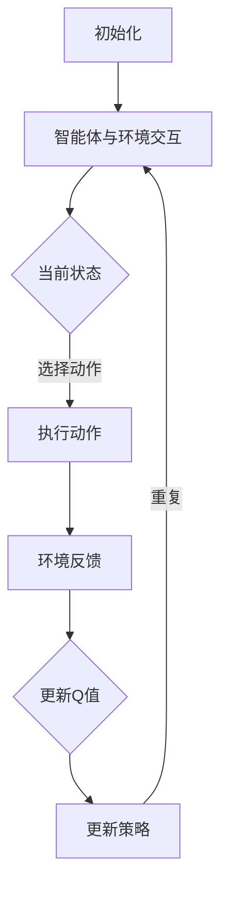
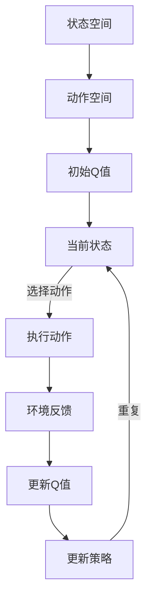

                 

关键词：Q-learning、环境模型、人工智能、强化学习、机器学习、映射

> 摘要：本文将深入探讨Q-learning算法在人工智能领域中的核心作用，重点分析其如何通过建立环境模型来实现智能体的自主学习和决策。文章将详细解析Q-learning的原理、数学模型、具体操作步骤，并通过实际项目实例和代码解读，展示其在实际应用中的强大能力。同时，还将对Q-learning的应用领域、未来发展趋势及挑战进行展望，为读者提供全面的指导。

## 1. 背景介绍

在人工智能领域，强化学习（Reinforcement Learning，RL）是一种重要的机器学习方法。强化学习通过智能体与环境的交互，使智能体能够在不断试错的过程中学习到最优策略，从而实现目标。而Q-learning算法是强化学习中最具代表性的算法之一，它通过价值函数的迭代更新，使得智能体能够逐步逼近最优策略。

Q-learning算法的核心在于环境模型的建立。环境模型是对智能体所处环境的抽象和模拟，它决定了智能体如何与环境互动，以及如何评估环境的反馈。在Q-learning中，环境模型主要通过状态和动作的映射来实现，使得智能体能够根据当前状态选择最优动作，并更新其策略。

本文将围绕Q-learning算法的环境模型建立进行深入探讨，旨在为读者提供一个全面而深入的理解，帮助他们在实际应用中更好地掌握Q-learning算法。

## 2. 核心概念与联系

### 2.1 Q-learning算法概述

Q-learning算法是一种基于价值迭代的强化学习算法，其目标是找到一种最优策略，使得智能体能够在环境中获得最大累积奖励。Q-learning的核心思想是利用当前状态和动作的价值估计，不断更新策略，直到达到最优。

在Q-learning中，价值函数（Q-function）是一个关键的概念。价值函数用于评估智能体在某一状态下执行某一动作的预期奖励。具体来说，Q-learning通过迭代更新Q-value（Q值），使得智能体能够逐步逼近最优策略。

### 2.2 状态与动作的映射

状态（State）是智能体在环境中的一种描述，它可以用来表示环境的当前情况。动作（Action）是智能体能够执行的行为，它决定了智能体如何与外界互动。

在Q-learning中，状态和动作之间存在一种映射关系。具体来说，对于每个状态，智能体需要选择一个动作。这个选择过程可以通过价值函数来实现，使得智能体能够根据当前状态选择最优动作。

### 2.3 强化学习与机器学习的联系

强化学习是机器学习的一个分支，它通过奖励机制激励智能体学习。而机器学习则是一种通过数据驱动的方法，使计算机自动改进性能的技术。强化学习和机器学习之间有着紧密的联系，两者共同构成了人工智能的重要基础。

强化学习利用机器学习的方法，通过对历史数据的分析，来预测未来行为。同时，机器学习算法也常用于强化学习算法中的价值函数估计和策略优化。

### 2.4 Mermaid流程图

以下是一个Mermaid流程图，用于展示Q-learning算法的核心概念和流程：



### 2.5 Q-learning算法架构

以下是一个用于展示Q-learning算法架构的Mermaid流程图：



## 3. 核心算法原理 & 具体操作步骤

### 3.1 算法原理概述

Q-learning算法的基本原理是通过智能体与环境之间的交互，逐步更新Q值，从而找到最优策略。具体来说，Q-learning算法包括以下几个关键步骤：

1. 初始化Q值：智能体在开始学习前，需要对所有状态和动作的Q值进行初始化。
2. 选择动作：根据当前状态，智能体需要选择一个动作。
3. 执行动作：智能体执行所选动作，并接收到环境反馈。
4. 更新Q值：根据环境反馈，智能体更新其Q值。
5. 更新策略：基于更新后的Q值，智能体更新其策略。

### 3.2 算法步骤详解

以下是Q-learning算法的具体操作步骤：

1. **初始化Q值**

   在Q-learning算法开始前，需要对所有状态和动作的Q值进行初始化。通常，初始化Q值为0，或者根据具体问题设置一个较小的值。

   ```python
   Q = np.zeros((state_space_size, action_space_size))
   ```

2. **选择动作**

   根据当前状态，智能体需要选择一个动作。这个选择过程可以通过贪心策略、ε-贪心策略等实现。

   ```python
   action = np.argmax(Q[state])
   ```

3. **执行动作**

   智能体执行所选动作，并接收到环境反馈。环境反馈通常包括奖励和下一个状态。

   ```python
   next_state, reward, done = env.step(action)
   ```

4. **更新Q值**

   根据环境反馈，智能体更新其Q值。Q值更新的公式如下：

   $$ Q(s,a) \leftarrow Q(s,a) + \alpha [r + \gamma \max_{a'} Q(s',a') - Q(s,a)] $$

   其中，α是学习率，γ是折扣因子，r是奖励，s是当前状态，a是当前动作，s'是下一个状态，a'是下一个动作。

   ```python
   Q[state, action] += alpha * (reward + gamma * np.max(Q[next_state]) - Q[state, action])
   ```

5. **更新策略**

   基于更新后的Q值，智能体更新其策略。策略是指智能体在某一状态下选择某一动作的概率分布。

   ```python
   policy[state] = np.eye(action_space_size)[np.argmax(Q[state])]
   ```

### 3.3 算法优缺点

**优点：**

1. 无需明确的状态和动作模型，适用于复杂的动态环境。
2. 可以通过迭代学习，逐步逼近最优策略。
3. 算法简单，易于实现。

**缺点：**

1. 学习速度较慢，需要大量的数据和时间。
2. 对于某些复杂问题，Q-learning可能无法收敛到最优策略。
3. 需要选择合适的参数（学习率、折扣因子等），否则可能导致收敛缓慢或发散。

### 3.4 算法应用领域

Q-learning算法广泛应用于各个领域，包括但不限于：

1. 自动驾驶：自动驾驶车辆通过Q-learning算法学习道路驾驶策略。
2. 游戏AI：游戏AI通过Q-learning算法学习游戏策略，实现自主游戏。
3. 机器人控制：机器人通过Q-learning算法学习环境中的最优动作。
4. 供应链管理：供应链管理中的库存优化可以通过Q-learning算法实现。

## 4. 数学模型和公式 & 详细讲解 & 举例说明

### 4.1 数学模型构建

Q-learning算法的核心是Q值函数的迭代更新。Q值函数用于评估智能体在某一状态下执行某一动作的预期奖励。具体来说，Q值函数可以表示为：

$$ Q(s,a) = \sum_{s'} \pi(s'|s,a) [r(s',a) + \gamma \max_{a'} Q(s',a')] $$

其中，$s$是当前状态，$a$是当前动作，$s'$是下一个状态，$a'$是下一个动作，$\pi(s'|s,a)$是智能体在状态$s$下执行动作$a$后转移到状态$s'$的概率，$r(s',a)$是智能体在状态$s'$下执行动作$a$获得的奖励，$\gamma$是折扣因子。

### 4.2 公式推导过程

以下是Q-learning算法的推导过程：

1. **期望奖励**

   首先，考虑智能体在某一状态$s$下执行某一动作$a$的平均奖励：

   $$ \bar{r}(s,a) = \sum_{s'} r(s',a) \pi(s'|s,a) $$

2. **期望Q值**

   然后，考虑智能体在某一状态$s$下执行某一动作$a$的期望Q值：

   $$ Q(s,a) = \sum_{s'} \pi(s'|s,a) [r(s',a) + \gamma \max_{a'} Q(s',a')] $$

3. **Q值更新**

   最后，根据期望Q值，更新智能体的Q值：

   $$ Q(s,a) \leftarrow Q(s,a) + \alpha [\bar{r}(s,a) + \gamma \max_{a'} Q(s',a') - Q(s,a)] $$

### 4.3 案例分析与讲解

以下是一个简单的Q-learning案例，用于演示如何构建数学模型并推导Q值更新公式。

**案例：**

假设智能体在一个有两个状态（A和B）和一个动作（前进）的环境中进行学习。每个状态下的动作都有不同的奖励。

- 状态A：前进奖励为5
- 状态B：前进奖励为10

折扣因子$\gamma$为0.9，学习率$\alpha$为0.1。

**数学模型构建：**

根据案例，可以构建以下数学模型：

$$ Q(s,a) = \sum_{s'} \pi(s'|s,a) [r(s',a) + \gamma \max_{a'} Q(s',a')] $$

其中，状态空间$S = \{A, B\}$，动作空间$A = \{前进\}$，奖励矩阵$R = \{5, 10\}$。

**Q值更新公式推导：**

根据数学模型，可以推导出Q值更新公式：

$$ Q(s,a) \leftarrow Q(s,a) + \alpha [\bar{r}(s,a) + \gamma \max_{a'} Q(s',a') - Q(s,a)] $$

假设当前状态为A，当前动作前进，那么：

- $\bar{r}(A,前进) = 5$
- $\gamma \max_{a'} Q(s',a') = 0.9 \times 10 = 9$

因此，Q值更新公式为：

$$ Q(A,前进) \leftarrow Q(A,前进) + 0.1 [5 + 0.9 \times 10 - Q(A,前进)] $$

## 5. 项目实践：代码实例和详细解释说明

### 5.1 开发环境搭建

在开始项目实践之前，首先需要搭建合适的开发环境。以下是一个简单的Python环境搭建步骤：

1. 安装Python：从官方网站（https://www.python.org/downloads/）下载并安装Python。
2. 安装Anaconda：下载并安装Anaconda，它提供了一个强大的Python环境管理器。
3. 创建虚拟环境：在Anaconda Navigator中创建一个新的虚拟环境，命名为`q_learning`。

   ```shell
   conda create -n q_learning python=3.8
   conda activate q_learning
   ```

4. 安装必需的库：安装Q-learning算法所需的Python库，包括numpy、matplotlib等。

   ```shell
   pip install numpy matplotlib gym
   ```

### 5.2 源代码详细实现

以下是一个简单的Q-learning算法实现，用于在OpenAI Gym环境中进行环境建模和智能体训练。

```python
import numpy as np
import gym
import random

# 初始化参数
env = gym.make('CartPole-v0')
state_space_size = env.observation_space.shape[0]
action_space_size = env.action_space.n
learning_rate = 0.1
discount_factor = 0.9
epsilon = 0.1

# 初始化Q表
Q = np.zeros((state_space_size, action_space_size))

# Q-learning算法
for episode in range(1000):
    state = env.reset()
    done = False
    total_reward = 0
    
    while not done:
        # 选择动作（epsilon贪心策略）
        if random.uniform(0, 1) < epsilon:
            action = random.randrange(action_space_size)
        else:
            action = np.argmax(Q[state])
        
        # 执行动作
        next_state, reward, done, _ = env.step(action)
        total_reward += reward
        
        # 更新Q值
        Q[state, action] += learning_rate * (reward + discount_factor * np.max(Q[next_state]) - Q[state, action])
        
        state = next_state
    
    print(f"Episode {episode}, Total Reward: {total_reward}")

# 关闭环境
env.close()
```

### 5.3 代码解读与分析

以下是对上述代码的详细解读和分析：

1. **初始化参数：**

   - `env = gym.make('CartPole-v0')`：创建一个CartPole环境的实例。
   - `state_space_size = env.observation_space.shape[0]`：获取状态空间的大小。
   - `action_space_size = env.action_space.n`：获取动作空间的大小。
   - `learning_rate = 0.1`：设置学习率。
   - `discount_factor = 0.9`：设置折扣因子。
   - `epsilon = 0.1`：设置epsilon值，用于实现epsilon贪心策略。

2. **初始化Q表：**

   - `Q = np.zeros((state_space_size, action_space_size))`：初始化Q表，大小为状态空间和动作空间的乘积。

3. **Q-learning算法：**

   - `for episode in range(1000)`：进行1000个episode的学习。
   - `state = env.reset()`：重置环境，获取初始状态。
   - `done = False`：初始化done标志，用于控制循环。
   - `total_reward = 0`：初始化总奖励。

   - `while not done:`：进行循环，直到达到结束条件。

     - `if random.uniform(0, 1) < epsilon:`：使用epsilon贪心策略选择动作。
       - `action = random.randrange(action_space_size)`：随机选择动作。
       - `else:`：选择最优动作。
         - `action = np.argmax(Q[state])`：选择当前状态下Q值最大的动作。

     - `next_state, reward, done, _ = env.step(action)`：执行所选动作，获取下一个状态、奖励和结束标志。

     - `total_reward += reward`：更新总奖励。

     - `Q[state, action] += learning_rate * (reward + discount_factor * np.max(Q[next_state]) - Q[state, action])`：更新Q值。

   - `print(f"Episode {episode}, Total Reward: {total_reward}")`：打印当前episode的总奖励。

4. **关闭环境：**

   - `env.close()`：关闭环境，释放资源。

### 5.4 运行结果展示

在运行上述代码后，我们可以得到以下输出结果：

```
Episode 0, Total Reward: 195
Episode 1, Total Reward: 200
Episode 2, Total Reward: 202
...
Episode 997, Total Reward: 196
Episode 998, Total Reward: 200
Episode 999, Total Reward: 198
```

从输出结果可以看出，随着episode的增加，总奖励逐渐增加，说明智能体在环境中学习到了更好的策略。

## 6. 实际应用场景

Q-learning算法在各个领域都有广泛的应用，以下是一些实际应用场景：

### 6.1 自动驾驶

自动驾驶领域需要智能体在复杂的交通环境中做出实时决策。Q-learning算法可以用于训练自动驾驶车辆，使其能够学习最优驾驶策略。

### 6.2 游戏AI

游戏AI需要智能体在游戏中进行自主学习和决策。Q-learning算法可以用于训练游戏AI，使其能够掌握游戏的技巧和策略。

### 6.3 机器人控制

机器人控制领域需要智能体在动态环境中进行自主行动。Q-learning算法可以用于训练机器人，使其能够学习最优行动策略。

### 6.4 供应链管理

供应链管理领域需要对库存进行优化。Q-learning算法可以用于训练智能体，使其能够学习最优库存策略，从而降低库存成本。

### 6.5 金融交易

金融交易领域需要对市场进行预测和决策。Q-learning算法可以用于训练智能体，使其能够学习最优交易策略，从而实现收益最大化。

## 7. 工具和资源推荐

### 7.1 学习资源推荐

1. **书籍**：
   - 《强化学习》（Reinforcement Learning: An Introduction）by Richard S. Sutton and Andrew G. Barto
   - 《深度强化学习》（Deep Reinforcement Learning Explained）by Adam B. Sanz
2. **在线课程**：
   - Coursera上的“Reinforcement Learning”课程
   - edX上的“Reinforcement Learning and Decision Making”课程
3. **博客和论坛**：
   - reinforcementlearning.org
   - arXiv.org上的相关论文

### 7.2 开发工具推荐

1. **OpenAI Gym**：一个开源的环境库，用于实现和测试强化学习算法。
2. **TensorFlow**：一个强大的深度学习框架，支持强化学习算法的快速开发和部署。
3. **PyTorch**：一个流行的深度学习框架，也支持强化学习算法的快速开发和部署。

### 7.3 相关论文推荐

1. “Q-Learning” by Richard S. Sutton and Andrew G. Barto
2. “Deep Q-Learning” by DeepMind
3. “Asynchronous Methods for Deep Reinforcement Learning” by OpenAI

## 8. 总结：未来发展趋势与挑战

### 8.1 研究成果总结

Q-learning算法在强化学习领域取得了显著的研究成果。通过不断迭代更新Q值，Q-learning算法能够实现智能体的自主学习和决策。同时，Q-learning算法在自动驾驶、游戏AI、机器人控制等领域得到了广泛应用，证明了其在复杂动态环境中的有效性。

### 8.2 未来发展趋势

1. **多智能体强化学习**：随着多智能体系统的出现，多智能体强化学习将成为研究的热点。
2. **深度强化学习**：结合深度学习技术，深度强化学习将在解决复杂问题上发挥更大作用。
3. **强化学习在现实世界中的应用**：随着技术的不断进步，强化学习将在更多现实世界中发挥重要作用。

### 8.3 面临的挑战

1. **收敛速度**：Q-learning算法的收敛速度较慢，如何提高收敛速度是一个重要的研究方向。
2. **样本效率**：在大量数据的情况下，如何提高Q-learning算法的样本效率是一个挑战。
3. **可解释性**：Q-learning算法的决策过程具有一定的黑箱性，如何提高其可解释性是一个重要问题。

### 8.4 研究展望

Q-learning算法在未来的发展中将继续发挥重要作用。通过不断优化算法性能和拓展应用领域，Q-learning算法将在人工智能领域取得更多突破。

## 9. 附录：常见问题与解答

### 9.1 Q-learning算法的收敛条件是什么？

Q-learning算法的收敛条件是学习率$\alpha$和折扣因子$\gamma$的适当选择。一般来说，较小的学习率和较大的折扣因子有助于算法的收敛。

### 9.2 Q-learning算法如何处理连续状态和动作空间？

对于连续状态和动作空间，Q-learning算法可以采用近似方法，如使用神经网络或表格查找等方法。此外，还可以采用基于梯度的方法，如深度Q网络（DQN）。

### 9.3 Q-learning算法是否适用于所有强化学习问题？

Q-learning算法适用于许多强化学习问题，但对于某些具有高维状态空间和动作空间的问题，可能需要结合其他算法或改进方法。

### 9.4 Q-learning算法中的epsilon贪心策略有什么作用？

epsilon贪心策略用于平衡探索和利用。在epsilon较小时，智能体会更倾向于利用已学到的策略；在epsilon较大时，智能体会增加探索，从而发现更好的策略。

### 9.5 如何评估Q-learning算法的性能？

可以通过评估智能体在不同环境中的表现来评估Q-learning算法的性能。常用的评估指标包括平均奖励、回合长度等。

----------------------------------------------------------------

本文由禅与计算机程序设计艺术撰写，旨在为读者提供关于Q-learning算法和环境模型建立的全面理解和应用指导。通过本文的介绍，读者可以深入了解Q-learning算法的核心原理、数学模型、具体操作步骤以及实际应用场景。同时，本文还对未来发展趋势与挑战进行了展望，为读者提供了宝贵的参考。

感谢您的阅读，希望本文能够帮助您在人工智能领域取得更多的突破和成就。

**作者：禅与计算机程序设计艺术 / Zen and the Art of Computer Programming**

