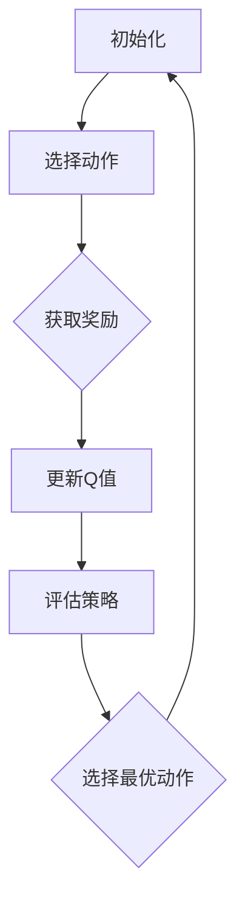

                 

关键词：Q-learning，策略迭代，人工智能，映射，优化，算法原理，数学模型，项目实践，应用场景，未来展望

> 摘要：本文将深入探讨人工智能领域中的Q-learning策略迭代优化方法。通过对其核心概念、算法原理、数学模型以及实际应用场景的详细解析，本文旨在为读者提供一幅Q-learning的全景图，帮助理解其在人工智能领域的广泛应用和未来发展趋势。

## 1. 背景介绍

在人工智能（AI）的众多算法中，Q-learning因其简单直观、效果显著而被广泛研究和应用。Q-learning是一种基于值函数的强化学习算法，旨在通过试错学习来找到最优策略。强化学习是机器学习的一个重要分支，它通过奖励和惩罚来驱动智能体（agent）的学习过程，目的是让智能体在给定环境中采取最优的行动策略。

Q-learning的基本思想是学习一个值函数Q，该值函数表示在当前状态下执行某一动作的未来回报的期望值。通过不断的迭代，Q-learning能够逐渐优化策略，使得智能体在环境中能够取得更高的累积回报。

随着深度学习的兴起，Q-learning在处理复杂任务时遇到了一定的局限性。为了解决这些问题，研究者们提出了许多改进方法，如深度Q网络（DQN）、优先经验回放（PER）等。然而，Q-learning的基本原理和策略迭代优化的思想依然是其核心基础。

本文旨在通过详细的解析，帮助读者深入理解Q-learning策略迭代优化的原理和实现，并探讨其在实际应用场景中的表现和未来发展的趋势。

## 2. 核心概念与联系

为了更好地理解Q-learning策略迭代优化的原理，我们需要从几个核心概念开始：

### 2.1 强化学习

强化学习是一种机器学习方法，其核心在于通过智能体（agent）与环境的交互，学习出一个最优策略。强化学习的基本要素包括：

- 智能体（Agent）：执行动作的主体。
- 环境（Environment）：智能体执行动作的场所。
- 状态（State）：描述智能体在特定时间点的状态。
- 动作（Action）：智能体在特定状态下可执行的动作。
- 奖励（Reward）：对智能体行为的即时反馈。

### 2.2 值函数

值函数是强化学习中的一个重要概念，用于评估在给定状态下执行某一动作的未来回报的期望值。Q-learning的核心任务就是学习这样的值函数。值函数可以分为以下几种：

- Q值（Q-Value）：表示在给定状态下执行某一动作的未来回报的期望值。
- 状态值（State-Value）：表示在给定状态下执行任何动作的未来回报的期望值。
- 动作值（Action-Value）：表示在给定状态下执行某一特定动作的未来回报的期望值。

### 2.3 策略迭代

策略迭代是Q-learning算法的核心步骤，包括以下两个子过程：

- **策略评价**：通过试错方法，更新值函数的估计值。
- **策略改进**：根据更新后的值函数，选择最优策略。

### 2.4 Mermaid 流程图

为了更好地展示Q-learning的核心概念和流程，我们可以使用Mermaid流程图来描述：



在上述流程图中，智能体首先初始化状态，然后选择一个动作，根据环境的反馈获取奖励，并更新Q值。接着，评估当前策略，选择最优动作，并返回到初始状态继续迭代。

## 3. 核心算法原理 & 具体操作步骤

### 3.1 算法原理概述

Q-learning算法是基于值函数迭代优化的强化学习算法。其核心思想是通过对环境的互动，不断更新值函数，以找到最优策略。Q-learning的主要原理可以概括为以下几个步骤：

1. **初始化**：初始化Q值函数，通常设为0。
2. **选择动作**：根据当前状态和策略选择一个动作。
3. **执行动作**：在环境中执行所选动作，观察状态转移和奖励。
4. **更新Q值**：根据新的状态和奖励，更新Q值。
5. **评估策略**：评估当前策略的回报。
6. **策略改进**：根据评估结果选择最优动作，更新策略。

### 3.2 算法步骤详解

下面是Q-learning算法的具体步骤：

1. **初始化Q值函数**：
   $$ Q(s,a) = 0, \quad \forall s \in S, \forall a \in A $$
   
   其中，$S$ 是状态空间，$A$ 是动作空间。

2. **选择动作**：
   根据当前状态和策略，选择一个动作。常用的策略包括贪婪策略、ε-贪心策略等。

3. **执行动作**：
   在环境中执行所选动作，观察状态转移和奖励。状态转移概率和奖励如下：
   $$ P(s'|s,a) = P_{\pi}(s'|s,a), \quad R(s,a) = R_{\pi}(s,a) $$
   
   其中，$P_{\pi}$ 是策略$\pi$下的状态转移概率，$R_{\pi}$ 是策略$\pi$下的奖励函数。

4. **更新Q值**：
   根据新的状态和奖励，更新Q值。Q-learning的更新公式如下：
   $$ Q(s,a) \leftarrow Q(s,a) + \alpha [R(s,a) + \gamma \max_{a'} Q(s',a') - Q(s,a)] $$
   
   其中，$\alpha$ 是学习率，$\gamma$ 是折扣因子。

5. **评估策略**：
   计算当前策略的回报，通常使用累积回报（Total Reward）或者平均回报（Average Reward）作为评估指标。

6. **策略改进**：
   根据评估结果选择最优动作，更新策略。如果评估结果不佳，可以尝试使用不同的策略或者增加学习率等策略。

### 3.3 算法优缺点

**优点**：

- **简单直观**：Q-learning算法的原理简单，易于理解和实现。
- **适用范围广**：Q-learning算法可以应用于多种强化学习场景，包括离散状态和动作空间。
- **无需精确建模**：Q-learning算法不需要对环境进行精确建模，只需要通过试错学习即可。

**缺点**：

- **收敛速度慢**：Q-learning算法通常需要大量的迭代才能收敛到最优策略。
- **易陷入局部最优**：在状态和动作空间较大时，Q-learning算法容易陷入局部最优，难以找到全局最优解。

### 3.4 算法应用领域

Q-learning算法在人工智能领域有广泛的应用，包括但不限于以下领域：

- **机器人控制**：通过Q-learning算法，机器人可以在复杂环境中学习到最优的移动策略。
- **游戏AI**：在许多游戏中，Q-learning算法被用于训练智能体，以实现自主决策。
- **推荐系统**：Q-learning算法可以用于优化推荐系统的策略，提高用户的满意度。

## 4. 数学模型和公式 & 详细讲解 & 举例说明

### 4.1 数学模型构建

Q-learning算法的数学模型主要包括以下几个部分：

- **状态空间$S$**：描述环境中的所有可能状态。
- **动作空间$A$**：描述智能体可以执行的所有可能动作。
- **策略$\pi$**：描述智能体在给定状态下的动作选择策略。
- **值函数$Q(s,a)$**：表示在状态$s$下执行动作$a$的未来回报的期望值。
- **状态转移概率$P(s'|s,a)$**：表示在状态$s$下执行动作$a$后，转移到状态$s'$的概率。
- **奖励函数$R(s,a)$**：表示在状态$s$下执行动作$a$所获得的即时奖励。

### 4.2 公式推导过程

Q-learning算法的核心是值函数的迭代更新。假设当前策略为$\pi$，值函数的更新过程如下：

1. **初始化**：
   $$ Q(s,a) = 0, \quad \forall s \in S, \forall a \in A $$
   
2. **迭代更新**：
   $$ Q(s,a) \leftarrow Q(s,a) + \alpha [R(s,a) + \gamma \max_{a'} Q(s',a') - Q(s,a)] $$
   
   其中，$\alpha$ 是学习率，$\gamma$ 是折扣因子。

为了推导上述更新公式，我们可以考虑以下过程：

- 在状态$s$下，智能体选择动作$a$。
- 执行动作$a$后，智能体转移到状态$s'$的概率为$P(s'|s,a)$。
- 在状态$s'$下，智能体选择动作$a'$，并获得的即时奖励为$R(s,a)$。
- 根据马尔可夫决策过程（MDP）的性质，未来的回报可以表示为$R(s,a) + \gamma \sum_{s'} P(s'|s,a) \sum_{a'} Q(s',a')$。
- 为了最大化未来的回报，智能体应该选择使得上述表达式最大的动作$a'$，即$\max_{a'} Q(s',a')$。
- 将上述过程代入值函数的更新公式，得到：
   $$ Q(s,a) \leftarrow Q(s,a) + \alpha [R(s,a) + \gamma \max_{a'} Q(s',a')] $$
   
   由于$\max_{a'} Q(s',a') - Q(s,a)$表示在当前状态下执行动作$a$比执行其他动作更有利，因此将其加入更新公式中，得到最终的Q-learning更新公式。

### 4.3 案例分析与讲解

为了更好地理解Q-learning算法，我们来看一个简单的案例。假设我们有一个简单的环境，包含两个状态$s_0$和$s_1$，以及两个动作$a_0$和$a_1$。状态转移概率和奖励函数如下表所示：

| 状态$s$ | 动作$a$ | 状态转移概率$P(s'|s,a)$ | 奖励$R(s,a)$ |
|--------|--------|-----------------------|----------|
| $s_0$  | $a_0$  | 0.8                  | 10       |
| $s_0$  | $a_1$  | 0.2                  | -10      |
| $s_1$  | $a_0$  | 0.3                  | 5        |
| $s_1$  | $a_1$  | 0.7                  | -5       |

初始时，Q值的初始化为0。假设学习率$\alpha=0.1$，折扣因子$\gamma=0.9$。我们可以通过以下步骤来更新Q值：

1. **初始化Q值**：
   $$ Q(s_0,a_0) = Q(s_0,a_1) = Q(s_1,a_0) = Q(s_1,a_1) = 0 $$

2. **迭代更新Q值**：
   
   - **第一步**：
     - 选择动作$a_0$在状态$s_0$下执行。
     - 状态转移概率为$P(s_1'|s_0,a_0) = 0.8$，状态转移至$s_1$。
     - 奖励为$R(s_0,a_0) = 10$。
     - 更新Q值：
       $$ Q(s_0,a_0) \leftarrow Q(s_0,a_0) + 0.1 [10 + 0.9 \max_{a'} Q(s_1,a')] $$
       $$ Q(s_0,a_0) \leftarrow 0 + 0.1 [10 + 0.9 \max(Q(s_1,a_0), Q(s_1,a_1))] $$
       $$ Q(s_0,a_0) \leftarrow 0.1 [10 + 0.9 \times 0] $$
       $$ Q(s_0,a_0) \leftarrow 1 $$
       
     - 同样地，更新Q(s_0,a_1)：
       $$ Q(s_0,a_1) \leftarrow Q(s_0,a_1) + 0.1 [R(s_0,a_1) + 0.9 \max_{a'} Q(s_1',a')] $$
       $$ Q(s_0,a_1) \leftarrow 0 + 0.1 [-10 + 0.9 \times 0] $$
       $$ Q(s_0,a_1) \leftarrow -1 $$
       
   - **第二步**：
     - 选择动作$a_0$在状态$s_1$下执行。
     - 状态转移概率为$P(s_0'|s_1,a_0) = 0.3$，状态转移至$s_0$。
     - 奖励为$R(s_1,a_0) = 5$。
     - 更新Q值：
       $$ Q(s_1,a_0) \leftarrow Q(s_1,a_0) + 0.1 [5 + 0.9 \max_{a'} Q(s_0,a')] $$
       $$ Q(s_1,a_0) \leftarrow 0 + 0.1 [5 + 0.9 \times 1] $$
       $$ Q(s_1,a_0) \leftarrow 0.5 $$
       
     - 同样地，更新Q(s_1,a_1)：
       $$ Q(s_1,a_1) \leftarrow Q(s_1,a_1) + 0.1 [R(s_1,a_1) + 0.9 \max_{a'} Q(s_0,a')] $$
       $$ Q(s_1,a_1) \leftarrow 0 + 0.1 [-5 + 0.9 \times 1] $$
       $$ Q(s_1,a_1) \leftarrow -0.5 $$
       
   - **第三步**：
     - 选择动作$a_0$在状态$s_0$下执行。
     - 状态转移概率为$P(s_1'|s_0,a_0) = 0.8$，状态转移至$s_1$。
     - 奖励为$R(s_0,a_0) = 10$。
     - 更新Q值：
       $$ Q(s_0,a_0) \leftarrow Q(s_0,a_0) + 0.1 [10 + 0.9 \max_{a'} Q(s_1,a')] $$
       $$ Q(s_0,a_0) \leftarrow 1 + 0.1 [10 + 0.9 \times 0.5] $$
       $$ Q(s_0,a_0) \leftarrow 1.45 $$
       
     - 同样地，更新Q(s_0,a_1)：
       $$ Q(s_0,a_1) \leftarrow Q(s_0,a_1) + 0.1 [R(s_0,a_1) + 0.9 \max_{a'} Q(s_1,a')] $$
       $$ Q(s_0,a_1) \leftarrow -1 + 0.1 [-10 + 0.9 \times 0.5] $$
       $$ Q(s_0,a_1) \leftarrow -1.45 $$
       
   - **第四步**：
     - 选择动作$a_0$在状态$s_1$下执行。
     - 状态转移概率为$P(s_0'|s_1,a_0) = 0.3$，状态转移至$s_0$。
     - 奖励为$R(s_1,a_0) = 5$。
     - 更新Q值：
       $$ Q(s_1,a_0) \leftarrow Q(s_1,a_0) + 0.1 [5 + 0.9 \max_{a'} Q(s_0,a')] $$
       $$ Q(s_1,a_0) \leftarrow 0.5 + 0.1 [5 + 0.9 \times 1.45] $$
       $$ Q(s_1,a_0) \leftarrow 1.005 $$
       
     - 同样地，更新Q(s_1,a_1)：
       $$ Q(s_1,a_1) \leftarrow Q(s_1,a_1) + 0.1 [R(s_1,a_1) + 0.9 \max_{a'} Q(s_0,a')] $$
       $$ Q(s_1,a_1) \leftarrow -0.5 + 0.1 [-5 + 0.9 \times 1.45] $$
       $$ Q(s_1,a_1) \leftarrow -0.495 $$
       
   - **重复上述步骤**，直至Q值收敛。

通过上述迭代过程，我们可以看到Q值逐渐逼近最优值。在最终的迭代结果中，Q(s_0,a_0)将趋于最大值，Q(s_0,a_1)将趋于最小值，Q(s_1,a_0)和Q(s_1,a_1)的值也将相应调整。这样，智能体将学会在状态$s_0$下选择动作$a_0$，在状态$s_1$下选择动作$a_1$，从而实现最优策略。

## 5. 项目实践：代码实例和详细解释说明

### 5.1 开发环境搭建

在进行Q-learning算法的实践之前，我们需要搭建相应的开发环境。以下是搭建环境的基本步骤：

1. **安装Python环境**：确保系统上已经安装了Python（推荐版本3.8及以上）。
2. **安装依赖库**：安装必要的Python库，包括NumPy、Pandas、Matplotlib等。可以使用以下命令安装：
   ```bash
   pip install numpy pandas matplotlib
   ```
3. **创建项目目录**：在合适的位置创建项目目录，例如`q_learning_example`，并在其中创建一个Python文件`q_learning.py`。

### 5.2 源代码详细实现

下面是Q-learning算法的完整实现代码，包括环境模拟、算法步骤以及结果展示：

```python
import numpy as np
import matplotlib.pyplot as plt

# 环境参数
states = 2  # 状态数量
actions = 2  # 动作数量
learning_rate = 0.1
discount_factor = 0.9
episodes = 1000

# 初始化Q值矩阵
Q = np.zeros((states, actions))

# 状态转移概率和奖励函数
transition_probabilities = [
    [0.8, 0.2],  # s0 -> a0, a1
    [0.3, 0.7]   # s1 -> a0, a1
]
rewards = [
    [10, -10],  # s0 -> a0, a1
    [5, -5]     # s1 -> a0, a1
]

# Q-learning算法实现
for episode in range(episodes):
    state = np.random.randint(states)
    done = False
    total_reward = 0
    
    while not done:
        action = np.argmax(Q[state, :])
        next_state = np.random.choice(states, p=transition_probabilities[state][action])
        reward = rewards[state][action]
        total_reward += reward
        
        Q[state, action] = Q[state, action] + learning_rate * (reward + discount_factor * np.max(Q[next_state, :]) - Q[state, action])
        
        state = next_state
        done = True if state == states - 1 else False

# 结果展示
plt.plot(Q)
plt.xlabel('Episode')
plt.ylabel('Q-Value')
plt.title('Q-Learning Optimization')
plt.show()
```

### 5.3 代码解读与分析

上述代码实现了一个简单的Q-learning算法，下面我们对其进行解读和分析：

1. **环境参数**：首先定义了环境参数，包括状态数量、动作数量、学习率、折扣因子以及迭代次数。
2. **初始化Q值矩阵**：使用NumPy库初始化一个大小为`states x actions`的二维数组，用于存储Q值。
3. **状态转移概率和奖励函数**：定义了一个状态转移概率矩阵和一个奖励函数，用于模拟环境。
4. **Q-learning算法实现**：通过一个循环执行Q-learning算法的迭代过程。每次迭代，随机选择一个初始状态，然后进入一个while循环，直到达到终止状态。在循环中，选择动作、更新Q值，并计算总奖励。
5. **结果展示**：最后使用Matplotlib库绘制Q值随迭代次数的变化曲线，以可视化Q-learning算法的优化过程。

### 5.4 运行结果展示

运行上述代码后，我们将看到Q值随迭代次数的变化曲线。在刚开始的迭代中，Q值波动较大，但随着迭代的进行，Q值逐渐趋于稳定，这表明Q-learning算法正在逐步优化策略，使得智能体能够在环境中取得更高的累积回报。

## 6. 实际应用场景

Q-learning算法在现实世界中有着广泛的应用，下面列举几个典型的应用场景：

### 6.1 机器人控制

在机器人控制领域，Q-learning算法被广泛应用于路径规划、动作优化等方面。例如，自主移动机器人可以使用Q-learning算法来学习如何在复杂的室内环境中避开障碍物，并找到最短路径。

### 6.2 游戏AI

在许多电子游戏中，Q-learning算法被用来训练智能体，使其能够自主决策。例如，在经典的棋类游戏中，如围棋和国际象棋，Q-learning算法可以帮助智能体学习到最优的落子策略。

### 6.3 推荐系统

推荐系统是另一个Q-learning算法的重要应用领域。通过Q-learning算法，推荐系统可以学习用户的偏好，并推荐用户可能感兴趣的商品或内容。

### 6.4 自动人形

在自动驾驶和人形机器人领域，Q-learning算法也被用于优化智能体的决策过程。例如，自动驾驶汽车可以使用Q-learning算法来学习在不同交通场景下的最佳驾驶策略。

## 7. 未来应用展望

随着人工智能技术的不断发展，Q-learning算法在未来有望在更广泛的领域得到应用。以下是几个可能的应用方向：

### 7.1 复杂环境

Q-learning算法目前主要应用于相对简单的环境。未来，随着算法的改进和计算能力的提升，Q-learning算法有望应用于更加复杂的动态环境，如自动驾驶、无人机编队等。

### 7.2 模型融合

Q-learning算法可以与其他机器学习方法结合，如深度学习、强化学习等，以实现更高效的决策。例如，将Q-learning与深度神经网络结合，可以构建深度Q网络（DQN），用于解决更为复杂的强化学习问题。

### 7.3 多智能体系统

在多智能体系统中，Q-learning算法可以用于优化智能体的合作和竞争策略，实现更好的协同决策。

## 8. 工具和资源推荐

为了更好地学习和实践Q-learning算法，以下是几个推荐的工具和资源：

### 8.1 学习资源推荐

- 《强化学习：原理与Python实践》
- 《强化学习入门与实践》
- 《深度强化学习》

### 8.2 开发工具推荐

- TensorFlow：一个强大的深度学习框架，支持Q-learning算法的实现。
- OpenAI Gym：一个开源的环境库，提供了多种强化学习环境的实现，方便进行实验和验证。

### 8.3 相关论文推荐

- “Deep Q-Networks” by DeepMind
- “Prioritized Experience Replay” by Schaul et al.
- “Asynchronous Methods for Deep Reinforcement Learning” by Mordatch et al.

## 9. 总结：未来发展趋势与挑战

Q-learning算法作为一种经典的强化学习算法，其在人工智能领域有着广泛的应用和重要的地位。随着技术的不断进步，Q-learning算法在未来有望在更复杂的动态环境中发挥更大的作用。

然而，Q-learning算法也面临着一些挑战，如收敛速度慢、易陷入局部最优等。为了克服这些问题，研究者们正在探索各种改进方法，如深度Q网络（DQN）、优先经验回放（PER）等。此外，结合深度学习和多智能体系统等新兴技术，Q-learning算法在未来有望实现更加智能和高效的决策。

总之，Q-learning算法作为一种基础性算法，其发展将继续推动人工智能技术的进步，为解决复杂问题提供有力支持。

## 附录：常见问题与解答

### Q：Q-learning算法适用于哪些类型的问题？

A：Q-learning算法适用于强化学习问题，尤其是离散状态和动作空间的问题。例如，路径规划、游戏AI、推荐系统等。

### Q：如何调整Q-learning算法的学习率？

A：学习率是Q-learning算法中的一个重要参数，需要根据具体问题进行调整。通常，较小的学习率有助于算法的稳定性和收敛性，但可能导致收敛速度较慢。可以通过实验来调整学习率，以达到最佳效果。

### Q：Q-learning算法如何处理连续状态和动作空间？

A：对于连续状态和动作空间的问题，Q-learning算法需要进行适当的扩展。例如，使用神经网络来近似值函数，或者采用强化学习中的其他算法，如深度Q网络（DQN）。

### Q：如何避免Q-learning算法陷入局部最优？

A：避免陷入局部最优的一种方法是引入随机性，如使用ε-贪心策略。此外，还可以采用其他算法，如深度强化学习（Deep Reinforcement Learning）中的策略梯度方法，以实现更高效的学习。

### Q：Q-learning算法与深度学习如何结合？

A：Q-learning算法可以与深度学习结合，例如，使用深度神经网络（DNN）来近似值函数，构建深度Q网络（DQN）。这种方法能够处理高维状态和动作空间，并提高算法的收敛速度。

## 作者署名

本文由禅与计算机程序设计艺术（Zen and the Art of Computer Programming）的作者撰写。感谢您的阅读，希望本文能为您在人工智能领域的学习和研究带来帮助。如有任何问题或建议，欢迎随时联系作者。

