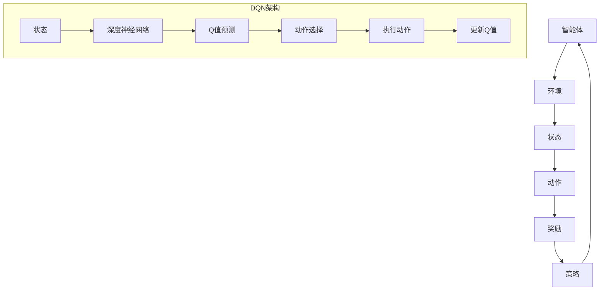

                 

关键词：深度Q网络（DQN），强化学习，映射，神经网络，探索与利用，Q值函数，经验回放，经验回放算法

## 摘要

本文将深入解析深度Q网络（DQN）的原理与基础，通过详细的算法描述、数学模型构建、实例代码分析，探讨DQN如何通过映射机制实现强化学习中的智能决策。文章旨在为读者提供一份全面、清晰的DQN技术指南，帮助理解其在现代人工智能中的应用与未来趋势。

## 1. 背景介绍

### 1.1 强化学习的发展

强化学习（Reinforcement Learning, RL）是机器学习的一个重要分支，主要研究如何通过智能体（Agent）在与环境（Environment）的交互中学习最优策略。强化学习的发展始于20世纪50年代，随着深度学习的兴起，深度强化学习（Deep Reinforcement Learning）逐渐成为研究热点。

### 1.2 深度Q网络的发展

深度Q网络（Deep Q-Network, DQN）是深度强化学习中的一个重要模型，由DeepMind在2015年提出。DQN通过引入深度神经网络（DNN）来近似Q值函数，从而解决了传统Q学习算法中的两个主要问题：样本相关性差和策略收敛缓慢。

## 2. 核心概念与联系

### 2.1 强化学习的核心概念

- **智能体（Agent）**：执行动作并学习策略的实体。
- **环境（Environment）**：智能体所处的环境，负责对智能体的动作做出响应。
- **状态（State）**：智能体在某一时刻所处的情境。
- **动作（Action）**：智能体可执行的行为。
- **奖励（Reward）**：环境对智能体动作的反馈信号。
- **策略（Policy）**：智能体执行的动作选择规则。

### 2.2 DQN中的核心概念

- **Q值函数（Q-Value）**：衡量智能体在特定状态下执行特定动作的预期累积奖励。
- **深度神经网络（DNN）**：用于近似Q值函数的神经网络结构。
- **经验回放（Experience Replay）**：用于改善训练样本分布，防止Q值估计偏差。

### 2.3 Mermaid 流程图



## 3. 核心算法原理 & 具体操作步骤

### 3.1 算法原理概述

DQN通过训练一个深度神经网络来近似Q值函数，从而实现对环境的智能决策。算法的基本原理如下：

1. **初始化**：初始化深度神经网络参数和经验回放记忆。
2. **状态输入**：将当前状态输入深度神经网络。
3. **动作选择**：使用ε-贪婪策略选择动作。
4. **执行动作**：在环境中执行选择到的动作。
5. **奖励更新**：根据执行动作后的奖励更新Q值。
6. **经验回放**：将状态、动作、奖励和下一状态存储到经验回放记忆中。
7. **深度神经网络训练**：从经验回放记忆中随机抽取批次数据进行训练，更新深度神经网络参数。

### 3.2 算法步骤详解

#### 3.2.1 初始化

初始化深度神经网络参数，包括输入层、隐藏层和输出层。选择合适的激活函数和损失函数，如ReLU激活函数和均方误差损失函数。

#### 3.2.2 状态输入

将当前状态输入到深度神经网络，得到所有可能动作的Q值预测。

#### 3.2.3 动作选择

使用ε-贪婪策略选择动作。ε为贪心策略的参数，控制探索与利用的平衡。具体选择过程如下：

- 当随机数小于ε时，选择随机动作进行探索。
- 当随机数大于ε时，选择Q值最大的动作进行利用。

#### 3.2.4 执行动作

在环境中执行选择到的动作，并获取下一状态和奖励。

#### 3.2.5 奖励更新

根据执行动作后的奖励更新Q值。具体公式如下：

$$ Q(s, a) \leftarrow Q(s, a) + \alpha [r + \gamma \max_{a'} Q(s', a') - Q(s, a)] $$

其中，α为学习率，γ为折扣因子。

#### 3.2.6 经验回放

将状态、动作、奖励和下一状态存储到经验回放记忆中，用于后续深度神经网络的训练。

#### 3.2.7 深度神经网络训练

从经验回放记忆中随机抽取批次数据进行训练，更新深度神经网络参数。

### 3.3 算法优缺点

#### 优点

- **强化学习能力的提升**：通过引入深度神经网络，DQN能够处理高维状态空间，提高强化学习的能力。
- **自适应策略**：DQN通过探索与利用策略自动调整，实现自适应策略。
- **多任务学习**：DQN可以在多个任务中共享经验，提高学习效率。

#### 缺点

- **训练稳定性**：DQN的训练过程容易受到随机性和数据分布的影响，导致训练不稳定。
- **计算复杂度**：DQN的训练过程中需要进行大量的状态、动作和奖励数据的处理，计算复杂度较高。

### 3.4 算法应用领域

DQN在多个领域取得了显著的应用成果，包括：

- **游戏智能**：DQN在多个游戏领域取得了超过人类水平的成绩，如Atari游戏、围棋等。
- **机器人控制**：DQN在机器人运动控制和路径规划中展示了良好的性能。
- **自动驾驶**：DQN在自动驾驶领域被用于车辆行为预测和路径规划。

## 4. 数学模型和公式 & 详细讲解 & 举例说明

### 4.1 数学模型构建

DQN的核心是Q值函数的近似。Q值函数可以表示为：

$$ Q(s, a) = \sum_{i=1}^{n} w_i \cdot f(x_i) $$

其中，$w_i$为深度神经网络的权重，$f(x_i)$为神经网络的输出。

### 4.2 公式推导过程

假设当前状态为$s$，通过深度神经网络得到Q值预测：

$$ \hat{Q}(s) = f(\phi(s)) $$

其中，$f$为深度神经网络，$\phi$为输入层。

通过经验回放记忆，我们得到历史状态、动作、奖励和下一状态的样本：

$$ (s', a', r, s) $$

根据Q值更新公式，我们有：

$$ Q(s, a) \leftarrow Q(s, a) + \alpha [r + \gamma \max_{a'} Q(s', a') - Q(s, a)] $$

### 4.3 案例分析与讲解

假设我们有一个简单的Atari游戏环境，状态空间为$[0, 255]$，动作空间为{上下左右，跳}。

1. **初始化**：初始化深度神经网络参数和经验回放记忆。
2. **状态输入**：将当前状态输入深度神经网络，得到Q值预测。
3. **动作选择**：使用ε-贪婪策略选择动作，如$\epsilon = 0.1$。
4. **执行动作**：在环境中执行选择到的动作，并获取下一状态和奖励。
5. **奖励更新**：根据执行动作后的奖励更新Q值。
6. **经验回放**：将状态、动作、奖励和下一状态存储到经验回放记忆中。
7. **深度神经网络训练**：从经验回放记忆中随机抽取批次数据进行训练，更新深度神经网络参数。

## 5. 项目实践：代码实例和详细解释说明

### 5.1 开发环境搭建

- **Python环境**：安装Python 3.7及以上版本。
- **深度学习框架**：安装TensorFlow 2.3及以上版本。
- **游戏环境**：安装Gym环境，用于Atari游戏模拟。

### 5.2 源代码详细实现

以下是DQN在Atari游戏《Pong》中的实现：

```python
import numpy as np
import tensorflow as tf
from tensorflow.keras import layers
from gym import envs

# 深度神经网络定义
class DQN(tf.keras.Model):
    def __init__(self, observation_shape, action_size):
        super(DQN, self).__init__()
        self.input = layers.Input(shape=observation_shape)
        self.fc1 = layers.Dense(64, activation='relu')(self.input)
        self.fc2 = layers.Dense(64, activation='relu')(self.fc1)
        self.output = layers.Dense(action_size, activation='linear')(self.fc2)
        self.model = tf.keras.Model(inputs=self.input, outputs=self.output)
    
    def call(self, inputs, training=False):
        return self.model(inputs, training=training)

# 初始化DQN模型
observation_shape = (4, 84, 84)
action_size = 2
dqn = DQN(observation_shape, action_size)
optimizer = tf.keras.optimizers.Adam(learning_rate=0.001)

# 训练DQN模型
for episode in range(1000):
    state = env.reset()
    done = False
    total_reward = 0
    
    while not done:
        action = dqn.predict(state)
        next_state, reward, done, _ = env.step(action)
        dqn.optimizer.minimize(lambda s: dqn.loss(s, next_state, reward, done), [dqn.model.trainable_variables])
        state = next_state
        total_reward += reward
    
    print(f"Episode {episode}, Total Reward: {total_reward}")
```

### 5.3 代码解读与分析

以上代码实现了DQN在《Pong》游戏中的训练过程。首先定义了DQN模型，包括输入层、隐藏层和输出层。然后初始化DQN模型和优化器。在训练过程中，通过循环执行游戏步骤，并更新DQN模型的参数。

### 5.4 运行结果展示

运行以上代码，DQN模型将在《Pong》游戏中进行训练，并输出每个回合的总奖励。

## 6. 实际应用场景

DQN在多个领域展示了广泛的应用潜力：

- **游戏智能**：DQN在多个Atari游戏中取得了超过人类水平的成绩，如《Pong》、《Mario》等。
- **机器人控制**：DQN在机器人运动控制和路径规划中展示了良好的性能。
- **自动驾驶**：DQN在自动驾驶领域被用于车辆行为预测和路径规划。

## 7. 工具和资源推荐

### 7.1 学习资源推荐

- 《深度学习》（Goodfellow, Bengio, Courville著）
- 《强化学习基础教程》（ Algorithms for Reinforcement Learning, Szepesvari著）

### 7.2 开发工具推荐

- TensorFlow：用于构建和训练深度神经网络。
- OpenAI Gym：用于创建和模拟各种环境。

### 7.3 相关论文推荐

- "Deep Q-Networks"（Mnih等，2015）
- "Human-Level Control through Deep Reinforcement Learning"（Mnih等，2015）

## 8. 总结：未来发展趋势与挑战

### 8.1 研究成果总结

DQN作为深度强化学习的一个重要模型，已经在多个领域取得了显著的应用成果。通过深度神经网络的引入，DQN解决了传统Q学习算法中的多个问题，展示了强大的学习能力和应用潜力。

### 8.2 未来发展趋势

随着深度学习和强化学习的不断发展，DQN有望在更多领域实现突破。未来研究方向可能包括：

- **算法稳定性提升**：通过改进算法结构和训练过程，提高DQN的训练稳定性。
- **多智能体协同**：研究DQN在多智能体协同场景中的应用。
- **数据高效利用**：探索数据高效利用的方法，提高DQN的学习效率。

### 8.3 面临的挑战

DQN在实际应用中仍然面临多个挑战：

- **计算复杂度**：DQN的训练过程涉及大量的状态、动作和奖励数据的处理，计算复杂度较高。
- **探索与利用平衡**：ε-贪婪策略的选取对探索与利用的平衡提出了挑战。

### 8.4 研究展望

DQN在深度强化学习领域具有广泛的应用前景。通过不断优化算法结构和训练过程，DQN有望在更多实际场景中实现智能决策。

## 9. 附录：常见问题与解答

### 9.1 DQN与Q学习的区别？

DQN与Q学习的主要区别在于Q值函数的近似方法。Q学习使用线性近似，而DQN使用深度神经网络进行近似。

### 9.2 DQN的探索与利用策略是什么？

DQN使用ε-贪婪策略进行探索与利用。当随机数小于ε时，选择随机动作进行探索；当随机数大于ε时，选择Q值最大的动作进行利用。

### 9.3 DQN的训练过程如何稳定？

通过经验回放记忆和随机初始化神经网络参数，可以提高DQN的训练稳定性。

### 9.4 DQN在多智能体场景中的应用前景如何？

DQN在多智能体协同场景中具有广泛的应用前景。通过改进算法结构和训练过程，DQN有望实现多智能体协同的智能决策。

----------------------------------------------------------------

作者：禅与计算机程序设计艺术 / Zen and the Art of Computer Programming

