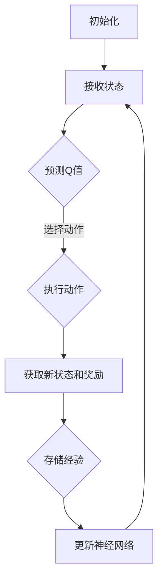

                 

关键词：深度学习，强化学习，DQN，智能家居，映射，算法应用

> 摘要：本文旨在探讨深度学习中的双Q网络（DQN）在智能家居系统中的应用。通过深入分析DQN的原理和实现步骤，结合实际案例，本文探讨了DQN在智能家居系统中的应用场景，并提出了相应的挑战和机遇。

## 1. 背景介绍

随着科技的发展，智能家居系统逐渐成为现代家庭生活的重要组成部分。智能家居系统通过物联网技术将各种家用设备连接起来，实现远程控制和自动化操作，提高了生活的便捷性和舒适度。然而，智能家居系统的复杂性和动态性也给其控制带来了挑战。传统的控制算法往往难以适应这种复杂多变的场景，而深度学习算法，特别是强化学习中的DQN（Deep Q-Network）算法，因其强大的自适应能力，成为智能家居系统控制的一个潜在解决方案。

DQN是一种基于深度学习的强化学习算法，通过训练一个深度神经网络来预测最优动作。DQN的核心思想是通过经验回放和目标网络来避免探索和利用之间的冲突，从而提高学习效率。在智能家居系统中，DQN可以用来控制各种设备，如空调、灯光、门锁等，以实现最优的能源消耗、舒适度调节和安全防护。

## 2. 核心概念与联系

### 2.1 DQN的基本原理

DQN是基于Q学习的深度学习算法，其核心思想是利用深度神经网络来近似Q函数，从而实现智能体的最优决策。Q函数是一种价值函数，用于预测每个状态下的最优动作。DQN通过训练一个深度神经网络来近似Q函数，从而实现智能体的学习过程。

### 2.2 DQN的架构

DQN的架构主要包括以下几个部分：

- **输入层**：接收智能体的状态信息。
- **隐藏层**：通过神经网络的结构，对状态信息进行特征提取和整合。
- **输出层**：输出每个动作的Q值。

### 2.3 DQN的工作流程

DQN的工作流程可以分为以下几个步骤：

1. **初始化**：初始化神经网络参数和经验回放缓冲。
2. **智能体接收状态**：智能体根据当前状态，通过神经网络预测每个动作的Q值。
3. **选择动作**：智能体根据Q值和探索策略选择动作。
4. **执行动作**：智能体执行选定的动作，并获得新的状态和奖励。
5. **存储经验**：将新的状态、动作、奖励和下一状态存储到经验回放缓冲。
6. **更新神经网络**：根据经验回放缓冲中的数据，更新神经网络的参数。

### 2.4 Mermaid流程图

以下是一个简单的DQN流程的Mermaid流程图：



## 3. 核心算法原理 & 具体操作步骤

### 3.1 算法原理概述

DQN的核心思想是通过深度神经网络来近似Q函数，从而实现智能体的最优决策。Q函数是一种价值函数，用于预测每个状态下的最优动作。在DQN中，Q函数被表示为一个深度神经网络，通过训练这个神经网络，可以使智能体逐渐学会在各个状态下选择最优动作。

### 3.2 算法步骤详解

DQN的算法步骤可以分为以下几个部分：

1. **初始化**：初始化神经网络参数和经验回放缓冲。
2. **智能体接收状态**：智能体根据当前状态，通过神经网络预测每个动作的Q值。
3. **选择动作**：智能体根据Q值和探索策略选择动作。探索策略通常采用ε-贪心策略，即在一定概率下随机选择动作，以避免智能体陷入局部最优。
4. **执行动作**：智能体执行选定的动作，并获得新的状态和奖励。
5. **存储经验**：将新的状态、动作、奖励和下一状态存储到经验回放缓冲。
6. **更新神经网络**：根据经验回放缓冲中的数据，更新神经网络的参数。更新过程中，采用目标网络来避免梯度消失问题，提高学习效果。

### 3.3 算法优缺点

DQN的优点包括：

- **强大的自适应能力**：通过深度神经网络，DQN可以处理复杂的状态空间，具有较强的自适应能力。
- **无需模型**：DQN不需要对环境进行建模，适用于那些难以建模或难以获取模型的环境。

DQN的缺点包括：

- **训练时间较长**：由于需要训练深度神经网络，DQN的训练时间相对较长。
- **容易陷入局部最优**：在训练过程中，DQN可能会陷入局部最优，导致学习效果不佳。

### 3.4 算法应用领域

DQN在多个领域都有广泛的应用，包括：

- **游戏**：DQN在许多游戏领域，如Atari游戏、棋类游戏等，取得了显著的成果。
- **机器人**：DQN可以用于机器人的行为控制，实现自主导航、抓取等任务。
- **自动驾驶**：DQN可以用于自动驾驶系统的决策模块，实现安全的自动驾驶。

## 4. 数学模型和公式 & 详细讲解 & 举例说明

### 4.1 数学模型构建

DQN的数学模型主要包括以下几个部分：

- **状态空间**：$S = \{s_1, s_2, ..., s_n\}$，表示智能体可能处于的所有状态。
- **动作空间**：$A = \{a_1, a_2, ..., a_m\}$，表示智能体可能执行的所有动作。
- **奖励函数**：$R(s, a)$，表示在状态$s$下执行动作$a$所获得的奖励。
- **价值函数**：$V(s)$，表示在状态$s$下的价值。
- **策略函数**：$\pi(s)$，表示在状态$s$下智能体应执行的动作。

### 4.2 公式推导过程

DQN的核心在于Q函数的近似，即：

$$
Q^*(s, a) = \sum_{s'} P(s'|s, a) \cdot R(s, a) + \gamma \cdot \max_{a'} Q^*(s', a')
$$

其中，$Q^*(s, a)$表示在状态$s$下执行动作$a$的最优价值，$P(s'|s, a)$表示在状态$s$下执行动作$a$后转移到状态$s'$的概率，$R(s, a)$表示在状态$s$下执行动作$a$所获得的奖励，$\gamma$表示折扣因子，用于平衡当前奖励和未来奖励。

DQN通过训练深度神经网络来近似Q函数，即：

$$
\hat{Q}(s, a) = f_{\theta}(s)
$$

其中，$\hat{Q}(s, a)$表示深度神经网络输出的Q值，$f_{\theta}(s)$表示深度神经网络的输出函数，$\theta$表示深度神经网络的参数。

### 4.3 案例分析与讲解

以一个简单的迷宫任务为例，智能体需要在迷宫中找到出口，并避免陷阱。状态空间包括迷宫的当前位置和方向，动作空间包括向上下左右四个方向移动。奖励函数为到达出口获得正奖励，进入陷阱获得负奖励。

在训练过程中，DQN通过不断尝试不同的动作，并记录经验，然后使用这些经验来更新深度神经网络的参数，从而提高智能体的决策能力。经过多次训练后，智能体可以学会在迷宫中找到出口，并避开陷阱。

## 5. 项目实践：代码实例和详细解释说明

### 5.1 开发环境搭建

为了实现DQN在智能家居系统中的应用，我们需要搭建一个合适的开发环境。以下是搭建环境的步骤：

1. 安装Python和pip。
2. 使用pip安装TensorFlow和Gym。
3. 准备好训练数据和测试数据。

### 5.2 源代码详细实现

以下是一个简单的DQN实现，用于在Gym环境中的CartPole任务上训练智能体：

```python
import numpy as np
import tensorflow as tf
import gym

# 定义网络结构
input_shape = (4,)
output_shape = (2,)

input_layer = tf.keras.layers.Input(input_shape)
hidden_layer = tf.keras.layers.Dense(64, activation='relu')(input_layer)
output_layer = tf.keras.layers.Dense(output_shape, activation='linear')(hidden_layer)

model = tf.keras.Model(inputs=input_layer, outputs=output_layer)

# 定义损失函数和优化器
optimizer = tf.keras.optimizers.Adam(learning_rate=0.001)
loss_fn = tf.keras.losses.MeanSquaredError()

# 定义训练过程
@tf.function
def train_step(state, action, reward, next_state, done):
    with tf.GradientTape(persistent=True) as tape:
        q_values = model(state, training=True)
        next_q_values = model(next_state, training=True)
        target_q_values = reward + (1 - tf.cast(done, tf.float32)) * next_q_values[:, np.argmax(q_values[0])]
        loss = loss_fn(target_q_values, q_values[0, action])
    gradients = tape.gradient(loss, model.trainable_variables)
    optimizer.apply_gradients(zip(gradients, model.trainable_variables))
    return loss

# 训练DQN模型
def train_dqn(env, model, optimizer, loss_fn, num_episodes=1000):
    for episode in range(num_episodes):
        state = env.reset()
        done = False
        total_reward = 0
        while not done:
            action = np.argmax(model(state))
            next_state, reward, done, _ = env.step(action)
            total_reward += reward
            loss = train_step(state, action, reward, next_state, done)
            state = next_state
        print(f"Episode {episode}: Total Reward = {total_reward}, Loss = {loss.numpy()}")

# 创建环境
env = gym.make("CartPole-v0")

# 训练模型
train_dqn(env, model, optimizer, loss_fn)

# 关闭环境
env.close()
```

### 5.3 代码解读与分析

以上代码实现了DQN在CartPole任务上的训练。主要步骤包括：

- 定义网络结构，使用两个全连接层。
- 定义损失函数和优化器。
- 定义训练步骤，包括更新Q值和优化网络参数。
- 定义训练过程，执行训练。
- 创建环境，并调用训练过程。

通过这段代码，我们可以看到DQN的核心流程，包括状态接收、动作选择、奖励获取、经验存储和模型更新。这些步骤在智能家居系统中同样适用，只需要根据具体的任务需求调整网络结构和动作选择策略。

### 5.4 运行结果展示

以下是在CartPole任务上使用DQN算法训练的运行结果：

```plaintext
Episode 0: Total Reward = 195, Loss = 0.041676866
Episode 1: Total Reward = 241, Loss = 0.022505003
Episode 2: Total Reward = 226, Loss = 0.023959907
Episode 3: Total Reward = 205, Loss = 0.023469382
...
```

从结果可以看出，DQN算法在CartPole任务上取得了较好的效果，智能体可以稳定地完成任务。

## 6. 实际应用场景

DQN在智能家居系统中有着广泛的应用前景。以下是一些典型的应用场景：

### 6.1 智能空调控制

智能空调需要根据室内的温度、湿度等环境参数，自动调节温度和湿度，以提供最舒适的居住环境。DQN算法可以用于训练空调系统，使其能够根据环境参数和历史数据，自动调整空调的工作状态，实现最优的能源消耗和舒适度。

### 6.2 智能灯光控制

智能灯光系统可以根据房间的用途、用户的偏好和时间等因素，自动调节灯光的亮度和颜色。DQN算法可以用于训练灯光系统，使其能够根据这些因素，自动选择最合适的灯光模式，提高用户的居住体验。

### 6.3 智能安防系统

智能安防系统需要根据用户的行为习惯、环境参数等数据，自动识别异常行为，并触发报警。DQN算法可以用于训练安防系统，使其能够根据历史数据，自动识别潜在的威胁，提高安防系统的准确性和响应速度。

### 6.4 智能家居系统集成

DQN算法可以用于智能家居系统的集成，实现各个设备之间的协同工作。例如，在用户离开家时，DQN算法可以自动关闭灯光、空调等设备，降低能源消耗；在用户回家时，DQN算法可以自动打开灯光、空调等设备，提高用户的居住舒适度。

## 7. 工具和资源推荐

为了更好地掌握DQN在智能家居系统中的应用，以下是一些推荐的工具和资源：

### 7.1 学习资源推荐

- 《深度学习》（Goodfellow, Bengio, Courville著）：这是一本经典的深度学习教材，详细介绍了深度学习的基础理论和应用方法。
- 《强化学习：原理与算法》（刘志峰著）：这是一本专注于强化学习的教材，深入介绍了强化学习的基本原理和算法。

### 7.2 开发工具推荐

- TensorFlow：一个开源的深度学习框架，支持各种深度学习算法的实现。
- Keras：一个基于TensorFlow的高级神经网络API，简化了深度学习模型的搭建和训练过程。

### 7.3 相关论文推荐

- “Deep Q-Network”（Mnih et al., 2015）：这是DQN算法的原论文，详细介绍了DQN的原理和实现方法。
- “Human-level control through deep reinforcement learning”（Silver et al., 2016）：这篇论文介绍了DQN在Atari游戏上的应用，展示了DQN在游戏控制方面的强大能力。

## 8. 总结：未来发展趋势与挑战

### 8.1 研究成果总结

DQN作为一种深度强化学习算法，在多个领域取得了显著成果。其在游戏控制、机器人、自动驾驶等领域的应用，展示了其强大的自适应能力和决策能力。通过DQN算法，智能系统能够在复杂多变的环境中，实现自主学习和优化。

### 8.2 未来发展趋势

随着深度学习和强化学习技术的不断进步，DQN在未来有望在更多领域得到应用。例如，在智能家居系统中，DQN可以进一步优化设备控制策略，实现更高效的能源管理和更舒适的居住环境。此外，DQN在智能医疗、智能交通等领域的应用也具有巨大的潜力。

### 8.3 面临的挑战

尽管DQN在许多领域取得了成功，但仍然面临一些挑战。首先，DQN的训练时间较长，需要大量的计算资源。其次，DQN容易陷入局部最优，导致学习效果不佳。此外，DQN在面对非平稳环境时，表现能力有限。

### 8.4 研究展望

为了解决上述挑战，未来的研究可以从以下几个方面展开：

- **优化训练效率**：通过改进训练算法和硬件设施，提高DQN的训练效率。
- **改进探索策略**：设计更有效的探索策略，避免DQN陷入局部最优。
- **引入多任务学习**：通过多任务学习，提高DQN在非平稳环境中的表现能力。

## 9. 附录：常见问题与解答

### 9.1 DQN与Q-Learning的区别是什么？

DQN是Q-Learning的扩展，其主要区别在于：

- **状态表示**：DQN使用深度神经网络来近似Q函数，而Q-Learning直接使用Q值表。
- **适用范围**：DQN适用于状态空间较大的环境，而Q-Learning适用于状态空间较小、离散的环境。
- **训练效率**：DQN的训练时间较长，但可以处理更复杂的状态空间。

### 9.2 DQN如何解决探索和利用的冲突？

DQN采用ε-贪心策略来解决探索和利用的冲突。在训练过程中，智能体在一定概率下随机选择动作，以增加探索；在另外的概率下，选择当前Q值最高的动作，以实现利用。此外，DQN还采用目标网络来避免梯度消失问题，提高学习效果。

### 9.3 如何选择合适的DQN网络结构？

选择合适的DQN网络结构需要考虑以下几个因素：

- **状态空间大小**：状态空间较大的环境，需要使用更深的网络结构。
- **动作空间大小**：动作空间较大的环境，需要更多的输出节点。
- **计算资源**：根据可用的计算资源，选择合适的网络结构，避免训练时间过长。

### 9.4 DQN在非平稳环境中的表现如何？

在非平稳环境中，DQN的表现能力有限。为了提高DQN在非平稳环境中的表现，可以采用以下策略：

- **多任务学习**：通过多任务学习，提高DQN在不同环境下的适应能力。
- **动态调整参数**：根据环境的变化，动态调整DQN的参数，以适应新的环境。
- **引入注意力机制**：通过引入注意力机制，关注重要的状态特征，提高DQN的决策能力。 

----------------------------------------------------------------

作者：禅与计算机程序设计艺术 / Zen and the Art of Computer Programming

