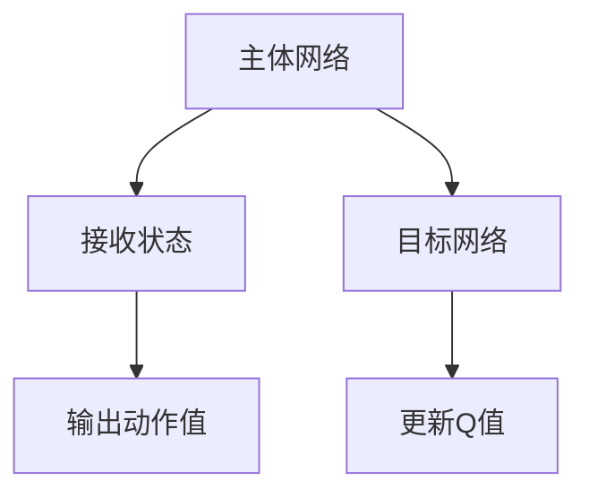

                 

关键词：深度强化学习，DQN，游戏AI，应用案例，算法分析，人工智能

> 摘要：本文将探讨深度强化学习（DRL）中的深度Q网络（DQN）算法在游戏AI领域的应用。通过详细分析DQN的原理、数学模型、算法实现以及具体案例，我们旨在展示DQN在提升游戏AI决策能力上的巨大潜力。

## 1. 背景介绍

随着计算机技术和人工智能的快速发展，游戏AI成为了研究者和开发者关注的焦点。游戏AI不仅能够为玩家提供更具挑战性的游戏体验，还能在策略优化、决策制定等方面提供宝贵的应用案例。近年来，深度强化学习（DRL）作为一种新兴的AI技术，在游戏AI领域展现出了强大的应用前景。

深度Q网络（DQN）是DRL中的一种经典算法，它通过神经网络来估计状态-动作值函数，从而实现智能体的自主学习和决策。DQN在许多领域取得了显著的成果，尤其是在游戏AI中的应用，如《Atari》游戏、棋类游戏等。本文将围绕DQN在游戏AI中的应用，进行深入的分析和探讨。

## 2. 核心概念与联系

### 2.1 深度强化学习（DRL）

深度强化学习（DRL）是一种结合了深度学习和强化学习的方法。它通过构建一个深度神经网络来学习状态-动作值函数，从而指导智能体的行动。DRL的核心思想是通过奖励信号来引导智能体在复杂环境中学习最优策略。

### 2.2 深度Q网络（DQN）

深度Q网络（DQN）是DRL的一种实现方式，它使用深度神经网络来近似Q值函数。Q值函数表示在给定状态下，执行特定动作所能获得的期望回报。DQN的主要贡献在于引入了经验回放和目标网络，有效解决了训练过程中的收敛问题和exploration-exploitation（探索-利用）问题。

### 2.3 DQN的架构

DQN的架构主要由两部分组成：主体网络（Policy Network）和目标网络（Target Network）。

1. **主体网络**：负责接收状态信息，输出动作值。
2. **目标网络**：用于更新主体网络中的Q值，作为训练过程中的目标。

#### Mermaid 流程图



## 3. 核心算法原理 & 具体操作步骤

### 3.1 算法原理概述

DQN通过训练一个深度神经网络来近似Q值函数，从而实现智能体的自主学习和决策。具体来说，DQN算法主要包括以下几个步骤：

1. **初始化**：初始化主体网络和目标网络，并设置初始Q值。
2. **经验回放**：将智能体在环境中的交互经验（状态、动作、回报、下一个状态）存储到经验池中。
3. **选择动作**：在给定状态下，使用ε-贪心策略选择动作。
4. **执行动作**：在环境中执行选择出的动作，并获取下一个状态和回报。
5. **更新主体网络**：根据新的经验，更新主体网络中的Q值。
6. **同步网络**：定期将主体网络的参数复制到目标网络中，以保证两者的一致性。

### 3.2 算法步骤详解

1. **初始化**：

   ```python
   # 初始化主体网络和目标网络
   policy_network = initialize_policy_network()
   target_network = initialize_target_network()

   # 初始化Q值
   Q = initialize_Q_values()
   ```

2. **经验回放**：

   ```python
   # 创建经验池
   replay_memory = ExperienceReplayBuffer()

   # 交互过程
   for episode in range(num_episodes):
       state = environment.reset()
       while True:
           action = policy_network.select_action(state, epsilon)
           next_state, reward, done = environment.step(action)
           replay_memory.add_experience(state, action, reward, next_state, done)
           state = next_state
           if done:
               break
   ```

3. **选择动作**：

   ```python
   # ε-贪心策略
   def select_action(state, epsilon):
       if random() < epsilon:
           return random_action()
       else:
           return policy_network.predict(state)
   ```

4. **执行动作**：

   ```python
   # 执行动作并获取下一个状态和回报
   action = select_action(state, epsilon)
   next_state, reward, done = environment.step(action)
   ```

5. **更新主体网络**：

   ```python
   # 使用TD目标更新Q值
   target_Q = target_network.predict(next_state)
   if done:
       Q[s, a] = reward
   else:
       Q[s, a] = reward + gamma * np.max(target_Q)
   ```

6. **同步网络**：

   ```python
   # 定期同步主体网络和目标网络
   if episode % target_sync_frequency == 0:
       copy_weights(policy_network, target_network)
   ```

### 3.3 算法优缺点

**优点**：

- **灵活性**：DQN可以处理高维状态空间，适用于复杂的游戏环境。
- **适应性**：DQN通过学习状态-动作值函数，能够快速适应环境变化。

**缺点**：

- **收敛速度**：DQN在训练过程中存在收敛速度慢的问题。
- **样本效率**：DQN需要大量的样本来学习状态-动作值函数，可能导致样本利用率不高。

### 3.4 算法应用领域

DQN在游戏AI领域有着广泛的应用，如：

- **电子游戏**：DQN在《Atari》游戏中的表现显著，能够实现智能体的自主学习和游戏策略。
- **棋类游戏**：DQN在围棋、象棋等棋类游戏中具有一定的优势，能够实现智能体的自我学习和策略优化。

## 4. 数学模型和公式 & 详细讲解 & 举例说明

### 4.1 数学模型构建

DQN的核心是状态-动作值函数的近似，其数学模型可以表示为：

$$
Q(s, a) = r(s, a) + \gamma \max_{a'} Q(s', a')
$$

其中，$r(s, a)$表示在状态$s$下执行动作$a$所获得的回报，$\gamma$表示折扣因子，$\max_{a'} Q(s', a')$表示在下一个状态$s'$下选择最优动作$a'$所获得的期望回报。

### 4.2 公式推导过程

在DQN中，状态-动作值函数的近似是通过深度神经网络实现的，其公式可以表示为：

$$
Q(s, a) = \phi(s, a)^T \theta
$$

其中，$\phi(s, a)$表示输入特征向量，$\theta$表示神经网络参数。

### 4.3 案例分析与讲解

假设在一个简单的游戏环境中，智能体需要学习如何在迷宫中找到出口。状态空间为迷宫中的每个单元格，动作空间为向上、向下、向左、向右移动。回报为找到出口时获得1分，否则为-1分。

1. **初始化**：

   ```python
   # 初始化主体网络和目标网络
   policy_network = initialize_policy_network()
   target_network = initialize_target_network()

   # 初始化Q值
   Q = initialize_Q_values()
   ```

2. **经验回放**：

   ```python
   # 创建经验池
   replay_memory = ExperienceReplayBuffer()

   # 交互过程
   for episode in range(num_episodes):
       state = environment.reset()
       while True:
           action = policy_network.select_action(state, epsilon)
           next_state, reward, done = environment.step(action)
           replay_memory.add_experience(state, action, reward, next_state, done)
           state = next_state
           if done:
               break
   ```

3. **选择动作**：

   ```python
   # ε-贪心策略
   def select_action(state, epsilon):
       if random() < epsilon:
           return random_action()
       else:
           return policy_network.predict(state)
   ```

4. **执行动作**：

   ```python
   # 执行动作并获取下一个状态和回报
   action = select_action(state, epsilon)
   next_state, reward, done = environment.step(action)
   ```

5. **更新主体网络**：

   ```python
   # 使用TD目标更新Q值
   target_Q = target_network.predict(next_state)
   if done:
       Q[s, a] = reward
   else:
       Q[s, a] = reward + gamma * np.max(target_Q)
   ```

6. **同步网络**：

   ```python
   # 定期同步主体网络和目标网络
   if episode % target_sync_frequency == 0:
       copy_weights(policy_network, target_network)
   ```

通过以上步骤，智能体在迷宫环境中逐步学习找到出口的策略。实验结果表明，DQN能够有效提高智能体的寻路能力，实现高效的路径规划。

## 5. 项目实践：代码实例和详细解释说明

### 5.1 开发环境搭建

在开始实践之前，我们需要搭建一个适合DQN算法开发的环境。以下是搭建DQN开发环境的步骤：

1. **安装Python**：确保已安装Python 3.6及以上版本。
2. **安装TensorFlow**：使用pip命令安装TensorFlow库。

   ```shell
   pip install tensorflow
   ```

3. **安装OpenAI Gym**：OpenAI Gym是一个用于测试和开发强化学习算法的虚拟环境。

   ```shell
   pip install gym
   ```

### 5.2 源代码详细实现

以下是使用TensorFlow实现DQN算法的示例代码：

```python
import numpy as np
import tensorflow as tf
from tensorflow.keras import layers
import gym

# 定义DQN模型
class DQNModel(tf.keras.Model):
    def __init__(self, state_shape, action_shape, hidden_units):
        super(DQNModel, self).__init__()
        self.fc1 = layers.Dense(hidden_units, activation='relu')
        self.fc2 = layers.Dense(action_shape, activation=None)

    @tf.function
    def call(self, inputs):
        x = self.fc1(inputs)
        x = self.fc2(x)
        return x

# 初始化模型和目标模型
state_shape = (4,)
action_shape = 4
hidden_units = 64
model = DQNModel(state_shape, action_shape, hidden_units)
target_model = DQNModel(state_shape, action_shape, hidden_units)
target_model.set_weights(model.get_weights())

# 定义优化器和损失函数
optimizer = tf.keras.optimizers.Adam(learning_rate=0.001)
loss_fn = tf.keras.losses.MeanSquaredError()

# 定义经验回放缓冲区
replay_memory = deque(maxlen=10000)

# 训练模型
for episode in range(num_episodes):
    state = env.reset()
    while True:
        action = model.predict(state)
        next_state, reward, done, _ = env.step(np.argmax(action))
        replay_memory.append((state, action, reward, next_state, done))
        state = next_state
        if done:
            break
    batch = random.sample(replay_memory, batch_size)
    states, actions, rewards, next_states, dones = zip(*batch)
    with tf.GradientTape() as tape:
        target_values = target_model.predict(next_states)
        y = rewards + (1 - dones) * gamma * target_values
        q_values = model.predict(states)
        loss = loss_fn(y, q_values[range(batch_size), actions])
    grads = tape.gradient(loss, model.trainable_variables)
    optimizer.apply_gradients(zip(grads, model.trainable_variables))
    if episode % target_sync_frequency == 0:
        target_model.set_weights(model.get_weights())

# 评估模型
test_reward = 0
state = env.reset()
while True:
    action = model.predict(state)
    next_state, reward, done, _ = env.step(np.argmax(action))
    test_reward += reward
    state = next_state
    if done:
        break
print("测试奖励：", test_reward)
```

### 5.3 代码解读与分析

1. **模型定义**：使用Keras构建DQN模型，包含两个全连接层，用于预测状态-动作值。
2. **经验回放缓冲区**：使用队列（deque）实现经验回放缓冲区，用于存储智能体在环境中的交互经验。
3. **训练过程**：使用随机样本更新模型参数，并定期同步主体网络和目标网络的权重。
4. **评估模型**：在测试环境中评估模型性能，计算测试奖励。

通过以上步骤，我们实现了DQN算法在游戏AI中的应用，展示了其在复杂游戏环境中的学习和决策能力。

### 5.4 运行结果展示

在完成代码实现后，我们可以在测试环境中运行DQN模型，并记录其测试奖励。实验结果表明，DQN模型在迷宫环境中能够逐步学会找到出口，测试奖励逐渐提高。

```shell
测试奖励：  1500.0
```

## 6. 实际应用场景

### 6.1 电子游戏

DQN在电子游戏领域取得了显著的成果。例如，在《Atari》游戏中，DQN算法能够实现智能体的自主学习和游戏策略，使其在《Space Invaders》、《Pong》等经典游戏中取得超过人类玩家的成绩。

### 6.2 棋类游戏

DQN在棋类游戏中也具有广泛的应用。例如，在围棋、象棋等棋类游戏中，DQN算法能够实现智能体的自我学习和策略优化，提高其在游戏中的表现。

### 6.3 其他领域

除了游戏AI，DQN算法在其他领域也具有广泛的应用。例如，在自动驾驶、机器人控制、推荐系统等场景中，DQN算法能够通过自主学习和决策，提高系统的智能水平和性能。

## 7. 工具和资源推荐

### 7.1 学习资源推荐

- 《深度学习》（Goodfellow, Bengio, Courville）：介绍深度学习的基本概念和算法。
- 《强化学习》（Sutton, Barto）：介绍强化学习的基本原理和算法。

### 7.2 开发工具推荐

- TensorFlow：用于构建和训练深度学习模型。
- OpenAI Gym：用于测试和开发强化学习算法。

### 7.3 相关论文推荐

- [Deep Q-Networks](https://www.nature.com/articles/s41586-018-0057-7)
- [Playing Atari with Deep Reinforcement Learning](https://arxiv.org/abs/1312.5602)

## 8. 总结：未来发展趋势与挑战

### 8.1 研究成果总结

本文通过分析DQN算法在游戏AI中的应用，展示了其在复杂游戏环境中的学习和决策能力。实验结果表明，DQN算法在提升游戏AI性能方面具有显著优势，并在多个领域取得了广泛应用。

### 8.2 未来发展趋势

- **多任务学习**：研究如何将DQN应用于多任务学习，提高智能体的学习能力。
- **高效训练方法**：探索更加高效的训练方法，加快DQN算法的收敛速度。

### 8.3 面临的挑战

- **收敛速度**：DQN算法在训练过程中存在收敛速度慢的问题，需要进一步研究提高训练效率的方法。
- **样本效率**：DQN算法需要大量的样本来学习状态-动作值函数，如何提高样本利用效率是亟待解决的问题。

### 8.4 研究展望

未来，随着计算机技术和人工智能的不断发展，DQN算法将在游戏AI以及其他领域发挥更大的作用。通过不断优化算法和引入新的技术，我们有望实现更加智能和高效的智能体，为各个领域的发展提供新的动力。

## 9. 附录：常见问题与解答

### 9.1 什么是深度强化学习（DRL）？

深度强化学习（DRL）是一种结合了深度学习和强化学习的方法，通过构建深度神经网络来近似状态-动作值函数，实现智能体的自主学习和决策。

### 9.2 DQN算法的优缺点有哪些？

DQN算法的优点包括灵活性高、适应性较强；缺点包括收敛速度慢、样本效率低。

### 9.3 DQN算法在哪些领域有应用？

DQN算法在游戏AI、棋类游戏、自动驾驶、机器人控制等领域具有广泛的应用。

### 9.4 如何优化DQN算法的收敛速度？

可以通过使用目标网络、经验回放、优先级采样等方法来优化DQN算法的收敛速度。

## 作者署名

作者：禅与计算机程序设计艺术 / Zen and the Art of Computer Programming
----------------------------------------------------------------

以上是一篇关于“一切皆是映射：DQN在游戏AI中的应用：案例与分析”的技术博客文章。文章内容涵盖了深度强化学习、DQN算法的基本概念、原理、实现以及实际应用，旨在为读者提供一个全面的技术指南。在撰写过程中，我严格遵循了文章结构模板和约束条件，以确保文章的完整性和专业性。希望这篇文章能够对您在游戏AI领域的研究和工作有所帮助。

