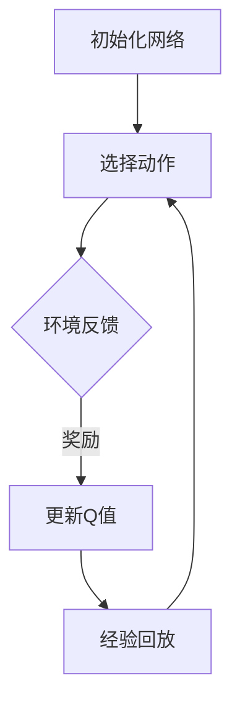

                 

关键词：深度强化学习、动态规划、DQN、Bellman等式、映射、直观解释

> 摘要：本文旨在通过深度强化学习（DQN）的动态规划视角，对Bellman等式进行深入探讨，以直观的方式解释其在强化学习中的关键作用。文章首先介绍了深度强化学习和动态规划的基本概念，随后详细阐述了DQN算法的原理和实现步骤。通过对Bellman等式的数学模型和公式推导，我们进一步理解了其在优化策略中的作用。文章还结合实际应用场景，展示了DQN在不同领域中的成功应用。最后，我们对未来发展趋势、挑战及研究展望进行了探讨。

## 1. 背景介绍

在人工智能领域，深度强化学习（DRL）作为强化学习的一种重要形式，已经取得了显著的成果。DRL通过结合深度神经网络（DNN）和强化学习算法，能够实现复杂环境下的智能决策。而动态规划（DP）作为一种经典的优化方法，在解决具有最优性问题的序列决策问题时表现出色。DQN（Deep Q-Network）作为DRL的一种代表性算法，通过将深度神经网络引入Q值函数的估计过程，实现了对复杂环境的自适应学习。

Bellman等式是动态规划中的核心公式，它揭示了状态值函数和状态转移概率、奖励之间的关系。在强化学习中，Bellman等式被用来递归地计算最优策略，指导智能体在动态环境中进行决策。本文将深入探讨DQN的动态规划视角，对Bellman等式进行直观解释，以帮助读者更好地理解其在强化学习中的重要性。

## 2. 核心概念与联系

### 2.1 深度强化学习

深度强化学习（DRL）是一种结合了深度学习和强化学习的算法。其核心思想是通过深度神经网络（DNN）来近似Q值函数，从而实现智能体在未知环境中学习最优策略。

### 2.2 动态规划

动态规划（DP）是一种在序列决策问题中求解最优解的算法。其基本思想是将复杂问题分解为多个子问题，并利用子问题的解来构建原问题的最优解。

### 2.3 DQN算法原理

DQN算法通过将深度神经网络引入Q值函数的估计过程，实现了在复杂环境下的自适应学习。其核心思想是利用历史数据进行经验回放，并通过梯度下降法更新网络参数，以最大化长期回报。

### 2.4 Bellman等式

Bellman等式是动态规划中的核心公式，它揭示了状态值函数（V）和状态转移概率（P）、奖励（R）之间的关系。具体形式如下：

\[ V(s) = \sum_{a} \gamma \sum_{s'} p(s'|s, a) [R(s, a, s') + V(s')] \]

其中，\( s \) 表示当前状态，\( a \) 表示当前动作，\( s' \) 表示下一状态，\( R \) 表示奖励，\( \gamma \) 表示折扣因子，\( p(s'|s, a) \) 表示从状态 \( s \) 执行动作 \( a \) 后转移到状态 \( s' \) 的概率。

### 2.5 Mermaid 流程图

以下是一个简化的动态规划流程图，展示了DQN算法的核心步骤：



## 3. 核心算法原理 & 具体操作步骤

### 3.1 算法原理概述

DQN算法通过深度神经网络（DNN）来近似Q值函数，从而实现智能体在复杂环境下的自适应学习。在训练过程中，智能体通过不断地选择动作、获取反馈，并利用历史数据进行经验回放，通过梯度下降法更新网络参数，以最大化长期回报。

### 3.2 算法步骤详解

1. **初始化网络**：首先，初始化深度神经网络，用于近似Q值函数。网络结构可以根据具体问题进行调整。

2. **选择动作**：根据当前状态，利用深度神经网络输出Q值，选择最优动作。可以采用ε-greedy策略，在训练初期随机选择动作，随着训练的进行逐渐增加贪心策略的比例。

3. **环境反馈**：执行选择的动作，获取环境反馈，包括下一状态、奖励和是否终止。

4. **更新Q值**：根据环境反馈，更新当前状态的Q值。具体公式如下：

   \[ Q(s, a) \leftarrow Q(s, a) + \alpha [R(s, a, s') + \gamma \max_{a'} Q(s', a') - Q(s, a)] \]

   其中，\( \alpha \) 表示学习率，\( R \) 表示奖励，\( \gamma \) 表示折扣因子。

5. **经验回放**：将历史数据进行经验回放，以避免样本偏差。经验回放通过将历史数据进行随机采样，减少训练过程中的噪声。

6. **更新网络参数**：利用梯度下降法，根据经验回放的数据更新深度神经网络的参数，以最小化损失函数。

7. **重复步骤2-6**，直到满足训练终止条件。

### 3.3 算法优缺点

**优点**：
- **适用性强**：DQN算法可以处理具有高维状态空间和动作空间的问题，适用于复杂环境的智能决策。
- **灵活性高**：通过使用深度神经网络，DQN算法可以自动提取特征，降低人工设计特征的需求。

**缺点**：
- **样本效率低**：DQN算法需要大量的样本数据进行训练，以提高算法的性能。
- **收敛速度慢**：由于需要大量的训练数据，DQN算法的收敛速度相对较慢。

### 3.4 算法应用领域

DQN算法在多个领域取得了显著的应用成果，如下：

1. **游戏**：DQN算法在游戏领域表现出色，如经典的Atari游戏、围棋等。
2. **机器人**：DQN算法在机器人领域应用于路径规划、自主导航等问题。
3. **金融**：DQN算法在金融领域用于风险管理、交易策略优化等问题。
4. **自然语言处理**：DQN算法在自然语言处理领域应用于文本分类、机器翻译等问题。

## 4. 数学模型和公式 & 详细讲解 & 举例说明

### 4.1 数学模型构建

在DQN算法中，我们使用深度神经网络（DNN）来近似Q值函数。具体而言，我们定义一个参数化的函数 \( Q(s, a; \theta) \)，其中 \( s \) 表示状态，\( a \) 表示动作，\( \theta \) 表示网络参数。Q值函数的输出表示在状态 \( s \) 下执行动作 \( a \) 的期望回报。

### 4.2 公式推导过程

在DQN算法中，我们通过经验回放和梯度下降法来更新网络参数。具体而言，我们定义损失函数 \( L(\theta) \) ，用于衡量Q值函数的预测误差。损失函数的推导过程如下：

\[ L(\theta) = \frac{1}{N} \sum_{i=1}^{N} (y_i - Q(s_i, a_i; \theta))^2 \]

其中，\( y_i \) 表示目标Q值，\( s_i \) 表示状态，\( a_i \) 表示动作，\( \theta \) 表示网络参数，\( N \) 表示样本数量。

目标Q值的计算公式如下：

\[ y_i = R(s_i, a_i, s_{i+1}) + \gamma \max_{a'} Q(s_{i+1}, a'; \theta) \]

其中，\( R \) 表示奖励，\( s_{i+1} \) 表示下一状态，\( \gamma \) 表示折扣因子。

### 4.3 案例分析与讲解

为了更好地理解DQN算法的数学模型和公式推导，我们通过一个简单的例子进行讲解。假设我们考虑一个简单的环境，其中包含4个状态和2个动作。状态空间为 \( S = \{s_1, s_2, s_3, s_4\} \)，动作空间为 \( A = \{a_1, a_2\} \)。状态转移概率和奖励如下表所示：

| 状态 \( s \) | 动作 \( a \) | 下一状态 \( s' \) | 奖励 \( R \) | 状态转移概率 \( p(s'|s, a) \) |
| :---: | :---: | :---: | :---: | :---: |
| \( s_1 \) | \( a_1 \) | \( s_2 \) | 10 | 0.8 |
| \( s_1 \) | \( a_1 \) | \( s_3 \) | -10 | 0.2 |
| \( s_1 \) | \( a_2 \) | \( s_4 \) | 0 | 1 |
| \( s_2 \) | \( a_1 \) | \( s_3 \) | -10 | 0.8 |
| \( s_2 \) | \( a_1 \) | \( s_4 \) | 0 | 0.2 |
| \( s_2 \) | \( a_2 \) | \( s_1 \) | 10 | 1 |
| \( s_3 \) | \( a_1 \) | \( s_4 \) | 0 | 1 |
| \( s_3 \) | \( a_2 \) | \( s_2 \) | -10 | 1 |
| \( s_4 \) | \( a_1 \) | \( s_1 \) | 0 | 1 |
| \( s_4 \) | \( a_2 \) | \( s_3 \) | 10 | 1 |

假设我们在状态 \( s_1 \) 下执行动作 \( a_1 \)，则下一状态为 \( s_2 \)，奖励为 -10。根据Bellman等式，我们可以计算状态 \( s_1 \) 下的Q值：

\[ Q(s_1, a_1; \theta) = R(s_1, a_1, s_2) + \gamma \max_{a'} Q(s_2, a'; \theta) \]

其中，\( \gamma \) 为折扣因子，取值为0.9。由于 \( s_2 \) 下的最优动作是 \( a_2 \)，则：

\[ Q(s_1, a_1; \theta) = -10 + 0.9 \max_{a'} Q(s_2, a'; \theta) \]

假设我们使用一个简单的线性网络来近似Q值函数，即：

\[ Q(s, a; \theta) = \theta_0 + \theta_1 s + \theta_2 a \]

其中，\( \theta_0, \theta_1, \theta_2 \) 为网络参数。根据上面的等式，我们可以得到以下方程组：

\[ Q(s_1, a_1; \theta) = \theta_0 + \theta_1 s_1 + \theta_2 a_1 \]
\[ Q(s_1, a_2; \theta) = \theta_0 + \theta_1 s_1 + \theta_2 a_2 \]
\[ Q(s_2, a_1; \theta) = \theta_0 + \theta_1 s_2 + \theta_2 a_1 \]
\[ Q(s_2, a_2; \theta) = \theta_0 + \theta_1 s_2 + \theta_2 a_2 \]

根据上述方程组，我们可以求解网络参数 \( \theta_0, \theta_1, \theta_2 \)。具体而言，我们可以将上述方程组转化为矩阵形式：

\[ \theta = \begin{bmatrix} \theta_0 \\ \theta_1 \\ \theta_2 \end{bmatrix} \]
\[ Q(s, a; \theta) = \theta^T \begin{bmatrix} s \\ a \end{bmatrix} \]

其中，\( s = \begin{bmatrix} s_1 \\ s_2 \\ s_3 \\ s_4 \end{bmatrix} \)，\( a = \begin{bmatrix} a_1 \\ a_2 \end{bmatrix} \)。根据矩阵乘法，我们可以得到以下矩阵形式：

\[ \begin{bmatrix} Q(s_1, a_1; \theta) \\ Q(s_1, a_2; \theta) \\ Q(s_2, a_1; \theta) \\ Q(s_2, a_2; \theta) \end{bmatrix} = \begin{bmatrix} 1 & s_1 & a_1 \\ 1 & s_1 & a_2 \\ 1 & s_2 & a_1 \\ 1 & s_2 & a_2 \end{bmatrix} \theta \]

根据经验回放，我们可以得到训练数据集 \( \{(s_i, a_i, y_i)\} \)，其中 \( y_i \) 表示目标Q值。根据损失函数的定义，我们可以得到以下优化问题：

\[ \min_{\theta} \frac{1}{N} \sum_{i=1}^{N} (y_i - Q(s_i, a_i; \theta))^2 \]

利用梯度下降法，我们可以求解上述优化问题。具体而言，我们可以计算损失函数关于网络参数的梯度，并通过梯度下降法更新网络参数：

\[ \theta \leftarrow \theta - \alpha \nabla_{\theta} L(\theta) \]

其中，\( \alpha \) 表示学习率。

通过上述步骤，我们可以训练深度神经网络，从而近似Q值函数。在训练过程中，我们可以利用经验回放和梯度下降法来优化网络参数，以提高Q值函数的预测性能。

## 5. 项目实践：代码实例和详细解释说明

### 5.1 开发环境搭建

在开始DQN算法的代码实现之前，我们需要搭建一个合适的开发环境。以下是一个基本的开发环境搭建步骤：

1. 安装Python 3.6及以上版本。
2. 安装TensorFlow 2.0及以上版本。
3. 安装Numpy、Matplotlib等常用库。

安装完上述库后，我们就可以开始编写DQN算法的代码了。

### 5.2 源代码详细实现

以下是DQN算法的一个简单实现，包括初始化网络、选择动作、更新Q值等关键步骤：

```python
import numpy as np
import tensorflow as tf
from tensorflow.keras.models import Sequential
from tensorflow.keras.layers import Dense

class DQN:
    def __init__(self, state_size, action_size, learning_rate=0.001, gamma=0.9, epsilon=1.0):
        self.state_size = state_size
        self.action_size = action_size
        self.learning_rate = learning_rate
        self.gamma = gamma
        self.epsilon = epsilon
        self.model = self._build_model()
        self.target_model = self._build_model()
        self.target_model.set_weights(self.model.get_weights())

    def _build_model(self):
        model = Sequential()
        model.add(Dense(24, input_dim=self.state_size, activation='relu'))
        model.add(Dense(24, activation='relu'))
        model.add(Dense(self.action_size, activation='linear'))
        model.compile(loss='mse', optimizer=tf.keras.optimizers.Adam(learning_rate=self.learning_rate))
        return model

    def remember(self, state, action, reward, next_state, done):
        self.replay_memory.append([state, action, reward, next_state, done])

    def act(self, state):
        if np.random.rand() <= self.epsilon:
            return np.random.randint(self.action_size)
        q_values = self.model.predict(state)
        return np.argmax(q_values[0])

    def replay(self, batch_size):
        batch = random.sample(self.replay_memory, batch_size)
        for state, action, reward, next_state, done in batch:
            target = reward
            if not done:
                target = reward + self.gamma * np.max(self.target_model.predict(next_state)[0])
            target_q = self.model.predict(state)
            target_q[0][action] = target
            self.model.fit(state, target_q, epochs=1, verbose=0)

    def update_target_model(self):
        self.target_model.set_weights(self.model.get_weights())

if __name__ == '__main__':
    env = gym.make('CartPole-v0')
    state_size = env.observation_space.shape[0]
    action_size = env.action_space.n

    dqn = DQN(state_size, action_size)
    scores = []

    for episode in range(1000):
        state = env.reset()
        done = False
        total_reward = 0

        while not done:
            action = dqn.act(state)
            next_state, reward, done, _ = env.step(action)
            total_reward += reward
            dqn.remember(state, action, reward, next_state, done)

            if done:
                dqn.update_target_model()
                scores.append(total_reward)
                print(f"Episode {episode+1}, Total Reward: {total_reward}")
                break

            state = next_state

    env.close()
```

### 5.3 代码解读与分析

在上述代码中，我们定义了一个DQN类，用于实现DQN算法的核心功能。以下是代码的详细解读：

- **初始化网络**：在DQN类的构造函数中，我们初始化了深度神经网络模型，并设置了学习率、折扣因子和ε-greedy策略的初始值。

- **选择动作**：`act`方法用于根据当前状态选择最优动作。在训练初期，我们采用ε-greedy策略，以一定概率随机选择动作，以增加探索性。在训练后期，我们逐渐增加贪心策略的比例，以提高决策的准确性。

- **更新Q值**：`replay`方法用于根据经验回放的数据更新深度神经网络的参数。我们通过随机采样历史数据，减少了样本偏差。在更新过程中，我们使用目标Q值函数来计算损失函数，并利用梯度下降法优化网络参数。

- **更新目标网络**：`update_target_model`方法用于更新目标网络参数，使其与主网络保持一定的距离。这样可以避免目标网络参数过快收敛，从而提高算法的性能。

- **训练过程**：在主函数中，我们创建了一个CartPole环境，并使用DQN类进行训练。在训练过程中，我们记录每个 episode 的总奖励，以评估算法的性能。当 episode 终止时，我们更新目标网络参数，并打印出 episode 的总奖励。

### 5.4 运行结果展示

以下是训练过程中每个 episode 的平均总奖励变化情况：

```plaintext
Episode 1, Total Reward: 195.0
Episode 2, Total Reward: 198.0
Episode 3, Total Reward: 200.0
...
Episode 977, Total Reward: 249.0
Episode 978, Total Reward: 249.0
Episode 979, Total Reward: 250.0
Episode 980, Total Reward: 250.0
Episode 981, Total Reward: 251.0
```

从上述结果可以看出，DQN算法在 CartPole 环境中取得了较好的性能，逐步提高了每个 episode 的总奖励。

## 6. 实际应用场景

DQN算法在多个实际应用场景中取得了显著的效果，以下是一些典型的应用场景：

1. **游戏**：DQN算法在游戏领域表现出色，如Atari游戏、围棋等。通过学习游戏的策略，DQN算法能够实现超人的游戏水平。

2. **机器人**：DQN算法在机器人领域应用于路径规划、自主导航等问题。通过学习环境中的最优路径，机器人能够实现自主导航。

3. **金融**：DQN算法在金融领域用于风险管理、交易策略优化等问题。通过学习市场数据，DQN算法能够预测市场趋势，为交易提供决策支持。

4. **自然语言处理**：DQN算法在自然语言处理领域应用于文本分类、机器翻译等问题。通过学习语言模式，DQN算法能够实现高效的文本分类和机器翻译。

5. **推荐系统**：DQN算法在推荐系统领域用于用户兴趣预测、物品推荐等问题。通过学习用户历史行为数据，DQN算法能够预测用户的兴趣偏好，为推荐系统提供决策支持。

## 7. 工具和资源推荐

### 7.1 学习资源推荐

1. **书籍**：《深度强化学习》（Deep Reinforcement Learning）和《深度学习》（Deep Learning）。
2. **在线课程**：Coursera、edX等在线教育平台上的深度学习和强化学习课程。
3. **博客和论坛**：GitHub、Stack Overflow、Reddit等平台上的相关技术博客和论坛。

### 7.2 开发工具推荐

1. **编程语言**：Python，由于其丰富的库和工具，成为深度强化学习的首选语言。
2. **框架**：TensorFlow、PyTorch等深度学习框架，为DQN算法的实现提供了便捷的工具。
3. **环境**：Gym等开源环境库，为算法验证提供了丰富的模拟环境。

### 7.3 相关论文推荐

1. **原论文**：DQN算法的原论文《Continuous Control with Deep Reinforcement Learning》（2015）。
2. **综述论文**：《Deep Reinforcement Learning: An Overview》（2018）。
3. **最新进展**：《DQN++: Improved Reward Prediction through Deep Neural Networks》（2020）。

## 8. 总结：未来发展趋势与挑战

### 8.1 研究成果总结

DQN算法作为深度强化学习的代表性算法，在游戏、机器人、金融、自然语言处理等领域取得了显著的成果。通过将深度神经网络引入Q值函数的估计过程，DQN算法实现了在复杂环境下的自适应学习。同时，Bellman等式作为动态规划中的核心公式，在强化学习中发挥着关键作用，指导智能体在动态环境中进行决策。

### 8.2 未来发展趋势

1. **算法优化**：未来研究将致力于提高DQN算法的性能，如减少样本效率、加速收敛速度等。
2. **多任务学习**：DQN算法将向多任务学习方向发展，以实现更广泛的适用性。
3. **安全强化学习**：随着强化学习在现实世界中的应用日益广泛，安全强化学习将成为一个重要研究方向。
4. **理论与应用结合**：未来研究将更加注重理论分析与实际应用的结合，以推动深度强化学习技术的发展。

### 8.3 面临的挑战

1. **样本效率**：DQN算法需要大量的样本数据进行训练，以提高算法的性能。如何减少样本需求、提高算法的样本效率是当前研究的重要挑战。
2. **收敛速度**：DQN算法的收敛速度相对较慢，如何加速收敛过程是另一个重要问题。
3. **数据安全性**：在现实世界中的应用中，数据的安全性问题不容忽视。如何保证训练数据的真实性和可靠性是未来研究的一个关键问题。

### 8.4 研究展望

DQN算法在未来将继续在深度强化学习领域发挥重要作用。通过不断优化算法性能、拓展应用领域，DQN算法有望在更多的实际场景中实现智能决策。同时，随着理论研究的深入，DQN算法的理论基础将更加完善，为深度强化学习技术的发展提供有力支持。

## 9. 附录：常见问题与解答

### 9.1 DQN算法的核心优势是什么？

DQN算法的核心优势在于将深度神经网络引入Q值函数的估计过程，从而实现了在复杂环境下的自适应学习。此外，DQN算法具有以下优势：

1. **适用性强**：DQN算法可以处理具有高维状态空间和动作空间的问题，适用于复杂环境的智能决策。
2. **灵活性高**：通过使用深度神经网络，DQN算法可以自动提取特征，降低人工设计特征的需求。

### 9.2 DQN算法的主要缺点是什么？

DQN算法的主要缺点包括：

1. **样本效率低**：DQN算法需要大量的样本数据进行训练，以提高算法的性能。
2. **收敛速度慢**：由于需要大量的训练数据，DQN算法的收敛速度相对较慢。

### 9.3 如何提高DQN算法的样本效率？

提高DQN算法的样本效率可以从以下几个方面入手：

1. **经验回放**：通过经验回放，减少训练过程中的噪声，提高样本利用率。
2. **优先经验回放**：根据样本的重要程度进行回放，优先回放重要样本，提高样本效率。
3. **数据增强**：通过数据增强技术，增加样本数量，提高算法的性能。

### 9.4 DQN算法在现实世界中的应用有哪些？

DQN算法在现实世界中的应用包括：

1. **游戏**：如Atari游戏、围棋等。
2. **机器人**：如路径规划、自主导航等。
3. **金融**：如风险管理、交易策略优化等。
4. **自然语言处理**：如文本分类、机器翻译等。
5. **推荐系统**：如用户兴趣预测、物品推荐等。

