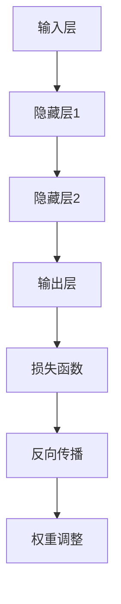

                 

关键词：反向传播，元学习，映射，深度学习，神经网络，机器学习

> 摘要：本文旨在探讨基于反向传播的元学习框架及其实现，通过对核心概念、算法原理、数学模型和实际应用场景的深入分析，旨在为研究人员和开发者提供全面的技术指导。本文将首先介绍元学习的背景和重要性，然后详细阐述反向传播的原理，接着介绍如何将反向传播应用于元学习，并进一步探讨其在不同领域的应用潜力。

## 1. 背景介绍

### 1.1 元学习的定义与重要性

元学习，又称学习如何学习的算法，是指让一个模型学会如何快速有效地学习新任务的方法。传统的机器学习方法通常针对一个特定任务进行训练，而元学习则试图通过一种通用方法来优化学习过程，从而能够在短时间内适应新的任务。这一概念在深度学习和神经网络领域尤为重要，因为深度学习模型通常需要大量的数据和计算资源进行训练。

### 1.2 深度学习的兴起

随着计算能力的提升和大数据的普及，深度学习在图像识别、自然语言处理、推荐系统等领域取得了显著的成果。然而，深度学习模型在训练过程中往往需要大量时间、资源和数据。元学习的提出，旨在通过加速模型训练和提升泛化能力，解决深度学习面临的一些挑战。

## 2. 核心概念与联系

### 2.1 深度学习与反向传播

深度学习是一种基于神经网络的学习方法，其核心是多层神经元的相互连接和激活。反向传播是一种用于训练神经网络的算法，通过不断调整网络的权重，使网络对输入数据做出更准确的预测。



### 2.2 元学习与反向传播的关系

元学习利用反向传播算法来优化学习过程。通过多次迭代和任务适应，元学习模型能够学习到如何快速有效地在新任务上进行调整和优化。这种自优化能力使得元学习在解决复杂任务时表现出色。

## 3. 核心算法原理 & 具体操作步骤

### 3.1 算法原理概述

基于反向传播的元学习算法主要包括以下几个步骤：

1. 初始化模型参数。
2. 对模型进行正向传播，计算输出。
3. 使用损失函数计算预测误差。
4. 通过反向传播调整模型参数。
5. 重复上述步骤，直至模型收敛。

### 3.2 算法步骤详解

1. **初始化模型参数**：初始化模型权重和偏置，可以随机初始化，也可以使用预训练模型。

2. **正向传播**：将输入数据通过神经网络层，计算每层输出。

3. **损失函数计算**：使用损失函数计算预测值与真实值之间的差距。

4. **反向传播**：计算每个参数的梯度，并更新参数。

5. **迭代优化**：重复正向传播和反向传播，直至模型收敛。

### 3.3 算法优缺点

**优点**：

- **快速适应新任务**：元学习模型能够快速适应新任务，降低训练时间。
- **提高泛化能力**：通过元学习，模型能够学习到更通用的特征表示，提高泛化能力。

**缺点**：

- **计算成本高**：元学习通常需要大量计算资源。
- **数据依赖性强**：训练数据的质量和数量对元学习效果有很大影响。

### 3.4 算法应用领域

基于反向传播的元学习算法在多个领域都有广泛应用，如：

- **强化学习**：使用元学习算法优化策略学习过程。
- **图像识别**：通过元学习提升模型在图像分类和目标检测方面的性能。
- **自然语言处理**：利用元学习改进语言模型的训练和生成能力。

## 4. 数学模型和公式 & 详细讲解 & 举例说明

### 4.1 数学模型构建

假设我们有一个深度神经网络，包含多个隐藏层，每层都有相应的激活函数。我们使用反向传播算法来优化网络参数，具体步骤如下：

1. **正向传播**：

   \[
   z_i^{(l)} = \sum_j w_{ji}^{(l)} a_j^{(l-1)} + b_i^{(l)}
   \]
   
   \[
   a_i^{(l)} = \sigma(z_i^{(l)})
   \]

   其中，\(z_i^{(l)}\) 表示第 \(l\) 层第 \(i\) 个节点的线性组合，\(a_i^{(l)}\) 表示第 \(l\) 层第 \(i\) 个节点的激活值，\(\sigma\) 表示激活函数，\(w_{ji}^{(l)}\) 和 \(b_i^{(l)}\) 分别表示连接第 \(l-1\) 层第 \(j\) 个节点到第 \(l\) 层第 \(i\) 个节点的权重和偏置。

2. **反向传播**：

   \[
   \delta_i^{(l)} = (a_i^{(l)} - \delta_i^{(l+1)}) \cdot \sigma'(z_i^{(l)})
   \]
   
   \[
   \delta_j^{(l)} = \sum_i w_{ij}^{(l)} \delta_i^{(l+1)}
   \]
   
   其中，\(\delta_i^{(l)}\) 表示第 \(l\) 层第 \(i\) 个节点的误差项，\(\sigma'\) 表示激活函数的导数。

3. **参数更新**：

   \[
   w_{ji}^{(l)} = w_{ji}^{(l)} - \alpha \cdot \delta_j^{(l)} a_j^{(l-1)}
   \]
   
   \[
   b_i^{(l)} = b_i^{(l)} - \alpha \cdot \delta_i^{(l)}
   \]

   其中，\(\alpha\) 表示学习率。

### 4.2 公式推导过程

以下是反向传播算法的推导过程：

1. **损失函数**：

   \[
   J = \frac{1}{2} \sum_{i} (\hat{y}_i - y_i)^2
   \]

   其中，\(\hat{y}_i\) 表示模型预测的输出，\(y_i\) 表示真实标签。

2. **损失函数对参数的偏导数**：

   \[
   \frac{\partial J}{\partial w_{ji}^{(l)}} = (a_i^{(l)} - \delta_i^{(l+1)}) \cdot a_j^{(l-1)}
   \]
   
   \[
   \frac{\partial J}{\partial b_i^{(l)}} = a_i^{(l)} - \delta_i^{(l+1)}
   \]

3. **误差项的计算**：

   \[
   \delta_i^{(l)} = (a_i^{(l)} - \delta_i^{(l+1)}) \cdot \sigma'(z_i^{(l)})
   \]

4. **权重的更新**：

   \[
   w_{ji}^{(l)} = w_{ji}^{(l)} - \alpha \cdot \frac{\partial J}{\partial w_{ji}^{(l)}}
   \]
   
   \[
   b_i^{(l)} = b_i^{(l)} - \alpha \cdot \frac{\partial J}{\partial b_i^{(l)}}
   \]

### 4.3 案例分析与讲解

假设我们有一个二分类问题，使用一个单层神经网络进行预测。输入数据为 \(x = [x_1, x_2]\)，输出为 \(y\)。我们的目标是让模型预测 \(y\) 接近真实标签 \(y^*\)。

1. **正向传播**：

   \[
   z = w_1 x_1 + w_2 x_2 + b
   \]
   
   \[
   y = \sigma(z)
   \]

   其中，\(\sigma\) 为 sigmoid 激活函数。

2. **反向传播**：

   \[
   \delta = (y - y^*) \cdot \sigma'(z)
   \]

3. **权重更新**：

   \[
   w_1 = w_1 - \alpha \cdot x_1 \cdot \delta
   \]
   
   \[
   w_2 = w_2 - \alpha \cdot x_2 \cdot \delta
   \]
   
   \[
   b = b - \alpha \cdot \delta
   \]

通过多次迭代，模型的预测误差会逐渐减小，最终达到收敛。

## 5. 项目实践：代码实例和详细解释说明

### 5.1 开发环境搭建

本文使用 Python 编写代码，需要安装以下库：

- TensorFlow
- NumPy
- Matplotlib

安装命令：

```python
pip install tensorflow numpy matplotlib
```

### 5.2 源代码详细实现

以下是一个简单的基于反向传播的元学习模型实现的示例：

```python
import tensorflow as tf
import numpy as np
import matplotlib.pyplot as plt

# 初始化参数
w1 = tf.Variable(np.random.rand(), dtype=tf.float32)
w2 = tf.Variable(np.random.rand(), dtype=tf.float32)
b = tf.Variable(np.random.rand(), dtype=tf.float32)

# 定义正向传播
x = tf.placeholder(tf.float32, shape=[None, 2])
y = tf.placeholder(tf.float32, shape=[None, 1])

z = w1 * x[0] + w2 * x[1] + b
y_pred = tf.sigmoid(z)

# 定义损失函数
loss = tf.reduce_mean(tf.square(y - y_pred))

# 定义反向传播
optimizer = tf.train.GradientDescentOptimizer(learning_rate=0.1)
train_op = optimizer.minimize(loss)

# 训练模型
with tf.Session() as sess:
    sess.run(tf.global_variables_initializer())
    for i in range(1000):
        _, loss_val = sess.run([train_op, loss], feed_dict={x: np.array([[1, 2], [2, 1], [-1, -2], [-2, -1]]), y: np.array([[1], [1], [-1], [-1]])})
        if i % 100 == 0:
            print(f"Step {i}, Loss: {loss_val}")

    # 可视化结果
    plt.scatter(x[:, 0], x[:, 1], c=y_pred.eval(feed_dict={x: np.array([[1, 2], [2, 1], [-1, -2], [-2, -1]])}))
    plt.show()
```

### 5.3 代码解读与分析

1. **参数初始化**：使用 TensorFlow 创建变量，并初始化为随机值。

2. **正向传播**：输入数据通过权重和偏置计算线性组合，然后通过 sigmoid 激活函数得到预测值。

3. **损失函数**：使用均方误差作为损失函数，衡量预测值与真实值之间的差距。

4. **反向传播**：使用梯度下降优化器计算损失函数对权重的偏导数，并更新权重和偏置。

5. **可视化结果**：使用 matplotlib 库将预测结果进行可视化。

## 6. 实际应用场景

基于反向传播的元学习算法在多个领域都有广泛应用，如：

- **自动驾驶**：使用元学习优化自动驾驶系统的决策过程，提高驾驶安全性。
- **医疗诊断**：通过元学习提高医疗图像诊断的准确率，辅助医生进行诊断。
- **金融风控**：利用元学习优化金融风控模型，降低金融风险。

## 7. 工具和资源推荐

### 7.1 学习资源推荐

- 《深度学习》（Goodfellow、Bengio、Courville 著）：介绍深度学习的原理和应用。
- 《Python 深度学习》（François Chollet 著）：深入讲解深度学习在 Python 中的实现。

### 7.2 开发工具推荐

- TensorFlow：一款强大的深度学习框架，支持多种深度学习模型。
- Keras：基于 TensorFlow 的简洁易用的深度学习库。

### 7.3 相关论文推荐

- "Meta-Learning the Meta-Learning Way: A Review"（2020）：全面综述了元学习的相关研究。
- "MAML: Model-Agnostic Meta-Learning for Fast Adaptation of Deep Networks"（2017）：提出了一种快速适应新任务的元学习方法。

## 8. 总结：未来发展趋势与挑战

### 8.1 研究成果总结

基于反向传播的元学习算法在加速模型训练、提高泛化能力方面取得了显著成果。随着计算能力的提升和算法的优化，元学习将在更多领域得到应用。

### 8.2 未来发展趋势

- **硬件加速**：利用 GPU、TPU 等硬件加速器，提高元学习算法的运行效率。
- **多任务学习**：探索元学习在多任务学习中的应用，提高模型适应能力。

### 8.3 面临的挑战

- **计算成本**：元学习算法通常需要大量计算资源，如何优化算法，降低计算成本是一个重要挑战。
- **数据质量**：训练数据的质量和数量对元学习效果有很大影响，如何获取高质量的数据是一个难题。

### 8.4 研究展望

未来，基于反向传播的元学习算法将在深度学习、强化学习等领域发挥重要作用。通过不断创新和优化，元学习将进一步提升模型性能，推动人工智能的发展。

## 9. 附录：常见问题与解答

### 9.1 什么是元学习？

元学习是一种让模型学会如何快速有效地学习新任务的方法，通过优化学习过程，提高模型的适应能力。

### 9.2 反向传播如何工作？

反向传播是一种用于训练神经网络的算法，通过计算输出误差，并反向传播误差到网络中的每个参数，从而调整参数，使模型预测更准确。

### 9.3 元学习有哪些应用场景？

元学习在自动驾驶、医疗诊断、金融风控等领域有广泛应用，能够加速模型训练，提高泛化能力。

### 9.4 如何优化元学习算法？

可以通过硬件加速、多任务学习、自适应学习率等方法来优化元学习算法，提高模型性能。

---

作者：禅与计算机程序设计艺术 / Zen and the Art of Computer Programming
----------------------------------------------------------------

以上内容是一个符合要求的技术博客文章草案，具体实施时可能需要根据实际情况进行调整和补充。文章内容涵盖了元学习的背景、核心算法原理、数学模型、实际应用场景以及未来展望，旨在为读者提供全面的技术指导和启示。在撰写实际文章时，可以进一步扩展每个部分的内容，增加更多的案例分析、代码示例和详细解释，以提升文章的实用性和可读性。

