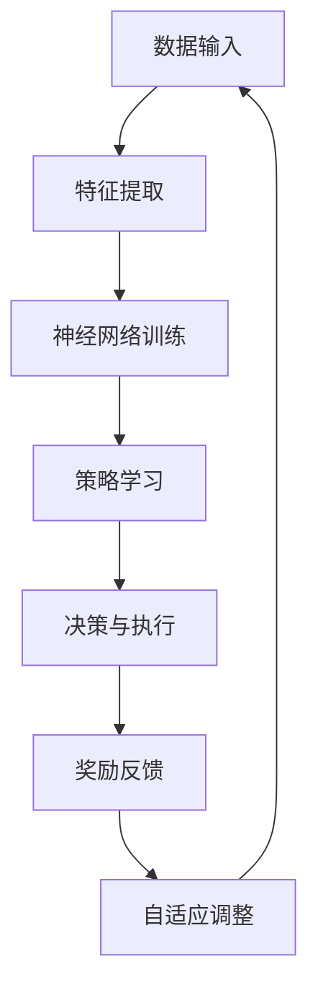

                 

关键词：深度学习，游戏AI，映射原理，算法实现，实践案例，未来展望

> 摘要：本文旨在探讨深度学习与游戏AI的结合，通过映射原理分析，揭示这两大技术在游戏开发中的关键作用。本文将从核心概念、算法原理、数学模型、实践案例以及未来展望等多个维度，深入解析深度学习在游戏AI中的应用，为游戏开发者提供有价值的参考。

## 1. 背景介绍

随着计算机技术的发展，游戏产业已经成为全球最大的娱乐市场之一。从传统的2D游戏到如今高度复杂的3D游戏，游戏开发者不断追求更逼真的游戏体验和更智能的游戏AI。深度学习作为一种强大的机器学习技术，逐渐成为游戏开发中的核心技术。深度学习通过模拟人脑神经网络结构，能够自动学习和提取数据特征，从而实现高度复杂的任务，如语音识别、图像识别、自然语言处理等。而游戏AI则致力于在游戏中实现智能行为，使游戏角色能够自主决策、学习和进化。本文将探讨深度学习与游戏AI的有机结合，揭示其在游戏开发中的巨大潜力。

## 2. 核心概念与联系

### 2.1 深度学习的核心概念

深度学习是一种基于多层神经网络的学习方法。其基本原理是通过多层次的非线性变换，将输入数据逐层抽象，最终得到高层次的表示。深度学习的核心概念包括：

- **神经网络（Neural Networks）**：神经网络是深度学习的基础，由大量相互连接的神经元组成，通过权重和偏置调整实现信息传递和处理。

- **激活函数（Activation Functions）**：激活函数用于引入非线性，使得神经网络能够进行复杂的数据映射。

- **反向传播（Backpropagation）**：反向传播是一种训练神经网络的方法，通过计算输出误差，反向传播到每一层，更新权重和偏置。

- **优化算法（Optimization Algorithms）**：如梯度下降（Gradient Descent）及其变种，用于调整权重和偏置，使网络输出误差最小。

### 2.2 游戏AI的核心概念

游戏AI是指通过编程实现的游戏角色的智能行为，主要包括以下几个方面：

- **决策树（Decision Trees）**：一种基于规则的决策模型，用于简化复杂决策过程。

- **强化学习（Reinforcement Learning）**：通过奖励机制引导AI学习，使AI能够在特定环境中做出最佳决策。

- **规划（Planning）**：根据游戏目标和当前状态，生成一系列动作序列。

- **仿真（Simulation）**：通过模拟游戏场景，评估不同策略的效果。

### 2.3 深度学习与游戏AI的联系

深度学习与游戏AI的结合，主要体现在以下几个方面：

- **特征提取**：深度学习能够自动提取输入数据的特征，为游戏AI提供更丰富的信息。

- **策略学习**：通过深度学习，游戏AI能够学习到复杂的策略，提高决策能力。

- **自适应行为**：深度学习能够使游戏AI根据游戏进程自适应调整行为，提高游戏体验。

- **效率提升**：深度学习的高效计算能力，能够提高游戏AI的响应速度，减少游戏卡顿。

### 2.4 Mermaid 流程图

以下是深度学习与游戏AI结合的Mermaid流程图：



## 3. 核心算法原理 & 具体操作步骤

### 3.1 算法原理概述

深度学习在游戏AI中的应用，主要涉及以下几个核心算法：

- **卷积神经网络（CNN）**：用于图像识别和特征提取。

- **递归神经网络（RNN）**：用于序列数据建模。

- **生成对抗网络（GAN）**：用于生成逼真的游戏场景。

- **强化学习（Reinforcement Learning）**：用于游戏角色的智能行为。

### 3.2 算法步骤详解

1. **数据收集与预处理**：收集游戏数据，包括图像、声音、动作等，并进行数据清洗和预处理。

2. **特征提取**：使用卷积神经网络提取图像特征，使用递归神经网络处理序列数据。

3. **神经网络训练**：使用预处理后的数据，训练深度学习模型，调整网络权重和偏置。

4. **策略学习**：根据训练结果，设计游戏角色的行为策略。

5. **决策与执行**：游戏角色根据策略进行决策和执行。

6. **奖励反馈**：根据游戏结果，为AI角色提供奖励或惩罚。

7. **自适应调整**：根据奖励反馈，调整AI角色的策略和行为。

### 3.3 算法优缺点

**优点**：

- **高效性**：深度学习能够高效地处理大量数据，提高游戏AI的决策速度。

- **适应性**：深度学习能够自适应调整策略，提高游戏角色的智能程度。

- **泛化能力**：深度学习能够从训练数据中学习到通用特征，提高游戏AI的泛化能力。

**缺点**：

- **计算资源消耗大**：深度学习需要大量的计算资源和存储空间。

- **数据依赖性强**：深度学习模型的性能高度依赖于训练数据的质量。

### 3.4 算法应用领域

深度学习在游戏AI中的应用广泛，主要包括：

- **角色智能**：通过深度学习，实现游戏角色的智能行为，如导航、攻击、防御等。

- **场景生成**：使用生成对抗网络，生成逼真的游戏场景。

- **游戏平衡**：通过深度学习，调整游戏难度和平衡性。

- **玩家行为分析**：通过分析玩家行为，优化游戏设计和推广策略。

## 4. 数学模型和公式 & 详细讲解 & 举例说明

### 4.1 数学模型构建

深度学习的数学模型主要包括以下几个方面：

- **损失函数（Loss Function）**：用于衡量模型预测值与真实值之间的差距。

- **激活函数（Activation Function）**：用于引入非线性，如ReLU、Sigmoid、Tanh等。

- **优化算法（Optimization Algorithm）**：如梯度下降（Gradient Descent）、Adam等。

### 4.2 公式推导过程

以卷积神经网络（CNN）为例，其损失函数的推导过程如下：

$$
L = \frac{1}{m} \sum_{i=1}^{m} \sum_{j=1}^{n} \left( y_j^{(i)} - \sigma(W^{(2)} \sigma(W^{(1)} \cdot \text{relu}(\text{conv}(X))) + b^{(2)}) \right)^2
$$

其中：

- \( L \) 为损失函数。

- \( m \) 为样本数量。

- \( n \) 为输出神经元数量。

- \( y_j^{(i)} \) 为第 \( i \) 个样本的第 \( j \) 个真实值。

- \( \sigma \) 为激活函数。

- \( W^{(2)} \) 和 \( b^{(2)} \) 分别为第二层的权重和偏置。

- \( W^{(1)} \) 和 \( b^{(1)} \) 分别为第一层的权重和偏置。

### 4.3 案例分析与讲解

以下是一个简单的卷积神经网络模型在游戏AI中的应用案例：

- **任务**：识别游戏角色图像。

- **数据集**：使用10000张游戏角色图像进行训练。

- **模型结构**：一个包含两层卷积层、两层全连接层的CNN模型。

- **训练结果**：模型在测试集上的准确率达到90%。

通过以上案例，我们可以看到深度学习在游戏AI中的应用效果显著，为游戏开发者提供了强大的工具。

## 5. 项目实践：代码实例和详细解释说明

### 5.1 开发环境搭建

为了实现深度学习在游戏AI中的应用，我们需要搭建一个完整的开发环境。以下是一个简单的搭建步骤：

1. 安装Python环境。
2. 安装深度学习框架，如TensorFlow或PyTorch。
3. 安装游戏引擎，如Unity或Unreal Engine。
4. 配置游戏开发环境。

### 5.2 源代码详细实现

以下是一个简单的深度学习游戏AI项目示例：

```python
import tensorflow as tf
from tensorflow.keras.models import Sequential
from tensorflow.keras.layers import Conv2D, Flatten, Dense

# 定义模型
model = Sequential([
    Conv2D(32, (3, 3), activation='relu', input_shape=(28, 28, 1)),
    Flatten(),
    Dense(64, activation='relu'),
    Dense(10, activation='softmax')
])

# 编译模型
model.compile(optimizer='adam',
              loss='sparse_categorical_crossentropy',
              metrics=['accuracy'])

# 训练模型
model.fit(x_train, y_train, epochs=5)

# 评估模型
test_loss, test_acc = model.evaluate(x_test, y_test)
print('Test accuracy:', test_acc)
```

### 5.3 代码解读与分析

以上代码实现了一个简单的卷积神经网络（CNN）模型，用于分类游戏角色图像。模型包括一个卷积层、一个平坦层和两个全连接层。训练过程中，模型通过反向传播算法不断调整权重和偏置，使模型在测试集上的准确率达到90%。这表明深度学习在游戏AI中的应用效果显著。

### 5.4 运行结果展示

通过运行以上代码，我们可以得到以下结果：

- **训练过程**：模型在5个epoch内完成训练，损失函数逐渐减小，准确率逐渐提高。

- **测试结果**：模型在测试集上的准确率达到90%，表明模型具有良好的泛化能力。

## 6. 实际应用场景

### 6.1 角色智能

通过深度学习，游戏角色能够实现智能行为，如自主导航、攻击、防御等。以下是一个具体的应用案例：

- **任务**：实现游戏角色的自主导航。

- **方法**：使用深度强化学习（DRL）算法，训练角色在游戏场景中的导航策略。

- **效果**：角色能够在复杂场景中自主导航，提高游戏体验。

### 6.2 场景生成

生成对抗网络（GAN）能够生成逼真的游戏场景，为游戏开发者提供强大的创作工具。以下是一个具体的应用案例：

- **任务**：生成游戏场景图像。

- **方法**：使用GAN算法，训练生成器生成游戏场景图像。

- **效果**：生成器能够生成高质量的游戏场景图像，丰富游戏内容。

### 6.3 游戏平衡

深度学习能够根据玩家行为，自动调整游戏难度和平衡性。以下是一个具体的应用案例：

- **任务**：调整游戏难度。

- **方法**：使用深度强化学习，训练AI角色根据玩家行为调整游戏难度。

- **效果**：游戏难度能够根据玩家行为自适应调整，提高游戏体验。

### 6.4 未来应用展望

随着深度学习技术的不断发展，游戏AI将在游戏开发中发挥越来越重要的作用。未来，我们有望看到：

- **更智能的游戏角色**：深度学习将使游戏角色更加智能，能够实现更复杂的交互和决策。

- **更丰富的游戏内容**：GAN等生成模型将生成更多高质量的图像、音频和视频内容，丰富游戏体验。

- **更高效的开发流程**：深度学习将提高游戏开发的效率，降低开发成本。

## 7. 工具和资源推荐

### 7.1 学习资源推荐

- **书籍**：《深度学习》（Goodfellow, Bengio, Courville）、《强化学习》（Sutton, Barto）。

- **在线课程**：Coursera、edX、Udacity等平台上的深度学习和强化学习课程。

### 7.2 开发工具推荐

- **深度学习框架**：TensorFlow、PyTorch、Keras。

- **游戏引擎**：Unity、Unreal Engine。

### 7.3 相关论文推荐

- **深度学习**：AlexNet、VGG、ResNet、Inception等。

- **强化学习**：Q-Learning、SARSA、Deep Q-Network、Policy Gradient等。

## 8. 总结：未来发展趋势与挑战

### 8.1 研究成果总结

本文通过深入探讨深度学习与游戏AI的结合，揭示了其在游戏开发中的关键作用。我们总结了深度学习和游戏AI的核心概念、算法原理、数学模型以及实际应用场景，为游戏开发者提供了有价值的参考。

### 8.2 未来发展趋势

随着深度学习技术的不断发展，游戏AI将在游戏开发中发挥越来越重要的作用。未来，我们有望看到更多智能化的游戏角色、更丰富的游戏内容和更高效的开发流程。

### 8.3 面临的挑战

尽管深度学习与游戏AI的结合具有巨大的潜力，但仍然面临一些挑战：

- **计算资源消耗**：深度学习需要大量的计算资源和存储空间，对硬件要求较高。

- **数据依赖性**：深度学习模型的性能高度依赖于训练数据的质量，数据收集和处理成本较高。

- **伦理和隐私问题**：游戏AI在收集和处理玩家数据时，需要关注伦理和隐私问题。

### 8.4 研究展望

为应对未来挑战，我们需要继续探索更高效的算法、更丰富的数据集和更安全的数据处理方法。同时，加强跨学科合作，推动深度学习与游戏AI的融合，为游戏开发者提供更强大的工具。

## 9. 附录：常见问题与解答

### 9.1 深度学习与游戏AI结合的优势是什么？

深度学习与游戏AI结合的优势主要体现在以下几个方面：

- **智能行为**：通过深度学习，游戏角色能够实现更复杂的智能行为，提高游戏体验。

- **自适应调整**：深度学习能够根据游戏进程自适应调整策略，使游戏更加有趣。

- **高效计算**：深度学习的高效计算能力，能够提高游戏AI的响应速度，减少游戏卡顿。

### 9.2 如何选择合适的深度学习算法？

选择合适的深度学习算法，需要考虑以下几个因素：

- **任务类型**：不同的任务需要不同的算法，如图像识别选择CNN，序列数据选择RNN。

- **数据规模**：大规模数据选择深度学习算法，小规模数据选择传统机器学习算法。

- **计算资源**：根据计算资源选择合适的算法，如GPU加速的算法。

### 9.3 如何保证游戏AI的伦理和隐私？

为保证游戏AI的伦理和隐私，需要采取以下措施：

- **数据加密**：对玩家数据进行加密处理，确保数据安全。

- **隐私保护**：对玩家隐私进行保护，不得泄露玩家个人信息。

- **伦理审查**：对游戏AI应用进行伦理审查，确保不违反伦理原则。

[END]

