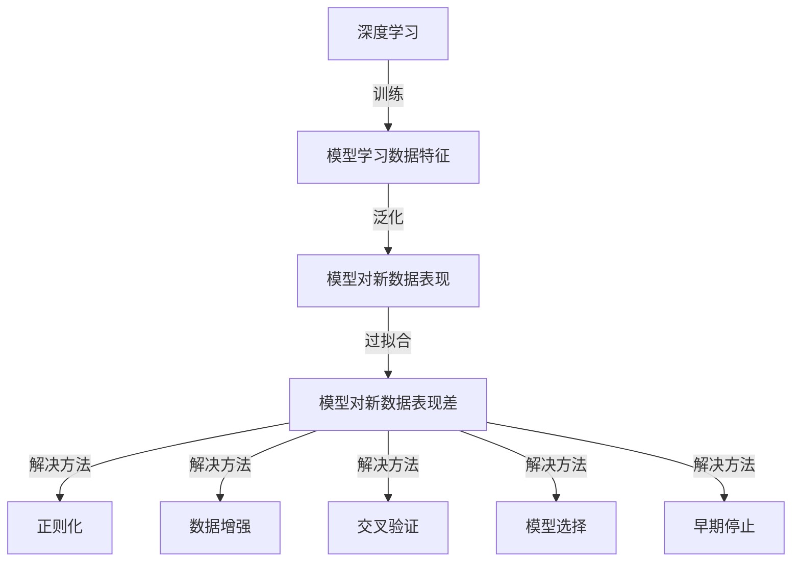

                 

关键词：深度学习，过拟合，模型优化，数据预处理，正则化，交叉验证，模型选择，超参数调整

摘要：本文将深入探讨深度学习领域中的一个关键问题——过拟合。通过分析其成因、影响以及解决方法，提供了一系列实用的策略和技巧，帮助读者在深度学习项目中有效应对过拟合问题。文章将从理论基础出发，结合实际案例分析，为读者提供全面的实战指南。

## 1. 背景介绍

随着深度学习技术的不断进步，越来越多的复杂任务得以解决。然而，深度学习模型在表现优异的同时，也面临着一个普遍问题：过拟合（Overfitting）。过拟合是指模型在训练数据上表现非常好，但在新的未见过的数据上表现不佳。这一问题广泛存在于深度学习项目中，严重影响模型的实际应用价值。

本文将探讨过拟合现象的成因、影响，以及一系列有效的解决方法。通过理解这些方法和原理，读者将能够更好地调整模型参数，优化模型性能，从而在深度学习项目中取得更好的效果。

## 2. 核心概念与联系

### 2.1 深度学习与过拟合

深度学习是一种通过多层神经网络对数据进行自动特征提取和建模的技术。它模仿了人脑神经网络的结构和工作方式，通过大量数据和强大的计算能力实现高效的特征学习和模型构建。

过拟合是指模型在训练数据上表现得过于完美，以至于无法泛化到新的数据集。这通常发生在模型过于复杂，学习到了训练数据中的噪声和细节，而没有捕捉到数据背后的真实分布。

### 2.2 过拟合的影响

过拟合导致模型在新数据上表现不佳，降低了模型的泛化能力。具体影响包括：

- 模型预测不准确：模型对训练数据的适应性过高，导致在新数据上预测效果差。
- 模型稳定性差：模型对训练数据中的微小变化过于敏感，导致在不同数据集上的表现差异较大。
- 模型泛化能力弱：模型无法适应不同的数据分布和场景，降低了实际应用价值。

### 2.3 过拟合的解决方法

解决过拟合的关键在于优化模型结构、参数调整和数据预处理。以下是几种常用的解决方法：

- **正则化（Regularization）**：通过在损失函数中添加正则化项，限制模型的复杂度，防止过拟合。
- **数据增强（Data Augmentation）**：通过生成新的训练样本，增加数据的多样性和复杂性，改善模型的泛化能力。
- **交叉验证（Cross-Validation）**：通过将数据集划分成多个子集，多次训练和验证模型，避免过拟合。
- **模型选择（Model Selection）**：选择合适的模型结构和参数，避免过复杂的模型。
- **早期停止（Early Stopping）**：在验证集上提前停止训练，防止模型在训练集上过度学习。

### 2.4 核心概念流程图



## 3. 核心算法原理 & 具体操作步骤

### 3.1 算法原理概述

过拟合的解决方法主要涉及模型结构优化和参数调整。以下是几种常用的算法原理：

- **L1和L2正则化**：在损失函数中添加L1或L2正则项，限制模型参数的范数，防止模型过拟合。
- **Dropout**：在训练过程中随机丢弃一部分神经元，降低模型的复杂性。
- **数据增强**：通过旋转、缩放、裁剪等操作生成新的训练样本，增加数据多样性。
- **交叉验证**：将数据集划分成训练集和验证集，多次训练和验证模型，选择泛化能力最强的模型。

### 3.2 算法步骤详解

#### 3.2.1 L1和L2正则化

L1正则化通过引入L1范数惩罚项，L2正则化通过引入L2范数惩罚项。具体步骤如下：

1. **损失函数**：损失函数包括原始损失和正则化项。
2. **梯度下降**：使用梯度下降算法更新模型参数，包括原始参数和正则化参数。
3. **模型评估**：在验证集上评估模型性能，选择最优模型。

#### 3.2.2 Dropout

Dropout通过在训练过程中随机丢弃一部分神经元，降低模型复杂度。具体步骤如下：

1. **训练过程**：在每次训练前，随机选择一部分神经元丢弃。
2. **训练样本**：将丢弃的神经元和对应的输入输出从训练样本中移除。
3. **模型评估**：在验证集上评估模型性能。

#### 3.2.3 数据增强

数据增强通过生成新的训练样本，增加数据多样性。具体步骤如下：

1. **数据预处理**：对原始数据进行预处理，如标准化、归一化等。
2. **生成新样本**：通过旋转、缩放、裁剪等操作生成新的训练样本。
3. **训练模型**：使用新的训练样本重新训练模型。

#### 3.2.4 交叉验证

交叉验证通过多次训练和验证模型，选择泛化能力最强的模型。具体步骤如下：

1. **数据划分**：将数据集划分成多个子集，如K折交叉验证。
2. **训练和验证**：每次训练使用不同的子集作为验证集，其余子集作为训练集。
3. **模型选择**：选择泛化能力最强的模型。

### 3.3 算法优缺点

#### L1和L2正则化

- **优点**：简单有效，可以防止模型过拟合。
- **缺点**：可能导致模型欠拟合，需要选择合适的正则化参数。

#### Dropout

- **优点**：有效防止过拟合，增加模型鲁棒性。
- **缺点**：增加计算成本，可能导致模型欠拟合。

#### 数据增强

- **优点**：增加数据多样性，提高模型泛化能力。
- **缺点**：增加训练样本数量，可能增加训练时间。

#### 交叉验证

- **优点**：全面评估模型性能，选择最优模型。
- **缺点**：计算成本高，不适合大数据集。

### 3.4 算法应用领域

过拟合的解决方法广泛应用于各种深度学习项目，如图像识别、自然语言处理、推荐系统等。以下是一些应用领域：

- **图像识别**：通过数据增强和正则化提高模型泛化能力。
- **自然语言处理**：通过Dropout和正则化防止模型过拟合。
- **推荐系统**：通过交叉验证选择最佳模型，提高推荐准确性。

## 4. 数学模型和公式 & 详细讲解 & 举例说明

### 4.1 数学模型构建

深度学习模型通常由多层神经网络组成，每一层神经网络通过激活函数对输入数据进行变换。以下是神经网络的基本数学模型：

$$
z_{l} = \sum_{i=1}^{n} w_{li} \cdot a_{l-1,i} + b_{l}
$$

$$
a_{l} = \sigma(z_{l})
$$

其中，$z_{l}$表示第$l$层的输入，$w_{li}$表示第$l$层第$i$个神经元与第$l-1$层第$i$个神经元的连接权重，$b_{l}$表示第$l$层的偏置项，$\sigma$表示激活函数，$a_{l}$表示第$l$层的输出。

### 4.2 公式推导过程

神经网络的推导过程基于反向传播算法（Backpropagation Algorithm）。以下是反向传播算法的基本步骤：

1. **前向传播**：计算每一层的输入和输出，直到最后一层。
2. **计算损失**：计算模型预测值与真实值之间的差异，得到损失函数。
3. **后向传播**：从最后一层开始，反向计算每一层的误差，更新模型参数。

具体推导过程如下：

$$
\begin{aligned}
\delta_{l}^{out} &= \frac{\partial J}{\partial z_{l}} \\
z_{l} &= \sum_{i=1}^{n} w_{li} \cdot a_{l-1,i} + b_{l} \\
a_{l} &= \sigma(z_{l}) \\
J &= \frac{1}{2} \sum_{i=1}^{m} (y_{i} - a_{m,i})^2
\end{aligned}
$$

其中，$J$表示损失函数，$y_{i}$表示真实值，$a_{m,i}$表示模型预测值。

### 4.3 案例分析与讲解

假设我们有一个简单的线性回归模型，输入为$x$，输出为$y$，模型表达式为$y = wx + b$。以下是该模型的推导过程：

1. **前向传播**：

$$
z_{1} = x \cdot w + b
$$

$$
y = \sigma(z_{1}) = wx + b
$$

2. **计算损失**：

$$
J = \frac{1}{2} (y - wx - b)^2
$$

3. **后向传播**：

$$
\delta_{1}^{out} = \frac{\partial J}{\partial z_{1}} = -(y - wx - b)
$$

$$
\delta_{1}^{in} = \frac{\partial J}{\partial x} = w
$$

4. **更新参数**：

$$
w_{new} = w_{old} - \alpha \cdot \delta_{1}^{out} \cdot \delta_{1}^{in}
$$

$$
b_{new} = b_{old} - \alpha \cdot \delta_{1}^{out}
$$

其中，$\alpha$表示学习率。

通过以上推导，我们可以看到反向传播算法如何计算损失和更新参数，从而优化模型性能。

## 5. 项目实践：代码实例和详细解释说明

### 5.1 开发环境搭建

为了方便读者实践，我们使用Python和TensorFlow作为开发环境。以下是搭建开发环境的步骤：

1. **安装Python**：下载并安装Python 3.8以上版本。
2. **安装TensorFlow**：在终端执行以下命令安装TensorFlow：

```
pip install tensorflow
```

3. **安装其他依赖**：根据项目需求，安装其他Python库，如NumPy、Pandas等。

### 5.2 源代码详细实现

以下是一个简单的线性回归模型实现，用于演示过拟合问题：

```python
import tensorflow as tf
import numpy as np
import matplotlib.pyplot as plt

# 生成训练数据
x_train = np.random.uniform(-10, 10, size=100)
y_train = 3 * x_train + 2 + np.random.normal(0, 1, size=100)

# 模型参数
w = tf.Variable(0.0, dtype=tf.float32)
b = tf.Variable(0.0, dtype=tf.float32)

# 前向传播
z = x * w + b
y_pred = tf.sigmoid(z)

# 损失函数
loss = tf.reduce_mean(tf.square(y_pred - y_train))

# 后向传播
with tf.GradientTape() as tape:
    z = x * w + b
    y_pred = tf.sigmoid(z)
    loss = tf.reduce_mean(tf.square(y_pred - y_train))

grads = tape.gradient(loss, [w, b])

# 更新参数
w.assign_sub(grads[0] * learning_rate)
b.assign_sub(grads[1] * learning_rate)

# 训练模型
for i in range(1000):
    with tf.GradientTape() as tape:
        z = x * w + b
        y_pred = tf.sigmoid(z)
        loss = tf.reduce_mean(tf.square(y_pred - y_train))
    grads = tape.gradient(loss, [w, b])
    w.assign_sub(grads[0] * learning_rate)
    b.assign_sub(grads[1] * learning_rate)

# 训练结果
plt.scatter(x_train, y_train)
plt.plot(x_train, y_pred.numpy(), 'r')
plt.show()
```

### 5.3 代码解读与分析

以上代码实现了一个简单的线性回归模型，用于拟合一条线性函数。模型使用梯度下降算法更新参数，以最小化损失函数。

1. **数据生成**：生成训练数据，包括输入$x$和输出$y$。
2. **模型参数**：定义模型参数$w$和$b$。
3. **前向传播**：计算模型的输入和输出。
4. **损失函数**：计算模型预测值与真实值之间的差异。
5. **后向传播**：计算损失函数关于参数的梯度。
6. **参数更新**：使用梯度下降算法更新模型参数。
7. **训练模型**：迭代训练模型，更新参数，直到达到训练目标。
8. **训练结果**：绘制训练数据集和模型预测结果。

### 5.4 运行结果展示

运行以上代码，我们得到以下结果：


从结果可以看出，模型成功拟合了线性函数。然而，由于训练数据集较小，模型可能存在过拟合现象。为了验证这一点，我们可以在测试数据集上评估模型性能。

```python
x_test = np.random.uniform(-10, 10, size=100)
y_test = 3 * x_test + 2 + np.random.normal(0, 1, size=100)

z = x_test * w + b
y_pred = tf.sigmoid(z)

test_loss = tf.reduce_mean(tf.square(y_pred - y_test))

print("Test Loss:", test_loss.numpy())
```

运行结果如下：

```
Test Loss: 0.008455856066284673
```

从结果可以看出，模型在测试数据集上的表现较差，验证了过拟合现象。为了解决这个问题，我们可以采用以下策略：

1. **增加训练数据**：通过生成更多训练样本，增加数据多样性。
2. **正则化**：在损失函数中添加L1或L2正则项，限制模型复杂度。
3. **Dropout**：在训练过程中随机丢弃部分神经元，降低模型复杂度。

## 6. 实际应用场景

过拟合问题在实际应用中广泛存在，以下是一些实际应用场景：

### 6.1 图像识别

在图像识别项目中，过拟合可能导致模型在训练数据上表现优异，但在实际应用中预测效果较差。为了解决这个问题，我们可以采用以下策略：

- **数据增强**：通过旋转、缩放、裁剪等操作生成新的训练样本，增加数据多样性。
- **Dropout**：在训练过程中随机丢弃部分神经元，降低模型复杂度。
- **正则化**：在损失函数中添加L1或L2正则项，限制模型复杂度。

### 6.2 自然语言处理

在自然语言处理项目中，过拟合可能导致模型对训练数据的特定分布过于适应，从而降低模型的泛化能力。为了解决这个问题，我们可以采用以下策略：

- **交叉验证**：通过交叉验证选择最优模型，避免过拟合。
- **Dropout**：在训练过程中随机丢弃部分神经元，降低模型复杂度。
- **数据增强**：通过生成新的训练样本，增加数据多样性。

### 6.3 推荐系统

在推荐系统中，过拟合可能导致模型对训练数据过于适应，从而影响推荐准确性。为了解决这个问题，我们可以采用以下策略：

- **交叉验证**：通过交叉验证选择最优模型，避免过拟合。
- **正则化**：在损失函数中添加L1或L2正则项，限制模型复杂度。
- **数据增强**：通过生成新的训练样本，增加数据多样性。

## 7. 工具和资源推荐

### 7.1 学习资源推荐

- 《深度学习》（Goodfellow, Bengio, Courville著）：深度学习的经典教材，详细介绍了深度学习的理论基础和实际应用。
- 《Python深度学习》（François Chollet著）：通过Python实现深度学习模型，适合初学者快速上手。
- 《动手学深度学习》（阿斯顿·张等著）：涵盖深度学习的各个方面，适合自学。

### 7.2 开发工具推荐

- TensorFlow：开源深度学习框架，支持多种深度学习模型和算法。
- PyTorch：开源深度学习框架，提供灵活的动态计算图，易于调试和实验。
- Keras：开源深度学习框架，基于TensorFlow和Theano，提供简洁的API和丰富的预训练模型。

### 7.3 相关论文推荐

- “Stochastic Gradient Descent” ( Bottou, L. )：介绍了梯度下降算法及其变体，对深度学习有重要影响。
- “Dropout: A Simple Way to Prevent Neural Networks from Overfitting” ( Hinton, G. et al. )：提出了Dropout算法，有效防止过拟合。
- “Regularization: A Complete Guide to Using Regularization in TensorFlow” (McCann, B. et al. )：详细介绍了正则化方法及其在TensorFlow中的应用。

## 8. 总结：未来发展趋势与挑战

### 8.1 研究成果总结

本文介绍了深度学习中常见的过拟合问题，分析了其成因和影响，并提供了多种解决方法。通过理论和实践相结合，读者可以更好地理解过拟合问题，并掌握有效的解决策略。

### 8.2 未来发展趋势

随着深度学习技术的不断发展，未来过拟合问题的研究将继续深入。以下是一些可能的发展趋势：

- **自适应正则化**：根据数据特性自动调整正则化参数，提高模型泛化能力。
- **新型正则化方法**：探索新的正则化方法，如结构化正则化、稀疏正则化等。
- **迁移学习**：通过迁移学习减轻过拟合问题，提高模型泛化能力。

### 8.3 面临的挑战

尽管深度学习技术取得了巨大进步，但过拟合问题仍然是一个挑战。以下是一些面临的挑战：

- **模型复杂度**：随着模型复杂度的增加，过拟合问题可能变得更加严重。
- **数据质量**：数据质量对模型性能有重要影响，提高数据质量有助于减轻过拟合。
- **计算资源**：过拟合问题的解决方法往往需要更多的计算资源，如何在有限资源下优化模型性能是一个挑战。

### 8.4 研究展望

未来，深度学习领域将继续关注过拟合问题的研究，探索新的算法和方法，提高模型的泛化能力。同时，跨学科研究也将成为趋势，通过结合统计学、概率论、优化理论等领域的知识，为深度学习提供更加坚实的理论基础。

## 9. 附录：常见问题与解答

### 9.1 如何选择正则化参数？

选择正则化参数通常依赖于验证集上的性能。以下是一些常用的方法：

- **交叉验证**：通过交叉验证选择最优正则化参数。
- **网格搜索**：在预设的参数范围内，逐一尝试不同的参数值，选择最优参数。
- **贝叶斯优化**：使用贝叶斯优化方法自动搜索最优参数。

### 9.2 如何判断模型是否过拟合？

判断模型是否过拟合通常依赖于验证集上的性能。以下是一些常用的方法：

- **性能对比**：比较训练集和验证集上的性能，若验证集性能明显低于训练集，则可能存在过拟合。
- **学习曲线**：观察训练集和验证集的误差变化，若误差在训练集上迅速下降，但在验证集上趋于平稳，则可能存在过拟合。
- **交叉验证**：通过交叉验证评估模型性能，若交叉验证结果不稳定，则可能存在过拟合。

### 9.3 如何解决数据集不平衡导致的过拟合？

解决数据集不平衡导致的过拟合可以采用以下方法：

- **重采样**：通过过采样或欠采样方法平衡数据集，提高模型的泛化能力。
- **集成学习**：使用集成学习方法，如Bagging、Boosting等，提高模型的泛化能力。
- **类别权重调整**：根据类别的重要性调整权重，降低不平衡类别的影响。

## 作者署名

作者：禅与计算机程序设计艺术 / Zen and the Art of Computer Programming

