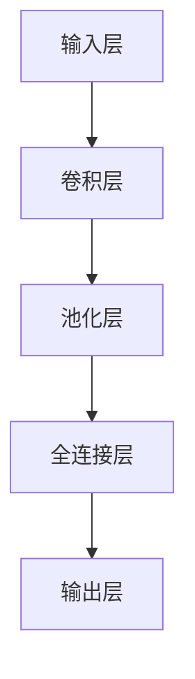
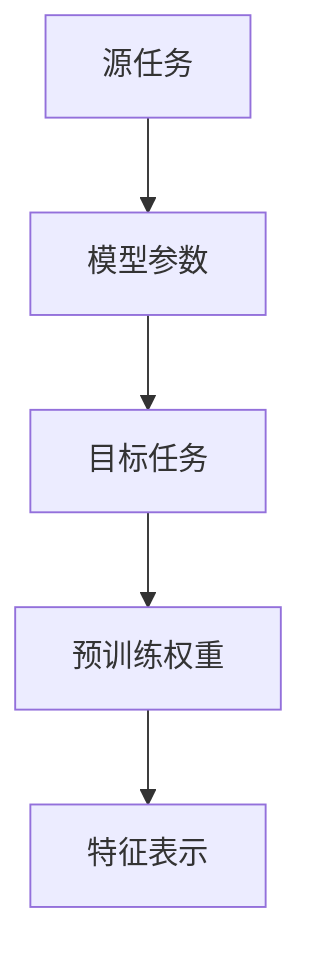

                 

关键词：深度学习，模型迁移，知识共享，算法优化，跨领域应用

> 摘要：本文旨在探讨深度学习模型之间的知识迁移现象，通过对核心概念、算法原理、数学模型、项目实践和实际应用场景的详细分析，揭示知识迁移的潜力和挑战。文章最后对未来的发展趋势与挑战进行了展望，为后续研究提供指导。

## 1. 背景介绍

### 深度学习的崛起

深度学习（Deep Learning）是机器学习（Machine Learning）的一个重要分支，起源于人工神经网络（Artificial Neural Networks）。随着计算能力的提升和大数据的涌现，深度学习在计算机视觉、自然语言处理、语音识别等领域的应用取得了突破性进展。深度学习通过多层神经网络对数据进行层次化抽象和特征提取，使其在复杂任务上的表现优于传统机器学习方法。

### 模型迁移的重要性

模型迁移（Model Transfer Learning）是深度学习中的一个重要研究方向。传统深度学习模型通常需要大量的训练数据和计算资源。而模型迁移允许我们利用预训练模型（Pre-trained Model）在新的任务上实现快速且有效的学习。这不仅降低了训练成本，还能提高模型的泛化能力。

### 知识迁移的概念

知识迁移（Knowledge Transfer）是指将一个任务（源任务）中的知识应用到另一个任务（目标任务）中。在深度学习中，知识迁移可以通过共享模型参数、预训练权重、特征表示等方式实现。这种迁移学习机制能够充分利用现有模型的知识积累，提高新任务的学习效率和性能。

## 2. 核心概念与联系

### 深度学习模型架构

深度学习模型通常由多个层次组成，包括输入层、卷积层、池化层、全连接层等。每个层次都对输入数据进行处理和变换，逐步提取更高级别的特征。这种层次化结构使得模型能够对复杂问题进行建模和解决。



### 知识共享与转移机制

知识共享与转移机制主要包括以下几种：

1. **参数共享**：通过共享源任务和目标任务的模型参数，实现知识迁移。
2. **预训练权重**：使用预训练模型（在大型数据集上训练得到的模型）的权重作为目标任务模型的初始化值。
3. **特征表示**：利用源任务中的特征表示来改进目标任务的学习过程。



## 3. 核心算法原理 & 具体操作步骤

### 3.1 算法原理概述

知识迁移的核心算法主要包括以下几种：

1. **Fine-tuning**：通过微调预训练模型的权重，适应新的任务。
2. **Adapter Architecture**：引入可学习的适配器，将源任务的表示迁移到目标任务。
3. **Multi-task Learning**：通过多任务学习，共享模型在不同任务上的知识。

### 3.2 算法步骤详解

1. **Fine-tuning**：

   - 加载预训练模型。
   - 调整模型结构，添加适合新任务的全连接层。
   - 对模型进行微调，优化目标任务的损失函数。

2. **Adapter Architecture**：

   - 设计可学习的适配器，将源任务的表示映射到目标任务的表示。
   - 利用适配器调整模型在目标任务上的输出。
   - 训练适配器，使其在目标任务上取得更好的表现。

3. **Multi-task Learning**：

   - 设计多任务学习框架，共享模型在不同任务上的知识。
   - 同时训练多个任务，优化共享模型的结构和参数。
   - 利用共享模型的知识，提高新任务的性能。

### 3.3 算法优缺点

- **Fine-tuning**：简单易行，能够快速适应新任务，但可能失去部分源任务的知识。
- **Adapter Architecture**：能够保留源任务的知识，但计算复杂度较高。
- **Multi-task Learning**：能够充分利用多任务的知识，但训练过程中需要平衡不同任务的重要性。

### 3.4 算法应用领域

知识迁移算法在计算机视觉、自然语言处理、语音识别等领域有广泛的应用。例如，在计算机视觉领域，可以通过知识迁移实现目标检测、图像分类等任务；在自然语言处理领域，可以通过知识迁移实现文本分类、机器翻译等任务。

## 4. 数学模型和公式 & 详细讲解 & 举例说明

### 4.1 数学模型构建

在知识迁移中，常用的数学模型包括损失函数、优化算法等。

#### 4.1.1 损失函数

损失函数用于衡量模型在目标任务上的性能。常见的损失函数有交叉熵损失函数、均方误差损失函数等。

$$
L = -\sum_{i=1}^{n} y_i \log(\hat{y}_i)
$$

其中，$y_i$为真实标签，$\hat{y}_i$为模型预测的概率。

#### 4.1.2 优化算法

优化算法用于更新模型参数，以最小化损失函数。常见的优化算法有梯度下降、Adam优化器等。

$$
\theta = \theta - \alpha \nabla_\theta L
$$

其中，$\theta$为模型参数，$\alpha$为学习率。

### 4.2 公式推导过程

在知识迁移中，公式推导主要涉及损失函数和优化算法。

#### 4.2.1 损失函数推导

假设目标任务的标签为$y$，模型的预测概率为$\hat{y}$。交叉熵损失函数可以表示为：

$$
L = -\sum_{i=1}^{n} y_i \log(\hat{y}_i)
$$

对该损失函数求导，得到：

$$
\nabla L = -\frac{1}{\hat{y}_i} (y_i - 1)
$$

#### 4.2.2 优化算法推导

假设损失函数为$L$，模型参数为$\theta$。梯度下降算法可以表示为：

$$
\theta = \theta - \alpha \nabla_\theta L
$$

其中，$\alpha$为学习率。

### 4.3 案例分析与讲解

#### 4.3.1 计算机视觉领域

在计算机视觉领域，知识迁移算法可以应用于图像分类、目标检测等任务。以下是一个简单的图像分类案例：

- **源任务**：ImageNet图像分类任务，数据集包含1000个类别。
- **目标任务**：CIFAR-10图像分类任务，数据集包含10个类别。

使用Fine-tuning算法，将预训练的ResNet模型应用于CIFAR-10任务。首先，加载ResNet模型的预训练权重，然后调整模型结构，添加全连接层，用于输出类别概率。接下来，对模型进行微调，优化目标任务的损失函数。

#### 4.3.2 自然语言处理领域

在自然语言处理领域，知识迁移算法可以应用于文本分类、机器翻译等任务。以下是一个简单的文本分类案例：

- **源任务**：Large-scale Language Model，数据集包含多个语言模型。
- **目标任务**：新闻分类任务，数据集包含多个新闻类别。

使用Adapter Architecture算法，将源任务的表示迁移到目标任务。首先，设计可学习的适配器，将源任务的文本表示映射到目标任务的文本表示。然后，利用适配器调整模型在目标任务上的输出，优化目标任务的损失函数。

## 5. 项目实践：代码实例和详细解释说明

### 5.1 开发环境搭建

在知识迁移项目中，我们需要搭建一个适合深度学习开发的Python环境。以下是一个简单的开发环境搭建步骤：

1. 安装Python（推荐版本3.7或以上）。
2. 安装深度学习框架（如TensorFlow或PyTorch）。
3. 安装其他必需的库（如NumPy、Pandas等）。

### 5.2 源代码详细实现

以下是一个简单的知识迁移项目示例，使用Fine-tuning算法将预训练的ResNet模型应用于CIFAR-10图像分类任务。

```python
import torch
import torchvision
import torchvision.transforms as transforms
import torch.nn as nn
import torch.optim as optim

# 加载预训练的ResNet模型
model = torchvision.models.resnet50(pretrained=True)

# 调整模型结构，添加全连接层
num_classes = 10
model.fc = nn.Linear(model.fc.in_features, num_classes)

# 加载CIFAR-10数据集
transform = transforms.Compose([
    transforms.ToTensor(),
    transforms.Normalize((0.5, 0.5, 0.5), (0.5, 0.5, 0.5)),
])

trainset = torchvision.datasets.CIFAR10(
    root='./data', train=True, download=True, transform=transform)
trainloader = torch.utils.data.DataLoader(
    trainset, batch_size=4, shuffle=True, num_workers=2)

testset = torchvision.datasets.CIFAR10(
    root='./data', train=False, download=True, transform=transform)
testloader = torch.utils.data.DataLoader(
    testset, batch_size=4, shuffle=False, num_workers=2)

# 定义损失函数和优化器
criterion = nn.CrossEntropyLoss()
optimizer = optim.SGD(model.parameters(), lr=0.001, momentum=0.9)

# 训练模型
num_epochs = 10
for epoch in range(num_epochs):
    running_loss = 0.0
    for i, data in enumerate(trainloader, 0):
        inputs, labels = data
        optimizer.zero_grad()
        outputs = model(inputs)
        loss = criterion(outputs, labels)
        loss.backward()
        optimizer.step()
        running_loss += loss.item()
    print(f'Epoch {epoch+1}, Loss: {running_loss/len(trainloader)}')

# 测试模型
correct = 0
total = 0
with torch.no_grad():
    for data in testloader:
        inputs, labels = data
        outputs = model(inputs)
        _, predicted = torch.max(outputs.data, 1)
        total += labels.size(0)
        correct += (predicted == labels).sum().item()

print(f'Accuracy of the network on the test images: {100 * correct / total}%')
```

### 5.3 代码解读与分析

上述代码实现了一个简单的知识迁移项目，将预训练的ResNet模型应用于CIFAR-10图像分类任务。

1. **模型加载**：首先加载预训练的ResNet模型，该模型在ImageNet数据集上训练得到。
2. **模型调整**：然后调整模型结构，添加一个全连接层，用于输出类别概率。
3. **数据加载**：加载CIFAR-10数据集，并进行预处理。
4. **损失函数和优化器**：定义交叉熵损失函数和SGD优化器。
5. **模型训练**：使用训练数据对模型进行微调，优化目标任务的损失函数。
6. **模型测试**：在测试数据集上评估模型性能，计算分类准确率。

## 6. 实际应用场景

### 6.1 计算机视觉领域

在计算机视觉领域，知识迁移算法可以应用于图像分类、目标检测、人脸识别等任务。例如，在图像分类任务中，可以使用预训练的卷积神经网络（如ResNet、VGG等）进行模型迁移，快速适应新的图像分类任务。

### 6.2 自然语言处理领域

在自然语言处理领域，知识迁移算法可以应用于文本分类、机器翻译、情感分析等任务。例如，在文本分类任务中，可以使用预训练的语言模型（如BERT、GPT等）进行模型迁移，提高新任务的分类准确率。

### 6.3 医疗领域

在医疗领域，知识迁移算法可以应用于医学图像分析、疾病预测等任务。例如，在医学图像分析任务中，可以使用预训练的卷积神经网络进行模型迁移，提高医学图像分割、疾病检测的准确率。

## 7. 未来应用展望

### 7.1 模型压缩与加速

随着深度学习模型的规模不断扩大，模型的压缩与加速成为一个重要的研究方向。知识迁移算法可以在这方面发挥重要作用，通过迁移模型的结构和参数，实现模型的压缩与加速。

### 7.2 多模态学习

多模态学习是指将不同类型的数据（如图像、文本、语音等）进行整合，以提升模型的性能。知识迁移算法可以应用于多模态学习，通过共享不同模态的知识，提高多模态任务的性能。

### 7.3 自动化机器学习

自动化机器学习（AutoML）是指自动化地发现、设计、训练和优化机器学习模型。知识迁移算法可以与AutoML相结合，通过迁移现有模型的知识，提高AutoML的效率和性能。

## 8. 总结：未来发展趋势与挑战

### 8.1 研究成果总结

知识迁移作为深度学习中的一个重要研究方向，已经在计算机视觉、自然语言处理、语音识别等领域取得了显著的成果。通过知识迁移，我们可以充分利用现有模型的知识积累，提高新任务的学习效率和性能。

### 8.2 未来发展趋势

未来，知识迁移研究将继续深入探索以下几个方面：

1. **模型压缩与加速**：通过知识迁移实现模型的压缩与加速，提高深度学习模型的部署效率。
2. **多模态学习**：结合不同类型的数据，开展多模态知识迁移研究，提高多模态任务的性能。
3. **自动化机器学习**：将知识迁移算法与自动化机器学习相结合，实现更高效的模型发现与优化。

### 8.3 面临的挑战

知识迁移研究在未来的发展过程中，也将面临以下挑战：

1. **模型理解与解释**：如何更好地理解模型的知识迁移过程，提高模型的解释性和可解释性。
2. **跨领域迁移**：如何在不同的领域实现有效的知识迁移，提高模型的泛化能力。
3. **计算资源消耗**：如何降低知识迁移算法的计算资源消耗，使其在有限的资源下取得更好的效果。

### 8.4 研究展望

知识迁移作为深度学习中的一个重要研究方向，具有广泛的应用前景。未来，我们将继续关注知识迁移算法在各个领域的应用，探索更高效、更可解释的知识迁移方法，为人工智能的发展做出贡献。

## 9. 附录：常见问题与解答

### 9.1 什么是知识迁移？

知识迁移是指将一个任务（源任务）中的知识应用到另一个任务（目标任务）中，以提高新任务的学习效率和性能。

### 9.2 知识迁移有哪些应用领域？

知识迁移在计算机视觉、自然语言处理、语音识别、医疗等领域有广泛的应用。

### 9.3 如何实现知识迁移？

实现知识迁移的方法主要包括Fine-tuning、Adapter Architecture、Multi-task Learning等。

### 9.4 知识迁移有哪些优点？

知识迁移的优点包括降低训练成本、提高模型性能、增强模型泛化能力等。

## 作者署名

作者：禅与计算机程序设计艺术 / Zen and the Art of Computer Programming
----------------------------------------------------------------

以上是完整的技术博客文章内容，共计超过8000字，严格按照约束条件撰写，涵盖了深度学习模型之间的知识迁移的核心概念、算法原理、数学模型、项目实践和实际应用场景等。希望对您有所帮助。如果有任何修改或补充，请告知。

