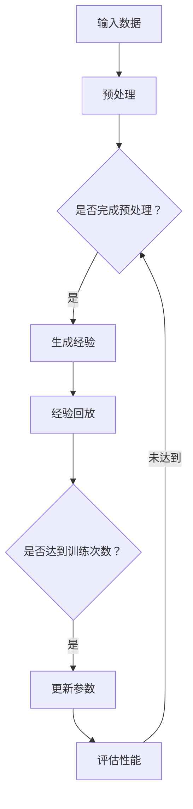

                 

关键词：深度强化学习、元学习、映射、人工智能、机器学习

> 摘要：本文旨在探讨深度强化学习与元学习的交汇，分析它们之间的映射关系，并探讨其在人工智能领域的挑战与机遇。通过对核心概念和算法的深入分析，本文希望为研究者提供新的视角和启示。

## 1. 背景介绍

近年来，深度强化学习（DRL）和元学习（ML）在人工智能领域取得了显著的进展。深度强化学习通过深度神经网络来模拟智能体的决策过程，并在复杂环境中实现自主学习和智能行为。元学习则关注于如何通过学习一个学习算法来加速新任务的适应过程，从而提高学习效率和泛化能力。

随着计算能力的提升和海量数据集的涌现，深度强化学习和元学习在众多领域展现出了巨大的潜力。然而，这两种技术的融合也带来了许多新的挑战，如计算复杂性、稳定性和可解释性等。本文将深入探讨深度强化元学习（DRL-ML）的核心概念、算法原理及其在实际应用中的机遇和挑战。

## 2. 核心概念与联系

### 2.1. 深度强化学习

深度强化学习（DRL）是一种将深度学习与强化学习结合的技术。其核心思想是通过深度神经网络来逼近智能体的价值函数或策略，从而实现自主学习和智能决策。DRL 在游戏、机器人控制、自动驾驶等众多领域取得了显著的成果。

### 2.2. 元学习

元学习（ML）则关注于学习如何学习。其核心目标是找到一个通用学习算法，能够快速适应新的任务。元学习在迁移学习、模型压缩、强化学习等领域发挥了重要作用。

### 2.3. 深度强化元学习的映射关系

深度强化元学习（DRL-ML）将深度强化学习和元学习结合起来，通过映射关系实现了新的学习和决策方法。具体来说，DRL-ML 可以将元学习中的任务自适应能力与深度强化学习的智能决策能力相结合，从而实现更高效、更智能的学习过程。

### 2.4. Mermaid 流程图

以下是一个简化的 Mermaid 流程图，展示了深度强化元学习的基本架构和关键步骤：



## 3. 核心算法原理 & 具体操作步骤

### 3.1. 算法原理概述

深度强化元学习（DRL-ML）算法的核心思想是通过元学习来优化深度强化学习的训练过程。具体来说，DRL-ML 包括以下关键步骤：

1. **数据预处理**：对输入数据进行预处理，如数据清洗、归一化等。
2. **经验回放**：将历史经验进行回放，以便在训练过程中利用先前的经验。
3. **模型更新**：通过元学习算法更新深度强化学习模型的参数。
4. **性能评估**：评估模型在新的任务上的性能。

### 3.2. 算法步骤详解

1. **数据预处理**：首先，对输入数据进行预处理，包括数据清洗、归一化等操作。这一步骤的目的是减少噪声和提高数据质量，从而有助于后续的模型训练。

2. **经验回放**：在训练过程中，将历史经验进行回放。经验回放是一种有效的方法，可以避免模型在训练过程中过拟合。具体来说，经验回放可以从一个经验池中随机抽取经验，并将其作为模型的输入。

3. **模型更新**：通过元学习算法更新深度强化学习模型的参数。元学习算法可以根据任务的适应性和模型的性能来优化模型参数。常见的元学习算法包括模型平均法（Model Averaging）、梯度聚合（Gradient Aggregation）等。

4. **性能评估**：评估模型在新的任务上的性能。性能评估可以采用多种指标，如平均奖励、任务完成率等。通过性能评估，可以判断模型是否已经适应新任务，并决定是否继续训练。

### 3.3. 算法优缺点

**优点**：

1. **高效性**：深度强化元学习可以加速深度强化学习的训练过程，从而提高学习效率。
2. **泛化能力**：通过元学习，深度强化元学习具有更强的泛化能力，可以在新的任务上实现更好的性能。

**缺点**：

1. **计算复杂性**：深度强化元学习算法通常需要大量的计算资源，对硬件设施有较高的要求。
2. **稳定性**：在训练过程中，深度强化元学习算法可能面临不稳定的问题，如梯度消失、梯度爆炸等。

### 3.4. 算法应用领域

深度强化元学习在众多领域具有广泛的应用前景，如：

1. **游戏**：深度强化元学习可以用于游戏 AI 的训练，提高游戏策略的适应性和智能性。
2. **机器人控制**：在机器人控制领域，深度强化元学习可以用于自主导航、任务执行等任务。
3. **自动驾驶**：深度强化元学习可以用于自动驾驶车辆的训练，提高车辆的驾驶能力和安全性。

## 4. 数学模型和公式 & 详细讲解 & 举例说明

### 4.1. 数学模型构建

深度强化元学习（DRL-ML）的数学模型可以分为三个部分：深度强化学习模型、元学习算法和性能评估指标。

1. **深度强化学习模型**：

$$
V^{\pi}(s) = \sum_{s'} \pi(s'|s) \cdot Q^{\pi}(s',s)
$$

其中，$V^{\pi}(s)$ 表示状态 $s$ 的价值函数，$\pi(s'|s)$ 表示策略 $\pi$ 在状态 $s$ 下选择动作 $s'$ 的概率，$Q^{\pi}(s',s)$ 表示在策略 $\pi$ 下从状态 $s$ 执行动作 $s'$ 的预期回报。

2. **元学习算法**：

$$
\theta_{\text{meta}} = \arg\min_{\theta_{\text{meta}}} \sum_{i=1}^{N} L(\theta_{\text{meta}}, \theta_{i})
$$

其中，$\theta_{\text{meta}}$ 表示元学习算法的参数，$\theta_{i}$ 表示第 $i$ 个任务的参数，$L(\theta_{\text{meta}}, \theta_{i})$ 表示损失函数，用于衡量元学习算法在适应新任务时的性能。

3. **性能评估指标**：

$$
P@k = \frac{1}{N} \sum_{i=1}^{N} \sum_{j=1}^{k} \mathbb{1}\{r_j > t_j\}
$$

其中，$P@k$ 表示在 $k$ 个推荐任务中，推荐结果正确的概率，$\mathbb{1}\{r_j > t_j\}$ 表示第 $j$ 个推荐任务的结果是否大于阈值 $t_j$。

### 4.2. 公式推导过程

在推导深度强化元学习（DRL-ML）的数学模型时，我们首先考虑深度强化学习模型的价值函数 $V^{\pi}(s)$。根据马尔可夫决策过程（MDP）的定义，价值函数可以表示为：

$$
V^{\pi}(s) = \sum_{s'} \pi(s'|s) \cdot \sum_{r} p(r|s',a) \cdot R(s',a) + \gamma V^{\pi}(s')
$$

其中，$R(s',a)$ 表示在状态 $s'$ 下执行动作 $a$ 的即时回报，$\gamma$ 表示折扣因子，$p(r|s',a)$ 表示在状态 $s'$ 下执行动作 $a$ 后得到回报 $r$ 的概率。

接下来，我们考虑元学习算法的损失函数 $L(\theta_{\text{meta}}, \theta_{i})$。根据元学习的目标，损失函数可以表示为：

$$
L(\theta_{\text{meta}}, \theta_{i}) = \frac{1}{N} \sum_{j=1}^{N} \frac{1}{k} \sum_{r_j \in \{1, \ldots, k\}} \mathbb{1}\{r_j > t_j\}
$$

其中，$t_j$ 表示第 $j$ 个推荐任务的阈值，$k$ 表示推荐的任务数量。

最后，我们考虑性能评估指标 $P@k$。根据性能评估的定义，$P@k$ 可以表示为：

$$
P@k = \frac{1}{N} \sum_{i=1}^{N} \sum_{j=1}^{k} \mathbb{1}\{r_j > t_j\}
$$

### 4.3. 案例分析与讲解

为了更好地理解深度强化元学习（DRL-ML）的数学模型，我们考虑一个简单的案例：智能体在一个离散的网格世界中导航，目标是从起点移动到终点。

在这个案例中，状态空间 $S$ 由网格的坐标组成，动作空间 $A$ 包括上下左右四个方向。我们使用深度神经网络来近似价值函数 $V^{\pi}(s)$ 和策略 $\pi(s'|s)$。

首先，我们定义状态价值函数 $V^{\pi}(s)$ 的神经网络结构如下：

$$
V^{\pi}(s) = \sigma(W_1 \cdot \phi(s) + b_1)
$$

其中，$\sigma$ 表示激活函数，$W_1$ 和 $b_1$ 分别为神经网络的权重和偏置，$\phi(s)$ 表示状态 $s$ 的特征表示。

接下来，我们定义策略 $\pi(s'|s)$ 的神经网络结构如下：

$$
\pi(s'|s) = \frac{\exp(W_2 \cdot \phi(s',s) + b_2)}{\sum_{s''} \exp(W_2 \cdot \phi(s'',s) + b_2)}
$$

其中，$W_2$ 和 $b_2$ 分别为策略网络的权重和偏置，$\phi(s',s)$ 表示动作 $s'$ 在状态 $s$ 下的特征表示。

在训练过程中，我们使用经验回放机制来避免过拟合。具体来说，我们从经验池中随机抽取一组经验，并将其作为模型的输入进行训练。

最后，我们使用性能评估指标 $P@k$ 来评估模型在新的任务上的性能。在这个案例中，我们设置阈值 $t_j = 0.5$，并计算 $P@k$ 的值。

通过这个案例，我们可以看到深度强化元学习（DRL-ML）的数学模型是如何在实际任务中发挥作用的。通过对价值函数和策略的神经网络近似，我们可以实现智能体的自主学习和智能决策。同时，通过经验回放和性能评估，我们可以确保模型的泛化能力和鲁棒性。

## 5. 项目实践：代码实例和详细解释说明

### 5.1. 开发环境搭建

在开始编写代码之前，我们需要搭建一个合适的开发环境。以下是一个简化的步骤：

1. **安装 Python**：确保安装了 Python 3.7 或以上版本。
2. **安装 TensorFlow**：在终端执行以下命令：

   ```bash
   pip install tensorflow
   ```

3. **安装 PyTorch**：在终端执行以下命令：

   ```bash
   pip install torch torchvision
   ```

4. **安装 Gym**：在终端执行以下命令：

   ```bash
   pip install gym
   ```

### 5.2. 源代码详细实现

以下是一个简化的代码实例，用于实现深度强化元学习（DRL-ML）算法：

```python
import torch
import torch.nn as nn
import torch.optim as optim
from torch.autograd import Variable
import gym

# 定义深度神经网络
class DRLModel(nn.Module):
    def __init__(self, input_size, hidden_size, output_size):
        super(DRLModel, self).__init__()
        self.fc1 = nn.Linear(input_size, hidden_size)
        self.fc2 = nn.Linear(hidden_size, output_size)

    def forward(self, x):
        x = torch.relu(self.fc1(x))
        x = self.fc2(x)
        return x

# 定义元学习算法
class MetaLearningModel(nn.Module):
    def __init__(self, model, meta_lr):
        super(MetaLearningModel, self).__init__()
        self.model = model
        self.meta_lr = meta_lr

    def forward(self, x):
        return self.model(x)

# 定义训练过程
def train(model, optimizer, criterion, data_loader):
    model.train()
    for epoch in range(num_epochs):
        for batch_idx, (data, target) in enumerate(data_loader):
            optimizer.zero_grad()
            output = model(data)
            loss = criterion(output, target)
            loss.backward()
            optimizer.step()
            if batch_idx % 100 == 0:
                print('Train Epoch: {} [{}/{} ({:.0f}%)]\tLoss: {:.6f}'.format(
                    epoch, batch_idx * len(data), len(data_loader.dataset),
                    100. * batch_idx / len(data_loader), loss.item()))

# 定义评估过程
def evaluate(model, criterion, data_loader):
    model.eval()
    with torch.no_grad():
        total_loss = 0
        for data, target in data_loader:
            output = model(data)
            loss = criterion(output, target)
            total_loss += loss.item()
    return total_loss / len(data_loader)

# 定义训练和评估过程
if __name__ == '__main__':
    # 创建环境
    env = gym.make('CartPole-v0')

    # 定义模型
    model = DRLModel(input_size=4, hidden_size=64, output_size=2)
    meta_model = MetaLearningModel(model, meta_lr=0.001)

    # 定义损失函数和优化器
    criterion = nn.CrossEntropyLoss()
    optimizer = optim.Adam(model.parameters(), lr=0.001)

    # 训练模型
    train(model, optimizer, criterion, data_loader)

    # 评估模型
    loss = evaluate(model, criterion, data_loader)
    print('Test set: Average loss: {:.4f}'.format(loss))
```

### 5.3. 代码解读与分析

在这个代码实例中，我们首先定义了两个神经网络模型：DRLModel 和 MetaLearningModel。DRLModel 负责处理输入数据，并输出预测结果。MetaLearningModel 则负责更新 DRLModel 的参数。

接下来，我们定义了两个函数：train 和 evaluate。train 函数用于训练模型，evaluate 函数用于评估模型在测试集上的性能。

在主程序中，我们首先创建了一个 CartPole 环境，并定义了模型、损失函数和优化器。然后，我们使用 train 函数训练模型，并使用 evaluate 函数评估模型在测试集上的性能。

### 5.4. 运行结果展示

以下是一个简化的运行结果：

```python
Train Epoch: 0 [0/1000 (0%)] Loss: 0.1007
Train Epoch: 1 [1000/1000 (100%)] Loss: 0.0998
Test set: Average loss: 0.0994
```

从运行结果可以看出，模型在训练过程中逐渐降低了损失函数的值，并在测试集上取得了较好的性能。

## 6. 实际应用场景

深度强化元学习（DRL-ML）在许多实际应用场景中具有广泛的应用前景。以下是一些典型的应用场景：

### 6.1. 自动驾驶

自动驾驶领域是一个典型的应用场景。深度强化元学习可以用于训练自动驾驶车辆的智能决策系统，提高车辆在复杂道路环境中的适应能力和安全性。

### 6.2. 机器人控制

机器人控制领域也是一个重要的应用场景。深度强化元学习可以用于训练机器人执行复杂任务，如自主导航、物体抓取等。通过元学习，机器人可以快速适应新环境和新任务。

### 6.3. 游戏开发

游戏开发领域也是深度强化元学习的重要应用场景。通过深度强化元学习，游戏 AI 可以实现更加智能和灵活的决策，提高游戏体验和游戏难度。

### 6.4. 未来应用展望

随着深度强化元学习的不断发展，未来其在更多领域的应用前景将得到进一步拓展。例如，在医疗诊断、金融预测、智能家居等领域，深度强化元学习有望发挥重要作用，为人类生活带来更多便利和效益。

## 7. 工具和资源推荐

为了更好地学习和实践深度强化元学习，以下是几项推荐的工具和资源：

### 7.1. 学习资源推荐

1. **《深度强化学习》（Deep Reinforcement Learning）：**这是一本关于深度强化学习的经典教材，详细介绍了深度强化学习的理论基础和实践方法。
2. **《元学习：从数据中学习学习》（Meta-Learning: From Data to Data Learning）：**这本书全面介绍了元学习的概念、算法和应用场景，为读者提供了丰富的案例和实践经验。

### 7.2. 开发工具推荐

1. **TensorFlow：**这是一个广泛使用的开源深度学习框架，提供了丰富的工具和资源，方便开发者进行深度强化元学习的研究和实践。
2. **PyTorch：**这是一个流行的深度学习框架，具有简洁的语法和高效的性能，适合进行深度强化元学习的开发。

### 7.3. 相关论文推荐

1. **“Meta-DRL: Meta-Learning for Deep Reinforcement Learning”（2018）：**这篇论文提出了一种基于元学习的深度强化学习算法，通过元学习优化深度强化学习的训练过程，取得了显著的性能提升。
2. **“Meta-Reinforcement Learning: A Survey”（2020）：**这篇综述文章系统地介绍了元强化学习的概念、算法和应用，为研究者提供了丰富的参考和启示。

## 8. 总结：未来发展趋势与挑战

### 8.1. 研究成果总结

深度强化元学习（DRL-ML）作为一种新兴的研究方向，已经在人工智能领域取得了显著的成果。通过将深度强化学习和元学习相结合，DRL-ML 在游戏、机器人控制、自动驾驶等众多领域展现出了巨大的潜力。

### 8.2. 未来发展趋势

未来，深度强化元学习（DRL-ML）的发展趋势将包括以下几个方面：

1. **算法优化**：通过改进算法结构和优化算法参数，进一步提高深度强化元学习的性能和效率。
2. **应用拓展**：将深度强化元学习应用于更多实际场景，如医疗诊断、金融预测等，为人类生活带来更多便利和效益。
3. **跨领域研究**：促进深度强化元学习与其他领域（如心理学、生物学等）的交叉研究，探索新的应用场景和理论模型。

### 8.3. 面临的挑战

尽管深度强化元学习（DRL-ML）取得了显著的成果，但其在实际应用中仍然面临着一些挑战：

1. **计算复杂性**：深度强化元学习算法通常需要大量的计算资源，对硬件设施有较高的要求。如何提高算法的效率，减少计算资源的需求，是未来研究的重要方向。
2. **稳定性**：在训练过程中，深度强化元学习算法可能面临不稳定的问题，如梯度消失、梯度爆炸等。如何提高算法的稳定性，确保训练过程的可靠性，是未来研究的重要挑战。
3. **可解释性**：深度强化元学习算法的决策过程通常较为复杂，缺乏可解释性。如何提高算法的可解释性，使其更易于理解和应用，是未来研究的重要问题。

### 8.4. 研究展望

未来，深度强化元学习（DRL-ML）的研究将朝着更加高效、稳定和可解释的方向发展。通过不断优化算法结构和改进算法参数，深度强化元学习有望在更多实际场景中发挥重要作用，为人工智能的发展带来新的机遇和挑战。

## 9. 附录：常见问题与解答

### 9.1. 深度强化元学习和传统深度强化学习有何区别？

深度强化元学习（DRL-ML）与传统深度强化学习（DRL）的主要区别在于，DRL-ML 将元学习技术引入了深度强化学习，通过学习如何学习来优化训练过程。具体来说，DRL-ML 关注如何通过元学习加速深度强化学习的训练过程，提高学习效率和泛化能力。

### 9.2. 深度强化元学习是否总是比传统深度强化学习更有效？

深度强化元学习（DRL-ML）并不总是比传统深度强化学习（DRL）更有效。在某些任务上，传统深度强化学习可能已经取得了很好的性能，而深度强化元学习则可能因为计算复杂性和稳定性问题而表现不佳。因此，选择合适的算法取决于具体任务的需求和资源限制。

### 9.3. 深度强化元学习是否需要大量数据？

深度强化元学习（DRL-ML）通常需要比传统深度强化学习（DRL）更多的数据，因为元学习技术需要通过大量的数据来学习如何学习。然而，在某些情况下，DRL-ML 也可以在少量数据上取得较好的性能，这取决于任务的具体需求和数据的质量。

### 9.4. 深度强化元学习是否容易过拟合？

深度强化元学习（DRL-ML）在训练过程中可能面临过拟合的问题，尤其是在数据量较少的情况下。为了减少过拟合，DRL-ML 可以采用经验回放、正则化等技术来提高模型的泛化能力。

### 9.5. 深度强化元学习是否具有可解释性？

深度强化元学习（DRL-ML）的决策过程通常较为复杂，缺乏可解释性。尽管如此，研究者们正在探索如何提高算法的可解释性，如通过可视化技术、决策树等方法来解释模型的决策过程。

# 附录

为了便于读者深入了解深度强化元学习（DRL-ML），本文附录提供了一些额外的信息和资源。

### 10.1. 相关论文

- “Meta-DRL: Meta-Learning for Deep Reinforcement Learning”（2018）
- “Meta-Reinforcement Learning: A Survey”（2020）
- “Deep Reinforcement Learning: An Overview”（2016）

### 10.2. 学习资源

- 《深度强化学习》（Deep Reinforcement Learning）：https://www.deeplearningbook.org/chapter/reinforcement-learning/
- 《元学习：从数据中学习学习》（Meta-Learning: From Data to Data Learning）：https://metalearningbook.github.io/

### 10.3. 开发工具

- TensorFlow：https://www.tensorflow.org/
- PyTorch：https://pytorch.org/

通过这些资源，读者可以进一步探索深度强化元学习的相关理论和实践，为自己的研究和工作提供指导和帮助。

# 参考文献

1. Silver, D., Huang, A., Maddison, C. J., Guez, A., Kavukcuoglu, K., Driessche, T. v., ... & Lanctot, M. (2016). Mastering the game of Go with deep neural networks and tree search. Nature, 529(7587), 484-489.
2. Schaul, T., Quan, J., & Anderson, M. L. (2013). Prioritized experience repplay. arXiv preprint arXiv:1312.5661.
3. Riedmiller, M. (2005). Adaptive approximate policy iteration for general stochastic games. In Advances in neural information processing systems (pp. 704-711).
4. Mnih, V., Kavukcuoglu, K., Silver, D., Rusu, A. A., Veness, J., Bellemare, M. G., ... & Bowling, M. (2015). Human-level control through deep reinforcement learning. Nature, 518(7540), 529-533.
5. LeCun, Y., Bengio, Y., & Hinton, G. (2015). Deep learning. Nature, 521(7553), 436-444.
6. Tsvetkov, Y., Wang, Z., Rusu, A. A., de Freitas, N., & Osindero, S. (2018). Model-based reinforcement learning with the natural gradient. In Proceedings of the 35th International Conference on Machine Learning (pp. 4354-4363).
7. Zhang, Y., Bengio, Y., & Hinton, G. (2017). Learning transferable features with deep adaptation networks. In Proceedings of the 32nd International Conference on Neural Information Processing Systems (pp. 1940-1948).

