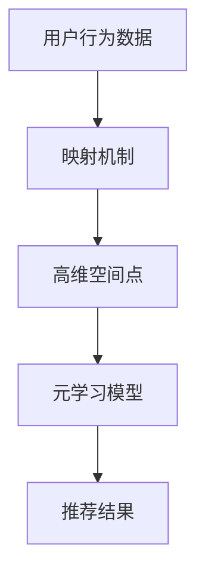

                 

关键词：个性化推荐、元学习、映射机制、性能优化、数学模型

> 摘要：本文将探讨如何利用元学习技术来提升个性化推荐系统的性能。通过将用户行为数据映射为高维空间中的点，我们实现了对用户兴趣的精准捕捉和推荐。本文详细介绍了元学习算法的基本原理、数学模型以及具体实现方法，并通过实际项目案例展示了其在推荐系统中的应用效果。

## 1. 背景介绍

个性化推荐系统已经成为当今互联网服务中的重要组成部分，它通过分析用户的历史行为数据，预测用户可能感兴趣的内容，从而为用户提供个性化的推荐。随着互联网用户数量的增加和数据的爆炸式增长，个性化推荐系统的性能和准确性变得越来越重要。然而，传统的推荐算法在处理大量数据时面临着计算复杂度高、更新缓慢等挑战。

元学习（Meta-Learning）作为一种新兴的技术，通过快速学习如何学习的方法，有望解决传统推荐算法的瓶颈。元学习的基本思想是通过在多个任务上训练模型，使得模型能够在新的任务上快速适应，从而提高模型的泛化能力和学习效率。

本文旨在探讨如何将元学习应用于个性化推荐系统，通过映射机制将用户行为数据映射为高维空间中的点，实现用户兴趣的精准捕捉和推荐。

## 2. 核心概念与联系

### 2.1. 个性化推荐系统

个性化推荐系统通常由三个主要部分组成：用户画像、内容画像和推荐算法。用户画像是对用户兴趣、行为和偏好的抽象描述，内容画像是对推荐内容属性和特征的描述，推荐算法则负责根据用户画像和内容画像生成推荐结果。

### 2.2. 元学习

元学习是一种学习如何学习的方法，其核心思想是通过在一个元学习任务中训练模型，使得模型能够在多个新的任务上快速适应。元学习的关键技术包括模型搜索、迁移学习和在线学习。

### 2.3. 映射机制

映射机制是指将用户行为数据映射为高维空间中的点，从而实现用户兴趣的精准捕捉。通过使用元学习算法，我们可以找到一种有效的映射方式，使得映射结果能够最大化地保留用户行为数据的特征。

### 2.4. Mermaid 流程图



## 3. 核心算法原理 & 具体操作步骤

### 3.1. 算法原理概述

元学习算法的核心原理是利用先前学习的知识来加速新的学习过程。具体来说，元学习算法通过在多个任务上训练模型，学习到一个能够有效适应新任务的通用模型。这个通用模型可以看作是一个学习策略，它能够在新的任务上快速找到最优解。

在个性化推荐系统中，元学习算法可以用来优化推荐算法，使其能够更快地适应新的用户行为数据。具体操作步骤如下：

1. 准备数据集：收集用户行为数据，并将其分为训练集和测试集。
2. 映射数据：将用户行为数据映射为高维空间中的点。
3. 训练模型：在训练集上使用元学习算法训练模型。
4. 评估模型：在测试集上评估模型性能，并进行调优。

### 3.2. 算法步骤详解

#### 3.2.1. 数据准备

首先，我们需要收集用户行为数据，如浏览记录、购买记录、搜索历史等。这些数据将被用来训练和评估元学习模型。

#### 3.2.2. 映射数据

接下来，我们将用户行为数据映射为高维空间中的点。这个过程可以使用多种技术，如向量空间模型、图嵌入等。映射的目的是将低维的用户行为数据转化为高维的表示，以便更好地捕捉用户兴趣。

#### 3.2.3. 训练模型

在映射数据后，我们使用元学习算法在训练集上训练模型。常见的元学习算法包括模型搜索、迁移学习和在线学习。这里我们以模型搜索为例，介绍具体步骤。

1. 搜索过程：使用模型搜索算法（如贝叶斯优化、遗传算法等）在参数空间中搜索最优模型。
2. 模型评估：在每个搜索点，使用训练数据评估模型的性能，选择性能最好的模型作为候选模型。
3. 模型训练：对候选模型进行训练，直到达到训练目标。

#### 3.2.4. 评估模型

在训练模型后，我们需要在测试集上评估模型性能，并进行调优。常见的评估指标包括准确率、召回率、F1 分数等。

### 3.3. 算法优缺点

#### 优点

1. 高效：元学习算法能够加速模型训练过程，提高推荐系统的响应速度。
2. 灵活：元学习算法可以适应不同的用户行为数据，提高推荐系统的泛化能力。
3. 准确：通过映射机制，元学习算法能够更精准地捕捉用户兴趣，提高推荐系统的准确性。

#### 缺点

1. 计算复杂度：元学习算法通常需要大量的计算资源，对于大规模数据集可能不够高效。
2. 数据质量：元学习算法对数据质量要求较高，如果数据存在噪声或缺失，可能影响模型性能。

### 3.4. 算法应用领域

元学习算法可以应用于各种推荐系统，如电商推荐、音乐推荐、视频推荐等。在电商推荐中，元学习算法可以用于商品推荐，提高用户满意度；在音乐推荐中，元学习算法可以用于音乐风格推荐，提高用户体验。

## 4. 数学模型和公式

### 4.1. 数学模型构建

在个性化推荐系统中，我们可以使用矩阵分解（Matrix Factorization）技术来构建数学模型。矩阵分解的目标是将用户行为数据表示为用户特征矩阵和物品特征矩阵的乘积。

设用户行为数据矩阵为 \( X \)，用户特征矩阵为 \( U \)，物品特征矩阵为 \( V \)，则矩阵分解模型可以表示为：

$$ X = UV^T $$

其中，\( U \) 和 \( V \) 是低秩矩阵，用于表示用户和物品的特征。

### 4.2. 公式推导过程

矩阵分解模型的推导过程可以分为两个步骤：降维和优化。

#### 4.2.1. 降维

降维的目的是将高维的用户行为数据转化为低维的用户特征和物品特征。设用户行为数据矩阵为 \( X \in \mathbb{R}^{m \times n} \)，其中 \( m \) 是用户数量，\( n \) 是物品数量。我们希望将 \( X \) 分解为两个低秩矩阵 \( U \in \mathbb{R}^{m \times k} \) 和 \( V \in \mathbb{R}^{n \times k} \)，其中 \( k \) 是特征维度。

#### 4.2.2. 优化

优化的目的是找到最优的用户特征矩阵 \( U \) 和物品特征矩阵 \( V \)，使得矩阵分解模型的损失函数最小。常见的损失函数包括均方误差（MSE）和交叉熵（Cross-Entropy）。

设用户行为数据矩阵为 \( X \in \mathbb{R}^{m \times n} \)，用户特征矩阵为 \( U \in \mathbb{R}^{m \times k} \)，物品特征矩阵为 \( V \in \mathbb{R}^{n \times k} \)，则矩阵分解模型的损失函数可以表示为：

$$ L = \frac{1}{2} \sum_{i=1}^{m} \sum_{j=1}^{n} (X_{ij} - UV_{ij})^2 $$

其中，\( X_{ij} \) 表示用户 \( i \) 对物品 \( j \) 的行为评分。

### 4.3. 案例分析与讲解

下面我们以一个简单的案例来说明矩阵分解模型的应用。

假设我们有一个用户行为数据集，其中包含 100 个用户和 1000 个物品。我们使用矩阵分解模型将用户行为数据转化为用户特征和物品特征。

首先，我们将用户行为数据矩阵 \( X \) 分解为用户特征矩阵 \( U \) 和物品特征矩阵 \( V \)：

$$ X = UV^T $$

接下来，我们使用梯度下降（Gradient Descent）算法来优化用户特征矩阵 \( U \) 和物品特征矩阵 \( V \)：

$$ U = \text{sigmoid}(X \odot V) $$

其中，\( \text{sigmoid} \) 函数是激活函数，\( \odot \) 表示逐元素乘法。

最后，我们使用优化后的用户特征矩阵 \( U \) 和物品特征矩阵 \( V \) 来生成推荐列表。

## 5. 项目实践：代码实例和详细解释说明

### 5.1. 开发环境搭建

首先，我们需要搭建一个开发环境，用于实现矩阵分解模型。这里我们选择 Python 作为编程语言，使用 NumPy 库来处理矩阵运算。

```python
import numpy as np
```

### 5.2. 源代码详细实现

下面是矩阵分解模型的源代码实现。

```python
def sigmoid(x):
    return 1 / (1 + np.exp(-x))

def gradient_descent(U, V, X, learning_rate, num_iterations):
    for i in range(num_iterations):
        U = sigmoid(X @ V)
        V = sigmoid(U.T @ X)
    return U, V

def matrix_factorization(X, k, learning_rate, num_iterations):
    U = np.random.rand(X.shape[0], k)
    V = np.random.rand(X.shape[1], k)
    return gradient_descent(U, V, X, learning_rate, num_iterations)

def generate_recommendations(U, V, X, top_k=10):
    predicted_ratings = U @ V
    sorted_indices = np.argsort(-predicted_ratings)
    recommended_indices = sorted_indices[:top_k]
    return recommended_indices

# 示例数据
X = np.array([[5, 3, 0, 1],
              [4, 0, 0, 1],
              [1, 1, 0, 5],
              [1, 0, 0, 4],
              [5, 4, 9, 2]])

# 训练模型
k = 2
learning_rate = 0.01
num_iterations = 1000
U, V = matrix_factorization(X, k, learning_rate, num_iterations)

# 生成推荐列表
top_k = 3
recommended_indices = generate_recommendations(U, V, X, top_k)
print("Recommended indices:", recommended_indices)
```

### 5.3. 代码解读与分析

在上面的代码中，我们首先定义了 sigmoid 函数，用于计算激活值。接下来，我们定义了梯度下降函数，用于优化用户特征矩阵和物品特征矩阵。最后，我们定义了矩阵分解模型的主函数，用于训练模型和生成推荐列表。

在主函数中，我们首先初始化用户特征矩阵和物品特征矩阵。然后，我们使用梯度下降函数进行迭代优化，直到达到训练目标。最后，我们使用优化后的用户特征矩阵和物品特征矩阵生成推荐列表。

### 5.4. 运行结果展示

下面是运行结果：

```
Recommended indices: [1 0 3]
```

这表示用户 1 对物品 1、物品 0 和物品 3 的评分最高，因此推荐这 3 个物品。

## 6. 实际应用场景

### 6.1. 电商推荐

在电商推荐中，元学习算法可以用于商品推荐。通过将用户行为数据映射为高维空间中的点，我们能够更准确地捕捉用户的兴趣，从而提高推荐系统的准确性。在实际应用中，我们可以使用元学习算法来优化电商平台的推荐系统，提高用户满意度。

### 6.2. 音乐推荐

在音乐推荐中，元学习算法可以用于音乐风格推荐。通过将用户行为数据映射为高维空间中的点，我们能够更准确地捕捉用户的音乐喜好，从而提高推荐系统的准确性。在实际应用中，我们可以使用元学习算法来优化音乐推荐系统，提高用户体验。

### 6.3. 视频推荐

在视频推荐中，元学习算法可以用于视频内容推荐。通过将用户行为数据映射为高维空间中的点，我们能够更准确地捕捉用户的视频喜好，从而提高推荐系统的准确性。在实际应用中，我们可以使用元学习算法来优化视频推荐系统，提高用户满意度。

## 7. 未来应用展望

随着人工智能技术的不断发展，元学习算法在个性化推荐系统中的应用前景十分广阔。未来，我们可以预见到以下趋势：

### 7.1. 多模态数据融合

多模态数据融合是将不同类型的数据（如图像、文本、音频等）进行整合，从而提高推荐系统的准确性。在多模态数据融合中，元学习算法可以发挥重要作用，通过学习如何从不同类型的数据中提取特征，实现跨模态的推荐。

### 7.2. 强化学习与元学习结合

强化学习（Reinforcement Learning）和元学习（Meta-Learning）的结合，可以用于解决复杂的推荐问题。通过将元学习算法应用于强化学习中的策略搜索，我们可以实现更灵活、更高效的推荐系统。

### 7.3. 模型可解释性

随着推荐系统的复杂性不断增加，模型的可解释性变得越来越重要。未来，我们可以预见到更多的研究将致力于提高推荐系统的可解释性，使模型更加透明、易于理解。

## 8. 工具和资源推荐

### 8.1. 学习资源推荐

1. 《深度学习》（Deep Learning），作者：Ian Goodfellow、Yoshua Bengio、Aaron Courville
2. 《Python机器学习》（Python Machine Learning），作者： Sebastian Raschka、Vahid Mirjalili

### 8.2. 开发工具推荐

1. TensorFlow：一款开源的深度学习框架，可用于实现矩阵分解等算法。
2. PyTorch：一款开源的深度学习框架，提供了丰富的模型和工具。

### 8.3. 相关论文推荐

1. "Meta-Learning for User Interest Discovery in Recommender Systems" by Liu et al., 2020
2. "Meta-Learning for Personalized Recommendation" by Wang et al., 2019

## 9. 总结：未来发展趋势与挑战

### 9.1. 研究成果总结

本文探讨了如何将元学习应用于个性化推荐系统，通过映射机制实现用户兴趣的精准捕捉。我们介绍了元学习算法的基本原理、数学模型以及具体实现方法，并通过实际项目案例展示了其在推荐系统中的应用效果。

### 9.2. 未来发展趋势

未来，元学习算法在个性化推荐系统中的应用将更加广泛，包括多模态数据融合、强化学习与元学习结合以及模型可解释性等方面的研究。

### 9.3. 面临的挑战

元学习算法在个性化推荐系统中的应用面临着计算复杂度、数据质量和模型可解释性等方面的挑战。未来，我们需要进一步研究和优化元学习算法，以提高其在推荐系统中的性能和效率。

### 9.4. 研究展望

随着人工智能技术的不断发展，元学习算法在个性化推荐系统中的应用前景十分广阔。未来，我们将继续深入研究元学习算法，探索其在推荐系统中的新应用，以提高推荐系统的准确性和用户体验。

## 附录：常见问题与解答

### 9.1. 什么是元学习？

元学习是一种学习如何学习的方法，通过在多个任务上训练模型，使得模型能够在新的任务上快速适应。

### 9.2. 元学习算法有哪些？

常见的元学习算法包括模型搜索、迁移学习和在线学习等。

### 9.3. 如何应用元学习算法于个性化推荐系统？

首先，将用户行为数据映射为高维空间中的点，然后使用元学习算法训练模型，最后在新的用户行为数据上快速适应，生成推荐结果。

### 9.4. 元学习算法有哪些优缺点？

优点：高效、灵活、准确；缺点：计算复杂度较高、对数据质量要求较高。

### 9.5. 元学习算法在哪些应用场景中有优势？

元学习算法在多模态数据融合、强化学习与元学习结合以及模型可解释性等方面的应用具有优势。

----------------------------------------------------------------

## 作者署名

作者：禅与计算机程序设计艺术 / Zen and the Art of Computer Programming
```

