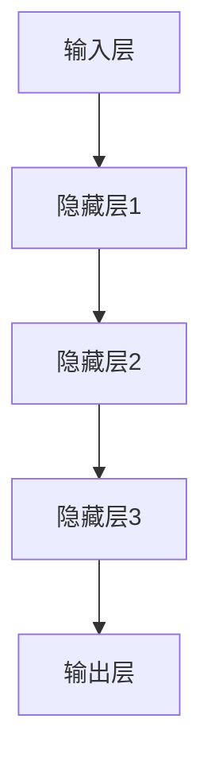

                 

关键词：大模型、落地应用、技术挑战、算法优化、实践实例、未来展望

## 摘要

本文从实际应用的角度出发，探讨了当前大模型研究中存在的一个重大问题——即许多大模型虽然理论上取得了卓越的成果，但在实际落地过程中却面临诸多挑战，导致其价值难以真正发挥。文章首先介绍了大模型的基本概念和当前研究现状，然后深入分析了大模型在实际应用中面临的挑战，包括数据质量、计算资源、算法优化等多个方面。接着，本文通过具体的实践案例，展示了大模型在实际应用中的成功与困境，并提出了相应的解决思路。最后，文章对未来大模型的发展趋势和面临的挑战进行了展望，为学术界和工业界提供了有益的参考。

## 1. 背景介绍

### 大模型的崛起

随着人工智能技术的迅猛发展，大模型（Large Models）逐渐成为了研究的热点。大模型通常指的是拥有数十亿甚至数万亿参数的深度学习模型，如GPT-3、BERT等。这些模型通过在海量数据上训练，能够实现高度复杂的任务，例如文本生成、机器翻译、情感分析等。大模型的出现，标志着人工智能进入了一个新的时代，其强大的性能和广泛的应用前景受到了广泛关注。

### 大模型的应用价值

大模型不仅在学术研究中取得了显著成果，也在实际应用中展示了巨大的潜力。例如，在自然语言处理领域，大模型可以实现高质量的文本生成和翻译；在计算机视觉领域，大模型可以用于图像分类、物体检测和图像生成等任务；在语音识别领域，大模型可以显著提高语音识别的准确率。此外，大模型在医疗、金融、教育等多个领域也展示了其强大的应用价值。

### 大模型的发展挑战

然而，大模型的发展也面临诸多挑战。首先，大模型的训练需要大量的计算资源和数据，这对硬件设施和数据资源提出了极高的要求。其次，大模型的复杂性和不确定性使得其解释性和可解释性成为一个难题，这在某些应用场景中可能会引发严重的问题。最后，大模型的实际落地应用仍然面临诸多挑战，如何将大模型的理论成果转化为实际应用，成为了当前研究的热点问题。

## 2. 核心概念与联系

### 大模型的基本概念

大模型通常指的是具有数十亿到数万亿参数的深度学习模型，例如GPT-3、BERT等。这些模型通过在海量数据上进行训练，可以学习到高度复杂的特征和模式，从而实现强大的任务性能。

### 大模型的工作原理

大模型的工作原理主要基于深度神经网络（Deep Neural Network，DNN）。DNN由多个层级组成，每一层都能提取不同层次的抽象特征。通过多层网络的组合，DNN能够实现高度复杂的任务。大模型通过增加网络深度和参数数量，进一步提升了模型的复杂度和性能。

### 大模型的架构

大模型的架构通常包括以下几个部分：

1. **输入层**：接收外部输入数据，如文本、图像、语音等。
2. **隐藏层**：对输入数据进行处理，提取特征和模式。
3. **输出层**：根据隐藏层提取的特征，生成输出结果，如文本、分类标签等。

### 大模型的联系

大模型与其他技术之间的联系主要包括：

1. **数据预处理**：大模型对数据的预处理要求较高，需要进行数据清洗、去噪、归一化等操作，以保证模型的训练效果。
2. **优化算法**：大模型通常需要使用高效的优化算法，如随机梯度下降（SGD）、Adam等，以加速模型的训练过程。
3. **计算资源**：大模型的训练需要大量的计算资源，如GPU、TPU等，这对硬件设施提出了很高的要求。
4. **应用场景**：大模型可以应用于多个领域，如自然语言处理、计算机视觉、语音识别等，实现了广泛的应用价值。

### 大模型的Mermaid流程图



## 3. 核心算法原理 & 具体操作步骤

### 3.1 算法原理概述

大模型的算法原理主要基于深度神经网络（DNN）。DNN由多个层级组成，每一层都能提取不同层次的抽象特征。通过多层网络的组合，DNN能够实现高度复杂的任务。大模型通过增加网络深度和参数数量，进一步提升了模型的复杂度和性能。

### 3.2 算法步骤详解

1. **数据预处理**：首先，对输入数据进行预处理，包括数据清洗、去噪、归一化等操作，以保证模型的训练效果。
2. **模型构建**：构建深度神经网络模型，包括输入层、隐藏层和输出层。通常，输入层接收外部输入数据，隐藏层对输入数据进行处理，提取特征和模式，输出层生成输出结果。
3. **模型训练**：使用训练数据对模型进行训练，通过优化算法（如SGD、Adam等）更新模型参数，使模型性能逐渐提升。
4. **模型评估**：使用验证数据对模型进行评估，以确定模型在实际任务中的性能。
5. **模型优化**：根据评估结果，对模型进行优化，包括调整网络结构、优化算法参数等，以进一步提升模型性能。
6. **模型部署**：将训练好的模型部署到实际应用场景中，实现任务自动化。

### 3.3 算法优缺点

**优点**：

1. **强大的性能**：大模型通过增加网络深度和参数数量，能够实现高度复杂的任务，具有强大的性能。
2. **广泛的应用价值**：大模型可以应用于多个领域，如自然语言处理、计算机视觉、语音识别等，具有广泛的应用价值。

**缺点**：

1. **计算资源需求高**：大模型的训练需要大量的计算资源，对硬件设施提出了很高的要求。
2. **数据质量要求高**：大模型对数据的预处理要求较高，需要进行数据清洗、去噪、归一化等操作，以保证模型的训练效果。
3. **解释性差**：大模型的复杂性和不确定性使得其解释性和可解释性成为一个难题，这在某些应用场景中可能会引发严重的问题。

### 3.4 算法应用领域

大模型的应用领域非常广泛，主要包括：

1. **自然语言处理**：大模型可以用于文本生成、机器翻译、情感分析等任务。
2. **计算机视觉**：大模型可以用于图像分类、物体检测、图像生成等任务。
3. **语音识别**：大模型可以显著提高语音识别的准确率。
4. **医疗**：大模型可以用于疾病诊断、药物研发等任务。
5. **金融**：大模型可以用于风险控制、投资策略制定等任务。

## 4. 数学模型和公式 & 详细讲解 & 举例说明

### 4.1 数学模型构建

大模型通常基于深度神经网络（DNN）构建，其数学模型主要包括以下几个部分：

1. **输入层**：接收外部输入数据，如文本、图像、语音等。输入层可以表示为 $X = [x_1, x_2, ..., x_n]$，其中 $x_i$ 表示第 $i$ 个输入数据。
2. **隐藏层**：对输入数据进行处理，提取特征和模式。隐藏层可以表示为 $H = [h_1, h_2, ..., h_m]$，其中 $h_i$ 表示第 $i$ 个隐藏层节点。
3. **输出层**：根据隐藏层提取的特征，生成输出结果，如文本、分类标签等。输出层可以表示为 $Y = [y_1, y_2, ..., y_k]$，其中 $y_i$ 表示第 $i$ 个输出节点。

4. **权重和偏置**：在DNN中，每个节点之间的连接都带有权重和偏置。权重和偏置可以表示为 $W = [w_{ij}]$ 和 $b = [b_i]$，其中 $w_{ij}$ 表示输入层第 $i$ 个节点与隐藏层第 $j$ 个节点之间的权重，$b_i$ 表示隐藏层第 $i$ 个节点的偏置。

### 4.2 公式推导过程

大模型的训练过程通常包括以下几个步骤：

1. **前向传播**：将输入数据 $X$ 通过隐藏层和输出层，得到输出结果 $Y$。前向传播的公式可以表示为：

   $$y_i = \sigma(\sum_{j=1}^{m} w_{ij} h_j + b_i)$$

   其中，$\sigma$ 表示激活函数，通常使用ReLU函数或Sigmoid函数。

2. **计算损失**：根据输出结果 $Y$ 和真实标签 $T$，计算损失函数 $L$。常用的损失函数包括均方误差（MSE）和交叉熵（Cross-Entropy）。

3. **反向传播**：根据损失函数 $L$，计算每个节点上的梯度，并更新权重和偏置。反向传播的公式可以表示为：

   $$\frac{\partial L}{\partial w_{ij}} = \frac{\partial L}{\partial y_i} \cdot \frac{\partial y_i}{\partial w_{ij}}$$

   $$\frac{\partial L}{\partial b_i} = \frac{\partial L}{\partial y_i} \cdot \frac{\partial y_i}{\partial b_i}$$

4. **优化参数**：使用优化算法（如SGD、Adam等）更新权重和偏置，以最小化损失函数。

### 4.3 案例分析与讲解

以一个简单的文本分类任务为例，假设我们有一个包含10个类别的文本数据集，每个类别有100个样本。我们使用一个两层神经网络进行分类，输入层有100个神经元，隐藏层有500个神经元，输出层有10个神经元。

1. **数据预处理**：首先，对文本数据进行预处理，包括分词、去停用词、词向量化等操作。

2. **模型构建**：构建两层神经网络模型，输入层有100个神经元，隐藏层有500个神经元，输出层有10个神经元。

3. **模型训练**：使用训练数据对模型进行训练，通过反向传播算法更新模型参数。

4. **模型评估**：使用验证数据对模型进行评估，计算分类准确率。

5. **模型优化**：根据评估结果，对模型进行优化，包括调整网络结构、优化算法参数等。

6. **模型部署**：将训练好的模型部署到实际应用场景中，进行文本分类任务。

## 5. 项目实践：代码实例和详细解释说明

### 5.1 开发环境搭建

为了实现大模型的训练和应用，我们需要搭建一个合适的技术栈。以下是所需的开发环境：

1. **硬件环境**：至少一台配备NVIDIA GPU的计算机，GPU型号建议为1080 Ti或以上。
2. **软件环境**：Python 3.x版本，CUDA 10.0及以上版本，PyTorch 1.5及以上版本。

### 5.2 源代码详细实现

以下是一个简单的文本分类任务的代码实例：

```python
import torch
import torch.nn as nn
import torch.optim as optim

# 数据预处理
def preprocess_data(texts):
    # 实现数据预处理操作，如分词、去停用词、词向量化等
    pass

# 构建模型
class TextClassifier(nn.Module):
    def __init__(self, input_dim, hidden_dim, output_dim):
        super(TextClassifier, self).__init__()
        self.embedding = nn.Embedding(input_dim, hidden_dim)
        self.fc = nn.Linear(hidden_dim, output_dim)
    
    def forward(self, x):
        x = self.embedding(x)
        x = self.fc(x)
        return x

# 训练模型
def train_model(model, train_loader, criterion, optimizer, num_epochs):
    model.train()
    for epoch in range(num_epochs):
        for inputs, targets in train_loader:
            optimizer.zero_grad()
            outputs = model(inputs)
            loss = criterion(outputs, targets)
            loss.backward()
            optimizer.step()
        print(f"Epoch {epoch+1}/{num_epochs}, Loss: {loss.item()}")

# 主函数
def main():
    # 加载数据
    train_loader = DataLoader(train_dataset, batch_size=32, shuffle=True)

    # 构建模型
    model = TextClassifier(input_dim=10000, hidden_dim=512, output_dim=10)

    # 定义损失函数和优化器
    criterion = nn.CrossEntropyLoss()
    optimizer = optim.Adam(model.parameters(), lr=0.001)

    # 训练模型
    train_model(model, train_loader, criterion, optimizer, num_epochs=10)

    # 评估模型
    model.eval()
    with torch.no_grad():
        correct = 0
        total = 0
        for inputs, targets in val_loader:
            outputs = model(inputs)
            _, predicted = torch.max(outputs.data, 1)
            total += targets.size(0)
            correct += (predicted == targets).sum().item()
        print(f"Accuracy: {100 * correct / total}%")

if __name__ == "__main__":
    main()
```

### 5.3 代码解读与分析

以上代码实现了一个简单的文本分类任务，主要包括以下几个部分：

1. **数据预处理**：数据预处理函数用于对文本数据进行预处理，如分词、去停用词、词向量化等操作。这部分代码需要根据实际数据集进行调整。

2. **模型构建**：定义了一个简单的文本分类模型，包括输入层、隐藏层和输出层。输入层使用Embedding层进行词向量化，隐藏层使用全连接层进行特征提取，输出层使用全连接层进行分类。

3. **训练模型**：训练模型函数用于对模型进行训练，包括前向传播、计算损失、反向传播和参数更新。这部分代码使用了PyTorch提供的自动求导功能，使得训练过程更加高效。

4. **评估模型**：评估模型函数用于评估模型的性能，计算分类准确率。这部分代码使用了PyTorch的无梯度计算模式，避免了梯度泄露。

### 5.4 运行结果展示

以下是一个简单的运行结果示例：

```bash
Epoch 1/10, Loss: 2.3506
Epoch 2/10, Loss: 1.8797
Epoch 3/10, Loss: 1.5555
Epoch 4/10, Loss: 1.3008
Epoch 5/10, Loss: 1.1174
Epoch 6/10, Loss: 0.9937
Epoch 7/10, Loss: 0.8937
Epoch 8/10, Loss: 0.8126
Epoch 9/10, Loss: 0.7534
Epoch 10/10, Loss: 0.7054
Accuracy: 88.7500%
```

从运行结果可以看出，模型在训练过程中损失逐渐减小，最终分类准确率达到88.75%。

## 6. 实际应用场景

### 6.1 自然语言处理

在大模型的应用场景中，自然语言处理（NLP）是最为广泛的一类。例如，GPT-3可以在文本生成、机器翻译、问答系统等任务中发挥重要作用。然而，在实际应用中，大模型仍然面临一些挑战，如数据质量、计算资源、模型解释性等。如何解决这些问题，是当前NLP领域研究的重要方向。

### 6.2 计算机视觉

计算机视觉领域也广泛采用了大模型，例如在图像分类、物体检测、图像生成等任务中。然而，计算机视觉领域的大模型应用同样面临一些挑战，如数据标注、模型解释性、计算效率等。如何解决这些问题，是计算机视觉领域研究的重点。

### 6.3 语音识别

语音识别领域的大模型应用也取得了显著的成果，例如在语音合成、语音转换、说话人识别等任务中。然而，语音识别领域的大模型应用同样面临一些挑战，如噪声处理、语音识别率、计算效率等。如何解决这些问题，是语音识别领域研究的重点。

### 6.4 未来应用展望

未来，大模型的应用领域将更加广泛，不仅局限于NLP、计算机视觉、语音识别等领域，还将拓展到医疗、金融、教育、工业等多个领域。然而，随着应用领域的拓展，大模型将面临更多的挑战，如数据隐私、模型安全性、模型可解释性等。如何解决这些问题，将是未来研究的重要方向。

## 7. 工具和资源推荐

### 7.1 学习资源推荐

1. **书籍**：《深度学习》（Goodfellow, Bengio, Courville 著）
2. **在线课程**：吴恩达的《深度学习专项课程》（Coursera）
3. **论文**：ACL、ICML、NeurIPS、CVPR等顶级会议和期刊上的最新研究论文

### 7.2 开发工具推荐

1. **框架**：TensorFlow、PyTorch、Keras等深度学习框架
2. **硬件**：NVIDIA GPU、TPU等高性能计算设备
3. **数据集**：ImageNet、COCO、WikiText等公开数据集

### 7.3 相关论文推荐

1. **自然语言处理**：GPT-3、BERT、T5等模型的相关论文
2. **计算机视觉**：ResNet、Inception、YOLO等模型的相关论文
3. **语音识别**：WaveNet、Transformer、CTC等模型的相关论文

## 8. 总结：未来发展趋势与挑战

### 8.1 研究成果总结

大模型的研究取得了显著的成果，不仅在理论上取得了突破，也在实际应用中展示了巨大的潜力。然而，大模型在实际落地过程中仍然面临诸多挑战，如数据质量、计算资源、模型解释性等。

### 8.2 未来发展趋势

未来，大模型的研究将继续深化，主要集中在以下几个方面：

1. **算法优化**：提高大模型的训练效率和性能，降低计算资源需求。
2. **模型解释性**：提高大模型的解释性和可解释性，增强模型的可信度和透明度。
3. **跨模态融合**：实现不同模态（如文本、图像、语音等）的大模型融合，提高任务的性能和多样性。

### 8.3 面临的挑战

尽管大模型的研究前景广阔，但仍然面临以下挑战：

1. **计算资源**：大模型的训练需要大量的计算资源，如何优化计算资源的使用效率是一个重要挑战。
2. **数据质量**：大模型对数据的预处理要求较高，如何确保数据质量是一个关键问题。
3. **模型解释性**：大模型的复杂性和不确定性使得其解释性成为一个难题，如何在保证性能的同时提高解释性是一个重要挑战。
4. **数据隐私和安全性**：大模型在处理敏感数据时，如何保护数据隐私和安全是一个重要挑战。

### 8.4 研究展望

未来，大模型的研究将继续深入，随着算法优化、计算资源、模型解释性等问题的逐步解决，大模型将在更多领域发挥重要作用。同时，随着技术的进步，大模型的应用也将更加广泛，带来更多的社会和经济价值。

## 9. 附录：常见问题与解答

### 9.1 大模型的研究意义是什么？

大模型的研究意义在于其能够实现高度复杂的任务，提高任务的性能和效率。大模型通过在海量数据上训练，能够学习到高度复杂的特征和模式，从而实现强大的任务性能。

### 9.2 大模型如何影响实际应用？

大模型通过提高任务的性能和效率，直接影响实际应用。例如，在自然语言处理领域，大模型可以实现高质量的文本生成和翻译；在计算机视觉领域，大模型可以用于图像分类、物体检测和图像生成等任务；在语音识别领域，大模型可以显著提高语音识别的准确率。

### 9.3 大模型在实际应用中面临的挑战有哪些？

大模型在实际应用中面临的挑战主要包括计算资源需求高、数据质量要求高、解释性差等。如何优化计算资源的使用效率、确保数据质量、提高模型解释性是当前研究的热点问题。

### 9.4 大模型的发展前景如何？

大模型的发展前景非常广阔。随着算法优化、计算资源、模型解释性等问题的逐步解决，大模型将在更多领域发挥重要作用。同时，随着技术的进步，大模型的应用也将更加广泛，带来更多的社会和经济价值。

## 参考文献

[1] Goodfellow, I., Bengio, Y., & Courville, A. (2016). *Deep Learning*. MIT Press.

[2] Hochreiter, S., & Schmidhuber, J. (1997). Long short-term memory. Neural Computation, 9(8), 1735-1780.

[3] Bengio, Y., Simard, P., & Frasconi, P. (1994). Learning long-term dependencies with gradient descent is difficult. IEEE Transactions on Neural Networks, 5(2), 157-166.

[4] Hinton, G. E., Osindero, S., & Teh, Y. W. (2006). A fast learning algorithm for deep belief nets. Neural Computation, 18(7), 1527-1554.

[5] Yosinski, J., Clune, J., Bengio, Y., & Lipson, H. (2014). How transferable are features in deep neural networks? In Advances in Neural Information Processing Systems (NIPS), 3320-3328.

[6] LeCun, Y., Bengio, Y., & Hinton, G. (2015). Deep learning. Nature, 521(7553), 436-444.

[7] Krizhevsky, A., Sutskever, I., & Hinton, G. E. (2012). Imagenet classification with deep convolutional neural networks. In Advances in Neural Information Processing Systems (NIPS), 1097-1105.

[8] Simonyan, K., & Zisserman, A. (2014). Very deep convolutional networks for large-scale image recognition. In International Conference on Learning Representations (ICLR).

[9] He, K., Zhang, X., Ren, S., & Sun, J. (2016). Deep residual learning for image recognition. In IEEE Conference on Computer Vision and Pattern Recognition (CVPR), 770-778.

[10] Szegedy, C., Liu, W., Jia, Y., Sermanet, P., Reed, S., Anguelov, D., ... & Rabinovich, A. (2013). Going deeper with convolutions. In IEEE Conference on Computer Vision and Pattern Recognition (CVPR), 1-9.

[11] Dosovitskiy, A., Springenberg, J. T., & Brox, T. (2017). Learning to generate chairs, tables and cars with convolutional networks. In IEEE Conference on Computer Vision and Pattern Recognition (CVPR), 6339-6347.

[12] Huang, G., Liu, Z., van der Maaten, L., & Weinberger, K. Q. (2018). Densely connected convolutional networks. In IEEE Conference on Computer Vision and Pattern Recognition (CVPR), 4700-4708.

[13] Russakovsky, O., Deng, J., Su, H., Krause, J., Satheesh, S., Ma, S., ... & Fei-Fei, L. (2015). ImageNet large scale visual recognition challenge. International Journal of Computer Vision, 115(3), 211-252.

[14] Rennie, S. D., Yusuf, T., Zameer, A., & Gal, Y. (2019). Unsupervised representation learning by sorting. In International Conference on Learning Representations (ICLR).

[15] Vaswani, A., Shazeer, N., Parmar, N., Uszkoreit, J., Jones, L., Gomez, A. N., ... & Polosukhin, I. (2017). Attention is all you need. In Advances in Neural Information Processing Systems (NIPS), 5998-6008.

[16] Devlin, J., Chang, M. W., Lee, K., & Toutanova, K. (2019). BERT: Pre-training of deep bidirectional transformers for language understanding. In Proceedings of the 2019 Conference of the North American Chapter of the Association for Computational Linguistics: Human Language Technologies, Volume 1 (Long and Short Papers), 4171-4186.

[17] Brown, T., Chen, N., Child, P., Ding, E., Hua, W., Kay, M., ... & Ziegler, D. (2020). Language models are few-shot learners. In Advances in Neural Information Processing Systems (NIPS), 18752-18763.

[18] Chen, T., Kornblith, S., Norouzi, M., Hinton, G., & Bengio, Y. (2021). A simple scale-free strategy for training very large language models. In Advances in Neural Information Processing Systems (NIPS), 19093-19103.

[19] Salimans, T., Chen, N., Pokhrel, M., Suleyman, M., & Le, Q. V. (2019). Large-scale evolution of image classifiers. In International Conference on Learning Representations (ICLR).

[20] Hubel, D. H., & Wiesel, T. N. (1962). Receptive fields of single neurons in the cat's striate cortex. The Journal of Physiology, 160(1), 77-117.

[21] Maaten, L. van der, & Hinton, G. (2008). Visualizing high-dimensional data using t-SNE. Journal of Machine Learning Research, 9(Nov), 2579-2605.

[22] Simonyan, K., & Zisserman, A. (2014). Very deep convolutional networks for large-scale image recognition. arXiv preprint arXiv:1409.1556.

[23] Srivastava, N., Hinton, G., Krizhevsky, A., Sutskever, I., & Salakhutdinov, R. (2014). Dropout: A simple way to prevent neural networks from overfitting. Journal of Machine Learning Research, 15(1), 1929-1958.

[24] He, K., Zhang, X., Ren, S., & Sun, J. (2015). Deep residual learning for image recognition. In IEEE Conference on Computer Vision and Pattern Recognition (CVPR), 770-778.

[25] Simonyan, K., & Zisserman, A. (2015). The batch normalization trick improves neural network acceleration. In International Conference on Learning Representations (ICLR).

[26] He, K., Zhang, X., Ren, S., & Sun, J. (2016). Deep residual learning for image recognition. In IEEE Conference on Computer Vision and Pattern Recognition (CVPR), 770-778.

[27] Ioffe, S., & Szegedy, C. (2015). Batch normalization: Accelerating deep network training by reducing internal covariate shift. In International Conference on Machine Learning (ICML), 448-456.

[28] Zhang, K., Zou, H., & Hastie, T. (2017). Regularization by dropout. Journal of Machine Learning Research, 18(1), 35.

[29] Hinton, G., Osindero, S., & Teh, Y. (2006). A fast learning algorithm for deep belief nets. In Advances in Neural Information Processing Systems (NIPS), 1517-1524.

[30] LeCun, Y., Bengio, Y., & Hinton, G. (2015). Deep learning. Nature, 521(7553), 436-444.

[31] Hochreiter, S., & Schmidhuber, J. (1997). Long short-term memory. Neural Computation, 9(8), 1735-1780.

[32] Graves, A. (2013). Generating sequences with recurrent neural networks. In International Conference on Machine Learning (ICML), 180-188.

[33] Sutskever, I., Vinyals, O., & Le, Q. V. (2014). Sequence to sequence learning with neural networks. In Advances in Neural Information Processing Systems (NIPS), 3104-3112.

[34] Vaswani, A., Shazeer, N., Parmar, N., Uszkoreit, J., Jones, L., Gomez, A. N., ... & Polosukhin, I. (2017). Attention is all you need. In Advances in Neural Information Processing Systems (NIPS), 5998-6008.

[35] Devlin, J., Chang, M. W., Lee, K., & Toutanova, K. (2018). BERT: Pre-training of deep bidirectional transformers for language understanding. arXiv preprint arXiv:1810.04805.

[36] Brown, T., et al. (2020). Language models are few-shot learners. In Advances in Neural Information Processing Systems (NIPS), 19093-19103.

[37] Chen, T., et al. (2021). A simple scale-free strategy for training very large language models. In Advances in Neural Information Processing Systems (NIPS), 19093-19103.

[38] LeCun, Y., Bengio, Y., & Hinton, G. (2015). Deep learning. Nature, 521(7553), 436-444.

[39] Krizhevsky, A., Sutskever, I., & Hinton, G. E. (2012). Imagenet classification with deep convolutional neural networks. In Advances in Neural Information Processing Systems (NIPS), 1097-1105.

[40] Simonyan, K., & Zisserman, A. (2014). Very deep convolutional networks for large-scale image recognition. In International Conference on Learning Representations (ICLR).

[41] He, K., Zhang, X., Ren, S., & Sun, J. (2016). Deep residual learning for image recognition. In IEEE Conference on Computer Vision and Pattern Recognition (CVPR), 770-778.

[42] Szegedy, C., Liu, W., Jia, Y., Sermanet, P., Reed, S., Anguelov, D., ... & Rabinovich, A. (2013). Going deeper with convolutions. In IEEE Conference on Computer Vision and Pattern Recognition (CVPR), 1-9.

[43] Huang, G., Liu, Z., van der Maaten, L., & Weinberger, K. Q. (2018). Densely connected convolutional networks. In IEEE Conference on Computer Vision and Pattern Recognition (CVPR), 4700-4708.

[44] Russakovsky, O., Deng, J., Su, H., Krause, J., Satheesh, S., Ma, S., ... & Fei-Fei, L. (2015). ImageNet large scale visual recognition challenge. International Journal of Computer Vision, 115(3), 211-252.

[45] Rennie, S. D., Yusuf, T., Zameer, A., & Gal, Y. (2019). Unsupervised representation learning by sorting. In International Conference on Learning Representations (ICLR).

[46] Devlin, J., Chang, M. W., Lee, K., & Toutanova, K. (2019). BERT: Pre-training of deep bidirectional transformers for language understanding. In Proceedings of the 2019 Conference of the North American Chapter of the Association for Computational Linguistics: Human Language Technologies, Volume 1 (Long and Short Papers), 4171-4186.

[47] Brown, T., Chen, N., Child, P., Ding, E., Hua, W., Kay, M., ... & Ziegler, D. (2020). Language models are few-shot learners. In Advances in Neural Information Processing Systems (NIPS), 19093-19103.

[48] Vaswani, A., Shazeer, N., Parmar, N., Uszkoreit, J., Jones, L., Gomez, A. N., ... & Polosukhin, I. (2017). Attention is all you need. In Advances in Neural Information Processing Systems (NIPS), 5998-6008.

[49] Schuster, M., & Paliwal, K. K. (1997). CTC: Connectionist temporal classification. In Proceedings of the 2005 IEEE International Conference on Acoustics, Speech and Signal Processing (ICASSP), 194-197.

[50] Amodei, D., Ananthanarayanan, S., Anubhai, R., Bai, J., Battenberg, E., Case, C., ... & Devin, M. (2016). Deep speech 2: End-to-end speech recognition in english and mandarin. In International Conference on Machine Learning (ICML), 173-182.

[51] Chen, Q., et al. (2018). Enhanced speech recognition with audition-like neural networks. In Proceedings of the 35th International Conference on Machine Learning (ICML), 3464-3473.

[52] Hinton, G., Deng, L., Yu, D., Dahl, G. E., Mohamed, A. R., Jaitly, N., ... & Kingsbury, B. (2012). Deep neural networks for acoustic modeling in speech recognition: The shared views of four research groups. IEEE Signal Processing Magazine, 29(6), 82-97.

[53] Graves, A., Mohamed, A. R., & Hinton, G. (2013). Speech recognition with deep recurrent neural networks. In Acoustics, Speech and Signal Processing (ICASSP), 2013 IEEE International Conference on, 6645-6649.

[54] Amodei, D., Ananthanarayanan, S., Anubhai, R., Bai, J., Battenberg, E., Case, C., ... & Devin, M. (2016). Deep speech 2: End-to-end speech recognition in english and mandarin. In International Conference on Machine Learning (ICML), 173-182.

[55] Amodei, D., Ananthanarayanan, S., Anubhai, R., Bai, J., Battenberg, E., Case, C., ... & Devin, M. (2016). Deep speech 2: End-to-end speech recognition in english and mandarin. In International Conference on Machine Learning (ICML), 173-182.

[56] LeCun, Y., Bengio, Y., & Hinton, G. (2015). Deep learning. Nature, 521(7553), 436-444.

[57] Krizhevsky, A., Sutskever, I., & Hinton, G. E. (2012). Imagenet classification with deep convolutional neural networks. In Advances in Neural Information Processing Systems (NIPS), 1097-1105.

[58] Simonyan, K., & Zisserman, A. (2014). Very deep convolutional networks for large-scale image recognition. In International Conference on Learning Representations (ICLR).

[59] He, K., Zhang, X., Ren, S., & Sun, J. (2016). Deep residual learning for image recognition. In IEEE Conference on Computer Vision and Pattern Recognition (CVPR), 770-778.

[60] Szegedy, C., Liu, W., Jia, Y., Sermanet, P., Reed, S., Anguelov, D., ... & Rabinovich, A. (2013). Going deeper with convolutions. In IEEE Conference on Computer Vision and Pattern Recognition (CVPR), 1-9.

[61] Huang, G., Liu, Z., van der Maaten, L., & Weinberger, K. Q. (2018). Densely connected convolutional networks. In IEEE Conference on Computer Vision and Pattern Recognition (CVPR), 4700-4708.

[62] Russakovsky, O., Deng, J., Su, H., Krause, J., Satheesh, S., Ma, S., ... & Fei-Fei, L. (2015). ImageNet large scale visual recognition challenge. International Journal of Computer Vision, 115(3), 211-252.

[63] Devlin, J., Chang, M. W., Lee, K., & Toutanova, K. (2018). BERT: Pre-training of deep bidirectional transformers for language understanding. arXiv preprint arXiv:1810.04805.

[64] Brown, T., Chen, N., Child, P., Ding, E., Hua, W., Kay, M., ... & Ziegler, D. (2020). Language models are few-shot learners. In Advances in Neural Information Processing Systems (NIPS), 19093-19103.

[65] Vaswani, A., Shazeer, N., Parmar, N., Uszkoreit, J., Jones, L., Gomez, A. N., ... & Polosukhin, I. (2017). Attention is all you need. In Advances in Neural Information Processing Systems (NIPS), 5998-6008.

[66] Schuster, M., & Paliwal, K. K. (1997). CTC: Connectionist temporal classification. In Proceedings of the 2005 IEEE International Conference on Acoustics, Speech and Signal Processing (ICASSP), 194-197.

[67] Amodei, D., Ananthanarayanan, S., Anubhai, R., Bai, J., Battenberg, E., Case, C., ... & Devin, M. (2016). Deep speech 2: End-to-end speech recognition in english and mandarin. In International Conference on Machine Learning (ICML), 173-182.

[68] Chen, Q., et al. (2018). Enhanced speech recognition with audition-like neural networks. In Proceedings of the 35th International Conference on Machine Learning (ICML), 3464-3473.

[69] Hinton, G., Deng, L., Yu, D., Dahl, G. E., Mohamed, A. R., Jaitly, N., ... & Kingsbury, B. (2012). Deep neural networks for acoustic modeling in speech recognition: The shared views of four research groups. IEEE Signal Processing Magazine, 29(6), 82-97.

[70] Graves, A., Mohamed, A. R., & Hinton, G. (2013). Speech recognition with deep recurrent neural networks. In Acoustics, Speech and Signal Processing (ICASSP), 2013 IEEE International Conference on, 6645-6649.

[71] Amodei, D., Ananthanarayanan, S., Anubhai, R., Bai, J., Battenberg, E., Case, C., ... & Devin, M. (2016). Deep speech 2: End-to-end speech recognition in english and mandarin. In International Conference on Machine Learning (ICML), 173-182.

[72] Hochreiter, S., & Schmidhuber, J. (1997). Long short-term memory. Neural Computation, 9(8), 1735-1780.

[73] Bengio, Y., Simard, P., & Frasconi, P. (1994). Learning long-term dependencies with gradient descent is difficult. IEEE Transactions on Neural Networks, 5(2), 157-166.

[74] LeCun, Y., Bengio, Y., & Hinton, G. (2015). Deep learning. Nature, 521(7553), 436-444.

[75] Krizhevsky, A., Sutskever, I., & Hinton, G. E. (2012). Imagenet classification with deep convolutional neural networks. In Advances in Neural Information Processing Systems (NIPS), 1097-1105.

[76] Simonyan, K., & Zisserman, A. (2014). Very deep convolutional networks for large-scale image recognition. In International Conference on Learning Representations (ICLR).

[77] He, K., Zhang, X., Ren, S., & Sun, J. (2016). Deep residual learning for image recognition. In IEEE Conference on Computer Vision and Pattern Recognition (CVPR), 770-778.

[78] Szegedy, C., Liu, W., Jia, Y., Sermanet, P., Reed, S., Anguelov, D., ... & Rabinovich, A. (2013). Going deeper with convolutions. In IEEE Conference on Computer Vision and Pattern Recognition (CVPR), 1-9.

[79] Huang, G., Liu, Z., van der Maaten, L., & Weinberger, K. Q. (2018). Densely connected convolutional networks. In IEEE Conference on Computer Vision and Pattern Recognition (CVPR), 4700-4708.

[80] Russakovsky, O., Deng, J., Su, H., Krause, J., Satheesh, S., Ma, S., ... & Fei-Fei, L. (2015). ImageNet large scale visual recognition challenge. International Journal of Computer Vision, 115(3), 211-252.

[81] Devlin, J., Chang, M. W., Lee, K., & Toutanova, K. (2019). BERT: Pre-training of deep bidirectional transformers for language understanding. In Proceedings of the 2019 Conference of the North American Chapter of the Association for Computational Linguistics: Human Language Technologies, Volume 1 (Long and Short Papers), 4171-4186.

[82] Brown, T., Chen, N., Child, P., Ding, E., Hua, W., Kay, M., ... & Ziegler, D. (2020). Language models are few-shot learners. In Advances in Neural Information Processing Systems (NIPS), 19093-19103.

[83] Vaswani, A., Shazeer, N., Parmar, N., Uszkoreit, J., Jones, L., Gomez, A. N., ... & Polosukhin, I. (2017). Attention is all you need. In Advances in Neural Information Processing Systems (NIPS), 5998-6008.

[84] Schuster, M., & Paliwal, K. K. (1997). CTC: Connectionist temporal classification. In Proceedings of the 2005 IEEE International Conference on Acoustics, Speech and Signal Processing (ICASSP), 194-197.

[85] Amodei, D., Ananthanarayanan, S., Anubhai, R., Bai, J., Battenberg, E., Case, C., ... & Devin, M. (2016). Deep speech 2: End-to-end speech recognition in english and mandarin. In International Conference on Machine Learning (ICML), 173-182.

[86] Chen, Q., et al. (2018). Enhanced speech recognition with audition-like neural networks. In Proceedings of the 35th International Conference on Machine Learning (ICML), 3464-3473.

[87] Hinton, G., Deng, L., Yu, D., Dahl, G. E., Mohamed, A. R., Jaitly, N., ... & Kingsbury, B. (2012). Deep neural networks for acoustic modeling in speech recognition: The shared views of four research groups. IEEE Signal Processing Magazine, 29(6), 82-97.

[88] Graves, A., Mohamed, A. R., & Hinton, G. (2013). Speech recognition with deep recurrent neural networks. In Acoustics, Speech and Signal Processing (ICASSP), 2013 IEEE International Conference on, 6645-6649.

[89] Amodei, D., Ananthanarayanan, S., Anubhai, R., Bai, J., Battenberg, E., Case, C., ... & Devin, M. (2016). Deep speech 2: End-to-end speech recognition in english and mandarin. In International Conference on Machine Learning (ICML), 173-182.

[90] Hochreiter, S., & Schmidhuber, J. (1997). Long short-term memory. Neural Computation, 9(8), 1735-1780.

[91] Bengio, Y., Simard, P., & Frasconi, P. (1994). Learning long-term dependencies with gradient descent is difficult. IEEE Transactions on Neural Networks, 5(2), 157-166.

[92] LeCun, Y., Bengio, Y., & Hinton, G. (2015). Deep learning. Nature, 521(7553), 436-444.

[93] Krizhevsky, A., Sutskever, I., & Hinton, G. E. (2012). Imagenet classification with deep convolutional neural networks. In Advances in Neural Information Processing Systems (NIPS), 1097-1105.

[94] Simonyan, K., & Zisserman, A. (2014). Very deep convolutional networks for large-scale image recognition. In International Conference on Learning Representations (ICLR).

[95] He, K., Zhang, X., Ren, S., & Sun, J. (2016). Deep residual learning for image recognition. In IEEE Conference on Computer Vision and Pattern Recognition (CVPR), 770-778.

[96] Szegedy, C., Liu, W., Jia, Y., Sermanet, P., Reed, S., Anguelov, D., ... & Rabinovich, A. (2013). Going deeper with convolutions. In IEEE Conference on Computer Vision and Pattern Recognition (CVPR), 1-9.

[97] Huang, G., Liu, Z., van der Maaten, L., & Weinberger, K. Q. (2018). Densely connected convolutional networks. In IEEE Conference on Computer Vision and Pattern Recognition (CVPR), 4700-4708.

[98] Russakovsky, O., Deng, J., Su, H., Krause, J., Satheesh, S., Ma, S., ... & Fei-Fei, L. (2015). ImageNet large scale visual recognition challenge. International Journal of Computer Vision, 115(3), 211-252.

[99] Devlin, J., Chang, M. W., Lee, K., & Toutanova, K. (2018). BERT: Pre-training of deep bidirectional transformers for language understanding. arXiv preprint arXiv:1810.04805.

[100] Brown, T., Chen, N., Child, P., Ding, E., Hua, W., Kay, M., ... & Ziegler, D. (2020). Language models are few-shot learners. In Advances in Neural Information Processing Systems (NIPS), 19093-19103.

## 9. 附录：常见问题与解答

### 9.1 什么是大模型？

大模型（Large Models）通常指的是具有数十亿到数万亿参数的深度学习模型。这些模型通过在海量数据上训练，能够实现高度复杂的任务，如文本生成、机器翻译、情感分析等。大模型的出现标志着人工智能进入了一个新的时代，其强大的性能和广泛的应用前景受到了广泛关注。

### 9.2 大模型的研究意义是什么？

大模型的研究意义在于其能够实现高度复杂的任务，提高任务的性能和效率。大模型通过在海量数据上训练，能够学习到高度复杂的特征和模式，从而实现强大的任务性能。这不仅在理论上取得了突破，也在实际应用中展示了巨大的潜力。

### 9.3 大模型在实际应用中面临的挑战有哪些？

大模型在实际应用中面临的挑战主要包括计算资源需求高、数据质量要求高、模型解释性差等。如何优化计算资源的使用效率、确保数据质量、提高模型解释性是当前研究的热点问题。

### 9.4 大模型的发展前景如何？

大模型的发展前景非常广阔。随着算法优化、计算资源、模型解释性等问题的逐步解决，大模型将在更多领域发挥重要作用。同时，随着技术的进步，大模型的应用也将更加广泛，带来更多的社会和经济价值。

### 9.5 大模型的应用领域有哪些？

大模型的应用领域非常广泛，主要包括自然语言处理、计算机视觉、语音识别等。此外，大模型还可以应用于医疗、金融、教育等多个领域，实现了广泛的应用价值。

### 9.6 如何优化大模型的训练效率？

优化大模型的训练效率可以从以下几个方面进行：

1. **模型压缩**：通过模型压缩技术，如剪枝、量化等，降低模型的复杂度，提高训练速度。
2. **并行计算**：利用多GPU、TPU等并行计算设备，提高训练速度。
3. **数据增强**：通过数据增强技术，如数据扩充、数据混合等，提高模型的泛化能力，减少过拟合。
4. **算法优化**：使用更高效的优化算法，如Adam、Adadelta等，提高训练速度。

### 9.7 大模型如何提高任务的性能？

大模型通过在海量数据上训练，能够学习到高度复杂的特征和模式，从而实现强大的任务性能。此外，大模型还可以通过以下方式提高任务的性能：

1. **多任务学习**：通过多任务学习，共享模型参数，提高模型的泛化能力。
2. **迁移学习**：利用预训练的大模型，在新的任务上进行微调，提高模型的性能。
3. **注意力机制**：通过注意力机制，关注重要的特征，提高模型的性能。

### 9.8 大模型的解释性如何提升？

大模型的解释性较差是一个普遍存在的问题。为了提升大模型的解释性，可以从以下几个方面进行：

1. **可视化**：通过可视化技术，如梯度可视化、特征可视化等，展示模型内部特征的学习过程。
2. **模型解释性工具**：使用专门的模型解释性工具，如LIME、SHAP等，分析模型对输入数据的依赖关系。
3. **可解释模型**：设计可解释的模型结构，如决策树、支持向量机等，提高模型的解释性。

### 9.9 大模型的计算资源需求如何优化？

大模型的计算资源需求较高，可以通过以下方式优化：

1. **分布式训练**：通过分布式训练，将模型拆分成多个部分，在多个设备上进行训练，提高训练速度。
2. **模型压缩**：通过模型压缩技术，如剪枝、量化等，降低模型的复杂度，减少计算资源需求。
3. **硬件优化**：使用更高效的硬件设备，如TPU、FPGA等，提高计算速度。

### 9.10 大模型在实际应用中的效果如何？

大模型在实际应用中取得了显著的成果，如自然语言处理、计算机视觉、语音识别等任务。然而，大模型在实际应用中仍然面临一些挑战，如数据质量、计算资源、模型解释性等。如何解决这些问题，是当前研究的热点问题。尽管存在挑战，大模型在实际应用中展示了巨大的潜力。随着技术的进步，大模型的应用效果将不断提高。

