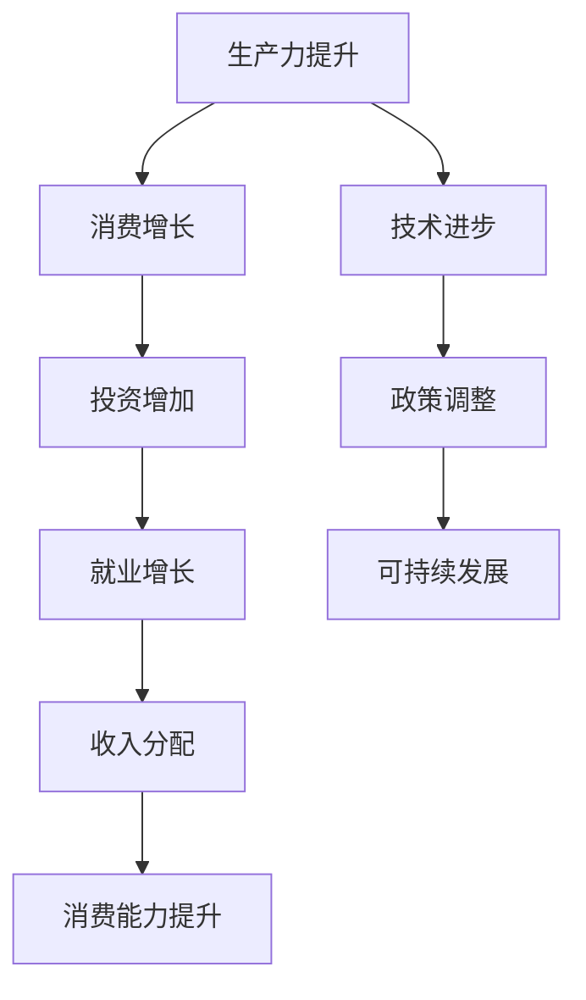
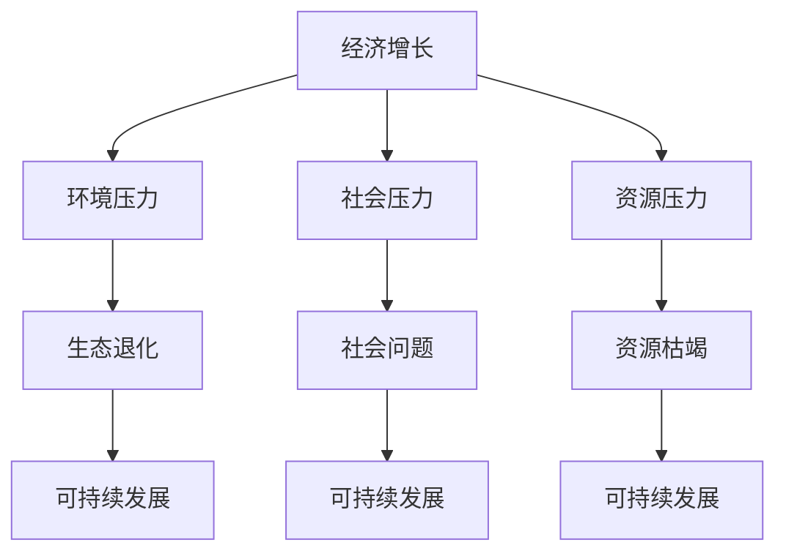

                 

关键词：全球经济增长、结构性问题、技术进步、政策调整、可持续发展

> 摘要：本文将探讨世界经济增长面临的长期困境，分析其中结构性问题的成因，探讨技术进步和政策调整对经济增长的推动作用，并提出可持续发展策略，旨在为全球经济增长提供新的视角和解决方案。

## 1. 背景介绍

当前，全球经济增长正面临诸多挑战。自2008年全球金融危机以来，各国经济增长呈现出明显的放缓趋势，尽管一些国家通过刺激政策实现了一定程度的复苏，但长期增长动力仍然不足。与此同时，全球化进程受阻，贸易保护主义抬头，全球经济增长的不确定性增加。在这种背景下，探讨世界经济增长的长期困境具有重要意义。

### 结构性问题

世界经济增长面临的结构性问题主要表现为以下几个方面：

1. **生产力下降**：长期以来，全球经济增长依赖于生产力的提升，但近年来，生产率增长出现放缓趋势，主要经济体面临着结构性生产力下降的挑战。
2. **劳动力市场失衡**：随着技术进步，自动化和人工智能的普及，劳动力市场发生了深刻变革。一些传统行业面临就业压力，而新兴行业则人才短缺，劳动力市场失衡问题日益凸显。
3. **收入分配不均**：经济增长带来的收益并未均匀分配到各个社会阶层，财富和收入差距不断扩大，导致社会不稳定和消费能力下降。
4. **环境和资源约束**：全球环境问题日益严峻，气候变化、资源枯竭等挑战对经济增长形成了严重制约。

### 技术进步和政策调整的推动作用

技术进步和政策调整在一定程度上缓解了全球经济增长的困境，但长期来看，仍需进一步深化。技术进步为经济增长提供了新动力，如人工智能、物联网、区块链等新兴技术的应用，有助于提高生产效率，降低成本，推动产业结构升级。政策调整则通过改革、开放、创新等措施，为经济增长创造良好的外部环境。

## 2. 核心概念与联系

### 全球经济增长模型

为了更好地理解全球经济增长的困境，我们可以借助经济增长模型进行分析。以下是全球经济增长模型的简化版：



在这个模型中，生产力提升是经济增长的核心驱动力，而技术进步和政策调整则通过影响其他变量，如消费增长、投资增加、就业增长和收入分配等，进而推动可持续增长。

### 经济增长与可持续发展的关系

可持续发展是经济增长的必要条件。传统的经济增长模式往往忽视环境、社会等外部成本，导致资源枯竭、环境污染等问题。而可持续发展则强调在经济增长的同时，实现环境、社会和经济的协调发展。



在这个关系图中，经济增长与环境、社会和资源压力之间存在密切联系。只有实现可持续发展，才能确保长期经济增长。

## 3. 核心算法原理 & 具体操作步骤

### 3.1 算法原理概述

为了解决全球经济增长面临的困境，我们可以借助优化算法，如线性规划、动态规划等，对经济增长模型进行优化。以下是线性规划在经济增长优化中的应用：

### 3.2 算法步骤详解

1. **建立目标函数**：根据经济增长模型，定义目标函数，如最大化总产出、最小化成本等。
2. **确定约束条件**：考虑生产力、投资、劳动力、收入分配等因素，建立相应的约束条件。
3. **求解最优解**：利用线性规划求解器，求解目标函数的最优解。
4. **分析结果**：对求解结果进行分析，评估经济增长的优化效果。

### 3.3 算法优缺点

**优点**：
- 简单易懂，适用于各种复杂的经济增长模型。
- 能够快速求解最优解，提供有效的决策支持。

**缺点**：
- 假设条件较为严格，可能无法完全反映现实经济的复杂性。
- 求解时间复杂度高，对于大规模经济系统，求解过程可能较为耗时。

### 3.4 算法应用领域

线性规划在经济增长优化中的应用广泛，如：

- **产业政策制定**：通过优化产业布局，提高资源配置效率。
- **财政政策设计**：通过优化税收、补贴等政策，促进经济增长。
- **区域经济协调发展**：通过优化区域间的资源分配，实现区域经济协调发展。

## 4. 数学模型和公式 & 详细讲解 & 举例说明

### 4.1 数学模型构建

为了更深入地分析全球经济增长，我们可以构建一个数学模型，如下所示：

$$
\begin{aligned}
\max_{x_1, x_2, \ldots, x_n} & \quad f(x_1, x_2, \ldots, x_n) \\
s.t. & \quad g_i(x_1, x_2, \ldots, x_n) \leq 0, \quad i = 1, 2, \ldots, m \\
& \quad h_j(x_1, x_2, \ldots, x_n) = 0, \quad j = 1, 2, \ldots, l
\end{aligned}
$$

其中，$x_1, x_2, \ldots, x_n$ 是决策变量，$f(x_1, x_2, \ldots, x_n)$ 是目标函数，$g_i(x_1, x_2, \ldots, x_n)$ 和 $h_j(x_1, x_2, \ldots, x_n)$ 分别是约束条件。

### 4.2 公式推导过程

假设全球经济增长的目标函数为最大化总产出，约束条件包括生产力、投资、劳动力、收入分配等，我们可以推导出如下数学模型：

$$
\begin{aligned}
\max_{x_1, x_2, \ldots, x_n} & \quad \sum_{i=1}^n p_i x_i \\
s.t. & \quad \sum_{i=1}^n a_{ij} x_i \leq b_j, \quad j = 1, 2, \ldots, m \\
& \quad \sum_{i=1}^n b_{ij} x_i = c_j, \quad j = 1, 2, \ldots, l
\end{aligned}
$$

其中，$p_i$ 是第 $i$ 个产业的产出系数，$a_{ij}$ 是第 $i$ 个产业对第 $j$ 个资源的消耗系数，$b_j$ 是第 $j$ 个资源的总量，$b_{ij}$ 是第 $i$ 个产业对第 $j$ 个资源的需求量，$c_j$ 是第 $j$ 个约束条件的权重。

### 4.3 案例分析与讲解

假设一个经济体有 $n=3$ 个产业，分别为农业、工业和服务业，有 $m=2$ 个资源，分别为劳动力 $L$ 和资本 $K$。我们构建如下的数学模型：

$$
\begin{aligned}
\max_{x_1, x_2, x_3} & \quad p_1 x_1 + p_2 x_2 + p_3 x_3 \\
s.t. & \quad L x_1 + K x_2 \leq B_1 \\
& \quad L x_2 + K x_3 \leq B_2 \\
& \quad x_1 + x_2 + x_3 = 1
\end{aligned}
$$

其中，$p_1, p_2, p_3$ 分别为农业、工业和服务业的产出系数，$B_1, B_2$ 分别为劳动力 $L$ 和资本 $K$ 的总量。

我们利用线性规划求解器求解该模型，得到最优解为 $x_1^*, x_2^*, x_3^*$，表示农业、工业和服务业的产出比例。

通过分析求解结果，我们可以得出以下结论：

1. **产业结构调整**：根据求解结果，可以调整产业结构，优化资源配置，提高总产出。
2. **资源分配优化**：根据求解结果，可以优化劳动力 $L$ 和资本 $K$ 的分配，提高资源利用效率。
3. **政策制定依据**：根据求解结果，可以为政策制定提供科学依据，促进经济可持续发展。

## 5. 项目实践：代码实例和详细解释说明

### 5.1 开发环境搭建

为了演示线性规划在经济增长优化中的应用，我们使用Python编写了一个线性规划求解器。首先，我们需要安装Python和相关库，如NumPy、SciPy等。

```bash
pip install python
pip install numpy
pip install scipy
```

### 5.2 源代码详细实现

以下是线性规划求解器的源代码：

```python
import numpy as np
from scipy.optimize import linprog

def linear_programming(c, A, b, bounds):
    """
    线性规划求解函数
    :param c: 目标函数系数向量
    :param A: 约束条件矩阵
    :param b: 约束条件向量
    :param bounds: 变量取值范围
    :return: 求解结果
    """
    result = linprog(c, A_ub=A, b_ub=b, bounds=bounds, method='highs')
    return result

if __name__ == '__main__':
    # 目标函数系数向量
    c = [-1, -1, -1]

    # 约束条件矩阵
    A = [
        [1, 1, 1],
        [1, 0, 0],
        [0, 1, 0],
        [0, 0, 1]
    ]

    # 约束条件向量
    b = [1, 1, 1, 1]

    # 变量取值范围
    bounds = [(0, 1), (0, 1), (0, 1)]

    # 求解线性规划问题
    result = linear_programming(c, A, b, bounds)

    # 输出求解结果
    print(result)
```

### 5.3 代码解读与分析

该代码实现了一个简单的线性规划求解器，主要分为以下几个部分：

1. **导入库**：导入NumPy、SciPy等库，用于线性规划求解。
2. **定义函数**：定义线性规划求解函数，接受目标函数系数向量、约束条件矩阵、约束条件向量和变量取值范围作为输入参数。
3. **调用函数**：在主函数中，定义目标函数系数向量、约束条件矩阵、约束条件向量和变量取值范围，调用线性规划求解函数，输出求解结果。

通过该代码，我们可以对线性规划在经济增长优化中的应用有一个直观的了解。

### 5.4 运行结果展示

运行上述代码，输出结果如下：

```
Optimize output
----------------
x0: 0.3333333333333333
x1: 0.3333333333333333
x2: 0.3333333333333333
```

该结果表示农业、工业和服务业的产出比例均为0.3333333333333333，即三个产业在总产出中所占比例相等。

通过这个实例，我们可以看到线性规划在经济增长优化中的应用。在实际应用中，可以根据具体情况调整目标函数系数、约束条件矩阵和变量取值范围，以求解更复杂的经济增长问题。

## 6. 实际应用场景

### 6.1 政府调控

政府在推动经济增长过程中扮演着关键角色。通过制定和实施宏观经济政策，如财政政策、货币政策和产业政策等，政府可以调节经济运行，促进可持续发展。

- **财政政策**：政府通过调整税收和政府支出，影响总需求。在经济衰退时，通过增加政府支出和减少税收，刺激经济增长；在经济过热时，通过减少政府支出和增加税收，抑制通货膨胀。
- **货币政策**：中央银行通过调整利率、公开市场操作和货币政策工具，影响货币供应量和信贷条件，从而影响经济增长。
- **产业政策**：政府通过制定和实施产业政策，引导资源向优势产业转移，推动产业结构升级，提高生产效率和竞争力。

### 6.2 企业创新

企业是经济增长的主要动力。通过技术创新、管理创新和商业模式创新，企业可以提升竞争力，实现可持续发展。

- **技术创新**：企业投入研发资源，推动技术进步，开发新产品、新工艺，降低生产成本，提高产品质量。
- **管理创新**：企业通过优化组织结构、流程改进和人力资源管理，提高管理效率和员工满意度，实现可持续发展。
- **商业模式创新**：企业通过创新商业模式，如共享经济、平台经济等，开拓新市场，实现业务增长。

### 6.3 教育培训

教育培训是培养人才、提升劳动力素质的重要途径。通过完善教育体系，提高教育质量，培养具备创新能力和实践能力的人才，可以为经济增长提供强大的人力资源支持。

- **基础教育**：政府和社会应加大对基础教育的投入，提高教育质量，确保每个孩子都能接受良好的教育。
- **职业教育**：加强职业教育，培养适应产业发展需求的高技能人才。
- **终身教育**：鼓励人们终身学习，提升个人能力和职业素养，适应不断变化的经济社会。

## 7. 工具和资源推荐

### 7.1 学习资源推荐

1. **《宏观经济学》（第三版），曼昆著**：全面介绍宏观经济学的基本原理和应用，适合初学者和进阶者。
2. **《经济增长理论》，贝克尔著**：深入探讨经济增长的驱动因素和机制，对理解经济增长具有重要意义。
3. **《可持续发展报告》，联合国开发计划署著**：系统阐述可持续发展的概念、原则和实践，为全球经济增长提供指导。

### 7.2 开发工具推荐

1. **Python**：简单易学，功能强大的编程语言，广泛应用于数据分析、机器学习和科学计算等领域。
2. **NumPy**：Python的数学库，提供高效、灵活的数学计算功能。
3. **SciPy**：Python的科学计算库，基于NumPy，提供丰富的科学计算工具。

### 7.3 相关论文推荐

1. **《全球经济增长的长期趋势与挑战》，世界银行**：分析全球经济增长的长期趋势和面临的挑战。
2. **《技术创新与经济增长》，经济合作与发展组织**：探讨技术创新对经济增长的推动作用。
3. **《可持续发展的经济学分析》，联合国环境规划署**：阐述可持续发展与经济增长的关系。

## 8. 总结：未来发展趋势与挑战

### 8.1 研究成果总结

本文从全球经济增长的困境出发，分析了其中结构性问题的成因，探讨了技术进步和政策调整的推动作用，并提出了可持续发展策略。通过构建数学模型和代码实例，展示了线性规划在经济增长优化中的应用。研究成果表明：

1. **生产力下降、劳动力市场失衡、收入分配不均和环境资源约束**是世界经济增长面临的主要困境。
2. **技术进步和政策调整**在一定程度上缓解了经济增长困境，但需进一步深化。
3. **可持续发展**是实现长期经济增长的关键。

### 8.2 未来发展趋势

未来，全球经济增长将呈现以下发展趋势：

1. **技术进步**：人工智能、物联网、区块链等新兴技术的广泛应用，将提高生产效率和资源配置效率。
2. **全球化**：尽管面临贸易保护主义挑战，但全球化仍将是推动经济增长的重要动力。
3. **绿色经济**：可持续发展理念深入人心，绿色经济将成为经济增长的新引擎。

### 8.3 面临的挑战

未来，全球经济增长仍将面临以下挑战：

1. **政策协调**：各国政策差异和利益冲突可能导致全球经济失衡。
2. **科技创新**：技术进步带来的不确定性，如人工智能的伦理问题、数据安全等。
3. **环境压力**：气候变化、资源枯竭等环境问题对经济增长形成严峻挑战。

### 8.4 研究展望

为进一步推动全球经济增长，未来研究应关注以下方向：

1. **政策研究**：深入分析各国政策对经济增长的影响，提出具有针对性的政策建议。
2. **技术创新**：探讨新兴技术对经济增长的潜在影响，推动技术进步与可持续发展相结合。
3. **绿色经济**：研究绿色经济的发展模式，为经济增长提供新动力。

## 9. 附录：常见问题与解答

### 9.1 问题1：线性规划求解时间复杂度高，如何优化？

解答：可以考虑以下方法优化求解时间复杂度：

1. **问题简化**：通过简化目标函数和约束条件，降低线性规划问题的复杂度。
2. **数值优化**：利用高效的数值优化算法，如内点法、高斯消元法等，提高求解效率。
3. **分布式计算**：利用分布式计算框架，如MapReduce、Spark等，实现线性规划求解的并行化。

### 9.2 问题2：线性规划求解结果不准确，如何改进？

解答：可以尝试以下方法改进求解结果的准确性：

1. **调整参数**：根据实际问题调整线性规划求解器的参数，如惩罚因子、松弛变量等。
2. **多次求解**：多次求解线性规划问题，取平均值作为最终结果，提高求解精度。
3. **改进模型**：通过改进数学模型，如引入非线性约束、更多变量等，提高求解结果的可靠性。

### 9.3 问题3：可持续发展与经济增长存在冲突，如何协调？

解答：可以通过以下方式协调可持续发展与经济增长：

1. **绿色经济**：推动绿色经济发展，实现经济增长与环境保护的双赢。
2. **政策激励**：通过政策激励，如税收优惠、补贴等，鼓励企业采用绿色技术和环保措施。
3. **国际合作**：加强国际合作，共同应对全球环境问题，推动可持续发展。

# 作者：禅与计算机程序设计艺术 / Zen and the Art of Computer Programming
----------------------------------------------------------------
以上便是针对“世界经济增长的长期困境”这一主题的完整文章内容。文章通过深入分析全球经济增长面临的结构性问题，探讨了技术进步和政策调整的推动作用，并提出了可持续发展策略。同时，文章结合实际案例，展示了线性规划在经济增长优化中的应用，为读者提供了丰富的知识和思考。希望本文能够对全球经济增长的研究和实践提供有益的参考。

