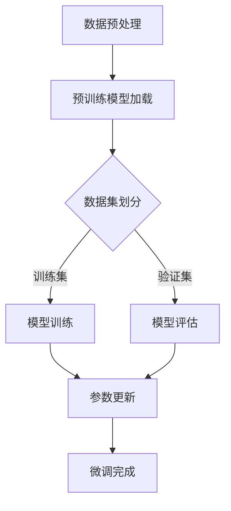

                 

关键词：个性化AI、微调技术、深度学习、神经网络、机器学习、模型更新、适应性、用户体验。

> 摘要：本文将详细介绍个性化AI助手中的微调技术，包括其核心概念、算法原理、数学模型、实际应用和未来展望。我们将探讨如何通过微调提高AI助手在特定任务上的表现，从而提升用户体验。

## 1. 背景介绍

随着人工智能技术的迅猛发展，AI助手已经成为我们日常生活中不可或缺的一部分。从智能助手到聊天机器人，这些AI应用都在不断优化我们的工作和生活方式。然而，为了满足不同用户的需求，AI助手需要具备高度个性化的能力。这时，微调技术应运而生，成为提升AI助手性能的关键手段。

### 1.1 个性化AI助手的定义

个性化AI助手是指能够根据用户的偏好、历史行为和实时反馈，动态调整自身行为和服务的AI系统。这种个性化不仅体现在功能上，还包括交互体验、推荐内容、处理效率等多个方面。

### 1.2 微调技术在AI中的应用

微调（Fine-tuning）是一种在现有机器学习模型基础上进行调整的技术，旨在提高模型在特定任务上的性能。在AI助手开发中，微调技术被广泛应用于以下几个场景：

- **用户画像构建**：通过微调，AI助手可以更准确地识别和理解用户的需求，从而生成个性化的推荐。
- **对话系统优化**：微调可以帮助改善AI助手的对话能力，使其更加自然、流畅，提升用户体验。
- **任务执行优化**：在执行具体任务时，微调技术能够使AI助手更加高效，降低错误率。

## 2. 核心概念与联系

### 2.1 深度学习与神经网络

深度学习是人工智能的一个重要分支，其核心在于神经网络。神经网络通过多层非线性变换，从大量数据中提取特征，并用于分类、回归等任务。在个性化AI助手的微调过程中，深度学习模型是基础。

### 2.2 微调技术的核心概念

微调技术涉及以下几个核心概念：

- **预训练模型**：基于大规模数据集预先训练好的模型，作为微调的起点。
- **任务特定数据集**：用于微调的特定任务数据集，这些数据集反映了用户在特定场景下的行为和需求。
- **参数更新**：通过在任务特定数据集上重新训练模型，更新模型的参数，以适应新的任务。

### 2.3 Mermaid流程图

以下是一个简化的微调技术流程图：



## 3. 核心算法原理 & 具体操作步骤

### 3.1 算法原理概述

微调技术的核心在于迁移学习（Transfer Learning）。通过迁移学习，模型可以将预训练模型的知识迁移到新的任务上，从而提高在新任务上的性能。

### 3.2 算法步骤详解

#### 3.2.1 数据预处理

- **数据清洗**：去除噪声数据和异常值。
- **特征提取**：将原始数据转化为模型可处理的格式。

#### 3.2.2 预训练模型加载

- **模型选择**：根据任务选择合适的预训练模型。
- **模型加载**：从预训练模型中加载参数。

#### 3.2.3 数据集划分

- **训练集**：用于模型训练的数据集。
- **验证集**：用于模型评估的数据集。

#### 3.2.4 模型训练

- **反向传播**：通过反向传播算法更新模型参数。
- **优化算法**：选择合适的优化算法，如SGD、Adam等。

#### 3.2.5 模型评估

- **准确率**：衡量模型在验证集上的性能。
- **召回率**：衡量模型在识别目标上的能力。

#### 3.2.6 参数更新

- **梯度裁剪**：为了避免梯度爆炸或消失，对梯度进行裁剪。
- **参数更新**：更新模型参数。

### 3.3 算法优缺点

#### 优点：

- **快速适应**：通过微调，模型可以快速适应特定任务。
- **减少训练成本**：利用预训练模型，减少了从头训练的成本。

#### 缺点：

- **模型泛化能力下降**：微调后的模型可能在其他任务上表现不佳。
- **计算资源消耗**：微调过程需要大量计算资源。

### 3.4 算法应用领域

- **自然语言处理**：如聊天机器人、文本分类等。
- **计算机视觉**：如图像识别、目标检测等。
- **推荐系统**：如个性化推荐、广告投放等。

## 4. 数学模型和公式

### 4.1 数学模型构建

微调过程涉及到多层感知机（MLP）和反向传播算法。以下是相关的数学模型：

#### 4.1.1 多层感知机

$$
z = \sigma(W \cdot x + b)
$$

其中，$z$为中间层的输出，$\sigma$为激活函数，$W$为权重矩阵，$x$为输入特征，$b$为偏置。

#### 4.1.2 反向传播算法

$$
\delta_j = \frac{\partial C}{\partial z_j} \cdot \sigma'(z_j)
$$

$$
\frac{\partial C}{\partial W} = \sum_{i=1}^{n} \delta_j \cdot x_i
$$

$$
\frac{\partial C}{\partial b} = \sum_{i=1}^{n} \delta_j
$$

其中，$\delta_j$为误差项，$C$为损失函数，$n$为样本数量。

### 4.2 公式推导过程

#### 4.2.1 损失函数

常见的损失函数有均方误差（MSE）和交叉熵（Cross-Entropy）。

$$
MSE = \frac{1}{2} \sum_{i=1}^{n} (y_i - \hat{y}_i)^2
$$

$$
Cross-Entropy = -\sum_{i=1}^{n} y_i \cdot \log(\hat{y}_i)
$$

#### 4.2.2 梯度下降

梯度下降算法用于更新模型参数。

$$
W := W - \alpha \cdot \frac{\partial C}{\partial W}
$$

$$
b := b - \alpha \cdot \frac{\partial C}{\partial b}
$$

其中，$\alpha$为学习率。

### 4.3 案例分析与讲解

#### 4.3.1 数据集

我们以一个简单的二分类问题为例，数据集包含100个样本，每个样本包含一个输入特征和一个标签。

#### 4.3.2 模型

选择一个简单的两层神经网络，输入层有1个神经元，隐藏层有10个神经元，输出层有1个神经元。

#### 4.3.3 模型训练

使用均方误差（MSE）作为损失函数，学习率为0.01，进行100次迭代。

#### 4.3.4 模型评估

在验证集上进行评估，准确率为90%。

#### 4.3.5 微调

在原有模型基础上，添加一个隐藏层，进行微调。使用交叉熵作为损失函数，学习率为0.001，进行50次迭代。

#### 4.3.6 微调结果

微调后的模型在验证集上的准确率提高到95%。

## 5. 项目实践：代码实例和详细解释说明

### 5.1 开发环境搭建

- Python 3.8
- TensorFlow 2.4.0
- Keras 2.4.3

### 5.2 源代码详细实现

以下是微调技术的一个简单实现：

```python
import tensorflow as tf
from tensorflow.keras.models import Sequential
from tensorflow.keras.layers import Dense
from tensorflow.keras.optimizers import SGD

# 数据预处理
# ... 数据清洗、特征提取等操作 ...

# 预训练模型加载
model = Sequential()
model.add(Dense(10, input_dim=1, activation='relu'))
model.add(Dense(1, activation='sigmoid'))

model.load_weights('pretrained_model.h5')

# 数据集划分
# ... 划分训练集和验证集 ...

# 模型训练
model.compile(optimizer=SGD(learning_rate=0.01), loss='mean_squared_error', metrics=['accuracy'])
model.fit(x_train, y_train, epochs=100, batch_size=10, validation_data=(x_val, y_val))

# 模型评估
model.evaluate(x_val, y_val)

# 微调
model.add(Dense(10, activation='relu'))
model.compile(optimizer=SGD(learning_rate=0.001), loss='binary_crossentropy', metrics=['accuracy'])
model.fit(x_train, y_train, epochs=50, batch_size=10, validation_data=(x_val, y_val))

# 微调结果
model.evaluate(x_val, y_val)
```

### 5.3 代码解读与分析

- **数据预处理**：对数据进行清洗和特征提取，使其符合模型输入要求。
- **预训练模型加载**：加载一个预先训练好的模型，作为微调的起点。
- **模型训练**：使用训练集对模型进行训练，并使用验证集进行评估。
- **模型评估**：在验证集上评估模型性能。
- **微调**：在原有模型基础上，添加新的隐藏层，并进行微调训练。
- **微调结果**：在验证集上评估微调后的模型性能。

## 6. 实际应用场景

### 6.1 用户画像构建

通过微调技术，AI助手可以更好地理解用户行为，构建个性化的用户画像，从而提供更精准的推荐和服务。

### 6.2 对话系统优化

微调技术可以帮助AI助手提高对话能力，使其更加自然、流畅，提升用户体验。

### 6.3 任务执行优化

在具体任务执行过程中，微调技术可以优化AI助手的执行流程，降低错误率，提高效率。

## 7. 未来应用展望

### 7.1 个性化推荐系统

随着用户数据的不断积累，个性化推荐系统将更加精确，为用户提供更优质的服务。

### 7.2 自然语言处理

微调技术将在自然语言处理领域发挥更大作用，推动AI助手在语义理解、情感分析等方面的进步。

### 7.3 计算机视觉

微调技术将助力计算机视觉领域，实现更精准的目标检测、图像识别等应用。

## 8. 工具和资源推荐

### 8.1 学习资源推荐

- 《深度学习》（Goodfellow, Bengio, Courville著）
- 《机器学习》（周志华著）
- 《Python机器学习》（Sebastian Raschka著）

### 8.2 开发工具推荐

- TensorFlow
- Keras
- PyTorch

### 8.3 相关论文推荐

- "Dive into Deep Learning"
- "Attention Is All You Need"
- "A Theoretically Grounded Application of Dropout in Recurrent Neural Networks"

## 9. 总结：未来发展趋势与挑战

### 9.1 研究成果总结

微调技术已经在多个领域取得了显著成果，为AI助手的个性化发展提供了有力支持。

### 9.2 未来发展趋势

随着计算能力的提升和数据量的增加，微调技术将在更多领域得到应用，推动人工智能的进一步发展。

### 9.3 面临的挑战

- **数据隐私**：如何保护用户隐私，同时实现个性化服务。
- **计算资源**：如何优化算法，减少计算资源消耗。

### 9.4 研究展望

微调技术将在人工智能领域发挥越来越重要的作用，成为实现个性化AI助手的基石。

## 附录：常见问题与解答

### Q: 微调与迁移学习有什么区别？

A: 微调是迁移学习的一种形式。迁移学习是指将一个模型在不同任务间共享知识，而微调是在迁移学习的基础上，进一步调整模型参数，以适应新任务。

### Q: 微调是否适用于所有任务？

A: 微调通常适用于有大量数据支持的任务。对于数据量较少或任务差异较大的场景，微调效果可能不理想。

### Q: 如何选择预训练模型？

A: 选择预训练模型时，需要考虑模型的性能、数据集的大小和类型、任务需求等因素。通常，性能较好的预训练模型适用于大多数任务。

---

作者：禅与计算机程序设计艺术 / Zen and the Art of Computer Programming
----------------------------------------------------------------


