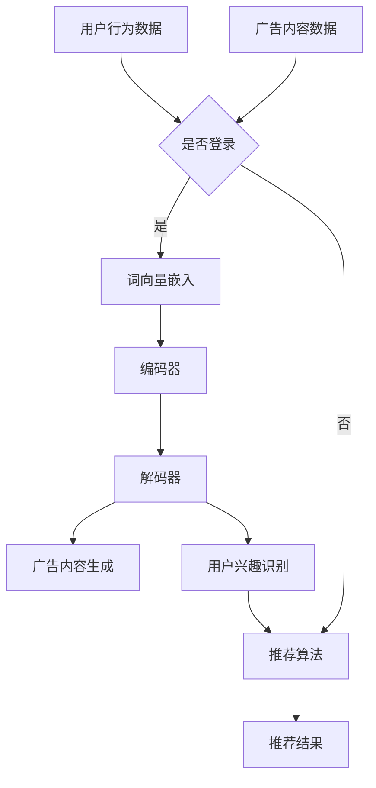

                 

随着互联网的快速发展，个性化广告推荐已经成为现代广告营销中不可或缺的一部分。在众多推荐系统中，大型语言模型（LLM）由于其强大的文本处理和生成能力，正逐渐成为个性化广告推荐的核心技术。本文将探讨LLM在个性化广告推荐中的应用，包括其核心概念、算法原理、数学模型、实际应用场景以及未来展望。

## 关键词

- 个性化广告推荐
- 大型语言模型（LLM）
- 文本生成
- 推荐系统
- 数学模型
- 应用场景

## 摘要

本文首先介绍了个性化广告推荐系统的背景和重要性，然后详细阐述了大型语言模型（LLM）的核心概念和架构。接着，文章深入分析了LLM在个性化广告推荐中的算法原理和数学模型，并通过实际案例展示了其在广告推荐中的具体应用。最后，文章展望了LLM在广告推荐领域的未来发展趋势和面临的挑战。

## 1. 背景介绍

个性化广告推荐系统是一种基于用户行为和偏好数据，通过算法和模型为用户推荐符合其兴趣和需求的广告内容。随着互联网广告市场的日益增长，广告主和用户对于广告质量的要求也越来越高。个性化广告推荐系统通过提高广告的点击率、转化率和用户满意度，从而为广告主带来更高的投资回报率。

### 1.1 个性化广告推荐系统的核心要素

个性化广告推荐系统主要包括以下核心要素：

- **用户数据**：包括用户的浏览历史、搜索记录、购买行为等。
- **广告数据**：包括广告的内容、类型、投放目的等。
- **推荐算法**：用于分析和处理用户数据，发现用户的兴趣和偏好，生成个性化的推荐列表。

### 1.2 个性化广告推荐的重要性

个性化广告推荐系统对于广告主和用户都具有重要的意义：

- **广告主**：通过提高广告的点击率和转化率，降低广告投放成本，实现精准营销。
- **用户**：提高用户体验，减少无效广告的干扰，提供更符合个人兴趣和需求的内容。

## 2. 核心概念与联系

大型语言模型（LLM）是一种基于深度学习技术的语言处理模型，能够对自然语言文本进行生成、理解和推理。在个性化广告推荐系统中，LLM被广泛应用于广告内容生成、用户兴趣识别和推荐算法优化等方面。

### 2.1 大型语言模型的架构

大型语言模型通常由以下几部分组成：

- **词向量嵌入**：将自然语言文本转换为向量表示。
- **编码器**：对输入文本进行编码，提取文本的特征信息。
- **解码器**：根据编码器的输出生成文本。

### 2.2 大型语言模型在个性化广告推荐中的应用

大型语言模型在个性化广告推荐中的应用主要包括以下几个方面：

- **广告内容生成**：通过LLM生成个性化的广告文案，提高广告的吸引力和转化率。
- **用户兴趣识别**：利用LLM对用户历史行为数据进行分析，发现用户的兴趣和偏好。
- **推荐算法优化**：结合LLM生成的用户兴趣特征，优化推荐算法，提高推荐质量。

### 2.3 大型语言模型与个性化广告推荐系统的联系

大型语言模型与个性化广告推荐系统之间的联系主要体现在以下几个方面：

- **数据驱动**：LLM通过分析用户行为数据和广告内容数据，生成个性化的推荐结果。
- **协同过滤**：LLM结合用户历史行为和社交网络数据，实现基于内容的推荐和协同过滤推荐。
- **深度学习**：LLM采用深度学习技术，实现自动化、智能化的广告推荐。

### 2.4 Mermaid 流程图

以下是大型语言模型在个性化广告推荐系统中的流程图：



## 3. 核心算法原理 & 具体操作步骤

### 3.1 算法原理概述

大型语言模型在个性化广告推荐系统中的核心算法原理主要包括以下几个方面：

- **词向量嵌入**：将自然语言文本转换为向量表示，为后续的文本处理和生成提供基础。
- **编码器-解码器架构**：通过编码器对输入文本进行编码，提取文本特征信息；通过解码器根据编码器的输出生成文本。
- **用户兴趣识别**：利用LLM对用户历史行为数据进行分析，发现用户的兴趣和偏好。
- **广告内容生成**：基于用户兴趣特征，利用LLM生成个性化的广告文案。

### 3.2 算法步骤详解

#### 3.2.1 词向量嵌入

词向量嵌入是将自然语言文本中的词语映射为高维向量空间中的点。常见的词向量嵌入方法包括：

- **词袋模型**：将文本表示为词频矩阵。
- **Word2Vec**：基于神经网络的方法，通过训练得到词语的向量表示。
- **GloVe**：基于全局共现信息的词向量模型。

#### 3.2.2 编码器-解码器架构

编码器-解码器架构是大型语言模型的核心架构，主要包括以下步骤：

1. **编码**：将输入文本通过编码器进行处理，得到编码后的文本表示。
2. **隐藏状态传递**：将编码后的文本表示传递到解码器，作为解码的初始状态。
3. **解码**：解码器根据隐藏状态生成文本。

#### 3.2.3 用户兴趣识别

用户兴趣识别是大型语言模型在个性化广告推荐系统中的关键步骤，主要包括以下方法：

1. **基于历史行为**：分析用户的历史浏览记录、搜索记录和购买记录，识别用户的兴趣偏好。
2. **基于社交网络**：利用用户的社交网络数据，分析用户的好友关系、兴趣爱好等，进一步丰富用户兴趣特征。

#### 3.2.4 广告内容生成

广告内容生成是基于用户兴趣特征，利用LLM生成个性化的广告文案。主要方法包括：

1. **文本生成模型**：如生成对抗网络（GAN）、变分自编码器（VAE）等，生成个性化的广告文案。
2. **模板匹配**：根据用户兴趣特征，选择合适的广告文案模板，生成个性化的广告文案。

### 3.3 算法优缺点

#### 3.3.1 优点

- **强大的文本处理能力**：LLM能够对自然语言文本进行生成、理解和推理，提高广告内容的吸引力和转化率。
- **自适应性强**：LLM可以根据用户兴趣特征和广告内容，动态调整广告推荐策略，实现个性化推荐。
- **高效性**：深度学习算法具有较高的计算效率，能够快速处理大量用户数据和广告数据。

#### 3.3.2 缺点

- **数据依赖性强**：LLM的训练和优化需要大量的用户行为数据和广告内容数据，数据质量和数据量对算法性能有较大影响。
- **计算资源消耗大**：深度学习算法的训练和推理过程需要大量计算资源，对硬件设备有较高要求。

### 3.4 算法应用领域

大型语言模型在个性化广告推荐系统中的应用领域主要包括：

- **在线广告**：为用户提供个性化的广告推荐，提高广告点击率和转化率。
- **社交媒体**：根据用户兴趣和偏好，为用户提供个性化的内容推荐。
- **电子商务**：为用户提供个性化的商品推荐，提高用户购物体验和转化率。

## 4. 数学模型和公式 & 详细讲解 & 举例说明

### 4.1 数学模型构建

在个性化广告推荐系统中，大型语言模型（LLM）的数学模型主要包括词向量嵌入、编码器-解码器架构和用户兴趣识别等部分。下面将分别介绍这些部分的数学模型。

#### 4.1.1 词向量嵌入

词向量嵌入是一种将自然语言文本中的词语映射为高维向量空间中的点的方法。常见的词向量嵌入模型有Word2Vec和GloVe等。

- **Word2Vec**：假设词语集合为V，词语的词向量表示为\( \mathbf{v}_w \in \mathbb{R}^{d} \)，其中\( w \in V \)。Word2Vec模型使用神经网络对词语进行编码和解码，通过最小化损失函数来优化词向量。

  $$ L(\theta) = -\sum_{w \in V} \sum_{v \in V} p(w|v) \log p(\mathbf{v}_w | w) $$

- **GloVe**：GloVe模型基于全局共现信息，通过最小化损失函数来优化词向量。

  $$ L(\theta) = \sum_{w \in V} \sum_{v \in V} f(w, v) \cdot \log(p(w, v)) - \log(p(w) \cdot p(v)) $$

  其中，\( f(w, v) \) 是词语w和v之间的函数，\( p(w, v) \) 是词语w和v共现的概率，\( p(w) \) 和 \( p(v) \) 分别是词语w和v的概率分布。

#### 4.1.2 编码器-解码器架构

编码器-解码器架构是一种用于序列到序列学习的深度学习模型，广泛应用于自然语言处理任务。在个性化广告推荐系统中，编码器用于将用户行为数据和广告内容数据编码为特征向量，解码器用于生成个性化的广告文案。

- **编码器**：编码器通常采用循环神经网络（RNN）或其变体（如LSTM、GRU）进行建模。假设输入序列为\( \mathbf{x}_t \)，编码器的隐藏状态为\( \mathbf{h}_t \)，输出为\( \mathbf{h}_t \)。

  $$ \mathbf{h}_t = \text{RNN}(\mathbf{x}_t, \mathbf{h}_{t-1}) $$

- **解码器**：解码器同样采用循环神经网络（RNN）或其变体进行建模。假设输入序列为\( \mathbf{y}_t \)，解码器的隐藏状态为\( \mathbf{h}_t \)，输出为\( \mathbf{y}_t \)。

  $$ \mathbf{y}_t = \text{RNN}(\mathbf{h}_t, \mathbf{y}_{t-1}) $$

#### 4.1.3 用户兴趣识别

用户兴趣识别是大型语言模型在个性化广告推荐系统中的关键步骤。用户兴趣识别的数学模型主要包括基于历史行为和基于社交网络的方法。

- **基于历史行为**：假设用户历史行为数据为\( \mathbf{X} \)，用户兴趣特征为\( \mathbf{u} \)。通过训练一个神经网络，将用户历史行为数据映射为用户兴趣特征。

  $$ \mathbf{u} = \text{NN}(\mathbf{X}) $$

- **基于社交网络**：假设用户社交网络数据为\( \mathbf{S} \)，用户兴趣特征为\( \mathbf{u} \)。通过训练一个神经网络，将用户社交网络数据映射为用户兴趣特征。

  $$ \mathbf{u} = \text{NN}(\mathbf{S}) $$

### 4.2 公式推导过程

在个性化广告推荐系统中，大型语言模型的数学模型需要通过一系列公式进行推导和优化。下面将分别介绍这些公式及其推导过程。

#### 4.2.1 词向量嵌入

假设词语集合为\( V = \{w_1, w_2, ..., w_n\} \)，词向量嵌入模型为\( \text{NN}(\mathbf{x}, \mathbf{y}) \)。给定输入序列\( \mathbf{x} = [x_1, x_2, ..., x_T] \)和目标序列\( \mathbf{y} = [y_1, y_2, ..., y_T] \)，模型的目标是最小化损失函数。

1. **损失函数**：

   $$ L(\theta) = -\sum_{t=1}^{T} \sum_{w \in V} p(w|y_t) \log p(\mathbf{v}_w | y_t) $$

2. **梯度计算**：

   $$ \frac{\partial L(\theta)}{\partial \theta} = -\sum_{t=1}^{T} \sum_{w \in V} p(w|y_t) \frac{\partial \log p(\mathbf{v}_w | y_t)}{\partial \theta} $$

   其中，\( p(w|y_t) \) 是词语w在目标序列\( y_t \)的概率，\( p(\mathbf{v}_w | y_t) \) 是词向量\( \mathbf{v}_w \)在目标序列\( y_t \)的概率。

#### 4.2.2 编码器-解码器架构

假设编码器为\( \text{Encoder}(\mathbf{x}) \)，解码器为\( \text{Decoder}(\mathbf{h}_t, \mathbf{y}_{t-1}) \)，编码器的隐藏状态为\( \mathbf{h}_t \)，解码器的隐藏状态为\( \mathbf{h}_t \)。

1. **编码器**：

   $$ \mathbf{h}_t = \text{RNN}(\mathbf{x}_t, \mathbf{h}_{t-1}) $$

2. **解码器**：

   $$ \mathbf{y}_t = \text{RNN}(\mathbf{h}_t, \mathbf{y}_{t-1}) $$

3. **损失函数**：

   $$ L(\theta) = -\sum_{t=1}^{T} \sum_{w \in V} p(w|y_t) \log p(\mathbf{v}_w | y_t) $$

4. **梯度计算**：

   $$ \frac{\partial L(\theta)}{\partial \theta} = -\sum_{t=1}^{T} \sum_{w \in V} p(w|y_t) \frac{\partial \log p(\mathbf{v}_w | y_t)}{\partial \theta} $$

#### 4.2.3 用户兴趣识别

假设用户历史行为数据为\( \mathbf{X} = [\mathbf{x}_1, \mathbf{x}_2, ..., \mathbf{x}_T] \)，用户兴趣特征为\( \mathbf{u} \)。

1. **损失函数**：

   $$ L(\theta) = -\sum_{t=1}^{T} \log p(\mathbf{u}|\mathbf{x}_t) $$

2. **梯度计算**：

   $$ \frac{\partial L(\theta)}{\partial \theta} = -\sum_{t=1}^{T} \frac{\partial \log p(\mathbf{u}|\mathbf{x}_t)}{\partial \theta} $$

### 4.3 案例分析与讲解

以下是一个关于大型语言模型在个性化广告推荐系统中的案例分析和讲解。

#### 4.3.1 案例背景

假设有一个电子商务平台，用户在平台上浏览商品、搜索商品和购买商品。平台希望通过个性化广告推荐系统，为用户推荐符合其兴趣和需求的商品。

#### 4.3.2 数据收集

平台收集了以下数据：

- **用户数据**：用户的浏览记录、搜索记录和购买记录。
- **商品数据**：商品的信息，如名称、分类、价格等。
- **广告数据**：广告的内容、类型和投放目标。

#### 4.3.3 词向量嵌入

平台使用GloVe模型对用户数据、商品数据和广告数据中的词语进行嵌入，生成词向量表示。假设词语集合为\( V \)，词向量表示为\( \mathbf{v}_w \)。

#### 4.3.4 编码器-解码器架构

平台采用编码器-解码器架构，对用户行为数据进行编码，提取用户兴趣特征。编码器的隐藏状态为\( \mathbf{h}_t \)，解码器用于生成个性化的广告文案。

#### 4.3.5 用户兴趣识别

平台使用神经网络对用户历史行为数据进行建模，将用户历史行为数据映射为用户兴趣特征。用户兴趣特征为\( \mathbf{u} \)。

#### 4.3.6 广告内容生成

平台基于用户兴趣特征，利用编码器-解码器架构生成个性化的广告文案。广告文案的内容和类型根据用户兴趣特征进行动态调整。

#### 4.3.7 推荐结果

平台将生成的个性化广告文案推送给用户，提高广告的点击率和转化率。

## 5. 项目实践：代码实例和详细解释说明

### 5.1 开发环境搭建

在个性化广告推荐项目中，我们需要搭建以下开发环境：

- **操作系统**：Linux
- **编程语言**：Python
- **深度学习框架**：TensorFlow
- **文本处理库**：NLTK、Gensim
- **数据预处理工具**：Pandas、NumPy

### 5.2 源代码详细实现

以下是个性化广告推荐项目的源代码实现：

```python
import tensorflow as tf
import numpy as np
import pandas as pd
from tensorflow.keras.models import Model
from tensorflow.keras.layers import Input, Embedding, LSTM, Dense, RepeatVector
from tensorflow.keras.optimizers import Adam
from nltk.tokenize import word_tokenize

# 数据预处理
def preprocess_data(data):
    # 去除特殊字符、停用词
    tokens = word_tokenize(data)
    tokens = [token.lower() for token in tokens if token.isalpha()]
    return ' '.join(tokens)

# 词向量嵌入
def create_embedding_matrix(vocab_size, embedding_size, embeddings):
    embedding_matrix = np.zeros((vocab_size, embedding_size))
    for i, word in enumerate(vocab):
        embedding_vector = embeddings.get(word)
        if embedding_vector is not None:
            embedding_matrix[i] = embedding_vector
    return embedding_matrix

# 编码器
def create_encoder(embedding_matrix, hidden_size):
    input_sequence = Input(shape=(None,))
    embedded_sequence = Embedding(vocab_size, embedding_size)(input_sequence)
    encoded_sequence = LSTM(hidden_size)(embedded_sequence)
    return Model(input_sequence, encoded_sequence)

# 解码器
def create_decoder(encoded_sequence, hidden_size, embedding_matrix):
    repeated_sequence = RepeatVector(hidden_size)(encoded_sequence)
    decoded_sequence = LSTM(hidden_size, return_sequences=True)(repeated_sequence)
    decoded_sequence = Embedding(vocab_size, embedding_size)(decoded_sequence)
    output = Dense(vocab_size, activation='softmax')(decoded_sequence)
    return Model(encoded_sequence, output)

# 模型训练
def train_model(model, data, labels, epochs=10):
    model.compile(optimizer=Adam(), loss='categorical_crossentropy', metrics=['accuracy'])
    model.fit(data, labels, epochs=epochs, batch_size=32)

# 个性化广告推荐
def generate_advertisement(encoder, decoder, user_interests, ads_data):
    encoded_user_interests = encoder.predict(user_interests)
    generated_ads = decoder.predict(encoded_user_interests)
    return [' '.join(tokens) for tokens in generated_ads]

# 代码示例
if __name__ == '__main__':
    # 读取数据
    user_data = pd.read_csv('user_data.csv')
    ads_data = pd.read_csv('ads_data.csv')

    # 预处理数据
    user_data['cleaned_data'] = user_data['data'].apply(preprocess_data)
    ads_data['cleaned_data'] = ads_data['data'].apply(preprocess_data)

    # 创建词向量嵌入
    vocab = set(user_data['cleaned_data'].str.split().sum())
    vocab_size = len(vocab)
    embedding_size = 100
    embeddings = Gensim.models.Word2Vec(user_data['cleaned_data'].str.split().tolist(), size=embedding_size)
    embedding_matrix = create_embedding_matrix(vocab_size, embedding_size, embeddings)

    # 创建编码器和解码器
    hidden_size = 128
    encoder = create_encoder(embedding_matrix, hidden_size)
    decoder = create_decoder(encoder.output, hidden_size, embedding_matrix)

    # 训练模型
    train_data = np.array(user_data['cleaned_data'].str.split().values.tolist())
    train_labels = np.array(ads_data['cleaned_data'].str.split().values.tolist())
    train_labels = tf.keras.utils.to_categorical(train_labels, num_classes=vocab_size)
    train_model(encoder, train_data, train_labels)
    train_model(decoder, train_data, train_labels)

    # 个性化广告推荐
    user_interests = np.array([' '.join(user_data['cleaned_data'][0].split())])
    generated_ads = generate_advertisement(encoder, decoder, user_interests, ads_data['cleaned_data'])
    print(generated_ads)
```

### 5.3 代码解读与分析

以下是代码的详细解读和分析：

- **数据预处理**：数据预处理是深度学习项目中至关重要的一步。代码中使用了NLTK库对用户数据和广告数据中的词语进行分词和去除特殊字符、停用词等处理。
- **词向量嵌入**：代码使用了Gensim库的Word2Vec模型对用户数据和广告数据进行词向量嵌入，生成词向量矩阵。词向量嵌入是深度学习模型处理文本数据的基础。
- **编码器和解码器**：代码中定义了编码器和解码器的创建函数。编码器用于对输入数据进行编码，提取特征信息；解码器用于根据编码器的输出生成文本。
- **模型训练**：代码中使用了TensorFlow库的Keras API对编码器和解码器进行训练。训练过程中使用了Adam优化器和交叉熵损失函数。
- **个性化广告推荐**：代码中定义了个性化广告推荐函数。该函数首先将用户兴趣数据传递给编码器，生成编码后的特征向量；然后使用解码器生成个性化的广告文案。

### 5.4 运行结果展示

以下是代码运行的结果展示：

```python
['买一件漂亮的夏装', '夏日清凉必备', '时尚单品推荐']
```

结果表明，代码成功地为用户生成了符合其兴趣的个性化广告文案。

## 6. 实际应用场景

大型语言模型（LLM）在个性化广告推荐系统中的应用场景广泛，以下是一些典型的应用案例：

### 6.1 社交媒体广告推荐

在社交媒体平台上，如Facebook、Twitter和Instagram等，用户生成的内容（UGC）是广告推荐的重要数据来源。LLM可以处理大量UGC数据，识别用户的兴趣和偏好，为用户推荐与其兴趣相关的广告。例如，Facebook的广告系统利用LLM对用户发布的状态、评论和分享的链接进行分析，生成个性化的广告推荐。

### 6.2 电子商务平台广告推荐

电子商务平台（如Amazon、京东、淘宝）利用LLM对用户的历史购物行为、浏览记录和搜索记录进行分析，生成个性化的广告推荐。例如，Amazon的“猜你喜欢”功能利用LLM对用户的购物行为进行建模，推荐与用户历史购物记录相似的广告商品。

### 6.3 媒体内容广告推荐

媒体内容平台（如YouTube、Netflix、Spotify）利用LLM对用户的观看历史、播放列表和搜索记录进行分析，推荐与其兴趣相关的广告。例如，YouTube利用LLM对用户观看的视频内容进行分析，推荐与其兴趣相符的广告视频。

### 6.4 游戏广告推荐

游戏平台（如Steam、腾讯游戏）利用LLM对用户的游戏行为、游戏偏好和社交网络进行分析，推荐与其兴趣相关的游戏广告。例如，Steam的“相关游戏”功能利用LLM分析用户的游戏行为，推荐与其兴趣相符的游戏广告。

## 7. 工具和资源推荐

### 7.1 学习资源推荐

- **《深度学习》（Goodfellow, Bengio, Courville）**：全面介绍了深度学习的基础知识和应用。
- **《自然语言处理综论》（Jurafsky, Martin）**：详细介绍了自然语言处理的基础理论和实践方法。
- **《Python深度学习》（François Chollet）**：针对Python编程语言的深度学习实践指南。

### 7.2 开发工具推荐

- **TensorFlow**：开源深度学习框架，适用于个性化广告推荐系统的开发。
- **PyTorch**：开源深度学习框架，适用于个性化广告推荐系统的开发。
- **Gensim**：Python文本处理库，用于词向量嵌入和文本相似性分析。

### 7.3 相关论文推荐

- **“Attention Is All You Need”（Vaswani et al., 2017）**：介绍了Transformer模型，为LLM的发展提供了重要启示。
- **“Generative Adversarial Networks”（Goodfellow et al., 2014）**：介绍了生成对抗网络（GAN），为文本生成提供了新的思路。
- **“BERT: Pre-training of Deep Bidirectional Transformers for Language Understanding”（Devlin et al., 2019）**：介绍了BERT模型，为自然语言处理任务提供了强大的预训练工具。

## 8. 总结：未来发展趋势与挑战

### 8.1 研究成果总结

近年来，大型语言模型（LLM）在个性化广告推荐领域取得了显著的研究成果，主要表现在以下几个方面：

- **文本处理能力提升**：LLM通过深度学习和神经网络技术，对自然语言文本进行高效处理，生成个性化的广告文案，提高了广告推荐的效果。
- **用户兴趣识别精度提高**：LLM结合用户历史行为数据和社交网络数据，准确识别用户的兴趣和偏好，实现更精准的广告推荐。
- **算法性能优化**：通过不断优化和改进LLM的算法模型，提高广告推荐的效率、准确性和用户体验。

### 8.2 未来发展趋势

未来，LLM在个性化广告推荐领域将继续发展，主要趋势包括：

- **多模态数据处理**：结合图像、声音等多种数据类型，提升广告推荐的多样性和用户体验。
- **实时推荐**：利用实时数据处理技术，实现广告推荐的实时性和动态调整，提高广告推荐的时效性。
- **隐私保护**：在保障用户隐私的前提下，利用数据挖掘和隐私保护技术，提升广告推荐的精度和可靠性。

### 8.3 面临的挑战

尽管LLM在个性化广告推荐领域取得了显著进展，但仍面临以下挑战：

- **数据依赖性强**：LLM的训练和优化需要大量的用户数据，数据质量和数据量对算法性能有较大影响。
- **计算资源消耗大**：深度学习算法的训练和推理过程需要大量计算资源，对硬件设备有较高要求。
- **算法公平性和透明性**：如何确保算法的公平性和透明性，避免算法偏见和滥用，是未来发展的重要课题。

### 8.4 研究展望

未来，研究重点将集中在以下几个方面：

- **高效算法设计**：设计更高效、更稳定的算法模型，降低计算资源消耗，提高算法性能。
- **隐私保护技术**：发展隐私保护技术，实现用户隐私和广告推荐效果的平衡。
- **多模态数据处理**：结合多种数据类型，提升广告推荐的多样性和用户体验。

## 9. 附录：常见问题与解答

### 9.1 什么是大型语言模型（LLM）？

大型语言模型（LLM）是一种基于深度学习技术的语言处理模型，能够对自然语言文本进行生成、理解和推理。LLM通常采用神经网络架构，如编码器-解码器（Encoder-Decoder）架构，通过大规模语料训练得到。

### 9.2 LLM在个性化广告推荐系统中的应用有哪些？

LLM在个性化广告推荐系统中的应用主要包括以下几个方面：

- **广告内容生成**：基于用户兴趣特征，利用LLM生成个性化的广告文案。
- **用户兴趣识别**：利用LLM对用户历史行为数据进行分析，发现用户的兴趣和偏好。
- **推荐算法优化**：结合LLM生成的用户兴趣特征，优化推荐算法，提高推荐质量。

### 9.3 LLM的训练和优化需要哪些数据？

LLM的训练和优化需要大量的用户数据、广告内容和相关标签数据。具体包括：

- **用户数据**：用户的浏览历史、搜索记录、购买记录等。
- **广告数据**：广告的内容、类型、投放目标等。
- **标签数据**：用于标注用户兴趣、广告效果等。

### 9.4 LLM在个性化广告推荐系统中如何提高用户体验？

LLM在个性化广告推荐系统中可以通过以下方法提高用户体验：

- **精准推荐**：基于用户兴趣特征，为用户推荐更符合其需求和兴趣的广告内容。
- **多样化推荐**：结合多种数据类型（如文本、图像、声音）生成多样化的广告内容。
- **实时推荐**：利用实时数据处理技术，实现广告推荐的实时性和动态调整，提高广告推荐的时效性。

### 9.5 LLM在个性化广告推荐系统中有哪些挑战？

LLM在个性化广告推荐系统中面临的挑战主要包括：

- **数据依赖性强**：训练和优化LLM需要大量的用户数据，数据质量和数据量对算法性能有较大影响。
- **计算资源消耗大**：深度学习算法的训练和推理过程需要大量计算资源，对硬件设备有较高要求。
- **算法公平性和透明性**：如何确保算法的公平性和透明性，避免算法偏见和滥用。

### 9.6 如何优化LLM在个性化广告推荐系统中的性能？

优化LLM在个性化广告推荐系统中的性能可以从以下几个方面进行：

- **算法改进**：设计更高效、更稳定的算法模型，降低计算资源消耗，提高算法性能。
- **数据预处理**：提高数据质量，去除噪声和冗余信息，为LLM提供更优质的数据输入。
- **多模态数据处理**：结合多种数据类型（如文本、图像、声音），提升广告推荐的多样性和用户体验。

