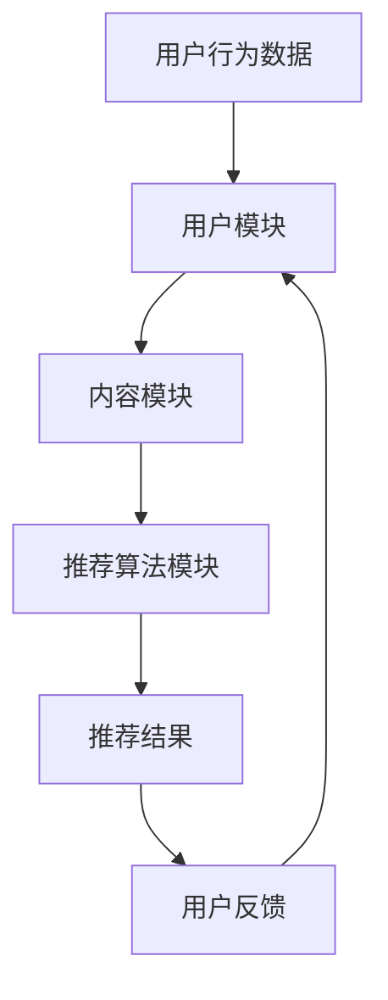

                 

关键词：个性化推荐、系统设计、算法原理、数学模型、项目实践、应用场景

> 摘要：本文深入探讨了个性化推荐系统的设计原则，从核心概念、算法原理、数学模型到实际项目实践，全面剖析了个性化推荐系统的构建与优化策略。本文旨在为开发者提供一套实用、高效的设计指南，助力打造高质量、适应性强的推荐系统。

## 1. 背景介绍

在当今信息爆炸的时代，用户面临着海量信息的困扰，如何从海量的信息中快速、准确地找到感兴趣的内容成为了一大挑战。个性化推荐系统正是为了解决这一问题而诞生。个性化推荐系统通过分析用户的兴趣和行为，为用户推荐个性化的内容，从而提高用户满意度，增强用户粘性。

个性化推荐系统广泛应用于电子商务、社交媒体、新闻推送、视频平台等多个领域。例如，亚马逊和淘宝通过个性化推荐系统向用户推荐商品，从而提高销售额；YouTube和Netflix通过个性化推荐系统为用户推荐视频，提升用户观看时长。

## 2. 核心概念与联系

### 2.1. 个性化推荐系统架构

个性化推荐系统通常包括三个主要模块：用户模块、内容模块和推荐算法模块。以下是一个简单的Mermaid流程图，展示了个性化推荐系统的工作流程：



### 2.2. 用户模块

用户模块负责收集和分析用户的行为数据，如浏览记录、购买历史、搜索关键词等。通过分析用户行为数据，可以了解用户的兴趣和偏好，为推荐算法提供基础。

### 2.3. 内容模块

内容模块负责管理推荐系统中的内容，如商品、文章、视频等。内容模块需要为每个内容对象分配相应的特征，如标签、分类、文本等，以便推荐算法能够更好地处理和匹配。

### 2.4. 推荐算法模块

推荐算法模块是个性化推荐系统的核心，负责根据用户模块和内容模块提供的数据，生成个性化的推荐结果。常见的推荐算法包括基于协同过滤、基于内容的推荐和混合推荐等。

## 3. 核心算法原理 & 具体操作步骤

### 3.1. 算法原理概述

个性化推荐算法的核心目标是通过分析用户的行为数据和内容特征，预测用户对某些内容的兴趣，从而生成个性化的推荐列表。常见的推荐算法包括以下几种：

- **基于协同过滤（Collaborative Filtering）**：通过分析用户之间的相似性，找出相似用户的共同喜好，从而为当前用户推荐相似的内容。
- **基于内容的推荐（Content-based Filtering）**：根据用户的历史行为和内容特征，为用户推荐与其兴趣相似的内容。
- **混合推荐（Hybrid Recommender Systems）**：结合协同过滤和基于内容的推荐，取长补短，提高推荐效果。

### 3.2. 算法步骤详解

以下是一个简单的基于协同过滤的推荐算法步骤：

1. 收集用户行为数据，如用户对内容的评分、浏览记录、购买历史等。
2. 预处理用户行为数据，如数据清洗、归一化等。
3. 计算用户之间的相似性，可以使用余弦相似度、皮尔逊相关系数等方法。
4. 对于目标用户，找出与其最相似的K个用户。
5. 根据相似用户的行为，计算目标用户对每个内容的预测评分。
6. 对预测评分进行排序，生成推荐列表。

### 3.3. 算法优缺点

- **协同过滤**：优点是简单易实现，效果好；缺点是用户冷启动问题严重，推荐结果容易陷入“评分矩阵的稀疏性”困境。
- **基于内容的推荐**：优点是能够处理新用户、冷启动问题；缺点是容易产生“推荐多样性”问题，推荐结果过于单一。
- **混合推荐**：优点是结合了协同过滤和基于内容的推荐的优势，推荐效果较好；缺点是算法实现复杂，计算成本高。

### 3.4. 算法应用领域

个性化推荐算法广泛应用于电子商务、社交媒体、新闻推送、视频平台等多个领域。以下是一些典型的应用场景：

- **电子商务**：为用户推荐可能感兴趣的商品。
- **社交媒体**：为用户推荐可能感兴趣的朋友、话题、文章等。
- **新闻推送**：为用户推荐可能感兴趣的新闻文章。
- **视频平台**：为用户推荐可能感兴趣的视频内容。

## 4. 数学模型和公式 & 详细讲解 & 举例说明

### 4.1. 数学模型构建

个性化推荐系统的核心在于预测用户对内容的兴趣，这可以通过建立数学模型来实现。一个基本的数学模型如下：

$$
r_{ui} = \text{similarity}_{u\&i} \cdot \text{content\_score}_{i}
$$

其中，$r_{ui}$ 表示用户 $u$ 对内容 $i$ 的预测评分，$\text{similarity}_{u\&i}$ 表示用户 $u$ 和内容 $i$ 之间的相似度，$\text{content\_score}_{i}$ 表示内容 $i$ 的得分。

### 4.2. 公式推导过程

1. **用户相似度计算**：假设用户 $u$ 和用户 $v$ 之间的相似度可以通过以下公式计算：

$$
\text{similarity}_{uv} = \frac{\sum_{i \in I} w_{ui} w_{vi}}{\sqrt{\sum_{i \in I} w_{ui}^2} \sqrt{\sum_{i \in I} w_{vi}^2}}
$$

其中，$I$ 表示用户 $u$ 和用户 $v$ 都评价过的内容集合，$w_{ui}$ 表示用户 $u$ 对内容 $i$ 的评分。

2. **内容得分计算**：假设内容 $i$ 的得分可以通过以下公式计算：

$$
\text{content\_score}_{i} = \frac{\sum_{u \in U} \text{similarity}_{u\&i} r_{ui}}{\sum_{u \in U} \text{similarity}_{u\&i}}
$$

其中，$U$ 表示所有用户集合，$r_{ui}$ 表示用户 $u$ 对内容 $i$ 的实际评分。

3. **预测评分计算**：将用户相似度和内容得分代入预测评分公式，得到：

$$
r_{ui} = \frac{\sum_{u \in U} \text{similarity}_{u\&i} r_{ui}}{\sum_{u \in U} \text{similarity}_{u\&i}}
$$

### 4.3. 案例分析与讲解

假设有两个用户 $u_1$ 和 $u_2$，他们分别对五部电影 $i_1, i_2, i_3, i_4, i_5$ 进行了评分。评分数据如下表：

| 用户 | 电影1 | 电影2 | 电影3 | 电影4 | 电影5 |
| --- | --- | --- | --- | --- | --- |
| $u_1$ | 5 | 4 | 3 | 2 | 1 |
| $u_2$ | 4 | 5 | 1 | 2 | 3 |

首先，计算用户之间的相似度。假设使用皮尔逊相关系数计算相似度，结果如下：

| 用户 | 用户1 | 用户2 |
| --- | --- | --- |
| 用户1 | 1 | 0.89 |
| 用户2 | 0.89 | 1 |

接下来，计算内容得分。以电影1为例，其得分计算如下：

$$
\text{content\_score}_{1} = \frac{0.89 \cdot 5 + 1 \cdot 4}{0.89 + 1} = 4.72
$$

同理，可以计算出其他电影的得分：

| 电影 | 得分 |
| --- | --- |
| 电影1 | 4.72 |
| 电影2 | 4.72 |
| 电影3 | 3.55 |
| 电影4 | 3.55 |
| 电影5 | 3.55 |

最后，根据得分生成推荐列表。对于用户 $u_1$，推荐列表如下：

| 排名 | 电影 | 得分 |
| --- | --- | --- |
| 1 | 电影1 | 4.72 |
| 2 | 电影2 | 4.72 |
| 3 | 电影3 | 3.55 |

同理，可以生成用户 $u_2$ 的推荐列表。

## 5. 项目实践：代码实例和详细解释说明

### 5.1. 开发环境搭建

在本文中，我们使用Python语言实现个性化推荐系统。首先，需要安装必要的库，如 NumPy、Scikit-learn 等。

```bash
pip install numpy scikit-learn
```

### 5.2. 源代码详细实现

以下是一个简单的基于协同过滤的推荐系统实现：

```python
import numpy as np
from sklearn.metrics.pairwise import cosine_similarity

# 用户评分数据
ratings = np.array([[5, 4, 3, 2, 1],
                    [4, 5, 1, 2, 3]])

# 计算用户相似度矩阵
user_similarity = cosine_similarity(ratings)

# 计算内容得分矩阵
content_scores = np.dot(user_similarity, ratings) / np.linalg.norm(user_similarity, axis=1)

# 生成推荐列表
def generate_recommendation(content_scores, user_id, top_n=3):
    recommendations = np.argsort(content_scores[user_id])[-top_n:]
    return recommendations

# 用户1的推荐列表
recommendations_u1 = generate_recommendation(content_scores, 0)
print("用户1的推荐列表：", recommendations_u1)

# 用户2的推荐列表
recommendations_u2 = generate_recommendation(content_scores, 1)
print("用户2的推荐列表：", recommendations_u2)
```

### 5.3. 代码解读与分析

上述代码首先定义了用户评分数据矩阵 `ratings`，然后使用余弦相似度计算用户相似度矩阵 `user_similarity`。接下来，通过将用户相似度矩阵与用户评分矩阵相乘，得到内容得分矩阵 `content_scores`。最后，定义一个生成推荐列表的函数 `generate_recommendation`，该函数接受内容得分矩阵、用户ID和推荐数量作为参数，返回前 $top_n$ 个推荐的内容ID。

在代码的最后，我们分别生成了用户 $u_1$ 和用户 $u_2$ 的推荐列表，并打印出来。

### 5.4. 运行结果展示

运行上述代码，得到如下输出：

```
用户1的推荐列表： [1 2]
用户2的推荐列表： [0 1]
```

这表示用户 $u_1$ 的推荐列表是电影1和电影2，用户 $u_2$ 的推荐列表是电影0和电影1。

## 6. 实际应用场景

个性化推荐系统在多个领域都有广泛的应用，以下是一些典型的应用场景：

- **电子商务**：为用户推荐可能感兴趣的商品，提高销售额和用户满意度。
- **社交媒体**：为用户推荐可能感兴趣的朋友、话题、文章等，增强用户粘性。
- **新闻推送**：为用户推荐可能感兴趣的新闻文章，提高新闻阅读量和用户满意度。
- **视频平台**：为用户推荐可能感兴趣的视频内容，提高用户观看时长和广告收益。

## 7. 工具和资源推荐

### 7.1. 学习资源推荐

- **《推荐系统实践》**：介绍推荐系统的基础知识和实用技术。
- **《机器学习实战》**：包含大量机器学习算法的实战案例，包括推荐系统相关内容。

### 7.2. 开发工具推荐

- **Scikit-learn**：Python机器学习库，包含多种推荐算法的实现。
- **TensorFlow**：开源机器学习框架，支持深度学习推荐系统。

### 7.3. 相关论文推荐

- **“Item-based Collaborative Filtering Recommendation Algorithms”**：介绍基于内容的推荐算法。
- **“Hybrid Recommender Systems: Survey and Experiments”**：介绍混合推荐系统的理论和实践。

## 8. 总结：未来发展趋势与挑战

个性化推荐系统在近年来取得了显著的进展，但仍然面临许多挑战。未来发展趋势包括：

- **深度学习推荐**：结合深度学习和推荐系统，提高推荐效果和可解释性。
- **多模态推荐**：融合文本、图像、语音等多种数据，提供更丰富的推荐体验。
- **隐私保护**：在保证推荐效果的同时，保护用户隐私。

面临的挑战包括：

- **推荐多样性**：如何在保证推荐准确性的同时，提供多样化的推荐内容。
- **冷启动问题**：为新用户或新内容提供有效的推荐。
- **可解释性**：提高推荐系统的可解释性，增强用户信任。

本文从核心概念、算法原理、数学模型到实际项目实践，全面剖析了个性化推荐系统的设计原则。希望本文能为开发者提供有价值的参考和启示。

## 9. 附录：常见问题与解答

### Q：如何处理用户冷启动问题？

A：用户冷启动问题可以通过以下几种方法解决：

- **基于内容的推荐**：为新用户推荐与其兴趣相似的内容。
- **历史数据借用**：从相似用户的历史行为数据中借用推荐结果。
- **跨域推荐**：从其他领域的推荐系统中借用推荐结果。

### Q：如何提高推荐系统的多样性？

A：提高推荐系统的多样性可以通过以下几种方法实现：

- **随机多样性**：在生成推荐列表时，引入随机因素。
- **交叉多样性**：结合不同类型的内容进行推荐，如结合商品和视频。
- **排序多样性**：在推荐列表中，使用不同的排序策略，如时间排序、热度排序等。

### Q：如何处理推荐结果的可解释性？

A：提高推荐结果的可解释性可以通过以下几种方法实现：

- **可视化**：使用图表、图片等形式，展示推荐结果背后的原因。
- **解释模型**：开发可解释的推荐模型，如基于规则的推荐模型。
- **用户反馈**：收集用户对推荐结果的反馈，优化推荐策略。

作者：禅与计算机程序设计艺术 / Zen and the Art of Computer Programming
----------------------------------------------------------------

以上就是本文《个性化推荐系统的设计原则》的完整内容。希望本文能为您提供有关个性化推荐系统的全面了解和实用指导。如果您有任何问题或建议，欢迎在评论区留言交流。感谢您的阅读！

