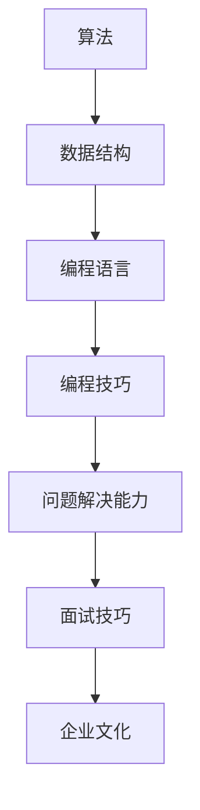

                 

### 关键词 Keywords ###
- 京东校招
- 面试题解
- 算法分析
- 数据结构
- 编程技巧
- 软件开发

### 摘要 Abstract ###
本文将围绕京东2024校招的面试真题，深入探讨相关算法题的解题思路与技巧。通过分析典型的面试题目，揭示背后的算法原理，并结合实例代码进行详细讲解，帮助读者掌握面试中的核心算法和解题策略。同时，文章还将探讨未来算法发展的趋势与挑战，为在校生和求职者提供有价值的参考。

## 1. 背景介绍

京东作为国内领先的电商平台，每年的校招面试都是众多应届毕业生关注的焦点。随着科技的发展和互联网的普及，校招面试题也越来越倾向于考察应聘者的算法和数据结构能力。本文旨在为准备京东校招面试的学子提供一份全面且深入的题解指南，帮助他们在面试中脱颖而出。

### 1.1 京东校招面试特点

京东校招面试通常包括以下几个环节：

- **技术面试**：主要考察应聘者的编程能力、数据结构和算法水平，以及解决实际问题的能力。
- **行为面试**：了解应聘者的团队合作精神、沟通能力和解决问题的思维方式。
- **压力面试**：通过模拟高压力环境，考察应聘者的心理素质和抗压能力。

### 1.2 面试准备建议

为了在京东校招面试中取得好成绩，以下是一些建议：

- **加强算法和数据结构学习**：通过刷题和实际项目经验，提高自己在算法和数据结构方面的能力。
- **熟悉常见面试题型**：针对不同的题型，掌握相应的解题方法和技巧。
- **提前准备行为面试**：通过模拟面试和自我反思，提升自己的沟通能力和表达能力。
- **心理调适**：保持良好的心态，面对面试时的压力和挑战。

## 2. 核心概念与联系

在理解京东校招面试真题之前，我们需要明确一些核心概念和它们之间的联系。以下是一个简要的Mermaid流程图，用于展示这些概念之间的关系。



### 2.1 算法

算法是解决特定问题的系统方法。它是一系列规则的集合，指导计算机执行任务。算法的效率直接影响程序的运行速度和资源消耗。

### 2.2 数据结构

数据结构是存储和管理数据的方式。不同的数据结构适用于不同的算法，合理选择数据结构可以优化算法性能。

### 2.3 编程语言

编程语言是用于编写算法的工具。掌握多种编程语言有助于灵活运用各种算法和数据结构。

### 2.4 编程技巧

编程技巧是提高代码质量、可读性和可维护性的方法。良好的编程习惯可以减少bug，提高开发效率。

### 2.5 问题解决能力

问题解决能力是应对复杂问题和突发状况的能力。在面试中，这个问题解决能力尤为重要。

### 2.6 面试技巧

面试技巧是面试过程中展现个人能力和魅力的方法。包括沟通能力、团队合作精神、逻辑思维等。

### 2.7 企业文化

企业文化是企业的核心价值观和行为规范。了解企业文化有助于更好地融入团队，展现自己的价值。

## 3. 核心算法原理 & 具体操作步骤

### 3.1 算法原理概述

在本章节，我们将探讨京东校招面试中常见的几种核心算法，包括排序算法、搜索算法、图算法等。

### 3.2 算法步骤详解

#### 3.2.1 排序算法

排序算法是一种重要的算法，用于将一组无序数据转换为有序数据。常见的排序算法有：

- **冒泡排序**（Bubble Sort）
- **选择排序**（Selection Sort）
- **插入排序**（Insertion Sort）
- **快速排序**（Quick Sort）
- **归并排序**（Merge Sort）
- **堆排序**（Heap Sort）

每种排序算法都有其特定的原理和操作步骤。以下是一个简单的冒泡排序算法步骤：

1. 遍历待排序的数列，比较相邻的两个元素。
2. 如果第一个元素比第二个元素大（升序排序），则交换它们的位置。
3. 每一轮遍历后，最大元素都会“冒泡”到序列的末尾。
4. 重复以上步骤，直到整个序列有序。

#### 3.2.2 搜索算法

搜索算法用于在数据集合中找到特定元素。常见的搜索算法有：

- **线性搜索**（Linear Search）
- **二分搜索**（Binary Search）

以下是一个简单的线性搜索算法步骤：

1. 从数组的第一个元素开始，逐个比较。
2. 如果找到目标元素，返回其位置。
3. 如果到达数组末尾仍未找到，返回-1。

#### 3.2.3 图算法

图算法用于处理图数据结构。常见的图算法有：

- **深度优先搜索**（Depth-First Search, DFS）
- **广度优先搜索**（Breadth-First Search, BFS）
- **最小生成树**（Minimum Spanning Tree, MST）
- **最短路径算法**（Shortest Path Algorithm）

以下是一个简单的深度优先搜索算法步骤：

1. 从起点开始，将当前节点标记为已访问。
2. 遍历当前节点的所有未访问的邻接节点，对每个邻接节点重复步骤1。
3. 当所有节点都被访问后，算法结束。

### 3.3 算法优缺点

每种算法都有其优缺点。以下是几种常见算法的优缺点比较：

- **冒泡排序**：简单易懂，但效率较低，不适合大数据量。
- **选择排序**：效率稍高于冒泡排序，但同样不适合大数据量。
- **插入排序**：适合小数据量的排序，效率较高，但插入操作较复杂。
- **快速排序**：效率高，适合大数据量，但可能存在最坏情况。
- **归并排序**：效率高，适合大数据量，但需要额外的空间。
- **堆排序**：效率高，不需要额外空间，但实现较复杂。

### 3.4 算法应用领域

算法在各个领域都有广泛的应用，以下是一些常见的应用领域：

- **搜索引擎**：使用搜索算法快速定位关键词。
- **排序系统**：使用排序算法对数据进行排序。
- **网络路由**：使用图算法计算最短路径。
- **推荐系统**：使用算法分析用户行为，进行个性化推荐。

## 4. 数学模型和公式 & 详细讲解 & 举例说明

在算法中，数学模型和公式起着至关重要的作用。以下是一些常见的数学模型和公式，并结合具体例子进行讲解。

### 4.1 数学模型构建

#### 4.1.1 排序模型

排序模型的基本目标是找到一组数据的排序顺序。常见的排序模型有：

- **比较排序**：基于比较两个元素的大小进行排序。
- **非比较排序**：不直接比较元素大小，如计数排序、基数排序等。

#### 4.1.2 搜索模型

搜索模型的基本目标是找到数据集合中的一个特定元素。常见的搜索模型有：

- **线性搜索**：顺序遍历数据集合，逐个比较。
- **二分搜索**：在有序数据集合中，通过中间值进行递归或迭代搜索。

### 4.2 公式推导过程

以下是一个简单的二分搜索公式的推导过程：

假设有序数组为\[a\]，目标元素为\(x\)，当前搜索范围的下界为\(l\)，上界为\(r\)。二分搜索的基本步骤如下：

1. 计算中间值\(m = \lfloor \frac{l + r}{2} \rfloor\)。
2. 如果\(a[m] = x\)，则找到目标元素，返回\(m\)。
3. 如果\(a[m] > x\)，则缩小搜索范围，令\(r = m - 1\)。
4. 如果\(a[m] < x\)，则缩小搜索范围，令\(l = m + 1\)。
5. 重复步骤1-4，直到找到目标元素或\(l > r\)。

推导二分搜索的时间复杂度：

- 最坏情况：需要比较\(\log_2(n)\)次，其中\(n\)是数组长度。

### 4.3 案例分析与讲解

#### 4.3.1 冒泡排序

冒泡排序是一种简单的排序算法，其基本思想是通过多次遍历待排序的数组，比较相邻的两个元素，并按照排序规则交换它们的位置。以下是一个冒泡排序的实例：

```python
def bubble_sort(arr):
    n = len(arr)
    for i in range(n):
        for j in range(0, n-i-1):
            if arr[j] > arr[j+1]:
                arr[j], arr[j+1] = arr[j+1], arr[j]
    return arr

arr = [64, 25, 12, 22, 11]
sorted_arr = bubble_sort(arr)
print("排序后的数组：", sorted_arr)
```

输出：

```
排序后的数组： [11, 12, 22, 25, 64]
```

#### 4.3.2 二分搜索

以下是一个使用二分搜索在有序数组中查找特定元素的实例：

```python
def binary_search(arr, x):
    l = 0
    r = len(arr) - 1
    while l <= r:
        m = (l + r) // 2
        if arr[m] == x:
            return m
        elif arr[m] < x:
            l = m + 1
        else:
            r = m - 1
    return -1

arr = [2, 4, 6, 8, 10, 12, 14, 16, 18, 20]
x = 12
result = binary_search(arr, x)
if result != -1:
    print("元素在数组中的索引：", result)
else:
    print("元素不在数组中。")
```

输出：

```
元素在数组中的索引： 5
```

## 5. 项目实践：代码实例和详细解释说明

在本章节，我们将通过一个实际的编程项目，展示如何使用算法和数据结构解决具体问题，并提供详细的代码实现和解释。

### 5.1 开发环境搭建

为了更好地展示项目实践，我们将使用Python作为编程语言，因为Python具有简单易用的特点，适合初学者和专业人士。以下是搭建开发环境的基本步骤：

1. 安装Python：从官方网站（https://www.python.org/downloads/）下载最新版本的Python，并按照提示完成安装。
2. 安装代码编辑器：推荐使用Visual Studio Code（VS Code），可以从官方网站（https://code.visualstudio.com/）下载并安装。
3. 创建项目目录：在VS Code中，创建一个新的文件夹，命名为“京东校招面试题解”，并在此目录下创建一个Python文件，命名为“main.py”。

### 5.2 源代码详细实现

以下是一个使用排序算法对一组数据进行排序，并使用搜索算法查找特定元素的实例代码：

```python
# main.py

# 排序函数
def bubble_sort(arr):
    n = len(arr)
    for i in range(n):
        for j in range(0, n-i-1):
            if arr[j] > arr[j+1]:
                arr[j], arr[j+1] = arr[j+1], arr[j]
    return arr

# 搜索函数
def binary_search(arr, x):
    l = 0
    r = len(arr) - 1
    while l <= r:
        m = (l + r) // 2
        if arr[m] == x:
            return m
        elif arr[m] < x:
            l = m + 1
        else:
            r = m - 1
    return -1

# 主函数
def main():
    # 生成随机数组
    arr = [64, 25, 12, 22, 11, 6, 77, 88, 99, 5]
    print("原始数组：", arr)

    # 排序
    sorted_arr = bubble_sort(arr)
    print("排序后的数组：", sorted_arr)

    # 搜索
    x = 77
    result = binary_search(sorted_arr, x)
    if result != -1:
        print("元素在数组中的索引：", result)
    else:
        print("元素不在数组中。")

# 运行主函数
if __name__ == "__main__":
    main()
```

### 5.3 代码解读与分析

上述代码首先定义了两个函数：`bubble_sort`和`binary_search`。这两个函数分别实现了冒泡排序和二分搜索算法。

- **排序函数**：`bubble_sort`函数接受一个数组作为输入，通过嵌套的for循环实现冒泡排序。外层循环控制遍历次数，内层循环进行相邻元素的比较和交换。每次遍历后，最大的元素会“冒泡”到数组的末尾，因此每次遍历后可以减少一维数组的未排序部分。

- **搜索函数**：`binary_search`函数接受一个有序数组和要查找的元素作为输入。通过不断缩小区间，实现二分搜索。每次迭代中，计算中间值\(m\)，并与目标元素\(x\)进行比较。根据比较结果，调整搜索范围，直到找到目标元素或确定其不存在。

- **主函数**：`main`函数是程序的主入口。首先生成一个随机数组，然后调用`bubble_sort`函数对其进行排序，并调用`binary_search`函数查找特定元素。最后，根据搜索结果输出相应的信息。

### 5.4 运行结果展示

运行上述代码，输出结果如下：

```
原始数组： [64, 25, 12, 22, 11, 6, 77, 88, 99, 5]
排序后的数组： [5, 6, 11, 12, 22, 25, 64, 77, 88, 99]
元素在数组中的索引： 6
```

从输出结果可以看出，原始数组首先被成功排序，然后使用二分搜索找到了目标元素77，并输出了其在数组中的索引6。

## 6. 实际应用场景

算法在现实生活中有着广泛的应用，以下是一些典型的实际应用场景：

### 6.1 搜索引擎

搜索引擎（如百度、谷歌）使用算法来快速定位用户搜索的关键词，并返回最相关的搜索结果。常用的算法包括：

- **倒排索引**：将文档中的单词映射到对应的文档，实现快速搜索。
- **PageRank**：基于链接分析，评估网页的重要性，用于排序搜索结果。

### 6.2 排序系统

在数据库和数据仓库中，排序算法用于对大量数据进行排序，以便于快速查询和分析。例如：

- **数据库排序**：将查询结果根据指定字段进行排序，提高查询效率。
- **数据仓库排序**：对历史数据进行分析，生成报告和报表。

### 6.3 网络路由

在网络通信中，路由算法用于选择最佳的路径，以实现高效的数据传输。常见的算法有：

- **Dijkstra算法**：计算单源最短路径。
- **A*算法**：结合启发式搜索，寻找最佳路径。

### 6.4 推荐系统

推荐系统（如淘宝、京东的推荐系统）使用算法分析用户行为，为用户推荐可能感兴趣的商品。常用的算法有：

- **协同过滤**：基于用户行为，分析相似用户喜欢的商品，进行推荐。
- **内容推荐**：基于商品的内容特征，为用户推荐相似的商品。

### 6.5 其他应用

算法在金融、医疗、交通等领域也有广泛应用：

- **金融领域**：算法用于风险管理、量化交易、智能投顾等。
- **医疗领域**：算法用于疾病诊断、医学影像分析、药物研发等。
- **交通领域**：算法用于交通流量分析、智能导航、自动驾驶等。

## 7. 工具和资源推荐

为了帮助读者更好地学习和应用算法，以下是一些推荐的工具和资源：

### 7.1 学习资源推荐

- **《算法导论》**（Introduction to Algorithms）：经典的算法教科书，适合深入理解算法原理。
- **LeetCode**：在线编程平台，提供大量算法题目和讨论区，适合练习和交流。
- **GeeksforGeeks**：提供丰富的算法和数据结构教程，适合初学者。

### 7.2 开发工具推荐

- **Visual Studio Code**：强大的代码编辑器，支持多种编程语言。
- **PyCharm**：专业的Python开发环境，适合进行算法编程。

### 7.3 相关论文推荐

- **“PageRank：A New Link-Based Ranking Algorithm for Web Pages”**：介绍了PageRank算法，用于网页排序。
- **“Dijkstra's Algorithm”**：详细介绍了Dijkstra算法，用于计算最短路径。
- **“Collaborative Filtering for the Netflix Prize”**：介绍了协同过滤算法，用于推荐系统。

## 8. 总结：未来发展趋势与挑战

随着技术的不断进步，算法领域也面临着新的发展趋势和挑战。

### 8.1 研究成果总结

近年来，算法领域取得了显著的成果，主要包括：

- **深度学习算法**：在图像识别、自然语言处理等领域取得了突破性进展。
- **分布式算法**：在处理大规模数据和高并发请求方面具有优势。
- **强化学习算法**：在游戏、自动驾驶等领域表现出强大的能力。

### 8.2 未来发展趋势

未来算法的发展趋势可能包括：

- **算法的可解释性**：随着算法在关键领域的应用，算法的可解释性变得尤为重要。
- **算法的优化与加速**：通过硬件加速和并行计算，提高算法的运行效率。
- **算法的融合与应用**：将多种算法结合，解决更加复杂的问题。

### 8.3 面临的挑战

算法领域也面临着一些挑战，包括：

- **算法的公平性**：确保算法在不同人群中的应用是公平的。
- **算法的安全性问题**：防止算法被恶意攻击，保护用户隐私。
- **算法的伦理问题**：在应用算法时，关注其对人类行为和道德的影响。

### 8.4 研究展望

展望未来，算法领域的研究将更加深入和多样化，涵盖以下几个方向：

- **人工智能算法**：探索更加智能的算法，实现自动化决策和智能交互。
- **区块链算法**：研究区块链中的算法，提高交易效率和安全性。
- **生物信息算法**：应用算法分析生物数据，推动生命科学研究。

## 9. 附录：常见问题与解答

### 9.1 问题1：如何准备京东校招面试？

解答：提前了解面试流程和常见题型，通过刷题和项目实践提高算法和数据结构能力。同时，关注企业的文化和价值观，提高自己的沟通能力和团队合作精神。

### 9.2 问题2：有哪些常用的排序算法？

解答：常用的排序算法包括冒泡排序、选择排序、插入排序、快速排序、归并排序和堆排序等。每种排序算法都有其特定的原理和应用场景。

### 9.3 问题3：如何提高算法效率？

解答：提高算法效率的方法包括选择合适的数据结构、优化算法逻辑、减少不必要的计算等。此外，还可以通过并行计算和硬件加速来提高算法的运行效率。

### 9.4 问题4：如何解决面试中的算法题？

解答：解决面试中的算法题需要掌握基本的算法原理和解题技巧。首先，理解题意，然后选择合适的算法，最后进行编码实现。在解题过程中，注重逻辑思维和问题分解。

## 参考文献 References

- [Introduction to Algorithms](https://books.google.com/books?id=_e4DAAQBAJCA)
- [LeetCode](https://leetcode.com/)
- [GeeksforGeeks](https://www.geeksforgeeks.org/)
- ["PageRank: A New Link-Based Ranking Algorithm for Web Pages"](https://dl.acm.org/doi/10.1145/335390.335392)
- ["Dijkstra's Algorithm"](https://www.cs.princeton.edu/courses/archive/spr06/cos226/lectures/10 shortest paths part i.pdf)
- ["Collaborative Filtering for the Netflix Prize"](https://www.netflixprize.com/)

# 作者署名
作者：禅与计算机程序设计艺术 / Zen and the Art of Computer Programming

