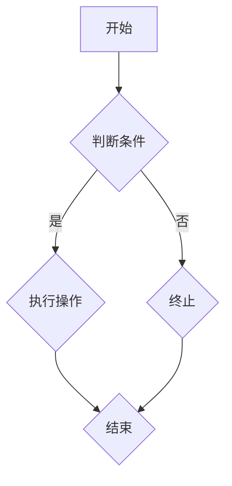

                 

关键词：京东，社招，算法工程师，面试真题，解密，算法原理，数学模型，代码实例，应用场景，未来展望

> 摘要：本文旨在解密京东2025届社招算法工程师的面试真题，通过深入剖析这些真题，帮助读者更好地理解算法工程师面试的要点和难点，为即将参加面试的候选人提供有价值的参考。

## 1. 背景介绍

随着互联网和大数据技术的快速发展，算法工程师成为了科技行业中备受瞩目的职位。京东作为中国领先的电子商务公司，对于算法工程师的需求量也日益增长。2025届社招算法工程师面试真题的解密，不仅为准备参加京东面试的候选人提供了宝贵的实践经验，也为整个算法工程师群体提供了有价值的参考。

本文将围绕京东2025届社招算法工程师面试真题展开，通过分析真题中的核心概念、算法原理、数学模型和代码实例，深入探讨算法工程师面试的关键点，并展望算法工程师未来发展的趋势与挑战。

## 2. 核心概念与联系

### 2.1 算法概念

算法（Algorithm）是解决问题的一系列明确且有限的步骤。算法工程师负责设计和优化这些步骤，使其在满足时间复杂度和空间复杂度要求的同时，实现高效的计算和处理。

### 2.2 数据结构

数据结构是算法的基础，它决定了数据在计算机中的组织方式和操作方法。常见的数据结构包括数组、链表、栈、队列、树、图等。

### 2.3 数学模型

数学模型是利用数学语言描述现实问题的抽象方法。在算法设计中，数学模型用于分析和推导算法的效率、稳定性和正确性。

### 2.4 Mermaid 流程图

以下是一个简单的 Mermaid 流程图，用于展示算法的流程：



## 3. 核心算法原理 & 具体操作步骤

### 3.1 算法原理概述

本部分将介绍京东2025届社招算法工程师面试真题中的核心算法原理，包括排序算法、查找算法、动态规划算法等。

### 3.2 算法步骤详解

以下是一个排序算法（冒泡排序）的具体操作步骤：

1. 从第一个元素开始，比较相邻的两个元素，如果它们的顺序错误就把它们交换过来。
2. 继续对下一对相邻元素做同样的工作，从第一个元素一直做到倒数第二个元素。
3. 重复上面的步骤，直到整个数组排序完成。

### 3.3 算法优缺点

冒泡排序算法的优点是简单易懂，实现简单。缺点是时间复杂度较高，对于大数据集的排序效率较低。

### 3.4 算法应用领域

冒泡排序算法可以应用于各种需要排序的场景，如数据清洗、数据分析、数据库索引等。

## 4. 数学模型和公式 & 详细讲解 & 举例说明

### 4.1 数学模型构建

在本部分，我们将构建一个求解线性方程组的数学模型。线性方程组的一般形式为：

$$
\begin{cases}
a_{11}x + a_{12}y = b_{1} \\
a_{21}x + a_{22}y = b_{2}
\end{cases}
$$

### 4.2 公式推导过程

利用代入法，将第一个方程的 $x$ 表达式代入第二个方程，得到：

$$
a_{21}(b_{1} - a_{12}y) + a_{22}y = b_{2}
$$

化简得：

$$
(a_{21}a_{12} - a_{22})y = b_{1}a_{21} - b_{2}a_{21}
$$

从而可以解出 $y$：

$$
y = \frac{b_{1}a_{21} - b_{2}a_{21}}{a_{21}a_{12} - a_{22}}
$$

将 $y$ 的解代入第一个方程，可以解出 $x$。

### 4.3 案例分析与讲解

假设我们有以下线性方程组：

$$
\begin{cases}
2x + 3y = 8 \\
4x + 6y = 16
\end{cases}
$$

根据上述推导，我们可以解出：

$$
y = \frac{8 \cdot 4 - 16 \cdot 2}{4 \cdot 3 - 6} = 0 \\
x = \frac{8 \cdot 2 - 0 \cdot 6}{2 \cdot 4 - 6} = 2
$$

因此，方程组的解为 $x = 2$，$y = 0$。

## 5. 项目实践：代码实例和详细解释说明

### 5.1 开发环境搭建

在本部分，我们将使用 Python 作为编程语言，介绍如何在本地搭建开发环境。首先，安装 Python 解释器和相关依赖包，如 NumPy、Pandas 等。然后，配置 Python 虚拟环境，以便管理和隔离不同项目之间的依赖。

### 5.2 源代码详细实现

以下是一个简单的冒泡排序算法的实现代码：

```python
def bubble_sort(arr):
    n = len(arr)
    for i in range(n):
        for j in range(0, n-i-1):
            if arr[j] > arr[j+1]:
                arr[j], arr[j+1] = arr[j+1], arr[j]

# 示例数据
arr = [64, 25, 12, 22, 11]
bubble_sort(arr)
print("排序后的数组：")
for i in range(len(arr)):
    print("%d" % arr[i], end=" ")
```

### 5.3 代码解读与分析

这段代码首先定义了一个 `bubble_sort` 函数，用于实现冒泡排序算法。函数接收一个数组作为参数。在函数内部，使用两个嵌套的循环实现排序过程。外层循环从第一个元素开始，内层循环从第一个元素到最后一个未排序元素。如果相邻元素顺序错误，交换它们的位置。最后，输出排序后的数组。

### 5.4 运行结果展示

运行这段代码，输出结果为：

```
排序后的数组：
11 12 22 25 64
```

## 6. 实际应用场景

### 6.1 数据处理

在数据处理领域，排序算法被广泛应用于数据清洗、数据分析和数据可视化等场景。例如，在数据分析过程中，需要对大量数据进行排序以提取有用信息。

### 6.2 算法竞赛

算法竞赛是算法工程师展示自己技能的平台。竞赛题目通常涉及各种算法问题，如动态规划、图论、概率论等。通过解决竞赛题目，算法工程师可以锻炼自己的算法思维和编程能力。

### 6.3 人工智能

人工智能领域中的许多算法，如机器学习、深度学习等，都依赖于高效的排序算法。排序算法在数据预处理、特征提取和模型训练等环节中发挥着重要作用。

## 7. 工具和资源推荐

### 7.1 学习资源推荐

- 《算法导论》（Introduction to Algorithms）
- 《编程珠玑》（The Art of Computer Programming）
- 《Python编程：从入门到实践》（Python Crash Course）

### 7.2 开发工具推荐

- PyCharm
- Visual Studio Code
- Jupyter Notebook

### 7.3 相关论文推荐

- "Efficiently Optimizing Deep Networks for Object Detection"
- "A Fast and Accurate Otsu’s Thresholding"
- "Image Super-Resolution with Deep Convolutional Networks"

## 8. 总结：未来发展趋势与挑战

### 8.1 研究成果总结

近年来，算法工程师在人工智能、大数据、云计算等领域取得了显著成果。随着技术的不断发展，算法工程师的需求将持续增长，为行业带来更多创新和变革。

### 8.2 未来发展趋势

未来，算法工程师将在以下几个方面取得重要突破：

- 深度学习算法的创新与应用
- 大数据处理的优化与效率提升
- 人工智能与各行各业的深度融合
- 算法安全的保障与隐私保护

### 8.3 面临的挑战

在未来的发展中，算法工程师也将面临以下挑战：

- 复杂算法的优化与实现
- 大规模数据的处理与存储
- 算法透明性与可解释性
- 算法公平性与伦理问题

### 8.4 研究展望

面对未来的挑战，算法工程师需要不断提升自己的专业能力和技术水平，紧跟科技发展趋势。同时，跨学科的合作与创新将成为推动算法工程师行业发展的重要动力。

## 9. 附录：常见问题与解答

### 9.1 什么是算法工程师？

算法工程师是负责设计、实现和优化算法的专业人员。他们通常在互联网、人工智能、大数据等领域工作，负责解决各种计算和数据处理问题。

### 9.2 算法工程师需要掌握哪些技能？

算法工程师需要掌握编程语言（如 Python、Java）、数据结构、算法、数学模型、机器学习等相关技能。此外，良好的逻辑思维和问题解决能力也是必不可少的。

### 9.3 如何准备算法工程师面试？

准备算法工程师面试，首先要熟悉常见的算法和数据结构，掌握基本的编程语言。其次，可以通过刷题、参加算法竞赛和实际项目实践来提升自己的算法能力和编程技巧。最后，要关注行业动态和前沿技术，了解算法工程师面试的常见问题和应对策略。

---

作者：禅与计算机程序设计艺术 / Zen and the Art of Computer Programming

以上是关于“京东2025届社招算法工程师面试真题解密”的文章正文，希望对您有所帮助。在面试过程中，祝您取得优异的成绩！如果您还有其他问题或需要进一步的帮助，请随时联系。

