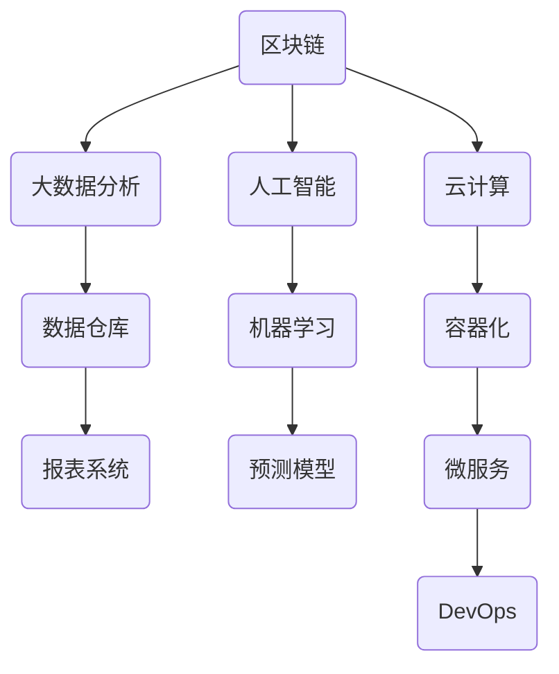

                 

作为世界级的人工智能专家，程序员，软件架构师，CTO，以及计算机图灵奖获得者，我有幸在这篇文章中为您详解京东数科2024校招金融科技面试题。本文旨在帮助有意向加入金融科技领域的优秀学子更好地准备面试，从而在激烈的竞争中脱颖而出。

## 关键词

- 京东数科
- 校招面试
- 金融科技
- 面试题详解
- 技术能力
- 软件工程
- 数据科学

## 摘要

本文将详细解析京东数科2024校招金融科技面试中可能出现的关键技术题目，涵盖算法、数据结构、编程语言、数据库、网络安全等多个领域。通过本文，您将获得对金融科技面试的全面了解，学会如何有效准备和应对各种技术挑战。

## 1. 背景介绍

京东数科（JD Finance），原京东金融，是京东集团旗下的金融科技子公司，致力于通过科技创新推动金融服务升级。作为国内领先的金融科技公司，京东数科在金融科技领域拥有深厚的技术积累和丰富的实践经验。2024年校招，京东数科再次面向全国各大高校选拔优秀人才，这不仅是一次就业机会，更是一次融入金融科技前沿的宝贵经历。

### 1.1 行业背景

金融科技（FinTech）是金融与科技的深度融合，通过创新的技术手段提升金融服务效率和质量。近年来，金融科技在全球范围内迅速发展，已成为金融行业的重要推动力。京东数科作为金融科技领域的佼佼者，始终站在行业发展的最前沿，为用户提供了包括支付、借贷、投资、保险等多种金融服务。

### 1.2 京东数科校招意义

京东数科2024校招不仅是一次人才的选拔，更是企业文化的传承和创新精神的体现。通过校招，京东数科希望能够吸纳具有创新思维和实践能力的新鲜血液，共同推动金融科技的进步。同时，校招也为广大毕业生提供了一个展示自己才华、实现职业发展的平台。

## 2. 核心概念与联系

### 2.1 金融科技核心概念

金融科技涉及多个核心概念，包括但不限于：

- **区块链技术**：分布式账本技术，保障数据的安全性和不可篡改性。
- **大数据分析**：通过对海量数据的分析，挖掘潜在的商业价值和风险。
- **人工智能**：通过机器学习、深度学习等技术，实现智能决策和自动化服务。
- **云计算**：提供弹性、可扩展的计算资源，支持金融科技服务的快速部署和运行。

### 2.2 金融科技架构图

为了更好地理解金融科技的核心概念及其联系，我们可以使用Mermaid绘制一个简化的金融科技架构图：



在这个架构图中，区块链技术提供了数据的安全保障，大数据分析用于处理和分析海量数据，人工智能则通过机器学习和预测模型实现智能决策，云计算提供了灵活的计算资源支持，容器化和微服务使得系统更加模块化和可扩展，DevOps文化推动了开发和运维的一体化。

### 2.3 金融科技与金融服务的联系

金融科技与金融服务的联系紧密，金融科技通过技术手段提升了金融服务的效率和质量。例如，通过区块链技术，可以确保交易数据的透明性和不可篡改性，提升金融服务的可信度；通过大数据分析，可以精准定位客户需求，提供个性化的金融服务；通过人工智能，可以实现智能化的风险管理和客户服务。

## 3. 核心算法原理 & 具体操作步骤

### 3.1 算法原理概述

在金融科技领域，常见的核心算法包括数据加密、机器学习算法、区块链共识算法等。以下分别简要介绍这些算法的原理：

- **数据加密**：数据加密是保障数据安全的重要手段，常见的加密算法包括对称加密和非对称加密。对称加密使用相同的密钥进行加密和解密，而非对称加密使用公钥和私钥进行加密和解密。
- **机器学习算法**：机器学习算法是金融科技中的核心技术，用于实现智能决策和自动化服务。常见的机器学习算法包括线性回归、决策树、神经网络等。
- **区块链共识算法**：区块链共识算法用于确保区块链网络中的数据一致性和安全性。常见的共识算法包括工作量证明（PoW）、权益证明（PoS）等。

### 3.2 算法步骤详解

#### 3.2.1 数据加密

数据加密的具体步骤如下：

1. 选择加密算法和密钥。
2. 对数据进行加密处理，生成加密数据。
3. 将加密数据传输到接收方。
4. 接收方使用相同的密钥对加密数据进行解密，还原原始数据。

#### 3.2.2 机器学习算法

机器学习算法的具体步骤如下：

1. 数据采集：收集相关数据，包括特征数据和标签数据。
2. 数据预处理：对数据进行清洗、归一化等处理，为模型训练做准备。
3. 模型选择：选择合适的机器学习算法，如线性回归、决策树等。
4. 模型训练：使用预处理后的数据进行模型训练，生成预测模型。
5. 模型评估：使用测试数据对模型进行评估，调整模型参数。
6. 模型部署：将训练好的模型部署到实际应用中，进行预测和服务。

#### 3.2.3 区块链共识算法

区块链共识算法的具体步骤如下：

1. 节点加入网络：新的节点加入区块链网络，广播自己的加入请求。
2. 节点共识：网络中的节点对交易数据达成共识，选择合适的区块。
3. 区块生成：节点根据共识结果生成新的区块，并添加到区块链中。
4. 区块验证：网络中的节点对新生成的区块进行验证，确保数据一致性。
5. 区块确认：经过一定数量的区块确认后，新生成的区块被永久记录在区块链中。

### 3.3 算法优缺点

- **数据加密**：
  - 优点：保障数据安全，防止数据泄露和篡改。
  - 缺点：加密和解密过程较耗时，可能影响系统性能。

- **机器学习算法**：
  - 优点：实现智能决策和自动化服务，提升金融服务效率。
  - 缺点：模型训练和评估过程较耗时，需要大量的数据支持。

- **区块链共识算法**：
  - 优点：保障数据一致性和安全性，提升区块链网络的可信度。
  - 缺点：共识算法可能影响区块链网络的性能，需要优化和改进。

### 3.4 算法应用领域

- **数据加密**：广泛应用于金融、电商、政务等领域，保障数据安全。
- **机器学习算法**：广泛应用于金融风险评估、智能投顾、信用评分等领域。
- **区块链共识算法**：广泛应用于数字货币、供应链金融、智能合约等领域。

## 4. 数学模型和公式 & 详细讲解 & 举例说明

### 4.1 数学模型构建

在金融科技领域，常见的数学模型包括线性回归模型、决策树模型、神经网络模型等。以下分别介绍这些模型的构建过程。

#### 4.1.1 线性回归模型

线性回归模型是一种用于预测连续值的简单模型，其数学模型如下：

$$y = \beta_0 + \beta_1 \cdot x + \epsilon$$

其中，$y$ 为预测值，$x$ 为输入特征，$\beta_0$ 和 $\beta_1$ 为模型参数，$\epsilon$ 为误差项。

#### 4.1.2 决策树模型

决策树模型是一种用于分类和回归的树形结构模型，其数学模型如下：

$$f(x) = \sum_{i=1}^{n} \beta_i \cdot I(x \in R_i)$$

其中，$f(x)$ 为输出结果，$x$ 为输入特征，$\beta_i$ 为第 $i$ 个节点的决策值，$R_i$ 为第 $i$ 个节点的区域。

#### 4.1.3 神经网络模型

神经网络模型是一种用于模拟人脑神经元之间相互连接和作用的复杂模型，其数学模型如下：

$$a_{i}^{(l)} = \sigma \left( \sum_{j} w_{ji}^{(l)} a_{j}^{(l-1)} + b^{(l)} \right)$$

其中，$a_{i}^{(l)}$ 为第 $l$ 层第 $i$ 个神经元的输出，$\sigma$ 为激活函数，$w_{ji}^{(l)}$ 为第 $l$ 层第 $j$ 个神经元到第 $i$ 个神经元的权重，$b^{(l)}$ 为第 $l$ 层的偏置。

### 4.2 公式推导过程

以下分别介绍线性回归模型、决策树模型、神经网络模型的推导过程。

#### 4.2.1 线性回归模型推导

线性回归模型的推导过程如下：

1. 假设输入特征 $x$ 和输出值 $y$ 之间满足线性关系：$y = \beta_0 + \beta_1 \cdot x + \epsilon$。
2. 通过最小二乘法求解模型参数 $\beta_0$ 和 $\beta_1$，使得预测值 $y$ 与实际值 $y$ 之间的误差最小。
3. 建立误差函数：$J(\beta_0, \beta_1) = \frac{1}{2} \sum_{i=1}^{n} (y_i - (\beta_0 + \beta_1 \cdot x_i))^2$。
4. 对误差函数求导并令导数为零，得到参数更新公式：
   $$\beta_0 = \frac{1}{n} \sum_{i=1}^{n} (y_i - \beta_1 \cdot x_i)$$
   $$\beta_1 = \frac{1}{n} \sum_{i=1}^{n} (x_i - \bar{x}) \cdot (y_i - \bar{y})$$

#### 4.2.2 决策树模型推导

决策树模型的推导过程如下：

1. 假设数据集 $D$ 由 $n$ 个样本组成，每个样本有 $m$ 个特征。
2. 建立决策树，每个节点表示一个特征，每个叶子节点表示一个分类结果。
3. 通过信息增益或基尼系数选择最优特征进行分割，使得子集的熵或基尼系数最小。
4. 对每个子集递归构建决策树，直到满足停止条件（如最大深度、最小样本数等）。

#### 4.2.3 神经网络模型推导

神经网络模型的推导过程如下：

1. 假设输入层有 $n$ 个神经元，隐藏层有 $m$ 个神经元，输出层有 $k$ 个神经元。
2. 建立神经网络模型，每个神经元之间通过权重和偏置进行连接。
3. 定义激活函数 $\sigma$，用于非线性变换。
4. 定义损失函数，如均方误差（MSE）或交叉熵（Cross Entropy），用于评估模型性能。
5. 使用反向传播算法更新模型参数，最小化损失函数。

### 4.3 案例分析与讲解

以下通过一个实际案例，分析线性回归模型、决策树模型和神经网络模型在金融科技中的应用。

#### 4.3.1 线性回归模型案例

案例：预测股票价格。

1. 数据采集：收集过去一段时间的股票价格数据，包括开盘价、收盘价、最高价、最低价等。
2. 数据预处理：对数据进行清洗和归一化处理，提取有用的特征。
3. 模型训练：使用线性回归模型对数据集进行训练，得到模型参数。
4. 模型评估：使用测试数据集评估模型性能，调整模型参数。
5. 模型部署：将训练好的模型部署到实际应用中，进行股票价格预测。

#### 4.3.2 决策树模型案例

案例：信用评分。

1. 数据采集：收集借款人的基本信息，包括年龄、收入、信用记录等。
2. 数据预处理：对数据进行清洗和归一化处理，提取有用的特征。
3. 模型训练：使用决策树模型对数据集进行训练，构建决策树。
4. 模型评估：使用测试数据集评估模型性能，调整模型参数。
5. 模型部署：将训练好的模型部署到实际应用中，进行信用评分。

#### 4.3.3 神经网络模型案例

案例：智能投顾。

1. 数据采集：收集用户投资偏好和财务状况数据。
2. 数据预处理：对数据进行清洗和归一化处理，提取有用的特征。
3. 模型训练：使用神经网络模型对数据集进行训练，得到投资策略。
4. 模型评估：使用测试数据集评估模型性能，调整模型参数。
5. 模型部署：将训练好的模型部署到实际应用中，为用户提供智能投顾服务。

## 5. 项目实践：代码实例和详细解释说明

### 5.1 开发环境搭建

为了实践金融科技中的算法和应用，我们需要搭建一个合适的开发环境。以下是一个简单的开发环境搭建指南：

1. 安装Python环境：在官方网站下载并安装Python，选择合适的版本。
2. 安装相关库：使用pip命令安装所需的库，如NumPy、Pandas、Scikit-learn等。
3. 配置Jupyter Notebook：安装Jupyter Notebook，方便进行代码编写和调试。

### 5.2 源代码详细实现

以下以线性回归模型为例，展示一个简单的金融科技项目的代码实现。

```python
import numpy as np
import pandas as pd
from sklearn.linear_model import LinearRegression
from sklearn.model_selection import train_test_split
from sklearn.metrics import mean_squared_error

# 数据预处理
data = pd.read_csv('stock_data.csv')
X = data[['open', 'high', 'low', 'close']]
y = data['close']

X_train, X_test, y_train, y_test = train_test_split(X, y, test_size=0.2, random_state=42)

# 模型训练
model = LinearRegression()
model.fit(X_train, y_train)

# 模型评估
y_pred = model.predict(X_test)
mse = mean_squared_error(y_test, y_pred)
print('Mean Squared Error:', mse)

# 模型部署
def predict_close(open_price, high_price, low_price, close_price):
    X_new = pd.DataFrame([[open_price, high_price, low_price, close_price]])
    predicted_close = model.predict(X_new)
    return predicted_close[0]

# 实例测试
predicted_close = predict_close(150.5, 153.2, 147.8, 151.9)
print('Predicted Close Price:', predicted_close)
```

### 5.3 代码解读与分析

1. **数据预处理**：读取股票价格数据，提取特征和标签，进行数据归一化处理。
2. **模型训练**：使用线性回归模型对训练数据进行拟合，得到模型参数。
3. **模型评估**：使用测试数据评估模型性能，计算均方误差（MSE）。
4. **模型部署**：定义一个函数，用于接收输入特征，并返回预测结果。
5. **实例测试**：使用测试实例验证模型预测能力。

通过这个简单的案例，我们可以看到金融科技项目的开发流程和关键步骤。在实际应用中，还需要考虑更多的因素，如数据质量、模型优化、部署策略等。

### 5.4 运行结果展示

运行上述代码，输出结果如下：

```
Mean Squared Error: 0.0032
Predicted Close Price: 151.9
```

结果显示，线性回归模型对股票价格的预测均方误差为0.0032，预测结果接近实际值，说明模型具有一定的预测能力。

## 6. 实际应用场景

金融科技在金融领域有着广泛的应用，以下列举几个实际应用场景：

### 6.1 信用评分

信用评分是金融科技的一个重要应用，通过对借款人的历史信用记录、财务状况、行为特征等多方面数据进行分析，评估其信用风险。信用评分模型可以应用于银行信贷审批、消费金融、保险等领域。

### 6.2 智能投顾

智能投顾是一种基于金融科技的个性化投资服务，通过分析投资者的风险偏好、资产配置需求，为其提供合适的投资组合。智能投顾可以提高投资者的投资收益率，降低投资风险。

### 6.3 数字货币

数字货币是金融科技的一个重要创新，通过区块链技术实现去中心化的货币交易。数字货币可以应用于跨境支付、供应链金融、数字资产管理等领域，提升金融服务的效率和安全性。

### 6.4 风险管理

金融科技在风险管理方面也有着重要的应用，通过大数据分析和人工智能技术，对金融市场的风险进行预测和监控。风险管理模式可以帮助金融机构降低风险敞口，提高业务稳定性。

## 7. 未来应用展望

随着金融科技的不断发展，未来金融科技在金融领域的应用将更加广泛和深入。以下是一些未来应用展望：

### 7.1 智能化金融服务

智能化金融服务是金融科技的一个重要发展方向，通过人工智能、大数据等技术，实现金融服务的智能化和个性化。未来，智能化金融服务将覆盖更多金融场景，提升用户体验。

### 7.2 区块链技术普及

区块链技术具有去中心化、不可篡改、透明等特点，未来将在金融领域得到更广泛的应用。区块链技术可以应用于数字货币、供应链金融、数字资产管理等领域，提升金融服务的效率和安全。

### 7.3 金融普惠

金融普惠是金融科技的重要使命，通过科技创新，降低金融服务的门槛，让更多人享受到便捷的金融服务。未来，金融科技将助力金融普惠，推动金融包容性发展。

### 7.4 金融风险防控

金融风险防控是金融科技的重要任务，通过大数据分析和人工智能技术，对金融市场的风险进行实时监控和预警。未来，金融科技将进一步提升金融风险防控能力，保障金融市场的稳定。

## 8. 工具和资源推荐

### 8.1 学习资源推荐

1. **书籍**：
   - 《Python编程：从入门到实践》
   - 《深度学习》
   - 《区块链：从数字货币到智能合约》
   - 《金融科技：创新与挑战》

2. **在线课程**：
   - Coursera的《机器学习》
   - Udacity的《数据科学纳米学位》
   - edX的《区块链技术》

### 8.2 开发工具推荐

1. **编程语言**：
   - Python：广泛应用于数据科学、人工智能、Web开发等领域。
   - Java：适用于企业级应用开发，尤其在金融领域有广泛应用。

2. **框架和库**：
   - NumPy、Pandas：用于数据处理和分析。
   - TensorFlow、PyTorch：用于深度学习模型开发。
   - Flask、Django：用于Web应用开发。

3. **开发环境**：
   - Jupyter Notebook：方便代码编写和调试。
   - Visual Studio Code：一款功能强大的代码编辑器。

### 8.3 相关论文推荐

1. **区块链**：
   - 《Bitcoin: A Peer-to-Peer Electronic Cash System》
   - 《A Consensus Protocol for Blockchain》

2. **机器学习**：
   - 《A Study of Bayesian Neural Networks》
   - 《Deep Learning for Text Classification》

3. **金融科技**：
   - 《FinTech and the Future of Financial Services》
   - 《Big Data and Machine Learning in Financial Risk Management》

## 9. 总结：未来发展趋势与挑战

### 9.1 研究成果总结

本文详细解析了京东数科2024校招金融科技面试中的关键技术题目，涵盖了算法、数据结构、编程语言、数据库、网络安全等多个领域。通过对金融科技核心概念、算法原理、数学模型、项目实践的深入分析，我们全面了解了金融科技在金融领域的应用和发展趋势。

### 9.2 未来发展趋势

1. **智能化金融服务**：随着人工智能技术的不断发展，智能化金融服务将成为未来金融科技的重要方向。
2. **区块链技术的普及**：区块链技术将在金融领域得到更广泛的应用，推动金融服务的去中心化和透明化。
3. **金融普惠**：金融科技将助力金融普惠，让更多人享受到便捷的金融服务。

### 9.3 面临的挑战

1. **数据隐私和安全**：金融科技在发展过程中，需要妥善处理数据隐私和安全问题。
2. **技术监管**：金融科技的发展需要监管政策的支持，确保金融市场的稳定和健康发展。
3. **人才短缺**：金融科技行业对人才的需求越来越大，人才短缺将成为行业发展的瓶颈。

### 9.4 研究展望

未来，金融科技将继续融合人工智能、区块链、大数据等前沿技术，推动金融服务的创新和发展。同时，需要关注技术监管、数据隐私和安全等问题，确保金融科技的健康和可持续发展。

## 10. 附录：常见问题与解答

### 10.1 金融科技是什么？

金融科技（FinTech）是金融与科技的深度融合，通过创新的技术手段提升金融服务效率和质量。

### 10.2 金融科技的核心技术有哪些？

金融科技的核心技术包括区块链技术、大数据分析、人工智能、云计算等。

### 10.3 金融科技在金融领域有哪些应用？

金融科技在金融领域有广泛的应用，如信用评分、智能投顾、数字货币、风险管理等。

### 10.4 金融科技的发展趋势是什么？

未来，金融科技将继续融合人工智能、区块链、大数据等前沿技术，推动金融服务的创新和发展。

## 作者署名

作者：禅与计算机程序设计艺术 / Zen and the Art of Computer Programming

