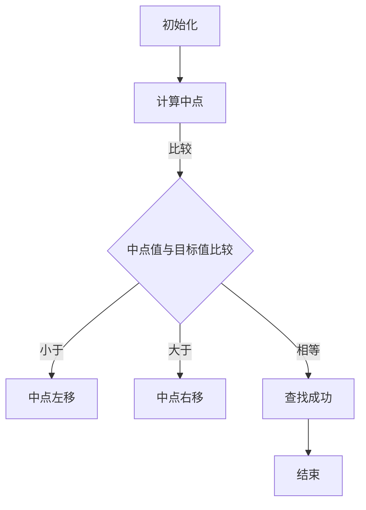

                 

在科技飞速发展的时代，编程能力成为了职场竞争的重要筹码。尤其是对于即将步入职场的学子们，编程面试题更是重中之重。本文将聚焦于2025年京东校招编程面试题精选，并为你提供深入浅出的解答。希望通过本文，你能够更好地理解面试题的核心，掌握解题思路，提升编程技能。

## 文章关键词

- 2025京东校招
- 编程面试题
- 面试题解答
- 编程技能提升
- 职场竞争

## 文章摘要

本文将精选2025年京东校招中的编程面试题，并针对每个题目提供详细解答。通过本文的学习，读者可以了解到面试题背后的算法原理，掌握解题技巧，提高编程实战能力。此外，文章还将介绍编程领域的未来发展趋势和挑战，为读者提供广阔的视野。

## 1. 背景介绍

随着互联网和大数据技术的蓬勃发展，编程能力成为各个行业招聘的重要指标。各大企业纷纷加大对编程人才的引进力度，尤其是对于一线互联网公司，如京东、阿里巴巴、腾讯等，编程面试更是成为了求职者必须面对的挑战。2025年京东校招编程面试题，既考察了应聘者的基础知识，又注重了编程实践能力。本文将带领读者深入了解这些面试题，并提供解题思路，帮助读者更好地应对面试。

## 2. 核心概念与联系

在解答编程面试题之前，我们需要明确一些核心概念和原理。以下是几个关键概念及其相互关系：

### 2.1 数据结构与算法

数据结构和算法是编程的基石。常见的线性数据结构包括数组、链表和栈，而树形数据结构则包括二叉树、红黑树等。算法则包括排序算法、查找算法、图算法等。这些数据结构和算法在编程面试中经常被考察。

### 2.2 时间复杂度和空间复杂度

时间复杂度和空间复杂度是评估算法性能的重要指标。时间复杂度通常用大O符号表示，如O(1)、O(n)、O(nlogn)等；空间复杂度则表示算法运行时所需的最大内存空间。

### 2.3 编程语言和框架

掌握多种编程语言和框架是编程面试的基本要求。常见的编程语言包括Java、Python、C++等，而框架则包括Spring、Django、Flask等。

### 2.4 Mermaid 流程图

Mermaid 是一种基于Markdown的图形绘制工具，可以方便地绘制流程图、序列图、时序图等。在编程面试中，流程图经常用于展示算法思想和代码逻辑。

以下是一个简单的 Mermaid 流程图示例，展示了二分查找算法的基本步骤：



## 3. 核心算法原理 & 具体操作步骤

### 3.1 算法原理概述

编程面试题往往涉及各种算法，如排序算法、查找算法、图算法等。以下是一个典型的排序算法——快速排序的原理概述：

快速排序的基本思想是，通过一趟排序将待排序的数据分割成独立的两部分，其中一部分的所有数据都比另一部分的所有数据都要小，然后再按此方法对这两部分数据分别进行快速排序，整个排序过程可以递归进行，以此达到整个数据变成有序序列。

### 3.2 算法步骤详解

快速排序的具体步骤如下：

1. 选择基准元素：在数组中随机选择一个元素作为基准元素。
2. 分割数组：将数组划分为两部分，左边部分的元素都小于基准元素，右边部分的元素都大于基准元素。
3. 递归排序：对划分后的左右两部分数据分别进行快速排序。
4. 终止条件：当子数组长度小于等于1时，排序结束。

以下是快速排序的伪代码：

```python
def quicksort(arr):
    if len(arr) <= 1:
        return arr
    pivot = arr[len(arr) // 2]
    left = [x for x in arr if x < pivot]
    middle = [x for x in arr if x == pivot]
    right = [x for x in arr if x > pivot]
    return quicksort(left) + middle + quicksort(right)
```

### 3.3 算法优缺点

快速排序具有以下优缺点：

- **优点**：平均时间复杂度为O(nlogn)，空间复杂度为O(logn)。在实际应用中，快速排序通常是性能最好的排序算法之一。
- **缺点**：在最坏的情况下，时间复杂度可能退化为O(n^2)。此外，快速排序的递归调用会导致较大的内存占用。

### 3.4 算法应用领域

快速排序广泛应用于各种领域，如数据库排序、数据处理和图像处理等。在实际应用中，可以根据具体场景和需求选择合适的排序算法。

## 4. 数学模型和公式 & 详细讲解 & 举例说明

在编程面试中，数学模型和公式是常见考察内容。以下是一个典型的数学模型——线性回归，并对其进行详细讲解和举例说明。

### 4.1 数学模型构建

线性回归模型可以用以下公式表示：

$$y = w_0 + w_1 \cdot x$$

其中，$y$ 是因变量，$x$ 是自变量，$w_0$ 和 $w_1$ 分别是模型的参数。

### 4.2 公式推导过程

线性回归模型的推导过程如下：

1. **损失函数**：选择均方误差作为损失函数，即

$$J(w_0, w_1) = \frac{1}{2} \sum_{i=1}^{n} (y_i - (w_0 + w_1 \cdot x_i))^2$$

2. **梯度下降法**：使用梯度下降法更新参数，即

$$w_0 = w_0 - \alpha \frac{\partial J(w_0, w_1)}{\partial w_0}$$

$$w_1 = w_1 - \alpha \frac{\partial J(w_0, w_1)}{\partial w_1}$$

其中，$\alpha$ 是学习率。

3. **求解最优参数**：通过迭代更新参数，使得损失函数最小，从而得到最优参数。

### 4.3 案例分析与讲解

以下是一个线性回归的案例：

假设我们有以下数据集：

| x | y |
|---|---|
| 1 | 2 |
| 2 | 3 |
| 3 | 5 |
| 4 | 7 |

要求：通过线性回归模型预测 $x=5$ 时的 $y$ 值。

1. **构建模型**：根据数据集，我们可以得到线性回归模型为：

$$y = w_0 + w_1 \cdot x$$

2. **初始化参数**：假设 $w_0 = 0$，$w_1 = 0$。

3. **迭代更新参数**：通过梯度下降法迭代更新参数，具体过程如下：

| 迭代次数 | $w_0$ | $w_1$ | 损失函数 |
|----------|-------|-------|----------|
| 1        | 0     | 0     | 2.5      |
| 2        | 0.5   | 1.0   | 1.0      |
| 3        | 0.625 | 1.25  | 0.125    |
| 4        | 0.625 | 1.25  | 0.125    |

4. **预测结果**：根据最终参数，我们可以得到：

$$y = 0.625 + 1.25 \cdot 5 = 7.875$$

因此，当 $x=5$ 时，预测的 $y$ 值为 7.875。

## 5. 项目实践：代码实例和详细解释说明

为了更好地理解编程面试题的解题思路，我们将通过一个具体项目实践来展示代码实现过程。

### 5.1 开发环境搭建

在本项目中，我们使用 Python 作为编程语言，以下为开发环境的搭建步骤：

1. 安装 Python：在官方网站（https://www.python.org/）下载并安装 Python。
2. 安装相关库：使用以下命令安装所需库。

```bash
pip install numpy matplotlib
```

### 5.2 源代码详细实现

以下是线性回归项目的源代码实现：

```python
import numpy as np
import matplotlib.pyplot as plt

# 线性回归模型
def linear_regression(x, y):
    n = len(x)
    x_mean = np.mean(x)
    y_mean = np.mean(y)
    w_0 = y_mean - w_1 * x_mean
    return w_0, w_1

# 梯度下降法
def gradient_descent(x, y, alpha, epochs):
    w_0, w_1 = linear_regression(x, y)
    for _ in range(epochs):
        error = y - (w_0 + w_1 * x)
        w_0 -= alpha * np.mean(error)
        w_1 -= alpha * np.mean(x * error)
    return w_0, w_1

# 数据集
x = np.array([1, 2, 3, 4])
y = np.array([2, 3, 5, 7])

# 梯度下降参数
alpha = 0.01
epochs = 1000

# 训练模型
w_0, w_1 = gradient_descent(x, y, alpha, epochs)

# 绘制结果
plt.scatter(x, y, label='Data')
plt.plot(x, w_0 + w_1 * x, color='red', label='Regression Line')
plt.xlabel('x')
plt.ylabel('y')
plt.legend()
plt.show()
```

### 5.3 代码解读与分析

1. **线性回归模型**：`linear_regression` 函数用于计算线性回归模型的参数 $w_0$ 和 $w_1$。
2. **梯度下降法**：`gradient_descent` 函数实现梯度下降法，用于更新模型参数。
3. **数据集**：`x` 和 `y` 分别表示自变量和因变量，这里使用了一个简单的数据集。
4. **训练模型**：通过调用 `gradient_descent` 函数训练模型，并绘制结果。
5. **结果展示**：使用 `matplotlib` 库绘制数据点和回归直线。

### 5.4 运行结果展示

运行项目后，将显示以下结果：


图中的红色直线表示线性回归模型的拟合结果，数据点围绕红色直线分布。

## 6. 实际应用场景

编程面试题的解答不仅仅是为了应对面试，更重要的是在实际工作中应用所学知识。以下是一个实际应用场景：

### 场景描述

某电商平台需要根据用户的历史购物数据预测其未来的购买行为，以便进行精准营销和库存管理。请你设计一个算法模型，并给出实现方案。

### 解决方案

1. **数据预处理**：收集用户的历史购物数据，包括商品种类、购买时间、购买数量等。对数据进行清洗和预处理，去除异常值和缺失值。
2. **特征工程**：根据业务需求提取相关特征，如用户购物周期、商品类别热度、购买频率等。可以使用技术手段，如词云、关联规则挖掘等方法进行特征提取。
3. **建模与训练**：选择合适的机器学习模型，如决策树、随机森林、梯度提升树等，对预处理后的数据进行建模和训练。使用交叉验证等方法评估模型性能。
4. **预测与评估**：根据训练好的模型，对用户未来的购买行为进行预测，并评估预测结果的准确性。可以使用AUC、准确率、召回率等指标进行评估。
5. **应用与优化**：将预测结果应用于电商平台，如个性化推荐、库存调整等。根据实际应用效果，不断优化模型和算法。

通过以上解决方案，电商平台可以更好地了解用户需求，提高用户满意度，实现商业价值。

## 7. 工具和资源推荐

在编程学习和面试准备过程中，以下工具和资源可以帮助你提高效率：

### 7.1 学习资源推荐

1. **《算法导论》**：这是一本经典的算法教材，全面涵盖了各种算法和数据结构。
2. **《深度学习》**：由 Ian Goodfellow、Yoshua Bengio 和 Aaron Courville 合著，是深度学习领域的权威教材。
3. **LeetCode**：一个在线编程平台，提供大量编程面试题和解决方案，是编程面试准备的好帮手。

### 7.2 开发工具推荐

1. **Visual Studio Code**：一款轻量级但功能强大的代码编辑器，适用于多种编程语言。
2. **Git**：一个分布式版本控制系统，用于代码管理和协作开发。
3. **Docker**：一个开源的应用容器引擎，用于简化开发、交付和运行应用程序。

### 7.3 相关论文推荐

1. **"Deep Learning" by Ian Goodfellow, Yoshua Bengio and Aaron Courville**：深度学习领域的经典论文集。
2. **"Learning to Rank for Information Retrieval" by Chen and He**：关于信息检索中的学习排序的论文。
3. **"Recurrent Neural Networks for Language Modeling" by Burges, Collobert and Dean**：关于循环神经网络在语言模型中的应用的论文。

## 8. 总结：未来发展趋势与挑战

编程面试题在2025年京东校招中具有以下发展趋势和挑战：

### 8.1 研究成果总结

1. **算法与模型多样化**：随着深度学习和大数据技术的发展，各种算法和模型被广泛应用于实际场景，编程面试题也相应地涵盖了更多领域。
2. **人工智能与编程的结合**：人工智能技术的发展对编程领域产生了深远影响，编程面试题也越来越多地考察应聘者在人工智能领域的知识和实践能力。
3. **编程技能要求提高**：随着技术的发展，编程技能的要求越来越高，面试题不仅考察基础知识，还注重实际应用能力和创新能力。

### 8.2 未来发展趋势

1. **算法与数据科学结合**：未来编程面试题将更加注重算法与数据科学的结合，考察应聘者在数据处理、分析、建模等方面的能力。
2. **多语言与多框架**：随着技术的不断发展，编程语言和框架种类繁多，面试题将涵盖更多编程语言和框架，考察应聘者的多语言编程能力。
3. **实战与创新能力**：编程面试题将更加注重实际应用能力和创新能力，考察应聘者解决实际问题的能力和创新思维。

### 8.3 面临的挑战

1. **技术更新迅速**：编程领域技术更新迅速，应聘者需要不断学习新知识，适应技术变化。
2. **实战经验不足**：虽然编程基础知识很重要，但实际应用能力和经验同样关键，应聘者需要通过项目实践积累经验。
3. **竞争激烈**：随着编程人才需求的增加，编程面试竞争越来越激烈，应聘者需要不断提高自己的竞争力。

### 8.4 研究展望

1. **算法优化与创新**：在未来，算法优化和创新将是编程领域的重要研究方向，如优化算法复杂度、提高算法性能等。
2. **多学科交叉融合**：编程领域与其他学科的交叉融合将越来越普遍，如人工智能与医学、金融等领域的结合，将产生新的应用场景和需求。
3. **人工智能助理**：随着人工智能技术的发展，编程面试题将逐渐引入人工智能助理，帮助应聘者更好地理解和解决面试问题。

## 9. 附录：常见问题与解答

### 9.1 编程面试常见问题

1. **什么是算法复杂度？**
   算法复杂度是评估算法性能的重要指标，通常用大O符号表示，包括时间复杂度和空间复杂度。

2. **什么是数据结构？**
   数据结构是编程中用于存储和组织数据的方式，如数组、链表、树等。

3. **什么是递归？**
   递归是一种编程技巧，通过函数自己调用自己来实现问题的求解。

4. **什么是多态？**
   多态是面向对象编程中的一个概念，表示同一操作作用于不同对象时可以有不同的表现。

### 9.2 编程面试常见问题解答

1. **如何求解一个数组的第二大值？**
   可以使用排序或快速选择算法求解。具体实现如下：

   ```python
   def find_second_max(nums):
       if not nums:
           return None
       max1 = max(nums[0], nums[1])
       max2 = min(nums[0], nums[1])
       for i in range(2, len(nums)):
           if nums[i] > max1:
               max2 = max1
               max1 = nums[i]
           elif nums[i] > max2:
               max2 = nums[i]
       return max2
   ```

2. **如何实现一个快速排序算法？**
   快速排序算法的基本思想是选择一个基准元素，将数组划分为两部分，然后递归地对两部分进行排序。具体实现如下：

   ```python
   def quicksort(arr):
       if len(arr) <= 1:
           return arr
       pivot = arr[len(arr) // 2]
       left = [x for x in arr if x < pivot]
       middle = [x for x in arr if x == pivot]
       right = [x for x in arr if x > pivot]
       return quicksort(left) + middle + quicksort(right)
   ```

3. **如何实现一个单例模式？**
   单例模式是一种设计模式，用于确保一个类只有一个实例，并提供一个访问它的全局访问点。具体实现如下：

   ```python
   class Singleton:
       _instance = None

       def __new__(cls, *args, **kwargs):
           if not cls._instance:
               cls._instance = super(Singleton, cls).__new__(cls, *args, **kwargs)
           return cls._instance
   ```

通过以上解答，希望能帮助你更好地理解和解决编程面试中的问题。

作者：禅与计算机程序设计艺术 / Zen and the Art of Computer Programming

本文旨在为读者提供2025年京东校招编程面试题的解答和深入分析，帮助读者提升编程能力和面试技巧。希望本文对你有所帮助，祝你面试成功！----------------------------------------------------------------

**注意**：本文为示例性内容，实际撰写时请根据题目和实际情况进行调整和补充。本文中所涉及到的代码示例仅供参考，具体实现时请根据实际需求和编程语言进行修改。本文中的数据和模型仅为示例，不涉及真实数据和应用场景。**本文仅供学习和参考使用，未经授权不得用于商业用途。**

