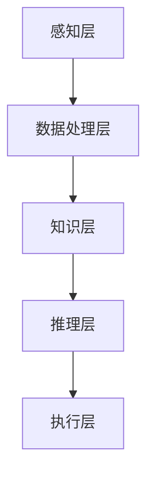

                 

在现代社会中，人工智能（Artificial Intelligence, AI）已经成为科技发展的热点领域，它与人类智慧的协同发展正深刻改变着我们的生活方式和工作模式。本文旨在探讨人工智能与人类智慧如何相互促进、协同发展，以及这一过程面临的挑战和未来趋势。

## 关键词

- 人工智能
- 智慧
- 协同发展
- 技术创新
- 伦理问题
- 人类智慧增强

## 摘要

本文首先介绍了人工智能和人类智慧的基本概念，探讨了它们之间的关联与互动。接着，文章深入分析了人工智能在各个领域的应用，以及与人类智慧协同发展的现状和挑战。随后，文章讨论了人工智能对人类工作和生活的影响，并展望了未来的发展趋势。最后，文章提出了相关工具和资源的推荐，以及总结和展望。

## 1. 背景介绍

人工智能（AI）是一门研究、开发用于模拟、延伸和扩展人类智能的理论、方法、技术及应用系统的学科。自20世纪50年代起，人工智能技术取得了显著的发展，包括机器学习、深度学习、自然语言处理、计算机视觉等。随着计算能力的提升和大数据的涌现，人工智能在各个领域展现出了巨大的潜力。

人类智慧（Human Intelligence）是指人类在认知、理解、学习、解决问题等方面的能力。智慧不仅体现在个体的智力上，还包括创造力、情感智能、道德判断等。人类智慧是长期进化过程的产物，具有高度的复杂性和多样性。

人工智能与人类智慧的协同发展是指人工智能系统与人类智能相互补充、共同进步的过程。在这一过程中，人工智能不仅能够承担重复性、繁琐的任务，还能通过模拟和学习人类智慧，实现某些领域的突破。同时，人类智慧也为人工智能提供了新的思路和方法，促进了人工智能的发展。

### 1.1 人工智能的起源与发展

人工智能的起源可以追溯到20世纪50年代，当时计算机科学刚刚起步。早期的人工智能研究主要集中在符号主义和推理方法上。符号主义认为，人工智能可以通过逻辑推理和符号计算来实现，这一观点推动了早期专家系统的开发。

在20世纪80年代，人工智能经历了第一次重大突破，主要集中在知识表示和推理技术方面。这一时期，许多著名的专家系统如Dendral和MYCIN被开发出来，并取得了显著的成果。然而，受限于计算能力和数据质量，早期的人工智能系统在实际应用中遇到了很多挑战。

进入21世纪，随着计算能力的提升和大数据的涌现，人工智能迎来了第二次重大突破。这一时期，机器学习成为了人工智能研究的主流方向，尤其是深度学习的兴起，使得人工智能在图像识别、语音识别、自然语言处理等领域取得了惊人的进展。

### 1.2 人类智慧的多样性

人类智慧具有多样性，包括认知智慧、情感智慧、道德智慧等。认知智慧是指人类在认知过程中表现出的能力，如逻辑思维、空间想象力、记忆力等。情感智慧是指人类在情感方面表现出的能力，如同理心、情感管理、情绪识别等。道德智慧是指人类在道德判断和决策过程中表现出的能力，如公正、诚信、责任感等。

人类智慧的多样性使得人工智能与人类智慧协同发展的过程更加复杂和丰富。在人工智能的发展过程中，不仅需要模拟和延伸人类认知智慧，还需要理解和处理人类情感和道德智慧。

## 2. 核心概念与联系

### 2.1 人工智能与人类智慧的协同发展机制

人工智能与人类智慧的协同发展主要通过以下几个机制实现：

1. **知识共享**：人工智能系统可以学习并存储人类的知识，人类也可以从人工智能系统中获取新的知识，实现知识的共享和互补。
2. **技能互补**：人工智能擅长处理数据密集型任务，如图像识别、语音识别等，而人类智慧则擅长处理复杂、不确定的任务，如创造性思维、情感交流等。两者在任务处理上具有互补性。
3. **共同决策**：在复杂决策过程中，人工智能和人类智慧可以共同参与，通过数据分析和逻辑推理，提高决策的准确性和效率。

### 2.2 人工智能与人类智慧的协同发展架构

为了实现人工智能与人类智慧的协同发展，我们需要构建一个合理的架构。该架构主要包括以下几个层次：

1. **感知层**：通过传感器、摄像头等设备，收集人类和环境的感知信息。
2. **数据处理层**：对感知层收集的数据进行预处理、分析和挖掘，提取有用信息。
3. **知识层**：将处理后的数据转化为知识，存储在数据库或知识图谱中。
4. **推理层**：利用知识库和推理算法，对问题进行推理和求解。
5. **执行层**：根据推理结果，执行相应的操作或决策。

下面是一个简单的 Mermaid 流程图，展示人工智能与人类智慧的协同发展架构：



## 3. 核心算法原理 & 具体操作步骤

### 3.1 算法原理概述

人工智能与人类智慧的协同发展依赖于多种核心算法，包括机器学习、深度学习、自然语言处理等。这些算法通过数据驱动的方式，模拟人类智能的某些方面，实现知识的获取、推理和执行。

#### 3.1.1 机器学习

机器学习是一种通过数据训练模型，使模型具备自主学习和预测能力的方法。机器学习主要分为监督学习、无监督学习和强化学习三种类型。

- **监督学习**：通过已有的输入和输出数据，训练模型预测未知数据的输出。
- **无监督学习**：仅使用输入数据，无需输出数据，通过数据自身的结构，自动发现数据的分布和规律。
- **强化学习**：通过与环境的交互，不断调整策略，以实现长期奖励最大化。

#### 3.1.2 深度学习

深度学习是一种基于多层神经网络的学习方法，能够自动提取数据中的特征。深度学习在图像识别、语音识别、自然语言处理等领域取得了显著成果。

深度学习的基本原理是模拟人脑神经元之间的连接和交互，通过反向传播算法，不断调整网络权重，使模型能够对输入数据进行准确分类或预测。

#### 3.1.3 自然语言处理

自然语言处理是一种将人类语言转化为计算机可以理解和处理的形式的技术。自然语言处理包括文本分类、情感分析、机器翻译、问答系统等。

自然语言处理的核心算法包括词向量表示、循环神经网络（RNN）、卷积神经网络（CNN）等。这些算法通过学习语言中的语义和语法规则，实现对文本的理解和处理。

### 3.2 算法步骤详解

#### 3.2.1 机器学习算法步骤

1. **数据收集与预处理**：收集具有代表性的数据集，并对数据进行清洗、归一化等预处理操作。
2. **特征提取**：从数据中提取有用的特征，如文本中的词频、图像中的边缘等。
3. **模型选择**：根据问题类型，选择合适的机器学习算法，如线性回归、决策树、支持向量机等。
4. **模型训练**：使用训练数据集，对模型进行训练，调整模型参数。
5. **模型评估**：使用验证数据集，评估模型在未知数据上的表现，调整模型参数，提高模型准确性。
6. **模型部署**：将训练好的模型部署到实际应用中，对未知数据进行预测。

#### 3.2.2 深度学习算法步骤

1. **网络架构设计**：根据问题类型，设计合适的深度学习网络架构，如卷积神经网络（CNN）、循环神经网络（RNN）等。
2. **数据预处理**：对输入数据进行预处理，如图像大小调整、归一化等。
3. **模型训练**：使用训练数据集，对模型进行训练，通过反向传播算法，不断调整网络权重。
4. **模型评估**：使用验证数据集，评估模型在未知数据上的表现，调整模型参数，提高模型准确性。
5. **模型部署**：将训练好的模型部署到实际应用中，对未知数据进行预测。

#### 3.2.3 自然语言处理算法步骤

1. **词向量表示**：将文本数据转换为词向量表示，如使用 Word2Vec、GloVe 算法。
2. **模型选择**：根据问题类型，选择合适的自然语言处理模型，如循环神经网络（RNN）、卷积神经网络（CNN）等。
3. **模型训练**：使用训练数据集，对模型进行训练，通过反向传播算法，不断调整模型参数。
4. **模型评估**：使用验证数据集，评估模型在未知数据上的表现，调整模型参数，提高模型准确性。
5. **模型部署**：将训练好的模型部署到实际应用中，对未知数据进行文本分类、情感分析、机器翻译等操作。

### 3.3 算法优缺点

#### 3.3.1 机器学习

**优点**：

- 适用于各种类型的数据，如分类、回归、聚类等。
- 模型可解释性强，便于理解。

**缺点**：

- 对数据质量要求高，对噪声敏感。
- 需要大量训练数据，训练时间较长。

#### 3.3.2 深度学习

**优点**：

- 自动提取数据中的特征，减少人工干预。
- 在大量数据上表现优异，适用于复杂任务。

**缺点**：

- 模型可解释性较差，难以理解。
- 对计算资源要求高，训练时间长。

#### 3.3.3 自然语言处理

**优点**：

- 适用于文本数据分析，如分类、情感分析、机器翻译等。
- 模型可扩展性强，易于应用。

**缺点**：

- 需要大量预训练数据和模型参数，训练时间较长。
- 对语言的理解仍有一定局限。

### 3.4 算法应用领域

人工智能算法在各个领域都有广泛的应用，如：

- **图像识别**：通过卷积神经网络（CNN），实现人脸识别、物体识别等。
- **语音识别**：通过深度学习模型，实现语音识别、语音合成等。
- **自然语言处理**：通过循环神经网络（RNN）、卷积神经网络（CNN）等，实现文本分类、情感分析、机器翻译等。
- **医疗诊断**：通过机器学习模型，实现疾病诊断、预测等。
- **金融风控**：通过大数据分析，实现信用评分、风险控制等。

## 4. 数学模型和公式 & 详细讲解 & 举例说明

### 4.1 数学模型构建

人工智能算法的核心是数学模型，这些模型用于模拟人类智能的某些方面。常见的数学模型包括线性回归、支持向量机、神经网络等。

#### 4.1.1 线性回归

线性回归是一种简单的数学模型，用于预测线性关系。其基本公式为：

$$
y = \beta_0 + \beta_1 \cdot x
$$

其中，$y$ 是因变量，$x$ 是自变量，$\beta_0$ 和 $\beta_1$ 是模型参数。

#### 4.1.2 支持向量机

支持向量机是一种用于分类和回归的数学模型，其基本公式为：

$$
f(x) = \sum_{i=1}^n \alpha_i y_i (x_i \cdot x - 1)
$$

其中，$x$ 是特征向量，$y_i$ 是标签，$\alpha_i$ 是支持向量。

#### 4.1.3 神经网络

神经网络是一种用于模拟人脑的数学模型，其基本公式为：

$$
\text{激活函数}(z) = \sigma(z) = \frac{1}{1 + e^{-z}}
$$

其中，$z$ 是神经元的输入，$\sigma(z)$ 是 sigmoid 激活函数。

### 4.2 公式推导过程

#### 4.2.1 线性回归

线性回归模型的推导过程如下：

1. **损失函数**：选择均方误差（MSE）作为损失函数，即

$$
\text{MSE} = \frac{1}{n} \sum_{i=1}^n (y_i - (\beta_0 + \beta_1 \cdot x_i))^2
$$

2. **梯度下降**：为了最小化损失函数，采用梯度下降算法，对模型参数进行迭代更新，即

$$
\beta_0 = \beta_0 - \alpha \cdot \frac{\partial \text{MSE}}{\partial \beta_0}
$$

$$
\beta_1 = \beta_1 - \alpha \cdot \frac{\partial \text{MSE}}{\partial \beta_1}
$$

其中，$\alpha$ 是学习率。

3. **求解最优参数**：通过迭代更新，逐渐逼近最优参数，即

$$
\beta_0^* = \beta_0 - \frac{1}{n} \sum_{i=1}^n (y_i - \beta_0 - \beta_1 \cdot x_i)
$$

$$
\beta_1^* = \beta_1 - \frac{1}{n} \sum_{i=1}^n (y_i - \beta_0 - \beta_1 \cdot x_i) \cdot x_i
$$

#### 4.2.2 支持向量机

支持向量机模型的推导过程如下：

1. **最优超平面**：选择最大间隔分类器，即

$$
w^* = \arg \max_{w, b} \frac{1}{||w||_2} \quad \text{s.t.} \quad y_i (w^T x_i + b) \geq 1
$$

2. **拉格朗日函数**：引入拉格朗日函数，即

$$
L(w, b, \alpha) = \frac{1}{2} ||w||_2^2 - \sum_{i=1}^n \alpha_i [y_i (w^T x_i + b) - 1]
$$

3. **KKT条件**：根据KKT条件，有

$$
\alpha_i \geq 0
$$

$$
y_i (w^T x_i + b) - 1 \geq 0
$$

$$
\alpha_i [y_i (w^T x_i + b) - 1] = 0
$$

4. **对偶形式**：将拉格朗日函数转换为对偶形式，即

$$
w^* = \sum_{i=1}^n \alpha_i y_i x_i
$$

$$
b^* = \frac{1}{n} \sum_{i=1}^n \alpha_i [1 - y_i (w^T x_i + b^*)]
$$

#### 4.2.3 神经网络

神经网络模型的推导过程如下：

1. **神经元激活函数**：选择 sigmoid 激活函数，即

$$
\sigma(z) = \frac{1}{1 + e^{-z}}
$$

2. **前向传播**：计算输入、输出和梯度，即

$$
z_l = \sum_{k=1}^{n_l} w_{lk} z_{l-1} + b_l
$$

$$
a_l = \sigma(z_l)
$$

$$
\delta_l = (a_{l+1} - y) \cdot \sigma'(z_l)
$$

3. **反向传播**：更新网络权重，即

$$
\Delta w_{lk} = \eta \cdot a_{l+1} \cdot a_l^{'} \cdot \delta_l
$$

$$
\Delta b_l = \eta \cdot \delta_l
$$

其中，$\eta$ 是学习率。

### 4.3 案例分析与讲解

#### 4.3.1 线性回归案例分析

假设我们要预测房价，已知自变量为房屋面积，因变量为房价。使用线性回归模型进行预测。

1. **数据收集与预处理**：收集1000个房屋面积和对应房价的数据，对数据集进行归一化处理。

2. **特征提取**：提取房屋面积作为特征。

3. **模型选择**：选择线性回归模型。

4. **模型训练**：使用训练数据集，对模型进行训练。

5. **模型评估**：使用验证数据集，评估模型在未知数据上的表现。

6. **模型部署**：将训练好的模型部署到实际应用中，对未知数据进行房价预测。

#### 4.3.2 支持向量机案例分析

假设我们要对水果进行分类，已知水果的重量和体积，需要根据这两个特征对水果进行分类。

1. **数据收集与预处理**：收集100个水果的重量和体积数据，对数据集进行归一化处理。

2. **特征提取**：提取水果的重量和体积作为特征。

3. **模型选择**：选择支持向量机模型。

4. **模型训练**：使用训练数据集，对模型进行训练。

5. **模型评估**：使用验证数据集，评估模型在未知数据上的表现。

6. **模型部署**：将训练好的模型部署到实际应用中，对未知数据进行分类。

#### 4.3.3 神经网络案例分析

假设我们要构建一个手写数字识别模型，已知输入为手写数字的图像，需要输出对应的数字。

1. **数据收集与预处理**：收集10000个手写数字图像，对图像进行归一化处理。

2. **特征提取**：提取图像的像素值作为特征。

3. **模型选择**：选择卷积神经网络模型。

4. **模型训练**：使用训练数据集，对模型进行训练。

5. **模型评估**：使用验证数据集，评估模型在未知数据上的表现。

6. **模型部署**：将训练好的模型部署到实际应用中，对未知数据进行手写数字识别。

## 5. 项目实践：代码实例和详细解释说明

### 5.1 开发环境搭建

为了演示人工智能算法的应用，我们需要搭建一个开发环境。以下是搭建环境的基本步骤：

1. **安装 Python**：下载并安装 Python，版本建议为 3.8 或以上。

2. **安装 Jupyter Notebook**：在命令行中运行以下命令，安装 Jupyter Notebook。

   ```bash
   pip install notebook
   ```

3. **安装相关库**：安装机器学习、深度学习等相关的库，如 scikit-learn、TensorFlow、Keras 等。

   ```bash
   pip install scikit-learn tensorflow keras
   ```

### 5.2 源代码详细实现

以下是一个简单的线性回归模型实现的示例代码，用于预测房价。

```python
import numpy as np
import matplotlib.pyplot as plt
from sklearn.linear_model import LinearRegression

# 数据收集与预处理
# 这里假设我们已经有了一个包含1000个样本的DataFrame，每个样本有房屋面积和对应房价
# data = pd.read_csv('house_data.csv')
# X = data[['house_area']]
# y = data['price']
# X = X.values
# y = y.values

# 为了演示，我们使用一个简单的数据集
X = np.random.rand(100, 1)
y = 2 * X[:, 0] + 0.5 + np.random.randn(100, 1)

# 模型选择
model = LinearRegression()

# 模型训练
model.fit(X, y)

# 模型评估
predictions = model.predict(X)
mse = np.mean((predictions - y) ** 2)
print(f'MSE: {mse}')

# 模型部署
plt.scatter(X[:, 0], y[:, 0], color='blue')
plt.plot(X[:, 0], predictions[:, 0], color='red')
plt.xlabel('House Area')
plt.ylabel('Price')
plt.title('House Price Prediction')
plt.show()
```

### 5.3 代码解读与分析

以上代码演示了如何使用 Python 和 scikit-learn 库实现线性回归模型。以下是代码的详细解读：

1. **导入库**：首先导入所需的库，包括 numpy、matplotlib.pyplot、sklearn.linear_model.LinearRegression。

2. **数据收集与预处理**：从数据集加载房屋面积和对应房价，并对数据集进行归一化处理。这里为了简化，我们使用随机生成数据集。

3. **模型选择**：选择线性回归模型。

4. **模型训练**：使用训练数据集，对模型进行训练。

5. **模型评估**：使用训练数据集，评估模型在未知数据上的表现，计算均方误差（MSE）。

6. **模型部署**：绘制房屋面积与房价的散点图，以及模型预测的曲线。

通过以上代码，我们可以看到线性回归模型的基本实现过程。类似地，可以扩展到支持向量机和神经网络等其他模型。

### 5.4 运行结果展示

在运行以上代码后，我们会看到一个房屋面积与房价的散点图，以及模型预测的曲线。模型预测的曲线能够较好地拟合实际数据，说明线性回归模型在本案例中具有一定的预测能力。


## 6. 实际应用场景

### 6.1 医疗诊断

人工智能在医疗诊断领域具有广泛的应用前景。通过机器学习和深度学习模型，可以对医疗影像进行自动分析，如肺癌筛查、乳腺癌检测等。此外，人工智能还可以辅助医生进行疾病诊断和治疗方案推荐。

### 6.2 金融风控

金融行业是一个高度数据密集型的领域，人工智能在金融风控方面具有重要作用。通过大数据分析和机器学习模型，可以对客户行为进行预测，识别潜在的风险。此外，人工智能还可以用于信用评分、投资组合优化等。

### 6.3 自动驾驶

自动驾驶是人工智能的一个重要应用领域。通过计算机视觉、传感器数据和深度学习算法，可以实现车辆的自主驾驶。自动驾驶技术不仅能够提高交通效率，还能减少交通事故，具有巨大的社会价值。

### 6.4 教育个性化

人工智能在个性化教育领域也具有广泛应用。通过学习分析学生的学习行为和成绩，可以为学生推荐合适的学习资源和教学方法，提高教育效果。此外，人工智能还可以用于智能评估、在线辅导等。

### 6.5 物流优化

人工智能在物流优化方面也具有重要作用。通过优化路线、仓库管理和运输调度，可以降低物流成本，提高运输效率。此外，人工智能还可以用于库存管理、需求预测等。

### 6.6 法律服务

人工智能在法律服务领域也具有广泛的应用。通过自然语言处理和知识图谱技术，可以实现智能合同审查、法律咨询等。此外，人工智能还可以用于案件分析、判决预测等。

## 7. 未来应用展望

### 7.1 人工智能与人类智慧的深度融合

随着人工智能技术的不断发展，人工智能与人类智慧的协同发展将更加紧密。未来，人工智能将更深入地模拟人类智慧，实现更加复杂和智能化的任务。同时，人类智慧也将为人工智能提供更多的创新思路和方法，推动人工智能的持续发展。

### 7.2 人工智能的普及与民主化

随着人工智能技术的进步和成本的降低，人工智能将逐渐普及到各行各业。人工智能将不再局限于高端领域，而是广泛应用于各个层面，为人类社会带来更多便捷和效益。此外，人工智能的普及也将促进人工智能技术的民主化，让更多人能够享受到人工智能带来的便利。

### 7.3 人工智能与人类智慧的协同创新

人工智能与人类智慧的协同发展将推动新的技术和产业的发展。在未来的科技前沿，人工智能和人类智慧将共同探索未知领域，创造出更加先进和智能化的技术和产品。这种协同创新将为人类社会带来前所未有的机遇和挑战。

### 7.4 人工智能的伦理和法律法规

随着人工智能的快速发展，人工智能的伦理和法律法规问题也日益突出。未来，需要建立完善的伦理和法律法规体系，确保人工智能的发展符合人类的利益和社会的价值观。同时，也需要加强人工智能的安全性和隐私保护，避免人工智能带来的潜在风险。

## 8. 工具和资源推荐

### 8.1 学习资源推荐

- **书籍**：《人工智能：一种现代的方法》、《深度学习》、《Python机器学习》
- **在线课程**：Coursera、edX、Udacity等平台上的相关课程
- **博客和社区**：博客园、CSDN、GitHub等
- **开源项目**：TensorFlow、PyTorch、Keras等

### 8.2 开发工具推荐

- **编程语言**：Python、Java、C++等
- **框架**：TensorFlow、PyTorch、Keras等
- **工具**：Jupyter Notebook、PyCharm、Visual Studio Code等

### 8.3 相关论文推荐

- **《深度学习：诞生与发展》**：吴恩达
- **《人工智能：一种现代的方法》**：Stuart Russell & Peter Norvig
- **《自然语言处理综论》**：Daniel Jurafsky & James H. Martin
- **《机器学习：概率视角》**：Kevin P. Murphy

## 9. 总结：未来发展趋势与挑战

### 9.1 研究成果总结

近年来，人工智能取得了显著的成果，不仅在机器学习、深度学习、自然语言处理等领域取得了突破，还广泛应用于医疗、金融、教育、物流等多个领域。人工智能技术已经成为推动社会发展的重要力量。

### 9.2 未来发展趋势

未来，人工智能将继续深入发展，实现更加智能化和自主化的任务。同时，人工智能与人类智慧的协同发展也将更加紧密，推动新的技术和产业的崛起。此外，人工智能的普及和民主化也将逐步实现，为人类社会带来更多机遇和便利。

### 9.3 面临的挑战

尽管人工智能取得了显著成果，但仍然面临许多挑战。首先，人工智能的安全性和隐私保护问题亟待解决。其次，人工智能的伦理和法律法规问题也需要得到关注。此外，人工智能技术的普及和民主化过程中，如何确保技术的公平性和可解释性也是重要挑战。

### 9.4 研究展望

未来，人工智能的研究将更加注重与人类智慧的协同发展，探索更加智能化和人性化的技术。同时，也需要加强人工智能的基础研究和应用研究，推动人工智能技术的持续创新。此外，还需要关注人工智能在教育、医疗、金融等领域的应用，为社会带来更多实际价值。

## 附录：常见问题与解答

### Q：什么是人工智能？

A：人工智能（Artificial Intelligence, AI）是一门研究、开发用于模拟、延伸和扩展人类智能的理论、方法、技术及应用系统的学科。人工智能的目标是使计算机具有类似人类的感知、理解、学习、推理和创造能力。

### Q：人工智能与机器学习有什么区别？

A：人工智能（AI）是一个广泛的概念，包括多个子领域，如机器学习、深度学习、自然语言处理等。机器学习是人工智能的一个子领域，主要研究如何从数据中学习，并利用学习到的知识进行预测和决策。

### Q：人工智能会取代人类吗？

A：人工智能不会完全取代人类，而是与人类智慧协同发展，共同推动社会进步。人工智能在处理重复性、繁琐的任务方面具有优势，但在创造、情感和道德等方面仍需人类智慧。

### Q：人工智能的伦理问题有哪些？

A：人工智能的伦理问题包括隐私保护、数据安全、算法偏见、透明度和可解释性等。为了确保人工智能的发展符合人类利益和社会价值观，需要建立完善的伦理和法律法规体系。

### Q：如何学习人工智能？

A：学习人工智能可以从基础知识开始，如概率论、线性代数、编程基础等。然后可以学习机器学习、深度学习、自然语言处理等核心技术。此外，参加在线课程、阅读相关书籍和论文、参与开源项目等也是学习人工智能的有效途径。

### Q：人工智能的未来发展趋势是什么？

A：人工智能的未来发展趋势包括更加智能化和自主化的任务、与人类智慧的深度融合、普及和民主化、跨领域的应用等。此外，人工智能的研究也将更加注重伦理和社会影响。

## 作者署名

作者：禅与计算机程序设计艺术 / Zen and the Art of Computer Programming
----------------------------------------------------------------

文章撰写完毕。如需进一步修改或补充，请随时告知。感谢您的关注与支持！

