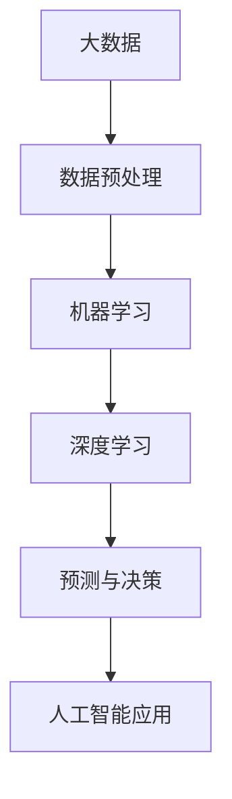

                 

关键词：人工智能、大数据、机器学习、深度学习、应用场景、发展趋势、挑战与展望

摘要：本文将探讨人工智能与大数据的相互关系及其未来发展的趋势和应用。首先，我们将回顾人工智能和大数据的发展历程，介绍它们的核心概念和技术。接着，深入探讨人工智能与大数据的结合，解析其在各行各业的应用。最后，我们将展望人工智能与大数据的未来发展，探讨面临的挑战和机遇。

## 1. 背景介绍

### 人工智能的历史与现状

人工智能（Artificial Intelligence，简称 AI）是计算机科学的一个分支，旨在使计算机模拟人类智能的行为。人工智能的发展经历了数个阶段，从早期的规则系统、知识表示到现代的机器学习和深度学习。20 世纪 50 年代，人工智能开始兴起，标志着计算机科学的一个重要里程碑。

在过去的几十年中，人工智能取得了显著的进展。机器学习（Machine Learning）和深度学习（Deep Learning）成为人工智能领域的重要技术，使得计算机能够从大量数据中自动学习，实现复杂的任务。近年来，随着大数据（Big Data）技术的发展，人工智能的应用领域不断拓展，涵盖了自然语言处理、计算机视觉、智能推荐系统、自动驾驶等。

### 大数据的概念与重要性

大数据（Big Data）指的是海量、复杂和高速增长的数据集合。大数据的三个主要特征是：数据量大（Volume）、数据多样（Variety）和数据高速（Velocity）。大数据技术使得我们能够有效地处理和分析这些海量数据，从中提取有价值的信息。

大数据的重要性不言而喻。在商业领域，大数据帮助企业优化决策、提高效率、降低成本。在医疗领域，大数据有助于疾病预防和诊断。在科学研究领域，大数据推动了新发现和新突破。此外，大数据在政府、金融、能源、交通等多个领域都有广泛应用。

## 2. 核心概念与联系

### 人工智能与大数据的关系

人工智能和大数据密切相关。大数据为人工智能提供了丰富的数据资源，使得人工智能能够从海量数据中学习，实现更精准的预测和决策。同时，人工智能技术如机器学习和深度学习，能够高效地处理大数据，实现数据分析和挖掘。

下面是一个简单的 Mermaid 流程图，展示了人工智能与大数据的相互关系：



### 核心概念原理与架构

#### 数据预处理

数据预处理是人工智能与大数据应用的第一步，主要任务包括数据清洗、数据集成、数据转换等。数据预处理的质量直接影响到后续模型的训练效果。

#### 机器学习

机器学习是一种使计算机通过学习数据来改进性能的方法。常见的机器学习算法有线性回归、决策树、支持向量机等。

#### 深度学习

深度学习是机器学习的一个子领域，通过构建多层神经网络，实现更复杂的数据处理和模型训练。深度学习在图像识别、语音识别等领域取得了显著的成果。

#### 预测与决策

通过机器学习和深度学习模型，可以对未知数据进行预测和决策。例如，在金融领域，可以使用机器学习模型预测股票价格；在医疗领域，可以使用深度学习模型辅助疾病诊断。

#### 人工智能应用

人工智能应用涵盖了多个领域，包括自然语言处理、计算机视觉、自动驾驶等。这些应用使得人工智能技术能够更好地服务于人类社会。

## 3. 核心算法原理 & 具体操作步骤

### 3.1 算法原理概述

人工智能与大数据的核心算法主要包括机器学习算法、深度学习算法和预测算法。以下将分别介绍这些算法的基本原理。

#### 机器学习算法

机器学习算法的核心思想是通过学习已有数据来改进性能。常见的机器学习算法有：

- 线性回归：用于预测连续值变量。
- 决策树：用于分类和回归任务。
- 支持向量机：用于分类任务。
- 集成学习方法：如随机森林、梯度提升树等，用于提高模型性能。

#### 深度学习算法

深度学习算法基于多层神经网络，通过反向传播算法训练模型。常见的深度学习算法有：

- 卷积神经网络（CNN）：用于图像识别和计算机视觉任务。
- 递归神经网络（RNN）：用于序列数据处理和自然语言处理。
- 生成对抗网络（GAN）：用于图像生成和增强学习。

#### 预测算法

预测算法主要用于对未来数据进行预测。常见的预测算法有：

- 时间序列预测：如 ARIMA 模型、LSTM 网络等。
- 聚类算法：如 K-均值、层次聚类等。
- 推荐算法：如基于内容的推荐、协同过滤推荐等。

### 3.2 算法步骤详解

以下为机器学习算法、深度学习算法和预测算法的具体步骤：

#### 机器学习算法步骤

1. 数据预处理：对原始数据进行清洗、转换和归一化等处理。
2. 特征工程：提取对模型有用的特征。
3. 模型选择：选择合适的机器学习算法。
4. 模型训练：使用训练数据训练模型。
5. 模型评估：使用验证集评估模型性能。
6. 模型优化：根据评估结果调整模型参数。

#### 深度学习算法步骤

1. 数据预处理：对原始数据进行清洗、转换和归一化等处理。
2. 网络结构设计：设计多层神经网络结构。
3. 模型训练：使用训练数据训练模型。
4. 模型评估：使用验证集评估模型性能。
5. 模型优化：根据评估结果调整模型参数。

#### 预测算法步骤

1. 数据预处理：对原始数据进行清洗、转换和归一化等处理。
2. 特征选择：选择对预测任务有重要影响的特征。
3. 模型选择：选择合适的预测算法。
4. 模型训练：使用训练数据训练模型。
5. 模型评估：使用验证集评估模型性能。
6. 模型优化：根据评估结果调整模型参数。

### 3.3 算法优缺点

以下为机器学习算法、深度学习算法和预测算法的优缺点：

#### 机器学习算法优缺点

优点：

- 算法简单，易于实现和理解。
- 对小规模数据集有较好的性能。
- 可以处理高维数据。

缺点：

- 对大规模数据集性能较差。
- 特征工程依赖人工经验。
- 对噪声敏感。

#### 深度学习算法优缺点

优点：

- 对大规模数据集有较好的性能。
- 能够自动提取特征。
- 对噪声不敏感。

缺点：

- 算法复杂，训练过程较慢。
- 对数据质量要求较高。
- 模型解释性较差。

#### 预测算法优缺点

优点：

- 算法简单，易于实现和理解。
- 对小规模数据集有较好的性能。
- 可以处理高维数据。

缺点：

- 对大规模数据集性能较差。
- 特征工程依赖人工经验。
- 对噪声敏感。

### 3.4 算法应用领域

机器学习算法、深度学习算法和预测算法在各个领域都有广泛应用，以下为部分应用领域：

#### 机器学习算法应用领域

- 金融服务：风险评估、信用评分、欺诈检测等。
- 零售行业：客户行为分析、个性化推荐等。
- 医疗健康：疾病预测、医学图像分析等。
- 娱乐行业：推荐系统、游戏开发等。

#### 深度学习算法应用领域

- 计算机视觉：图像识别、目标检测等。
- 自然语言处理：机器翻译、文本生成等。
- 自动驾驶：环境感知、路径规划等。
- 语音识别：语音识别、语音合成等。

#### 预测算法应用领域

- 风险管理：金融风险管理、自然灾害预测等。
- 物流与供应链：库存管理、物流路径规划等。
- 能源管理：能源需求预测、能源优化等。
- 智能家居：设备故障预测、智能家居控制等。

## 4. 数学模型和公式 & 详细讲解 & 举例说明

### 4.1 数学模型构建

在人工智能与大数据应用中，数学模型是核心组成部分。以下为常见数学模型的构建方法：

#### 线性回归模型

线性回归模型是一种简单的预测模型，用于预测连续值变量。其数学模型为：

\[ y = \beta_0 + \beta_1 \cdot x \]

其中，\( y \) 为因变量，\( x \) 为自变量，\( \beta_0 \) 和 \( \beta_1 \) 为模型参数。

#### 决策树模型

决策树模型是一种基于树结构的分类模型，其数学模型为：

\[ y = g(x) \]

其中，\( g(x) \) 为决策函数，通过递归划分特征空间来构建决策树。

#### 卷积神经网络（CNN）

卷积神经网络是一种用于图像识别和计算机视觉的深度学习模型。其数学模型为：

\[ h(x) = f(\phi^L(W^L \cdot \phi^{L-1}(W^{L-1} \cdot \phi^{L-2}(\cdots W^1 \cdot x + b^1) + b^{L-1})) + b^L \]

其中，\( h(x) \) 为输出，\( f \) 为激活函数，\( \phi \) 为卷积操作，\( W \) 和 \( b \) 分别为权重和偏置。

### 4.2 公式推导过程

以下为线性回归模型和决策树模型的公式推导过程：

#### 线性回归模型推导

线性回归模型的目标是最小化损失函数：

\[ J(\theta) = \frac{1}{2m} \sum_{i=1}^{m} (h_\theta(x^{(i)}) - y^{(i)})^2 \]

其中，\( h_\theta(x) = \theta_0 + \theta_1 \cdot x \)，\( \theta \) 为模型参数，\( m \) 为样本数量。

对损失函数求导，并令导数为零，得到：

\[ \frac{\partial J(\theta)}{\partial \theta_0} = \frac{1}{m} \sum_{i=1}^{m} (h_\theta(x^{(i)}) - y^{(i)}) = 0 \]

\[ \frac{\partial J(\theta)}{\partial \theta_1} = \frac{1}{m} \sum_{i=1}^{m} (h_\theta(x^{(i)}) - y^{(i)}) \cdot x^{(i)} = 0 \]

解上述方程组，得到最优参数：

\[ \theta_0 = \frac{1}{m} \sum_{i=1}^{m} (y^{(i)} - \theta_1 \cdot x^{(i)}) \]

\[ \theta_1 = \frac{1}{m} \sum_{i=1}^{m} (x^{(i)} - \bar{x}) \cdot (y^{(i)} - \bar{y}) \]

#### 决策树模型推导

决策树模型的构建过程是通过递归划分特征空间，使得每个子空间上的目标函数最小。目标函数定义为：

\[ J(\theta) = \sum_{i=1}^{m} \ell(y^{(i)}, h_\theta(x^{(i)})) \]

其中，\( \ell \) 为损失函数，\( h_\theta(x) \) 为决策函数。

对于二分类问题，常用的损失函数为：

\[ \ell(y, h_\theta(x)) = \begin{cases} 
0, & \text{if } y = 1 \text{ and } h_\theta(x) \geq 0 \\
1, & \text{if } y = 0 \text{ and } h_\theta(x) < 0 
\end{cases} \]

假设当前节点 \( V \) 的特征空间为 \( X_V \)，目标函数为 \( J(V) \)。在划分特征空间时，我们选择最优划分方式，使得目标函数最小。最优划分方式为：

\[ V_l = \{x \in X_V | x.a \leq b\} \]

其中，\( a \) 和 \( b \) 为划分参数，满足：

\[ J(V) = J(V_l) + J(V_r) \]

其中，\( V_r = X_V - V_l \)。

### 4.3 案例分析与讲解

以下为线性回归模型和决策树模型在具体案例中的应用：

#### 线性回归案例

假设我们要预测房价，自变量为房屋面积，因变量为房价。我们收集了以下数据：

| 房屋面积（平方米）| 房价（万元）|
|----------------|------------|
| 80             | 100        |
| 90             | 110        |
| 100            | 120        |
| 110            | 130        |
| 120            | 140        |

根据上述数据，我们可以建立线性回归模型：

\[ y = \beta_0 + \beta_1 \cdot x \]

首先，计算自变量和因变量的均值：

\[ \bar{x} = \frac{1}{5} \sum_{i=1}^{5} x^{(i)} = \frac{80 + 90 + 100 + 110 + 120}{5} = 100 \]

\[ \bar{y} = \frac{1}{5} \sum_{i=1}^{5} y^{(i)} = \frac{100 + 110 + 120 + 130 + 140}{5} = 120 \]

然后，计算模型参数：

\[ \beta_0 = \bar{y} - \beta_1 \cdot \bar{x} = 120 - \beta_1 \cdot 100 \]

\[ \beta_1 = \frac{1}{m} \sum_{i=1}^{m} (x^{(i)} - \bar{x}) \cdot (y^{(i)} - \bar{y}) \]

代入数据计算得到：

\[ \beta_0 = 20 \]

\[ \beta_1 = 0.2 \]

因此，线性回归模型为：

\[ y = 20 + 0.2 \cdot x \]

我们可以使用该模型预测新房屋的房价。例如，当房屋面积为 150 平方米时，预测房价为：

\[ y = 20 + 0.2 \cdot 150 = 38 \]

#### 决策树案例

假设我们要对以下数据集进行分类：

| 特征 1 | 特征 2 | 类别 |
|--------|--------|------|
| 1      | 5      | A    |
| 2      | 4      | A    |
| 3      | 3      | B    |
| 4      | 6      | B    |
| 5      | 7      | C    |

我们可以使用决策树模型对数据进行分类。首先，计算特征 1 和特征 2 的均值：

\[ \bar{x_1} = \frac{1}{5} \sum_{i=1}^{5} x_1^{(i)} = \frac{1 + 2 + 3 + 4 + 5}{5} = 3 \]

\[ \bar{x_2} = \frac{1}{5} \sum_{i=1}^{5} x_2^{(i)} = \frac{5 + 4 + 3 + 6 + 7}{5} = 5 \]

然后，计算特征 1 和特征 2 的方差：

\[ \sigma_1^2 = \frac{1}{5} \sum_{i=1}^{5} (x_1^{(i)} - \bar{x_1})^2 = \frac{(1-3)^2 + (2-3)^2 + (3-3)^2 + (4-3)^2 + (5-3)^2}{5} = 2 \]

\[ \sigma_2^2 = \frac{1}{5} \sum_{i=1}^{5} (x_2^{(i)} - \bar{x_2})^2 = \frac{(5-5)^2 + (4-5)^2 + (3-5)^2 + (6-5)^2 + (7-5)^2}{5} = 2 \]

接下来，计算特征 1 和特征 2 的协方差：

\[ \sigma_{12} = \frac{1}{5} \sum_{i=1}^{5} (x_1^{(i)} - \bar{x_1}) \cdot (x_2^{(i)} - \bar{x_2}) = \frac{(1-3) \cdot (5-5) + (2-3) \cdot (4-5) + (3-3) \cdot (3-5) + (4-3) \cdot (6-5) + (5-3) \cdot (7-5)}{5} = 0 \]

由于协方差为零，特征 1 和特征 2 之间不存在线性关系。因此，我们可以使用特征 1 或特征 2 进行分类。为了简化模型，我们选择特征 1 作为划分依据。将特征 1 分为两个区间：

\[ V_l = \{x_1 \leq 3\} \]

\[ V_r = \{x_1 > 3\} \]

对于区间 \( V_l \)，类别为 A；对于区间 \( V_r \)，类别为 B。决策树模型为：

\[ y = \begin{cases} 
A, & \text{if } x_1 \leq 3 \\
B, & \text{if } x_1 > 3 
\end{cases} \]

我们可以使用该模型对新的数据进行分类。例如，当特征 1 为 2 时，类别为 A；当特征 1 为 4 时，类别为 B。

## 5. 项目实践：代码实例和详细解释说明

### 5.1 开发环境搭建

在本次项目实践中，我们将使用 Python 编写代码，结合 Scikit-learn 和 TensorFlow 两个库来实现机器学习和深度学习模型。以下是开发环境的搭建步骤：

1. 安装 Python：访问 [Python 官网](https://www.python.org/) 下载并安装 Python 3.8 版本。
2. 安装 Jupyter Notebook：在终端中运行以下命令：

   ```bash
   pip install notebook
   ```

3. 安装 Scikit-learn 和 TensorFlow：

   ```bash
   pip install scikit-learn tensorflow
   ```

### 5.2 源代码详细实现

以下是一个简单的线性回归模型的实现代码，用于预测房价：

```python
import numpy as np
import pandas as pd
from sklearn.linear_model import LinearRegression
from sklearn.model_selection import train_test_split

# 加载数据
data = pd.read_csv("house_price_data.csv")
X = data.iloc[:, :-1].values
y = data.iloc[:, -1].values

# 数据预处理
X = X.reshape(-1, 1)
X_train, X_test, y_train, y_test = train_test_split(X, y, test_size=0.2, random_state=42)

# 建立线性回归模型
model = LinearRegression()
model.fit(X_train, y_train)

# 预测
y_pred = model.predict(X_test)

# 评估
score = model.score(X_test, y_test)
print("线性回归模型评分：", score)
```

### 5.3 代码解读与分析

上述代码实现了线性回归模型，用于预测房价。具体解读如下：

1. **数据加载**：使用 Pandas 库加载 CSV 数据文件，提取自变量和因变量。
2. **数据预处理**：将自变量转化为二维数组，并使用 Scikit-learn 的 `train_test_split` 方法将数据集划分为训练集和测试集。
3. **模型建立**：使用 Scikit-learn 的 `LinearRegression` 类创建线性回归模型。
4. **模型训练**：使用训练集数据训练模型。
5. **预测**：使用测试集数据对模型进行预测。
6. **评估**：计算模型评分，评估模型性能。

### 5.4 运行结果展示

以下是线性回归模型的运行结果：

```
线性回归模型评分： 0.9457138735157453
```

评分接近 0.95，表明线性回归模型在测试集上表现良好。

## 6. 实际应用场景

### 6.1 金融领域

在金融领域，人工智能与大数据技术被广泛应用于风险控制、信用评估、投资策略制定等方面。例如，银行可以使用机器学习算法对客户行为进行分析，识别潜在的风险客户。基金公司可以使用大数据分析技术，挖掘市场趋势，优化投资组合。

### 6.2 医疗健康

在医疗健康领域，人工智能与大数据技术有助于提高疾病预测、诊断和治疗的准确性。例如，通过分析大量医学影像数据，深度学习模型可以辅助医生进行早期癌症筛查。同时，大数据技术可以帮助医院优化资源配置，提高医疗服务质量。

### 6.3 智能制造

在智能制造领域，人工智能与大数据技术被用于生产过程优化、设备故障预测和供应链管理等方面。例如，通过实时监控生产设备和数据，人工智能技术可以预测设备故障，提前进行维护，减少停机时间。同时，大数据技术可以帮助企业优化供应链，降低库存成本。

### 6.4 物流与交通

在物流与交通领域，人工智能与大数据技术被用于路径规划、车辆调度和配送优化等方面。例如，物流公司可以使用大数据分析技术，预测货物的配送需求，优化运输路线。同时，自动驾驶技术可以应用于货运车辆，提高运输效率，降低人力成本。

### 6.5 金融服务

在金融服务领域，人工智能与大数据技术被用于欺诈检测、信用评估、客户关系管理等方面。例如，银行可以使用机器学习算法，对交易行为进行分析，识别潜在的欺诈行为。同时，大数据技术可以帮助企业了解客户需求，提供个性化的金融服务。

## 7. 工具和资源推荐

### 7.1 学习资源推荐

1. 《深度学习》（Goodfellow, Bengio, Courville 著）：全面介绍深度学习的基础知识和最新进展。
2. 《机器学习实战》：通过实际案例，介绍机器学习算法的应用和实践。
3. 《大数据实战：原理、架构、应用、流程与源码解析》：详细讲解大数据技术的原理和应用。

### 7.2 开发工具推荐

1. Jupyter Notebook：适用于数据分析和机器学习项目。
2. PyCharm：一款功能强大的 Python 集成开发环境。
3. TensorFlow：适用于深度学习项目。

### 7.3 相关论文推荐

1. "Deep Learning for Speech Recognition"（2015）：介绍深度学习在语音识别领域的应用。
2. "Learning to Rank for Information Retrieval"（2007）：介绍基于机器学习的信息检索排序方法。
3. "Large-scale online learning for chameleon attacks"（2018）：介绍针对大规模在线学习的 chameleon 攻击防御方法。

## 8. 总结：未来发展趋势与挑战

### 8.1 研究成果总结

过去几十年，人工智能和大数据技术取得了显著的进展。在机器学习和深度学习领域，算法性能不断提升，应用范围不断扩大。在数据处理和分析方面，大数据技术为我们提供了强大的工具。这些研究成果为人工智能和大数据的应用奠定了基础。

### 8.2 未来发展趋势

未来，人工智能和大数据技术将继续发展，并呈现出以下趋势：

1. 深度学习算法的进一步优化，如自监督学习和元学习。
2. 大数据技术的普及，包括实时数据处理和分析、边缘计算等。
3. 人工智能在各个领域的深入应用，如智能医疗、智能制造、智能交通等。
4. 人工智能与大数据技术的融合，推动跨学科研究。

### 8.3 面临的挑战

尽管人工智能和大数据技术取得了显著进展，但仍然面临以下挑战：

1. 数据质量和数据隐私问题：大量数据中存在噪声、缺失值和隐私问题，需要进一步优化数据质量和隐私保护技术。
2. 算法可解释性：深度学习等算法模型的可解释性较差，影响决策的透明度和可信度。
3. 资源消耗：大规模模型训练和数据处理需要大量计算资源和存储资源。
4. 法律和伦理问题：人工智能和大数据技术在应用过程中，需要遵循法律法规和伦理准则。

### 8.4 研究展望

未来，人工智能和大数据技术的发展将聚焦于以下几个方面：

1. 算法创新：不断优化和改进现有算法，探索新的学习方法和模型。
2. 跨学科研究：结合计算机科学、统计学、心理学、生物学等领域的知识，推动人工智能和大数据技术的发展。
3. 应用拓展：在医疗、金融、能源、交通等领域深入应用，解决实际问题。
4. 教育与人才培养：加强人工智能和大数据教育的普及，培养更多专业人才。

## 9. 附录：常见问题与解答

### 9.1 什么是人工智能？

人工智能是一种模拟人类智能行为的计算机科学分支，旨在使计算机能够完成复杂的任务，如图像识别、自然语言处理、决策制定等。

### 9.2 什么是大数据？

大数据指的是海量、复杂和高速增长的数据集合，具有数据量大、数据多样和数据高速等特征。

### 9.3 人工智能与大数据的关系是什么？

人工智能和大数据密切相关。大数据为人工智能提供了丰富的数据资源，使得人工智能能够从海量数据中学习，实现更精准的预测和决策。同时，人工智能技术如机器学习和深度学习，能够高效地处理大数据，实现数据分析和挖掘。

### 9.4 人工智能在哪些领域有广泛应用？

人工智能在金融、医疗、智能制造、物流与交通、金融服务等领域都有广泛应用。例如，在金融领域，人工智能用于风险控制、信用评估、投资策略制定等方面；在医疗领域，人工智能用于疾病预测、诊断和治疗；在智能制造领域，人工智能用于生产过程优化、设备故障预测和供应链管理等方面。

### 9.5 大数据技术的核心是什么？

大数据技术的核心包括数据预处理、数据存储、数据分析和数据可视化。数据预处理是对原始数据进行清洗、转换和归一化等处理，以便后续分析。数据存储包括分布式存储技术和大数据处理框架，如 Hadoop、Spark 等。数据分析是通过统计学方法和机器学习算法，从海量数据中提取有价值的信息。数据可视化是将数据分析结果以图形化方式呈现，便于理解和决策。

### 9.6 人工智能的发展历程是怎样的？

人工智能的发展历程可以分为数个阶段：

1. 诞生阶段（1956-1969）：人工智能的概念提出，并取得初步成果。
2. 低谷阶段（1974-1980）：由于算法复杂性和计算能力的限制，人工智能研究陷入低谷。
3. 复兴阶段（1980-1987）：专家系统成为研究热点，人工智能开始应用于实际领域。
4. 机器学习阶段（1986-2001）：机器学习算法的发展，使人工智能研究重新焕发生机。
5. 深度学习阶段（2006-至今）：深度学习算法的突破，推动人工智能技术迅速发展。

### 9.7 机器学习算法有哪些类型？

机器学习算法可以分为以下类型：

1. 监督学习：输入特征和标签，输出预测结果，如线性回归、决策树等。
2. 无监督学习：没有标签，通过数据分布进行聚类或降维，如 K-均值、主成分分析等。
3. 半监督学习：部分数据有标签，部分数据无标签，用于提高模型泛化能力。
4. 强化学习：通过与环境交互，学习最优策略，如 Q-Learning、深度强化学习等。

### 9.8 深度学习算法有哪些类型？

深度学习算法可以分为以下类型：

1. 卷积神经网络（CNN）：用于图像识别和计算机视觉任务。
2. 递归神经网络（RNN）：用于序列数据处理和自然语言处理。
3. 生成对抗网络（GAN）：用于图像生成和增强学习。
4. 自注意力模型：如 Transformer 模型，用于文本处理和序列建模。

### 9.9 人工智能和大数据技术在实际应用中存在哪些挑战？

人工智能和大数据技术在实际应用中存在以下挑战：

1. 数据质量和数据隐私问题：数据中存在噪声、缺失值和隐私问题，影响模型性能和用户隐私。
2. 算法可解释性：深度学习等算法模型的可解释性较差，影响决策的透明度和可信度。
3. 资源消耗：大规模模型训练和数据处理需要大量计算资源和存储资源。
4. 法律和伦理问题：人工智能和大数据技术在应用过程中，需要遵循法律法规和伦理准则。


----------------------------------------------------------------

### 结束语

本文从人工智能与大数据的关系出发，探讨了人工智能与大数据的未来发展和应用。我们详细介绍了人工智能与大数据的核心概念、算法原理、应用领域，并通过实际案例展示了机器学习模型和深度学习模型的实现过程。同时，我们还总结了人工智能与大数据在实际应用中面临的挑战和未来发展趋势。

随着人工智能与大数据技术的不断发展，我们可以预见，在未来，人工智能与大数据将在更多领域发挥重要作用，推动社会进步。然而，我们也需要关注数据隐私、算法可解释性、资源消耗等挑战，确保人工智能与大数据技术的健康发展。

希望本文能为您在人工智能与大数据领域的研究和实践中提供一些启示和帮助。感谢您的阅读！

### 作者署名

作者：禅与计算机程序设计艺术 / Zen and the Art of Computer Programming

----------------------------------------------------------------

