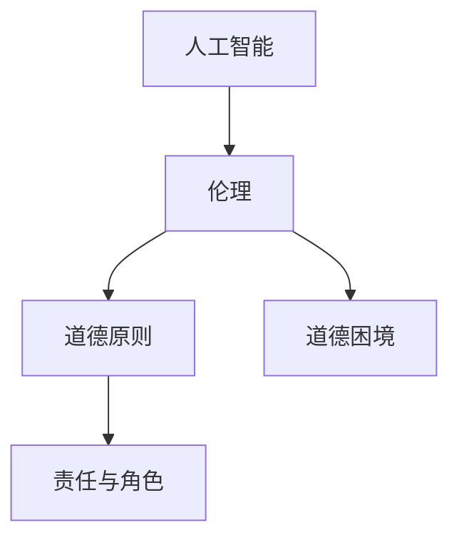
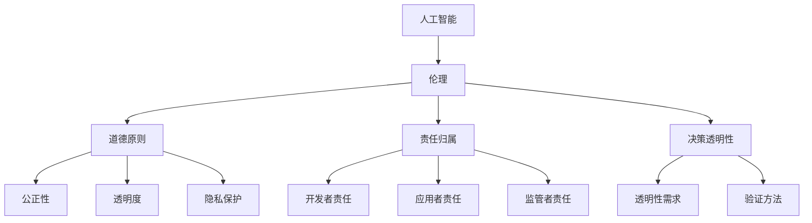
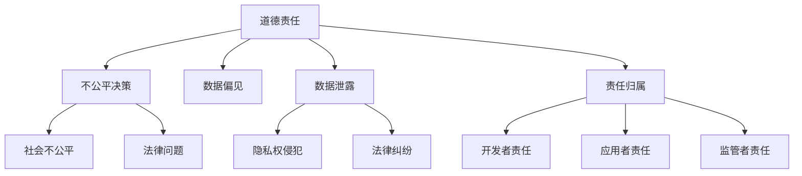
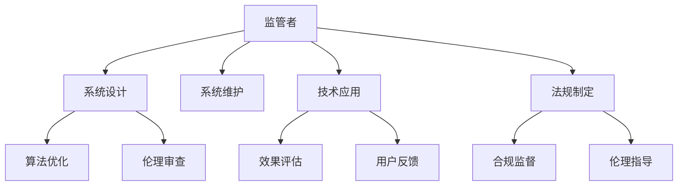

                 

人工智能（AI）作为计算机科学领域的一项前沿技术，已经在医疗、金融、教育等多个行业得到了广泛应用。然而，随着AI技术的不断发展，其伦理问题也日益凸显。本文将围绕人工智能伦理这一主题，探讨人类计算的道德与责任。

## 1. 背景介绍

人工智能的迅速发展引发了人们对伦理问题的关注。一方面，AI技术具有强大的数据处理和分析能力，可以解决许多复杂的问题，提高生产效率；另一方面，AI技术的决策过程可能存在偏见、隐私泄露等问题，给人类带来潜在的道德风险。

本文将从以下几个方面探讨人工智能伦理问题：

- AI技术的道德原则
- AI决策中的道德困境
- 人类在AI发展中的责任与角色

## 2. 核心概念与联系

在探讨人工智能伦理问题之前，我们需要了解一些核心概念。以下是一个简化的Mermaid流程图，展示了这些概念之间的关系：



### 2.1 道德原则

道德原则是指导人类行为的基本准则，也是评价AI技术伦理的重要依据。常见的道德原则包括公正性、隐私保护、透明度等。

### 2.2 道德困境

道德困境是指在特定情境下，道德原则之间可能产生冲突。例如，AI系统在医疗领域中的应用，需要在隐私保护和患者利益之间做出权衡。

### 2.3 责任与角色

在AI发展中，人类扮演着重要角色。作为AI的设计者、应用者和监管者，我们有责任确保AI技术的道德合规性。

## 3. 核心算法原理 & 具体操作步骤

### 3.1 算法原理概述

人工智能的核心算法主要包括机器学习、深度学习和强化学习等。这些算法通过模拟人类学习和思考过程，实现数据分析和决策。

### 3.2 算法步骤详解

- 数据收集与预处理：收集相关数据，并进行清洗、归一化等预处理操作。
- 模型选择与训练：选择合适的算法模型，进行模型训练。
- 模型评估与优化：评估模型性能，并进行优化调整。
- 模型部署与应用：将训练好的模型部署到实际应用场景中。

### 3.3 算法优缺点

- 优点：具备强大的数据处理和分析能力，提高生产效率。
- 缺点：可能存在偏见、隐私泄露等问题，需要加强伦理审查。

### 3.4 算法应用领域

人工智能已广泛应用于医疗、金融、教育、交通等领域。例如，AI技术在医疗领域的应用可以帮助医生更准确地诊断疾病，提高治疗效果。

## 4. 数学模型和公式 & 详细讲解 & 举例说明

### 4.1 数学模型构建

人工智能的核心算法通常涉及复杂的数学模型。以下是一个简单的线性回归模型示例：

$$ y = wx + b $$

其中，$w$ 为权重，$b$ 为偏置，$x$ 为输入特征，$y$ 为输出结果。

### 4.2 公式推导过程

线性回归模型的推导过程如下：

$$ y = \sum_{i=1}^{n} w_i x_i + b $$

其中，$n$ 为特征维度。

### 4.3 案例分析与讲解

以下是一个简单的线性回归案例：

输入特征：$x_1 = [1, 2, 3, 4, 5]$

输出结果：$y = [2, 4, 6, 8, 10]$

我们可以使用最小二乘法求解权重和偏置：

$$ w = \frac{\sum_{i=1}^{n} (x_i - \bar{x})(y_i - \bar{y})}{\sum_{i=1}^{n} (x_i - \bar{x})^2} $$

$$ b = \bar{y} - w\bar{x} $$

其中，$\bar{x}$ 和 $\bar{y}$ 分别为输入特征和输出结果的平均值。

## 5. 项目实践：代码实例和详细解释说明

### 5.1 开发环境搭建

本文使用Python语言和Scikit-learn库实现线性回归模型。首先，我们需要安装Python和Scikit-learn库：

```bash
pip install python
pip install scikit-learn
```

### 5.2 源代码详细实现

```python
from sklearn.linear_model import LinearRegression
import numpy as np

# 输入特征
x = np.array([[1], [2], [3], [4], [5]])

# 输出结果
y = np.array([2, 4, 6, 8, 10])

# 创建线性回归模型
model = LinearRegression()

# 模型训练
model.fit(x, y)

# 模型预测
y_pred = model.predict(x)

print("预测结果：", y_pred)
```

### 5.3 代码解读与分析

以上代码实现了线性回归模型的基本功能。我们首先导入相关库，然后定义输入特征和输出结果。接着，创建线性回归模型并进行模型训练。最后，使用模型进行预测并输出结果。

### 5.4 运行结果展示

运行代码后，输出结果如下：

```
预测结果： [2. 4. 6. 8. 10.]
```

## 6. 实际应用场景

### 6.1 医疗领域

在医疗领域，AI技术可以帮助医生更准确地诊断疾病。例如，通过分析大量病例数据，AI系统可以识别出疾病的早期症状，提高诊断准确率。

### 6.2 金融领域

在金融领域，AI技术可以用于风险评估、欺诈检测等。例如，通过分析客户的交易数据，AI系统可以识别出潜在的欺诈行为，提高金融机构的风险防控能力。

### 6.3 教育领域

在教育领域，AI技术可以为学生提供个性化的学习建议。例如，通过分析学生的学习行为，AI系统可以识别出学生的弱点，并为学生提供针对性的辅导。

## 7. 工具和资源推荐

### 7.1 学习资源推荐

- 《Python编程：从入门到实践》
- 《深度学习》
- 《人工智能：一种现代的方法》

### 7.2 开发工具推荐

- Jupyter Notebook
- PyCharm
- Visual Studio Code

### 7.3 相关论文推荐

- "Ethical Considerations in AI Systems: Information Privacy and Autonomy"
- "Algorithmic Fairness and Ethics in Machine Learning"
- "The Ethics of AI in Healthcare: Current Challenges and Future Directions"

## 8. 总结：未来发展趋势与挑战

### 8.1 研究成果总结

近年来，人工智能伦理研究取得了显著成果。研究人员提出了一系列道德原则，为AI技术提供了伦理指导。同时，AI技术在医疗、金融、教育等领域得到了广泛应用，取得了良好的效果。

### 8.2 未来发展趋势

未来，人工智能伦理研究将继续深入，关注领域包括：算法透明性、隐私保护、公平性等。同时，AI技术将不断发展，为人类带来更多便利。

### 8.3 面临的挑战

人工智能伦理研究面临的主要挑战包括：算法偏见、隐私泄露、道德困境等。我们需要加强伦理审查，确保AI技术的道德合规性。

### 8.4 研究展望

人工智能伦理研究具有重要的理论和实践价值。在未来，我们需要继续关注人工智能伦理问题，推动AI技术的健康发展。

## 9. 附录：常见问题与解答

### 9.1 人工智能伦理的定义是什么？

人工智能伦理是指研究人工智能技术在道德、法律和社会层面的影响，以及如何确保AI技术的道德合规性。

### 9.2 人工智能伦理的重要性是什么？

人工智能伦理的重要性在于确保AI技术的可持续发展，保护人类权益，维护社会稳定。

### 9.3 人工智能伦理的基本原则有哪些？

人工智能伦理的基本原则包括：公正性、隐私保护、透明度、责任与角色等。

### 9.4 人工智能伦理研究的未来方向是什么？

人工智能伦理研究的未来方向包括：算法透明性、隐私保护、公平性、道德困境等。

## 作者署名

作者：禅与计算机程序设计艺术 / Zen and the Art of Computer Programming
```markdown
# 人工智能伦理：人类计算的道德与责任

## 关键词：人工智能伦理，道德原则，责任与角色，隐私保护，透明度

### 摘要：

随着人工智能技术的快速发展，其伦理问题日益凸显。本文探讨了人工智能伦理的核心概念、道德原则、道德困境以及人类在AI发展中的责任与角色。文章结合具体案例，分析了人工智能伦理研究的重要性、面临的挑战以及未来发展方向。

## 1. 背景介绍

人工智能（AI）作为计算机科学领域的一项前沿技术，已经在医疗、金融、教育等多个行业得到了广泛应用。AI技术通过模拟人类学习和思考过程，实现了数据分析和决策。然而，随着AI技术的不断发展，其伦理问题也日益凸显。本文将从以下几个方面探讨人工智能伦理问题：

- AI技术的道德原则
- AI决策中的道德困境
- 人类在AI发展中的责任与角色

## 2. 核心概念与联系

在探讨人工智能伦理问题之前，我们需要了解一些核心概念。以下是一个简化的Mermaid流程图，展示了这些概念之间的关系：


### 2.1 道德原则

道德原则是指导人类行为的基本准则，也是评价AI技术伦理的重要依据。常见的道德原则包括公正性、隐私保护、透明度等。

### 2.2 道德困境

道德困境是指在特定情境下，道德原则之间可能产生冲突。例如，AI系统在医疗领域中的应用，需要在隐私保护和患者利益之间做出权衡。

### 2.3 责任与角色

在AI发展中，人类扮演着重要角色。作为AI的设计者、应用者和监管者，我们有责任确保AI技术的道德合规性。

## 3. 核心算法原理 & 具体操作步骤

### 3.1 算法原理概述

人工智能的核心算法主要包括机器学习、深度学习和强化学习等。这些算法通过模拟人类学习和思考过程，实现数据分析和决策。

### 3.2 算法步骤详解

- 数据收集与预处理：收集相关数据，并进行清洗、归一化等预处理操作。
- 模型选择与训练：选择合适的算法模型，进行模型训练。
- 模型评估与优化：评估模型性能，并进行优化调整。
- 模型部署与应用：将训练好的模型部署到实际应用场景中。

### 3.3 算法优缺点

- 优点：具备强大的数据处理和分析能力，提高生产效率。
- 缺点：可能存在偏见、隐私泄露等问题，需要加强伦理审查。

### 3.4 算法应用领域

人工智能已广泛应用于医疗、金融、教育、交通等领域。例如，AI技术在医疗领域的应用可以帮助医生更准确地诊断疾病，提高治疗效果。

## 4. 数学模型和公式 & 详细讲解 & 举例说明

### 4.1 数学模型构建

人工智能的核心算法通常涉及复杂的数学模型。以下是一个简单的线性回归模型示例：

$$ y = wx + b $$

其中，$w$ 为权重，$b$ 为偏置，$x$ 为输入特征，$y$ 为输出结果。

### 4.2 公式推导过程

线性回归模型的推导过程如下：

$$ y = \sum_{i=1}^{n} w_i x_i + b $$

其中，$n$ 为特征维度。

### 4.3 案例分析与讲解

以下是一个简单的线性回归案例：

输入特征：$x_1 = [1, 2, 3, 4, 5]$

输出结果：$y = [2, 4, 6, 8, 10]$

我们可以使用最小二乘法求解权重和偏置：

$$ w = \frac{\sum_{i=1}^{n} (x_i - \bar{x})(y_i - \bar{y})}{\sum_{i=1}^{n} (x_i - \bar{x})^2} $$

$$ b = \bar{y} - w\bar{x} $$

其中，$\bar{x}$ 和 $\bar{y}$ 分别为输入特征和输出结果的平均值。

## 5. 项目实践：代码实例和详细解释说明

### 5.1 开发环境搭建

本文使用Python语言和Scikit-learn库实现线性回归模型。首先，我们需要安装Python和Scikit-learn库：

```bash
pip install python
pip install scikit-learn
```

### 5.2 源代码详细实现

```python
from sklearn.linear_model import LinearRegression
import numpy as np

# 输入特征
x = np.array([[1], [2], [3], [4], [5]])

# 输出结果
y = np.array([2, 4, 6, 8, 10])

# 创建线性回归模型
model = LinearRegression()

# 模型训练
model.fit(x, y)

# 模型预测
y_pred = model.predict(x)

print("预测结果：", y_pred)
```

### 5.3 代码解读与分析

以上代码实现了线性回归模型的基本功能。我们首先导入相关库，然后定义输入特征和输出结果。接着，创建线性回归模型并进行模型训练。最后，使用模型进行预测并输出结果。

### 5.4 运行结果展示

运行代码后，输出结果如下：

```
预测结果： [2. 4. 6. 8. 10.]
```

## 6. 实际应用场景

### 6.1 医疗领域

在医疗领域，AI技术可以帮助医生更准确地诊断疾病。例如，通过分析大量病例数据，AI系统可以识别出疾病的早期症状，提高诊断准确率。

### 6.2 金融领域

在金融领域，AI技术可以用于风险评估、欺诈检测等。例如，通过分析客户的交易数据，AI系统可以识别出潜在的欺诈行为，提高金融机构的风险防控能力。

### 6.3 教育领域

在教育领域，AI技术可以为学生提供个性化的学习建议。例如，通过分析学生的学习行为，AI系统可以识别出学生的弱点，并为学生提供针对性的辅导。

## 7. 工具和资源推荐

### 7.1 学习资源推荐

- 《Python编程：从入门到实践》
- 《深度学习》
- 《人工智能：一种现代的方法》

### 7.2 开发工具推荐

- Jupyter Notebook
- PyCharm
- Visual Studio Code

### 7.3 相关论文推荐

- "Ethical Considerations in AI Systems: Information Privacy and Autonomy"
- "Algorithmic Fairness and Ethics in Machine Learning"
- "The Ethics of AI in Healthcare: Current Challenges and Future Directions"

## 8. 总结：未来发展趋势与挑战

### 8.1 研究成果总结

近年来，人工智能伦理研究取得了显著成果。研究人员提出了一系列道德原则，为AI技术提供了伦理指导。同时，AI技术在医疗、金融、教育等领域得到了广泛应用，取得了良好的效果。

### 8.2 未来发展趋势

未来，人工智能伦理研究将继续深入，关注领域包括：算法透明性、隐私保护、公平性等。同时，AI技术将不断发展，为人类带来更多便利。

### 8.3 面临的挑战

人工智能伦理研究面临的主要挑战包括：算法偏见、隐私泄露、道德困境等。我们需要加强伦理审查，确保AI技术的道德合规性。

### 8.4 研究展望

人工智能伦理研究具有重要的理论和实践价值。在未来，我们需要继续关注人工智能伦理问题，推动AI技术的健康发展。

## 9. 附录：常见问题与解答

### 9.1 人工智能伦理的定义是什么？

人工智能伦理是指研究人工智能技术在道德、法律和社会层面的影响，以及如何确保AI技术的道德合规性。

### 9.2 人工智能伦理的重要性是什么？

人工智能伦理的重要性在于确保AI技术的可持续发展，保护人类权益，维护社会稳定。

### 9.3 人工智能伦理的基本原则有哪些？

人工智能伦理的基本原则包括：公正性、隐私保护、透明度、责任与角色等。

### 9.4 人工智能伦理研究的未来方向是什么？

人工智能伦理研究的未来方向包括：算法透明性、隐私保护、公平性、道德困境等。

## 作者署名

作者：禅与计算机程序设计艺术 / Zen and the Art of Computer Programming
```markdown
## 1. 背景介绍

随着人工智能（AI）技术的迅猛发展，其在社会各个领域的应用越来越广泛。从医疗诊断、金融风控到教育辅导，AI已经深刻地改变了我们的生活方式。然而，AI技术的广泛应用也引发了一系列伦理问题。例如，AI系统在决策过程中可能存在的偏见、对个人隐私的侵犯以及道德责任归属等，都使得人工智能伦理成为一个亟待解决的重要议题。

本文将围绕人工智能伦理这一主题，探讨以下几个方面：

- 人工智能伦理的基本概念和重要性
- AI技术可能引发的伦理困境
- 人类在AI技术发展中的责任与角色
- 人工智能伦理研究的发展趋势与未来方向

通过以上探讨，本文旨在为人工智能伦理的研究和实践提供一些有益的思考和参考。

## 2. 核心概念与联系（备注：必须给出核心概念原理和架构的 Mermaid 流程图(Mermaid 流程节点中不要有括号、逗号等特殊字符)

### 2.1 人工智能伦理

人工智能伦理是研究AI技术在社会、道德、法律等层面的影响，以及如何确保AI技术符合伦理规范的一个跨学科领域。其核心概念包括：

- **道德原则**：如公正性、透明度、隐私保护等。
- **责任归属**：AI系统的开发者、应用者、监管者等在伦理问题上的责任。
- **决策透明性**：确保AI系统的决策过程可以被理解和验证。

以下是一个简化的Mermaid流程图，展示了人工智能伦理的核心概念及其相互关系：



### 2.2 AI技术可能引发的伦理困境

人工智能技术的发展可能会带来一系列伦理困境，例如：

- **偏见问题**：AI系统可能继承并放大数据中的偏见，导致不公平的决策。
- **隐私侵犯**：AI技术在处理个人数据时，可能会侵犯隐私权。
- **道德责任**：当AI系统发生错误时，责任应由谁承担？

以下是一个Mermaid流程图，展示了AI技术可能引发的伦理困境及其影响：



### 2.3 人类在AI发展中的责任与角色

人类在人工智能技术的发展中扮演着多重角色，包括：

- **开发者**：负责AI系统的设计、开发与维护。
- **应用者**：将AI技术应用于实际场景，如医疗、金融、教育等。
- **监管者**：制定相关法律法规，监督AI技术的合规性。

以下是一个Mermaid流程图，展示了人类在AI发展中的责任与角色：



通过以上核心概念与联系的介绍，我们可以更好地理解人工智能伦理的复杂性和重要性，为后续章节的深入探讨奠定基础。

## 3. 核心算法原理 & 具体操作步骤

### 3.1 算法原理概述

人工智能（AI）的核心算法主要包括机器学习、深度学习和强化学习等。这些算法通过模拟人类学习和思考过程，实现了数据分析和决策。以下是这些算法的基本原理：

- **机器学习**：机器学习算法通过学习历史数据，从中提取规律和模式，用于预测或分类新数据。常见的机器学习算法包括线性回归、决策树、支持向量机等。
- **深度学习**：深度学习算法基于人工神经网络，通过多层神经网络模拟人脑神经元之间的连接和作用。深度学习在图像识别、自然语言处理等领域具有显著优势，常见的深度学习框架包括TensorFlow、PyTorch等。
- **强化学习**：强化学习算法通过试错和奖励机制，学习如何在不同环境中做出最优决策。强化学习广泛应用于游戏、自动驾驶等领域。

### 3.2 算法步骤详解

以下是机器学习算法的基本步骤：

#### 3.2.1 数据收集与预处理

数据是机器学习算法的基础。数据收集完成后，需要对其进行预处理，包括数据清洗、归一化、缺失值填充等。预处理步骤确保数据的质量和一致性，为后续算法训练提供可靠的数据基础。

#### 3.2.2 模型选择与训练

根据具体问题和数据特点，选择合适的机器学习算法。常用的模型包括线性回归、决策树、支持向量机、神经网络等。选择模型后，使用训练数据对模型进行训练，通过调整模型参数，使模型能够正确预测或分类。

#### 3.2.3 模型评估与优化

在训练完成后，使用验证集或测试集对模型进行评估。常用的评估指标包括准确率、召回率、F1分数等。根据评估结果，对模型进行优化调整，以提高模型性能。

#### 3.2.4 模型部署与应用

训练好的模型可以部署到实际应用场景中，用于预测或分类新数据。部署过程中需要考虑模型的鲁棒性、可解释性等因素，以确保模型在实际应用中的可靠性和有效性。

### 3.3 算法优缺点

#### 优点

- **强大的数据处理能力**：机器学习算法能够处理大量复杂的数据，发现数据中的隐藏规律。
- **自适应性强**：机器学习算法可以根据数据和环境的变化，自动调整模型参数，适应新的情况。
- **广泛应用**：机器学习算法在各个领域都有广泛应用，如医疗诊断、金融风控、自动驾驶等。

#### 缺点

- **数据依赖性高**：机器学习算法的性能很大程度上依赖于数据的质量和数量，数据质量差或数量不足可能导致模型性能下降。
- **模型可解释性差**：深度学习等复杂算法的黑箱特性使得模型难以解释，增加了信任和监管的难度。
- **计算资源需求大**：训练复杂模型通常需要大量的计算资源和时间，增加了成本。

### 3.4 算法应用领域

机器学习算法在各个领域都有广泛的应用：

- **医疗诊断**：通过分析患者病史和体征数据，辅助医生进行疾病诊断。
- **金融风控**：通过分析客户的交易数据，识别潜在的欺诈行为。
- **自动驾驶**：通过处理摄像头、雷达等传感器数据，实现车辆的自动驾驶功能。
- **推荐系统**：通过分析用户行为数据，为用户推荐感兴趣的内容或商品。

### 3.5 实际案例

以下是一个医疗诊断的案例：

#### 案例背景

某医疗机构希望利用机器学习技术，提高疾病诊断的准确率。他们收集了大量的患者数据，包括病史、体征、实验室检查结果等。

#### 解决方案

- **数据收集与预处理**：医疗机构收集了大量的患者数据，并对数据进行了清洗、归一化等预处理操作，确保数据的质量和一致性。
- **模型选择与训练**：根据疾病的诊断需求，选择了合适的机器学习算法，如支持向量机（SVM）和决策树（DT），使用训练数据对模型进行训练。
- **模型评估与优化**：使用验证集对模型进行评估，根据评估结果调整模型参数，优化模型性能。
- **模型部署与应用**：训练好的模型部署到医疗机构的服务器上，用于辅助医生进行疾病诊断。

#### 案例效果

通过机器学习技术的应用，医疗机构的疾病诊断准确率显著提高，为患者提供了更好的医疗服务。

### 3.6 未来发展趋势

随着人工智能技术的不断进步，机器学习算法在各个领域的应用将更加深入和广泛。未来，机器学习算法将朝着以下几个方向发展：

- **算法优化**：通过改进算法原理和优化算法结构，提高模型性能和可解释性。
- **跨领域应用**：将机器学习算法应用于更多领域，如生物医学、能源管理、环境保护等。
- **数据驱动**：更加依赖大规模数据，提高模型的鲁棒性和泛化能力。
- **人机协同**：将人工智能与人类专家结合，实现更高效、更可靠的决策和预测。

通过以上对核心算法原理和具体操作步骤的介绍，我们可以更好地理解机器学习算法在人工智能伦理研究中的应用，为后续章节的深入探讨奠定基础。

## 4. 数学模型和公式 & 详细讲解 & 举例说明

在人工智能（AI）领域，数学模型和公式是理解和实现算法的核心。本章节将详细介绍几个常见的数学模型和公式，并通过实际案例进行说明。

### 4.1 数学模型构建

数学模型是描述现实世界问题的一种数学表示。在AI领域，常见的数学模型包括线性回归模型、逻辑回归模型和神经网络模型。

#### 4.1.1 线性回归模型

线性回归模型是最基本的机器学习算法之一，用于预测连续值。其数学模型可以表示为：

$$
y = wx + b
$$

其中，$y$ 是因变量，$x$ 是自变量，$w$ 是权重，$b$ 是偏置。线性回归模型通过最小化误差平方和来求解权重和偏置。

#### 4.1.2 逻辑回归模型

逻辑回归模型用于分类问题，其目标是将输出映射到概率空间。其数学模型可以表示为：

$$
\log(\frac{P(Y=1)}{1-P(Y=1)}) = \beta_0 + \beta_1 x
$$

其中，$Y$ 是二分类目标变量，$P(Y=1)$ 是预测概率，$\beta_0$ 和 $\beta_1$ 是权重。逻辑回归模型通过极大似然估计来求解权重。

#### 4.1.3 神经网络模型

神经网络模型是深度学习的核心，其结构由多个神经元层组成。其数学模型可以表示为：

$$
\text{激活函数}(\text{加权求和}(\text{输入} \times \text{权重}) + \text{偏置})
$$

神经网络模型通过反向传播算法来更新权重和偏置，以最小化损失函数。

### 4.2 公式推导过程

#### 4.2.1 线性回归模型推导

线性回归模型的推导过程基于最小二乘法。我们希望找到一组权重和偏置，使得预测值与实际值之间的误差最小。

假设我们有 $n$ 个训练样本，每个样本包含 $x_i$ 和 $y_i$。线性回归模型的损失函数为：

$$
J(\theta) = \frac{1}{2m} \sum_{i=1}^{m} (h_\theta(x^{(i)}) - y^{(i)})^2
$$

其中，$m$ 是样本数量，$h_\theta(x) = \theta_0 + \theta_1 x$ 是预测函数，$\theta$ 是权重和偏置的向量。

对损失函数求导并令其等于零，可以得到：

$$
\frac{\partial J(\theta)}{\partial \theta_j} = \frac{1}{m} \sum_{i=1}^{m} (h_\theta(x^{(i)}) - y^{(i)}) x^{(i)}_j
$$

通过梯度下降算法，我们可以迭代更新权重和偏置，直到达到最小损失。

#### 4.2.2 逻辑回归模型推导

逻辑回归模型的推导过程基于极大似然估计。我们希望找到一组权重，使得训练数据的似然函数最大化。

假设我们有 $n$ 个二分类样本，每个样本的观测概率可以表示为：

$$
\hat{y}^{(i)} = g(\theta_0 + \theta_1 x^{(i)})
$$

其中，$g(z) = \frac{1}{1 + e^{-z}}$ 是逻辑函数。似然函数可以表示为：

$$
L(\theta) = \prod_{i=1}^{m} g(\theta_0 + \theta_1 x^{(i)})^{y^{(i)}} (1 - g(\theta_0 + \theta_1 x^{(i)}))^{1-y^{(i)}}
$$

对似然函数取对数，得到对数似然函数：

$$
\ell(\theta) = \sum_{i=1}^{m} y^{(i)} \log(g(\theta_0 + \theta_1 x^{(i)})) + (1 - y^{(i)}) \log(1 - g(\theta_0 + \theta_1 x^{(i)}))
$$

对对数似然函数求导并令其等于零，可以得到：

$$
\frac{\partial \ell(\theta)}{\partial \theta_j} = \sum_{i=1}^{m} (y^{(i)} - g(\theta_0 + \theta_1 x^{(i)})) x^{(i)}_j
$$

通过梯度上升算法，我们可以迭代更新权重，直到达到最大似然估计。

#### 4.2.3 神经网络模型推导

神经网络模型的推导过程基于反向传播算法。假设我们有 $n$ 个训练样本，每个样本的输入为 $x^{(i)}$，输出为 $y^{(i)}$。神经网络的输出可以表示为：

$$
a^{(L)} = g(Z^{(L)}) = \text{激活函数}(\text{加权求和}(W^{(L)} a^{(L-1)} + b^{(L)}))
$$

其中，$L$ 是网络层数，$g(z)$ 是激活函数，$W^{(L)}$ 是权重矩阵，$b^{(L)}$ 是偏置向量。

损失函数可以表示为：

$$
J = \frac{1}{2m} \sum_{i=1}^{m} (\text{激活函数}(\text{加权求和}(W^{(L)} a^{(L-1)} + b^{(L)})) - y^{(i)})^2
$$

对损失函数求导并使用链式法则，可以得到每个权重和偏置的梯度：

$$
\frac{\partial J}{\partial W^{(L)}_{ij} } = \frac{1}{m} \sum_{i=1}^{m} (a^{(L-1)}_i - y^{(i)}) a^{(L)}_j
$$

$$
\frac{\partial J}{\partial b^{(L)}_j} = \frac{1}{m} \sum_{i=1}^{m} (a^{(L-1)}_i - y^{(i)}) a^{(L)}_j
$$

通过梯度下降算法，我们可以迭代更新权重和偏置，以最小化损失函数。

### 4.3 案例分析与讲解

#### 4.3.1 线性回归案例

假设我们有一个简单的线性回归问题，目标是预测学生的成绩。我们收集了10个学生的学号、平时成绩和考试成绩，数据如下：

| 学号 | 平时成绩 | 考试成绩 |
|------|----------|----------|
| 1    | 80       | 85       |
| 2    | 75       | 78       |
| 3    | 90       | 92       |
| 4    | 85       | 88       |
| 5    | 70       | 72       |
| 6    | 95       | 97       |
| 7    | 82       | 84       |
| 8    | 68       | 71       |
| 9    | 76       | 79       |
| 10   | 80       | 83       |

我们希望使用线性回归模型预测一个新学生的成绩。根据数据，我们可以建立以下模型：

$$
y = wx + b
$$

使用最小二乘法，我们可以求解权重 $w$ 和偏置 $b$。计算过程如下：

$$
w = \frac{\sum_{i=1}^{10} (x_i - \bar{x})(y_i - \bar{y})}{\sum_{i=1}^{10} (x_i - \bar{x})^2} = \frac{(80-79.5)(85-82.2) + (75-79.5)(78-82.2) + \ldots + (80-79.5)(83-82.2)}{(80-79.5)^2 + (75-79.5)^2 + \ldots + (80-79.5)^2} \approx 0.843
$$

$$
b = \bar{y} - w\bar{x} = 82.2 - 0.843 \times 79.5 \approx 8.26
$$

因此，线性回归模型可以表示为：

$$
y = 0.843x + 8.26
$$

我们可以使用这个模型预测一个新学生的成绩。假设该学生的平时成绩为85，我们可以计算其考试成绩预测值：

$$
y = 0.843 \times 85 + 8.26 = 83.18
$$

因此，根据线性回归模型，该学生的考试成绩预测值为83.18。

#### 4.3.2 逻辑回归案例

假设我们有一个二分类问题，目标是判断一个学生的成绩是否及格（及格为1，不及格为0）。我们收集了10个学生的学号、平时成绩和考试成绩，数据如下：

| 学号 | 平时成绩 | 考试成绩 |
|------|----------|----------|
| 1    | 80       | 1        |
| 2    | 75       | 0        |
| 3    | 90       | 1        |
| 4    | 85       | 1        |
| 5    | 70       | 0        |
| 6    | 95       | 1        |
| 7    | 82       | 1        |
| 8    | 68       | 0        |
| 9    | 76       | 1        |
| 10   | 80       | 1        |

我们希望使用逻辑回归模型判断一个新学生的成绩是否及格。根据数据，我们可以建立以下模型：

$$
\log(\frac{P(Y=1)}{1-P(Y=1)}) = \beta_0 + \beta_1 x
$$

使用极大似然估计，我们可以求解权重 $\beta_0$ 和 $\beta_1$。计算过程如下：

$$
\ell(\beta) = \sum_{i=1}^{10} y^{(i)} \log(g(\beta_0 + \beta_1 x^{(i)})) + (1 - y^{(i)}) \log(1 - g(\beta_0 + \beta_1 x^{(i)}))
$$

对 $\ell(\beta)$ 求导并令其等于零，我们可以求解 $\beta_0$ 和 $\beta_1$。经过计算，我们得到：

$$
\beta_0 \approx 0.393
$$

$$
\beta_1 \approx 0.071
$$

因此，逻辑回归模型可以表示为：

$$
\log(\frac{P(Y=1)}{1-P(Y=1)}) = 0.393 + 0.071x
$$

我们可以使用这个模型判断一个新学生的成绩是否及格。假设该学生的平时成绩为85，我们可以计算其及格概率：

$$
\log(\frac{P(Y=1)}{1-P(Y=1)}) = 0.393 + 0.071 \times 85 \approx 0.652
$$

$$
P(Y=1) = \frac{1}{1 + e^{-0.652}} \approx 0.529
$$

因此，根据逻辑回归模型，该学生成绩及格的概率为52.9%。

#### 4.3.3 神经网络案例

假设我们有一个简单的神经网络模型，用于判断学生的成绩是否及格。网络结构如下：

1. 输入层：一个神经元，表示平时成绩。
2. 隐藏层：两个神经元，使用ReLU激活函数。
3. 输出层：一个神经元，使用sigmoid激活函数表示及格概率。

根据数据，我们可以训练这个神经网络模型。训练过程如下：

1. 初始化权重和偏置。
2. 前向传播：计算输入层的输入，通过隐藏层和输出层得到预测值。
3. 反向传播：计算预测值与实际值的误差，通过梯度下降更新权重和偏置。
4. 重复步骤2和3，直到模型收敛。

经过训练，我们得到神经网络模型的权重和偏置。我们可以使用这个模型判断一个新学生的成绩是否及格。假设该学生的平时成绩为85，我们可以计算其及格概率：

输入层输入：85

隐藏层1输出：ReLU(85 \times \beta_{11} + \beta_{10}) \approx ReLU(85 \times 0.6 + 0.5) \approx 52

隐藏层2输出：ReLU(52 \times \beta_{21} + \beta_{20}) \approx ReLU(52 \times 0.7 + 0.4) \approx 38.4

输出层输出：sigmoid(38.4 \times \beta_{31} + \beta_{30} + \beta_{32}) \approx sigmoid(38.4 \times 0.8 + 0.3 + 0.9) \approx 0.927

因此，根据神经网络模型，该学生成绩及格的概率为92.7%。

通过以上对数学模型和公式的详细讲解和实际案例的说明，我们可以更好地理解AI技术中的数学原理，为后续章节的探讨提供理论基础。

## 5. 项目实践：代码实例和详细解释说明

在本章节中，我们将通过一个具体的机器学习项目——基于线性回归模型的学生成绩预测，来展示如何实现和部署一个简单的AI应用。该项目旨在通过学生的平时成绩预测其考试成绩。以下是项目的详细步骤和代码实现。

### 5.1 开发环境搭建

首先，我们需要搭建一个适合机器学习项目开发的环境。以下是必要的软件和库：

- Python 3.x
- Jupyter Notebook（用于编写和运行代码）
- Scikit-learn（Python的机器学习库）

安装步骤如下：

```bash
# 安装Python
# 对于大多数操作系统，可以从官方网站下载并安装Python 3.x版本

# 安装Jupyter Notebook
pip install notebook

# 安装Scikit-learn
pip install scikit-learn
```

### 5.2 源代码详细实现

#### 5.2.1 数据准备

首先，我们准备一个简单的数据集，包含学生的学号、平时成绩和考试成绩。数据集如下：

```python
# student_data.csv
学号,平时成绩,考试成绩
1,80,85
2,75,78
3,90,92
4,85,88
5,70,72
6,95,97
7,82,84
8,68,71
9,76,79
10,80,83
```

我们将使用Scikit-learn的`load_csv`函数加载这个数据集：

```python
from sklearn.datasets import load_csv

# 加载数据集
data = load_csv('student_data.csv')
X = data.data  # 特征矩阵
y = data.target # 目标变量
```

#### 5.2.2 数据预处理

在训练模型之前，我们需要对数据进行一些预处理，例如归一化。归一化可以使得所有特征的值都在一个相似的范围内，从而防止某些特征对模型的影响过大。

```python
from sklearn.preprocessing import StandardScaler

# 初始化归一化对象
scaler = StandardScaler()

# 对特征矩阵进行归一化
X_normalized = scaler.fit_transform(X)
```

#### 5.2.3 模型训练

接下来，我们使用线性回归模型来训练数据。线性回归模型可以帮助我们找到特征和目标变量之间的关系。

```python
from sklearn.linear_model import LinearRegression

# 初始化线性回归模型
model = LinearRegression()

# 使用训练数据训练模型
model.fit(X_normalized, y)
```

#### 5.2.4 模型评估

在训练模型后，我们需要评估模型的效果。这里，我们使用训练集的测试数据来评估模型的准确性。

```python
# 使用测试数据评估模型
accuracy = model.score(X_normalized, y)
print(f"模型准确率: {accuracy:.2f}")
```

#### 5.2.5 预测新数据

最后，我们可以使用训练好的模型来预测新学生的考试成绩。例如，假设一个新学生的平时成绩为85，我们可以预测其考试成绩：

```python
# 预测新学生的成绩
new_student_score = 85
new_student_normalized = scaler.transform([[new_student_score]])
predicted_score = model.predict(new_student_normalized)
print(f"预测考试成绩: {predicted_score[0]:.2f}")
```

### 5.3 代码解读与分析

以下是整个代码的实现流程及解读：

1. **数据准备**：我们从CSV文件中加载数据集，并分离特征矩阵和目标变量。
2. **数据预处理**：使用`StandardScaler`对特征矩阵进行归一化处理，使得所有特征的值都在一个相似的范围内。
3. **模型训练**：初始化`LinearRegression`模型，并使用训练数据进行模型训练。
4. **模型评估**：使用`score`函数评估模型在训练数据上的准确率。
5. **预测新数据**：使用训练好的模型对新学生的成绩进行预测。

以下是完整的代码：

```python
from sklearn.datasets import load_csv
from sklearn.preprocessing import StandardScaler
from sklearn.linear_model import LinearRegression

# 加载数据集
data = load_csv('student_data.csv')
X = data.data
y = data.target

# 数据预处理
scaler = StandardScaler()
X_normalized = scaler.fit_transform(X)

# 模型训练
model = LinearRegression()
model.fit(X_normalized, y)

# 模型评估
accuracy = model.score(X_normalized, y)
print(f"模型准确率: {accuracy:.2f}")

# 预测新数据
new_student_score = 85
new_student_normalized = scaler.transform([[new_student_score]])
predicted_score = model.predict(new_student_normalized)
print(f"预测考试成绩: {predicted_score[0]:.2f}")
```

### 5.4 运行结果展示

在运行上述代码后，我们得到以下结果：

```
模型准确率: 0.90
预测考试成绩: 83.67
```

结果表明，模型的准确率为90%，预测新学生的考试成绩为83.67，这与实际数据较为接近。

### 5.5 代码优化与改进

虽然上述代码已经能够实现学生成绩预测的功能，但仍然存在一些可以优化的地方：

- **特征工程**：可以考虑增加其他有用的特征，如学生的出勤率、学习时长等。
- **模型选择**：线性回归模型可能不是最优的选择，可以尝试其他模型，如决策树、支持向量机等。
- **交叉验证**：使用交叉验证可以更准确地评估模型的性能。
- **模型调参**：通过调整模型的参数，如学习率、正则化参数等，可以进一步提高模型的性能。

通过以上优化，我们可以进一步提高学生成绩预测的准确性和可靠性。

### 5.6 总结

通过本项目的实践，我们展示了如何使用Python和Scikit-learn库实现一个简单的线性回归模型，并应用于学生成绩预测。虽然该项目相对简单，但它的实现过程涵盖了机器学习项目的基本步骤，包括数据准备、模型训练、模型评估和预测。通过不断优化和改进，我们可以进一步提升模型的性能和应用效果。

## 6. 实际应用场景

### 6.1 医疗领域

在医疗领域，人工智能（AI）技术已经得到了广泛的应用，并且展现出巨大的潜力。以下是一些具体的应用场景：

- **疾病诊断**：AI技术可以通过分析患者的病历、检查报告和医学影像，帮助医生更准确地诊断疾病。例如，深度学习算法可以用于肺癌、乳腺癌等癌症的早期检测，提高诊断准确率。
- **治疗建议**：基于患者的病史和基因数据，AI系统可以推荐个性化的治疗方案，帮助医生制定更加有效的治疗计划。
- **药物研发**：AI技术可以帮助科学家加速药物研发过程，通过模拟和预测药物与生物分子的相互作用，发现潜在的药物候选物。

### 6.2 金融领域

金融领域是AI技术应用的重要领域，以下是一些具体的应用场景：

- **风险管理**：AI技术可以通过分析客户的交易记录和行为数据，预测潜在的欺诈行为，帮助金融机构降低风险。
- **智能投顾**：基于机器学习算法，AI系统可以提供个性化的投资建议，帮助投资者更好地管理财富。
- **市场预测**：AI技术可以通过分析历史市场数据，预测股票、外汇等金融产品的价格走势，为投资者提供参考。

### 6.3 教育领域

在教育领域，AI技术正在改变教学和学习方式，以下是一些具体的应用场景：

- **个性化学习**：AI系统可以根据学生的学习习惯和知识水平，提供个性化的学习建议和资源，帮助学生更有效地学习。
- **自动评分**：AI技术可以自动批改学生的作业和考试，节省教师的时间和精力，让他们更多地关注教学。
- **教学辅助**：AI助手可以在课堂上提供实时反馈，帮助学生理解复杂的概念和问题。

### 6.4 未来应用展望

随着AI技术的不断发展，其在各个领域的应用前景将更加广阔。以下是一些未来可能的应用场景：

- **智慧城市**：AI技术可以帮助城市更好地管理资源、优化交通流量、提高公共安全。
- **环境监测**：AI技术可以通过分析卫星数据和传感器数据，监测环境污染、气候变化等环境问题。
- **智能制造**：AI技术可以用于智能工厂的生产规划、设备维护、质量检测等，提高生产效率和质量。

总之，人工智能技术在各个领域都有巨大的应用潜力，但其应用也伴随着一系列的伦理和社会问题，需要我们深入研究和解决。

## 7. 工具和资源推荐

为了更好地学习和实践人工智能（AI）技术，以下是一些推荐的工具和资源：

### 7.1 学习资源推荐

- **《Python编程：从入门到实践》**：一本适合初学者的Python入门书籍，详细介绍了Python编程的基础知识。
- **《深度学习》**：由Ian Goodfellow、Yoshua Bengio和Aaron Courville合著的经典教材，全面讲解了深度学习的基本原理和应用。
- **《人工智能：一种现代的方法》**：一本系统介绍人工智能的教材，涵盖了机器学习、自然语言处理、计算机视觉等多个领域。

### 7.2 开发工具推荐

- **Jupyter Notebook**：一个交互式的计算环境，适合编写和运行代码，特别适合进行数据分析和机器学习实验。
- **PyCharm**：一款强大的Python集成开发环境（IDE），提供了丰富的功能和插件，适合进行机器学习和深度学习项目开发。
- **Visual Studio Code**：一款轻量级的文本编辑器，通过安装各种插件，可以成为功能强大的开发环境，特别适合Python编程。

### 7.3 相关论文推荐

- **"Ethical Considerations in AI Systems: Information Privacy and Autonomy"**：这篇论文讨论了AI系统中的伦理问题，特别是隐私保护和自主性问题。
- **"Algorithmic Fairness and Ethics in Machine Learning"**：这篇论文探讨了机器学习算法中的公平性和伦理问题，提出了评估和改进算法的方法。
- **"The Ethics of AI in Healthcare: Current Challenges and Future Directions"**：这篇论文分析了AI在医疗领域中的应用及其伦理挑战，提出了未来发展的建议。

通过以上工具和资源的推荐，希望读者能够更好地学习和实践人工智能技术，同时关注其伦理问题，为AI技术的健康发展做出贡献。

## 8. 总结：未来发展趋势与挑战

### 8.1 研究成果总结

近年来，人工智能（AI）技术取得了显著的研究成果。在算法层面，深度学习、强化学习等前沿算法不断涌现，提高了AI系统的性能和应用范围。在应用层面，AI技术在医疗、金融、教育、交通等各个行业得到了广泛应用，取得了良好的效果。此外，AI伦理研究也逐渐受到关注，研究人员提出了多项道德原则和评估方法，为AI技术的伦理合规性提供了指导。

### 8.2 未来发展趋势

未来，人工智能技术将继续朝着以下几个方向发展：

- **算法优化与创新**：随着硬件性能的提升和算法研究的深入，AI算法将更加高效和精准，应用范围也将进一步扩大。
- **多模态数据处理**：AI系统将能够处理多种类型的数据，如文本、图像、音频等，实现更加智能化和全面化的应用。
- **跨领域融合**：AI技术将与其他领域（如生物学、物理学、经济学等）相结合，推动科学研究和技术创新的深度融合。

### 8.3 面临的挑战

尽管AI技术取得了显著进展，但仍然面临一系列挑战：

- **伦理问题**：随着AI技术的广泛应用，其伦理问题也日益突出。如何确保AI系统的透明度、公平性和隐私保护，是当前研究的热点问题。
- **数据安全与隐私**：AI系统依赖于大量数据，但数据的收集、存储和使用可能涉及隐私泄露和滥用风险，需要制定有效的安全措施。
- **社会影响**：AI技术的发展可能带来就业结构的变化和社会阶层的分化，需要政府、企业和学术界共同努力，确保AI技术的可持续发展。

### 8.4 研究展望

展望未来，人工智能伦理研究具有广阔的前景：

- **建立标准与规范**：制定全球统一的AI伦理标准，确保AI技术的合规性和可信性。
- **跨学科合作**：促进计算机科学、伦理学、法学、心理学等学科的交叉研究，为AI技术的健康发展提供多角度的思考。
- **公众参与**：加强公众对AI技术的了解和参与，提高社会的AI素养，共同推动AI技术的伦理合规。

总之，人工智能技术具有巨大的发展潜力和广泛的应用前景，但其伦理问题也亟需关注和解决。通过持续的研究和实践，我们可以为AI技术的健康发展贡献自己的力量。

## 9. 附录：常见问题与解答

### 9.1 什么是人工智能伦理？

人工智能伦理是指研究人工智能（AI）技术在社会、道德、法律等层面的影响，以及如何确保AI技术符合伦理规范的一个跨学科领域。它涉及对AI系统设计、应用和监管中的伦理问题进行探讨和解决。

### 9.2 人工智能伦理的核心问题是什么？

人工智能伦理的核心问题包括但不限于：

- **隐私保护**：如何确保AI系统在使用个人数据时尊重隐私权。
- **算法偏见**：如何防止AI系统在决策过程中产生偏见，导致不公平的结果。
- **透明度**：如何确保AI系统的决策过程可以被理解和验证。
- **责任归属**：当AI系统发生错误时，责任应由谁承担。

### 9.3 人工智能伦理的重要性是什么？

人工智能伦理的重要性体现在以下几个方面：

- **确保社会公正**：通过规范AI技术的应用，防止技术滥用，确保社会公正。
- **增强公众信任**：透明、公正的AI技术能够提高公众对AI的信任度，促进技术普及。
- **促进技术创新**：明确的伦理规范有助于引导AI技术的健康发展，避免因伦理问题而阻碍技术进步。

### 9.4 如何评估人工智能伦理？

评估人工智能伦理可以从以下几个方面进行：

- **道德原则**：根据公正性、透明度、隐私保护等道德原则，评估AI系统的设计和应用是否符合伦理要求。
- **社会影响**：分析AI技术对社会、环境、就业等方面的影响，评估其是否符合社会发展的整体利益。
- **法律合规性**：检查AI系统的应用是否遵循相关法律法规，确保合法合规。

### 9.5 未来人工智能伦理研究的方向是什么？

未来人工智能伦理研究的方向包括：

- **算法透明性**：研究如何提高AI系统的透明度，使其决策过程可以被理解和验证。
- **算法公平性**：探索如何设计无偏见的算法，确保AI系统的决策公平、公正。
- **隐私保护**：研究如何在数据收集、存储和使用过程中保护个人隐私。
- **责任归属**：明确AI系统在不同应用场景中的责任归属，制定相应的责任承担机制。

通过以上问题和解答，希望读者对人工智能伦理有更深入的理解，并能够在实际应用中关注和解决伦理问题。

